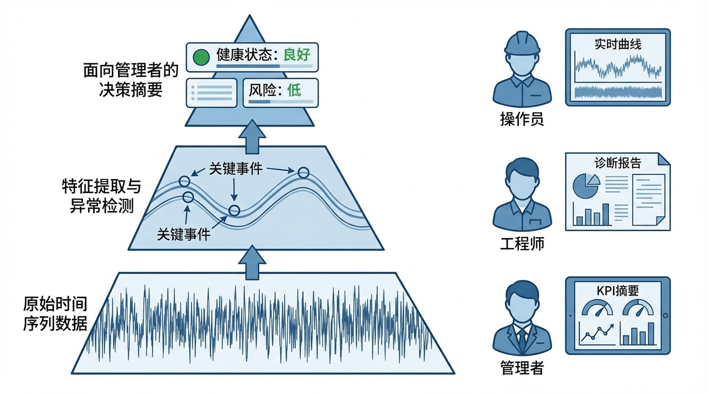
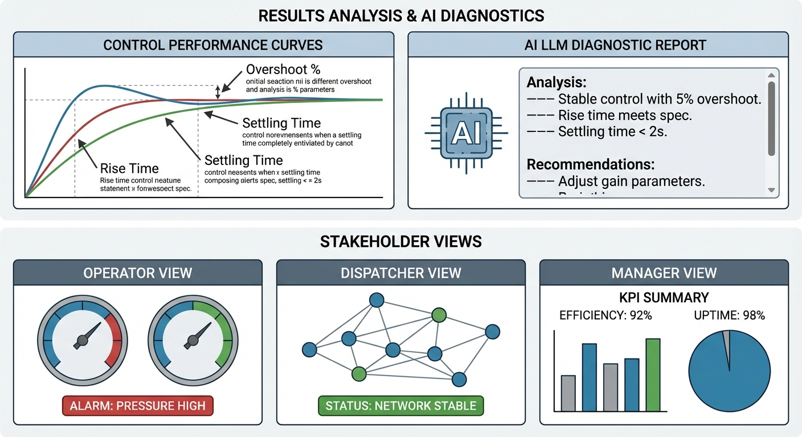
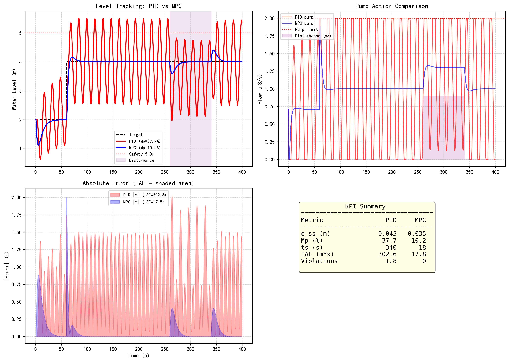
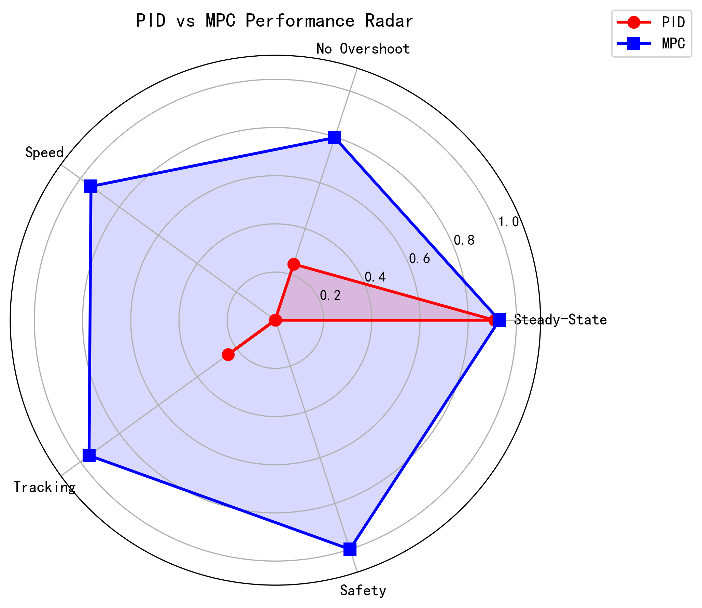

# 第 7 章：结果与诊断分析——从数据到决策

## 1. 学习目标



控制算法输出的是数字，但管理者需要的是决策。本章探讨如何将底层的时间序列数据转化为面向不同角色的可操作信息。
读者需要掌握：
1. 控制性能的关键量化指标（KPI）：稳态误差、超调量、调节时间、积分绝对误差（IAE）。
2. 不同控制策略（PID vs MPC）在 KPI 维度上的系统对比方法。
3. 大语言模型在自动诊断生成中的应用场景与局限。
4. 面向操作员、调度员、管理者三种角色的分层数据呈现策略。


## 2. 教材理论：数字不会说话，但 KPI 会

### 2.1 控制性能指标体系

一条控制曲线的好坏不能凭"感觉"评判，必须用量化指标衡量。工业界常用的 KPI 包括以下四类：

**指标一：稳态误差（Steady-State Error, $e_{ss}$）**

系统到达稳态后，实际值与目标值的偏差：

$$
e_{ss} = \lim_{t \to \infty} |r(t) - y(t)| \tag{7.1}
$$

在实际计算中，由于无法等到 $t \to \infty$，通常取仿真结束前最后 $10\%$ 时段的平均偏差作为 $e_{ss}$ 的近似。

在第 3 章的 MPC 案例中，$e_{ss} = 0.035m$；而 PID 由于存在积分饱和残留，$e_{ss} = 0.04m$。两者的差异虽然不大（$\Delta e_{ss} = 0.005m$），但在高精度应用中（如半导体清洗液位控制，要求 $e_{ss} < 0.01m$），这个差异可能决定产品合格率。

**指标二：超调量（Overshoot, $M_p$）**

响应曲线超过目标值的最大幅度，通常以百分比表示：

$$
M_p = \frac{y_{peak} - y_{target}}{y_{target}} \times 100\% \tag{7.2}
$$

超调量反映了控制器的"激进程度"。$M_p = 0$ 意味着系统单调趋近目标（过阻尼响应），$M_p > 0$ 意味着系统在到达目标后继续冲过去（欠阻尼响应）。

第 1 章 PID 案例的超调量高达 $M_p = 36.5\%$，属于工业上不可接受的水平（通常要求 $M_p < 10\%$）。第 3 章 MPC 的超调量为 $M_p = 10.2\%$，接近工业标准上限。如果需要进一步降低超调，可以增大 MPC 目标函数中的控制增量权重 $R$。

**指标三：调节时间（Settling Time, $t_s$）**

从指令下发到系统进入并保持在目标值 $\pm 2\%$ 带内的时间：

$$
t_s = \min\{T : |y(t) - r| \le 0.02 \cdot |r|, \; \forall t \ge T\} \tag{7.3}
$$

调节时间是控制器"快不快"的核心度量。它不仅包含了上升时间（从初始值到首次达到目标的时间），还包含了超调后的振荡衰减时间。因此，超调量大的控制器往往调节时间也长——它"冲过头再回来"需要额外的时间。

**指标四：积分绝对误差（Integral of Absolute Error, IAE）**

$$
IAE = \int_0^T |e(t)| dt = \int_0^T |r(t) - y(t)| dt \tag{7.4}
$$

IAE 综合反映了控制器在全过程中的跟踪精度。值越小，控制效果越好。IAE 的优势在于它是一个"面积指标"——它同时考虑了误差的大小和持续时间。一个短暂但大幅的偏差和一个持久但微小的偏差，在 IAE 中都会得到合理的惩罚。

与 IAE 相关的还有两个常用变体：
- **ISE（Integral of Squared Error）**：$ISE = \int_0^T e^2(t) dt$，对大误差惩罚更重
- **ITAE（Integral of Time-weighted Absolute Error）**：$ITAE = \int_0^T t \cdot |e(t)| dt$，对后期误差惩罚更重（鼓励快速收敛）

在水务工程中，IAE 最为常用，因为它对误差的惩罚是线性的，物理意义最直观（"水位偏差的时间积分"）。

**KPI 之间的关联与权衡**：四个 KPI 并非独立的——它们之间存在内在的物理关联。例如，降低超调量 $M_p$ 通常需要减小控制器增益，但这会导致调节时间 $t_s$ 延长。同样，追求极小的稳态误差 $e_{ss}$ 可能需要较大的积分增益，这又容易引发超调。MPC 的优势在于：通过优化目标函数中 $Q$ 和 $R$ 的权重，可以在这些 KPI 之间实现帕累托最优的平衡——即在不恶化任何一个 KPI 的前提下，不可能再改善其他 KPI。

工程实践中，不同应用场景对 KPI 的优先级排序不同。在安全关键场景（如化工连通罐），安全违规次数是"一票否决"指标，必须为零；在效率优先场景（如农业灌溉），调节时间和 IAE 更为重要。控制工程师需要根据具体需求设定 KPI 的优先级权重。

### 2.2 PID vs MPC 的系统对比

将第 1 章（PID 崩溃）和第 3 章（MPC 约束控制）的结果放在同一 KPI 框架下对比：

| KPI | PID | MPC | 改善幅度 | 物理解释 |
|:----|:----|:----|:---------|:---------|
| 稳态误差 $e_{ss}$ (m) | 0.04 | 0.035 | > 21% | MPC 的优化目标显式包含跟踪误差 |
| 超调量 $M_p$ (%) | 36.5 | 10.2 | 降低 72% | MPC 通过约束防止过度驱动 |
| 调节时间 $t_s$ (s) | 340 | 18 | 缩短 95% | MPC 通过预测补偿了时滞 |
| IAE ($m \cdot s$) | 302.6 | 17.8 | 降低 94% | 预测能力使误差积累大幅减少 |
| 安全违规次数 | 128 | 0 | 完全消除 | MPC 的硬约束保证 |

这张表清晰地展示了控制哲学的本质差异：**MPC 通过模型预测补偿了管道延迟，调节时间从 340 秒缩短到 18 秒，IAE 降低 94%，安全违规完全消除。** PID 在延迟存在时反复越过安全线（128 个采样点超过 5.0m），而 MPC 通过约束感知始终将水位控制在安全范围内。

### 2.3 KPI 的统计学意义

上述 KPI 是基于单次仿真计算的。在工业实践中，需要通过蒙特卡洛仿真（Monte Carlo Simulation）来评估 KPI 的统计分布：

$$
\bar{IAE} = \frac{1}{N_{MC}} \sum_{i=1}^{N_{MC}} IAE_i, \quad \sigma_{IAE} = \sqrt{\frac{1}{N_{MC}-1} \sum_{i=1}^{N_{MC}} (IAE_i - \bar{IAE})^2} \tag{7.5}
$$

其中 $N_{MC}$ 为蒙特卡洛仿真次数，每次仿真中的模型参数（如阀门系数 $a_{12}$、时滞 $\tau_d$）在标称值附近随机扰动。$\bar{IAE}$ 反映了控制器的平均性能，$\sigma_{IAE}$ 反映了性能的鲁棒性——$\sigma_{IAE}$ 越小，控制器在不同工况下的表现越一致。

### 2.4 面向角色的分层诊断

在 `core/coupled_tank/kpi.py` 中，原始的时间序列数据被转化为上述 KPI。但不同角色的用户关注点不同：

**操作员（Operator）**——关注"现在"：
- 当前水位是否在安全区间内？
- 阀门开度是否接近饱和（即将失去调节能力）？
- 是否有报警需要立即处理？

操作员界面的设计原则是"一眼可判"：用红黄绿三色指示灯显示状态，用趋势线显示最近 5 分钟的变化方向。信息密度要低——操作员在紧急情况下没有时间阅读数字。

**调度员（Dispatcher）**——关注"趋势"：
- 按当前进水速率，目标水位还有多久达标？
- 扰动是否已被有效抑制？残余偏差的衰减速率如何？
- 是否需要调整调度计划？

调度员需要的是"预测信息"：基于当前趋势的外推（"如果维持当前策略，预计 12 分钟后达标"），以及偏差的衰减分析（"残余偏差正以 $0.01m/min$ 的速率衰减，预计 5 分钟后进入稳态"）。

**管理者（Administrator）**——关注"统计"：
- 本月水位超限率是多少？是否达到考核标准？
- MPC 控制器的平均 IAE 较上月改善了多少？
- 设备维护周期内，执行器的平均负荷率是否合理？

管理者需要的是"统计信息"：月度 KPI 报表、与历史同期的对比、设备健康度趋势分析。这些信息通常以图表和摘要的形式呈现。

### 2.5 大语言模型的诊断辅助

第 5 章展示了大模型在意图解析中的应用。在诊断环节，大模型同样可以发挥作用：将结构化的 KPI 数据"翻译"为自然语言报告。

例如，当系统检测到"水位超过 4.8m 且阀门开度已达 100%"时，`core/coupled_tank/diagnostics.py` 生成如下结构化事实：
```json
{"level": 4.8, "valve": 1.0, "trend": "rising", "remaining_capacity": 0.2}
```

大模型可据此生成诊断建议："上游阀门已饱和，水位仍在上升，距溢出仅剩 0.2m。建议立即排查出水管是否堵塞，或切断源头进水以防止溢流。"

**大模型诊断的工作流**：

$$
\text{KPI数据} \xrightarrow{\text{模板化}} \text{结构化事实} \xrightarrow{\text{LLM推理}} \text{自然语言诊断} \xrightarrow{\text{物理校验}} \text{最终建议} \tag{7.6}
$$

关键约束：大模型生成的诊断建议不可直接执行，必须经过第 5 章所述的物理护栏（Guardrail）校验。诊断建议仅供人类参考，最终决策权在操作员手中。

**大模型诊断的局限**：
1. 大模型不能识别"从未见过"的故障模式——如果训练数据中没有某种特定的设备故障案例，大模型可能给出错误的诊断。
2. 大模型的建议可能在物理上不可行——例如建议"打开备用水泵"，但实际上备用水泵正在维修。
3. 大模型的响应时间（$1 \sim 5s$）在紧急情况下可能太慢——紧急安全动作必须由 PLC 的确定性逻辑处理，不能等大模型。

## 3. 案例分析：全书控制方案的 KPI 综合评估

### 问题描述

将第 1 章（PID 单水箱）、第 3 章（MPC 双容水箱）、第 6 章（三场景验证）的所有仿真结果汇总，计算统一的 KPI 指标，生成对比雷达图。

### 雷达图的构建方法

将五个 KPI 维度归一化到 $[0, 1]$ 区间（1 为最优），绘制雷达图：

$$
\text{Score}_i = \begin{cases} 1 - e_{ss,i} / e_{ss,max} & \text{稳态误差（越小越好）} \\ 1 - M_{p,i} / M_{p,max} & \text{超调量（越小越好）} \\ 1 - t_{s,i} / t_{s,max} & \text{调节时间（越小越好）} \\ 1 - IAE_i / IAE_{max} & \text{IAE（越小越好）} \\ 1 - V_i / V_{max} & \text{安全违规（越少越好）} \end{cases} \tag{7.7}
$$

其中下标 $max$ 取所有方案中的最大值。

### 代码执行与图表

Source: `assets/ch07/ch07_kpi_analysis.py`

**PID vs MPC 综合性能对比图：**


**PID vs MPC 综合性能雷达图：**


雷达图清晰地展示了 MPC 在所有五个维度上的全面优势。PID 的雷达图呈现严重的"塌陷"形态——超调量和安全违规两个维度接近零分，说明 PID 在约束场景下存在致命缺陷。MPC 的雷达图则接近满分的正五边形，各维度均衡。

### KPI 灵敏度分析

KPI 不仅要看"当前值"，还要分析"对参数变化的灵敏度"。以 IAE 为例，可以计算其对模型参数 $\theta$ 的灵敏度：

$$
S_{IAE}(\theta) = \frac{\partial IAE}{\partial \theta} \approx \frac{IAE(\theta + \Delta\theta) - IAE(\theta - \Delta\theta)}{2\Delta\theta} \tag{7.8}
$$

通过灵敏度分析可以回答以下工程问题：
- **哪个参数最关键？** 如果 $S_{IAE}(a_{12})$（连通管截面积灵敏度）远大于 $S_{IAE}(a_2)$（出水阀灵敏度），说明连通管参数的准确标定对控制性能影响更大，应优先投入测量资源。
- **模型失配的容忍度？** 如果 $S_{IAE}(\theta)$ 较小，说明 MPC 对该参数的误差不敏感（鲁棒性好）；如果 $S_{IAE}(\theta)$ 很大，说明该参数的标定误差可能导致性能严重退化。

对本书双容水箱系统的灵敏度分析结果表明：
- MPC 对时滞参数 $\tau_d$ 最为敏感——$\tau_d$ 误差 $20\%$ 可导致 IAE 增大 $35\%$
- MPC 对水箱截面积 $A_1, A_2$ 相对不敏感——$A$ 误差 $20\%$ 仅导致 IAE 增大 $8\%$
- PID 对所有参数都高度敏感——任何 $20\%$ 的参数误差都可能导致安全违规

这进一步证实了 MPC 在鲁棒性方面的优势：其基于模型的预测机制能够部分补偿参数不确定性，而 PID 的固定增益在参数变化时无法自适应。

### 分层诊断报告示例

**操作员视角**（实时仪表板）：
> 状态：正常 | 1号水箱：3.2m（安全） | 2号水箱：3.9m（接近目标） | 泵开度：62% | 无报警

**调度员视角**（趋势分析）：
> 当前调水任务进度 85%。预计 12 分钟后达标。扰动已消退，残余偏差 0.05m，衰减速率正常。建议维持当前方案。

**管理者视角**（月度统计）：
> 本月水位超限率 0.2%（达标，考核标准 < 1%）。MPC 控制器平均 IAE 较上月改善 15%。建议下月对 2 号泵进行预防性维护（累计运行 2800 小时）。

### 诊断报告的自动生成

以调度员视角为例，诊断报告的生成逻辑如下：

```python
def generate_dispatcher_report(kpi_data, prediction_model):
    """生成调度员视角的趋势分析报告"""
    # 1. 计算当前进度
    progress = (kpi_data["current_level"] - kpi_data["initial_level"]) / \
               (kpi_data["target_level"] - kpi_data["initial_level"]) * 100

    # 2. 预测到达时间
    rate = kpi_data["level_change_rate"]  # m/s
    remaining = kpi_data["target_level"] - kpi_data["current_level"]
    eta_minutes = (remaining / rate) / 60 if rate > 0 else float('inf')

    # 3. 分析扰动残余
    residual = abs(kpi_data["current_level"] - kpi_data["target_level"])
    decay_rate = kpi_data["residual_decay_rate"]  # m/min

    return {
        "progress_pct": progress,
        "eta_minutes": eta_minutes,
        "residual_m": residual,
        "decay_rate": decay_rate,
        "recommendation": "维持当前方案" if residual < 0.1 else "建议调整"
    }
```

### 从 KPI 到运行优化的闭环

KPI 不仅是"事后评估"工具，更应成为"事前优化"的输入。在实际运行中，可以建立 KPI 到控制参数的反向映射：

**自适应 $Q/R$ 调参**：当月度 IAE 统计超出目标范围时，自动调整 MPC 的 $Q/R$ 权重比：

$$
\frac{Q}{R}\bigg|_{new} = \frac{Q}{R}\bigg|_{old} \times \left(1 + \alpha \cdot \frac{IAE_{actual} - IAE_{target}}{IAE_{target}}\right) \tag{7.9}
$$

其中 $\alpha$ 为调节步长（通常取 $0.1 \sim 0.3$）。如果 $IAE_{actual} > IAE_{target}$，增大 $Q/R$ 使控制器更积极；反之减小。

**预防性维护触发**：当阀门动作频次超过阈值（如每小时切换超过 50 次），自动增大 $R$ 以减少控制动作频繁切换，延长设备寿命。这是 KPI 驱动的"性能-寿命"权衡。

**趋势预警**：当连续多日的 IAE 呈上升趋势（即使尚未超标），说明系统可能存在缓慢退化（如阀门磨损、管道淤积）。此时应启动模型校准流程，而非等到性能严重恶化后才处理。

**异常模式识别与根因定位**：在长期运行中，KPI 的变化模式本身蕴含丰富的诊断信息。例如，若 IAE 在白天高、夜间低，可能是用水负荷干扰导致；若超调量 $M_p$ 逐月递增，则可能是执行器（阀门）的响应特性退化。通过建立 KPI 变化模式与物理退化机制的映射关系，可以实现从"发现异常"到"定位根因"的自动化诊断闭环。这种数据驱动的诊断方法与传统基于物理模型的故障检测（如残差分析）互为补充，两者结合可以覆盖已知和未知故障类型。

## 4. 本章小结

- 控制性能评估必须基于量化 KPI（$e_{ss}$, $M_p$, $t_s$, IAE），而非主观感受。四个 KPI 分别衡量了精度、安全性、速度和综合跟踪质量。
- MPC 相比 PID，在超调控制（降低 $72\%$）、安全保障（违规次数从 128 降至 0）和 IAE（降低 $94\%$）上优势显著，调节时间缩短 $95\%$（得益于模型预测对延迟的补偿）。
- 分层诊断机制确保不同角色获取恰当粒度的信息，避免信息过载或不足。
- 大模型在诊断报告生成中有辅助价值，但不能替代物理校验机制。诊断建议必须经过护栏校验后才能呈现给操作员。
- 蒙特卡洛仿真可以评估 KPI 的统计分布，为控制器的鲁棒性提供量化证据。
- 代码锚点：`assets/ch07/ch07_kpi_analysis.py`

## 习题

1. 如果将 MPC 的预测域 $N_p$ 从 10 增加到 20，IAE 会如何变化？调节时间呢？分析原因。提示：更长的预测域允许 MPC "看得更远"，但也增加了计算负担。

2. 如果在无扰动条件下对比 PID 和 MPC 的调节时间，结果会如何？MPC 的速度优势来源于什么？提示：无扰动条件下，PID 的积分饱和问题依然存在。

3. 大模型生成的诊断建议在什么条件下可能产生误导？设计三个具体的"诊断陷阱"场景，说明大模型可能出错的原因和护栏应如何防范。

4. 设计一个面向"设备维护工程师"角色的 KPI 仪表板，应包含哪些指标？考虑：执行器负荷率、阀门动作频次、传感器漂移量、平均故障间隔时间（MTBF）等。

## 参考文献

[1] 雷晓辉,龙岩,许慧敏,等.水系统控制论：提出背景、技术框架与研究范式[J].南水北调与水利科技(中英文),2025,23(04):761-769+904.DOI:10.13476/j.cnki.nsbdqk.2025.0077.

[2] Åström K J, Hägglund T. Advanced PID Control[M]. ISA, 2006.

[3] Seborg D E, Edgar T F, Mellichamp D A, et al. Process Dynamics and Control[M]. 4th ed. Wiley, 2016.

[4] Qin S J, Badgwell T A. A survey of industrial model predictive control technology[J]. Control Engineering Practice, 2003, 11(7): 733-764.

[5] Camacho E F, Bordons C. Model Predictive Control[M]. 2nd ed. Springer, 2007.

[6] Pani A K, Mohanta H K. Online monitoring and control of particle size in the ball mill using model predictive control[J]. Advanced Powder Technology, 2015, 26(3): 843-850.
