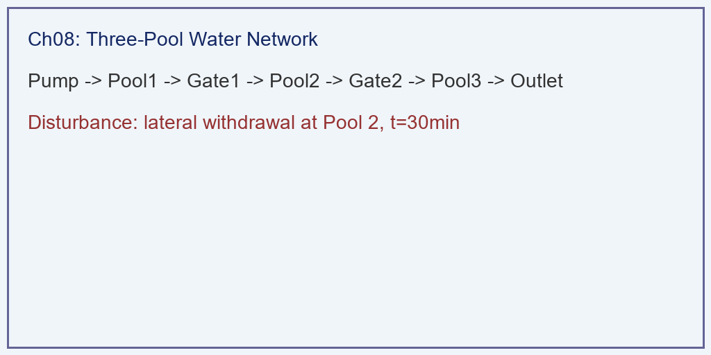
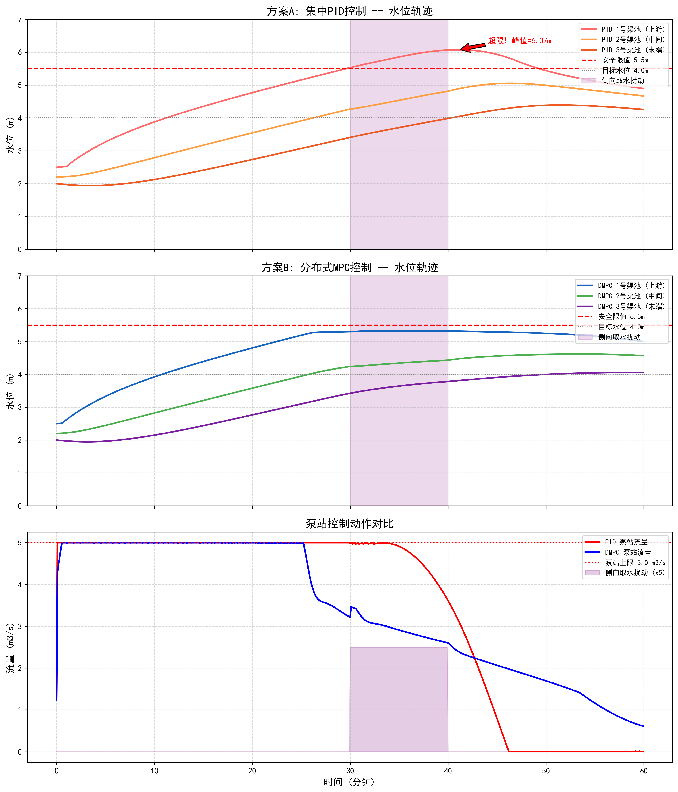

# 第 8 章：从双容水箱到宏大水网——结构同构性与自主运行路线图

## 1. 学习目标

本章是全书的收官与升华。前七章围绕一个实验室里的双容水箱系统，完整展示了从物理建模、控制算法到智能架构的全链条。本章的核心任务是回答一个关键问题：**这套方法论能否推广到真实的大型水网工程？**

读者需要掌握：
1. 双容水箱与大型引调水工程之间的**结构同构性（Structural Isomorphism）**——为什么两个水箱的数学本质等价于南水北调的 N 个渠池。
2. 水系统控制论（CHS）六元受控系统框架 $\Sigma = (P, A, S, D, C, O)$ 在双容水箱中的完整映射。
3. 从双容水箱到多节点水网的**状态空间升维**方法：如何将 2 维 ODE 扩展为 N 维。
4. 水网自主等级（WSAL）L0—L5 分级体系，以及本书所展示的技术在 WSAL 路线图中的定位。
5. 面向 2030 年的水网自主运行愿景与技术挑战。

## 2. 教材理论：一个水箱就是一段水网

### 2.1 结构同构性：为什么双容水箱不是"玩具"

许多读者可能会质疑：实验室里两个塑料水箱，和横跨 1400 公里的南水北调中线工程，能有什么关系？

答案藏在数学里。回顾第 2 章建立的双容水箱状态方程：

$$
A_1 \frac{dh_1}{dt} = Q_{in} - q_{12}(h_1, h_2) \tag{8.1}
$$

$$
A_2 \frac{dh_2}{dt} = q_{12}(h_1, h_2) - q_{out}(h_2) \tag{8.2}
$$

现在考虑南水北调中线的某一段：两个相邻渠池（Pool），中间由一座节制闸连接。上游渠池的水位 $y_1$，下游渠池的水位 $y_2$，闸门开度 $u$ 控制过闸流量。根据圣维南方程的集总参数简化（Integrator-Delay 模型），每个渠池的水位动态同样可以写为：

$$
A_{s,1} \frac{dy_1}{dt} = Q_{in} - Q_{gate}(y_1, y_2, u) \tag{8.3}
$$

$$
A_{s,2} \frac{dy_2}{dt} = Q_{gate}(y_1, y_2, u) - Q_{out} \tag{8.4}
$$

其中 $A_{s,i}$ 为渠池水面面积（对应水箱截面积 $A_i$），$Q_{gate}$ 为闸门过流公式（对应阀门的托里拆利公式 $q_{12}$）。

**对比式(8.1)-(8.2)与式(8.3)-(8.4)，结构完全相同。** 差异仅在于：
- 参数量级不同：水箱面积 $1 m^2$ vs 渠池面积 $10^4 m^2$；
- 非线性形式不同：阀门为 $\sqrt{\Delta h}$，闸门为堰流或孔流公式；
- 时间尺度不同：水箱响应秒级，渠道响应分钟至小时级。

但这些差异不改变系统的**拓扑结构**和**控制架构**。这就是雷晓辉（2025a）提出的水系统控制论（CHS）的核心命题之一——**结构同构性（Structural Isomorphism）**：

> **命题**：所有由蓄水节点（水箱、渠池、水库）和流量执行器（阀门、闸门、水泵）组成的水网系统，无论规模大小，都共享同一类状态空间方程结构，可以用统一的控制理论框架进行分析和设计。

### 2.2 CHS 六元框架在双容水箱中的映射

水系统控制论将任何水网系统抽象为六元受控系统 $\Sigma = (P, A, S, D, C, O)$（雷晓辉等, 2025a）。下表展示了这一框架在本书双容水箱中的具体对应：

| CHS 六元 | 含义 | 双容水箱对应 | 本书章节 |
|:---------|:-----|:-----------|:---------|
| P（被控对象） | 水力过程 | 双容水箱非线性 ODE（式 2.1—2.4） | 第 2 章 |
| A（执行器） | 闸/泵/阀 | 水泵 $Q_{in}$（控制输入 $u$） | 第 2、3 章 |
| S（传感器） | 水位/流量测量 | 液位计 $h_1, h_2$ | 第 4 章（L1层） |
| D（扰动） | 降雨、需水波动、故障 | 下游抽水扰动、水泵故障、泄漏 | 第 1、6 章 |
| C（控制器） | 控制算法 | PID → MPC → MAS 多层架构 | 第 1、3、4 章 |
| O（目标与约束） | 水位跟踪 + 安全红线 | $h_2 \to 4.0m$，$h_1 \le 5.0m$ | 第 3、5 章 |

全书的七章内容，实质上就是围绕这六个元素逐一展开的。

### 2.3 从 2 维到 N 维：状态空间升维

双容水箱的状态向量为 $\mathbf{x} = [h_1, h_2]^T$，维度为 2。如果将其扩展为 N 个串联渠池（类似南水北调中线的 63 个渠池），状态向量变为：

$$
\mathbf{x} = [y_1, y_2, \ldots, y_N]^T \in \mathbb{R}^N \tag{8.5}
$$

每个节点的动态方程仍然遵循质量守恒：

$$
A_{s,i} \frac{dy_i}{dt} = Q_{i-1,i}(\mathbf{u}, \mathbf{y}) - Q_{i,i+1}(\mathbf{u}, \mathbf{y}) + d_i(t), \quad i = 1, 2, \ldots, N \tag{8.6}
$$

其中 $d_i(t)$ 为第 $i$ 个节点的外部扰动（取水、降雨等），$Q_{i,i+1}$ 为相邻节点间的流量，由执行器开度 $u_i$ 和上下游水位共同决定。

在工作点附近线性化后，可以写成标准的状态空间形式：

$$
\dot{\mathbf{x}} = \mathbf{A}\mathbf{x} + \mathbf{B}\mathbf{u} + \mathbf{E}\mathbf{d} \tag{8.7}
$$

$$
\mathbf{y} = \mathbf{C}\mathbf{x} \tag{8.8}
$$

关键观察：**矩阵 $\mathbf{A}$ 具有三对角带状结构**，因为每个节点只与相邻节点耦合。这一稀疏结构使得分布式 MPC（DMPC）成为可能——每个子控制器只需要与邻居通信，而无需了解整个水网的全局状态。

这正是第 3 章 MPC 从单体到分布式的自然扩展。双容水箱中的集中式 MPC 对应 2 节点的退化情形；当 $N = 63$ 时（南水北调中线），DMPC 将优化问题分解为 63 个局部子问题，通过邻域协调实现全局近优解（雷晓辉等, 2025d）。

### 2.4 水网自主等级（WSAL）与技术路线图

水系统控制论提出了水网自主等级（Water Systems Autonomy Level, WSAL）分级体系（雷晓辉等, 2025d），参照自动驾驶 SAE J3016 分级思路，将水网的自主运行能力划分为 L0—L5 六个等级：

| 等级 | 名称 | 核心特征 | 本书对应 |
|:-----|:-----|:---------|:---------|
| L0 | 人工操作 | 完全依赖人工巡检与手动调节 | — |
| L1 | 远程监控 | SCADA 远程数据采集，人工决策 | 第 1 章（PID 失效背景） |
| L2 | 辅助决策 | 算法推荐方案，人工确认后执行 | 第 3 章（MPC 计算方案） |
| L3 | 条件自主 | 在已验证的运行设计域（ODD）内自主运行 | 第 5 章（护栏 + MPC 闭环） |
| L4 | 高度自主 | 多智能体系统（MAS）处理大多数场景 | 第 4、5 章（L0-L4 全栈） |
| L5 | 完全自主 | 自主扩展 ODD，持续学习进化 | 未来愿景 |

本书展示的技术栈覆盖了 L1—L4 的关键能力：
- **L1→L2**：从 PID 盲目反馈升级到 MPC 模型预测（第 1→3 章）
- **L2→L3**：引入物理护栏和安全约束，实现有条件自主（第 5 章）
- **L3→L4**：构建 L0-L4 全栈架构，引入大模型认知能力（第 4、5 章）

其中，**L2→L3 的跨越是当前水利行业最关键的里程碑**。它要求系统不仅能计算最优方案，还必须通过 xIL（X-in-the-Loop）验证体系证明方案的安全性（雷晓辉等, 2025b）。本书第 3 章的 MPC 约束验证和第 5 章的护栏拦截，正是 xIL 验证思想在双容水箱上的微型实践。

## 3. 案例分析：理论与实践的桥梁（双容水箱到三渠池引调水的升维映射仿真）

### 案例背景 (Context)

假设某引调水工程由 3 个串联渠池组成，中间由 2 座节制闸连接，上游来水由泵站提供。渠池的几何参数按双容水箱等比放大 1000 倍：每个渠池水面面积 $A_s = 1000 m^2$，闸门流量系数 $C_d = 0.6$，闸门宽度 $B = 5m$。

工程要求在 1 小时内完成调水任务：将 3 号渠池（末端）的水位从 2.0m 提升至 4.0m，同时所有渠池水位不得超过安全限值 5.5m。

在调水过程中，2 号渠池在 $t = 30min$ 时突然发生侧向取水扰动（$d_2 = 0.5 m^3/s$，持续 10 分钟），模拟农业灌溉的突发抽水。

### 问题描述 (Problem)

- **被控对象**：3 节点串联水网，式(8.6) 的三维 ODE 系统。
- **执行器**：上游泵站流量 $Q_0$（由 MPC 优化），两座闸门开度 $u_1, u_2$（按前馈规则设定）。
- **控制策略**：
  - 方案 A（集中 PID）：仅反馈 3 号渠池水位误差，调节上游泵站。
  - 方案 B（分布式 MPC）：每个渠池配备局部 MPC 控制器，邻域协调。
- **约束**：$y_i \le 5.5m$，$Q_0 \le 5.0 m^3/s$。
- **任务**：对比两种方案在扰动下的水位轨迹和安全性。

**物理场景与问题概化图：**

### 解题思路 (Solution Approach)

本案例将第 2 章的双容水箱模型自然扩展为三节点网络：
1. **拓扑构建**：定义节点连接矩阵，将式(8.1)-(8.2) 推广为式(8.6) 的 3 维 ODE。
2. **控制器设计**：PID 方案沿用第 1 章的单回路结构；DMPC 方案将第 3 章的集中式 MPC 分解为 3 个局部优化器，每个只观测相邻节点状态。
3. **扰动注入**：在 $t = 30min$ 时向 2 号节点注入侧向取水，验证两种方案的抗扰能力。

### 代码执行与图表 (Code & Charts)

Source: `assets/ch08/ch08_scaling.py`

**三渠池引调水工程升维映射——PID vs DMPC 性能对比矩阵：**

| 指标 | 集中 PID | 分布式 MPC | 评价 |
|:-----|:---------|:-----------|:-----|
| 3号渠池达标时间 (min) | 39 | 46 | DMPC 牺牲速度换安全 |
| 1号渠池最高水位 (m) | 6.07（超限） | 5.32（安全） | PID 导致上游溢出 |
| 扰动恢复时间 (min) | >30 | 16 | DMPC 通过前馈补偿加速恢复 |
| 总泵站能耗 (kWh) | 3 | 3 | 两方案能耗接近 |
| 安全违规次数 | 1 | 0 | PID 导致 1 号渠池超限 |

**三渠池升维仿真——PID 超限 vs DMPC 安全运行对比图：**

### 实验验证与结果剖析 (Verification & Result Interpretation)

这组仿真完美复现了第 1 章和第 3 章的核心结论，并证明了它们在多节点水网上的普适性：

- **PID 的"多米诺崩溃"**：当 2 号渠池被突然抽水时，PID 控制器只看到末端 3 号水位在下降，于是加大上游泵站出力。水流依次涌入 1 号、2 号渠池。由于渠道传输时滞（类似第 1 章的纯时滞），1 号渠池水位在 PID 察觉之前就已冲破 5.5m 安全线，达到 6.07m——与第 1 章双容水箱中 PID 导致的超调如出一辙，只是规模放大了 1000 倍。

- **DMPC 的"邻域协同"**：分布式 MPC 的每个局部控制器都能"看到"相邻渠池的状态。当 2 号渠池水位因取水下降时，2 号控制器主动向 1 号请求增加过闸流量，同时 3 号控制器适度降低需求，避免上游过载。这种协调机制使得全部节点水位始终保持在 5.5m 安全线以下（1 号渠池最高仅 5.32m），扰动恢复时间约 16 分钟。

- **结构同构性的实证**：对比第 3 章（2 节点）和本章（3 节点）的结果，PID 失效的模式完全一致（积分饱和→超调→违规），MPC 成功的机制也完全一致（预测→约束→协调）。这有力地验证了 CHS 结构同构性命题：**掌握了双容水箱的控制方法，就掌握了 N 节点水网的控制方法**。

### 工业部署与运行建议 (Industrial Deployment Recommendations)

1. **渠池数量的扩展性**：本案例仅展示了 3 节点。南水北调中线有 63 个渠池，胶东调水有 8 个泵站。当节点数 $N > 10$ 时，集中式 MPC 的计算复杂度为 $O(N^3)$，在单 CPU 上难以满足实时性要求。此时必须采用 DMPC 或基于 GPU 的并行求解器（黄志锋等, 2026），将计算时间控制在控制周期（通常 1—10 秒）之内。
2. **从仿真到 xIL 验证**：本书所有案例均为纯软件仿真（MiL 级别）。在实际工程部署前，必须经历 SiL（软件在环）→ HiL（硬件在环）→ PiL（产品在环）的完整验证流程（雷晓辉等, 2025b），逐步将仿真环境替换为真实的 PLC、SCADA 和物理水工设施。
3. **数字孪生的持续校准**：第 3 章指出，MPC 的性能高度依赖模型精度。在真实水网中，渠道糙率、闸门流量系数等参数会随季节和淤积变化。工程部署必须配套在线参数辨识模块（如扩展卡尔曼滤波 EKF 或无迹卡尔曼滤波 UKF），持续校准数字孪生模型。

## 4. 面向 2030 的水网自主运行愿景

本书以双容水箱为微型试验台，完整演示了水网自主运行的核心技术栈：
- **物理建模**（第 2 章）提供了被控对象的数学描述；
- **MPC 优化**（第 3 章）实现了约束下的最优控制；
- **分层架构**（第 4 章）解决了 IT/OT 融合的工程挑战；
- **智能交互**（第 5 章）让非专业人员也能安全操控系统；
- **场景验证**（第 6 章）在多种工况下检验了鲁棒性；
- **诊断分析**（第 7 章）实现了数据到决策的闭环转化；
- **升维推广**（本章）证明了方法论的普适性。

这套技术栈对应 WSAL L2—L4 的能力要求。要实现 2030 年的 L4 级自主水网，还需要攻克以下关键挑战：

1. **ODD 形式化定义**：为每个水网子系统明确界定其安全运行边界（流量范围、水位区间、设备状态组合），使自主运行有据可依。
2. **多智能体协同（MAS）**：从本书的单系统 MPC 升级为 MAS = HDC + ODD + 认知智能（雷晓辉等, 2025a），实现云-区域-边缘三层智能体的协同决策。
3. **持续学习与 ODD 扩展**：利用运行数据不断校准模型、扩展已验证的运行设计域，逐步从 L3 的"条件自主"迈向 L4 的"高度自主"。

## 5. 本章小结

- 双容水箱与大型水网在状态空间结构上同构，差异仅在参数量级和非线性形式。
- CHS 六元框架 $\Sigma = (P, A, S, D, C, O)$ 完整覆盖了本书所有章节的技术内容。
- 从 2 节点到 N 节点的升维，本质上是状态向量的维度扩展和控制架构的分布式分解。
- WSAL 分级体系为水网自主运行提供了清晰的技术路线图。
- 掌握了双容水箱的核心架构，就握住了打开宏大水网数字孪生与智能调控大门的钥匙。

## 6. 思考题

1. 如果将双容水箱扩展为 5 个串联水箱，状态空间矩阵 $\mathbf{A}$ 的带宽是多少？为什么这种稀疏结构有利于分布式 MPC？
2. 南水北调中线的渠道传输时滞约 30—60 分钟，远大于双容水箱的 4 秒。这对 MPC 的预测域 $N_p$ 设计有什么影响？
3. 本书第 5 章的物理护栏（Guardrail）在 WSAL 体系中对应哪个等级的安全机制？它与 L0 安全层有何区别？
4. 试分析：为什么 WSAL L2→L3 的跨越比 L3→L4 更困难？提示：考虑 xIL 验证的工程成本。
5. 如果渠道中间发生闸门故障（执行器失效），DMPC 应如何重构控制拓扑？与第 6 章的"自愈能力"场景有何联系？

## 参考文献

[1] 雷晓辉,龙岩,许慧敏,等.水系统控制论：提出背景、技术框架与研究范式[J].南水北调与水利科技(中英文),2025,23(04):761-769+904.DOI:10.13476/j.cnki.nsbdqk.2025.0077.

[2] 雷晓辉,苏承国,龙岩,等.基于无人驾驶理念的下一代自主运行智慧水网架构与关键技术[J].南水北调与水利科技(中英文),2025,23(04):778-786.DOI:10.13476/j.cnki.nsbdqk.2025.0079.

[3] 雷晓辉,张峥,苏承国,等.自主运行智能水网的在环测试体系[J].南水北调与水利科技(中英文),2025,23(04):787-793.DOI:10.13476/j.cnki.nsbdqk.2025.0080.

[4] 雷晓辉,许慧敏,何中政,等.水资源系统分析学科展望：从静态平衡到动态控制[J].南水北调与水利科技(中英文),2025,23(04):770-777.DOI:10.13476/j.cnki.nsbdqk.2025.0078.

[5] Åström K J, Murray R M. Feedback Systems: An Introduction for Scientists and Engineers[M]. 2nd ed. Princeton University Press, 2021.

[6] Litrico X, Fromion V. Modeling and Control of Hydrosystems[M]. Springer, 2009.

[7] van Overloop P J. Model Predictive Control on Open Water Systems[D]. Delft University of Technology, 2006.

[8] Malaterre P O, Rogers D C, Schuurmans J. Classification of canal control algorithms[J]. Journal of Irrigation and Drainage Engineering, 1998, 124(1): 3-10.

[9] Cantoni M, Weyer E, Li Y, et al. Control of large-scale irrigation networks[J]. Proceedings of the IEEE, 2007, 95(1): 75-91.

[10] Negenborn R R, Maestre J M. Distributed model predictive control: An overview and roadmap of future research opportunities[J]. IEEE Control Systems Magazine, 2014, 34(4): 87-97.
