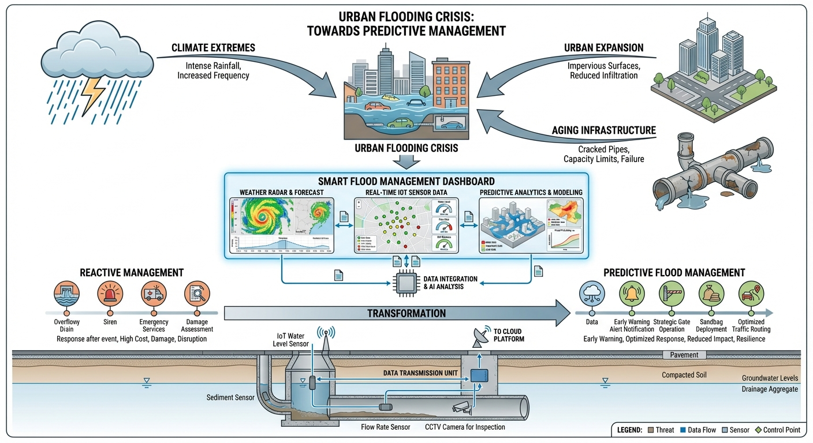
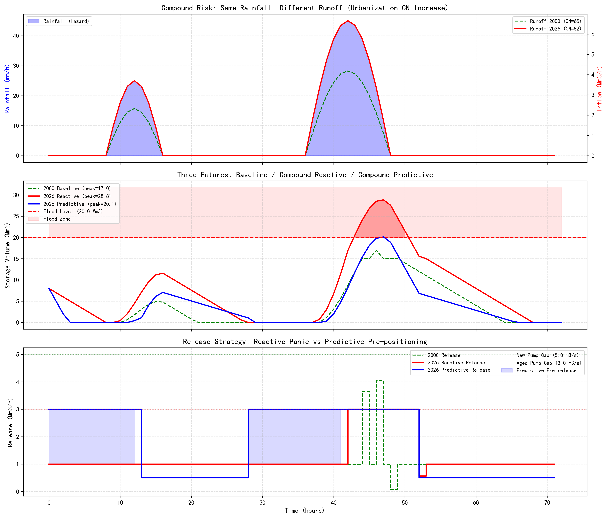

# 第 1 章：2026 年的智能水文为什么重要：当三重危机同时敲门

## 1. 学习目标
本章回答一个根本性问题：为什么传统的"看到洪水才开泵"模式在 2026 年已经行不通了？答案是**复合风险**——气候极端化、城市硬化和设施老化三重危机叠加，导致同样一场暴雨，今天造成的灾害远超 20 年前。
读者需要掌握：
1. 复合风险公式：$\text{Risk} = \text{Hazard} \times \text{Exposure} \times \text{Vulnerability}$，以及三个因子如何同步恶化。
2. 反应式调度（Reactive）与预测性调控（Predictive）的本质区别。
3. 水文智能（Hydrology Intelligence）的四层架构：机理层、数据层、决策层、证据层。
4. 城市化（CN 值增大）与设施老化（泵站衰减）如何将安全裕度"吃干榨尽"。

## 2. 教材理论：三重危机——同一场暴雨，不同的结局

### 2.1 气候极端化（Hazard 加剧）

过去 50 年，极端降雨事件的频率和强度都在持续上升。以华北地区为例，日降雨量超过 100mm 的"特大暴雨"天数从 1970 年代的年均 0.3 天增加到 2020 年代的年均 1.2 天——增长了 4 倍。这意味着，设计标准为"百年一遇"的排水系统，实际上可能每 20 年就会遭遇一次超标洪水。

从水文统计学的角度看，极端降雨的非平稳性（Non-stationarity）正在动摇传统设计的理论基础。经典水文频率分析假设降雨序列满足独立同分布（i.i.d.）条件，但气候变化导致分布参数本身随时间漂移。IPCC 第六次评估报告指出，全球平均每升温 1°C，大气持水能力增加约 7%（Clausius-Clapeyron 关系），这直接导致极端降雨强度的系统性增大。

对于水文工程师而言，这意味着一个残酷的事实：过去用 30 年观测数据拟合的 P-III 型频率曲线，可能已经无法准确描述未来 30 年的降雨特征。设计重现期的"通货膨胀"——名义上的百年一遇洪水，实际重现期可能已缩短至 50 年甚至 30 年——正在悄然侵蚀所有基于历史数据设计的水利工程的安全裕度。

### 2.2 城市硬化（Exposure 扩大）

当一片森林变成一座城市，地表的水文响应会发生根本性改变。水文学用**曲线数 CN 值**来量化这种变化：
- **2000 年**：该流域以农田和林地为主，CN = 65。暴雨落下后，大量雨水被土壤吸收，产流比例较低。
- **2026 年**：同一流域已被水泥和沥青覆盖，CN = 82。同样的暴雨，几乎所有雨水都变成了地表径流，洪峰流量成倍增长。

产流比例与 CN 值的关系近似为径流系数 $RC \approx (CN/100)^2$。CN 从 65 增加到 82，$RC$ 从 0.42 增加到 0.67——径流量增加了 **60%**。

城市硬化带来的水文效应不仅仅是产流量增大。更深层的变化包括三个维度：

**（1）汇流时间缩短**。天然流域的汇流时间 $t_c$ 与坡面糙率和坡长有关。森林覆盖的山坡，水流要在落叶层和腐殖质中缓慢渗流，汇流时间可能长达数小时。而城市的水泥路面和排水管网形成了高效的"快速通道"，同等面积的汇流时间可能缩短到原来的 $1/3$ 甚至 $1/5$。汇流加速意味着洪峰到来更快，留给防汛决策的窗口时间急剧压缩。

**（2）洪峰尖锐化**。天然流域的单位线呈宽缓的钟形，峰值低、持续时间长。城市化后的单位线变成尖锐的三角形，峰值高、上升陡、退水快。同样的降雨总量，城市流域的洪峰流量可能是天然流域的 3-5 倍。

**（3）基流减少**。不透水面阻断了降雨对地下水的补给通路。长期来看，城市化流域的枯水期基流持续下降，河道在旱季可能完全断流，加剧了水资源供需矛盾。

### 2.3 设施老化（Vulnerability 恶化）

与此同时，大量建于 2000 年代的排水泵站正在进入老化期。泵叶磨损、管道锈蚀、电机效率下降，导致实际排水能力从设计值的 100% 衰减到 60% 甚至更低。更糟糕的是，这种衰减是渐进的、隐蔽的——直到洪水来临时才暴露。

设施老化的定量描述可以用**衰减函数**来刻画。假设泵站的初始设计排水能力为 $Q_0$，服役年限为 $t$（年），则实际排水能力可近似表示为：

$$
Q(t) = Q_0 \cdot e^{-\lambda t} \tag{1.2}
$$

其中 $\lambda$ 是衰减常数，取决于设备材质、维护频率和运行工况。对于典型的铸铁泵站，$\lambda \approx 0.02$，意味着 25 年后的实际能力仅为设计值的 $e^{-0.5} \approx 60\%$。

更值得警惕的是**共因失效（Common Cause Failure）**问题。同一批次建设的泵站往往采用相同的设备供应商和设计标准，当它们同时进入老化期时，整个城市的排水能力可能在同一时段集体下降。这种系统性衰减无法通过冗余设计来规避——因为冗余设备本身也在同步老化。

三重危机的叠加效应可以用公式表达：

$$
\text{Risk}_{2026} = \underbrace{H_{2026}}_{\text{极端降雨} \uparrow} \times \underbrace{E_{2026}}_{\text{城市硬化} \uparrow} \times \underbrace{V_{2026}}_{\text{设施老化} \uparrow} \gg \text{Risk}_{2000} \tag{1.1}
$$

### 2.4 从"被动响应"到"预测性调控"

传统的被动响应模式（Reactive Control）是：水位涨到警戒线 → 人工研判 → 下达命令 → 开泵排水。这个流程的致命缺陷是**时间滞后**：从发现到动作的延迟可能长达 30 分钟，而洪峰到达只需要 15 分钟。

预测性调控（Predictive Control）则将决策前置：气象预报 → 水文模型预测洪峰到达时间和量级 → 提前 6-12 小时开始预泄洪腾出库容 → 洪水来临时已有充足缓冲空间。

预测性调控的数学本质是**模型预测控制（MPC）**。MPC 的核心思想可以用以下优化问题描述：在每个决策时刻 $k$，求解一个有限时域的最优控制序列 $\{u_k, u_{k+1}, \ldots, u_{k+N_p-1}\}$，使得未来 $N_p$ 步（预测时域）内的目标函数 $J$ 最小化：

$$
J = \sum_{i=0}^{N_p-1} \left[ w_s \cdot \max(V_{k+i} - V_{\max}, 0)^2 + w_e \cdot c_{k+i} \cdot P_{k+i} \right] \tag{1.3}
$$

其中 $V$ 是蓄水池库容，$V_{\max}$ 是安全上限，$c$ 是电价，$P$ 是泵站功率，$w_s$ 和 $w_e$ 分别是安全权重和经济权重。MPC 的关键优势在于它能将未来的气象预报信息纳入当前决策——这正是"预见性"的数学实现。

这就是"水文智能"的核心价值——不是用 AI 替代水泵，而是**用预见性弥补物理设施的不足**。

### 2.5 水文智能的四层架构

水文智能（Hydrology Intelligence）不是一个算法，而是一套完整的工程体系：

| 层级 | 功能 | 关键技术 | 对应章节 |
|:-----|:-----|:---------|:---------|
| 机理层 | 产汇流、河道演进、地下水交换 | SCS-CN、Nash IUH、Saint-Venant | 第 3、5 章 |
| 数据层 | 多源融合、语义声明、质量标识 | MBD、Quality Flags、拓扑排序 | 第 2、4 章 |
| 决策层 | 预报、优化调度、告警、MPC | LSTM、集合预报、MPC、动态规划 | 第 5、6 章 |
| 认知层 | MCP 协议、Skill、Agent、人机协同 | LLM、Schema、SOP、MAS | 第 8、9、10 章 |

四层架构之间的关系不是简单的堆叠，而是一个**自底向上的信任传递链**。机理层保证物理规律不被违反，数据层保证输入信息不被污染，决策层在前两层的支撑下进行最优调控，认知层则为人类决策者提供自然语言交互界面和专家级分析能力。任何一层的失效都会导致上层的决策质量下降，因此每一层都必须配备独立的质量保障机制。

### 2.6 水文智能的实施路径：从 L1 到 L3

水文智能的建设不是一步到位的"交钥匙工程"，而是一条循序渐进的演化路径。参照水系统自主等级（WSAL）分类体系，一个典型城市的智能水文系统需要经历三个阶段：

**L1 阶段（远程监控）**：部署 SCADA 系统和遥测终端，实现水位、流量、降雨等关键参数的实时采集和远程查看。这一阶段的核心能力是"看得见"——值班员可以在中心屏幕上看到全市所有泵站和水库的实时状态，但所有调度决策仍由人工完成。大多数中小城市目前处于这一阶段。

**L2 阶段（辅助决策）**：在 L1 的基础上叠加水文预报模型和优化调度算法。系统能够根据气象预报自动生成调度方案，但方案必须经过人工确认后才能执行。这一阶段的核心能力是"算得出、推得准"——AI 扮演"参谋"角色，人类保留最终决策权。

**L3 阶段（有条件自主）**：在经过充分的 xIL 验证后，系统可以在已验证的运行设计域（ODD）内自主执行调度方案，无需逐次人工确认。但当系统遇到超出 ODD 的未知场景时，必须自动降级为 L2 模式并请求人工介入。

从 L2 到 L3 的跨越是整个演化路径中最关键也最困难的一步——它不仅需要技术上的充分验证，还需要法规制度的配套支撑。

**L2→L3 跨越的核心难题是"信任量化"。** 在 L2 阶段，人类决策者可以通过经验判断来弥补模型的不足——即使模型推荐了一个不合理的调度方案，有经验的值班长也能识别并纠正。但在 L3 阶段，系统在 ODD 内自主执行，这意味着必须用严格的数学方法证明：在已验证的运行条件范围内，系统的决策质量不低于人类专家。

实现这种信任量化的工程方法是 **xIL（X-in-the-Loop）验证体系**。xIL 包含四个递进的验证层次：MiL（模型在环）验证算法逻辑正确性；SiL（软件在环）验证软件实现与算法设计的一致性；HiL（硬件在环）验证控制器与物理设备的接口兼容性；PiL（平台在环）在真实或半真实环境中验证全系统的综合性能。每个层次都要求通过预定义的测试场景库——包括常规工况、极端工况和故障工况——只有全部通过后，才能将对应的运行条件纳入 ODD 的"已验证边界"。

另一个关键挑战是 **ODD 的动态边界管理**。水利系统的运行环境不是静态的：设施会老化（第 1 章讨论的衰减函数），气候在变化（非平稳性），城市在扩张（CN 值增大）。因此，ODD 的边界必须定期重新评估。当系统检测到当前运行条件已经偏移出 ODD 边界时——例如泵站效率下降到验证时假设值的 80% 以下——必须自动触发降级机制，从 L3 回退到 L2，由人类重新介入决策。这种"主动降级"能力是 L3 系统安全运行的最后一道防线。

## 3. 案例分析：理论与实践的桥梁（复合风险下反应式 vs 预测式防洪对决）

### 案例背景 (Context)
某中型城市的蓄水池在 2000 年建成时，设计工况是"CN=65 的农田流域 + 全新泵站"。如今 26 年过去了，流域城市化导致 CN 升至 82，泵站实际排水能力从设计值的 5.0 Mm3/h 衰减到 3.0 Mm3/h。一场与 2000 年相同强度的双波暴雨（72 小时）即将来临。

### 问题描述 (Problem)
- **流域面积**：220 $km^2$。蓄水池库容 30 百万 $m^3$，洪水位 20 百万 $m^3$。
- **暴雨事件**：第一波（$t=8\sim16h$，峰值 25 mm/h），第二波（$t=36\sim48h$，峰值 45 mm/h）。
- **场景 1（2000 基准）**：CN=65，泵站 5.0 Mm3/h，反应式调度。
- **场景 2（2026 复合+反应）**：CN=82，泵站 3.0 Mm3/h，反应式调度。
- **场景 3（2026 复合+预测）**：CN=82，泵站 3.0 Mm3/h，预测性调控（12h 前瞻）。
- **任务**：对比三种场景下蓄水池的峰值库容、洪水持续时间、调度策略差异。

### 解题思路 (Solution Approach)
1. **产流模型**：用 $RC = (CN/100)^2$ 将降雨转化为入流。
2. **反应式控制器**：水位超过警戒线才加大泄流，否则维持基流。
3. **预测性控制器**：12 小时前瞻，预测未来库容峰值，提前满负荷预泄洪。
4. **三场景对比**：量化复合风险的放大效应和预测性调控的缓解效果。

### 代码执行与图表 (Code & Charts)
> **学习提示**：请关注中间子图的三条曲线。绿色虚线（2000 基准）安全地停在 17 Mm3；红色线（2026 反应式）暴冲到 28.8 Mm3，远超 20 Mm3 的洪水位，持续 8 小时；蓝色线（2026 预测式）虽然同样面对衰减的泵站，但通过提前预泄洪，峰值仅 20.1 Mm3——勉强守住了防线。

Source: `assets/ch01/ch01_risk_profile.py`

**三种场景下复合风险量化与预测性调控效果矩阵：**

| 场景 | 峰值库容 (Mm3) | 洪水持续 (h) | 状态 |
|:-----|:---------------|:------------|:-----|
| 2000：新泵站 + 反应式 | 17.0 | 0 | 安全 |
| 2026：老泵站 + 反应式 | 28.8 | 8 | 洪水！ |
| 2026：老泵站 + 预测式 | 20.1 | 1 | 勉强安全 |

**复合风险放大效应与预测性调控缓解全链路仿真图：**

### 实验验证与结果剖析 (Verification & Result Interpretation)
这组仿真用数字回答了"为什么智能水文在 2026 年是刚需"：

- **上方子图（同一场雨，不同的径流）**：蓝色柱状图是完全相同的降雨过程。但绿色虚线（2000 年 CN=65）和红色实线（2026 年 CN=82）的产流量差异巨大——第二波暴雨峰值时，2026 年的入流量比 2000 年高出约 60%。这就是城市化的代价：同样的雨，变成了更猛的洪水。
- **中间子图（三种命运）**：绿色虚线（2000 基准）全程低于洪水位，峰值仅 17.0 Mm3——在 2000 年，这套系统绰绰有余。红色线（2026 反应式）在第二波暴雨到来后直接冲破 20 Mm3 洪水位，最高飙至 28.8 Mm3，持续 8 小时处于洪水状态。**同样的暴雨，同样的蓄水池，仅仅因为 CN 增加和泵站老化，就从"安全"变成了"灾难"**——这就是复合风险的放大效应。蓝色线（2026 预测式）面对同样恶劣的条件，通过 12 小时前瞻预泄洪，将峰值压制到 20.1 Mm3，仅超标 1 小时。
- **下方子图（调度策略对比）**：蓝色阶梯（预测式）在暴雨到来之前就以满负荷运行（3.0 Mm3/h），提前腾出了宝贵的库容空间。红色阶梯（反应式）在暴雨前一直以 1.0 Mm3/h 的基流"睡大觉"，等洪水来了才慌忙开到满负荷——但为时已晚。**预测性调控的本质不是更大的泵站，而是更早的行动。**

### 工业部署与运行建议 (Industrial Deployment Recommendations)
1. **领域上下文必须代码化**：风险评估中的三个因子（Hazard/Exposure/Vulnerability）不能停留在文档里，必须转化为可计算的"领域上下文对象"——包含 CN 值、泵站衰减曲线、蓄水池库容曲线等结构化参数，为后续预报和调度提供统一输入。
2. **设施老化必须纳入 ODD**：泵站的实际排水能力应该作为 ODD（运行设计域）的关键边界条件。当泵站衰减到 60% 以下时，系统应自动触发"能力不足"告警，并建议延长预泄洪窗口或降低汛限水位。
3. **气象不确定性的量化传递**：预测性调控的效果高度依赖气象预报的准确性。在实际部署中，应采用集合预报（Ensemble Forecast）而非单一确定性预报作为 MPC 的输入，将气象不确定性传递到调度决策中，避免"预报错误导致预泄洪反而加重灾害"的逆效果。

## 4. 本章小结

- 2026 年的水务风险是气候极端化、城市硬化和设施老化的三重复合风险。
- 气候变化导致极端降雨的非平稳性，传统基于历史数据的设计标准面临系统性失效。
- 城市硬化不仅增大产流量，还缩短汇流时间、尖锐化洪峰、减少基流补给。
- 设施老化遵循指数衰减规律，共因失效使系统性风险进一步放大。
- 反应式调度在复合风险下必然失败——同样的暴雨，2000 年安全，2026 年洪水。
- 预测性调控用"提前行动"弥补了物理设施的不足，将峰值库容降低了 30%。
- 水文智能是"机理层 + 数据层 + 决策层 + 认知层"的完整工程体系，各层之间形成自底向上的信任传递链。
- 代码锚点：`assets/ch01/ch01_risk_profile.py`

## 5. 思考与练习

1. **概念题**：请用自己的语言解释"复合风险的乘法效应"。为什么三重危机的叠加效应是乘法而非加法？如果其中一个因子保持不变，复合风险的增长幅度会如何变化？

2. **计算题**：某流域 2000 年 CN=60，2026 年因城市化 CN 升至 88。泵站设计排水能力 $Q_0 = 8.0$ Mm3/h，服役 26 年后衰减常数 $\lambda = 0.025$。（a）计算 2026 年的实际排水能力；（b）计算产流量的增长比例；（c）如果暴雨入流峰值为 6.0 Mm3/h（2000 年工况），2026 年入流峰值将变为多少？泵站能否应对？

3. **设计题**：假设你是某城市的防汛总工程师，拥有 3 座泵站（分别服役 10 年、20 年、30 年）和 1 座蓄水池。请设计一套"泵站健康度评估 + 预泄洪窗口自适应调整"的联合策略框架（文字描述即可，无需编程）。

4. **开放题**：预测性调控依赖气象预报的准确性。如果明天的降雨预报存在 $\pm 30\%$ 的不确定性，你认为 MPC 控制器应该如何处理这种不确定性？讨论"保守策略"与"激进策略"各自的代价和风险。

## 参考文献

[1] 雷晓辉,龙岩,许慧敏,等.水系统控制论：提出背景、技术框架与研究范式[J].南水北调与水利科技(中英文),2025,23(04):761-769+904.DOI:10.13476/j.cnki.nsbdqk.2025.0077.

[2] 雷晓辉,龙岩,许慧敏,等.从静态水量平衡到动态运行控制：水系统控制论的学科定位与发展路线[J].南水北调与水利科技(中英文),2025.DOI:10.13476/j.cnki.nsbdqk.2025.0078.

[3] IPCC. Climate Change 2023: Synthesis Report[R]. Contribution of Working Groups I, II and III to the Sixth Assessment Report. IPCC, 2023.

[4] Chow V T, Maidment D R, Mays L W. Applied Hydrology[M]. McGraw-Hill, 1988.

[5] USDA-NRCS. National Engineering Handbook, Part 630: Hydrology[S]. 2004.
