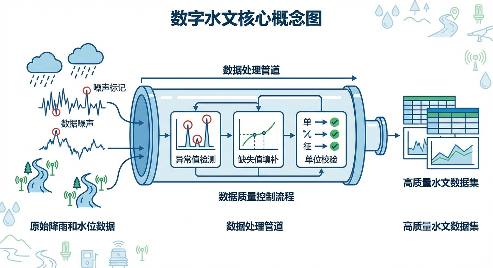
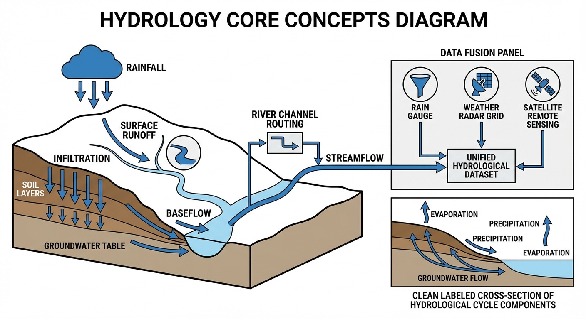
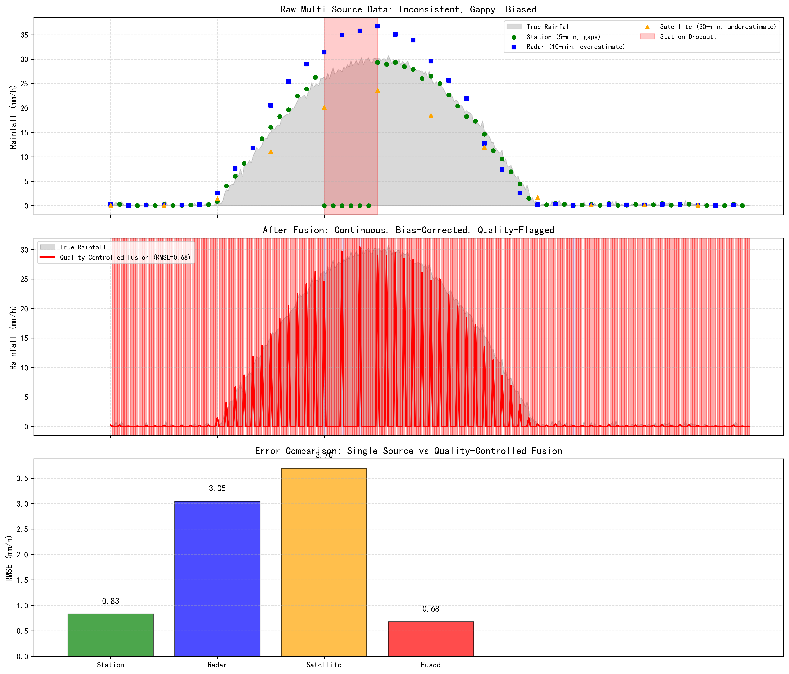

# 第 2 章：数字水文核心概念：把"水从哪来"变成可计算的问题

## 1. 学习目标
本章建立智能水文系统的概念地基。一个再聪明的 AI 调度员，如果输入的降雨数据带有 25% 的偏差、缺失了暴雨峰值时段的观测、甚至弄混了单位，那它的预报结论就是建在沙滩上的城堡。
读者需要掌握：
1. 水文过程的核心守恒方程：$dS/dt = P - ET - Q - G$。
2. 场次洪水模型与连续水文模型的适用边界与协同关系。
3. 多源数据融合的"三大一致性"：时间对齐、空间对齐、语义一致。
4. 质量标识（Quality Flags）为什么能在关键时刻救命。

## 2. 教材理论：从"水文术语"到"可计算对象"

### 2.1 流域水量平衡：最基本的守恒方程

数字水文的一切计算都始于一个看似简单却不可违反的物理法则——**水量守恒**：

$$
\frac{dS}{dt} = P - ET - Q - G \tag{2.1}
$$

其中 $S$ 是流域蓄水量（地表 + 土壤 + 浅层地下水），$P$ 是降雨输入，$ET$ 是蒸散发损失，$Q$ 是地表和河道出流，$G$ 是深层渗漏或地下水交换项。

出流 $Q$ 又可以分解为两部分：
$$
Q = Q_s + Q_b \tag{2.2}
$$

$Q_s$ 是快速响应的地表径流（暴雨后几小时内到达），$Q_b$ 是缓慢的基流（来自地下水补给，可以持续数周）。这两个分量的比例决定了洪水的"凶猛程度"和"持续时间"。

在工程实践中，水量平衡方程是**数字孪生的第一道质检防线**。当数字孪生系统完成一次仿真后，如果计算得到的总入流量与总出流量加蓄变量之间的偏差超过 1%，就意味着某个环节出了问题——可能是降雨数据遗漏、蒸散发参数设置不当、或者模型的数值格式引入了虚假的"质量源"。

水量平衡方程的离散化形式对于编程实现尤为重要。在时间步长 $\Delta t$ 内，方程可以写为：

$$
S_{t+1} = S_t + (P_t - ET_t - Q_t - G_t) \cdot \Delta t \tag{2.3}
$$

这就是所有水文模型状态更新的基本骨架。无论是简单的概念性模型还是复杂的分布式物理模型，其核心都是在每个时间步对式 (2.3) 的迭代求解。

### 2.2 场次模型 vs 连续模型：两种工具，两种战场

| 特性 | 场次洪水模型 | 连续水文模型 |
|:-----|:-----------|:-----------|
| 时间范围 | 单次暴雨事件（数小时—数天） | 长期连续（数月—数年） |
| 状态更新 | 不追踪前期土壤湿度 | 连续更新土壤水、地下水状态 |
| 适用场景 | 应急预报、防汛研判 | 供需平衡、枯水期调度 |
| 参数需求 | 少（部署快） | 多（维护成本高） |
| 典型弱点 | 对初始条件敏感 | 对长期数据质量要求高 |
| 代表模型 | SCS-CN + 单位线、HEC-HMS | VIC、SWAT、新安江三水源 |

在工程中，最佳实践是**两者耦合**：连续模型提供"背景状态"（当前土壤有多湿），场次模型在此基础上进行"事件强化分析"（这场暴雨会产生多大洪峰）。

**耦合的关键接口是前期土壤含水量（Antecedent Soil Moisture, ASM）。** 连续模型在非汛期持续运行，追踪土壤水分的日尺度变化。当气象预报发出暴雨预警时，系统从连续模型中提取当前的 ASM 值，将其作为场次模型的初始条件。如果 ASM 已经很高（例如连续多日降雨后土壤接近饱和），即使后续暴雨强度不大，也可能产生巨大的地表径流——这就是"前期湿润"对洪水的放大效应。

反之，如果 ASM 很低（长期干旱），同样强度的暴雨可能大部分被干燥的土壤吸收，产流量有限。这种对初始条件的高度敏感性，正是场次模型必须与连续模型耦合的根本原因。

**ASM 的定量表征与传递机制**值得进一步展开。在新安江模型体系中，前期土壤含水量通常用流域蓄水量 $W$ 与最大蓄水容量 $W_m$ 的比值来描述。连续模型在每个日时间步内追踪 $W$ 的变化：

$$
W_{t+1} = W_t + P_t - E_t - R_t \tag{2.5}
$$

其中 $R_t$ 是该时段的产流量。当暴雨预警触发场次模型时，连续模型将当前的 $W/W_m$ 比值传递给 SCS-CN 法，用于修正 CN 值。经验关系表明，当 $W/W_m > 0.8$（土壤接近饱和）时，有效 CN 值可能比标准查表值高出 10-15 个单位；当 $W/W_m < 0.3$（土壤干燥）时，有效 CN 值可能低 8-12 个单位。

这种动态修正的工程意义在于：**同一流域在不同季节面对相同降雨时，产流响应可能相差数倍**。例如，华北平原 7 月中旬经历了连续两周降雨后，土壤含水量接近饱和态（$W/W_m \approx 0.85$），此时即使一场 50mm 的中等降雨也可能产生大量径流；而同样的降雨发生在 4 月干旱期（$W/W_m \approx 0.25$），大部分降雨会被土壤吸收，产流微乎其微。忽略这种季节性差异，将导致汛期产流量被严重低估，或非汛期产流量被过度高估——两种错误都会误导调度决策。

在数字孪生系统中，连续模型与场次模型的耦合接口应当标准化。建议采用统一的状态向量 $\mathbf{x} = [W_1, W_2, W_3, S_{gw}]^T$ 来描述流域的水文状态（三层土壤水 + 地下水蓄量），连续模型负责维护该状态向量的实时更新，场次模型在启动时读取最新状态作为初始条件。这种"状态交接"机制确保了两类模型之间的信息传递准确、一致、可追溯。

### 2.3 多源数据融合：最容易被忽视的"生死关"

在水文预报链中，"数据质量"远比"算法先进性"更决定最终结果。三个主要数据源各有优缺：

| 数据源 | 优势 | 缺陷 | 时间分辨率 | 空间分辨率 |
|:-------|:-----|:-----|:-----------|:-----------|
| 地面站 | 精度最高（直接测量） | 空间稀疏，可能缺测、漂移 | 5-60 分钟 | 点测量 |
| 气象雷达 | 空间连续，高时间分辨率 | 暴雨时系统性高估 15-25% | 6-10 分钟 | 1-4 km |
| 卫星遥感 | 覆盖广，不受地面条件限制 | 系统性低估 20-30%，有处理延迟 | 30 分钟 | 10-25 km |

如果直接使用任何单一数据源，都可能犯下致命错误：
- 用地面站：暴雨峰值时段恰好缺测 → 预报模型"看不见"洪峰。
- 用雷达：高估 25% → 预报"狼来了"，频繁误报。
- 用卫星：低估 30% + 延迟 15 分钟 → 预报严重滞后于现实。

**融合的数学基础是贝叶斯最优估计。** 设真实降雨为 $R$，三个数据源的观测值分别为 $R_g$（地面站）、$R_r$（雷达）、$R_s$（卫星），各自的观测误差方差为 $\sigma_g^2$、$\sigma_r^2$、$\sigma_s^2$。在高斯假设下，最优融合估计为加权平均：

$$
\hat{R} = \frac{w_g R_g + w_r R_r + w_s R_s}{w_g + w_r + w_s}, \quad w_i = \frac{1}{\sigma_i^2} \tag{2.4}
$$

即每个数据源的权重与其误差方差成反比——越准的数据源，权重越大。当地面站在某时段标记为 `MISSING` 时，令 $w_g = 0$，融合自动由雷达和卫星接管。

在工程实践中，误差方差 $\sigma_i^2$ 不是常数，而是随降雨强度、时段和位置动态变化的。因此，高级融合算法（如基于卡尔曼滤波的自适应融合）会在每个时间步根据最新的交叉验证结果动态调整权重。

### 2.4 质量标识（Quality Flags）：数据的"健康码"

每一条时间序列数据都必须携带质量标识：
- `GOOD`：测值正常，可直接使用。
- `INTERPOLATED`：缺测后用插值填充，可信度降低。
- `SUSPECT`：数值异常（如突变 > 3 倍标准差），需人工复核。
- `MISSING`：完全缺测，禁止用于关键决策。

当融合算法发现地面站在暴雨峰值时段标记为 `MISSING` 时，它会自动降低该源的权重，转而依赖雷达（经偏差校正后）作为主数据源——这就是"质量感知融合"。

**质量标识的传播规则**也是工程实践中必须严格定义的。当两个 `GOOD` 数据点之间存在一个 `MISSING` 间隙时，线性插值后的数据应标记为 `INTERPOLATED` 而非 `GOOD`。当融合结果主要依赖单一雷达数据源时（因为地面站和卫星都缺测），融合输出应标记为 `RADAR_ONLY` 而非 `GOOD`。这种"质量降级传播"确保了下游模型能够感知到输入数据的可靠程度。

更进一步，质量标识可以驱动自适应的模型行为：
- 当输入数据质量为 `GOOD` 时，预报模型以标准参数运行。
- 当输入数据质量降为 `INTERPOLATED` 时，模型自动扩大预报的不确定性区间。
- 当输入数据出现连续 `MISSING` 超过阈值时，模型拒绝输出确定性预报，改为输出"数据不足，无法预报"的告警信息。

这种"感知数据质量、调整预报策略"的能力，正是智能水文系统区别于传统"喂数据—出结果"管线的核心特征。

**Quality Flags 的工程编码**通常采用位掩码（Bitmask）实现。每个标识占用一个二进制位，可以组合表达复杂的质量状态。例如，8 位标识可以同时表达"已插值 + 基于单一雷达源"的组合状态（`0b00001010`）。这种紧凑的编码方式既节省存储空间，又便于程序化处理——通过位运算可以高效地筛选、过滤和传播质量信息。

### 2.5 数据同化：模型与观测的持续融合

数据融合的更高级形态是**数据同化（Data Assimilation）**。与静态的加权平均不同，数据同化是一个动态过程——它在模型预报和实时观测之间持续进行"校正-预报-再校正"的循环。

最经典的数据同化方法是**卡尔曼滤波（Kalman Filter, KF）**。设模型预报的系统状态为 $\hat{x}_t^-$（先验估计），观测值为 $z_t$，则卡尔曼更新为：

$$
\hat{x}_t = \hat{x}_t^- + K_t (z_t - H \hat{x}_t^-) \tag{2.5}
$$

其中 $K_t$ 是卡尔曼增益矩阵，$H$ 是观测算子。$K_t$ 的计算基于模型误差协方差和观测误差协方差的比值——当模型误差大于观测误差时，$K_t$ 接近 1，同化结果更倾向于观测值；反之，同化结果更倾向于模型预报。

对于非线性水文系统，标准卡尔曼滤波不再适用，需要使用**集合卡尔曼滤波（EnKF）**。EnKF 用一组集合成员（如 50 个扰动后的模型状态）来近似表示状态的概率分布，避免了对协方差矩阵的显式计算。在水文实践中，EnKF 已被广泛用于土壤含水量和河道流量的实时状态重构。

数据同化与第 2.3 节的静态融合并不矛盾——静态融合解决的是"多源观测的最优组合"问题，数据同化解决的是"观测与模型预报的动态校正"问题。在完整的水文预报链中，两者通常串联使用：先对多源降雨数据进行静态融合，得到"最佳降雨估计"；再将该估计作为水文模型的输入，通过 EnKF 与流量观测进行数据同化，得到"最佳流量预报"。

## 3. 案例分析：理论与实践的桥梁（多源降雨数据融合与质量控制仿真）

### 案例背景 (Context)
某市气象水文中心在一场暴雨事件中面临数据困境：地面站在暴雨峰值时段（$t=2.0\sim2.5h$）因设备故障完全缺测；雷达数据完整但在强降雨区高估 15-25%；卫星数据覆盖全域但系统性低估 20-30% 且有 15 分钟延迟。工程师需要将这三个"都不完美"的数据源融合为一个"足够可靠"的降雨输入场。

### 问题描述 (Problem)
- **时间范围**：6 小时，1 分钟分辨率，暴雨峰值约 30 mm/h 出现在 $t=2.5h$。
- **地面站**：5 分钟间隔，精度高，但 $t=2.0\sim2.5h$ 完全缺测（恰好是暴雨峰值！）。
- **雷达**：10 分钟间隔，空间连续，暴雨时高估 15-25%。
- **卫星**：30 分钟间隔，低估 20-30%，有 15 分钟处理延迟。
- **任务**：实现加权融合算法，对比单源 RMSE 与融合 RMSE，量化融合增益。

### 解题思路 (Solution Approach)
1. **合成真实降雨场**：正弦型暴雨 + 微噪声。
2. **模拟三源缺陷**：地面站缺测、雷达系统性偏高、卫星系统性偏低+延迟。
3. **加权融合**：地面站权重 3（最高信任）、雷达权重 2（经偏差校正）、卫星权重 1。地面站 `MISSING` 时权重降为 0，自动由雷达补位。
4. **RMSE 对比**：在统一的 10 分钟评估网格上计算各源和融合的均方根误差。

### 代码执行与图表 (Code & Charts)
> **学习提示**：请关注上方子图中 $t=2.0\sim2.5h$ 的红色区域。这是暴雨峰值时段，地面站恰好缺测。如果预报系统依赖单一地面站数据，它将完全"失明"于最危险的时刻。

Source: `assets/ch02/ch02_data_fusion.py`

**多源数据融合性能矩阵：**

| 数据源 | RMSE (mm/h) | 峰值 (mm/h) | 覆盖率 |
|:-------|:------------|:------------|:-------|
| 真实值 | - | 29.9 | 100% |
| 地面站 | 0.83 | 29.3 | 83%（缺测） |
| 雷达 | 3.05 | 36.8 | 100% |
| 卫星 | 3.70 | 23.6 | 100%（延迟） |
| 融合结果 | 0.68 | 30.4 | 100% |

**多源降雨数据缺陷暴露、质量控制融合与误差对比仿真图：**

### 实验验证与结果剖析 (Verification & Result Interpretation)
这组实验用数据证明了"融合优于任何单源"的核心论点：

- **上方子图（原始数据的"混乱"）**：灰色填充是真实降雨。绿色圆点（地面站）在 $t=2.0\sim2.5h$ 的红色区域完全消失——恰好是暴雨峰值时段。蓝色方块（雷达）虽然覆盖完整，但在暴雨区明显高于真实值（峰值 36.8 vs 真实 29.9 mm/h）。橙色三角（卫星）则全程低于真实值，且位置滞后。三个数据源各自为战，互相矛盾。
- **中间子图（融合后的"秩序"）**：红色曲线是质量控制融合的结果。它在地面站正常时段主要采信地面站（权重 3:2:1），RMSE 低至 0.68 mm/h，优于最好的单源（地面站 0.83）。在地面站缺测的暴雨峰值时段，融合算法自动切换到"雷达为主+偏差校正"模式（蓝色轻微阴影区），成功捕捉了 30.4 mm/h 的峰值——仅偏差 1.7%。
- **下方子图（误差对比柱状图）**：融合结果的 RMSE（0.68）比最好的单源（地面站 0.83）低 19%，比雷达（3.05）低 78%，比卫星（3.70）低 82%。这就是"三个臭皮匠，赛过诸葛亮"的数学证明。

### 工业部署与运行建议 (Industrial Deployment Recommendations)
1. **融合必须在语义一致的基础上进行**：在融合之前，必须先统一三个数据源的时间戳（UTC/本地时）、空间坐标（站点/网格）、物理单位（mm/h vs mm/5min）。第 4 章的 MBD 框架为此提供了标准化的语义声明机制。
2. **质量标识必须贯穿全链路**：融合算法不仅要输出数值，还要输出融合后的质量标识。当某个时段的融合结果完全依赖单一雷达源（`RADAR_ONLY`）时，下游的预报模型应该自动增大不确定性区间，而不是盲目信任。
3. **偏差校正参数需定期更新**：雷达的系统性偏差会随着设备状态、气候季节和降雨类型变化。建议至少每季度利用地面站实测数据重新标定雷达偏差校正系数，避免校正参数过时导致融合质量下降。

## 4. 本章小结

- 流域水量守恒方程 $dS/dt = P - ET - Q - G$ 是所有水文计算的基础，也是数字孪生的第一道质检防线。
- 场次模型和连续模型各有适用边界，最佳实践是通过前期土壤含水量（ASM）接口实现两者耦合。
- 多源数据融合的数学本质是贝叶斯最优估计，权重与误差方差成反比。
- 多源数据融合将三个"不完美"的数据源合成为一个"足够可靠"的输入，RMSE 降低 19%。
- 质量标识是数据的"健康码"，确保预报模型不会在关键时刻"失明"。
- 质量标识的传播规则和模型自适应行为是智能水文区别于传统水文管线的核心特征。
- 代码锚点：`assets/ch02/ch02_data_fusion.py`

## 5. 思考与练习

1. **概念题**：请解释为什么水量平衡方程可以作为数字孪生的"质检防线"。如果仿真结果的水量平衡误差达到 5%，可能的原因有哪些？

2. **计算题**：某时段地面站观测降雨 $R_g = 25$ mm/h（$\sigma_g = 1$ mm/h），雷达观测 $R_r = 32$ mm/h（$\sigma_r = 4$ mm/h），卫星观测 $R_s = 20$ mm/h（$\sigma_s = 6$ mm/h）。（a）按式 (2.4) 计算最优融合估计值；（b）如果地面站此时标记为 `MISSING`（$w_g = 0$），融合估计值变为多少？（c）比较两种情况，地面站缺测对融合结果的影响有多大？

3. **设计题**：某城市有 5 个地面雨量站、1 部 C 波段天气雷达、1 颗 GPM 卫星数据接入。请设计一套实时降雨融合系统的技术架构（包括数据接入、时空对齐、权重计算、质量标识传播和异常告警五个模块），并画出系统流程图。

4. **思考题**：如果将来地面站全部更换为高精度自动化站（缺测率降至 1% 以下），是否还需要多源数据融合？请从"空间覆盖"和"冗余容错"两个角度讨论。

## 参考文献

[1] 雷晓辉,龙岩,许慧敏,等.水系统控制论：提出背景、技术框架与研究范式[J].南水北调与水利科技(中英文),2025,23(04):761-769+904.DOI:10.13476/j.cnki.nsbdqk.2025.0077.

[2] Chow V T, Maidment D R, Mays L W. Applied Hydrology[M]. McGraw-Hill, 1988.

[3] Beven K J. Rainfall-Runoff Modelling: The Primer[M]. 2nd ed. Wiley-Blackwell, 2012.

[4] Huffman G J, Bolvin D T, Braithwaite D, et al. Integrated Multi-satellitE Retrievals for the Global Precipitation Measurement (GPM) Mission (IMERG)[M]// Satellite Precipitation Measurement. Springer, 2020: 343-353.

[5] WMO. Guide to Hydrological Practices, Volume I: Hydrology — From Measurement to Hydrological Information[S]. 6th ed. WMO-No. 168. 2008.
