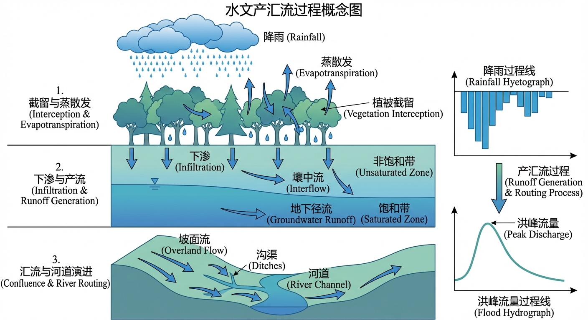
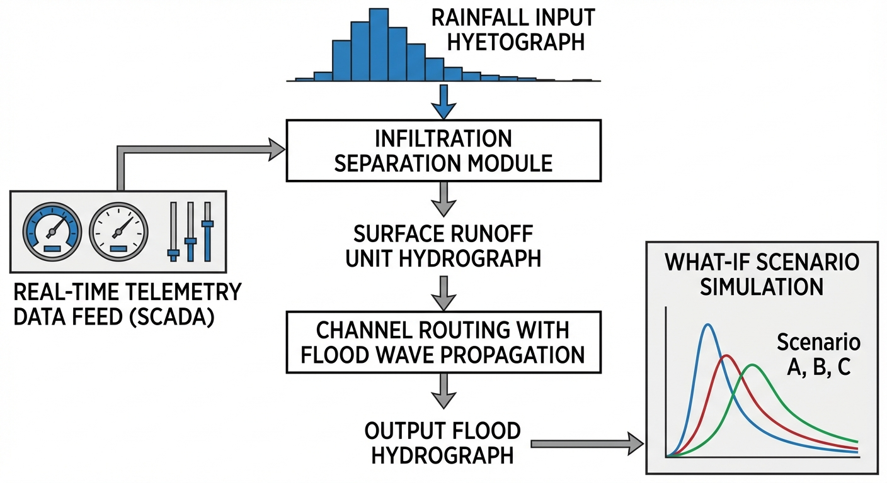
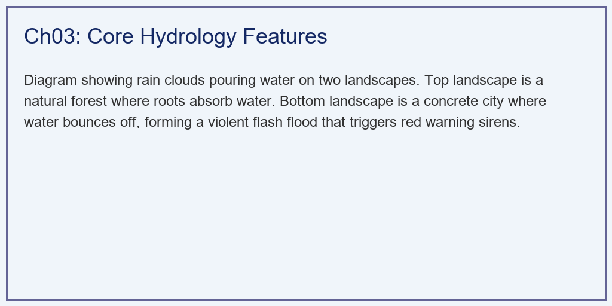
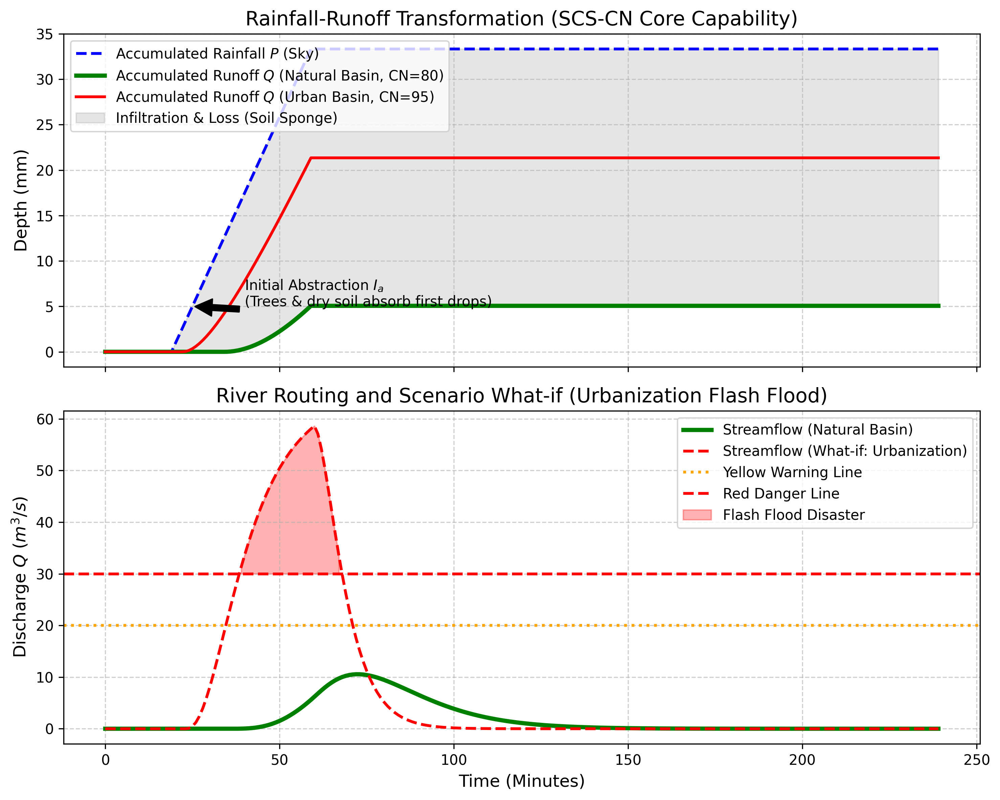

# 第 3 章：核心水文能力（Features）：从天上的雨到河里的水

## 1. 学习目标
本章探讨智能水文模型的核心计算引擎（Hydrological Core Engine）。展示一滴雨水是如何被物理模型剥离、计算，最终转化为可能摧毁城市的洪峰过程线的。
读者需要掌握：
1. 降雨径流（Rainfall-Runoff）计算中的"初损（Initial Abstraction）"与"下渗"机制。
2. 美国农业部广泛使用的 SCS-CN 产流计算法。
3. 坡面与河网汇流中的纳什瞬时单位线（Nash IUH）理论。
4. 情景模拟（What-if Scenario）：城市化如何导致防洪预警系统的崩溃。

## 2. 教材理论：水文模型的"炼金术"
水文预测的终极问题是：**"如果天上下了 $50mm$ 的暴雨，河里的流量会变成多少？"**
这中间发生的事情，被水文学家分解为两个核心步骤：**产流（Runoff Generation）**和**汇流（Routing）**。

### 2.1 产流：天上下的雨，有多少变成了洪水

大自然就像一块巨大的海绵。雨下下来，首先会被树叶截留（初损 $I_a$），然后被干燥的土壤疯狂吸入（下渗）。只有当海绵快被吸满，或者雨下得太猛导致水渗不进去时，剩下的水才会在地表流淌，这部分水叫做**净雨（Net Rain）**。

美国农业部发明了一个简洁优雅的经验公式——**SCS-CN 法**：
它把全世界的土壤和地表分成了不同的"曲线数（Curve Number, CN）"。
- **茂密的森林（$CN \approx 50$）**：像极好的海绵，下多大的雨都能吸进去，几乎不产流。
- **柏油马路与城市（$CN \approx 95$）**：像一块铁板，雨滴一落地就变成了净雨。

**SCS-CN 法的数学表达**如下。首先计算流域的最大潜在滞留量 $S$：

$$
S = \frac{25400}{CN} - 254 \quad (\text{mm}) \tag{3.1}
$$

初损 $I_a$ 通常取 $I_a = 0.2S$，表示降雨开始后被植被截留和填洼吸收的部分。当累积降雨 $P > I_a$ 时，累积产流量 $Q$ 为：

$$
Q = \frac{(P - I_a)^2}{P - I_a + S} \tag{3.2}
$$

当 $P \leq I_a$ 时，$Q = 0$（降雨尚未满足初损，地表没有径流）。

这个公式的物理含义值得仔细品味。分子 $(P - I_a)^2$ 表示超过初损的降雨量的平方——降雨越大，产流效率越高，这符合"土壤越湿越容易饱和"的物理直觉。分母 $(P - I_a + S)$ 是一个调节项，确保累积产流量永远不会超过累积降雨量减去初损。

**不同 CN 值对产流量的影响**可以用数值例子直观说明。假设一场累积降雨 $P = 100$ mm：

| CN 值 | $S$ (mm) | $I_a$ (mm) | $Q$ (mm) | 产流率 $Q/P$ |
|:------|:---------|:-----------|:---------|:-------------|
| 50 | 254.0 | 50.8 | 8.0 | 8% |
| 65 | 136.8 | 27.4 | 20.5 | 21% |
| 80 | 63.5 | 12.7 | 50.4 | 50% |
| 95 | 13.4 | 2.7 | 73.8 | 74% |

从 CN=50（森林）到 CN=95（城市），同样 100mm 的降雨，产流量从 8mm 增加到 74mm——增长了 9 倍以上。这就是城市化对水文响应的毁灭性放大效应。

### 2.2 汇流：水是如何流到你家门口的

算出了净雨后，这些水并不是瞬间到达流域出口的。它们要在山上流淌，要在河道里汇聚。
- 森林的山坡像一个有着巨大阻力的漏斗，水流得很慢，洪峰被拖延和削平。
- 城市的水泥下水道像光滑的滑梯，水瞬间汇聚。

水文学利用**纳什瞬时单位线（Nash IUH）**，把流域抽象成 $n$ 个串联的线性水库。每个水库的出流与蓄水量成正比，蓄水常数为 $k$。纳什单位线的数学表达式为一个伽马分布：

$$
u(t) = \frac{1}{k \cdot \Gamma(n)} \left(\frac{t}{k}\right)^{n-1} e^{-t/k} \tag{3.3}
$$

其中 $\Gamma(n)$ 是伽马函数（当 $n$ 为正整数时 $\Gamma(n) = (n-1)!$），$t$ 是时间。两个参数 $n$ 和 $k$ 分别控制单位线的**形状**和**尺度**：
- $n$ 越大，单位线越对称、越宽缓，代表流域的"水库效应"越强。
- $k$ 越大，单位线的峰值延迟越久、展幅越宽，代表流域的平均调蓄时间越长。

**单位线的峰值时间**为 $t_p = (n-1) \cdot k$，**峰值流量**为 $u_p = u(t_p)$。

得到单位线后，流域出口的洪水过程线 $Q(t)$ 通过**卷积积分（Convolution）**计算：

$$
Q(t) = \int_0^t q(\tau) \cdot u(t - \tau) \, d\tau \tag{3.4}
$$

其中 $q(\tau)$ 是各时段的净雨强度。在离散化实现中，卷积变为求和：

$$
Q_j = \sum_{i=1}^{\min(j, M)} q_i \cdot u_{j-i+1} \cdot \Delta t \tag{3.5}
$$

其中 $M$ 是净雨时段数。这就是 `numpy.convolve` 函数在水文中的物理意义——把一根根离散的雨柱，通过线性叠加，揉捏成一条平滑或陡峭的洪水过程线。

### 2.3 城市化对汇流参数的影响

城市化不仅改变了产流量（CN 增大），还深刻改变了汇流特征（Nash 参数 $n$ 和 $k$ 减小）：

| 流域类型 | $n$ | $k$ (min) | 单位线特征 | 物理解释 |
|:---------|:----|:----------|:-----------|:---------|
| 山区森林 | 4-6 | 30-60 | 宽缓、低矮 | 坡面阻力大，多级汇聚 |
| 丘陵农田 | 3-4 | 15-30 | 中等 | 梯田有一定滞留效果 |
| 城市硬化 | 1-2 | 3-8 | 尖锐、高耸 | 管网快速排泄 |

当 $n$ 从 4 降到 2、$k$ 从 30 降到 5 时，单位线的形态从"宽缓的小山丘"变成"尖锐的针刺"。配合产流量的倍增（CN 增大），最终的洪水过程线呈现出"来得猛、峰值高、退得快"的城市闪洪特征。

### 2.4 产汇流计算的数值实现要点

在编程实现产汇流计算时，有几个容易踩坑的技术要点：

1. **时间步长的选择**：$\Delta t$ 必须远小于汇流时间 $t_c$。经验法则是 $\Delta t \leq t_c / 5$。对于城市流域（$t_c$ 可能只有 15 分钟），$\Delta t$ 应取 1-3 分钟。时间步长过大会导致洪峰被"抹平"，低估峰值流量。

2. **净雨的差分计算**：SCS-CN 法直接给出的是累积产流量 $Q(P)$。要得到各时段的净雨强度，需要对累积曲线求差分：$q_i = Q(P_i) - Q(P_{i-1})$。注意不能直接将累积降雨量代入公式后再除以时间——这会丢失降雨强度在时段内的分布信息。

3. **卷积的边界处理**：`numpy.convolve` 的 `mode='full'` 会输出长度为 $N + M - 1$ 的序列（$N$ 为净雨时段数，$M$ 为单位线时段数），确保不会截断汇流的尾部退水过程。

4. **单位一致性**：净雨强度通常以 mm/min 或 mm/h 为单位，单位线的纵坐标是 $1/min$ 或 $1/h$，卷积结果的单位是 mm/min 或 mm/h。转换为流量 $m^3/s$ 时需要乘以流域面积（$km^2$）并做单位换算。具体的换算公式为：

$$
Q \, (m^3/s) = q \, (mm/h) \times A \, (km^2) \times \frac{1000}{3600} = q \times A \times 0.2778 \tag{3.7}
$$

其中 $q$ 是净雨强度（mm/h），$A$ 是流域面积（$km^2$）。系数 0.2778 来源于 $1 \, mm \cdot km^2 / h = 10^{-3} \times 10^6 / 3600 \, m^3/s$。这个换算系数在水文计算中使用频率很高，建议在代码中定义为常量以避免反复推导。

需要特别注意的是，当净雨以 mm/min 为单位时，换算系数变为 $0.2778 \times 60 = 16.67$，即 $Q \, (m^3/s) = q \, (mm/min) \times A \, (km^2) \times 16.67$。初学者经常混淆这两个系数，导致流量计算偏差 60 倍——这是水文编程中最常见的单位错误之一。

此外，在分布式水文模型中，每个计算网格的面积 $A_i$ 可能不同，因此换算必须逐网格进行。当使用不规则三角网（TIN）或 Voronoi 多边形划分流域时，各网格面积的差异可达数倍，统一使用平均面积进行换算会引入显著误差。

5. **验证方法**：产汇流计算完成后，应检验两个守恒条件。其一，净雨总量必须等于降雨总量减去初损和后续下渗量；其二，出口洪水过程线下的面积（即总径流体积）必须等于净雨总量乘以流域面积。如果两项检验的误差超过 1%，通常意味着时间步长过大或边界处理存在问题。

### 2.5 产汇流模型的参数率定与不确定性

SCS-CN 法和 Nash IUH 的核心参数（CN、$n$、$k$）在实际应用中通常无法直接测量，需要通过**参数率定（Calibration）**——即利用历史降雨-径流事件数据，通过最优化算法反演参数值。

率定的目标函数通常采用纳什效率系数（Nash-Sutcliffe Efficiency, NSE）：

$$
NSE = 1 - \frac{\sum_{i=1}^{N}(Q_{obs,i} - Q_{sim,i})^2}{\sum_{i=1}^{N}(Q_{obs,i} - \bar{Q}_{obs})^2} \tag{3.6}
$$

$NSE = 1$ 表示模型完美拟合观测数据，$NSE = 0$ 表示模型的预测能力与使用观测均值相当，$NSE < 0$ 表示模型还不如直接取均值。在水文实践中，$NSE > 0.7$ 被认为是"良好"的率定结果。

然而，参数率定存在一个深层次的问题——**等效性（Equifinality）**。不同的参数组合可能产生几乎相同的模拟结果。例如，较大的 CN 值配合较大的 $k$ 值（产流多但汇流慢），可能与较小的 CN 值配合较小的 $k$ 值（产流少但汇流快），在某些降雨场景下产生相似的洪峰流量。

GLUE（Generalized Likelihood Uncertainty Estimation）方法通过蒙特卡洛随机采样大量参数组合，保留所有"行为似然"超过阈值的参数集，从而量化产汇流模型的参数不确定性。这种不确定性分析对于防汛决策尤为重要——它告诉决策者"模型的预报结果可能在多大范围内波动"。

## 3. 案例分析：理论与实践的桥梁（天然森林与硬化城市在特大暴雨下的防洪对决）

### 案例背景 (Context)
某面积为 $5 km^2$ 的城郊流域，即将面临一场持续 40 分钟的强对流暴雨（雨强 $50 mm/h$）。
流域的下游是城市主干道。防汛指挥部设定了两个安全阈值：
- **黄色预警**：流量超过 $20 m^3/s$。
- **红色灾难**：流量超过 $30 m^3/s$（这意味着河道会漫溢，汽车会被冲走）。

目前该流域还是一片原生态森林（$CN=80$）。但开发商正计划把它推平，建成全水泥的商业新城（$CN=95$）。
作为水文工程师，你需要运行数字底座的"What-if（假设）"情景推演引擎，向市长直观地展示：如果批准了这个开发项目，当下一次同样的暴雨来临时，城市防洪系统将面临怎样毁灭性的打击。

### 问题描述 (Problem)
- **输入强迫**：$t=20 \sim 60min$，暴雨 $50 mm/h$。
- **基准情景（天然森林）**：$CN=80$。汇流时间常数极大（$n=3, k=10$）。
- **假设情景（全水泥城市）**：$CN=95$。汇流时间常数极小（$n=2, k=5$）。
- **任务**：利用 SCS-CN 算子剥离出两条产流曲线，并利用 Nash IUH 卷积算子推演出两条出口洪峰曲线。对比它们的达峰时间和峰值是否击穿了红色预警线。

**物理场景与问题概化图 (Generated via Local Schematic)：**

### 解题思路 (Solution Approach)
本研究构建了一个串行的水文事件模拟流水线（Hydrological Pipeline）：
1. **SCS-CN 产流剥离**：利用公式 $Q = (P - I_a)^2 / (P - I_a + S)$ 实时计算累积产流量。注意在累积降雨 $P < I_a$（初损未满）时，强制产流为 0。
2. **差分反算净雨**：对累积产流曲线求导（差分），得到每个时刻精确的净雨脉冲序列（$mm/min$）。
3. **IUH 卷积积分**：利用解析的伽马分布（Gamma Distribution）生成纳什单位线矩阵。使用 `numpy.convolve` 将单位线与净雨脉冲序列进行数学卷积，得到最终的流量体积曲线。

### 代码执行与图表 (Code & Charts)
> **学习提示**：我们在后台执行了包含微积分响应的降维水文物理方程。请死死盯住下方子图中的红色虚线，体会城市化带来的那根"死亡尖刺"。

Source: `assets/ch03/ch03_core_features.py`

**天然海绵与水泥城市在面对同等特大暴雨时的物理响应抗毁矩阵：**
| Metric                      | Natural (CN=80)   | What-if Urban (CN=95)   | Impact                           |
|:----------------------------|:------------------|:------------------------|:---------------------------------|
| Total Runoff Generated (mm) | 5.1               | 21.4                    | Urbanization blocks infiltration |
| Peak Discharge ($m^3/s$)    | 10.6              | 58.6                    | Violent flash flood peak         |
| Time to Peak (min)          | 72.0              | 60.0                    | Zero reaction time for city      |
| Red Warning Status          | Safe              | Triggered!              | Requires immediate dispatch      |

**SCS产流剥离与基于 Nash 单位线的河道洪峰预警红线对比图：**

### 实验验证与结果剖析 (Verification & Result Interpretation)
这组数据完美再现了自然界"海绵城市"与"水泥怪兽"的生死差距：
- **被土地吞噬的降雨（上方子图）**：
  - 看蓝色的虚线，这是天上实际下下来的雨，非常巨大。
  - 在天然森林（绿实线）中，雨下了快 $10$ 分钟（$t \approx 30$），地上才开始有水流。前期的雨水全部被树冠和落叶吸干了（这就是黑色箭头标注的初损 $I_a$）。最终，森林只产生了 $5.1 mm$ 的径流（大片的灰色阴影代表被土壤吃掉的雨水）。
  - 但在水泥城市（红实线）中，初损极小。雨刚落下，地面瞬间产流。最终产流高达 $21.4 mm$，是森林的 **$4 倍$** 多！
- **死亡尖刺与绝望的预警（下方子图）**：
  - 看天然森林（绿线）。由于水量小且汇流阻力大，洪峰就像一个温柔的小土包，最高流量只有 $10.6 m^3/s$。它甚至连橙色的黄色预警线都没有碰到，城市十分安全。
  - **看水泥城市（红虚线）！** 它变成了一根陡峭的红色尖刺。由于水量巨大且下水道排流极快，这股洪水以摧枯拉朽之势，在暴雨刚停的那一刻（第 $60$ 分钟），直接飙升到了 **$58.6 m^3/s$**！
  - 它毫无悬念地击穿了黄线和红线。图中那块巨大的红色填充区域，意味着城市主干道将面临严重的洪涝灾害。
  - 更可怕的是反应时间：森林的洪峰在第 $72$ 分钟才到，防汛办有充足的时间转移群众。而城市的洪峰在第 $60$ 分钟就砸脸了（提前了 $12$ 分钟），这在防灾领域叫做"闪洪（Flash Flood），零反应时间"。

### 工业部署与运行建议 (Industrial Deployment Recommendations)
1. **数字孪生平台的推演价值（What-if Simulation）**：现代水务大屏上最贵的功能不是"看现在"，而是"推演未来"。市长在批准任何一个房地产开发项目前，必须让系统跑一次 $CN=95$ 的推演。如果发现红线被击穿，规划局必须强制要求开发商就地配套建设足够容量的"地下调蓄池"或"下沉式绿地（LID）"，把那根红线重新压回黄线以下。
2. **气象雷达的分钟级切片（Nowcasting）**：我们模型里用的 $dt=1min$ 是非常奢侈的。传统的雨量计一小时才报一次数，如果用小时级数据去算城市内涝，红线的那根尖刺早就漏报了。目前水利行业正在接入 X 波段相控阵雷达，利用光流法（Optical Flow）推演云层移动，向水文模型输入分辨率高达 $1km \times 1km$、且每 $5$ 分钟更新一次的网格化超高频降雨预报，这是打赢城市闪洪防御战的唯一物理基础。
3. **LID 设施的水文效应量化**：在城市化不可避免的前提下，低影响开发（LID）措施（如透水铺装、生物滞留池、绿色屋顶）可以部分恢复流域的"海绵"功能。在 SCS-CN 框架下，LID 的效果可以通过降低有效 CN 值来量化。例如，20% 的透水铺装可以将城市区域的有效 CN 从 95 降低到约 88，产流量减少 15-20%。

## 4. 本章小结

- 产流计算的核心是 SCS-CN 法：$Q = (P - I_a)^2 / (P - I_a + S)$，CN 值决定了地表的"渗透能力"。
- 汇流计算的核心是纳什瞬时单位线（Nash IUH）与卷积积分，参数 $n$ 和 $k$ 控制洪峰的形态。
- 城市化同时恶化了产流（CN 增大）和汇流（$n$、$k$ 减小），导致洪峰量级和到达速度的双重恶化。
- What-if 情景推演是数字孪生平台的核心价值之一，为城市规划提供定量化的防洪风险评估。
- 代码锚点：`assets/ch03/ch03_core_features.py`

## 5. 思考与练习

1. **计算题**：某流域 CN=75，面积 10 $km^2$，发生了一场总降雨量 80mm 的暴雨。（a）计算 $S$ 和 $I_a$；（b）计算总产流量 $Q$；（c）如果 CN 因城市化升至 90，产流量变为多少？增长了几倍？

2. **推导题**：纳什单位线 $u(t) = \frac{1}{k\Gamma(n)}(t/k)^{n-1}e^{-t/k}$ 的峰值时间为 $t_p = (n-1)k$。请证明这一结论（提示：对 $u(t)$ 求导并令导数为零）。

3. **编程题**：使用 Python 和 `numpy`，编写一个函数 `scs_cn_runoff(P_cumulative, CN)`，输入为累积降雨时间序列和 CN 值，输出为各时段的净雨强度序列。测试 CN=70 和 CN=90 两种情况下 100mm 暴雨的产流差异。

4. **讨论题**：海绵城市建设（如透水铺装、雨水花园）在 SCS-CN 框架下如何量化其效果？如果某城市计划将 30% 的不透水面改造为透水面，你预计 CN 值会降低多少？对洪峰流量的削减效果如何？

## 参考文献

[1] USDA-NRCS. National Engineering Handbook, Part 630: Hydrology[S]. 2004.

[2] Chow V T, Maidment D R, Mays L W. Applied Hydrology[M]. McGraw-Hill, 1988.

[3] Nash J E. The Form of the Instantaneous Unit Hydrograph[J]. International Association of Scientific Hydrology Bulletin, 1957, 3: 114-121.

[4] Beven K J. Rainfall-Runoff Modelling: The Primer[M]. 2nd ed. Wiley-Blackwell, 2012.

[5] 雷晓辉,龙岩,许慧敏,等.水系统控制论：提出背景、技术框架与研究范式[J].南水北调与水利科技(中英文),2025,23(04):761-769+904.DOI:10.13476/j.cnki.nsbdqk.2025.0077.
