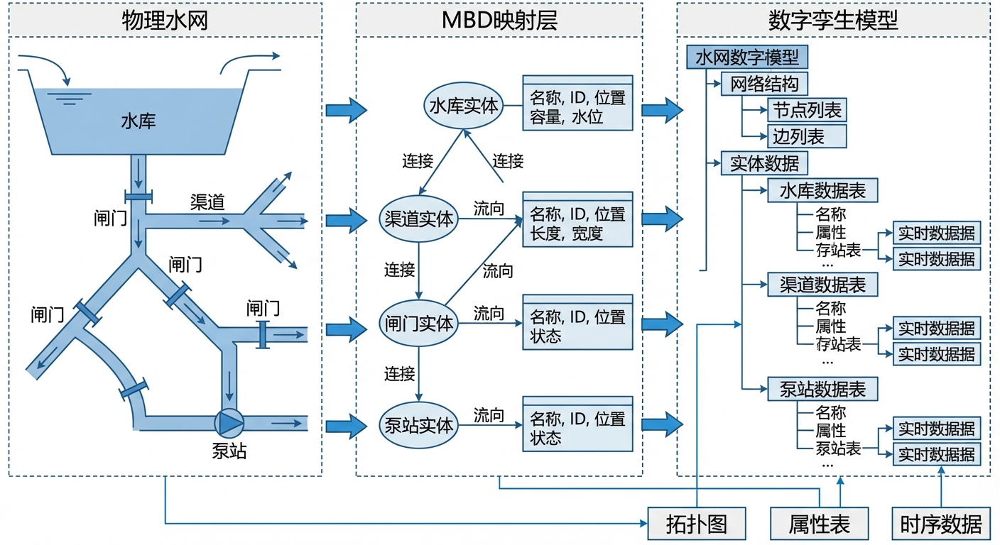
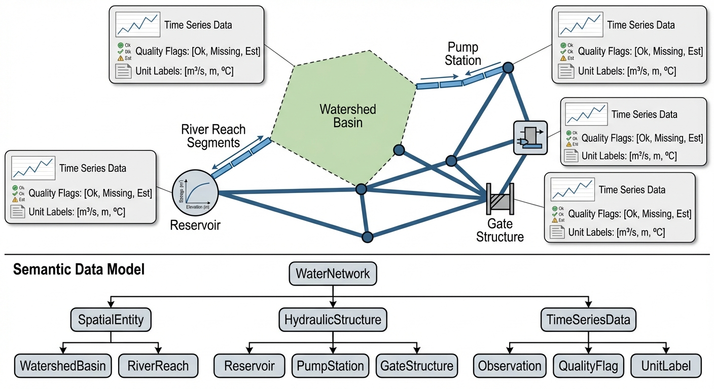

# 第 4 章：数字孪生对象与数据模型（MBD 映射）：给水网画一张"户籍图"



## 1. 学习目标
本章探讨智能水文系统中最基础但最容易被忽视的底层工程——基于模型的定义（Model-Based Definition, MBD）与水网拓扑映射。一个算法再聪明，如果它面对的是一堆杂乱无章的 Excel 表格而不是结构化的数字孪生实体，那它就像一个没有地图的将军。
读者需要掌握：
1. MBD 思想：如何将物理世界的流域、河段、水库、泵闸抽象为标准化的数字孪生实体。
2. 时间序列数据的语义声明：单位、质量标识（Quality Flags）为什么能救命。
3. 拓扑约束网络：为什么水文计算必须按照"谁在上游、谁在下游"的顺序推进。
4. CHS 六元组 $\Sigma = (P, A, S, D, C, O)$ 在 MBD 层面的具体映射。



## 2. 教材理论：为什么不能用 Excel 管水网？

### 2.1 从"数据沼泽"到"数字资产"

在传统水利信息化项目中，一个典型的困境是：气象部门用一种格式存降雨，水文站用另一种格式存流量，水库管理处用第三种格式存库容。三个部门的数据送到防汛指挥部，光是对齐时间戳和统一单位就要耗费数小时。

更致命的是**单位灾难**。历史上真实发生过这样的事故：某工程的上游模型输出流量单位是"立方米/秒"，下游模型接收时误以为是"立方米/小时"，导致计算结果偏差 3600 倍，差点酿成放水事故。

MBD（Model-Based Definition）的核心哲学是：**模型本身就是定义**。每一个水文实体（流域、河段、水库、泵站）都不再是一行冰冷的数据库记录，而是一个携带着完整物理属性、拓扑关系和质量声明的"数字公民"。

与传统的"数据库 + 文档"模式相比，MBD 的根本优势在于**自描述性（Self-Description）**。一个 MBD 实体不需要查阅外部文档就能被正确解读——它的属性名称、数据类型、物理单位、有效范围都内嵌在对象本身中。这种自描述性消除了"数据—文档不一致"的风险，也使得不同团队、不同系统之间的数据交换变得安全可靠。

### 2.2 四类基础数字孪生实体

在 CHS 体系中，水网的数字孪生由四类基础实体构成：

| 实体类型 | 物理对应 | CHS 六元组映射 | 关键属性 |
|:---------|:---------|:---------------|:---------|
| Basin（流域） | 集水区、汇水面 | D（扰动源） | 面积、CN 值、土地利用 |
| Reach（河段/管段） | 河道、管道、渠道 | P（被控对象） | 长度、坡度、糙率、断面 |
| Reservoir（水库/蓄水池） | 水库、调蓄池 | P + A（被控+执行） | 库容曲线、泄流能力 |
| Gate/Pump（闸泵） | 闸门、水泵、阀门 | A（执行器） | 最大流量、启闭时间 |

这四类实体通过**有向图（Directed Graph）**编织成拓扑网络：水从 Basin 产生，经 Reach 汇流，进入 Reservoir 调蓄，由 Gate/Pump 调控排放。

**每类实体的数据模型设计原则**遵循三个层次：

1. **静态属性层**：描述实体的固有物理特征，在较长时间尺度内保持不变。例如，Basin 的面积、Reach 的长度和坡度、Reservoir 的库容-水位关系曲线。这些属性在系统初始化时加载，通常来源于设计资料或实测地形数据。

2. **动态状态层**：描述实体在运行过程中持续变化的物理量。例如，Basin 的当前土壤含水量、Reach 中的实时流量和水位、Reservoir 的当前蓄水量。这些状态由传感器实时观测或由模型计算更新。

3. **约束边界层**：描述实体的安全运行范围。例如，Reservoir 的汛限水位和死水位、Gate 的最大启闭速度、Pump 的温度报警阈值。这些约束构成了 ODD（运行设计域）的基础边界。

### 2.3 拓扑排序：计算的"交通规则"

当水网有数十个节点时，计算顺序至关重要。如果你先算了下游河段的流量，却还没有算出上游水库的泄流量——结果必然是垃圾。

图论中的**拓扑排序（Topological Sort）**算法（如 Kahn 算法）能自动生成正确的计算顺序：从入度为零的源节点（Basin）开始，逐层向下游推进，确保每个节点在被计算之前，其所有上游节点都已经完成计算。

**Kahn 算法的执行步骤**如下：
1. 计算每个节点的入度（有多少上游节点指向它）。
2. 将所有入度为零的节点放入队列 $Q$。
3. 从 $Q$ 中取出一个节点 $v$，将其加入排序结果列表。
4. 对于 $v$ 的每个下游邻居 $w$，将 $w$ 的入度减 1。如果 $w$ 的入度变为 0，将 $w$ 加入 $Q$。
5. 重复步骤 3-4 直到 $Q$ 为空。
6. 如果排序结果列表包含了所有节点，则排序成功；否则说明图中存在环路（拓扑错误）。

算法复杂度为 $O(V + E)$（$V$ 是节点数，$E$ 是边数），对于数百个节点的大型水网也能在毫秒内完成。

**环路检测与拓扑错误诊断**是 Kahn 算法的一个重要附加功能。当步骤 6 中排序结果列表的节点数少于总节点数时，说明图中存在环路。环路在水网拓扑中通常意味着数据录入错误——例如，将 A 节点的出流错误地标记为 B 节点的上游，同时 B 的出流又指向 A。在大型水网中，人工排查环路的位置十分困难。改进的 Kahn 算法可以输出"剩余节点集合"（即入度始终无法降为零的节点），帮助工程师快速定位环路所在的子网络。

**拓扑排序还天然支持并行计算调度。** 在排序过程中，同一"层级"（即同时入度为零）的节点之间没有数据依赖关系，可以并行计算。例如，三个独立汇水区（Basin）位于拓扑的第一层，它们的产流计算可以同时进行；只有当三个 Basin 的计算全部完成后，下游的 Reach 节点才开始汇流计算。这种"层级并行"策略在 GPU 加速的大规模水网仿真中具有显著的性能优势——数百个同层节点可以在一个时间步内同时完成计算，将串行仿真的计算时间缩短一到两个数量级。

在工业实践中，水网拓扑并非一成不变。闸门的开关、临时引水管线的接入、以及应急分洪通道的启用，都会动态改变水网的拓扑结构。因此，拓扑排序算法必须支持**增量更新**：当某条边被添加或删除时，不需要对整个图重新排序，只需更新受影响节点的入度并局部调整排序序列。这种增量更新能力确保了数字孪生系统能够实时跟踪水网的运行态变化，始终保持计算顺序与物理因果关系的一致性。

这不仅保证了**因果一致性**，还天然支持**质量守恒验证**：在每个节点处，入流之和必须等于出流之和加上本节点的蓄变量。如果水量不平衡，要么是数据有误，要么是模型有 Bug——这就是"数字孪生"的自检能力。

**质量守恒验证的数学表达**为：

$$
\epsilon = \frac{\left|\sum Q_{in} - \sum Q_{out} - \Delta S\right|}{\sum Q_{in}} \times 100\% \tag{4.1}
$$

其中 $\epsilon$ 是相对质量平衡误差。工业实践中通常要求 $\epsilon < 1\%$，否则触发告警。

### 2.4 时间序列的语义武装

每一条时间序列数据都必须携带三层"护甲"：
1. **物理语义**：这是什么量？流量、水位、降雨强度？
2. **单位声明**：$m^3/s$、$mm/h$、$m$？不允许含糊。
3. **质量标识（Quality Flags）**：`GOOD`（测值正常）、`INTERPOLATED`（插值填充）、`SUSPECT`（疑似异常）、`MISSING`（缺测）。

当一个预报模型发现输入数据中有 3 个连续小时标记为 `MISSING`，它可以选择拒绝运行并告警，而不是用零值默默计算出一个"没有洪水"的虚假安全结论。

**语义声明的工程实现**通常采用 JSON Schema 或 Protocol Buffers 等结构化描述语言。以一个水库的时间序列数据为例：

```json
{
  "entity_id": "reservoir_central",
  "variable": "storage_volume",
  "unit": "million_m3",
  "valid_range": [0.0, 50.0],
  "timestamp_format": "ISO8601_UTC",
  "quality_flags": ["GOOD", "INTERPOLATED", "SUSPECT", "MISSING"],
  "data": [
    {"time": "2026-07-01T08:00:00Z", "value": 31.5, "qflag": "GOOD"},
    {"time": "2026-07-01T09:00:00Z", "value": null, "qflag": "MISSING"}
  ]
}
```

这种结构化的语义声明确保了任何消费该数据的下游系统都能自动识别数据类型、验证取值范围、处理缺失值，无需人工干预。

### 2.5 CHS 六元组在 MBD 层的映射

CHS 理论定义了受控水系统的六元组 $\Sigma = (P, A, S, D, C, O)$。在 MBD 层面，这六个元素与数字孪生实体的对应关系如下：

| CHS 元素 | 物理含义 | MBD 映射 | 数据来源 |
|:---------|:---------|:---------|:---------|
| P（被控对象） | 河段、管道、水库 | Reach + Reservoir 实体 | 设计资料 + 实测参数 |
| A（执行器） | 闸门、水泵、阀门 | Gate/Pump 实体 | 设备铭牌 + 实测特性曲线 |
| S（传感器） | 水位计、流量计 | 绑定在实体上的 TimeSeries | 遥测系统 |
| D（扰动） | 降雨、蒸发、需水 | Basin 产流 + 外部输入序列 | 气象 + 用水数据 |
| C（控制器） | MPC、DMPC 算法 | 调度服务模块 | 算法库 |
| O（目标） | 水位跟踪、流量匹配 | 约束边界层参数 | 调度规程 |

这种映射确保了 MBD 数据模型与 CHS 理论框架的完全对齐，使得从数据采集、模型仿真到优化调度的整个链路都能在统一的语义框架下运行。

### 2.6 MBD 实体的版本管理与变更追踪

水网的物理属性不是一成不变的。水库库容因淤积逐年减小，泵站因老化而最大流量下降，流域因城市化而 CN 值增大。MBD 实体必须具备**版本管理**能力，记录每次属性变更的时间、原因和变更者。

**变更追踪（Change Tracking）**的核心原则是：

1. **不可变历史**：历史版本的 MBD 实体永远不被覆写。每次修改创建新版本，旧版本归档保留。这确保了事后审计时能够回溯到任何历史时点的系统状态。

2. **变更审批**：关键参数（如水库汛限水位、泵站最大排水能力）的修改必须经过授权人员审批。未经审批的变更不允许生效——这防止了因误操作导致的安全风险。

3. **影响评估**：在参数变更生效前，系统应自动评估该变更对下游计算结果的影响。例如，将某泵站的最大流量从 15 $m^3/s$ 下调至 12 $m^3/s$ 时，系统应自动重新运行洪水场景仿真，检查是否会导致新的瓶颈或溢流风险。

MBD 的版本管理机制与软件工程中的 Git 版本控制理念相似——每次"提交"创建一个快照，可以随时"回滚"到历史版本。在数字孪生平台中，这种机制确保了物理世界的变化能够被及时、准确、可追溯地反映到数字空间中。

## 3. 案例分析：理论与实践的桥梁（水网拓扑自动排序与质量守恒验证）

### 案例背景 (Context)
某中型城市拥有一个包含 3 个集水区、2 段河道、1 座水库和 1 座泵站的排水系统。工程师需要验证：当 MBD 拓扑图建好后，系统能否自动生成正确的计算顺序？在一场暴雨事件中，整个网络的水量是否守恒？泵站的能力瓶颈在哪里？

### 问题描述 (Problem)
- **水网结构**：3 个 Basin（北山丘陵 CN=72、东谷郊区 CN=85、南平原城区 CN=90）→ 2 条 Reach（上游河 12km、下游河 8km）→ 1 座水库（库容 50 百万 $m^3$）→ 1 座泵站（极限排水能力 15 $m^3/s$）→ 出海口。
- **暴雨事件**：$t=12\sim24h$ 的 12 小时正弦型降雨，峰值 8 mm/h。
- **任务**：(1) 自动生成拓扑排序计算序列；(2) 逐节点追踪水量演进；(3) 检验全网质量守恒；(4) 识别系统瓶颈。

### 解题思路 (Solution Approach)
1. **构建 MBD 实体图**：用 Python 类定义四类实体，用有向图存储拓扑关系。
2. **Kahn 拓扑排序**：自动推导计算顺序，确保无环且因果正确。
3. **逐节点水量演进**：Basin 用径流系数产流，Reach 加入时滞和传输损失，Reservoir 按调度规则蓄泄，PumpStation 受容量约束。
4. **守恒验证**：比较总产流量与总出流量 + 蓄变量 + 损失量。

### 代码执行与图表 (Code & Charts)
> **学习提示**：请特别关注下方子图中泵站的红色虚线被"削平"在 15 $m^3/s$ 的现象。蓝色曲线（下游河流量）远远超过泵站容量——这就是拓扑分析自动发现的系统瓶颈。

Source: `assets/ch04/ch04_mbd_topology.py`

**水网各节点峰值流量与瓶颈识别矩阵：**

| 节点 | 类型 | 峰值入流 (m3/s) | 峰值出流 (m3/s) | 评估 |
|:-----|:-----|:----------------|:----------------|:-----|
| 北山丘陵 | Basin | - | 35.0 | 森林覆盖,产流较小 |
| 东谷郊区 | Basin | - | 40.0 | 郊区,中等产流 |
| 南平原城区 | Basin | - | 100.0 | 城区硬化,产流最大 |
| 上游河段 | Reach | 75.0 | 71.2 | 传输损失5% |
| 中央水库 | Reservoir | 71.2 | 5.0 | 峰值库容31.5 Mm3,安全 |
| 下游河段 | Reach | 105.0 | 99.8 | 城区直排叠加水库泄流 |
| 城市泵站 | PumpStation | 99.8 | 15.0 | 严重超载!容量仅15% |

**MBD 拓扑驱动的水网水量演进与瓶颈识别仿真图：**


### 实验验证与结果剖析 (Verification & Result Interpretation)
这组仿真清晰地展示了 MBD 拓扑映射的三重价值：

- **上方子图（降雨与产流）**：同一场暴雨（蓝色柱状图），三个 Basin 因土地利用不同而产流差异巨大。南平原城区（CN=90，红线）的峰值流量是北山丘陵（CN=72，绿线）的近 3 倍。这就是为什么 MBD 实体必须携带 CN 值等物理属性——没有这些属性，"一刀切"的产流计算会严重低估城区洪水风险。
- **中间子图（水库调蓄）**：水库从初始 30 百万 $m^3$ 微升至 31.5 百万 $m^3$（远低于 40 百万 $m^3$ 的汛限水位），说明上游来水被水库有效拦蓄。水库泄流始终维持在基流水平（5 $m^3/s$），体现了"削峰"功能。
- **下方子图（瓶颈暴露）**：这是最关键的发现。蓝线（下游河出流）峰值高达 99.8 $m^3/s$，但泵站容量仅 15 $m^3/s$（红色虚线被"切平"）。两条曲线之间的粉红色填充区域就是**溢流风险区**——在暴雨高峰期，有超过 84 $m^3/s$ 的洪水无法被泵站排出，将导致上游严重积水。这个瓶颈只有在拓扑排序驱动的全网联算中才能被发现，单独分析任何一个节点都无法暴露这个系统性风险。

### 工业部署与运行建议 (Industrial Deployment Recommendations)
1. **MBD 是数字孪生的地基**：任何水网数字孪生项目的第一步不是买传感器或搭大屏，而是建立严格的 MBD 实体模型。实体的属性（CN 值、库容曲线、泵站容量）必须来自实测数据而非估算，否则所有上层计算都是空中楼阁。
2. **拓扑排序是水文计算的"交通规则"**：在大型水网（数百个节点）中，手工指定计算顺序既不可靠也不可维护。Kahn 拓扑排序算法保证了计算的因果一致性，并能自动检测拓扑环路（通常意味着数据录入错误）。
3. **质量守恒是数字孪生的"免疫系统"**：每次仿真完成后，系统必须自动执行全网质量守恒检查。如果误差超过阈值（如 1%），必须触发告警并拒绝发布结果。
4. **MBD 与 CHS 的对齐验证**：在系统建设验收阶段，应逐一检查每个 MBD 实体是否正确映射到了 CHS 六元组的对应位置。例如，所有闸泵是否都被注册为 A（执行器），所有传感器是否都绑定了正确的 S（传感器）角色。

## 4. 本章小结

- MBD 将水网的物理实体（流域、河段、水库、泵闸）转化为携带完整属性和质量声明的数字孪生对象。
- MBD 实体的三层数据模型（静态属性、动态状态、约束边界）与 CHS 六元组完全对齐。
- 拓扑排序保证了水文计算的因果一致性，是大规模水网联算的基础。
- 时间序列的语义声明（单位 + Quality Flags）是防止"单位灾难"和"垃圾输入"的第一道防线。
- 全网质量守恒验证（$\epsilon < 1\%$）是数字孪生自检能力的核心体现。
- 代码锚点：`assets/ch04/ch04_mbd_topology.py`

## 5. 思考与练习

1. **概念题**：请解释 MBD 的"自描述性"原则。与传统的"数据表 + 说明文档"模式相比，MBD 在数据交换和系统集成方面有什么优势？

2. **设计题**：请为一个包含 2 座水库、3 条河段、4 座泵站的水网设计 MBD 拓扑图。用节点和有向边的方式画出拓扑关系，并手动执行 Kahn 拓扑排序算法，写出正确的计算顺序。

3. **编程题**：使用 Python 的 `collections.deque` 实现 Kahn 拓扑排序算法。输入为邻接表表示的有向无环图，输出为拓扑排序序列。如果图中存在环路，函数应返回错误提示。

4. **分析题**：在本章案例中，泵站容量仅为下游河段峰值流量的 15%。请提出至少三种可能的工程改造方案（包括扩容泵站、增加调蓄、优化调度等），并定性分析每种方案的成本效益比。

## 参考文献

[1] 雷晓辉,龙岩,许慧敏,等.水系统控制论：提出背景、技术框架与研究范式[J].南水北调与水利科技(中英文),2025,23(04):761-769+904.DOI:10.13476/j.cnki.nsbdqk.2025.0077.

[2] 雷晓辉,龙岩,许慧敏,等.自主水网：概念、架构与关键技术[J].南水北调与水利科技(中英文),2025.DOI:10.13476/j.cnki.nsbdqk.2025.0079.

[3] Grieves M, Vickers J. Digital Twin: Mitigating Unpredictable, Undesirable Emergent Behavior in Complex Systems[M]// Transdisciplinary Perspectives on Complex Systems. Springer, 2017: 85-113.

[4] Cormen T H, Leiserson C E, Rivest R L, et al. Introduction to Algorithms[M]. 4th ed. MIT Press, 2022.

[5] Chow V T, Maidment D R, Mays L W. Applied Hydrology[M]. McGraw-Hill, 1988.
