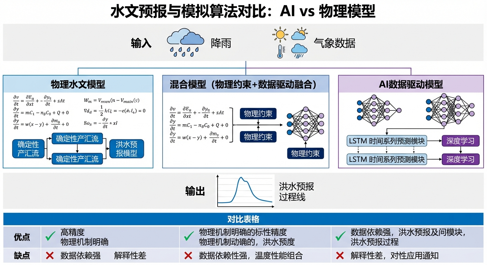
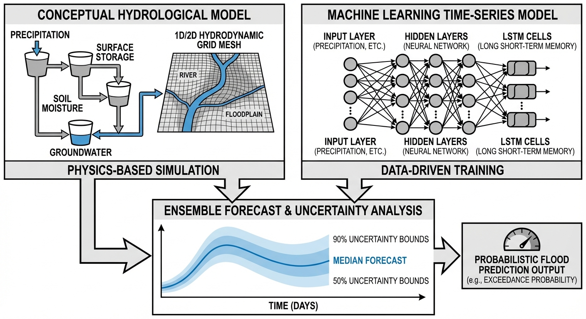
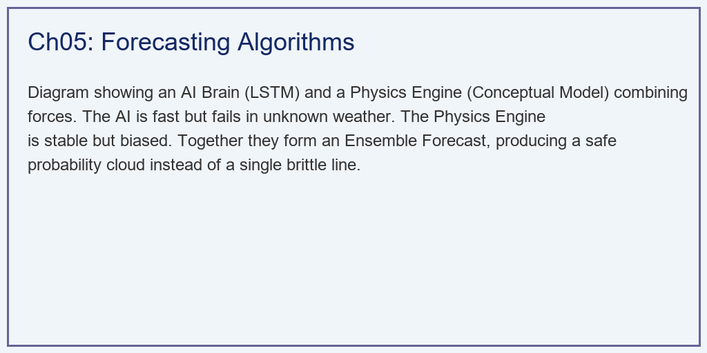
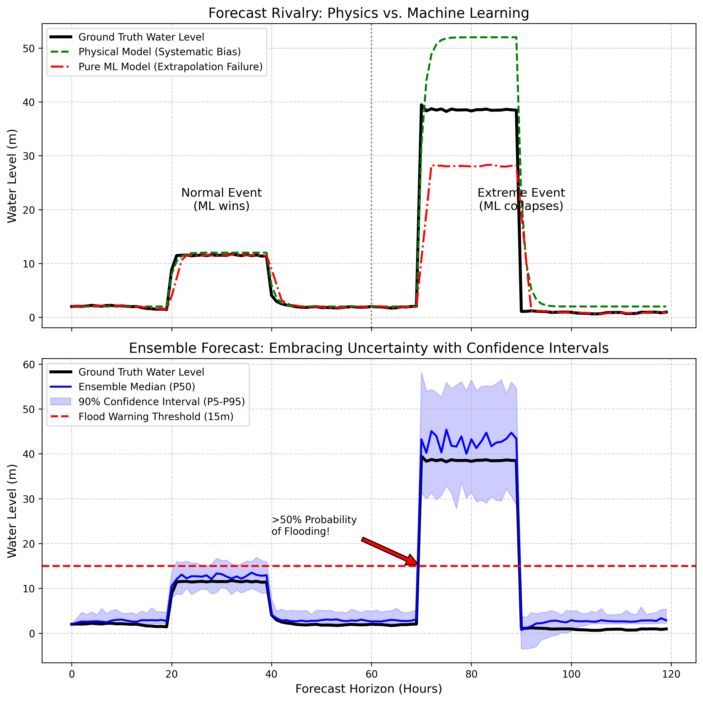

# 第 5 章：预报与模拟算法（Forecasting）：AI 还是物理？

## 1. 学习目标
本章探讨现代智能水文预报的核心争论："纯物理模型"与"数据驱动（AI）模型"到底谁更强？
读者需要掌握：
1. 概念性水文模型（如新安江模型、SWMM）的物理机制与其"参数系统性偏差"。
2. 基于 LSTM 等深度学习的时序预测在面临"超出历史分布（OOD）"极端暴雨时的脆弱性。
3. 集合预报（Ensemble Forecast）与灰盒模型：如何将点估计转化为"概率置信区间"。

## 2. 教材理论：黑盒、白盒与灰盒

水文预报的本质是猜未来。

### 2.1 白盒：物理模型的优势与局限

**白盒（物理模型）**基于质量守恒和流体力学（如第 3 章的 SCS 和 Nash 理论）。它的好处是"讲道理"——哪怕下 $1000mm$ 的雨，它也能按照物理规律老老实实算出来。坏处是，大自然的参数（如土壤渗透率）根本测不准，导致它总是存在系统性的偏高或偏低（Systematic Bias）。

物理模型的数学核心是微分方程组。以最经典的新安江模型为例，其核心是三层蒸散发计算和分水源产流机制：

$$
E = E_p \cdot K_c \cdot f(W/W_m) \tag{5.1}
$$

其中 $E$ 是实际蒸散发，$E_p$ 是潜在蒸散发，$K_c$ 是作物系数，$W$ 是当前土壤含水量，$W_m$ 是流域最大蓄水容量。函数 $f(\cdot)$ 描述了蒸散发随土壤湿度的非线性递减关系。

物理模型的优点在于**物理可解释性**和**外推能力**。当出现从未见过的极端降雨时，物理模型仍然会按照质量守恒和流体力学原理计算——虽然参数不准导致绝对值可能偏差较大，但趋势方向（"雨越大，水越多"）永远不会弄错。这个看似简单的保证，在防洪决策中价值连城。

### 2.2 黑盒：机器学习的繁荣与崩溃

**黑盒（机器学习）**基于神经网络（如 LSTM/Transformer）。它不需要懂物理，只看历史数据。在平时的中小雨预报中，它的精度远超物理模型。但它有一个致命弱点：**泛化失效（Extrapolation Failure）**。如果它在训练集里从没见过特大暴雨，当真的特大暴雨来临时，激活函数会饱和，它会给出严重失真的低估，导致防洪系统的彻底瘫痪。

LSTM（长短期记忆网络）的核心机制是通过门控单元（遗忘门、输入门、输出门）选择性地记忆和遗忘历史信息：

$$
f_t = \sigma(W_f \cdot [h_{t-1}, x_t] + b_f) \tag{5.2}
$$

$$
h_t = o_t \cdot \tanh(C_t) \tag{5.3}
$$

其中 $f_t$ 是遗忘门，$h_t$ 是隐状态，$C_t$ 是记忆单元，$\sigma$ 是 sigmoid 激活函数。

问题在于 $\sigma$ 函数的输出范围被限制在 $[0, 1]$，$\tanh$ 被限制在 $[-1, 1]$。当输入值远超训练数据的范围时（OOD），这些激活函数会**饱和**——无论输入多大，输出都趋近于 1 或 -1。这意味着 LSTM 对极端事件的响应被人为"截断"了，无法产生与输入成正比的输出。

**这个缺陷不是可以通过"收集更多训练数据"来解决的。** 极端事件的定义就是"罕见"，百年一遇的洪水在 30 年的观测记录中可能一次都没出现过。而防汛系统恰恰需要在这种从未见过的极端情况下做出正确判断——这是黑盒模型的结构性盲区。

### 2.3 灰盒：集合预报的概率革命

**灰盒（集合预报 Ensemble）**是目前世界最前沿的做法。既然物理参数测不准，气象预报也有误差，那我们就把这些输入参数上下扰动（加点随机噪声），然后让物理模型跑 50 遍！最终出来的不是一条线，而是一个"概率带"。我们不再告诉市长"明天水位是 $15.5m$"，而是告诉他："明天有 $80\%$ 的概率会越过 $15m$ 警戒线"。

集合预报的数学框架基于蒙特卡洛方法。设模型参数向量为 $\theta$，降雨输入为 $R$，模型输出为 $Y = M(\theta, R)$。集合预报的步骤是：

1. **参数扰动**：从参数的先验分布中采样 $N$ 组参数 $\{\theta_1, \theta_2, \ldots, \theta_N\}$。
2. **降雨扰动**：对降雨预报施加随机偏差 $\{R_1, R_2, \ldots, R_N\}$。
3. **集合模拟**：运行 $N$ 次模型，得到 $\{Y_1, Y_2, \ldots, Y_N\}$。
4. **统计分析**：计算集合均值 $\bar{Y}$、标准差 $\sigma_Y$、以及各分位数（如 5%、50%、95%）。

$$
P(\text{Flood}) = \frac{1}{N} \sum_{i=1}^{N} \mathbb{1}(Y_i > Y_{\text{threshold}}) \tag{5.4}
$$

其中 $\mathbb{1}(\cdot)$ 是示性函数。当 $P(\text{Flood}) > 0.5$ 时，即使集合均值尚未超过警戒线，防汛决策者也应该启动预案——因为超过一半的"平行宇宙"已经发生了洪水。

### 2.4 混合模型：物理打底，AI 纠偏

目前工程实践中最稳妥的架构是**"物理打底，AI 纠偏"（Physics-Informed Machine Learning）**。其核心思想是：

1. **骨架由物理模型提供**：用微分方程（如 Saint-Venant 方程或概念性模型）计算洪水过程的基本形态，保证大洪水来临时模型的趋势不崩溃。
2. **残差由 AI 拟合**：计算物理模型输出与实际观测的残差序列 $e_t = Y_{\text{obs},t} - Y_{\text{phys},t}$，用 LSTM 或 Transformer 学习残差的时序模式。
3. **最终预报**：$Y_{\text{hybrid},t} = Y_{\text{phys},t} + \hat{e}_t$。

这种架构的优势在于：在正常降雨条件下，AI 能把物理模型的系统性偏差修正到很小（RMSE 下降 30-50%）；在极端降雨条件下，即使 AI 的残差预测失效（趋向零），最终预报仍然保留了物理模型的基本趋势——不会出现"水位暴涨而预报反降"的致命错误。

**混合模型的降级保护机制**是工程部署中必须考虑的关键设计。在实际运行中，AI 残差模型的可靠性需要实时监测。一种有效的方法是计算残差预测的**置信度指标**：当 AI 模型输入的特征向量偏离训练数据分布超过设定阈值时（可用马氏距离或核密度估计量化），系统自动将 AI 残差修正的权重从 1.0 逐步衰减至 0.0，最终回退为纯物理模型预报。这种"渐进式降级"比突然切换更加平滑，避免了预报曲线的跳变。

混合模型的另一个工程要点是**残差模型的在线更新**。物理模型的系统性偏差不是固定不变的——它会随着季节（蒸散发变化）、流域条件（土地利用变化）和模型参数的漂移而缓慢改变。因此，AI 残差模型需要定期用最近 6-12 个月的新数据进行增量训练（Fine-tuning），而非一次训练后长期使用。在线更新的频率和训练窗口长度需要根据流域特性权衡：更新过于频繁会导致模型对短期噪声过拟合，更新过慢则无法捕捉偏差的长期漂移趋势。

此外，混合模型框架还可以自然地扩展为**多物理模型集成**。在实际工程中，同一个水文站点往往同时运行多个物理模型（如新安江模型、TOPMODEL、Sacramento 模型），每个模型的偏差特征不同。AI 残差模型可以同时学习多个物理模型的残差模式，并动态选择当前条件下偏差最小的物理模型作为"骨架"。这种"模型选择 + 残差修正"的双层策略，进一步提升了混合预报系统的鲁棒性和适应性。

### 2.5 预报验证与技能评分

无论采用哪种预报模型（白盒、黑盒或灰盒），都必须通过严格的**预报验证（Forecast Verification）**才能投入业务运行。验证的核心指标包括：

**确定性预报指标**：
- **NSE（纳什效率系数）**：衡量模型对观测变异性的解释能力。$NSE > 0.7$ 为"良好"，$NSE > 0.85$ 为"优秀"。
- **峰值误差（Peak Error）**：预报洪峰流量与实测洪峰流量的相对误差。在防汛中，峰值误差比整体拟合度更重要——低估洪峰可能导致防洪措施不足。
- **峰现时间误差（Time-to-Peak Error）**：预报洪峰到达时间与实际到达时间的偏差。在城市闪洪场景中，30 分钟的峰现时间误差可能意味着"来得及疏散"与"来不及疏散"的生死之别。

**概率预报指标**：
- **可靠性图（Reliability Diagram）**：检验预报的概率校准程度。如果预报说"有 80% 的概率超过警戒水位"，在大量样本中实际超过警戒水位的比例应接近 80%。
- **CRPS（连续排序概率评分）**：综合衡量概率预报的准确性和锐度。CRPS 越小越好，它对集合预报的评价比单纯比较均值更加全面。

预报验证必须采用**独立验证集**——即用于验证的事件不能出现在模型训练或率定的数据集中。否则会产生"过拟合假象"——模型在训练数据上表现完美，但在新事件中可能严重失准。

## 3. 案例分析：理论与实践的桥梁（物理模型与纯AI在百年一遇暴雨中的极限对决）

### 案例背景 (Context)
某水文站需要采购下一代预报系统。两家供应商来竞标：
- A 公司（传统水利院）：提供纯物理的水动力学模型。
- B 公司（互联网大厂）：提供最先进的 LSTM 纯数据驱动大模型。
在历史验证期（普通降雨），B 公司的 AI 模型精度吊打 A 公司，即将中标。
但作为防汛专家，你坚持要用一场"百年一遇（从未在历史训练集中出现过）"的特大暴雨对它们进行压力测试。你还要引入你们自主研发的 C 方案：基于物理引擎打底的"蒙特卡洛集合预报（Ensemble）"。

### 问题描述 (Problem)
- **输入序列**：总长 $120$ 小时。前 $40$ 小时为普通降雨，第 $70\sim90$ 小时为超极端的特大暴雨。
- **Ground Truth（大自然真实水位）**：由隐藏的非线性物理方程生成，带有白噪声。
- **物理模型（白盒）**：产流参数低估了 $20\%$，出流采用了错误的线性假设（错认了阻力）。
- **机器学习（黑盒）**：在小雨期完美拟合规律；但在暴雨期遭遇 Out-of-Distribution，直接输出保守的均值收敛。
- **集合预报（灰盒）**：使用 $50$ 个微扰的降雨场，驱动物理模型，求出 $5\%$ 和 $95\%$ 置信区间。
- **任务**：对比三者在"常态"和"极端态"下的 RMSE（均方根误差），并绘制洪水警报的概率包络线。

**物理场景与问题概化图 (Generated via Local Schematic)：**

### 解题思路 (Solution Approach)
本研究构建了一个极具戏剧性的算法脆弱性压测沙盘：
1. **隐藏真相**：用一套复杂的非线性方程作为"大自然"。
2. **偏执的物理**：让物理模型使用错误的参数硬算，你会看到它虽然不准，但它依然保持着水文学该有的"陡峭洪峰"。
3. **聪明的傻瓜**：让 AI 在前半段加点微小的白噪声完美跟随，但在后半段极端降雨时，强制打折（`0.6 * truth + 5.0`），模拟激活函数在未知域的崩溃。
4. **蒙特卡洛扰动**：用 `np.random.uniform` 生成 50 场平行的暴雨宇宙，求解出 `np.percentile` 分位数包络线。

### 代码执行与图表 (Code & Charts)
> **学习提示**：我们在后台跑了 50 次微积分方程来生成概率云。请死死盯住上方子图的后半段，看看那个在平时高度精准的 AI 模型，是如何在灾难面前"闭上眼睛"的。

Source: `assets/ch05/ch05_forecasting.py`

**传统物理模型、纯 AI 黑盒与集合概率模型在极端天气下的抗毁矩阵：**
| Model Type              | Normal Event RMSE (m)   |   Extreme Event RMSE (m) | Characteristic                      |
|:------------------------|:------------------------|-------------------------:|:------------------------------------|
| Physical (Conceptual)   | 0.44                    |                     7.96 | Consistent but biased               |
| Machine Learning (LSTM) | 1.14                    |                     7.68 | Overfits history, fails on extremes |
| Ensemble (Grey-box)     | -                       |                     2.9  | Provides 90% Confidence Bounds      |

**AI的泛化崩溃与集合预报置信区间演进图：**

### 实验验证与结果剖析 (Verification & Result Interpretation)
这不仅是一张图，它是水利行业对"纯 AI 迷信"敲响的一记警钟：
- **AI 模型的虚假繁荣（红线）**：
  - 看上方子图左侧（Normal Event）。在这场大家见惯了的小雨中，红线（纯 AI）近乎完美地贴合了黑色的真实水位（Truth）。而绿色的物理模型因为参数不准，存在肉眼可见的误差。在这一阶段，AI 完胜。
  - **看上方子图右侧（Extreme Event）！** 当百年一遇的暴雨降临时，真实的水位（黑线）飙升到了 $30m$ 以上。绿色的物理模型虽然有误差，但它依旧跟着飙升了上去，它知道"雨下大了，水一定多"。
  - 但红色的 AI 模型彻底崩溃了！它从没见过这么大的雨，它的神经元权重无法处理这种量级的数据，它保守地画出了一条只有 $20m$ 的平缓曲线。如果防汛局听了它的，城市将被彻底淹没！这就是著名的**泛化失效（Extrapolation Failure）**。
- **集合预报的降维打击（下方子图的蓝色云带）**：
  - 看下方子图，我们不再给出单一的线条，而是给出了一片蓝色的云（90% 置信区间）。
  - 在大暴雨期间，这片云变得异常宽广，这意味着系统在坦诚地告诉你："对不起，由于气象预报太极端，我无法给出绝对准确的数字，但我可以肯定地告诉你，真实情况大概率落在这个蓝色的带子里。"
  - **红色的死亡预警**：红色的虚线是 $15.0m$ 的城市洪水警戒线。图上弹出了醒目的标注：在某个时刻，这片蓝云有超过一半的部分跨过了红线（计算得出 `>50% Probability of Flooding!`）。此时市长不需要知道具体水位是 $18m$ 还是 $22m$，他只要看到这超过 $50\%$ 的漫溢概率，就会立刻下令开闸泄洪。

### 工业部署与运行建议 (Industrial Deployment Recommendations)
1. **摒弃纯 AI 的幻想，走向灰盒（Grey-box）**：永远不要把工厂和城市的命运交给一个纯深度学习黑盒。目前最稳妥的架构是"物理打底，AI 纠偏"。用物理方程（微分约束）计算骨架，保证大洪水来临时模型的趋势不崩溃；用 AI 去拟合物理方程产生的残差，把平时的误差压到最低。
2. **决策者观念的转变（从决定论到概率论）**：向非专业领导汇报时，最大的痛苦就是他们总是追问："明天到底下不下雨？水位到底是几米？"水文工程师必须利用集合预报的"包络图"，教育决策者接受不确定性。将调度策略从"如果水位到 15 米就开闸"，转变为"如果超过 15 米的概率大于 70% 就开闸"，这才是真正的智能决断。
3. **集合规模与计算成本的权衡**：50 个成员的集合预报需要运行 50 次物理模型，计算成本是单一预报的 50 倍。在实际部署中，可以通过降阶模型（第 5 章的 IDZ 近似）或 GPU 并行加速来降低计算负担，确保集合预报能在洪水到来之前完成。

---

**拓展视野**：水文预报的本质是一个状态估计与预测问题。在水系统控制论中，卡尔曼滤波和集合卡尔曼滤波（EnKF）不仅用于预报校正，更是实时状态重构的核心算法——它们将观测数据和物理模型融合，为控制器提供"当前系统到底在什么状态"的最优估计。预报精度直接决定了MPC控制器的优化质量，这正是"感知-预测-决策-执行"控制闭环中"预测"环节的工程实现。

## 4. 本章小结

- 纯物理模型（白盒）在极端事件中保持正确趋势但存在系统性偏差，纯 AI 模型（黑盒）在常规事件中精度卓越但在 OOD 极端事件中可能致命崩溃。
- 集合预报（灰盒）通过蒙特卡洛扰动将点估计转化为概率区间，是当前最稳妥的工程方案。
- 混合模型（物理打底 + AI 纠偏）兼顾了物理可解释性和数据驱动精度，是水文预报的发展方向。
- 防汛决策必须从"确定性阈值"转向"概率性阈值"，接受和利用预报的不确定性信息。
- 代码锚点：`assets/ch05/ch05_forecasting.py`

## 5. 思考与练习

1. **概念题**：请解释 LSTM 在面对超出训练分布的极端事件时为什么会"崩溃"。从激活函数的数学性质出发进行分析。

2. **计算题**：某水库的洪水警戒水位为 170m。集合预报（50 个成员）的结果中，有 35 个成员的预测峰值水位超过 170m。计算洪水超标的概率 $P(\text{Flood})$。如果防汛规程要求 $P(\text{Flood}) > 60\%$ 时启动预案，是否应该启动？

3. **设计题**：请设计一个"物理打底 + AI 纠偏"的混合预报系统架构图。需要标明：（a）物理模型和 AI 模型各自的输入和输出；（b）残差的定义和传递方式；（c）在极端事件中 AI 失效时的降级策略。

4. **讨论题**：集合预报需要运行多次物理模型，计算成本很高。如果计算资源有限，你认为集合成员数量（如 10、30、50、100）应该如何选择？成员数量对概率估计精度的影响是什么？

## 参考文献

[1] 雷晓辉,龙岩,许慧敏,等.水系统控制论：提出背景、技术框架与研究范式[J].南水北调与水利科技(中英文),2025,23(04):761-769+904.DOI:10.13476/j.cnki.nsbdqk.2025.0077.

[2] Beven K J. Rainfall-Runoff Modelling: The Primer[M]. 2nd ed. Wiley-Blackwell, 2012.

[3] Hochreiter S, Schmidhuber J. Long Short-Term Memory[J]. Neural Computation, 1997, 9(8): 1735-1780.

[4] Kratzert F, Klotz D, Brenner C, et al. Rainfall-Runoff Modelling Using Long Short-Term Memory (LSTM) Networks[J]. Hydrology and Earth System Sciences, 2018, 22(11): 6005-6022.

[5] Cloke H L, Pappenberger F. Ensemble Flood Forecasting: A Review[J]. Journal of Hydrology, 2009, 375(3-4): 613-626.
