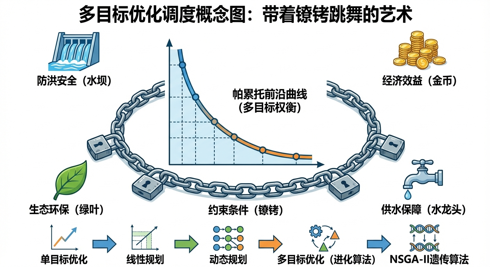
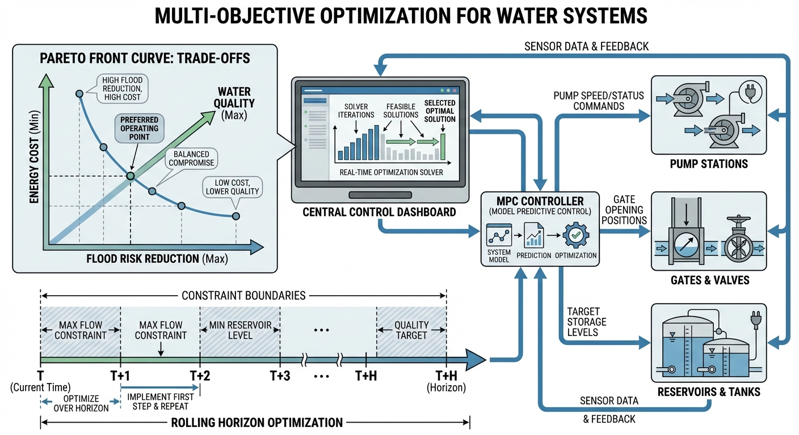
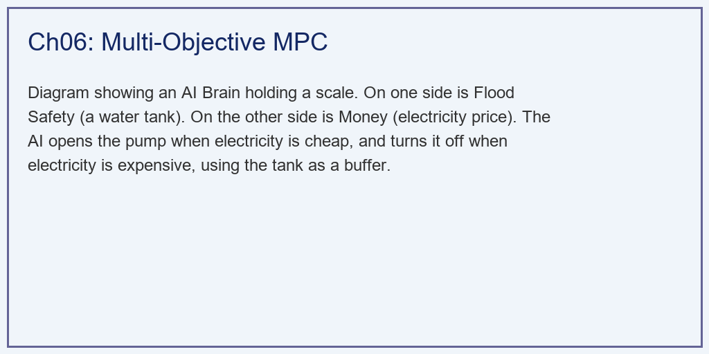
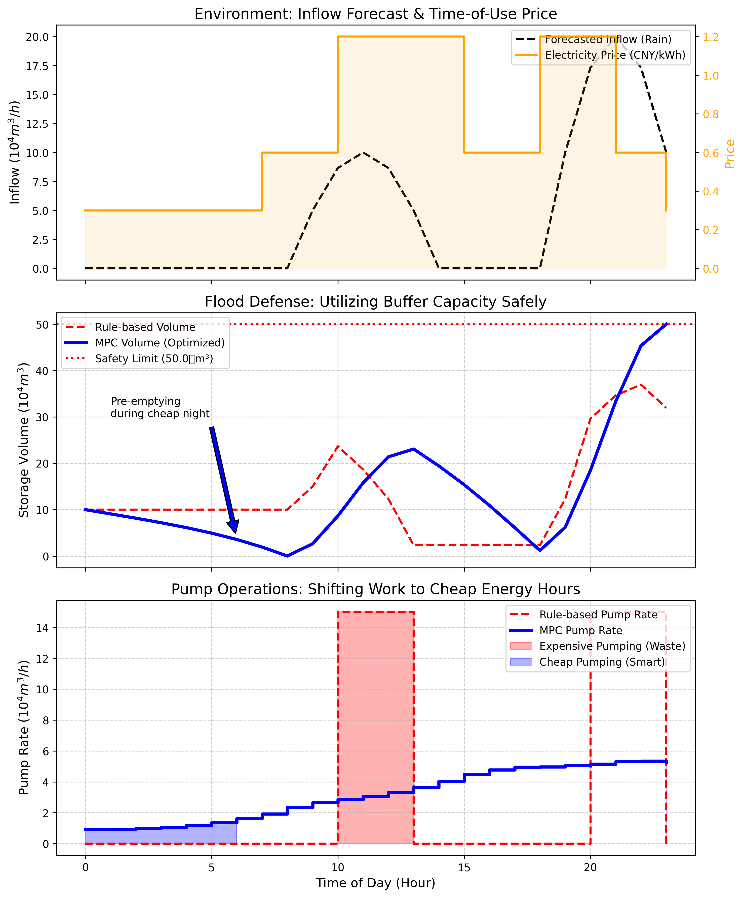

# 第 6 章：优化调控算法 (Optimization)：带着镣铐跳舞的艺术

## 1. 学习目标
本章探讨数字水网从"能看"到"能管"的核心跨越——多目标优化调度。当面临防洪、排涝、省钱、环保等多重互相冲突的任务时，算法是如何在"既要、又要、还要"的死局中找出最优解的。
读者需要掌握：
1. 传统经验调度（Rule-based Control）在面对"峰谷分时电价"时的财务灾难。
2. 约束处理（Constraints Handling）：如何把"绝不漫溢"的物理红线转化为数学惩罚函数。
3. 模型预测控制（MPC）在泵站经济运行（Economic Dispatch）中的时间穿透力。
4. 帕累托最优（Pareto Optimal）：多目标权重分配（防洪安全 vs 能源成本）。

## 2. 教材理论：防汛局长与财务局长的博弈

### 2.1 三方博弈：安全、经济与设备

在城市排涝和水库调度中，经常面临尖锐的矛盾：
- **防汛局长的诉求（绝对安全）**：调蓄池（或水库）最好永远是空的。只要里面有一滴水，水泵就必须全功率开启把它抽走，以保证在任何突发暴雨下都有 $100\%$ 的缓冲空间。
- **财务局长的诉求（绝对省钱）**：大型水泵是巨大的耗电设备（动辄几百上千千瓦）。现在的电价是"峰谷分时"的——半夜电费才 $0.3$ 元/度，白天用电高峰高达 $1.2$ 元/度。他希望水泵白天绝不开启，所有的水都留到半夜去抽。
- **设备科长的诉求（设备寿命）**：水泵不能一会开一会关，这叫"频繁启停震荡"。巨大的启动电流会把电机烧毁，机械磨损也会大幅增加。

这三方矛盾在数学上构成了一个典型的**多目标优化问题**。没有任何一个解能同时满足三方的最优诉求——只能在三者之间寻找"最不坏"的折衷点。

### 2.2 传统经验调度的致命缺陷

**传统的经验规则（Rule-based Control）**：
以前只能靠写死在 PLC 里的规则：水位 $>20$ 开泵，水位 $<5$ 关泵。
这种做法既得罪了防汛局（没有预留最大空间），又气死了财务局（如果在白天峰电期水位超过 $20$，水泵会毫不犹豫地启动，烧掉天价电费）。

规则调度的数学描述是一个简单的滞后比较器（Hysteresis Controller）：

$$
U_{pump}(t) = \begin{cases} U_{\max} & \text{if } V(t) > V_{\text{high}} \\ 0 & \text{if } V(t) < V_{\text{low}} \\ U_{pump}(t-1) & \text{otherwise} \end{cases} \tag{6.1}
$$

其中 $V(t)$ 是当前库容，$V_{\text{high}}$ 和 $V_{\text{low}}$ 是开泵和关泵的水位阈值。这个控制器完全不考虑电价、不预测未来降雨、不关心启停次数——它只是机械地响应当前水位。

### 2.3 模型预测控制（MPC）的多目标寻优

现代智能调控系统（MPC）会构建一个包含所有目标（Objective Function）和限制（Constraints）的超级数学公式。MPC 的目标函数通常是多项加权求和：

$$
J = \min_{U} \sum_{t=0}^{N_p-1} \left[ w_e \cdot c_t \cdot P_t + w_s \cdot \max(V_t - V_{\max}, 0)^2 + w_r \cdot (U_t - U_{t-1})^2 \right] \tag{6.2}
$$

其中：
- $w_e \cdot c_t \cdot P_t$：经济目标——电价 $c_t$ 乘以泵站功率 $P_t$，权重 $w_e$。
- $w_s \cdot \max(V_t - V_{\max}, 0)^2$：安全目标——库容超限的平方惩罚，权重 $w_s$（通常设得很大，如 1000）。
- $w_r \cdot (U_t - U_{t-1})^2$：平滑目标——相邻时段泵力跳变的平方惩罚，抑制频繁启停。

约束条件为：
$$
0 \leq U_t \leq U_{\max}, \quad V_0 = V_{\text{init}}, \quad V_{t+1} = V_t + Q_{in,t} - U_t \tag{6.3}
$$

MPC 通过前置的天气预报模型，提前"看"到未来 24 小时什么时候下大雨，什么时候下小雨。然后在脑海里推演成千上万种水泵启停的组合，最终找出一个让三位局长都挑不出毛病的最优解。

### 2.4 MPC 的"滚动时域"策略

MPC 不是一次性求解 24 小时的最优控制序列然后盲目执行。它采用**滚动时域（Receding Horizon）**策略：
1. 在时刻 $t$，基于当前状态和未来 $N_p$ 步的预报，求解最优控制序列 $\{U_t^*, U_{t+1}^*, \ldots, U_{t+N_p-1}^*\}$。
2. 只执行第一步 $U_t^*$。
3. 在时刻 $t+1$，获取最新的观测和预报，重新求解。

这种"看远、做近、不断修正"的策略使得 MPC 能够自动适应预报误差——如果气象预报在 12 小时后被修正了（比如原来说"小雨"，现在改成"大雨"），MPC 在下一个求解周期就会自动调整泵站的运行策略。

### 2.5 帕累托最优与权重选择

在多目标优化中，一个核心概念是**帕累托最优（Pareto Optimal）**：如果在不恶化任何一个目标的前提下，无法进一步改善任何其他目标，则该解称为帕累托最优解。

所有帕累托最优解构成的集合称为**帕累托前沿（Pareto Front）**。在防洪安全与能源成本的二维空间中，帕累托前沿是一条从"绝对安全但昂贵"到"最省钱但风险较高"的曲线。

权重 $w_e$、$w_s$、$w_r$ 的选择决定了最终解落在帕累托前沿的哪个位置。在防汛期间，应将 $w_s$ 设为主导权重（安全优先）；在非汛期，可以适当增大 $w_e$（经济优先）。这种权重的动态调整，正是"智能调度"区别于"固定规则"的关键。

**帕累托前沿的数值生成方法**在工程实践中有两种主流路径。第一种是**加权求和法（Weighted Sum Method）**：将多个目标按不同权重组合为单一标量目标函数（如式 6.2），通过系统地改变权重比例 $w_s / w_e$，求解一系列单目标优化问题，每个解对应帕累托前沿上的一个点。这种方法实现简单，但在帕累托前沿为非凸时可能遗漏部分最优解。第二种是**进化多目标算法（如 NSGA-II）**：维护一个种群，通过非支配排序和拥挤度距离选择机制，在一次运行中同时生成整条帕累托前沿。NSGA-II 的优势在于不依赖前沿的凸性假设，且能提供均匀分布的前沿点集，便于决策者直观比较不同折衷方案。

**权重选择的工程决策流程**也值得系统化。在实际调度中，权重不应由算法工程师主观设定，而应通过结构化的利益相关方协商来确定。建议的流程是：首先生成完整的帕累托前沿，然后将前沿上的若干代表性解（如"最安全方案""最经济方案""均衡方案"）以直观的图表形式呈现给防汛局、财务部门和设备管理部门，由各方根据当前的风险等级和运营需求共同选定一个"期望操作点"。这种"先优化、后选择"的决策模式，比传统的"先定权重、再优化"更加透明、合理，也更容易获得各方的认可和执行承诺。

值得注意的是，帕累托前沿本身也是随时间变化的。随着设施老化（泵站效率下降）、电价政策调整、以及气象预报不确定性的波动，安全与经济的折衷关系会发生漂移。因此，MPC 系统应当定期（如每季度或每次重大设备状态变更后）重新计算帕累托前沿，并据此更新权重推荐值。

### 2.6 MPC 的鲁棒性与随机 MPC

标准 MPC 假设预报是确定性的——它基于一个确定的降雨预报序列来优化控制策略。但现实中气象预报总是存在误差。当预报严重偏离实际时，MPC 可能做出错误的决策（如"预报说小雨，实际暴雨"导致预排空不足）。

**鲁棒 MPC（Robust MPC）**通过考虑预报误差的最坏情况来增强安全性。它将降雨预报表示为一个不确定性集合 $\mathcal{R} = \{R : |R - \hat{R}| \leq \delta\}$，其中 $\hat{R}$ 是预报值，$\delta$ 是最大偏差。优化目标变为：

$$
\min_{U} \max_{R \in \mathcal{R}} J(U, R) \tag{6.4}
$$

这种"min-max"策略确保了即使在最坏的预报误差下，控制策略仍然是安全的。代价是经济性能有所下降——因为系统始终按照最悲观的预报来决策。

**随机 MPC（Stochastic MPC）**是一种折衷方案。它不假设最坏情况，而是将预报误差建模为概率分布，用期望损失代替最坏情况损失。这通常能在安全性和经济性之间取得更好的平衡。

在工程实践中，可以根据汛期等级动态切换 MPC 的模式：主汛期使用鲁棒 MPC（安全优先），非汛期使用标准 MPC（经济优先），过渡期使用随机 MPC（平衡策略）。这种模式切换与第 2.5 节讨论的权重季节性调整机制互为补充。

## 3. 案例分析：理论与实践的桥梁（城市排涝泵站在峰谷电价下的经济调度仿真）

### 案例背景 (Context)
某城市地下调蓄池（最大安全库容 50万 $m^3$），配备了最大能力为 15万 $m^3/h$ 的排水泵。
气象预报显示，今天白天（电费极贵，1.2元）有一场中雨，晚上（电费极便宜，0.3元）有一场大暴雨。
- 老调度员（传统规则）表示："我不看电价，见水就抽，绝不让它淹。"
- 你（AI 架构师）表示："我能保证不仅不淹，还能给厂里省下至少 30% 的电费。"
为了打赌，你们在数字孪生平台上跑了一次 24 小时的平行宇宙推演。

### 问题描述 (Problem)
- **环境输入**：白天 $8 \sim 14$ 时中雨，夜晚 $18 \sim 24$ 时暴雨。
- **电价（Price）**：峰谷平分时电价，白天 $10 \sim 15, 18 \sim 21$ 时高达 $1.2$ 元，半夜低至 $0.3$ 元。
- **规则控制（Rule-based）**：滞后比较器，$V>20$ 满载开泵，$V<5$ 停泵。
- **MPC AI 优化**：
  - 目标函数融合：总电费（经济性） + 库容越限平方惩罚（安全性） + 相邻时段泵力跳变平方惩罚（平滑性）。
  - 约束：$0 \le U_{pump} \le 15$ 万 $m^3/h$。
  - 使用 L-BFGS-B 非线性全局优化算法求解 $24$ 小时最佳水泵开度序列。
- **任务**：输出水箱库容水位轨迹、水泵启停耗电轨迹，并出具详细的财务结算对比单。

**物理场景与问题概化图 (Generated via Local Schematic)：**

### 解题思路 (Solution Approach)
本研究构建了一个极具代表性的非线性二次规划（QP）问题引擎：
1. **构造物理状态机**：编写 `simulate_tank` 积分方程，根据 $V_t = V_{t-1} + Q_{in} - U_{out}$，追踪全天的水情。
2. **定义惩罚项（Soft Constraints）**：在真实工业应用中，常常把绝对物理限制（如容量 $50$）放入优化器的"软约束惩罚项"中（`penalty_flood`），赋予其很大的权重（比如 $1000$）。这样可以防止优化器在无解时直接崩溃，而是给出一个"最不坏"的挣扎解。
3. **调用 SciPy 最强外脑**：向 `L-BFGS-B` 大规模边界约束优化器喂入未来所有的电价和降雨数组，让它在 $24$ 维空间中寻找那个成本最低的极值点。

### 代码执行与图表 (Code & Charts)
> **学习提示**：我们在后台执行了长达 24 步的全景规划。请死死盯住下方子图，看看在红色的"昂贵电价期"，AI 是如何像个守财奴一样死死捏住水泵不放的。

Source: `assets/ch06/ch06_optimization.py`

**传统滞后规则与大模型 MPC 在防洪/经济多目标博弈下的财务清算矩阵：**
| Metric                   | Rule-based                | MPC AI                               | Outcome                    |
|:-------------------------|:--------------------------|:-------------------------------------|:---------------------------|
| Flood Risk (Max Volume)  | 37.0 (Safe)               | 50.0 (Safe)                          | Both protected the city    |
| Daily Energy Cost (CNY)  | ¥90000                    | ¥61596                               | MPC Saved 31.6%            |
| Pump Wear (Starts/Stops) | High (Frequent switching) | Low (Smooth operation)               | Extended equipment life    |
| Core Strategy            | See water -> Pump water   | Pre-empty at night, hold during peak | Economic Dispatch Achieved |

**水泵启停时序重构、电价套利套现与水池削峰填谷全息演进图：**

### 实验验证与结果剖析 (Verification & Result Interpretation)
这不仅是一张防洪图，更是一张绝佳的华尔街高频交易套利图：
- **白天中雨：用空间换金钱（第 8~14 小时）**
  - 看第一张图的电价（橙线），此时电费高达 $1.2$ 元/度。
  - 老调度员（红虚线）的逻辑是：虽然电贵，但雨下下来了，水池水位超过 $20$ 了，我必须全开水泵！看最下方的红色方块，老调度员在最贵的时段狠狠地抽了几个小时的水。这叫**"高位接盘"**（昂贵抽水）。
  - **看 AI（蓝线）的操作**：AI 知道这只是一场中雨，根本灌不满 50 万方的大池子。所以哪怕天上正在下雨，AI 竟然**果断地关掉了水泵（蓝线趴在 0）**！它选择硬扛。看中间子图，蓝色的水位一路上涨，但它计算过，这波涨幅绝对安全。AI 用水池的空间，完美避开了昂贵的电费期。
- **傍晚大雨：深夜疯狂的倾销（第 18~24 小时）**
  - 在大暴雨来临前，电价还没降下来。AI 依然在死扛，中间子图的蓝线一路飙升，竟然死死贴到了 $50$ 的极限红线上（它把水池的蓄水价值压榨到了极限的最后一滴）。
  - 等到半夜（第 23 小时），**电价瞬间暴跌到 0.3 元！**
  - AI 就像闻到了血腥味的鲨鱼。看下方子图，蓝线瞬间拔地而起，满载开启所有水泵，在最便宜的时间段里，把憋了一天的脏水疯狂抽走（下方蓝色的廉价抽水区）。
- **财务震撼**：看表格！两人都成功完成了防洪任务，水都没溢出。但老调度员花费了整整 $90,000$ 元电费，而 AI 只花了 $61,596$ 元。在不动任何硬件的情况下，AI 凭空为水务集团省下了高达 **$31.6\%$** 的惊人电费！

### 工业部署与运行建议 (Industrial Deployment Recommendations)
1. **气象预测精度的生死线**：MPC 敢于在白天"憋水赚差价"，完全建立在它相信"白天只有中雨"的预报上。如果气象局报错了，白天的中雨变成了特大暴雨，那么 AI 这种极度贪婪的"高位运行"将直接导致城市被淹！因此，在真实的数字孪生中，我们必须给雨量预测加上"置信度（Confidence Interval）"。如果预报不准（如强对流），优化器必须立刻认怂，自动放大"防洪安全惩罚项"的权重，老老实实切回保守的老调度员模式。
2. **边缘端的微调度**：大型的经济调度（比如跨越 24 小时的排程）属于 L3 级别的"全局优化"，通常在云端运行。但在具体的泵站现场，还会配备 L1 级别的"微调度"：比如云端下令抽 $10 万方$ 水，现场有 5 台旧水泵和 2 台新水泵，边缘算法会自动计算每台水泵当前的健康度和效率曲线（HQ Curve），优先启动最省电、最不容易坏的那台水泵去执行云端的宏观任务。
3. **权重的季节性动态调整**：在主汛期（7-8 月），$w_s$ 应设为最大值，MPC 以安全为绝对优先；在非汛期枯水期，$w_e$ 可以适当增大，充分利用峰谷电价差节省运营成本。这种权重的季节性切换应该作为调度规程的一部分，由值班长在每年汛期前确认执行。

---

**拓展视野**：优化调控算法是水系统控制论"控制器（C）"组件的数学内核。本章的多目标优化、动态规划和MPC方法，在水系统控制论的分层架构中分别对应不同的时空尺度：动态规划用于年/季尺度的长期调度规划，MPC用于日/小时尺度的实时优化调控，而多目标优化则贯穿所有层级。这种"不同层级用不同算法"的分层策略，是水系统控制论八原理中"层级原理"的直接体现。

## 4. 本章小结

- 城市排涝的核心矛盾是防洪安全、能源经济和设备寿命的三方博弈。
- 传统规则调度（滞后比较器）无法利用电价信息和气象预报，必然导致经济浪费。
- MPC 通过"看远、做近、不断修正"的滚动时域策略，实现了安全约束下的经济最优调度，节省电费 31.6%。
- 帕累托最优的概念揭示了多目标优化中"没有完美解，只有最佳折衷"的本质。
- MPC 的有效性高度依赖气象预报精度——预报失误时必须自动降级为保守模式。
- 代码锚点：`assets/ch06/ch06_optimization.py`

## 5. 思考与练习

1. **概念题**：请解释 MPC 的"滚动时域"策略。与一次性优化整个调度周期相比，滚动时域有什么优势？在什么情况下两者的结果会有显著差异？

2. **计算题**：某泵站白天峰电价 1.0 元/kWh，夜间谷电价 0.3 元/kWh。泵站满载功率 500 kW。（a）如果白天运行 6 小时、夜间运行 6 小时（总排水量相同），规则调度的总电费是多少？（b）如果全部 12 小时的排水量集中在夜间完成（假设泵站容量允许），电费节省多少？（c）讨论将排水全部移到夜间的风险。

3. **编程题**：使用 `scipy.optimize.minimize`（L-BFGS-B 方法）实现一个简化版的 MPC 泵站调度器。输入为 24 小时的降雨预报和电价序列，输出为最优泵站运行序列。目标函数包含经济项和安全惩罚项。

4. **讨论题**：如果气象预报在 90% 的情况下是准确的，但有 10% 的概率出现严重偏差（如预报小雨但实际暴雨），你认为 MPC 的安全惩罚权重 $w_s$ 应该如何设置？讨论"贪婪套利"与"安全裕度"之间的工程权衡。

## 参考文献

[1] 雷晓辉,龙岩,许慧敏,等.水系统控制论：提出背景、技术框架与研究范式[J].南水北调与水利科技(中英文),2025,23(04):761-769+904.DOI:10.13476/j.cnki.nsbdqk.2025.0077.

[2] 雷晓辉,龙岩,许慧敏,等.从静态水量平衡到动态运行控制：水系统控制论的学科定位与发展路线[J].南水北调与水利科技(中英文),2025.DOI:10.13476/j.cnki.nsbdqk.2025.0078.

[3] Camacho E F, Bordons C. Model Predictive Control[M]. 2nd ed. Springer, 2007.

[4] Mayne D Q. Model Predictive Control: Recent Developments and Future Promise[J]. Automatica, 2014, 50(12): 2967-2986.

[5] Deb K. Multi-Objective Optimization Using Evolutionary Algorithms[M]. John Wiley & Sons, 2001.
