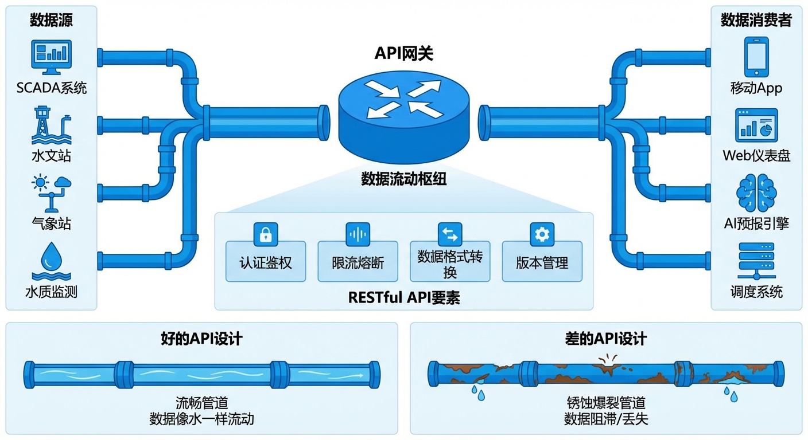
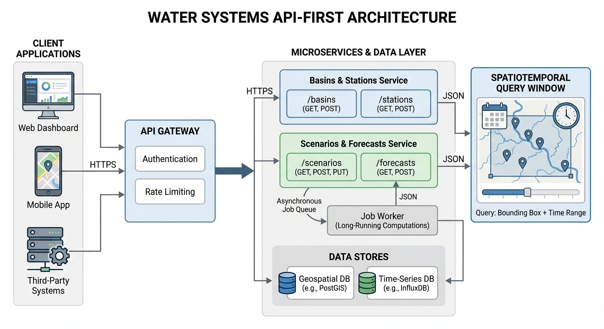
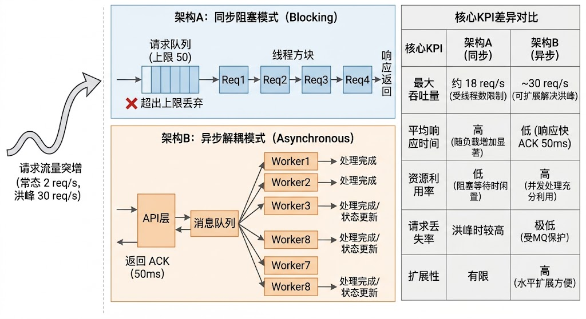
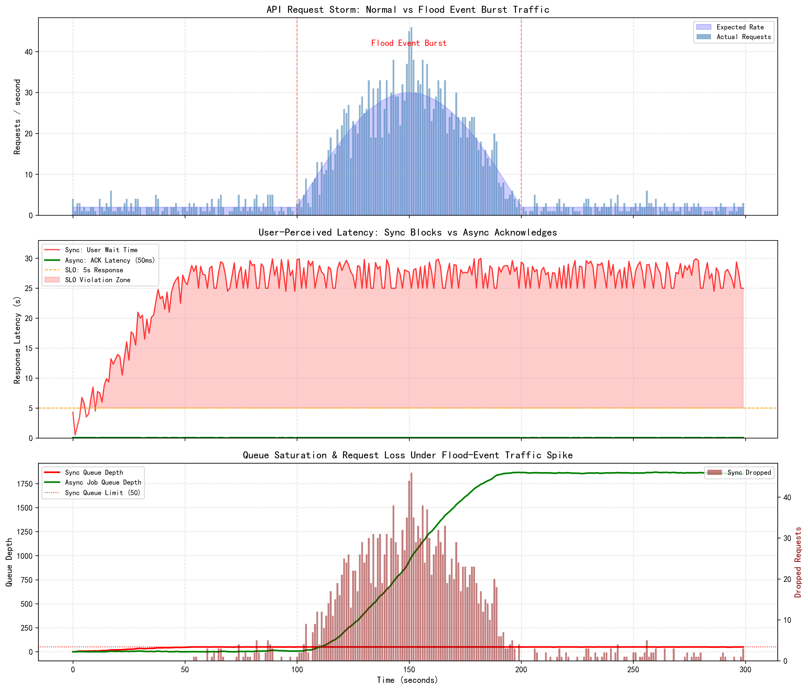

# 第 7 章：面向关键水务系统的 API 设计：让数据像水一样流动

## 1. 学习目标

本章深入探讨智能水文平台的核心基础设施——应用程序编程接口（Application Programming Interface, API）。在物理世界的流域中，我们依靠管网、渠道和泵站来输送与调配实体水资源；而在数字孪生的虚拟空间内，API 则充当着"数字管网"的角色，负责在传感器、计算引擎、决策支持系统与最终用户之间高效、安全地输送数据流与控制指令。

一套缺乏宏观规划与工程规范的 API 架构，犹如一根年久失修、布满暗漏的铁管：在日常平稳运行时或许能勉强维持基本运转，然而一旦遭遇极端天气引发的请求风暴，系统便会瞬间面临资源耗尽、级联失效甚至全面崩溃的风险。在现代防汛减灾体系中，信息传递的延迟与阻断往往会引发严重的次生灾害。

通过本章的系统学习，读者需要深刻理解并掌握以下核心知识体系：
1. **API-First（接口优先）架构哲学**：剖析为何在现代水务软件工程中，必须摒弃传统的"大屏优先"或"数据库驱动"模式，转而采用以 API 契约为核心的并行开发范式。
2. **RESTful 资源模型与状态转移**：掌握如何将水文物理实体（流域、测站、水库）与抽象业务逻辑（模型预报、调度推演、多目标优化）精准映射为标准化的 HTTP 资源路径（URL）。
3. **排队论视角下的同步并发危机**：运用数学模型论证同步 API 在处理高计算复杂度水文仿真场景时的系统性缺陷，理解线程饥饿与雪崩效应的产生机理。
4. **异步任务队列（Async Job Queue）与事件驱动架构**：深入探讨如何利用消息中间件与后台工作池（Worker Pool）构建具备高吞吐、低延迟特性的抗压架构，确保系统在洪水事件的并发请求风暴中坚如磐石。
5. **API 网关治理与纵深防御安全机制**：学习限流、熔断、服务发现等微服务治理技术，以及零信任架构下的身份认证、授权与加密体系。

## 2. 教材理论：为什么水利系统需要 API-First 架构？

### 2.1 "项目制"的技术债务与架构演进

长期以来，水利信息化领域的建设模式多以传统的"项目制"为主导：业务部门提出具体需求，开发实施方围绕该特定需求构建一套高度定制化的系统（常见形式为各类"驾驶舱"或"业务大屏"）。这种模式通常导致系统的前端展示界面与后端关系型数据库形成深度的紧耦合。

这种单体式、紧耦合架构在系统生命周期中后期会暴露出沉重的技术债务：
- **牵一发而动全身**：每当引入新型水文水动力学算法（例如第 6 章论述的模型预测控制 MPC 调度器），或者更新底层河网拓扑结构时，往往需要从数据持久层到视图层进行全链路的"侵入式"修改。
- **孤岛效应与扩展性壁垒**：每当需要与外部异构平台（如气象局的数值天气预报网格数据、应急管理部门的灾情上报系统）进行数据对接时，开发人员不得不编写大量一次性的、难以复用的点对点数据转换脚本（ETL），导致系统内部充斥着逻辑冗余。
- **代码腐化**：随着时间推移，业务逻辑不可避免地相互交织，三年后，核心代码库往往退化为难以维护的"大泥球（Big Ball of Mud）"。系统升级维护的风险显著升高，陷入"不敢轻易修改"的僵局。

**API-First（接口优先）的革命性理念在于：颠覆传统开发顺序，坚持先定义接口契约，再实现业务逻辑与展示界面。**

在这一架构范式下，系统的所有底层能力（包括检索流域基础参数、提交分布式水文预报任务、获取多泵站联合调度方案等）均被抽象并封装为标准化的网络接口。此时，数据可视化大屏仅仅是该 API 众多消费者中的一员；移动端巡河 APP、数字孪生 3D 渲染引擎、乃至基于大语言模型的智能问答代理（Agent），均以完全平等的身份共享同一套标准 API。

API-First 带来的最大架构红利是**"接口契约（Contract）"**的刚性约束。通过引入 OpenAPI Specification (OAS) 或 Swagger 等行业标准规范，系统的输入参数、输出结构、数据类型以及异常状态码均被严格且机器可读地定义下来。一旦契约确立，前端应用团队与后端模型团队即可完全解耦、并行开发。前端可基于契约生成 Mock（模拟）数据进行界面联调，后端则基于契约进行核心算法封装与自动化集成测试（CI/CD），从而大幅提升工程交付效率与软件质量。

### 2.2 RESTful 资源模型：水文世界的数字化 URL 地图

表述性状态转移（Representational State Transfer, REST）是由 HTTP 协议主要设计者 Roy Fielding 提出的一种软件架构风格。在 RESTful 架构的语境中，网络上的任何实体均被抽象为"资源（Resource）"。

水利业务系统具有领域特定性（Domain Specificity），如何运用领域驱动设计（DDD）的思想，将现实水文世界科学地映射为 RESTful 资源，是 API 设计的核心难点。以下为水文领域典型核心资源的映射矩阵：

| 资源 URL | HTTP 方法 | 含义 | 返回示例 |
|:---------|:----------|:-----|:---------|
| `/basins/{id}` | GET | 查询特定流域静态拓扑与属性信息 | `{"name":"北山","area_km2":45.2,"CN":72}` |
| `/stations/{id}/timeseries` | GET | 查询水文站点多变量时间序列 | `[{"time":"2026-07-01T08:00Z","flow_m3s":12.3,"qflag":"GOOD"}]` |
| `/forecasts` | POST | 提交并初始化洪水预报计算任务 | `{"job_id":"fct-abc123","status":"pending"}` |
| `/forecasts/{job_id}` | GET | 查询特定预报任务的执行进度与结果 | `{"status":"completed","peak_flow_m3s":85.2}` |
| `/scenarios` | POST | 提交水利工程 What-if 推演场景 | `{"job_id":"scn-def456","status":"pending"}` |
| `/reservoirs/{id}/level` | GET | 查询水库实时水位及库容状态 | `{"level_m":165.3,"volume_m3":4500000,"qflag":"GOOD"}` |
| `/dispatch/plans` | POST | 提交防汛排涝多目标优化调度方案 | `{"plan_id":"pln-ghi789","status":"pending_approval"}` |

这种资源导向的设计具有高度的自解释性。外部开发者甚至无需深入了解水动力学微分方程，仅凭直观的 URL 语义和标准的 HTTP 动词（GET 获取，POST 创建，PUT 更新，DELETE 删除），即可在短时间内基于此 API 矩阵编排构建出具备基础水位告警与数据展示功能的水网监控应用。

此外，**API 版本管理（Versioning）**是保障大型系统向后兼容性的工程基石。水文 API 的资源路径应当显式包含大版本号（如 `/v1/basins/{id}`）。由于气象预测模型和水文算法的升级迭代可能导致数据结构的非兼容性变更，版本号的存在确保了对旧版系统或硬件设备的平滑支持。业界标准实践要求，在推出 `/v2/` 接口时，必须为 `/v1/` 接口提供至少 6 个月的废弃（Deprecation）过渡期，在此期间新旧版本在网关层双轨并行。

### 2.3 排队论视角下同步 API 的致命缺陷

水文预报和二维水动力学演进仿真（如基于圣维南方程组的管网溢流模拟）是典型的高计算密集型（Compute-Bound）任务。一个复杂的城市流域降雨径流仿真，其计算耗时通常在数分钟至数小时不等。

若此类高耗时业务采用同步 API 模式（即客户端发起 HTTP 请求后，必须维持 TCP 连接等待计算节点返回最终结果），将不可避免地导致灾难性的后果：

1. **HTTP 反向代理超时阻断**：API 网关或负载均衡器通常设置了严格的空闲超时阈值（Idle Timeout，通常为 30-60 秒）。一个需要 5 分钟完成的洪水演进计算，其底层 TCP 连接会被网关主动强制切断（返回 504 Gateway Timeout），导致计算结果无法传达。
2. **服务器工作线程饥饿**：Web 应用服务器的并发处理线程数量具有硬性物理上限。在主汛期突发暴雨期间，数十个操作终端并发发起复杂查询时，可用工作线程会在数秒内被完全耗尽，后续请求被强制排队甚至丢弃。
3. **系统级连锁雪崩效应**：耗时较长的重载请求会长期霸占连接池和 CPU 线程，导致简单的轻量级查询（例如查询"当前水库水位"）也因无线程可用而无法响应。这就是经典的"慢请求拖死快请求"现象，最终引发整个微服务集群的雪崩崩溃。

为严谨地量化这一危机，我们引入排队论（Queueing Theory）进行数学建模。假设同步 API 服务器可以被抽象为标准的多服务台马尔可夫排队系统——$M/M/c$ 模型，其中 $c$ 为可用工作线程数，请求到达过程服从泊松分布（参数为 $\lambda$），服务时间服从指数分布（参数为 $\mu$）。

首先，系统空闲概率 $P_0$ 的计算公式为：
$$
P_0 = \left[ \sum_{n=0}^{c-1} \frac{(\lambda/\mu)^n}{n!} + \frac{(\lambda/\mu)^c}{c!(1-\rho)} \right]^{-1} \tag{7.1}
$$
其中，$\rho = \frac{\lambda}{c\mu}$ 为系统的整体资源利用率，且必须满足稳态条件 $\rho < 1$。

当请求到达且必须在队列中等待的平均时间 $W_q$ 表达式为：
$$
W_q = \frac{P_0 \cdot (\lambda/\mu)^c}{c! \cdot c\mu \cdot (1 - \rho)^2} \tag{7.2}
$$

通过公式 (7.2) 可以清晰地看出系统的非线性恶化特征：当暴雨来袭导致请求到达率 $\lambda$ 剧增，使得系统利用率 $\rho$ 逼近 1 时，分母 $(1 - \rho)^2$ 迅速趋向于 0，导致平均等待时间 $W_q$ 呈指数级爆炸增长。这意味着在极端工况下，同步系统的延迟将变得不可接受，最终导致服务实质性瘫痪。

### 2.4 异步任务队列：应对防汛请求风暴的"叫号系统"

为彻底根治同步阻塞带来的系统脆弱性，大型数字孪生水网平台必须引入基于事件驱动的异步任务架构（Async Job Queue），其核心运作机制类似于高效的"叫号系统"：

1. **非阻塞即时响应（ACK）**：当用户提交一个耗时的 `run_forecast` 预报请求时，API 服务器不执行任何实际的数值计算，而是在 50 毫秒内返回一个唯一的任务追踪凭证 `job_id`，状态标记为 `pending`。用户的浏览器界面保持流畅响应。
2. **高吞吐后台消息总线**：API 服务器将计算任务投递至专用的分布式消息中间件（如 RabbitMQ, Apache Kafka, 或基于 Redis 的 Celery 队列）。
3. **弹性工作池异步执行**：后台 Worker 进程池从队列中拉取任务并执行密集的 CPU 计算。Worker 数量可根据当前队列积压深度，利用 Kubernetes HPA 进行自动扩缩容。
4. **状态查询与结果推送**：客户端可通过轮询接口 `GET /forecasts/{job_id}` 获取进度，或通过 WebSocket / Server-Sent Events (SSE) 接收实时推送。
5. **洪峰缓冲与零丢弃保证**：消息队列凭借磁盘持久化技术，即便瞬时请求并发量超越系统物理计算极限 10 倍，请求也不会被丢弃，而是被安全地储存在队列中，由后台 Worker 按最大吞吐能力平滑消费（"削峰填谷"）。

在构建高可靠工业级异步架构时，还需深入考量以下高级设计模式：

- **多维优先级队列（Priority Queuing）**：防汛应急指挥系统发起的实时洪峰预测请求应当被赋予最高抢占优先级（Critical），而规划设计院提交的长序列回溯分析请求则应降级为低优先级（Background）。此需求通过构建多级队列结构和加权公平调度算法予以实现。
- **严格幂等性（Idempotency）保障**：在不稳定的无线通信网络下，客户端可能会因未收到响应而重发同一请求。API 设计必须遵循幂等性原则：对于同一个携带相同 `Idempotency-Key` 的请求，系统只会执行一次，杜绝重复消耗算力资源。
- **指数退避重试与死信队列（DLX）**：当 Worker 遭遇瞬态故障而失败时，框架应采用指数退避（Exponential Backoff）策略进行自动重试。若重试次数达到上限（例如 3 次），该任务将被转移至死信队列，触发最高级别的运维告警。

### 2.5 API 网关与微服务治理机制

随着水务微服务架构的演进，系统内部可能衍生出数百个独立的 API 端点。**API 网关（API Gateway，如 Kong, APISIX, Envoy）**作为系统暴露在外部的统一逻辑出入口，承担着"数字海关"与"流量调度枢纽"的职责：

1. **动态路由与智能分发**：根据 URL 路径将请求精准路由至对应的后端微服务集群。例如，`/v1/forecasts/*` 转发至预报服务，`/v1/dispatch/*` 路由至调度服务。
2. **异构协议适配与转换**：外部客户端使用 HTTP/JSON，内部微服务之间可能使用 gRPC (基于 HTTP/2 与 Protocol Buffers) 或消息队列。API 网关负责跨协议的透明转换。
3. **接口聚合与裁剪（BFF 模式）**：防汛大屏需要同时渲染水库水位、降雨预报和调度方案。API 网关可并行调用三个后端微服务，将结果聚合为单一 JSON 响应，降低客户端网络延迟。
4. **服务熔断与优雅降级**：借鉴物理电路中的保险丝机制，当某个后端服务出现大面积超时时，网关层的熔断器迅速切断对该服务的请求，避免故障蔓延。同时可执行降级策略，返回缓存的历史数据或安全默认值。

**服务发现（Service Discovery）**构成了 API 网关动态运转的基石。在 Kubernetes 集群中，微服务实例（Pod）的 IP 地址随扩缩容和重启频繁变化。服务发现组件（如 K8s Service, CoreDNS 或 Consul）实时维护"服务逻辑名称 → 当前可用物理 IP 节点列表"的动态映射，使得 API 网关始终能将流量路由至健康的后端实例。

**流量染色与灰度发布（Canary Release）**是保障关键水务系统平滑升级的核心技术。当部署新版本的预报算法时，可通过 HTTP Header 中的特定标识（如 `X-Experiment-Version: canary-v2`），将仅 5% 的真实业务流量引流至新版模型。只有当新版算法在真实数据流下经过充分验证后，才逐步放大引流比例，直至完成平滑交替。

### 2.6 API 安全架构：防止"数字水闸"被恶意开启

在物理世界中，水利枢纽的闸门控制室拥有严密的物理安保措施；而在数字空间中，水务 API 不仅承载着敏感数据传输，更直接暴露了泵站启停、水库闸门开度的下行控制指令通道。API 的纵深防御安全体系是事关基础设施安危的重中之重：

1. **强身份认证（Authentication）**：所有 API 调用必须依赖标准化的现代认证协议。机器对机器（M2M）通信通常采用 OAuth 2.0 Client Credentials 授权流；用户驱动的访问则依赖 JSON Web Token (JWT)。JWT 内部包含基于 RS256 的数字签名，使得服务端无需查询数据库即可无状态地校验请求者身份。
2. **细粒度访问控制与授权（Authorization）**：不同业务角色严格遵循"最小权限原则"。普通监测值班员仅具有 `READ` 权限，唯有值班长或总工才具备访问 `/dispatch/plans` 的 `WRITE` 权限。对于直接操控物理水闸的敏感 API，还须引入多因素认证（MFA）或多重电子签名确认。
3. **防重放与消息签名校验**：为防御重放攻击（Replay Attack），所有涉及控制指令的敏感 API 调用，其请求载荷必须附加时间戳、随机数（Nonce），并使用 HMAC-SHA256 计算消息签名。服务端处理前严格比对签名，一旦发现时间戳过期或内容被篡改，将直接拒签该请求。
4. **全量审计日志与合规性追溯**：必须对所有 API 调用实施无遗漏的审计记录。日志需独立部署并具备防篡改特性，详细记录时间、IP 地址、调用者身份、请求参数和资源修改前后的状态快照。核心审计日志保存周期至少 180 天。
5. **多维度速率限制（Rate Limiting）**：API 网关基于令牌桶（Token Bucket）或滑动窗口算法，限制单个 API Key 在单位时间内的最大访问频率。超出配额的请求返回 `429 Too Many Requests` 状态码，保障底层资源不被异常流量耗尽。

## 3. 案例分析：理论与实践的桥梁（洪水事件下同步 vs 异步 API 的生死压测）

### 案例背景 (Context)
某省级流域防汛抗旱应急指挥平台在一场超强台风引发的特大暴雨期间遭遇了系统瘫痪。事后分析发现：暴雨触发了全省 200 余个重要排涝泵站的自动化预警模块，系统瞬时涌入了海量的洪水演进与调度预报请求。每一个预报计算任务需调用后端的二维水动力学模型计算节点进行耗时约 2-5 秒的数值求解。同步 API 架构的数个工作线程在第一波请求到达的数秒内即宣告满载，后续请求全部超时丢弃。防汛指挥部的大屏上呈现出一片持续加载的旋转图标。

### 问题描述 (Problem)
为彻底复盘并修复这一架构缺陷，技术团队搭建了等比例缩放的压力测试模型：
- **压测模拟总时长**：300 秒（5 分钟），时间分辨率 1 秒。
- **流量脉冲模式**：常态期请求到达率约 2 次/秒；洪水突发事件期（$t=100\sim200s$）峰值约 30 次/秒。
- **架构 A（同步阻塞型）**：4 个同步工作线程，每请求处理 2-5 秒，队列上限 50，超出即丢弃。
- **架构 B（异步解耦型）**：8 个后台 Worker，API 层对所有请求实行 50ms 内即时确认（ACK），计算任务异步下放至无深度上限的消息队列。
- **核心评估任务**：对比两种架构在响应延迟、队列积压深度和请求丢弃率上的表现差异。

### 解题思路 (Solution Approach)
1. **流量生成**：采用非齐次泊松过程模拟突发到达请求流，平稳期 $\lambda=2$，洪水事件区间 $\lambda$ 跃升至 30。
2. **同步模型**：维护 4 个线程的占用/空闲状态，新请求入队等待空闲线程；队列超 50 则丢弃。
3. **异步模型**：所有请求即时 ACK（50ms），任务投递至后台队列由 8 个 Worker 按 FIFO 消费。
4. **KPI 核算**：统计完成数、丢弃数、平均延迟、P99 延迟、最大队列深度。

**物理场景与问题概化图：**

### 代码执行与图表 (Code & Charts)
> **学习提示**：请关注中间子图。红色曲线（同步延迟）在洪水事件期间飙升至 25 秒以上，远超 5 秒的 SLO 红线。而绿色曲线（异步 ACK）始终紧贴底部的 50ms——用户根本感知不到后台的"狂风暴雨"。

Source: `assets/ch07/ch07_api_load.py`

**同步 vs 异步 API 在洪水事件流量冲击下的性能对决矩阵：**

| KPI 指标 | Sync API (同步架构) | Async API (异步架构) | 工程评估 |
|:---------|:--------------------|:---------------------|:---------|
| 总请求负荷 | 2449 | 2449 | 承受等量外部流量冲击 |
| 成功完成数 | 297 | 596 | 异步多完成 +299 |
| 请求丢弃数 | **2102** | **0** | **同步痛失 86%，异步零丢失** |
| 平均响应延迟 | 25.2s | 50ms | 异步快 505 倍 |
| P99 尾延迟 | 29.9s | 50ms | 异步始终达标 |

**洪水事件请求风暴下同步阻塞 vs 异步应答的全息压测图：**

### 代码解读

本章仿真脚本 `ch07_api_load.py` 是一个离散时间负载仿真框架，按"输入流量 → 两种架构并行计算 → KPI 汇总 → 图表与 Markdown 输出"组织。先设定 300 s、1 s 步长并固定随机种子，再生成洪水事件期间（100-200 s）突增的请求流；随后分别进入同步阻塞架构和异步队列架构的主循环；最后计算总请求、完成数、丢弃数、平均/分位延迟等指标，并输出 `api_load_sim.png` 与 `api_kpi_table.md`。

**关键参数的物理含义**：`arrival_rate` 表示单位时间外部查询强度，平时约 2 req/s，洪峰期按正弦升至约 30 req/s；`requests~Poisson(arrival_rate)` 表示随机到达过程；`proc_time=2-5 s` 对应单次水文计算耗时；`sync_max_threads=4` 是同步服务并发上限；`sync_queue` 上限 50 代表超时容忍容量；`async_workers=8` 是后台消费能力；`async_latency=0.05 s` 表示异步接口仅返回任务受理 ACK；`SLO=5 s` 是可接受响应阈值。

**核心算法要点**是"每秒更新一次系统状态"。两种架构都用"资源释放时刻数组"(`*_worker_free`) 判断当前可用处理槽位，按 `processed=min(queue, available)` 出队执行。同步模式把计算时间直接计入用户等待，并用 `queue*0.5` 近似排队延迟；当队列超 50 即记为 `dropped`。异步模式所有新请求即时确认，不在入口丢弃，真实计算延迟记录在后台任务侧，因此用户感知延迟与计算完成延迟被解耦。

**输出与正文表格一一对应**：`Total Requests` 来自 `sum(requests)`；`Completed` 分别是 `sum(sync_completed)` 与 `sum(async_completed)`；`Dropped` 来自 `sum(sync_dropped)`（异步固定 0）；异步完成数虽高但未等同总请求，说明 300 s 窗口结束时仍有后台队列未清空，这与图中第三幅队列深度曲线一致。

### 实验验证与结果剖析 (Verification & Result Interpretation)
这组压测数据以无可辩驳的方式揭示了底层架构选型对系统存亡的决定性影响：

- **上部子图（时序请求到达率）**：在 $t=100\sim200s$ 的洪水事件窗口期内，流量从基准的每秒 2 个跃迁至 30 个/秒。短暂窗口内系统瞬间被注入约 2000 个高负载请求——相当于常态下 16 分钟的计算量被压缩到不到 2 分钟内释放。
- **中部子图（用户端感知延迟）**：红色轨迹（同步 API）在遭受洪峰冲击的瞬间，延迟劣化至 25-30 秒，击穿了 5 秒的 SLO 红线。大面积红色填充区域映射了 SLO 违规规模。反观绿色轨迹（异步 API），响应延迟始终贴服于 50ms 水平线下，用户能够瞬间获知 `job_id` 回执。
- **下部子图（队列挤压与丢弃）**：同步架构的队列在触及 50 的上限后被"一刀切"。被削平的部分全部转化为被丢弃的请求：累计 2102 个指令被系统丢弃，即 86% 的关键防汛计算指令在危急关头石沉大海。异步架构的队列峰值触及 1870，但没有任何请求遭到遗弃，所有任务均在持久化队列中安全驻留。

### 工业部署与运行建议 (Industrial Deployment Recommendations)

1. **计算密集型 API 强制异步化**：任何涉及水文仿真计算（预报、调度优化、情景推演）的 API 端点必须采用异步非阻塞模式。同步模式仅限于轻量级元数据检索。
2. **任务队列的高可用与持久化**：消息队列集群必须配置跨可用区容灾和磁盘同步持久化（AOF/WAL 机制），确保在机房断电或服务器宕机重启的极端灾难下，排队中的预报任务毫发无损。
3. **基于指标的动态算力弹性伸缩**：深度融合 Kubernetes 的 KEDA 或 HPA 组件，当异步消息队列积压深度突破警戒线时自动扩展 Worker 规模；洪水事件退坡后自动回收闲置算力。
4. **契约驱动的 API 文档自动化**：基于 OpenAPI 3.0 规范，CI/CD 流水线自动编译生成 API 参考手册。通过 Swagger UI 为外部集成开发者提供交互式调试沙箱，降低跨部门技术对接的沟通成本。

## 4. 本章小结

- **API 网关的枢纽价值**：API 网关作为数字孪生水网体系的统一门户，通过动态路由、协议转换、数据聚合和智能熔断降级，屏蔽了内部微服务群落的复杂性，保障了全局高可用性。
- **架构范式跃迁**：API-First 理念颠覆了传统项目制紧耦合开发模式，确立了以标准化契约为核心的协同开发秩序，是大型智能水务平台向云原生时代迈进的架构基石。
- **资源抽象与状态转移**：RESTful 架构将庞杂的水文物理实体与业务流程映射为高度语义化的 URL 体系，赋能各类客户端以低认知成本快速接入水网生态。
- **同步范式的灾难性瓶颈**：在处理水文计算这种高耗时、重负载场景时，同步 API 不可避免地触发连接超时、线程饥饿与雪崩效应，是潜藏在防汛系统内部的"定时炸弹"。
- **异步架构的抗压韧性**：通过事件驱动的消息队列中间件，异步任务架构以约 50ms 的超低前端感知延迟，配合后台弹性伸缩的并发处理池，达成了流量洪峰下的零请求丢弃率。
- **纵深安全防护**：涵盖身份强认证、精细化授权、不可篡改的合规审计以及速率限制等维度，共同构筑了防范数字水务设施遭受恶意入侵的坚固盾牌。
- 仿真代码锚点：`assets/ch07/ch07_api_load.py`

## 5. 思考与练习

1. **核心概念论述题**：请结合现代高并发软件工程理论，深入解释为何在进行复杂水文仿真计算时，API 端点必须强制采用异步解耦模式？请至少从 HTTP 反向代理超时阻断、服务器工作线程饥饿以及微服务级联雪崩效应三个维度展开分析。

2. **RESTful 领域建模设计题**：请为某城市智慧排涝数字孪生系统设计一套 RESTful API 契约体系，涵盖排水分区（Basin）、排涝泵站（PumpStation）、实时水位监测点（WaterLevel）、暴雨内涝预报任务（Forecast）和多泵站联合调度方案（DispatchPlan）。以表格形式列出各资源的 URL、HTTP 方法、主要参数及业务用途。

3. **排队论计算题**：某水文 API 服务器有 8 个工作线程（$c=8$），单请求平均处理 3 秒（$\mu = 1/3$ 次/秒）。正常负载下到达率 2 个/秒。（a）计算系统利用率 $\rho$；（b）用 $M/M/c$ 模型估计平均等待时间 $W_q$；（c）若暴雨期间到达率增至 20 个/秒，系统稳态是否仍然存在？请结合公式分母项进行推导。

4. **数字安全讨论题**：若某省级核心水文调度 API 被高级持续性威胁（APT）攻击者渗透，可能造成哪些灾难性后果？请列举至少三种针对性攻击场景，并为每种场景设计基于微服务治理和密码学的防御对策。

## 参考文献

[1] 雷晓辉,龙岩,许慧敏,等.自主水网：概念、架构与关键技术[J].南水北调与水利科技(中英文),2025.DOI:10.13476/j.cnki.nsbdqk.2025.0079.

[2] Fielding R T. Architectural Styles and the Design of Network-based Software Architectures[D]. University of California, Irvine, 2000.

[3] Newman S. Building Microservices: Designing Fine-Grained Systems[M]. 2nd ed. O'Reilly Media, 2021.

[4] Burns B. Designing Distributed Systems: Patterns and Paradigms for Scalable, Reliable Services[M]. O'Reilly Media, 2018.
