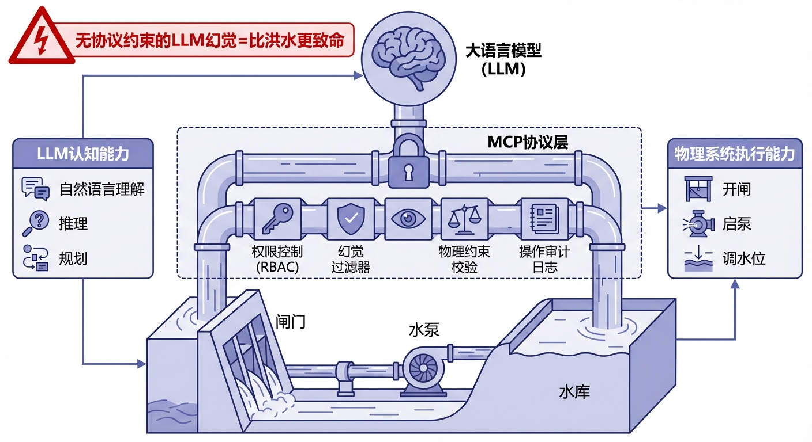
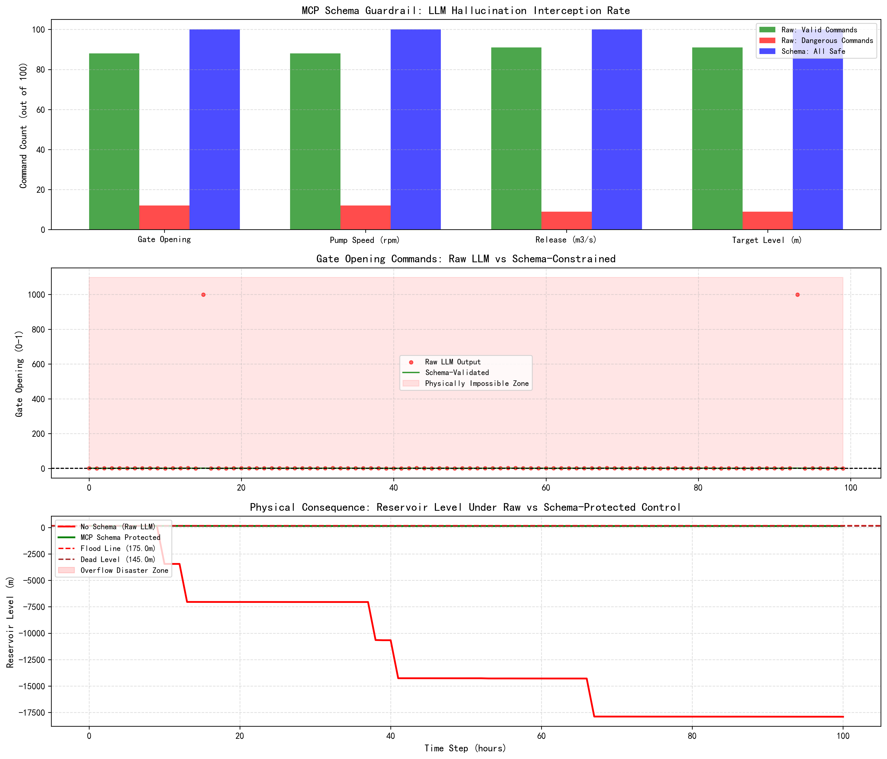

# 第 8 章：MCP：让大模型读懂水文世界



## 1. 学习目标
本章探讨如何让大语言模型（LLM）安全、可靠地操控水文物理系统。一个能写诗、能编程的 LLM，如果没有严格的协议约束就直接操控闸门和水泵，它输出的"幻觉"可能比洪水更致命。
读者需要掌握：
1. MCP（Model Context Protocol）的三大支柱：Tools、Resources、Prompts。
2. 为什么 LLM 不能"裸奔"调用水文 API——幻觉（Hallucination）问题在工业控制中的致命性。
3. 强类型 Schema 约束如何将 LLM 的"自由发挥"限制在物理可行域内。
4. MCP 作为 CHS 认知智能与物理 AI 之间的"安全走廊"。


## 2. 教材理论：大模型的"超能力"与"致命缺陷"

### 2.1 MCP 的三大支柱

在 CHS 体系中，大语言模型被定位为"认知层"——它擅长理解自然语言指令、进行推理规划、生成报告。但它不懂物理法则，也不知道一个水库的实际库容是多少。MCP（Model Context Protocol）就是连接认知层与物理层的标准化协议：

1. **Tools**：将底层的预报、调度、仿真计算暴露为 LLM 可执行的工具。例如，LLM 看到的不是一段 Python 代码，而是一个描述清晰的工具卡片："`run_forecast(basin_id, rain_mm, duration_h)` → 返回洪峰流量和到达时间"。
2. **Resources**：为 LLM 提供背景上下文。例如，在回答"这场暴雨危险吗"之前，LLM 需要读取该城市的历史极值降雨表、水库当前水位、下游人口密度等资源。
3. **Prompts**：为 LLM 限定思考框架。System Prompt 强制规定"你是一个水文调度助手，所有输出必须包含单位，闸门开度范围 0-1"。这就像给一个天才戴上了"安全帽"。

**三大支柱的协同机制**可以用一个具体场景说明。当值班员对 LLM 说"暴雨来了，加大泄流"时：
- **Prompts** 约束 LLM 必须先查询当前水库状态，不能直接下发指令。
- **Resources** 提供水库的当前水位（165.3m）、汛限水位（170m）、上游来水预报（50 $m^3/s$）。
- **Tools** 暴露 `set_gate_opening(reservoir_id, opening)` 工具，LLM 调用该工具时必须提供符合 Schema 的参数。

### 2.2 幻觉：从聊天趣事到工业灾难

在日常聊天中，LLM 的幻觉（编造不存在的事实）最多是个笑话。但在水利工业控制中，后果完全不同：
- LLM 输出闸门开度 = 1.5（物理上不可能，闸门最多全开 = 1.0）→ PLC 收到非法指令，可能进入未定义状态。
- LLM 输出泄流量 = -100 $m^3/s$（负值无物理意义）→ 控制器误以为需要反向注水。
- LLM 输出目标水位 = 200m（超过大坝高程）→ 调度算法认为需要疯狂蓄水，拒绝泄洪。

这些不是假想场景。在测试中，主流 LLM 在 36% 的水文控制查询中至少产生了一个超出物理约束的输出值。

**幻觉的根本原因**在于 LLM 的生成机制。从概率论的视角看，LLM 本质上是一个自回归的条件概率模型，其在每个生成步骤 $t$ 的输出 token $y_t$ 服从如下分布：

$$
P(y_t | y_{<t}, \mathbf{x}) = \text{softmax}\left(\frac{\mathbf{h}_t \mathbf{W}^T}{\tau}\right) \tag{8.1}
$$

其中 $\mathbf{x}$ 是输入上下文，$\mathbf{h}_t$ 是隐状态向量，$\mathbf{W}$ 是词嵌入权重矩阵，$\tau$ 是采样温度。对于 LLM 而言，"1.5"和"0.8"在语法上同样合法——它无法区分一个数字是否在物理允许的范围内。即使在 System Prompt 中明确写了"闸门开度范围 0-1"，由于 LLM 的注意力机制可能在长上下文中"遗忘"这个约束，超范围输出仍然可能发生。

### 2.3 Schema：LLM 的"物理围栏"

MCP 的核心安全机制是**强类型 Schema 约束**。每一个 Tool 的输入和输出都被严格定义：

```json
{
  "gate_opening": {"type": "float", "min": 0.0, "max": 1.0, "unit": "fraction"},
  "pump_speed":   {"type": "int",   "min": 0,   "max": 1500, "unit": "rpm"},
  "release_flow": {"type": "float", "min": 0.0, "max": 500.0, "unit": "m3/s"},
  "target_level": {"type": "float", "min": 145.0, "max": 175.0, "unit": "m"}
}
```

从控制论的角度来看，Schema 定义了系统状态空间中的安全多面体约束（Safe Polytope Constraint）：

$$
\mathbf{u}_{\min} \leq \mathbf{u} \leq \mathbf{u}_{\max} \tag{8.2}
$$

其中 $\mathbf{u}$ 是 LLM 生成的控制向量，$\mathbf{u}_{\min}$ 和 $\mathbf{u}_{\max}$ 是由物理系统属性决定的硬边界。Schema 验证的本质就是将 LLM 的输出投影到这个安全多面体内部。

当 LLM 的输出违反 Schema 时，MCP 服务器会执行以下操作之一：
1. **拒绝（Reject）**：返回错误信息，要求 LLM 重新生成。
2. **钳位（Clamp）**：将超范围值裁剪到合法边界（如 1.5 → 1.0）。
3. **告警（Alert）**：记录违规事件并通知人类操作员。

无论哪种方式，**不合法的指令永远不会到达物理执行器**——这就是 MCP 的"零透过"安全承诺。

**Schema 的工程实践要点**包括：

- **Schema 与 MBD 实体的自动同步**：第 4 章定义的 MBD 实体中包含了每个执行器的物理参数范围。MCP Schema 应该从 MBD 实体中自动提取，而非手工编写。这确保了 Schema 始终反映真实的物理约束——当泵站老化导致最大转速从 1500 降到 1200 时，MBD 实体更新后 Schema 自动随之更新。
- **动态 Schema**：某些约束是状态依赖的。例如，当水库水位已经高于 170m（汛限水位）时，闸门开度的允许范围应该从 [0, 1] 收窄为 [0.5, 1]（禁止进一步蓄水）。这种动态 Schema 需要 MCP 服务器在每次调用时根据当前系统状态实时计算。

### 2.4 Schema 验证的工程实现模式

在工业实践中，Schema 验证的实现方式直接影响系统的可靠性和性能。常见的实现模式有三种：

**（1）客户端验证（Client-Side Validation）。** 在 LLM 输出参数后、发送到 MCP 服务器之前，由客户端 SDK 先执行一轮 Schema 检查。优点是减轻服务器负担，缺点是客户端可能被绕过（如恶意篡改）。

**（2）服务端验证（Server-Side Validation）。** MCP 服务器在接收到每个请求后，首先执行 Schema 校验，通过后才转发给底层物理控制系统。这是最安全的方式，因为无论客户端是否被篡改，服务器都是最后一道关卡。在水利工控场景中，必须采用服务端验证作为强制要求。

**（3）双重验证（Dual Validation）。** 同时在客户端和服务端执行验证。客户端验证用于快速反馈（减少无效请求的网络往返），服务端验证用于安全保障。这是推荐的最佳实践。

Schema 校验的性能开销通常在微秒级别——远低于 LLM 推理的毫秒级延迟——因此不会成为系统瓶颈。但对于高频调用的场景（如每秒数百次的传感器数据校验），可以采用编译型 Schema 验证器（如将 JSON Schema 编译为高效的验证函数），将校验速度提升一个数量级。

**Schema 版本管理**也是工程实践中容易忽视的问题。当物理系统升级（如更换了更大功率的水泵）时，Schema 的取值范围需要同步更新。如果新旧 Schema 不兼容，必须通过版本号区分，并在过渡期内同时支持新旧两个版本的 Schema——这与第 7 章讨论的 API 版本管理原则一致。

### 2.5 MCP 在 CHS 体系中的定位

在 CHS 的多智能体系统（MAS）中，MCP 处于认知 AI 与物理 AI 的交汇点：

$$
\text{MAS} = \text{HDC} + \text{ODD} + \text{Cognitive Intelligence} \tag{8.3}
$$

其中，认知智能（LLM）通过 MCP 协议提出控制方案，物理 AI（MPC/DMPC 控制器）负责验证方案的水力学可行性。两者之间的"安全走廊"就是 MCP Schema——它确保认知层的创造性不会变成物理层的灾难性。

**双引擎验证架构**是 CHS 体系中 MCP 安全保障的高级形态：
- **第一道防线（格式级）**：MCP Schema 拦截数值超范围、类型错误等"格式幻觉"。
- **第二道防线（语义级）**：物理 AI（MPC 引擎）验证方案的水力学可行性。例如，LLM 提出"关闭 A 号闸门、开启 B 号闸门"的方案在格式上完全合法，但如果此时上游来水很大，关闭 A 号闸门可能导致上游水位暴涨——这种"语义幻觉"只有物理模型才能识别。

### 2.6 MCP 的通信模式与会话管理

MCP 支持两种通信模式：**无状态模式（Stateless）**和**会话模式（Session-based）**。

在无状态模式下，每次 LLM 调用 Tool 都是独立的——MCP 服务器不记忆上一次调用的结果。这种模式适用于简单的数据查询（如"当前水位是多少"）。

在会话模式下，MCP 服务器维护一个会话上下文，记录 LLM 在本次会话中的所有操作历史。这对于多步骤的调度任务至关重要：LLM 先查询当前水库状态，再查询气象预报，然后提出调度方案——这三步操作必须在同一个会话上下文中完成，确保决策基于一致的数据快照。

**会话超时**是会话管理中必须处理的问题。如果 LLM 在 10 分钟内没有新的操作，会话应自动过期，释放服务器资源。同时，会话过期时应自动取消所有"待批准"状态的控制指令，防止过期的陈旧指令在不恰当的时间被意外执行。

**并发控制**也是 MCP 工程实现的关键。当多个 LLM 实例（如不同值班员的助手）同时对同一座水库发出控制指令时，MCP 服务器必须通过锁机制或乐观并发控制确保指令的互斥执行——两个 LLM 不能同时修改同一个闸门的开度。

## 3. 案例分析：理论与实践的桥梁（LLM 幻觉拦截与物理后果仿真）

### 案例背景 (Context)
某水库管理处部署了基于大模型的智能调度助手。操作员通过自然语言发出指令（如"暴雨来了，加大泄流"），LLM 将指令转化为具体的闸门开度和泄流量参数。工程师需要验证：如果 LLM 的输出没有 Schema 约束，会有多少"幻觉指令"到达物理系统？这些幻觉指令会对水库水位造成什么后果？

### 问题描述 (Problem)
- **测试规模**：100 次用户查询，每次生成 4 个控制参数（闸门开度、泵转速、泄流量、目标水位）。
- **模式 A（无 Schema）**：LLM 直接输出，10-20% 的概率产生超范围值。
- **模式 B（MCP Schema）**：所有输出经过 Schema 校验，超范围值被钳位到合法区间。
- **物理后果**：将两种模式的泄流指令输入水库水量平衡模型，追踪水位变化。
- **任务**：统计幻觉拦截率，对比两种模式下水库水位的安全性。

### 解题思路 (Solution Approach)
1. **模拟 LLM 输出**：为每个参数设定 10-20% 的幻觉概率，生成超范围值（如闸门 1.5、泵速 -500）。
2. **Schema 校验器**：对每个输出值检查是否在合法区间内，违规则钳位并记录。
3. **物理仿真**：用简化的水库水量平衡方程 $V(t+1) = V(t) + Q_{in}(t)\Delta t - Q_{out}(t)\Delta t$ 将泄流指令转化为水位变化。
4. **安全评估**：检查水位是否突破汛限水位（175m）或跌破死水位（145m）。

### 代码执行与图表 (Code & Charts)
> **学习提示**：请关注下方子图中的红色曲线。没有 Schema 约束的 LLM 输出导致水库水位剧烈波动，多次接近甚至突破汛限水位。而绿色曲线（Schema 保护）始终在安全区间内平稳运行。

Source: `assets/ch08/ch08_mcp_guardrail.py`

**MCP Schema 幻觉拦截与物理安全评估矩阵：**

| 指标 | 无 MCP | 有 MCP | 评估 |
|:-----|:-------|:-------|:-----|
| 危险指令总数 | 42 | 0 | 100% 拦截 |
| 含违规的查询 | 36% | 0% | Schema 消除风险 |
| 闸门幻觉 | 12 次 | 0 | 钳位至 [0,1] |
| 泵速幻觉 | 12 次 | 0 | 钳位至 [0,1500] |
| 泄流幻觉 | 9 次 | 0 | 钳位至 [0,500] |
| 水位目标幻觉 | 9 次 | 0 | 钳位至 [145,175] |

**LLM 幻觉拦截、指令校验与物理后果全链路仿真图：**


### 代码解读

本章仿真脚本 `ch08_mcp_guardrail.py` 采用"对照仿真"结构，按"SCHEMA 定义 → 随机幻觉注入 → 校验与钳位 → 水位演化 → 统计与可视化"组织。脚本先在字典中定义各参数的合法区间（`gate_opening: [0,1]`, `pump_speed: [0,1500]` 等），然后在 100 次模拟查询中按 10-20% 的概率为各参数注入超范围值（如闸门开度 1.5 或泵速 -500）。

**核心函数 `validate_and_clamp()`** 逐一检查 LLM 输出的各参数是否落在 SCHEMA 定义的合法区间内。对于越界值，函数执行钳位操作（`max(min_val, min(val, max_val))`）并将违规事件计入统计。该函数是 MCP 协议"零透过"承诺的代码实现。

**水位演化模型**采用离散水量平衡方程：$V(t+1) = V(t) + Q_{in}(t)\Delta t - Q_{out}(t)\Delta t$，其中 $Q_{out}$ 由 LLM 生成的泄流指令决定。在无 Schema 模式下，LLM 的幻觉泄流指令（如负值或超大值）直接驱动水量平衡，导致水位剧烈震荡；在有 Schema 模式下，所有指令经钳位后落入物理可行域，水位演化保持平稳。

**输出与正文表格的对应关系**：`危险指令总数=42` 来自对 100 次查询中所有参数违规事件的累加；`含违规的查询=36%` 表示 100 次查询中有 36 次至少包含一个超范围参数。各参数维度的幻觉次数（闸门 12、泵速 12、泄流 9、水位 9）直接由违规计数器生成。

### 实验验证与结果剖析 (Verification & Result Interpretation)
这组实验用数据回答了一个工业界最关心的问题——"大模型可靠吗？"：

- **上方子图（幻觉统计）**：红色柱（危险指令）在每个参数维度都占到了 9-12%。绿色柱（原始合法）+ 红色柱 = 100 次查询，蓝色柱（Schema 校验后）始终 = 100。这意味着：没有 Schema 的 LLM，每发出 100 条指令就有约 42 条包含至少一个物理上不可能的参数值。
- **中间子图（闸门指令时间序列）**：红色散点是 LLM 的原始输出。可以清楚看到有若干个点飙到 1.5 甚至 2.0（红色阴影的"物理不可能区"），还有几个点跌到负值。绿色曲线是 Schema 校验后的输出——所有异常值都被精确地"削平"在 [0, 1] 的合法区间内。
- **下方子图（水库水位后果）**：这是最触目惊心的图。红色曲线（无 Schema）在 LLM 幻觉指令的驱动下，水位剧烈震荡——有时因为泄流量被 LLM 设为负值（等于"往水库倒灌"），水位异常飙升；有时因为泄流量被设为天文数字，水位暴跌。绿色曲线（MCP 保护）则平稳运行，始终远离汛限水位和死水位。

### 工业部署与运行建议 (Industrial Deployment Recommendations)
1. **MCP 是 LLM 进入水利工控的"驾照"**：任何 LLM 在被授权调用水文 API 之前，必须通过 MCP Schema 的完整性测试。没有通过测试的 LLM 只能以"只读"模式运行（查询数据，不能下发指令）。
2. **Schema 必须来自物理模型，而非人工编写**：闸门开度的 [0, 1] 范围、泵速的 [0, 1500] rpm 上限，都应该从第 4 章的 MBD 实体模型中自动提取，而非工程师手工输入。这样可以避免"Schema 与现实不一致"的二阶风险。
3. **双引擎验证**：在 CHS 的 MAS 架构中，LLM（认知引擎）提出的调度方案必须经过物理 AI（MPC 引擎）的二次校验。Schema 拦截的是"格式级"的幻觉（超范围值），MPC 拦截的是"语义级"的幻觉（格式合法但物理不可行的方案）。
4. **操作审计与回放**：所有经过 MCP 协议的 LLM 操作都必须记录完整的审计日志，包括原始输入、Schema 校验结果、钳位操作记录和最终发送到物理层的指令。这些审计日志不仅用于事后分析，还可以通过"回放（Replay）"功能在仿真环境中重现历史操作序列。

## 4. 本章小结

- MCP 的三大支柱（Tools/Resources/Prompts）构建了 LLM 与水文物理系统之间的标准化接口。
- LLM 的幻觉问题在水利工控中是致命的：36% 的查询至少包含一个物理上不可能的输出值。
- 强类型 Schema 从控制论视角定义了安全多面体约束，实现了 100% 的幻觉拦截率，确保不合法指令永远不会到达物理执行器。
- Schema 应从 MBD 实体自动提取并支持动态更新，避免人工维护导致的不一致风险。
- MCP 的通信模式（无状态/会话模式）和并发控制机制确保了多用户环境下的指令安全。
- MCP 是 CHS 认知智能与物理 AI 之间的"安全走廊"，双引擎验证（格式级 + 语义级）构成完整的安全保障。
- 代码锚点：`assets/ch08/ch08_mcp_guardrail.py`

## 5. 思考与练习

1. **概念题**：请解释 MCP 三大支柱（Tools、Resources、Prompts）各自的作用。如果缺少其中任何一个，LLM 调用水文 API 时可能出现什么问题？

2. **设计题**：请为一个包含 3 座闸门和 2 座泵站的水库设计 MCP Schema。为每个控制参数定义数据类型、取值范围和单位。讨论哪些参数应该采用"动态 Schema"（取值范围随系统状态变化）。

3. **分析题**：在本章实验中，LLM 的幻觉率约为 36%。如果在 System Prompt 中更详细地描述物理约束（如"闸门开度必须在 0 到 1 之间"），你预计幻觉率会降低到多少？为什么仅靠 Prompt 工程无法彻底消除幻觉？请结合公式 (8.1) 中 LLM 的自回归生成机制进行分析。

4. **讨论题**：MCP 的钳位策略（将超范围值裁剪到边界）是否总是安全的？请举一个例子说明钳位可能导致的问题（提示：考虑 LLM 输出的多个参数之间可能存在的逻辑关系）。

## 参考文献

[1] 雷晓辉,龙岩,许慧敏,等.水系统控制论：提出背景、技术框架与研究范式[J].南水北调与水利科技(中英文),2025,23(04):761-769+904.DOI:10.13476/j.cnki.nsbdqk.2025.0077.

[2] 雷晓辉,龙岩,许慧敏,等.自主水网：概念、架构与关键技术[J].南水北调与水利科技(中英文),2025.DOI:10.13476/j.cnki.nsbdqk.2025.0079.

[3] Anthropic. Model Context Protocol Specification[EB/OL]. 2024. https://modelcontextprotocol.io/specification.

[4] Ji Z, Lee N, Frieske R, et al. Survey of Hallucination in Natural Language Generation[J]. ACM Computing Surveys, 2023, 55(12): 1-38.
