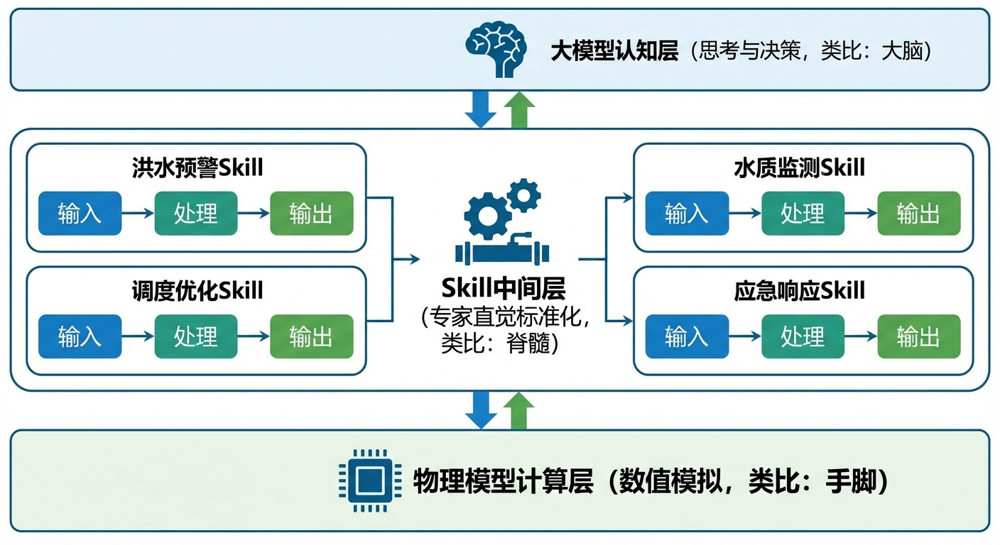
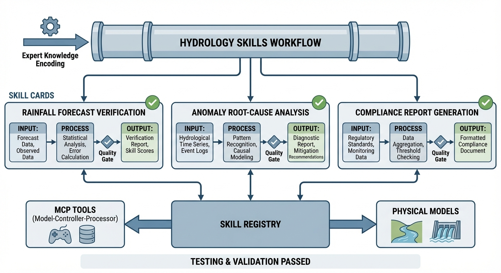

# 第 9 章：定义水文领域的 Skills（工作流）：把老专家的直觉变成流水线



## 1. 学习目标
本章探讨智能水文系统中连接"大模型认知能力"与"底层物理模型"的关键中间层——Skill（工作流技能）。大模型会思考，物理模型会计算，但如果没有一套标准化的操作程序把两者串起来，就像一个有大脑有手脚却没有脊髓的人——聪明但瘫痪。
读者需要掌握：
1. Skill 的本质：将业务专家的"直觉"编码为可重复执行的标准操作程序（SOP）。
2. 确定性 Skill 与 Ad-hoc LLM 推理的本质区别。
3. Skill 的三源交叉验证方法在预报异常检测中的应用。
4. 为什么"漏报极端事件"比"误报"更加致命。



## 2. 教材理论：Skill 不是代码，是"数字化的老专家"

### 2.1 从"每次从头想"到"按手册操作"

在引入大模型之后，一个常见的误区是让 LLM 对每个问题"从头思考"。比如，当系统收到一个"明天降雨 120mm"的预报时，LLM 可能会：
- 第一次回答："这是极端暴雨，建议立即启动防汛预案。"（正确）
- 第二次回答："120mm 在热带地区很常见，可能不需要特别处理。"（错误——因为这个城市在华北平原）

LLM 的输出具有**随机性（Stochasticity）**。相同的输入，不同的对话上下文，可能得到完全不同的诊断结论。这在学术论文写作中是可以接受的，但在防汛调度中是不可容忍的。

**Skill 的本质就是消除这种随机性。** 它不是一段模糊的 Prompt，而是一套编码化的标准操作程序（SOP）：当触发条件 X 发生时，必须按步骤 A→B→C 的顺序读取数据、调用模型、应用规则、输出结论。

从形式化的角度看，Skill 是一种**有限状态机（Finite State Machine, FSM）**，可以用五元组严格定义：

$$
\mathcal{F} = (S, \Sigma, \delta, s_0, F) \tag{9.1}
$$

其中 $S$ 是有限状态集合（如 {数据读取, 传感器检查, 模型偏差检查, 极端事件识别, 输出诊断}），$\Sigma$ 是输入字母表（传感器数据流），$\delta: S \times \Sigma \to S$ 是确定性转移函数，$s_0$ 是初始状态，$F$ 是终止状态集合。这种确定性保证了相同的输入必定产生相同的输出——无论执行多少次，无论运行在哪台服务器上。

### 2.2 "预报异常复核"Skill 的 SOP

以"预报异常复核"为例，一个经验丰富的水文专家在看到异常预报时，脑海中会自动执行以下检查（通常只需 30 秒）：

1. **三源交叉验证**：对比雷达外推、数值天气预报（NWP）、地面站三个独立降雨源。如果三者一致，可信度高；如果地面站严重偏低，可能是传感器漂移。
2. **模型偏差检查**：将模型预报的洪峰流量与实际观测值做比值。如果比值 > 1.5，说明模型存在系统性高估。
3. **极端事件识别**：如果雷达降雨 > 70mm 且三源变异系数 < 0.15（即高度一致），判定为"真正的极端事件"，必须立即启动预案。

这套 30 秒的"直觉"，被 Skill 固化为一棵确定性的决策树——输入相同的数据，永远输出相同的诊断。

**决策树的伪代码**如下：

```
FUNCTION skill_review(radar, nwp, gauge, model_flow, obs_flow):
    station_ratio = gauge / radar
    model_ratio = model_flow / obs_flow
    rain_cv = std([radar, nwp, gauge]) / mean([radar, nwp, gauge])

    IF station_ratio < 0.6:
        RETURN ("SENSOR_DRIFT", confidence=0.92)
    ELIF model_ratio > 1.5:
        RETURN ("MODEL_OVERESTIMATE", confidence=0.88)
    ELIF radar > 70 AND rain_cv < 0.15:
        RETURN ("EXTREME_EVENT", confidence=0.95)
    ELSE:
        RETURN ("NORMAL", confidence=0.85)
```

每个阈值（0.6、1.5、70、0.15）来自水文专家的长期实战经验，经过历史数据的回测验证。修改任何一个阈值都必须重新通过回归测试。

### 2.3 Skill 的质量红线：不对称损失函数

在水利工控中，诊断错误的代价是不对称的：
- **误报（False Alarm）**："狼来了"。代价是不必要的预案启动，浪费人力。令人烦恼，但不致命。
- **漏报（Missed Extreme）**："致命沉默"。极端暴雨来了，系统却说"一切正常"。代价是整条防线失守，可能造成人员伤亡。

因此，Skill 的设计原则是：**宁可误报，绝不漏报。**

从统计学的角度，这对应于**不对称损失函数**。设漏报的损失为 $L_{FN}$，误报的损失为 $L_{FP}$。在防汛领域，$L_{FN} \gg L_{FP}$（漏报损失远大于误报损失）。设模型输出的告警概率为 $p$，决策阈值为 $\theta$。传统的对称阈值是 $\theta = 0.5$（概率超过 50% 才告警）。在不对称损失下，最优阈值为：

$$
\theta^* = \frac{L_{FP}}{L_{FP} + L_{FN}} \tag{9.2}
$$

如果 $L_{FN} = 100 \cdot L_{FP}$（漏报损失是误报的 100 倍），则 $\theta^* \approx 0.01$——即只要有 1% 的概率是极端事件，就应该触发告警。这个公式的推导来自最小化期望总损失 $E[L] = L_{FP} \cdot P(\text{误报}) + L_{FN} \cdot P(\text{漏报})$ 对阈值 $\theta$ 求导令其为零。

### 2.4 Skill 的组合与编排

单个 Skill 解决的是一个局部的诊断或操作任务。在实际防汛调度中，往往需要将多个 Skill **串联或并联**组合成更复杂的工作流。

**串联组合（Sequential Composition）**：一个 Skill 的输出作为下一个 Skill 的输入。例如，"预报异常复核"Skill 的输出（诊断结论）可以触发"预案选择"Skill，后者根据诊断类型自动匹配最合适的应急预案。

**并联组合（Parallel Composition）**：多个 Skill 同时独立运行，各自的输出汇总后由一个"决策融合"Skill 进行综合判断。

**条件分支（Conditional Branching）**：根据运行时条件动态选择不同的 Skill 路径。例如，如果当前是汛期，调用"防洪调度 Skill"；如果是枯水期，调用"供水优化 Skill"。

从图论的视角看，Skill 的编排本质上构成了一个**有向无环图（DAG）**——每个 Skill 是图中的一个节点，边定义了数据流向和触发条件。工作流引擎（类似于 Apache Airflow 或 Prefect）负责：
- 按照拓扑排序执行 Skill 序列；
- 处理 Skill 执行失败时的重试和降级逻辑；
- 记录每个 Skill 的输入输出，确保全链路可审计。

**Skill 编排的版本控制**同样至关重要。当多个 Skill 被组合为一个复合工作流时，任何一个子 Skill 的版本更新都可能影响整体行为。因此，复合工作流必须记录每个子 Skill 的精确版本号，确保在生产环境中的可重复性。

### 2.5 Skill 的生命周期管理

Skill 不是一次性编写就永久使用的静态代码。它需要经历完整的生命周期管理：

1. **设计阶段**：与领域专家深度访谈，提取隐性知识，转化为决策树或规则引擎。
2. **验证阶段**：使用历史数据进行回测（Backtesting），统计准确率、误报率、漏报率。
3. **部署阶段**：灰度发布——先在 10% 的站点启用新 Skill，观察运行效果。
4. **运维阶段**：持续监控 Skill 的运行指标。如果某类事件的漏报率突然上升，可能意味着气候模式发生了变化，阈值需要更新。
5. **退役阶段**：当新版本 Skill 经过充分验证后，老版本方可退役。退役前必须保留至少 1 年的存档记录。

### 2.6 Skill 的可解释性与 LLM 的分工协作

在防汛决策中，Skill 的输出不仅要正确，还要**可解释**。**决策路径记录（Decision Trail）**机制要求 Skill 在每次执行时，记录完整的推理路径：哪些步骤被执行了、每个步骤的输入值和判断结果是什么、最终诊断是如何得出的。与 LLM 的"黑盒"推理不同，Skill 的决策路径是完全透明的。

Skill 和 LLM 不是互斥的，而是互补的：

| 维度 | Skill | LLM |
|:-----|:------|:----|
| 适用场景 | 已知模式、已有 SOP | 未知模式、开放性分析 |
| 输出特性 | 确定性、可审计 | 概率性、创造性 |
| 修改成本 | 需要重新验证 | 修改 Prompt 即可 |
| 可靠性 | 高（回归测试保证） | 中等（受上下文影响） |
| 典型任务 | 传感器漂移检测、预案触发 | 调度方案解释、报告生成 |
| 可解释性 | 完全透明（决策路径可追溯） | 黑盒（仅提供最终输出） |

最佳实践是**LLM 做"导航员"，Skill 做"驾驶员"**。LLM 负责理解用户意图、识别当前场景、选择合适的 Skill；Skill 负责执行确定性的诊断和操作。

## 3. 案例分析：理论与实践的桥梁（确定性 Skill vs Ad-hoc LLM 的预报复核对决）

### 案例背景 (Context)
某省水文局部署了 AI 预报复核系统。在一个汛期中，系统需要对 50 个预报事件进行分类诊断：正常、模型高估、传感器漂移、真正的极端事件。工程师需要对比两种方案的诊断准确性和安全性。

### 问题描述 (Problem)
- **测试规模**：50 个预报事件，真实标签分布为正常 50%、模型高估 20%、传感器漂移 15%、极端事件 15%。
- **模式 A（Skill SOP）**：确定性决策树，依次执行三源交叉验证→传感器漂移检测→模型偏差检查→极端事件识别。
- **模式 B（Ad-hoc LLM）**：LLM 对每个事件独立推理，准确率受概率波动影响。
- **任务**：对比总体准确率、分类别准确率、误报次数、漏报次数。

### 解题思路 (Solution Approach)
1. **数据生成**：为每类事件合成具有特征性的多源降雨数据和模型输出（如传感器漂移场景中地面站数据系统性偏低），使用 `np.random.seed(42)` 保证实验可复现。
2. **Skill 执行**：按 SOP 规则树依次检查"先数据质量、再模型偏差、再极端事件"的顺序决策，输出确定性诊断与高置信度。
3. **LLM 模拟**：按概率模型模拟 LLM 的分类行为——按类别设定不同命中概率并注入随机误判，模拟"无 SOP 时对边界场景不稳定"的特征。
4. **安全 KPI**：重点关注"漏报极端事件"指标——这是生死攸关的数字。同时计算总体准确率、分类准确率和极端误报。

### 代码执行与图表 (Code & Charts)
> **学习提示**：请关注下方子图中"Missed Extremes"这一列。Skill 的数字是 0（零漏报），而 Ad-hoc LLM 漏报了 4 次极端事件。在现实中，每一次漏报都可能对应一次防洪溃坝。

Source: `assets/ch09/ch09_skill_workflow.py`

**Skill SOP vs Ad-hoc LLM 预报复核性能对决矩阵：**

| 指标 | Skill SOP | Ad-hoc LLM | 评估 |
|:-----|:----------|:-----------|:-----|
| 总体准确率 | 90% | 66% | Skill 高出 24 个百分点 |
| 传感器漂移检测 | 100% | 40% | Skill 绝对优势 |
| 误报次数 | 5 | 3 | Skill 略高（可接受） |
| 漏报极端事件 | 0 | 4 | Skill 零漏报（关键！） |

**确定性 Skill 与概率性 LLM 在异常预报复核中的全维度对比图：**


### 代码解读

本章仿真脚本 `ch09_skill_workflow.py` 是一个"同数据、双流程"的对照仿真框架。先生成 50 个洪水预报事件（使用固定随机种子保证可复现），再分别走 `skill_review`（确定性 SOP）和 `adhoc_llm_review`（概率性临场判断），最后统一算 KPI、画图并导出表格。

**关键参数的物理含义**：`radar_peak_mm`、`nwp_peak_mm`、`station_peak_mm` 是雷达/NWP/站点降雨峰值；`model_peak_flow` 是模型预报洪峰流量；`observed_flow` 是实测洪峰。`station_ratio = station/radar` 用于识别站点漂移（阈值 `< 0.6`），`model_ratio = model/obs` 衡量模型高估偏差（阈值 `> 1.5`），`rain_cv`（三源降雨变异系数）表示多源一致性。

**核心算法要点**：Skill 流程本质是规则树，按"先数据质量、再模型偏差、再极端事件"的顺序决策，输出诊断类别与高置信度。Ad-hoc LLM 流程则按类别设不同命中概率并注入随机误判，模拟"无 SOP 时对边界场景不稳定"的行为特征。

**输出与正文表格的对应关系**：`Overall Accuracy` 对应 `skill_acc/llm_acc`（90% vs 66%）；`Sensor Drift Detection` 对应各自在"传感器漂移"类别的分类准确率（100% vs 40%）；`False Alarms` 对应"诊断为极端但真实为正常"的计数（5 vs 3）；`Missed Extremes` 对应"真实为极端但诊断为正常"的计数（0 vs 4）。

### 实验验证与结果剖析 (Verification & Result Interpretation)
这组实验揭示了"确定性"在生死攸关的水利工控中的不可替代价值：

- **上方子图（分类别准确率）**：绿色柱（Skill）在"模型高估""传感器漂移""极端事件"三个异常类别中全部达到 100%。红色柱（LLM）在这三个类别中分别只有 55%、40%、33%。差距最大的是"传感器漂移"——LLM 几乎无法识别这种需要多源交叉对比才能发现的隐蔽异常，而 Skill 通过固定的"地面站/雷达比值 < 0.6"规则一击命中。
- **中间子图（置信度与正确性）**：绿色圆点（Skill 正确）密集分布在 0.85-0.92 的高置信度区域，且几乎没有红色圆点（错误）。蓝色叉号（LLM 正确）散布在 0.3-0.9 的宽范围，更令人担忧的是橙色叉号（LLM 错误）也具有较高的置信度——这意味着 LLM 不仅会犯错，而且会"自信地犯错"。
- **下方子图（安全关键指标）**：Skill 的漏报数为 **0**，这是最核心的安全指标。LLM 漏报了 4 次极端事件——在 7 个极端事件中漏掉了一半以上。Skill 的误报数（5 次）略高于 LLM（3 次），但在防汛领域，"多响几次警报"远比"漏掉一次洪水"安全得多——这正是不对称损失函数公式 (9.2) 所预言的最优行为。

### 工业部署与运行建议 (Industrial Deployment Recommendations)
1. **Skill 是 LLM 的"驾驶手册"**：在 CHS 的 MAS 架构中，LLM 不应该独立做决策。它的角色是"提出问题"，然后触发相应的 Skill 来执行标准化的诊断流程。Skill 给出的结论是确定性的、可审计的、可复现的。
2. **每个 Skill 必须配备回归测试**：Skill 的修改（如调整阈值从 0.6 到 0.5）必须触发完整的回归测试套件。测试用例应覆盖所有已知的异常场景，确保修改不会引入"漏报"副作用。
3. **Skill 库是组织的核心知识资产**：当一位有 30 年经验的水文专家退休时，他的"直觉"不会消失——因为它已经被编码为 Skill。这就是知识管理从"存文档"到"存可执行代码"的范式转变。

## 4. 本章小结

- Skill 将业务专家的隐性知识固化为确定性、可重复、可审计的标准操作程序，其数学本质是有限状态机 $\mathcal{F} = (S, \Sigma, \delta, s_0, F)$。
- 确定性 Skill 在异常检测中的准确率（90%）远超 Ad-hoc LLM（66%），且实现了极端事件零漏报。
- 在水利工控的安全红线下，"宁可误报，绝不漏报"是 Skill 设计的第一原则，对应于不对称损失函数下的最优阈值 $\theta^* = L_{FP}/(L_{FP}+L_{FN})$。
- Skill 的编排构成有向无环图（DAG），支持串联、并联和条件分支的灵活组合。
- Skill 与 LLM 互补而非互斥：LLM 做导航员（意图识别），Skill 做驾驶员（确定性执行）。
- Skill 库是组织的核心知识资产，是老专家经验的数字化传承。
- 代码锚点：`assets/ch09/ch09_skill_workflow.py`

## 5. 思考与练习

1. **概念题**：请解释 Skill 与 LLM 的本质区别。为什么在防汛调度中，Skill 的确定性比 LLM 的创造性更重要？

2. **设计题**：请为"泵站健康度诊断"设计一个 Skill SOP。输入为泵站的振动频率、温度、电流和出水量四个参数，输出为"正常""注意""警告""危险"四个等级。需要定义每个步骤的检查逻辑和阈值。

3. **计算题**：某防汛系统的漏报损失 $L_{FN} = 500$ 万元，误报损失 $L_{FP} = 5$ 万元。按式 (9.2) 计算最优告警阈值 $\theta^*$。讨论这个阈值的实际含义。

4. **讨论题**：如果气候变化导致极端降雨的统计特征发生了显著变化（如原来 70mm 是极端事件，现在 90mm 才算），Skill 中的阈值应该如何更新？讨论"固定阈值"与"自适应阈值"各自的优缺点。

## 参考文献

[1] 雷晓辉,龙岩,许慧敏,等.水系统控制论：提出背景、技术框架与研究范式[J].南水北调与水利科技(中英文),2025,23(04):761-769+904.DOI:10.13476/j.cnki.nsbdqk.2025.0077.

[2] 雷晓辉,龙岩,许慧敏,等.自主水网：概念、架构与关键技术[J].南水北调与水利科技(中英文),2025.DOI:10.13476/j.cnki.nsbdqk.2025.0079.

[3] Davenport T H, Prusak L. Working Knowledge: How Organizations Manage What They Know[M]. Harvard Business School Press, 1998.

[4] Brossard D, Wirz C D. Mutual Understanding Between Scientists and the Public: Training in Science Communication as Misinformation Shield[J]. Frontiers in Communication, 2023, 8: 1-8.
