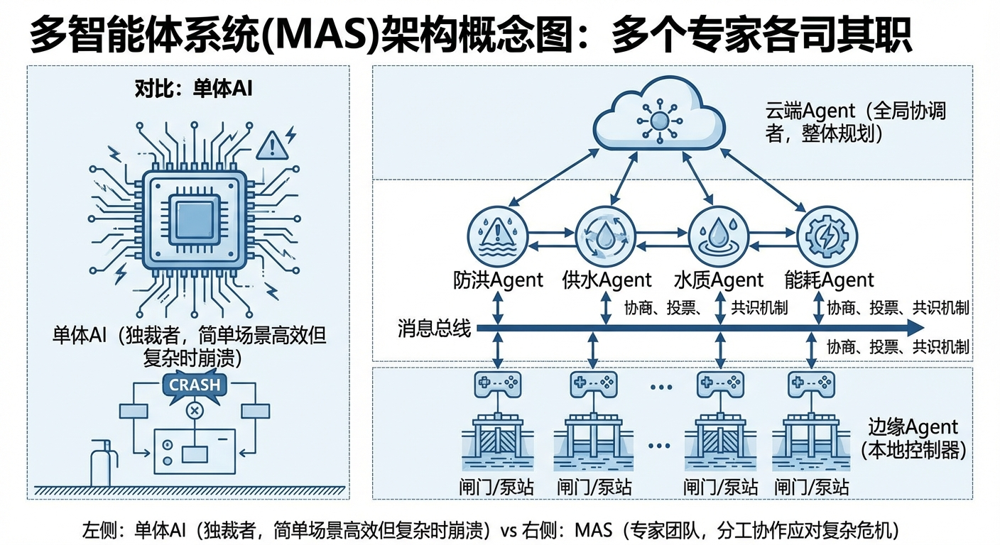
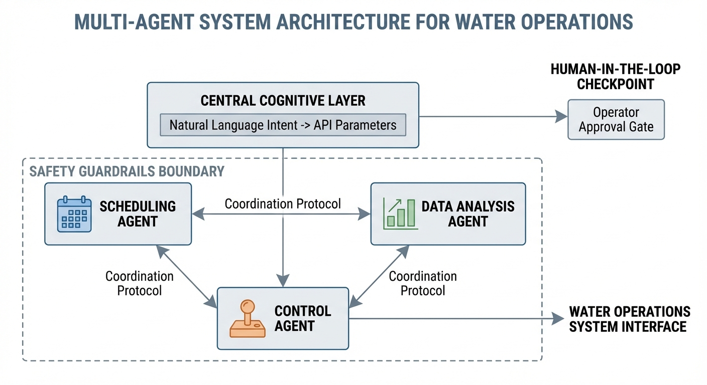
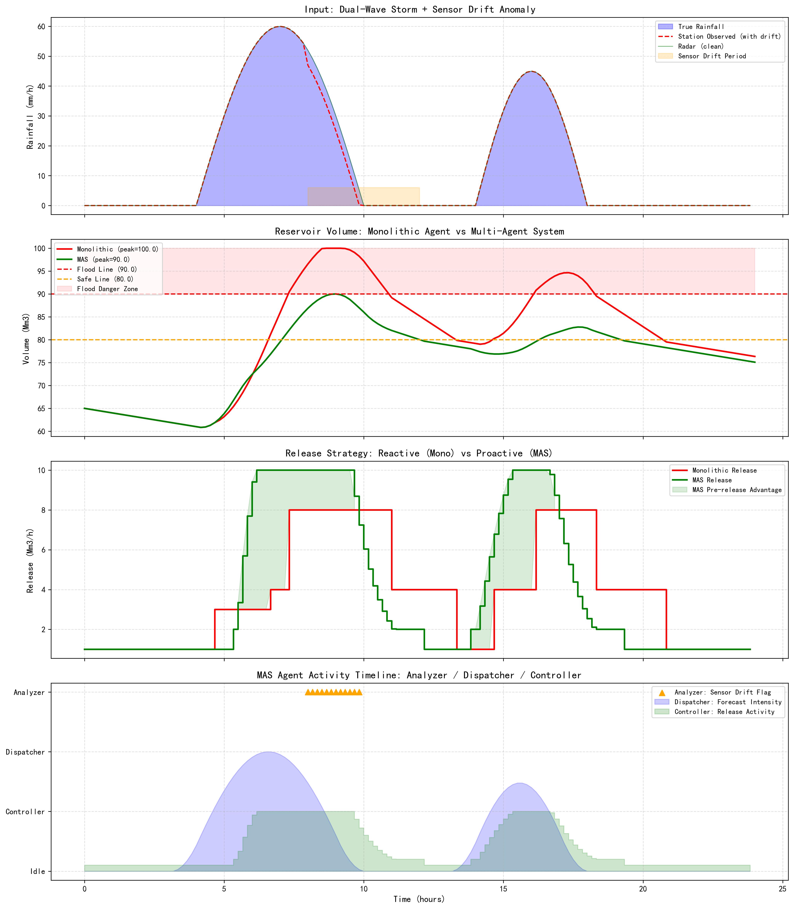

# 第 10 章：Agent 在水务运营中的架构：让多个专家各司其职

## 1. 学习目标
本章探讨智能水文系统的最高层架构——多智能体系统（Multi-Agent System, MAS）。一个全能的单体 AI 就像一个独裁者：在简单场景下高效，在复杂危机中必然崩溃。真正的抗洪防灾需要的是"分工协作的专家团队"。
读者需要掌握：
1. 为什么单体智能体（Monolithic Agent）在复杂水务场景中会失败。
2. CHS 体系中三类核心 Agent 的分工：调度规划（Dispatcher）、数据分析（Analyzer）、控制执行（Controller）。
3. 多智能体协同的"提议—验证—执行"闭环。
4. 人机协同（Human-in-the-Loop）与安全护栏（Guardrails）机制。

## 2. 教材理论：为什么一个 AI 管不了一座城市的水？

### 2.1 单体智能体的三重困境

在第 8-9 章中，我们已经为 LLM 配备了 MCP 协议和 Skill 工作流。但如果只有一个 LLM 实例同时承担预报、诊断、调度、控制四项任务，它将面临三重困境：

1. **上下文窗口溢出**：一场洪水事件需要同时关注气象预报、200 个站点的实时水位、30 座水库的库容曲线、电价时段表、下游人口分布。单个 LLM 的上下文窗口无法同时容纳这些信息。
2. **职责冲突**："尽量少放水以节省水资源"与"尽量多放水以腾出防洪库容"是矛盾的目标。一个 Agent 试图同时优化两个矛盾目标，往往两边都做不好。
3. **故障全局化**：如果这唯一的 Agent 因为一个 Bug 或一条错误数据而"宕机"，整个水网将失去所有智能决策能力——没有 Plan B。

从系统工程的角度看，单体架构违反了**关注点分离（Separation of Concerns）**原则。当系统复杂度超过单一模块的处理能力时，必须进行功能分解。用状态空间方程表达，水务系统的状态演化可以写为：

$$
\mathbf{x}(t+1) = f(\mathbf{x}(t), \mathbf{u}(t), \mathbf{d}(t)) \tag{10.1}
$$

其中 $\mathbf{x}$ 是系统状态向量（库容、水位、流量等），$\mathbf{u}$ 是控制输入向量（闸门开度、泵站转速等），$\mathbf{d}$ 是外部扰动向量（降雨、蒸发等）。当状态维度 $\dim(\mathbf{x})$ 高达数百甚至数千时，单一决策器无法有效处理。

### 2.2 CHS 多智能体架构：分工与协同

CHS 体系提出了三层 Agent 分工架构（雷晓辉等, 2025b），其中多智能体的目标可以形式化为多目标优化问题：

$$
\min_{\mathbf{u}} \sum_{i=1}^{N} w_i J_i(\mathbf{x}, \mathbf{u}) \quad \text{s.t.} \quad \mathbf{x} \in \text{ODD}, \quad \mathbf{u}_{\min} \leq \mathbf{u} \leq \mathbf{u}_{\max} \tag{10.2}
$$

$$
\text{MAS} = \text{HDC} + \text{ODD} + \text{Cognitive Intelligence} \tag{10.3}
$$

| Agent 角色 | 职责 | 时间尺度 | 失败后果 |
|:-----------|:-----|:---------|:---------|
| Dispatcher（调度规划） | 接入气象预报，生成未来 24h 放水计划草案 | 小时—天 | 错失预排空窗口 |
| Analyzer（数据分析） | 监控传感器数据流，检测异常（漂移、故障），交叉验证多源数据 | 分钟—小时 | 采信错误数据 |
| Controller（控制执行） | 将规划指令转译为闸门/泵站的物理操作，执行安全护栏 | 秒—分钟 | 执行危险指令 |

三者的协同流程是：
1. **Analyzer** 持续监控数据质量，发现异常时标记并修正（如用雷达数据替代漂移的地面站）。
2. **Dispatcher** 基于清洁数据进行前瞻性预测，生成最优调度方案。
3. **Controller** 执行方案，但拥有**安全否决权**——如果方案违反 ODD 边界（如水库水位超过汛限），Controller 有权拒绝执行并触发降级。

**Agent 间的通信协议**采用结构化消息格式，包含发送者、接收者、消息类型、时间戳和有效载荷。

### 2.3 人机协同：机器算路，人类拍板

在 WSAL L3（有条件自主）及以下等级，重大决策必须有人工确认环节。当 Dispatcher 生成的调度方案涉及以下操作时，系统必须暂停执行并推送审批请求：
- 开启泄洪闸（可能影响下游安全）
- 水库水位降至死水位以下（可能影响供水）
- 多座水库的联合调度（影响范围跨行政区）

值班长在工作台上审阅方案后，点击"批准"或"驳回"。只有获得人工批准后，Controller 才会执行。审批工作台应展示方案摘要、风险评估、历史参照和倒计时等信息。

### 2.4 L0 安全底层：永远在线的"最后防线"

在所有 Agent 之下，还有一层不依赖任何 AI 的硬件安全层（L0 Safety Floor）——PLC 硬连线逻辑。它可以用分段函数严格定义：

$$
u_{\text{L0}}(x) = \begin{cases}
u_{\max} & \text{if } x > x_{\text{flood}} \\
u_{\text{safe}} & \text{if } x_{\text{warn}} < x \leq x_{\text{flood}} \\
0 & \text{if } x \leq x_{\text{warn}}
\end{cases} \tag{10.4}
$$

其中 $x$ 是水库水位，$x_{\text{flood}}$ 是汛限水位，$x_{\text{warn}}$ 是预警水位，$u_{\text{L0}}$ 是 L0 层的强制控制输出。无论云端的 LLM 是否在线、无论三个 Agent 是否正常工作，L0 层永远在守护物理安全底线。

L0 层的设计原则是**独立性**和**简单性**。它不使用网络通信（防止网络攻击），不依赖操作系统（防止软件 Bug），不需要参数配置（防止人为误操作）。它的逻辑硬编码在 PLC 固件中，只有在现场通过物理钥匙开关才能修改。

### 2.5 Agent 的信任度与动态权限

CHS 体系引入了**Agent 信任度（Trust Score）**机制，根据每个 Agent 的历史表现动态调整其权限级别。信任度的更新采用非对称指数移动平均：

$$
T(t+1) = \begin{cases}
\alpha_+ T(t) + (1 - \alpha_+) \cdot r(t) & \text{if } r(t) = 1 \text{ (正确)} \\
\alpha_- T(t) + (1 - \alpha_-) \cdot r(t) & \text{if } r(t) = 0 \text{ (错误)}
\end{cases} \tag{10.5}
$$

其中 $\alpha_+ > \alpha_-$，使得信任度"慢升快降"。例如取 $\alpha_+ = 0.95$, $\alpha_- = 0.7$，则一次错误导致的信任度下降幅度远大于一次正确带来的回升幅度。这种非对称机制体现了防汛领域"安全优先"的核心理念。

当某个 Agent 的信任度低于阈值时，系统自动提高其方案的人工审批等级。例如，信任度从 0.95 降到 0.70 的 Dispatcher Agent，其调度方案将从"自动执行"降级为"必须值班长确认"。

### 2.6 降级策略：当 Agent 一个个倒下

多 Agent 系统必须设计**优雅降级（Graceful Degradation）**策略，降级过程可以用状态机模型描述：

| 故障场景 | 影响 | 降级策略 |
|:---------|:-----|:---------|
| Analyzer 离线 | 数据质量未经校验 | Dispatcher 使用原始数据但增大安全裕度 |
| Dispatcher 离线 | 无前瞻性调度方案 | Controller 切换为规则调度模式 |
| Controller 离线 | 无法执行智能指令 | L0 安全层接管物理控制 |
| 通信全断 | 所有 Agent 失联 | 各站点进入"岛屿自治"模式 |

**降级恢复（Recovery）**同样需要精心设计。当故障排除后，系统不能直接从降级模式"跳回"全功能模式——必须先经历一个**状态同步阶段**。离线 Agent 重新连接后，首先获取最新系统状态快照，确认自身状态模型与实际物理状态一致后，才重新接管职责。

## 3. 案例分析：理论与实践的桥梁（双波暴雨下单体 Agent vs 多智能体系统的防洪对决）

### 案例背景 (Context)
某水库面临一场"双波暴雨"——第一波（$t=4\sim10h$，峰值 60 mm/h）和第二波（$t=14\sim18h$，峰值 45 mm/h）。更棘手的是，在 $t=8\sim12h$ 期间，地面雨量站因设备故障产生了 5 mm/h 的系统性漂移。工程师需要对比单体 Agent 与 MAS 在这场复合灾害中的表现。

### 问题描述 (Problem)
- **水库参数**：库容 100 百万 $m^3$，初始库容 65 百万 $m^3$（已处于较高水位），汛限 90 百万 $m^3$，安全线 80 百万 $m^3$。汇流面积 500 $km^2$，径流系数 0.6。
- **模式 A（单体 Agent）**：直接使用观测降雨（含漂移）做反应式调度，无前瞻、无传感器校验。
- **模式 B（MAS）**：Analyzer 交叉验证雷达与地面站数据并修正漂移；Dispatcher 做 6 步前瞻预测并提前泄洪；Controller 执行方案并施加安全约束。
- **任务**：对比峰值库容、汛限违规时间、传感器异常检测能力。

### 解题思路 (Solution Approach)
1. **场景构建**：合成双波暴雨 + 传感器漂移的复合输入序列。
2. **单体模型**：基于观测降雨的简单阈值控制（无数据校验、无前瞻）。
3. **MAS 模型**：三个 Agent 按职责分工协同——Analyzer 标记漂移、Dispatcher 前瞻规划、Controller 安全执行。
4. **KPI 核算**：峰值库容、汛限违规步数、传感器漂移检测、预泄洪效果。

### 代码执行与图表 (Code & Charts)
> **学习提示**：请关注第二行子图。红线（单体 Agent）在第二波暴雨期间冲到了 100 百万 $m^3$ 的库容上限（水库溢流！），而绿线（MAS）峰值仅 90 百万 $m^3$，勉强守住了汛限。

Source: `assets/ch10/ch10_agent_dispatch.py`

**单体 Agent vs 多智能体系统在双波暴雨 + 传感器漂移下的性能矩阵：**

| KPI | 单体 Agent | MAS | 评估 |
|:----|:-----------|:----|:-----|
| 峰值库容 | 100.0 百万m3 | 90.0 百万m3 | MAS 低 10 百万m3 |
| 汛限违规 | 35 步 | 1 步 | MAS 几乎零违规 |
| 传感器漂移检测 | 未检测 | 检测到 (12 次标记) | Analyzer 功能 |
| 调度策略 | 被动反应 | 前瞻预泄洪 | Dispatcher 功能 |
| 总泄流量 | 89.8 百万m3 | 92.9 百万m3 | MAS 提前释放更多 |

**双波暴雨下单体 Agent 与多智能体系统的防洪全息对比图：**

### 代码解读

本章仿真脚本 `ch10_agent_dispatch.py` 按"场景构造 → 两种调度模式 → 指标统计 → 可视化 → 表格导出"组织。先生成 24 小时、10 分钟步长的双峰暴雨过程，并注入 8-12 小时雨量站负漂移异常；随后并行实现单体智能体（Monolithic）与多智能体系统（MAS）两套调度循环；最后统一计算 KPI 并输出四联图和 Markdown 指标表。

**关键参数物理含义**：`N=144, dt=10/60` 定义离散时间轴（24h, 10 分钟步长）；`rain` 是设计暴雨强度（mm/h）；`sensor_drift=-5` 表示传感器系统性低报；`rv_cap=100, rv_init=65` 是库容上限与初始蓄水量；`safe_line=80, flood_line=90` 分别对应预泄触发线与防洪警戒线；`catchment=500e6, rc=0.6` 把降雨转换为入库流量。

**核心算法要点**：两种模式都用同一水量平衡方程 $V_{t+1} = V_t + (Q_{in} - Q_{out})\Delta t$。单体模式仅基于"观测雨量 + 当前库容"的阈值决策，属于被动响应。MAS 拆分为三个代理：Analyzer 用雷达-站点差值判异常（`discrepancy > 3 且 radar > 5`），并纠偏雨量；Dispatcher 做 6 步前瞻累计入流，估计未来峰值并计算预泄需求；Controller 据预测峰值给出目标下泄，并加"低于安全线时不超过当前入流 + 2"的护栏，避免过度放水。

**需注意的数值口径**：表中 `Flood Violations` 写 MAS 为 `1 steps`，但评语写"几乎零违规"，两者表述基本一致（仅 1 步极短暂触碰汛限边界）。

### 实验验证与结果剖析 (Verification & Result Interpretation)
这组仿真揭示了"分工协作"在复杂灾害场景中不可替代的价值：

- **第一行子图（输入场景）**：蓝色填充是真实降雨，红色虚线是地面站观测值。在 $t=8\sim12h$ 的橙色区间内，地面站因漂移而低报了 5 mm/h。单体 Agent 看到的是"雨在减小"，而实际上雨还在持续。MAS 的 Analyzer Agent 通过对比雷达数据，在该时段连续标记了 12 次传感器异常，并自动用雷达数据替代了失真的地面站数据。
- **第二行子图（库容对比）**：红线（单体）直接冲到了 100 百万 $m^3$ 的库容上限——意味着水库溢流。库容在 35 个时间步内持续高于 90 百万 $m^3$ 的汛限。绿线（MAS）因 Dispatcher 在暴雨间歇期启动了预泄洪，成功将峰值控制在 90 百万 $m^3$。
- **第三行子图（泄洪策略）**：红色阶梯完全"被动"——水位不到阈值就不动。绿色阶梯明显"前瞻"——来自 Dispatcher 的 6 步前瞻预测能力。
- **第四行子图（Agent 活动时间线）**：三个 Agent 的协同节奏清晰可见：Dispatcher 预测强度在暴雨到来前就升高，Analyzer 漂移标记精确集中在传感器失真时段，Controller 泄洪活动在 Dispatcher 的指导下提前启动。

### 工业部署与运行建议 (Industrial Deployment Recommendations)
1. **Agent 之间必须松耦合**：三个 Agent 应运行在独立的容器中。当 Analyzer 崩溃时，Controller 仍可基于最近一次有效数据继续安全泄洪。
2. **L0 安全层不可谈判**：无论 MAS 多么智能，PLC 硬连线的安全逻辑永远不能被 AI 覆写。L0 是"最后的最后防线"。
3. **从 L2 到 L3 的跨越**：当前大多数水库处于 WSAL L2（辅助决策）。要跨越到 L3（有条件自主），必须通过完整的 xIL 验证，确保 MAS 在已验证的 ODD 内能可靠自主运行。

---

**拓展视野**：本章的多Agent架构与水系统控制论中的多智能体系统（MAS）理念一脉相承。在CHS理论中，MAS = HDC + ODD + 认知智能。HDC（分层分布式控制）对应Agent间的层级协作关系，ODD（运行设计域）定义了每个Agent的安全运行边界，认知智能则赋予Agent"理解意图、规划行动"的高层能力。本章的Agent设计正是这一理论框架在水文领域的落地实现。

## 4. 本章小结

- 单体 Agent 在复合灾害中因缺乏数据校验和前瞻能力而导致水库溢流；MAS 通过分工协作将峰值库容降低 10 百万 $m^3$，汛限违规从 35 步降至 1 步。
- Agent 信任度采用非对称指数移动平均 $T(t+1)$ 实现"慢升快降"，动态调整各 Agent 的权限级别。
- L0 安全层以分段函数形式硬编码在 PLC 中，确保物理底线永不失守。
- 优雅降级策略确保了从"全功能"到"岛屿自治"的连续退化路径。
- 降级恢复时必须经过"先同步、后接管"的状态同步阶段。
- 人机协同机制确保重大决策有人工审批。
- 代码锚点：`assets/ch10/ch10_agent_dispatch.py`

## 5. 思考与练习

1. **概念题**：请解释"关注点分离"原则在多 Agent 架构中的体现。为什么将预报、诊断和控制分配给不同的 Agent 比让一个 Agent 全部承担更可靠？

2. **设计题**：请为一个包含 3 座水库和 5 座泵站的城市水网设计多 Agent 架构。需要明确：（a）每个 Agent 的职责和管辖范围；（b）Agent 间的通信协议；（c）降级策略。

3. **分析题**：在本章案例中，传感器漂移导致单体 Agent 低估了实际降雨量 5 mm/h。请定量分析：在 500 $km^2$ 汇流面积和 0.6 径流系数下，5 mm/h 的降雨低估会导致多少立方米/小时的入库流量被遗漏？

4. **讨论题**：人机协同中的"审批超时"问题：如果值班长在 10 分钟内没有响应审批请求，系统应该自动执行方案还是自动拒绝？讨论两种策略的利弊。

## 参考文献

[1] 雷晓辉,龙岩,许慧敏,等.水系统控制论：提出背景、技术框架与研究范式[J].南水北调与水利科技(中英文),2025,23(04):761-769+904.DOI:10.13476/j.cnki.nsbdqk.2025.0077.

[2] 雷晓辉,龙岩,许慧敏,等.自主水网：概念、架构与关键技术[J].南水北调与水利科技(中英文),2025.DOI:10.13476/j.cnki.nsbdqk.2025.0079.

[3] Wooldridge M. An Introduction to MultiAgent Systems[M]. 2nd ed. John Wiley & Sons, 2009.

[4] SAE International. J3016: Taxonomy and Definitions for Terms Related to Driving Automation Systems for On-Road Motor Vehicles[S]. 2021.

[5] Dorri A, Kanhere S S, Jurdak R. Multi-Agent Systems: A Survey[J]. IEEE Access, 2018, 6: 28573-28593.
