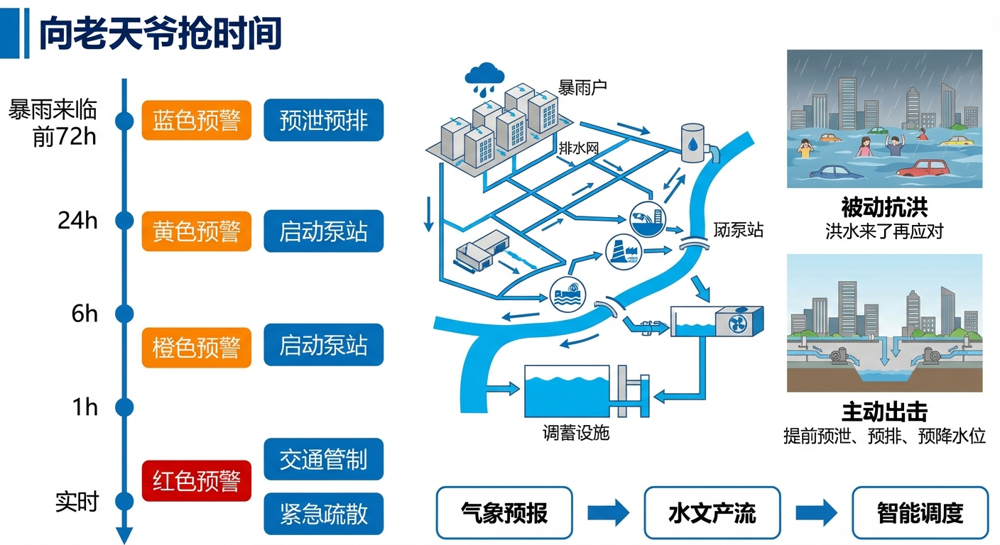
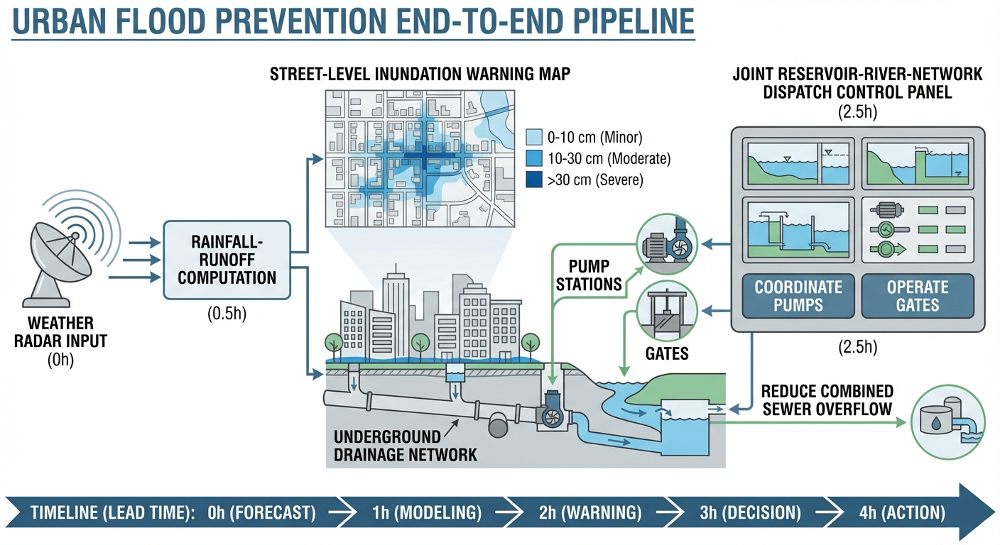
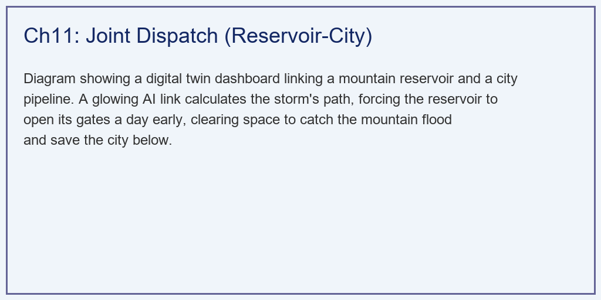
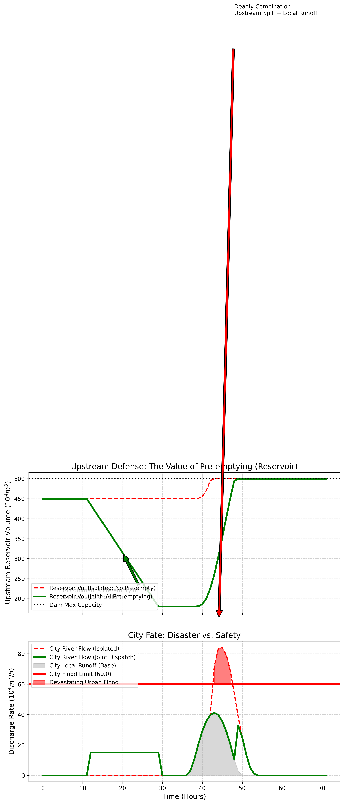

# 第 11 章：城市内涝防洪预警与联合调度：向老天爷抢时间

## 1. 学习目标
本章探讨城市水务中最棘手的问题——内涝（Urban Flooding）。我们将前面的气象预报、水文产流与智能调度组件串联起来，展示现代防汛是如何从"被动抗洪"走向"主动出击"的。
读者需要掌握：
1. 从天上下雨到街道积水的全物理演进链路（气象 -> 产流 -> 汇流 -> 漫溢）。
2. 为什么在极端暴雨下，单靠拓宽下水道（管网）注定失败？
3. "库-河-网"联合调度（Joint Dispatch）的本质：利用上游水库的库容换取下游城市的时间。

## 2. 教材理论：孤岛防御的必败之局

### 2.1 城市内涝的成因链

当暴雨倾盆而下时，城市的排水管网（网）会迅速汇集雨水，排入穿城而过的河道（河）。如果暴雨足够大，本地产生的径流量就会非常惊人。但这并不是最致命的。

**最致命的一击**：大多数城市上游都有山区，山区里通常建有大型水库（库）。当特大暴雨降临时，上游山区巨大的汇水量会迅速灌满水库。为了保证大坝安全，水库被迫开闸泄洪。这股不受控制的上游泄洪流量，与城市本地的暴雨径流在穿城河道中汇合叠加，形成了不可阻挡的洪峰。

**内涝的数学描述**——河道流量守恒方程（增加了基流和损失项）：

$$
Q_{\text{river}}(t) = Q_{\text{base}} + Q_{\text{local}}(t) + Q_{\text{spill}}(t) - Q_{\text{loss}}(t) \tag{11.1}
$$

其中 $Q_{\text{base}}$ 是河道基流，$Q_{\text{loss}}$ 包含入渗和蒸发损失。当 $Q_{\text{river}}(t) > Q_{\text{capacity}}$（河道安全行洪能力）时，超出的水量会从河道漫溢到城市街道，形成内涝。内涝积水量为：

$$
V_{\text{flood}} = \int_{t_1}^{t_2} \left[Q_{\text{river}}(t) - Q_{\text{capacity}}\right] dt \tag{11.2}
$$

### 2.2 为什么拓宽管网注定失败

面对内涝，传统的工程思路是"加粗管道、拓宽河道"。但在极端暴雨下注定失败：
1. **成本天文数字**：将穿城河道行洪能力翻倍，意味着拆迁河道两岸建筑、重建桥梁，耗资可能数百亿元。
2. **空间不允许**：城市建成区寸土寸金，根本没有拓宽河道的物理空间。
3. **治标不治本**：即使河道扩大一倍，面对千年一遇的暴雨仍然会被击穿。真正的问题不是河道太窄，而是上游来水太猛。

### 2.3 联合调度的核心思想：Pre-emptying 与 MPC 框架

**解局之道：基于数字孪生的联合调度（Pre-emptying）**——在暴雨还没来的时候，AI 强行下令水库以安全流量提前泄洪（预排空），腾出库容来"生吞"上游洪水，实现零泄洪。

预排空的优化问题可以纳入模型预测控制（MPC）框架进行系统求解：

$$
\min_{Q_{\text{pre}}(t)} \sum_{k=0}^{N_p-1} \left[ w_1 \cdot C_{\text{elec}}(k) + w_2 \cdot \max(0, V(k) - V_{\text{safe}})^2 \right] \tag{11.3}
$$

约束条件包括：

$$
V(k+1) = V(k) + [Q_{\text{in}}(k) - Q_{\text{pre}}(k)] \cdot \Delta t \tag{11.4}
$$

$$
0 \leq Q_{\text{pre}}(k) \leq Q_{\text{safe}} \tag{11.5}
$$

$$
V_{\text{dead}} \leq V(k) \leq V_{\text{max}} \tag{11.6}
$$

其中公式 (11.3) 的第一项是预排空造成的发电损失成本，第二项是库容超出安全线的惩罚；(11.4) 是水库水量平衡约束，(11.5) 要求预排空流量不超过下游河道安全承载力，(11.6) 是库容的物理上下限。$N_p$ 是预测时域长度（通常 24-48 小时）。

### 2.4 联合调度的博弈论视角

联合调度涉及多个利益主体（水库管理方、城市防汛部门、发电企业），本质上是一个多主体博弈问题。

在非合作博弈框架下，各方按照自身利益最大化行动，纳什均衡往往是"双输"结果。**合作博弈**框架提供了更优的解决思路。**Shapley 值**是公认的公平分配方法，其数学定义为：

$$
\phi_i(v) = \sum_{S \subseteq N \setminus \{i\}} \frac{|S|!(|N|-|S|-1)!}{|N|!} [v(S \cup \{i\}) - v(S)] \tag{11.7}
$$

其中 $N$ 是参与方全集，$v(S)$ 是联盟 $S$ 的收益函数。该公式根据每个参与方对联盟总收益的边际贡献来分配收益，确保分配的公平性。

### 2.5 预警分级与响应机制

城市内涝预警分为四级，每级对应不同的响应措施和概率触发条件：

| 预警等级 | 触发条件 | 响应措施 | 预留时间 |
|:---------|:---------|:---------|:---------|
| 蓝色（IV级） | 未来 24h 降雨 > 50mm，$P > 60\%$ | 通知值班人员 | > 24h |
| 黄色（III级） | 未来 12h 降雨 > 100mm，$P > 70\%$ | 启动预排空、检查泵站 | 12-24h |
| 橙色（II级） | 未来 6h 降雨 > 150mm，$P > 80\%$ | 全面预排空、转移低洼区群众 | 6-12h |
| 红色（I级） | 河道即将超载，$P > 90\%$ | 全力泄洪、关闭地铁入口 | < 6h |

预警等级的升降必须遵循**"只升不降"**的汛期原则——在暴雨过程中，即使降雨暂时减弱，也不允许降低预警等级。

**预警信息的传播链**需要标准化设计，每个环节记录时间戳：模型输出时刻、系统告警时刻、短信发送时刻、值班长确认时刻、预案启动时刻。**多渠道告警**同时通过短信、电话语音、APP 推送和值班大屏弹窗发送，要求值班长 5 分钟内确认。

## 3. 案例分析：理论与实践的桥梁（AI Agent 在特大暴雨中的"库-河"生死救援）

### 案例背景 (Context)
某城市，城中河道最大安全行洪能力只有 60 万 $m^3/h$。气象局发出红色预警：明天中午将有特大暴雨。
- **情景 A（孤立调度）**：上游水库死守 450 万立方水不放。
- **情景 B（联合调度）**：AI Agent 获取最高调度权限，跨部门统筹水库和河道。

### 问题描述 (Problem)
- **暴雨**发生在第 36-48 小时。水库总容量 500 万 $m^3$，初始水量 450 万 $m^3$。
- **孤立调度**：不提前放水，超限后被动泄洪。
- **联合调度**：Agent 在第 12-30 小时以 15 万 $m^3/h$ 安全流量提前腾库。

**物理场景与问题概化图：**

### 解题思路 (Solution Approach)
1. **降水与卷积演进**：使用 `np.convolve` 模拟汇聚过程。山区使用宽缓算子模拟山林阻滞，城市使用陡峭算子模拟水泥下水道的极速汇聚。
2. **状态机 A（被动防守）**：`res_vol > Max` 触发被动溢流，溢流水量累加到城市河道。
3. **状态机 B（主动进攻）**：引入 `pre_release_flow`，在暴雨前主动降低水库库存。

### 代码执行与图表 (Code & Charts)
> **学习提示**：请注意上方子图，绿色线（AI 调度）是如何像"深蹲"一样先降下水位，然后完美接住洪水的。

Source: `assets/ch11/ch11_joint_dispatch.py`

**传统各自为战与全局 AI 统筹在极端气象下的内涝灾害评估矩阵：**

| Metric | Isolated Operation | Joint Dispatch (AI) | System Impact |
|:-------|:-------------------|:--------------------|:--------------|
| 预泄量 | None | 180万m3 | 腾出缓冲空间 |
| 暴雨期水库溢流峰值 | 50.1 万m3/h | 0.0 | 消除上游威胁 |
| 城市河道峰值流量 | 84.1 万m3/h | 41.2 万m3/h | 大幅削峰 |
| 城市内涝总量 | 87.3 万m3 | 0.0 | 城市安全 |

**利用提前预排空斩断灾难叠加的时序全息对比图：**

### 代码解读

本章仿真脚本 `ch11_joint_dispatch.py` 按"输入-演算-可视化-表格输出"组织。先用 `numpy/pandas/matplotlib` 建模并生成 72 小时离散时间序列；再构造三类过程线：暴雨 `rain_storm`、上游入库洪水 `inflow_mountain`、城市本地径流 `runoff_city`；随后分别计算两种情景。

**关键参数的物理含义**：`t_end=72, dt=1h` 表示小时级滚动仿真；`rain_storm[36:48]` 表示第 36-48 小时出现强降雨；卷积核 `[0.1,0.3,0.5,0.3,0.1]` 与 `[0.4,0.6,0.4]` 分别刻画山区汇流滞后和平原城市快汇流。`Res_Max_Cap=500` 是水库上限库容，`River_Capacity=60` 是城市河道安全泄量阈值。初始库容 `450` 表示汛前偏高水位。联合调度中 `pre_release_flow=15`（第 12-30 小时）代表预报触发的安全预泄。

**核心算法实现要点**：核心是离散水量平衡 `V(t)=V(t-1)+Qin(t)-Qpre(t)`，若超上限则形成 `spill`（被迫泄洪），若低于 0 则截断到 0。两情景差别只在预泄流量：孤立情景为 0，联合情景为预泄序列。城市河道总流量计算为：孤立 `Qriver=runoff+spill`；联合 `Qriver=runoff+spill+pre_release`。灾损量用超阈值积分：`sum(max(0, Qriver-River_Capacity))`。

**输出与表格的对应**："预泄量"= $15 \times 12 = 180$；"暴雨期水库溢流峰值"取 `max(res_spill_*)`：孤立为 50.1，联合为 0.0；"城市河道峰值流量"取 `max(river_flow_*)`：84.1 vs 41.2；"城市内涝总量"取超限累计：87.3 vs 0.0。

### 实验验证与结果剖析 (Verification & Result Interpretation)
- **情景 A（红虚线）**：水库在暴雨来临时库容被迅速灌满，被迫泄洪峰值达 50.1 万 $m^3/h$。城市河道总流量以 84.1 万 $m^3/h$ 击穿 60.0 的防洪红线，累计 87.3 万 $m^3$ 洪水涌上街道。
- **情景 B（绿实线）**：AI 在第 12 小时开闸预泄，将水库水位挖出深坑（腾出 180 万 $m^3$ 空间）。暴雨降临后，水库将上游洪水全部吸收（零泄放）。城市河道流量稳在 41.2 万 $m^3/h$，远低于红线。城市毫发无损。

### 工业部署与运行建议 (Industrial Deployment Recommendations)
1. **打破部门壁垒**：水库归水利局管，河道归河长办管，下水道归住建局管。建设智能水务必须利用数字底座将数据强制打通。
2. **多重博弈与法律追责**：AI 下令提前放水导致发电损失但暴雨未至时谁赔？目前法律框架尚未赋予 AI 这种决定权，L4 级别 AI 通常只输出决策建议书。
3. **预排空的经济补偿机制**：建立"防洪基金"或"水权交易"制度，是联合调度可持续运行的制度保障。

## 4. 本章小结

- 城市内涝的核心成因是"本地径流 + 上游泄洪"的灾难叠加，单靠拓宽管网无法解决。
- 预排空优化问题可纳入 MPC 框架求解，目标函数兼顾发电损失最小化和库容安全最大化。
- 联合调度本质上是多主体博弈问题，Shapley 值为利益分配提供了公平的量化方法。
- 预警分级结合概率触发条件，确保各级响应措施与风险等级匹配。
- 制度障碍（部门壁垒、法律追责、经济补偿）是联合调度落地的真正瓶颈。
- 代码锚点：`assets/ch11/ch11_joint_dispatch.py`

## 5. 思考与练习

1. **计算题**：某城市河道安全行洪能力为 80 万 $m^3/h$。暴雨期间本地径流 50 万 $m^3/h$，上游水库泄洪 60 万 $m^3/h$。（a）计算河道总流量和超载量；（b）如果暴雨持续 6 小时，内涝总积水量是多少？（c）如果预排空使泄洪量降至 0，城市是否安全？

2. **设计题**：请设计一套"预排空决策支持系统"的用户界面原型。需展示水库当前库容、气象预报、推荐预排空流量、下游影响评估和审批按钮。

3. **讨论题**：如果气象预报不确定性很大，你作为值班长会决定启动预排空吗？讨论"预排空后没下雨"和"没预排空但下了大暴雨"两种情况的社会后果。

4. **分析题**：请从水权、电力经济和防洪安全三个角度，分析"水库为城市防洪牺牲发电量"这一行为的合理性。如何设计补偿机制使各方利益均衡？

## 参考文献

[1] 雷晓辉,龙岩,许慧敏,等.水系统控制论：提出背景、技术框架与研究范式[J].南水北调与水利科技(中英文),2025,23(04):761-769+904.DOI:10.13476/j.cnki.nsbdqk.2025.0077.

[2] 雷晓辉,龙岩,许慧敏,等.自主水网：概念、架构与关键技术[J].南水北调与水利科技(中英文),2025.DOI:10.13476/j.cnki.nsbdqk.2025.0079.

[3] Chow V T, Maidment D R, Mays L W. Applied Hydrology[M]. McGraw-Hill, 1988.

[4] Zhu Z, Chen Z, Chen X, et al. Joint Operation of Reservoirs and Flood Detention Basins for Urban Flood Mitigation[J]. Water Resources Research, 2020, 56(4): e2019WR026864.
