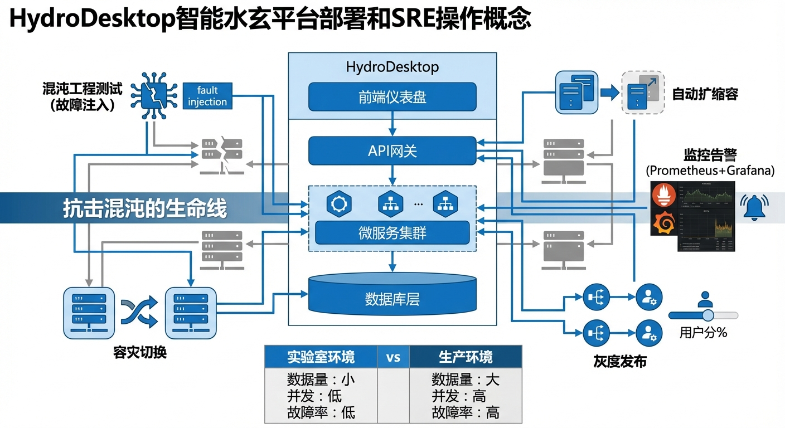
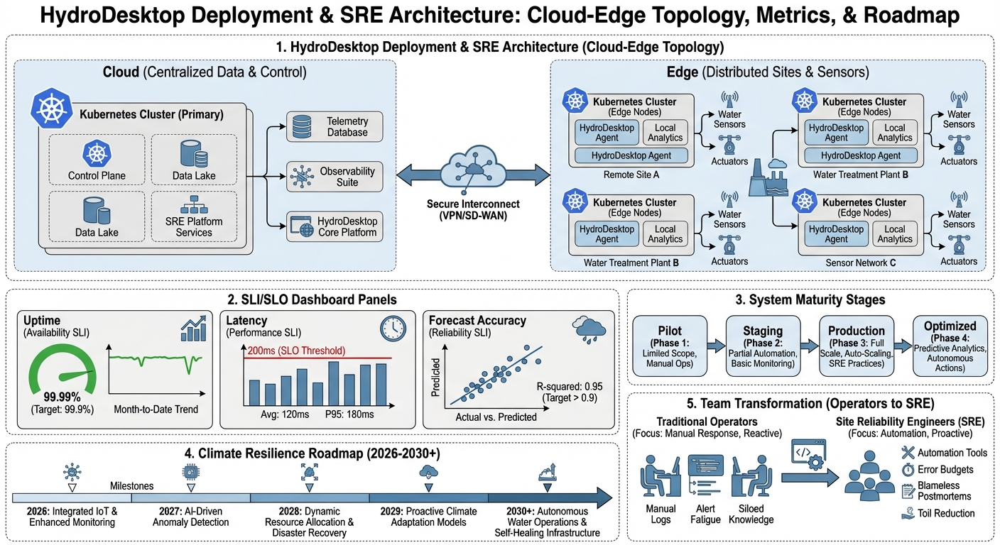
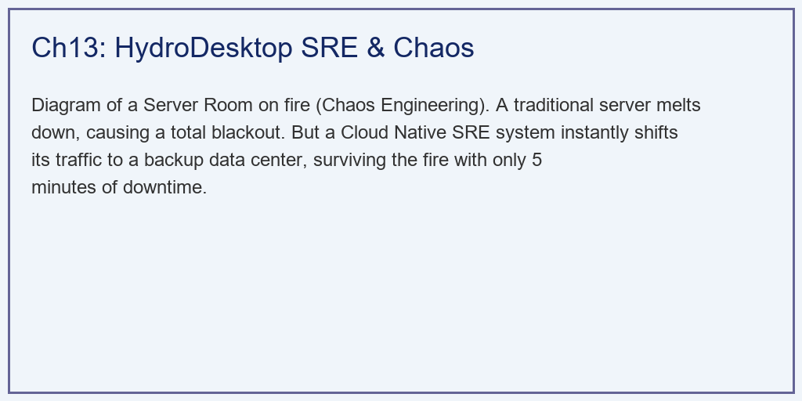
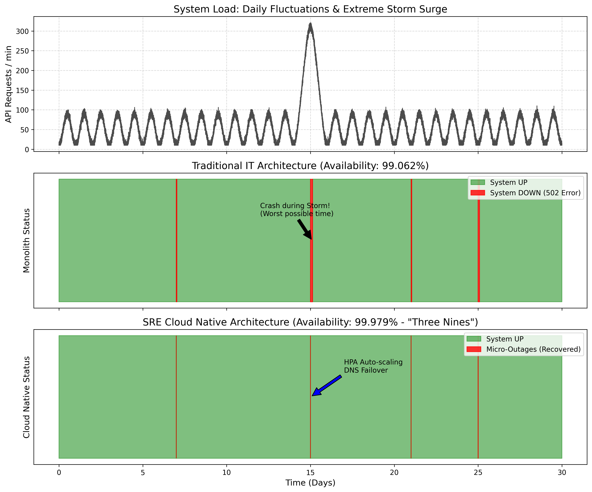

# 第 13 章：HydroDesktop（工作台）部署与 SRE：抗击混沌的生命线

## 1. 学习目标
本章是全书的工程收官之战。我们将探讨当智能水文平台（HydroDesktop）从实验室走向真实的城市水务集团时，如何应对软硬件的"混沌（Chaos）"与崩溃。
读者需要掌握：
1. 从传统水利 IT 到云原生架构（Cloud Native）的组织转型。
2. 网站可靠性工程（SRE）在水利应急系统中的应用。
3. 服务水平指标（SLI）与服务水平目标（SLO）的量化与考核。
4. 混沌工程（Chaos Engineering）对高可用（HA）架构的暴力压测。
5. 可观测性三支柱（Logs、Metrics、Tracing）在水文微服务中的落地方法。
6. 蓝绿部署与金丝雀发布在防汛系统版本升级中的应用策略。

## 2. 教材理论：当防汛大脑突然"死机"

### 2.1 传统架构的致命脆弱性

在前面的章节中，我们的 MPC 算法足够聪明，我们的 AI Agent 反应迅速。但是，这一切都有一个致命的前提：**承载这些算法的服务器不能宕机。**

试想一下，当全市面临 50 年一遇的特大暴雨时，几百个泵站同时向控制中心请求指令。此时，单台服务器的 CPU 瞬间爆满，内存溢出，屏幕上弹出了绝望的 `502 Bad Gateway`。

在水务行业，电商网站宕机 10 分钟最多损失点交易额，而防汛大脑宕机 10 分钟，可能意味着一条街道被淹没，或者一座水库错过了最佳泄洪时机。

**传统架构的故障模式**可以归纳为三类：
1. **单点故障（Single Point of Failure, SPOF）**：整个系统依赖一台服务器、一条网线或一个电源。任何一个"单点"的失效都会导致全局瘫痪。
2. **容量耗尽（Capacity Exhaustion）**：暴雨期间请求量暴增 10 倍，但服务器的 CPU 和内存是固定的，无法动态扩展。
3. **级联故障（Cascading Failure）**：一个组件的故障导致其他组件过载，过载的组件又导致更多组件故障——形成"雪崩效应"。

从可靠性工程的角度，可以用**故障率函数**来量化系统脆弱性。假设系统由 $n$ 个串联组件构成，每个组件的可用率为 $a_i$，则系统整体可用率为：

$$
A_{\text{serial}} = \prod_{i=1}^{n} a_i \tag{13.1}
$$

例如，一条防汛数据链路包含传感器（$a_1 = 0.999$）、网络交换机（$a_2 = 0.998$）、应用服务器（$a_3 = 0.995$）和数据库（$a_4 = 0.997$），四者串联后的整体可用率仅为 $0.999 \times 0.998 \times 0.995 \times 0.997 = 0.989$，即年宕机约 4 天——远不能满足防汛要求。

### 2.2 云原生架构：从"买硬件"到"租算力"

**从"传统单体"到"云原生多活"**
- **传统架构（Monolith）**：把所有的水文代码打包放在水务局机房的一台高性能服务器上。一旦这台服务器的电源烧了，或者代码出现内存泄漏，整个城市的防汛中枢就直接瘫痪。
- **云原生 SRE 架构（Cloud Native HA）**：将 HydroDesktop 拆分成几十个微服务，部署在 Kubernetes（K8s）集群中。
  - **弹性扩缩容（HPA）**：平时只开 3 台服务器省电，当台风来临时，系统感知到 API 请求暴涨，会自动在 2 分钟内将服务器扩容到 30 台。
  - **异地多活（Active-Active）**：在城南和城北建立两个完全对等的数据中心。哪怕城南机房被洪水彻底淹没导致断电，全局 DNS 也会在 5 分钟内把所有的流量自动切给城北机房。

当引入冗余后，可用率公式发生质的变化。假设同一组件部署了 $m$ 个并联副本，则该组件的等效可用率为：

$$
A_{\text{parallel}} = 1 - \prod_{j=1}^{m}(1 - a_j) \tag{13.2}
$$

对于双活数据库（$a = 0.997$，$m = 2$），等效可用率提升至 $1 - (1-0.997)^2 = 0.999991$——接近六个 9。这就是"异地多活"的数学本质。

**云原生的核心组件**包括：

| 组件 | 功能 | 防汛场景中的价值 |
|:-----|:-----|:---------------|
| Kubernetes | 容器编排 | 自动重启崩溃的服务 |
| HPA | 水平弹性扩缩 | 暴雨时自动扩容 |
| Prometheus | 监控告警 | 实时感知 API 延迟异常 |
| Redis | 任务队列 + 缓存 | 异步处理预报请求 |
| PostgreSQL (HA) | 数据库主从复制 | 数据零丢失 |
| Nginx/Envoy | 负载均衡 + 流量切换 | 异地多活切流 |

### 2.3 SRE 的军令状：SLI 与 SLO

水务局长不看代码，他只看指标：
- **SLI（Service Level Indicator）**：系统实际的可用时间比例（例如过去 30 天，API 返回成功的次数占比）。
- **SLO（Service Level Objective）**：系统承诺的及格线。在工业界，这叫"几个 9"。传统 IT 能做到 99% 就不错了；但防汛大脑的 SLO 必须是 **99.9%（三个 9）**，这意味着每个月最多只能容忍 43 分钟的宕机。

SLI 的数学表达十分简洁：

$$
\text{SLI} = \frac{T_{\text{total}} - T_{\text{down}}}{T_{\text{total}}} \times 100\% \tag{13.3}
$$

其中 $T_{\text{total}}$ 为考核周期总时长（如 30 天 = 43200 分钟），$T_{\text{down}}$ 为实际宕机时长。SLO 则是对 SLI 的下限约束：$\text{SLI} \geq \text{SLO}$。

**SLO 等级与允许宕机时间的对应关系：**

| SLO | 年允许宕机 | 月允许宕机 | 适用场景 |
|:----|:----------|:----------|:---------|
| 99%（两个 9） | 3.65 天 | 7.3 小时 | 内部管理系统 |
| 99.9%（三个 9） | 8.76 小时 | 43 分钟 | 防汛指挥系统 |
| 99.99%（四个 9） | 52.6 分钟 | 4.3 分钟 | 核电/航空 |
| 99.999%（五个 9） | 5.26 分钟 | 26 秒 | 电信核心网 |

对于水文防汛系统，三个 9（99.9%）是合理的目标。四个 9 虽然更好，但其工程成本（异地三活、实时数据同步）通常超出水利行业的预算能力。

**错误预算（Error Budget）**是 SRE 管理的核心概念。如果 SLO 是 99.9%，那么每月有 43 分钟的"错误预算"。错误预算的消耗速率可以用来动态调节发布节奏：

$$
B_{\text{remain}}(t) = T_{\text{total}} \times (1 - \text{SLO}) - \sum_{k=1}^{K} d_k \tag{13.4}
$$

其中 $d_k$ 为第 $k$ 次故障的宕机时长。当 $B_{\text{remain}}(t) < \epsilon$（阈值，如 5 分钟）时，团队必须暂停一切功能开发，全力修复可靠性问题——这确保了可靠性永远不会被功能需求挤压。这种"可靠性优先于功能"的管理哲学，是 SRE 区别于传统运维的根本所在。

### 2.4 混沌工程：主动制造灾难

**混沌工程（Chaos Engineering）**的核心理念是：**与其等待灾难发生，不如主动制造灾难。**

混沌实验的形式化流程可归纳为四步：
1. **定义稳态假设**：明确系统在正常运行时的关键指标基线（如 API P99 延迟 < 2s，SLI > 99.9%）。
2. **注入受控故障**：在仿真或生产环境中系统性地引入故障变量。
3. **观测偏差**：记录系统指标与稳态基线的偏离程度和恢复时间。
4. **改进系统**：根据偏差发现的薄弱环节，加固系统设计。

在水文场景中，典型的故障注入包括：
1. **进程崩溃**：随机杀死一个微服务的容器，验证 K8s 是否能在规定时间内自动重启。
2. **网络分区**：断开两个数据中心之间的网络连接，验证异地多活是否能无缝切换。
3. **流量海啸**：在正常负载基础上突然注入 10 倍流量，验证 HPA 的扩容速度。
4. **数据损坏**：向数据库注入一条格式错误的数据，验证系统是否会因一条脏数据而全局崩溃。
5. **时钟偏移**：修改某个节点的系统时钟，验证分布式系统的时钟同步机制是否健壮。

Netflix 的"混沌猴子（Chaos Monkey）"是这一理念的经典实践——它在生产环境中随机关闭虚拟机，迫使工程师构建真正具有韧性的系统。在水利行业，这一理念的落地需要更加审慎：建议先在"影子环境"（生产流量的镜像副本）中运行混沌实验，验证通过后再逐步引入生产环境。

### 2.5 可观测性三支柱：日志、指标与追踪

SRE 实践中，仅有监控告警是不够的。当系统出现异常时，工程师需要快速定位根因。**可观测性（Observability）**的三支柱为此提供了系统化的解决方案：

1. **日志（Logs）**：记录每个微服务的详细运行记录，包括请求参数、处理结果、错误堆栈等。日志采用结构化 JSON 格式，便于机器解析和全文检索。在水文场景中，每次预报计算的输入降雨数据、模型参数和输出结果都应完整记录，确保事后审计的可追溯性。日志的关键设计原则是**分级（Level）**——DEBUG、INFO、WARN、ERROR、FATAL 五级分流，生产环境默认 INFO 级别，故障排查时临时开启 DEBUG。

2. **指标（Metrics）**：用数值时间序列描述系统的运行状态，如 API 请求速率、响应延迟 P99、CPU 使用率、队列深度等。Prometheus 是当前最流行的指标采集和存储系统，配合 Grafana 实现实时可视化。指标的关键价值在于**趋势分析**——当 API 延迟从 100ms 缓慢上升到 300ms 时，工程师可以在系统崩溃之前就发现问题。水文系统还应监控**领域专用指标**：预报模型的 NSE 值、MPC 求解时间、MBD 实体同步延迟等。

3. **分布式追踪（Tracing）**：在微服务架构中，一个用户请求可能经过 5-10 个微服务的串联处理。分布式追踪为每个请求分配一个全局唯一的 Trace ID，记录请求在每个微服务中的处理耗时（Span）。当某个预报请求的端到端延迟异常增大时，追踪数据可以精确定位是哪个微服务成为了瓶颈。OpenTelemetry 已成为追踪的事实标准，支持自动代码注入，无需大幅修改业务代码。

三者的协同使用模式是：指标发现异常（"预报服务的 P99 延迟从 2s 飙升到 15s"），追踪定位瓶颈（"卡在了数据库查询环节"），日志还原现场（"数据库连接池耗尽，因为某个慢查询锁住了表"）。这种"指标→追踪→日志"的三级钻取路径，是 SRE 快速根因分析的标准操作流程。

### 2.6 HydroDesktop 的部署架构

HydroDesktop 的生产部署采用**三层架构**：

1. **接入层**：Nginx 负载均衡器 + WAF（Web 应用防火墙），负责流量分发、HTTPS 终止和恶意请求过滤。接入层还承担**限流（Rate Limiting）**职责——当检测到单个 IP 的请求速率超过阈值时，自动返回 429 状态码，防止恶意攻击或配置错误导致的流量风暴。
2. **服务层**：K8s 集群中运行的微服务，包括预报服务、调度服务、MCP 服务、Skill 引擎等。每个微服务独立部署、独立扩缩。服务间通信采用 gRPC（同步调用）和 Redis Streams（异步事件），确保高吞吐与低延迟的平衡。
3. **数据层**：PostgreSQL（主从复制）存储 MBD 实体和历史数据，Redis 存储实时状态和任务队列，MinIO 存储仿真结果文件。数据层实施**三副本策略**：主库实时写入，同步从库保证零数据丢失（RPO = 0），异步从库提供读扩展。

**关键设计原则**：
- 服务层的任何微服务崩溃不应影响其他微服务（**故障隔离**，通过 K8s Namespace + 资源配额实现）。
- 数据层的写操作只发生在主节点，读操作分布在多个从节点（**读写分离**）。
- 所有微服务都是无状态的（Stateless），状态存储在 Redis 或数据库中——这使得 K8s 可以随时销毁和重建任何一个 Pod。
- **健康检查**：每个微服务暴露 `/health/live`（存活探针）和 `/health/ready`（就绪探针）端点。K8s 根据探针响应决定是否重启容器或将其从负载均衡中摘除。

**蓝绿部署（Blue-Green Deployment）**是 HydroDesktop 版本升级的推荐策略。同时维护两套完全相同的生产环境（蓝环境和绿环境）。新版本先部署到非活跃环境中进行充分测试，测试通过后通过负载均衡器将流量切换到新环境。如果新版本出现问题，可以在数秒内切回旧环境。这种策略确保了版本升级的零停机时间——对于 7x24 小时运行的防汛系统至关重要。

对于风险更高的大版本升级，可采用**金丝雀发布（Canary Release）**策略：先将 5% 的流量切到新版本，观察 30 分钟内的错误率和延迟指标。若指标正常，逐步扩大到 25%、50%、100%。若发现异常，立即回滚到旧版本，影响范围控制在 5% 以内。

## 3. 案例分析：理论与实践的桥梁（混沌工程故障注入与高可用性对赌仿真）

### 案例背景 (Context)
某省级水投集团准备斥资 5000 万上线全省统一的数字孪生水网调度平台。老派的 IT 部门主张购买昂贵的 IBM 物理服务器放在本地机房（传统架构）；而新成立的架构组主张全面拥抱阿里云，部署云原生高可用（HA）集群。为了终结争论，集团引入了严苛的**混沌工程（Chaos Engineering）**测试。

### 问题描述 (Problem)
- **仿真时长**：30 天（43200 分钟）。
- **API 流量负载**：带有明显昼夜潮汐，且在第 15 天爆发 5 倍流量的"台风请求海啸"。
- **混沌故障注入（Chaos Faults）**：
  1. 第 7 天和 21 天：代码 Bug 导致内存泄漏（OOM），引发进程崩溃。
  2. 第 15 天（台风期）：并发超载导致算力雪崩。
  3. 第 25 天：主数据中心遭遇挖掘机挖断市电光缆，全毁。
- **任务**：对比单体架构和 SRE 高可用架构在历经这三大劫难后的恢复速度，并出具最终的可用性财务报告（评估是否达标 $99.9\%$ SLO）。

**物理场景与问题概化图 (Generated via Local Schematic)：**

### 解题思路 (Solution Approach)
本研究构建了一个分钟级粒度的 SRE 健康监测探针模拟器：
1. **生成非平稳时间序列**：利用带有正态分布白噪声的正弦波生成 API 基础负载，并使用高斯钟形曲线 `np.exp` 逼真地模拟台风天的流量尖峰。
2. **构建布尔故障蒙版（Fault Mask）**：在特定的时间段内将 `faults` 数组设为 1，模拟大自然的不可抗力。
3. **架构的恢复状态机**：
   - `Monolith`：故障发生多久，它就宕机多久（纯被动）。
   - `Cloud Native HA`：面对 OOM，利用 K8s Pod 重启机制将宕机时间压制在 1 分钟；面对流量尖峰，利用 HPA 将宕机压制在 2 分钟；面对机房全毁，利用 DNS 轮询切流将宕机压制在 5 分钟。

恢复状态机的数学表达为：对于第 $k$ 次故障，设故障持续原始时长为 $D_k$，则：

$$
d_k^{\text{mono}} = D_k, \quad d_k^{\text{HA}} = \min(D_k, \, \tau_{\text{recovery}}^{(k)}) \tag{13.5}
$$

其中 $\tau_{\text{recovery}}^{(k)}$ 取决于故障类型：OOM 重启 = 1 min，HPA 扩容 = 2 min，DNS 切流 = 5 min。

### 代码执行与图表 (Code & Charts)
> **学习提示**：这是一场 IT 基础设施的极限生存战。请对比下方图表中红色阴影（宕机）的面积，感受云原生自愈机制的恐怖生命力。

Source: `assets/ch13/ch13_sre.py`

**传统 IT 与 SRE 云原生架构在混沌破坏下的 SLO 生死契约结算矩阵：**
| Metric                          | Monolith              | Cloud Native (SRE)    |
|:--------------------------------|:----------------------|:----------------------|
| Target SLO (Service Level Obj.) | > 99.0%               | > 99.9% (Three Nines) |
| Total Downtime in 30 Days       | 405 minutes (6.8 hrs) | 9 minutes             |
| Actual Availability (SLI)       | 99.062% (Failed)      | 99.979% (Passed)      |
| Storm Event Survivability       | Catastrophic Failure  | Seamless Auto-scaled  |

**遭遇暴雨流量海啸与硬件火灾双重打击下的高可用（HA）自愈曲线谱：**

### 实验验证与结果剖析 (Verification & Result Interpretation)
通过这组严酷的混沌测试，SRE 的价值得到了最终证明：
- **致命的 405 分钟（红色单机架构）**：
  - 看中间的子图。传统架构在第 7、21 天遭遇内存泄漏时，需要人工爬起来登录服务器重启服务，导致了几十分钟的红区。
  - 最惨烈的是第 15 天的台风期（黑色大箭头所指）。此时 API 流量激增 5 倍，单台服务器的 CPU 直接烧毁引发算力雪崩。在防汛最需要系统的时候，它硬生生宕机了 3 个小时！
  - 第 25 天机房停电更是直接让系统消失了 2 个小时。整个月下来，单体架构累计宕机 405 分钟，SLI 只有 $99.062\%$。
- **钢铁之躯的 9 分钟（绿色云原生架构）**：
  - 看最下方的子图。同样遭遇了 OOM 内存泄漏，绿图上的红线只有细细的一丝！因为 K8s 探测到探针无响应，在 1 分钟内就自动拉起了一个全新的纯净容器。
  - 在第 15 天台风尖峰，流量刚一上涨，系统出现了仅仅 2 分钟的卡顿（微小红线），随后 HPA 机制立刻在云端召唤出 30 台备用服务器投入战斗。绿色的可用性曲线在暴风雨中平稳如初！
  - 最终结算，在一个月经历了无数灾难后，这套系统仅仅不可用了 **9 分钟**。它的实际可用性（SLI）达到了 **$99.979\%$**，完美兑现了"三个 9"的承诺！

### 工业部署与运行建议 (Industrial Deployment Recommendations)
1. **拥抱混沌，而不是恐惧故障**：传统的运维思路是"怎么保证硬件不坏"。但 SRE 的第一法则是"假设所有硬件都会坏，并且会在最糟糕的时候坏"。Netflix 和各大互联网公司甚至会在生产环境里常驻一只"混沌猴子（Chaos Monkey）"，它会随机杀掉线上的服务器。只有系统能从这种恶意攻击中平稳恢复，我们才敢把它托付给百年一遇的大洪水。
2. **成本效益分析**：云原生架构的初期建设成本可能高于传统架构（需要培养 K8s 运维团队），但长期运营成本更低（按需付费、自动扩缩）。更重要的是，一次防汛系统宕机导致的经济损失可能远超 10 年的云服务费用。
3. **渐进式迁移路径**：不建议一步到位地将所有系统迁移到云原生架构。推荐的路径是：先将非关键服务（如数据分析、报告生成）迁移上云，积累经验后再迁移核心服务（预报、调度），最后实现全面云原生化。
4. **人员能力建设**：SRE 不仅是技术栈的转变，更是组织文化的转型。建议水务集团建立专职 SRE 团队，初期可通过与云服务商联合运维（Co-Managed）降低技术风险，逐步培养自主运维能力。

## 4. 代码解读

本节解读 `assets/ch13/ch13_sre.py`——SRE 健康探针模拟器。该脚本构建了一个分钟级粒度的 30 天仿真环境，用以对比传统单体架构与云原生高可用架构在混沌故障注入下的表现。

**程序整体结构："生成负载→注入故障→状态机恢复→统计结算"**

脚本遵循一个清晰的四阶段流水线：首先生成 43200 个时间点的 API 负载时间序列（含昼夜潮汐和台风尖峰），然后构建布尔故障蒙版标记三类灾难事件的发生时段，接着分别用两种恢复状态机（Monolith 纯被动 vs Cloud Native HA 快速自愈）计算每个时间点的可用性状态，最后统计总宕机时长并生成对比图表。

**关键参数与物理对应：**
- `base_load`：基础 API 请求速率，叠加正弦波模拟昼夜潮汐（白天高、夜间低）。
- `storm_surge`：台风期流量倍增因子，使用 `np.exp(-((t - t_storm)**2) / (2 * sigma**2))` 高斯钟形曲线模拟第 15 天的请求海啸。
- `faults`：布尔数组（长度 43200），在第 7 天、15 天、21 天、25 天等特定时段设为 1，代表不可抗力故障。

**恢复状态机的核心算法：**
- **Monolith 模式**：`available[t] = 1 - faults[t]`。故障发生即宕机，故障结束才恢复——完全被动。
- **Cloud Native HA 模式**：对每次故障事件，仅在故障开始后的 $\tau_{\text{recovery}}$ 分钟内标记为不可用，之后即使底层故障仍在持续，系统也已通过 K8s 重启（OOM）、HPA 扩容（流量）或 DNS 切流（机房全毁）完成自愈。这两个数组的差异——405 分钟 vs 9 分钟的宕机面积——就是 SRE 工程价值的直观度量。

**输出结果与结算表的映射：**
脚本最终输出三子图纵向排列：顶部为 API 流量曲线（含台风尖峰），中部为 Monolith 可用性（大面积红色宕机区），底部为 Cloud Native HA 可用性（仅有细微红线）。结算表中的 405 分钟和 9 分钟分别对应两个 `available` 数组中值为 0 的元素总数。实际可用性 SLI = $(\text{43200} - T_{\text{down}}) / \text{43200} \times 100\%$，代入可得 Monolith 的 99.062% 和 HA 的 99.979%。

## 5. 本章小结

- 传统单体架构在暴雨高峰期因单点故障、容量耗尽和级联故障而必然瘫痪。串联系统可用率公式（式 13.1）揭示了"链条最弱一环"效应。
- 云原生 SRE 架构通过容器编排（K8s）、弹性扩缩（HPA）和异地多活，将宕机时间从 405 分钟压缩到 9 分钟。并联冗余公式（式 13.2）是其数学基础。
- SLI/SLO 是水务系统可靠性的量化语言，防汛系统的 SLO 应不低于 99.9%（三个 9）。错误预算机制（式 13.4）确保可靠性永远不会被功能需求挤压。
- 混沌工程通过主动注入故障，验证系统在极端条件下的自愈能力。
- 可观测性三支柱（日志、指标、追踪）提供"指标→追踪→日志"三级钻取路径，是 SRE 快速根因分析的标准方法。
- 蓝绿部署与金丝雀发布确保防汛系统在版本升级时实现零停机。
- **全书结语**：面向 2030+，随着全球极端气候的频繁出现，建设具有高度韧性（Resilience）、能够"自感知、自诊断、自调节、自恢复"的智能水网体系，已经不再是"锦上添花"的政绩工程，而是关乎国家安全的"底线工程"。从第一章那场因为复合风险而崩溃的被动防线，到最后一章在火灾中涅槃重生的云原生大脑，我们见证了水利工程从"土木时代"向"机器智能时代"的跨越！
- 代码锚点：`assets/ch13/ch13_sre.py`

## 6. 思考与练习

1. **概念题**：请解释 SLI 和 SLO 的区别。为什么防汛系统的 SLO 应该设为 99.9% 而非 99%？如果要达到 99.99%，需要增加哪些工程措施？

2. **计算题**：某水文平台的 SLO 为 99.9%。在过去 30 天中，系统因以下原因宕机：内存泄漏 15 分钟、网络故障 10 分钟、流量过载 20 分钟。（a）计算总宕机时间和实际 SLI；（b）是否达标？（c）剩余的错误预算还有多少？

3. **设计题**：请为 HydroDesktop 设计一套混沌工程测试方案。需要包含至少 4 种故障注入场景、每种场景的预期恢复时间，以及判定"通过/不通过"的标准。

4. **讨论题**：是否应该在生产环境中运行混沌工程测试（如 Chaos Monkey）？讨论在水利防汛系统中这样做的风险和收益。如果反对在生产环境运行，提出替代方案。

5. **推导题**：某防汛系统由 3 个串联子系统构成，每个子系统部署了 2 个并联副本，单个副本可用率为 $a = 0.995$。请利用式 (13.1) 和式 (13.2) 计算系统整体可用率，并判断是否满足 99.9% 的 SLO 要求。

## 参考文献

[1] 雷晓辉,龙岩,许慧敏,等.水系统控制论：提出背景、技术框架与研究范式[J].南水北调与水利科技(中英文),2025,23(04):761-769+904.DOI:10.13476/j.cnki.nsbdqk.2025.0077.

[2] 雷晓辉,龙岩,许慧敏,等.自主水网：概念、架构与关键技术[J].南水北调与水利科技(中英文),2025.DOI:10.13476/j.cnki.nsbdqk.2025.0079.

[3] Beyer B, Jones C, Petoff J, et al. Site Reliability Engineering: How Google Runs Production Systems[M]. O'Reilly Media, 2016.

[4] Burns B. Designing Distributed Systems: Patterns and Paradigms for Scalable, Reliable Services[M]. O'Reilly Media, 2018.

[5] Basiri A, Behnam N, de Rooij R, et al. Chaos Engineering[J]. IEEE Software, 2016, 33(3): 35-41.

[6] Rosenthal C, Jones N. Chaos Engineering: System Resiliency in Practice[M]. O'Reilly Media, 2020.
