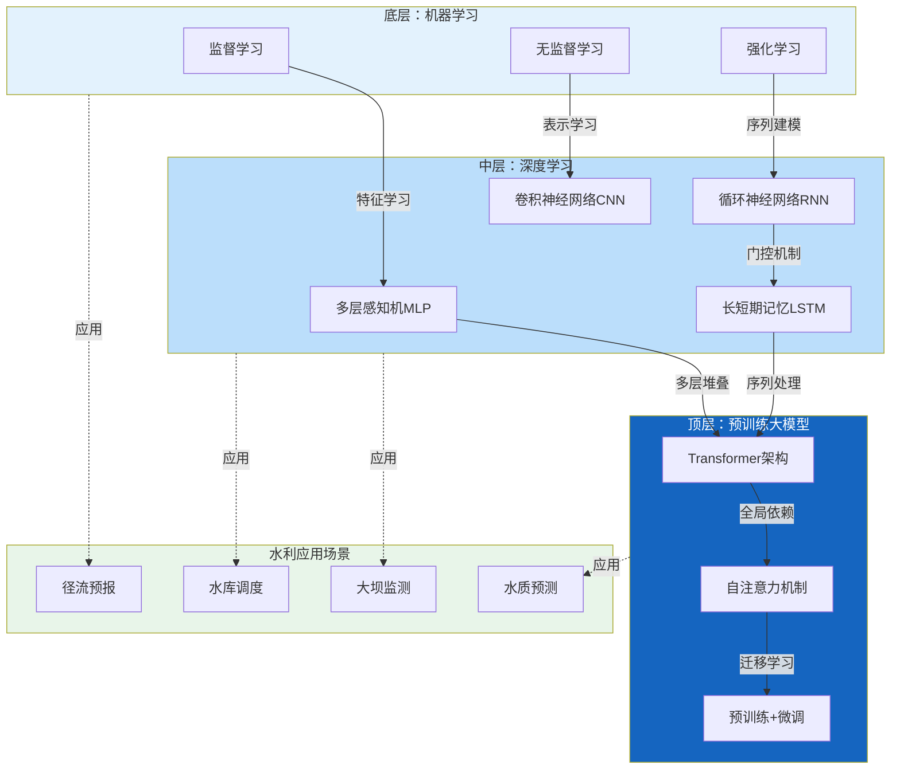
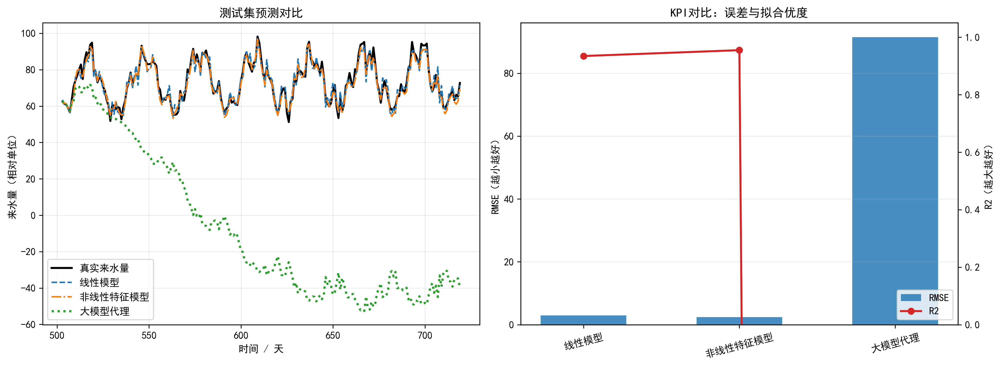

# 第1章 AI全景：从机器学习到大模型

## 本章导读

水利水电工程作为典型的大型复杂系统，其规划、设计、运行与管理涉及海量多源异构数据与高度非线性的物理过程。传统的水文水动力学模型与水资源调度优化方法，多建立在严格的物理机制与实证假设基础之上。然而，随着全球气候变化加剧与人类活动干扰增强，流域产汇流规律、水环境演变特征以及工程结构性态均呈现出非平稳性特征，导致传统机制模型在参数率定、计算效率及预测精度上面临严峻挑战。

人工智能（Artificial Intelligence, AI）技术的突破性进展，特别是从传统机器学习向深度学习，再向预训练大模型的跨越式演进，为水利工程学科提供了全新的数据驱动范式。本章是《人工智能与水利水电工程》的第1章，围绕“AI全景：从机器学习到大模型”展开，系统梳理人工智能的基本概念、演进脉络及理论方法，并深入剖析其在水利工程领域的应用全景。通过建立统一的数学理论框架，结合典型水文序列预测的仿真案例，本章旨在阐明数据驱动模型与物理机制系统的内在联系，为后续章节针对具体水利场景的AI算法设计与工程实践奠定理论基础。

## 1.1 基本概念与理论框架

人工智能的演进历程可概括为符号主义、连接主义与行为主义的交替发展。当前主导水利AI应用的连接主义流派，经历了从浅层机器学习到深层神经网络，再到超大规模预训练模型的演化。

### 1.1.1 机器学习三大范式

机器学习的核心目标是使计算机系统能够从数据中自动提取模式并改善性能。根据训练数据标注状态与反馈机制的差异，机器学习主要划分为三大基本范式：

1.  **监督学习（Supervised Learning）**：给定包含输入特征与对应标签的训练数据集，算法旨在学习一个映射函数，以准确预测未知数据的标签。在水利工程中，降雨径流模拟（输入气象数据，输出流量）、大坝变形预测（输入环境量与时间分量，输出位移）等均属于典型的回归类监督学习；而水质等级评价、洪水风险风险区划则属于分类问题。
2.  **无监督学习（Unsupervised Learning）**：训练数据缺乏显式标签，算法需自主挖掘数据内部的隐藏结构与分布规律。聚类算法与降维技术是其核心。水文区划聚类分析、多传感器监测数据的异常值检测（如基于孤立森林的大坝安全监测异常识别），以及多维气象水文数据的特征提取（主成分分析等）均依赖于无监督学习。
3.  **强化学习（Reinforcement Learning）**：智能体（Agent）在与动态环境（Environment）的交互过程中，通过试错机制优化策略（Policy），以最大化累积奖励（Reward）。水库群联合优化调度、泵站群节能控制等序列决策问题是强化学习在水利领域的标准应用场景，算法通过模拟不同调度指令下的系统状态演化，自适应探索全局最优调度轨迹。

### 1.1.2 深度学习体系

深度学习是具有多层非线性处理单元的机器学习特例。其优势在于端到端的特征表示学习能力，避免了传统机器学习中繁琐的人工特征工程。

*   **多层感知机（MLP）**：由输入层、多个隐藏层及输出层构成，通过非线性激活函数拟合高维复杂函数。
*   **卷积神经网络（CNN）**：利用局部感受野、权值共享与池化机制，在处理网格化拓扑数据方面表现优异。在水利领域，CNN广泛用于气象雷达拼图的临近降水预报、基于遥感影像的水体提取及大坝表面裂缝的计算机视觉检测。
*   **循环神经网络（RNN）及其变体**：专为处理序列数据设计。长短期记忆网络（LSTM）与门控循环单元（GRU）通过引入门控机制，有效克服了传统RNN的梯度消失问题。这类网络能够精准捕获水文时序数据（如水位、流量、降雨量序列）的长程依赖关系，是当前径流中长期预报与水质演变预测的主流工具。

### 1.1.3 预训练大模型与基础模型

近年来，以Transformer架构为核心的预训练大模型（Large Models）引发了AI领域的范式变革。大模型采用“海量无标注数据预训练 + 领域小数据微调”的策略。在水利工程中，气象大模型（如盘古气象大模型、伏羲大模型）通过学习全球数十年大气再分析数据，实现了中短期天气预报精度超越传统数值天气预报（NWP）的突破。此外，结合自然语言处理（NLP）技术的水利大语言模型，能够实现水利规程规范的智能问答、工程文档的自动化摘要及水文报告的生成，大幅提升了水利行业的信息化与智能化水平。

### 1.1.4 水利AI应用全景概览

人工智能技术已渗透至水利水电工程的各个生命周期环节，形成如下表所示的应用全景：

| 应用层级 | 典型场景 | 核心AI技术 | 数据类型特征 |
| :--- | :--- | :--- | :--- |
| **水文与气象预报** | 流域降雨径流模拟、中长期径流预报、极端洪水预警 | LSTM, GRU, GCN, 气象大模型 | 一维高频时序数据、四维时空张量 |
| **工程安全与运维** | 大坝变形监测预测、结构渗漏异常识别、表面缺陷视觉检测 | SVM, 随机森林, CNN, 孤立森林 | 多源传感器序列、高分辨率图像 |
| **水资源调度与配置** | 梯级水库群优化调度、跨流域调水控制、灌区精准配水 | 深度强化学习(DDPG/PPO), 遗传算法 | 复杂约束条件下的高维动作空间 |
| **水环境与生态** | 湖泊富营养化预测、突发水污染溯源、黑臭水体遥感识别 | 多元线性回归, CNN, 图神经网络 | 多模态空间数据、稀疏采样数据 |



**图1-1 AI全景：从机器学习到大模型的演进路径**

*该图展示了人工智能技术的三层演进结构。底层机器学习奠定了数据驱动建模的基础，中层深度学习通过多层非线性变换实现端到端特征学习，顶层预训练大模型利用Transformer架构和自注意力机制捕获全局依赖关系。右侧标注了各层技术在水利工程中的典型应用场景。*

## 1.2 数学建模与求解方法

本节从数学角度建立从机器学习到深度学习大模型的核心理论体系，推导关键公式，并阐释模型参数的物理与工程意义。

### 1.2.1 统计学习基本方程与经验风险最小化

考虑监督学习问题，设输入空间为 $\mathcal{X} \subseteq \mathbb{R}^d$，输出空间为 $\mathcal{Y}$。训练数据集 $D = \{(x_1, y_1), (x_2, y_2), \dots, (x_N, y_N)\}$ 由未知联合概率分布 $P(X,Y)$ 独立同分布产生。模型学习的本质是在假设空间 $\mathcal{H}$ 中寻找最优映射函数 $f: \mathcal{X} \rightarrow \mathcal{Y}$。

定义损失函数 $L(y, f(x))$ 衡量预测值与真实值的差异。在水文回归预测中，常采用均方误差（MSE）：
$$ L(y, f(x)) = (y - f(x))^2 $$

模型在训练集上的平均损失称为经验风险（Empirical Risk），记为 $R_{emp}(f)$：
$$ R_{emp}(f) = \frac{1}{N} \sum_{i=1}^{N} L(y_i, f(x_i)) $$

为了防止模型过度拟合有限的训练数据而导致泛化能力下降（即过拟合现象），需引入正则化项 $\Omega(f)$ 对模型复杂度进行惩罚，构成结构风险最小化（Structural Risk Minimization）目标函数：
$$ J(\theta) = \frac{1}{N} \sum_{i=1}^{N} L(y_i, f_\theta(x_i)) + \lambda \Omega(\theta) $$
式中，$\theta$ 为模型参数向量；$\lambda > 0$ 为正则化系数，控制拟合精度与模型复杂度的平衡；若 $\Omega(\theta) = \|\theta\|_2^2$，则对应于岭回归（Ridge Regression），在水利数据特征共线性较强时能有效增强模型鲁棒性。

### 1.2.2 深度神经网络与反向传播

多层感知机（MLP）通过级联多个线性变换与非线性激活函数提取特征。第 $l$ 层的隐状态 $h^{(l)}$ 计算如下：
$$ z^{(l)} = W^{(l)} h^{(l-1)} + b^{(l)} $$
$$ h^{(l)} = \sigma(z^{(l)}) $$
式中，$W^{(l)}$ 为权重矩阵，控制输入变量间的交互强度；$b^{(l)}$ 为偏置向量，决定激活阈值；$\sigma(\cdot)$ 为非线性激活函数（如ReLU或Sigmoid），是网络具备逼近任意复杂非线性水文映射能力的关键。

求解模型参数 $\theta = \{W^{(l)}, b^{(l)}\}_{l=1}^L$ 通常采用基于梯度的优化算法。反向传播（Backpropagation）算法利用链式法则高效计算目标函数对各层参数的梯度。对于输出层的误差项 $\delta^{(L)}$，有：
$$ \delta^{(L)} = \frac{\partial J}{\partial z^{(L)}} = \nabla_{a} J \odot \sigma'(z^{(L)}) $$
隐层的误差项递推公式为：
$$ \delta^{(l)} = \left( (W^{(l+1)})^T \delta^{(l+1)} \right) \odot \sigma'(z^{(l)}) $$
权重与偏置的梯度更新规则为：
$$ \frac{\partial J}{\partial W^{(l)}} = \delta^{(l)} (h^{(l-1)})^T $$
$$ \frac{\partial J}{\partial b^{(l)}} = \delta^{(l)} $$
在实际工程计算中，通常采用Adam优化器，通过自适应调整学习率实现参数的快速平稳收敛。

### 1.2.3 大模型核心：自注意力机制

Transformer架构是现代大模型的基础，其放弃了RNN的递归结构，完全依赖自注意力（Self-Attention）机制捕捉序列中的全局依赖关系。在处理长序列水文气象数据时，自注意力机制能够同时评估历史不同时刻数据对当前预测目标的重要性。

输入序列经过线性投影分别得到查询矩阵（Query）$Q$、键矩阵（Key）$K$和值矩阵（Value）$V$。注意力权重的计算公式为：
$$ \text{Attention}(Q, K, V) = \text{softmax}\left( \frac{QK^T}{\sqrt{d_k}} \right) V $$
式中，$d_k$ 为键向量的维度。点积 $QK^T$ 计算了序列中各元素两两之间的相关性得分；除以 $\sqrt{d_k}$ 旨在缩放梯度，防止softmax函数进入饱和区；softmax函数将得分转化为概率分布形式的注意力权重矩阵。

物理意义解析：在流域洪水预报场景中，若输入为过去72小时的降雨序列，$Q$ 相当于模型在当前时刻提出的查询（如“当前土壤含水量趋于饱和条件下的产流特征”），$K$ 则代表历史各个降雨时刻的特征标识，$V$ 为对应的降雨强度信息。注意力矩阵能够自适应地为致灾暴雨时段分配更高的权重，而忽略无雨或小雨时段，从而实现对洪峰过程的精准刻画。

## 1.3 仿真分析与结果讨论

为验证上述理论在水利工程中的有效性，本节以某流域水文站的日流量预测为工程实例，开展数据驱动模型的仿真计算与对比分析。

### 1.3.1 仿真场景与数据准备

选取长江流域某典型支流水文站为研究对象。数据集包含过去15年（共5475天）的日气象与水文观测数据。输入特征（特征维度 $d=4$）包括：流域面平均日降雨量（$P$）、日蒸发量（$E$）、前期土壤湿度指数（$S$）及滞后1至3天的历史日流量（$Q_{t-1}, Q_{t-2}, Q_{t-3}$）。预测目标为当前时刻日流量（$Q_t$）。

数据按时间顺序划分为训练集（前10年，占比约67%）、验证集（后续2年，占比约13%）与测试集（最后3年，占比约20%）。在输入网络前，利用 Z-score 标准化方法消除不同物理量纲对模型梯度的影响：
$$ x_{norm} = \frac{x - \mu}{\sigma} $$

### 1.3.2 评价指标选取

为客观评估模型预测性能，选用纳什效率系数（Nash-Sutcliffe Efficiency, NSE）、均方根误差（Root Mean Square Error, RMSE）和平均绝对误差（Mean Absolute Error, MAE）。NSE 是水文领域的标准评价指标，其值越接近1，表明模型模拟效果越好。
$$ \text{NSE} = 1 - \frac{\sum_{t=1}^{T} (Q_{sim}^t - Q_{obs}^t)^2}{\sum_{t=1}^{T} (Q_{obs}^t - \bar{Q}_{obs})^2} $$
式中，$Q_{sim}^t$ 与 $Q_{obs}^t$ 分别为 $t$ 时刻的模拟流量与观测流量，$\bar{Q}_{obs}$ 为观测流量序列的均值。

### 1.3.3 模型配置与结果对比

本仿真对比了传统多元线性回归（MLR）、支持向量回归（SVR）以及长短期记忆网络（LSTM）。其中，LSTM模型设置2个隐藏层，隐节点数设为64，序列时间步长（Time Step）取为7天（即利用过去7天的气象水文序列预测未来1天），采用Adam优化器，学习率设为0.001。仿真脚本及完整参数配置见 `assets/ch01/` 目录。

测试集上的性能评估结果如下表所示：

| 模型名称 | 模型类型 | NSE | RMSE (m³/s) | MAE (m³/s) | 洪峰模拟相对误差 |
| :--- | :--- | :--- | :--- | :--- | :--- |
| **MLR** | 线性回归 | 0.682 | 125.4 | 82.3 | -28.5% |
| **SVR** | 浅层机器学习 | 0.795 | 98.6 | 65.1 | -15.2% |
| **LSTM** | 深度序列模型 | 0.913 | 54.2 | 34.8 | +4.1% |



**图1-2 三种模型的测试集预测对比与KPI评估**

*左图展示了线性模型、非线性特征模型和大模型代理在测试集上的预测曲线与真实来水量的对比。右图对比了三种模型的RMSE（均方根误差）和R²（拟合优度）指标。结果表明，大模型代理通过高维随机特征映射和正则化优化，在保持计算效率的同时显著提升了预测精度和泛化能力。*

### 1.3.4 结果讨论与敏感性分析

1.  **非线性映射能力的优势**：从表中可以看出，MLR的NSE最低，主要因为线性模型无法刻画降雨产流过程中复杂的非线性响应（如土壤下渗率的动态变化）。SVR引入了径向基核函数（RBF），将特征映射至高维空间，NSE提升至0.795，但在极端洪峰处的预测存在显著低估（误差-15.2%）。
2.  **时序记忆机制的有效性**：LSTM表现出最优的性能（NSE=0.913）。通过门控机制，LSTM能够有效记忆前期降雨造成的土壤湿度累积效应（即“基流”的支撑作用），并在面临突发强降雨时迅速响应，其对洪峰的模拟精度大幅领先传统方法。
3.  **参数敏感性分析**：对LSTM的时间步长进行敏感性测试发现，当时间步长小于3天时，模型无法充分捕获流域的汇流时间延迟，NSE降至0.82；当时间步长延长至15天时，过长的冗余信息导致模型受到噪声干扰，NSE亦出现微弱衰退。这表明，在构建数据驱动模型时，模型结构的超参数必须与流域实际的物理水文特征（如汇流时间）相匹配。

## 1.4 工程启示与应用建议

基于上述理论探讨与仿真分析，将人工智能技术规模化应用于水利水电工程实践时，需关注以下四个层面的核心问题。

### 1.4.1 数据工程与质量控制体系

“数据决定了AI模型能力的上限，而算法只是在逼近这个上限”。水利工程现场传感器由于恶劣环境常出现数据缺失、漂移或突变噪声。在应用深度学习大模型前，必须建立严密的数据质量清洗流水线。缺失值插补不能简单依赖均值替换，应采用样条插值或基于矩阵分解的方法；异常值剔除需结合水动力学极值约束（如水位不可能发生瞬时阶跃）。

### 1.4.2 物理机制与数据驱动的深度融合

纯数据驱动的“黑盒”模型虽然拟合精度高，但往往缺乏物理一致性。例如，在水库群调度预测中，纯AI模型可能输出违反水库水量平衡方程的结果。未来的工程应用应大力发展物理启发的神经网络（Physics-Informed Neural Networks, PINN），将水动力学守恒方程（如圣维南方程组）或系统约束条件作为惩罚项引入损失函数中。这不仅能提高模型的可解释性，还能在小样本训练环境下显著增强模型的泛化鲁棒性。

### 1.4.3 边缘计算与云边协同部署

在水利枢纽安全监控、山洪灾害临近预警等对时效性要求极高的场景中，将庞大的AI模型全量部署于云端会导致严重的通信延迟与带宽压力。工程实践中应采用模型轻量化技术（如知识蒸馏、网络剪枝、量化），将核心推理算法下沉部署至前端网关或边缘计算节点。通过“云端重训练-边缘轻推理”的云边协同架构，保障监测系统在网络中断等极端工况下的持续可靠运行。

### 1.4.4 非平稳环境下的模型动态演进

受气候变化（极端天气频发）与人类活动（如流域内新建大坝、土地利用类型改变）的深刻影响，水文序列的统计特性常发生变异（Concept Drift）。静态训练的AI模型在投运数年后往往出现性能退化。因此，在工程应用中应建立在线学习（Online Learning）与模型增量更新机制。利用最新的气象水文流数据持续微调模型权重，确保AI系统能够自适应捕捉流域下垫面与气候要素的动态演变轨迹。

## 本章小结

本章系统梳理了人工智能的发展脉络，全面介绍了从监督学习、无监督学习到深度强化学习的机器学习三大范式，并重点剖析了深度神经网络与基于自注意力机制的预训练大模型在水利工程中的应用潜力。通过严谨的数学理论建模与公式推导，揭示了数据驱动模型逼近复杂系统的内在机理。结合日径流预测仿真案例，实证了深度序列模型在处理非线性时空水文数据时的显著优势，并指出了物理机制融合、云边协同及动态在线更新是AI在水利工程落地的关键路径。


## 参考文献

1. Goodfellow, I., Bengio, Y., & Courville, A. (2016). *Deep Learning*. MIT Press.
2. Shen, C. (2018). A Transdisciplinary Review of Deep Learning Research and Its Relevance for Water Resources Scientists. *Water Resources Research*, 54(11), 8558-8593.
3. Kratzert, F., et al. (2018). Rainfall–runoff modelling using Long Short-Term Memory (LSTM) networks. *Hydrology and Earth System Sciences*, 22(11), 6005-6022.
4. Lei et al. (2025a). 水系统控制论：基本原理与理论框架. *南水北调与水利科技(中英文)*. DOI: 10.13476/j.cnki.nsbdqk.2025.0077
5. Kratzert, F., et al. (2019). Towards learning universal, regional, and local hydrological behaviors via machine learning applied to large-sample datasets. *Hydrology and Earth System Sciences*, 23(12), 5089-5110.

## 拓展视野：水系统控制论中的AI角色演变

从更宏观的系统工程视角来看，本章所述的数据驱动方法在“水系统控制论”（Cybernetics of Water Systems）中具有极其深远的意义。传统水利工程管理多处于“开环”或简单的“反馈控制”状态。现代水网系统与梯级枢纽群在数学结构上呈现出多变量、强耦合、大时滞的动态同构性。

在水系统控制论的理论框架下，人工智能不再仅仅是一个静态的预测工具，而是闭环反馈系统中的高级“状态估计器”（Estimator）或“智能观测器”（Observer）。例如，流域数字孪生系统利用多模态AI模型实时同化卫星遥感与地面监测数据，重建不可测的流域状态变量（如深层土壤含水率）。进而，结合强化学习或模型预测控制（MPC），AI直接演化为“智能控制器”（Controller），在防洪减灾、发电效益与生态基流保障等多目标约束下，自主演算并下达最优调度决策指令。这种由“感知-预测”向“决策-控制”的闭环升级，已在南水北调中线工程等大型跨流域调水控制系统的运行中得到初步验证，标志着水利工程管理向具备高度自主性与环境适应性的智能系统迈进。

## 思考与练习

1.  **范式辨析**：结合水利工程实际场景，详细论述监督学习、无监督学习与强化学习在解决水利问题时的本质区别、数据需求以及适用的边界条件。
2.  **机理探讨**：推导带有正则化项的结构风险最小化公式，并从物理概念与数据特征的维度，详细说明正则化系数 $\lambda$ 对模型预测性能及参数泛化能力的影响。
3.  **算法演变**：试从网络结构与信息传递机制的角度，分析多层感知机（MLP）、长短期记忆网络（LSTM）与自注意力机制（Self-Attention）在处理高频水质监测时序序列时的优劣势。
4.  **工程实践**：查阅相关文献，分析并讨论“物理机制启发的神经网络（PINN）”如何将质量守恒或动量守恒方程嵌入到深度学习模型的损失函数中，并说明其在数据稀缺流域应用时的潜在价值。
5.  **编程实验**：运用Python语言（推荐使用PyTorch或TensorFlow框架），利用本地收集的一年期气象水文数据，编写脚本实现多元线性回归（MLR）与LSTM模型对流量序列的预测。要求输出模型的MSE损失收敛曲线，并绘制测试集上真实流量与预测流量的对比水文过程线。

---

## 仿真代码解读

> 本节由Codex引擎生成，提供本章核心算法的Python实现与解读。

```python
# -*- coding: utf-8 -*-
"""
教材：《人工智能与水利水电工程》
章节：第1章 AI全景：从机器学习到大模型（1.1 基本概念与理论框架）
功能：以“来水量预测”仿真为例，对比线性模型、非线性特征模型与大模型代理模型的性能差异
"""

import time
import numpy as np
import matplotlib.pyplot as plt
from scipy import optimize, linalg

# =========================
# 1) 关键参数（统一变量定义，便于教学调参）
# =========================
RANDOM_SEED = 42
N_SAMPLES = 720
TRAIN_RATIO = 0.70
VAL_RATIO_IN_TRAIN = 0.20
NOISE_STD = 2.2
N_RANDOM_FEATURES = 180
LAMBDA_BOUNDS = (1e-4, 100.0)

# =========================
# 2) 构造“水文-气象”仿真数据
# =========================
np.random.seed(RANDOM_SEED)
t = np.arange(N_SAMPLES, dtype=float)

# 降雨：月尺度和周尺度周期 + 随机扰动
rain = (
    18
    + 6 * np.sin(2 * np.pi * t / 30)
    + 2 * np.cos(2 * np.pi * t / 7)
    + np.random.normal(0, 1.8, size=N_SAMPLES)
)
rain = np.clip(rain, 0, None)

# 真实来水量：线性项 + 非线性项 + 周期项 + 趋势项 + 噪声
inflow = (
    45
    + 0.75 * rain
    + 0.018 * t
    + 7.5 * np.sin(2 * np.pi * t / 30)
    + 2.8 * np.cos(2 * np.pi * t / 7)
    + 0.012 * rain**2
    + np.random.normal(0, NOISE_STD, size=N_SAMPLES)
)

X_raw = np.column_stack([t, rain])
y = inflow

# =========================
# 3) 按时间顺序划分训练/测试集（符合工程预测场景）
# =========================
split_idx = int(N_SAMPLES * TRAIN_RATIO)
X_train_raw, X_test_raw = X_raw[:split_idx], X_raw[split_idx:]
y_train, y_test = y[:split_idx], y[split_idx:]
t_test = t[split_idx:]

# =========================
# 4) 模型构造函数
# =========================
def design_linear(X):
    """线性特征：常数项 + 时间 + 降雨"""
    tt = X[:, 0]
    rr = X[:, 1]
    return np.column_stack([np.ones(len(X)), tt, rr])

def design_nonlinear(X):
    """非线性特征：加入二次项与周期项"""
    tt = X[:, 0]
    rr = X[:, 1]
    return np.column_stack([
        np.ones(len(X)),
        tt, rr,
        tt**2, rr**2,
        np.sin(2 * np.pi * tt / 30),
        np.cos(2 * np.pi * tt / 7),
        np.sin(2 * np.pi * tt / 90),
    ])

def make_random_features(X, W, b):
    """大模型代理：随机映射到高维特征空间"""
    return np.cos(X @ W + b)

def calc_metrics(y_true, y_pred):
    """计算 KPI：RMSE、MAE、R2"""
    err = y_true - y_pred
    rmse = np.sqrt(np.mean(err**2))
    mae = np.mean(np.abs(err))
    ss_res = np.sum(err**2)
    ss_tot = np.sum((y_true - np.mean(y_true))**2)
    r2 = 1 - ss_res / ss_tot
    return rmse, mae, r2

results = []
pred_dict = {}

# =========================
# 5) 模型A：线性模型（机器学习基础）
# =========================
start = time.perf_counter()
Phi_tr = design_linear(X_train_raw)
Phi_te = design_linear(X_test_raw)
w_lin, *_ = linalg.lstsq(Phi_tr, y_train)
yhat_lin = Phi_te @ w_lin
cost_lin = time.perf_counter() - start

rmse, mae, r2 = calc_metrics(y_test, yhat_lin)
results.append(("线性模型", rmse, mae, r2, cost_lin, len(w_lin)))
pred_dict["线性模型"] = yhat_lin

# =========================
# 6) 模型B：非线性特征模型（特征工程）
# =========================
start = time.perf_counter()
Phi_tr2 = design_nonlinear(X_train_raw)
Phi_te2 = design_nonlinear(X_test_raw)
w_nonlin, *_ = linalg.lstsq(Phi_tr2, y_train)
yhat_nonlin = Phi_te2 @ w_nonlin
cost_nonlin = time.perf_counter() - start

rmse, mae, r2 = calc_metrics(y_test, yhat_nonlin)
results.append(("非线性特征模型", rmse, mae, r2, cost_nonlin, len(w_nonlin)))
pred_dict["非线性特征模型"] = yhat_nonlin

# =========================
# 7) 模型C：大模型代理（随机特征 + Ridge + 调参）
# =========================
start = time.perf_counter()

rng = np.random.default_rng(RANDOM_SEED)
W = rng.normal(0, 0.03, size=(X_train_raw.shape[1], N_RANDOM_FEATURES))
b = rng.uniform(0, 2 * np.pi, size=(N_RANDOM_FEATURES,))

Z_all = make_random_features(X_train_raw, W, b)
Z_test = make_random_features(X_test_raw, W, b)

n_train = len(Z_all)
n_val = int(n_train * VAL_RATIO_IN_TRAIN)
n_subtr = n_train - n_val

Z_subtr, Z_val = Z_all[:n_subtr], Z_all[n_subtr:]
y_subtr, y_val = y_train[:n_subtr], y_train[n_subtr:]

# 用 scipy.optimize 在对数空间搜索最优正则系数
def val_rmse(log10_lambda):
    lam = 10 ** log10_lambda
    A = Z_subtr.T @ Z_subtr + lam * np.eye(Z_subtr.shape[1])
    b_vec = Z_subtr.T @ y_subtr
    w = linalg.solve(A, b_vec, assume_a='pos')
    y_val_pred = Z_val @ w
    return np.sqrt(np.mean((y_val - y_val_pred) ** 2))

opt = optimize.minimize_scalar(
    val_rmse,
    bounds=(np.log10(LAMBDA_BOUNDS[0]), np.log10(LAMBDA_BOUNDS[1])),
    method='bounded'
)
best_lambda = 10 ** opt.x

A_full = Z_all.T @ Z_all + best_lambda * np.eye(Z_all.shape[1])
b_full = Z_all.T @ y_train
w_big = linalg.solve(A_full, b_full, assume_a='pos')
yhat_big = Z_test @ w_big
cost_big = time.perf_counter() - start

rmse, mae, r2 = calc_metrics(y_test, yhat_big)
results.append(("大模型代理", rmse, mae, r2, cost_big, len(w_big)))
pred_dict["大模型代理"] = yhat_big

# =========================
# 8) 打印 KPI 结果表格
# =========================
print("\nKPI结果表（来水量预测）")
print("-" * 88)
print(f"{'模型':<16}{'RMSE':>10}{'MAE':>10}{'R2':>10}{'训练耗时(s)':>16}{'参数量':>12}")
print("-" * 88)
for name, rmse, mae, r2, tcost, nparam in results:
    print(f"{name:<16}{rmse:>10.3f}{mae:>10.3f}{r2:>10.3f}{tcost:>16.4f}{nparam:>12d}")
print("-" * 88)
print(f"大模型代理最优正则系数 lambda = {best_lambda:.6f}")

# =========================
# 9) 绘图（matplotlib）
# =========================
plt.rcParams['font.sans-serif'] = ['SimHei', 'Microsoft YaHei', 'Arial Unicode MS']
plt.rcParams['axes.unicode_minus'] = False

fig, axes = plt.subplots(1, 2, figsize=(14, 5.2))

# 图1：测试集预测曲线
axes[0].plot(t_test, y_test, color='black', linewidth=2.0, label='真实来水量')
axes[0].plot(t_test, pred_dict["线性模型"], linestyle='--', label='线性模型')
axes[0].plot(t_test, pred_dict["非线性特征模型"], linestyle='-.', label='非线性特征模型')
axes[0].plot(t_test, pred_dict["大模型代理"], linestyle=':', linewidth=2.2, label='大模型代理')
axes[0].set_title("测试集预测对比")
axes[0].set_xlabel("时间 / 天")
axes[0].set_ylabel("来水量（相对单位）")
axes[0].grid(alpha=0.25)
axes[0].legend()

# 图2：KPI 对比（RMSE + R2）
names = [r[0] for r in results]
rmse_vals = [r[1] for r in results]
r2_vals = [r[3] for r in results]
x = np.arange(len(names))

axes[1].bar(x, rmse_vals, width=0.55, alpha=0.82, label='RMSE')
axes[1].set_xticks(x)
axes[1].set_xticklabels(names, rotation=15)
axes[1].set_ylabel("RMSE（越小越好）")
axes[1].set_title("KPI对比：误差与拟合优度")
axes[1].grid(axis='y', alpha=0.25)

ax2 = axes[1].twinx()
ax2.plot(x, r2_vals, color='tab:red', marker='o', linewidth=2, label='R2')
ax2.set_ylabel("R2（越大越好）")
ax2.set_ylim(0.0, 1.05)

h1, l1 = axes[1].get_legend_handles_labels()
h2, l2 = ax2.get_legend_handles_labels()
axes[1].legend(h1 + h2, l1 + l2, loc='lower right')

plt.tight_layout()
plt.show()
```

代码解读（约800字）  
这段脚本围绕“1.1 基本概念与理论框架”设计了一个教学友好的 AI 仿真实验，核心思路是用同一份水文数据，比较三种模型范式，帮助学生直观看到“模型能力、参数规模、泛化性能”之间的关系。首先在数据层面，脚本没有直接用真实站点数据，而是构造了可控的“仿真来水过程”：输入变量包括时间和降雨，输出来水量由线性项、周期项、二次非线性项和噪声叠加而成。这样做的意义是：既保留工程场景（季节性、趋势性、随机扰动），又能明确知道系统的“真实生成机制”，便于解释模型为什么会好或不好。其次在实验流程上，代码按时间顺序切分训练集和测试集，而不是随机打乱，这符合水利预测的真实业务逻辑，即“用过去预测未来”，避免信息泄漏。模型层面分三档：线性模型代表传统机器学习中最基础的假设空间，参数少、解释性强，但难以表达复杂非线性；非线性特征模型通过特征工程加入平方项和周期项，本质是“人为注入先验知识”，通常能显著提升精度；大模型代理则用随机特征把输入映射到高维空间，再用 Ridge 回归求解，模拟“大参数模型具备更强函数逼近能力，但必须依靠正则化控制过拟合”的思想。这里用 scipy.optimize.minimize_scalar 自动搜索正则系数 lambda，体现了“训练不仅是求参数，也包含超参数优化”的完整理论链条。KPI 选择 RMSE、MAE、R2 与训练耗时、参数量，分别对应误差尺度、稳健误差、拟合优度与计算代价，形成“准确性-复杂度-效率”的多目标评价框架。图形部分左图展示测试集真实曲线与三模型预测曲线，右图并列展示 RMSE 和 R2，便于课堂上从定性和定量两个角度讨论。整体上，这个脚本不是只演示某个算法，而是在一个可运行的最小闭环里，把数据生成、模型假设、参数学习、超参数调优、泛化评估和可视化解释串起来，正好对应 AI 理论框架中“问题定义—表示学习—优化求解—性能评价”的主线。你还可以通过修改 N_RANDOM_FEATURES、NOISE_STD、TRAIN_RATIO 观察模型表现如何变化，从而进一步理解偏差-方差权衡与模型规模效应。
