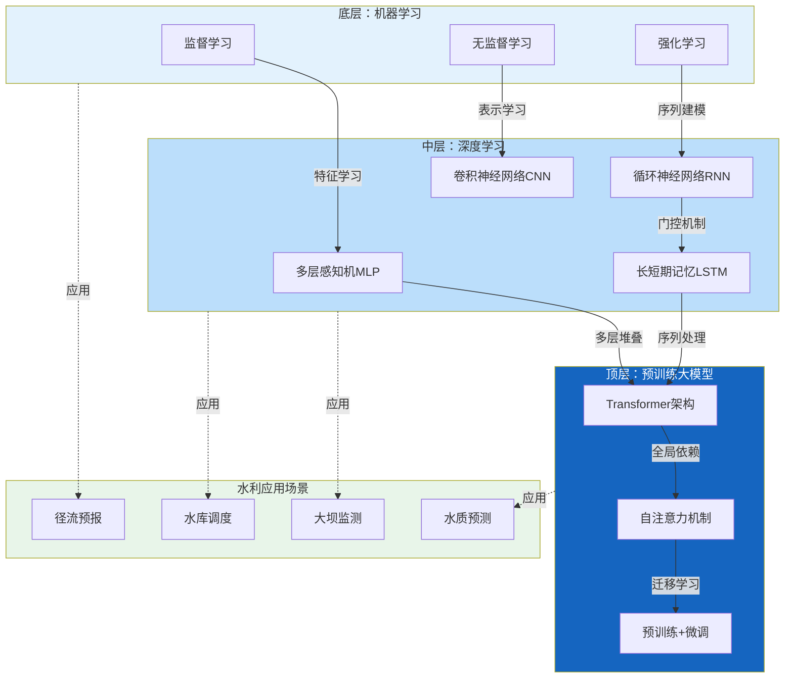

# AI全景架构图

```mermaid
flowchart TB
    subgraph L1["底层：机器学习"]
        ML1[监督学习]
        ML2[无监督学习]
        ML3[强化学习]
    end

    subgraph L2["中层：深度学习"]
        DL1[多层感知机MLP]
        DL2[卷积神经网络CNN]
        DL3[循环神经网络RNN]
        DL4[长短期记忆LSTM]
    end

    subgraph L3["顶层：预训练大模型"]
        LM1[Transformer架构]
        LM2[自注意力机制]
        LM3[预训练+微调]
    end

    subgraph APP["水利应用场景"]
        A1[径流预报]
        A2[大坝监测]
        A3[水库调度]
        A4[水质预测]
    end

    ML1 -->|特征学习| DL1
    ML2 -->|表示学习| DL2
    ML3 -->|序列建模| DL3
    DL3 -->|门控机制| DL4

    DL1 -->|多层堆叠| LM1
    DL4 -->|序列处理| LM1
    LM1 -->|全局依赖| LM2
    LM2 -->|迁移学习| LM3

    L1 -.->|应用| A1
    L2 -.->|应用| A2
    L2 -.->|应用| A3
    L3 -.->|应用| A4

    style L1 fill:#E3F2FD
    style L2 fill:#BBDEFB
    style L3 fill:#1565C0,color:#fff
    style APP fill:#E8F5E9
```

**图1-1 AI全景：从机器学习到大模型的演进路径**

*该图展示了人工智能技术的三层演进结构。底层机器学习奠定了数据驱动建模的基础，中层深度学习通过多层非线性变换实现端到端特征学习，顶层预训练大模型利用Transformer架构和自注意力机制捕获全局依赖关系。右侧标注了各层技术在水利工程中的典型应用场景。*
