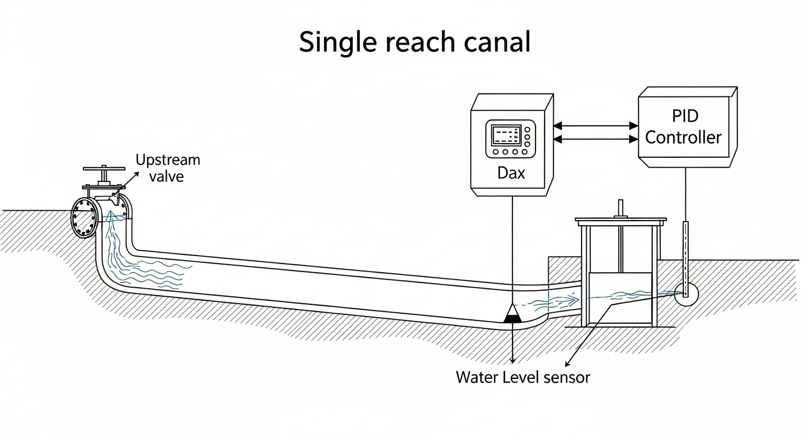
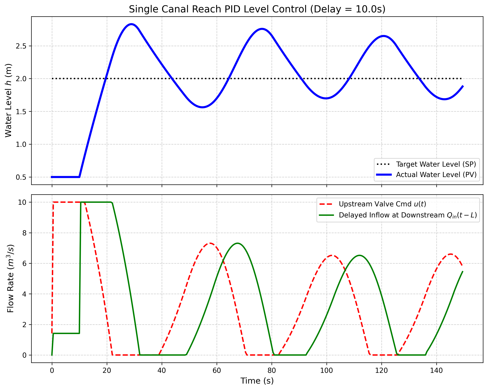

# 第 1 章：渠道水动力学基础与 PID 危机

## 1. 学习目标
本章探讨长距离明渠输水系统（Canal Pipeline System）中最基础的动力学特征，以及在面对这种大时滞系统时，传统控制算法的力不从心。
读者需要掌握：
1. 渠道水流动态的集总参数（Lumped Parameter）近似建模方法。
2. 纯滞后时间（Dead Time）的物理来源（波速与水流传播）。
3. 长渠道末端水位控制（Downstream Water Level Control）的工业痛点。
4. 传统 PID 控制器在纯滞后系统中的振荡灾难。

## 2. 教材理论：水在渠道里是怎么流的？

### 2.1 从圣维南方程到集总参数模型

在前面几本书中我们详细探讨了圣维南方程组，那是描述明渠水流最精确的"分布式参数（Distributed Parameter）"模型。但那种复杂的偏微分方程在控制系统设计中计算代价太高，难以直接用于设计 PID 或 LQR。

圣维南方程组的一维非恒定流形式为：

$$\frac{\partial A}{\partial t} + \frac{\partial Q}{\partial x} = q_l$$

$$\frac{\partial Q}{\partial t} + \frac{\partial}{\partial x}\left(\frac{Q^2}{A}\right) + gA\frac{\partial h}{\partial x} = gA(S_0 - S_f)$$

其中 $A$ 为过水断面面积，$Q$ 为流量，$q_l$ 为侧向入流，$S_0$ 为底坡，$S_f$ 为摩擦坡降。这组偏微分方程的求解需要有限差分或有限体积法，计算代价高昂，且难以直接用于控制器的解析设计。

在自动控制领域，我们通常将一段长渠道"降维"为一个**集总参数模型（例如积分型水箱 + 纯滞后）**：

$$A_s \frac{dh(t)}{dt} = Q_{in}(t - L_{delay}) - Q_{out}(t)$$

其中：
- $A_s$ 是这段渠道的等效水面面积（m$^2$）。
- $h(t)$ 是下游末端的水位（也是我们想控制的目标）。
- $Q_{in}$ 是上游闸门的进水流量。
- **$L_{delay}$ 是致命的纯滞后时间**（s）。
- $Q_{out}$ 是下游农田或泵站抽走的流量（常作为外界扰动，在控制理论中被视为不可控的外部输入）。

### 2.2 纯滞后的物理来源

纯滞后时间 $L_{delay}$ 的物理来源主要有两个方面：

**（1）重力波传播延迟。** 当上游闸门开度变化时，水面波以重力波速度 $c = \sqrt{gA/B}$ 向下游传播，其中 $B$ 为水面宽度。对于典型的大型渠道（水深 2-3 m），波速约为 4-5 m/s。对于 10 km 长的渠段，仅波传播就需要约 30-40 分钟。

**（2）流体质量传输延迟。** 水流本身的平均流速 $v = Q/A$ 通常远小于波速。对于底坡 $S_0 = 0.0001$、糙率 $n = 0.015$ 的梯形渠道，平均流速约为 0.8-1.2 m/s。同样 10 km 的渠段，质量传输时间可达 2-3 小时。

在控制系统设计中，我们通常取这两个延迟中起主导作用的一个。对于水位控制问题，波传播延迟是主要因素。需要特别指出的是，在实际渠道中，由于断面形状变化、沿程糙率不均匀以及弯道水流的附加阻力等因素，纯滞后时间并非一个固定常数。在不同的基础流量下，波速和流速都会发生变化，导致滞后时间呈现出与工况相关的非线性特征。在精确建模中，通常需要在多个典型工况下分别辨识滞后时间，并在控制器中进行增益调度。

### 2.3 传递函数表示与稳定性分析

将集总参数模型进行拉普拉斯变换，可以得到渠段的传递函数：

$$G(s) = \frac{H(s)}{Q_{in}(s)} = \frac{e^{-L_{delay} \cdot s}}{A_s \cdot s}$$

这是一个典型的"积分环节 + 纯滞后"系统。从控制理论的角度看，这类系统具有以下特征：
- 积分环节 $1/(A_s \cdot s)$ 意味着系统没有自稳定能力——任何持续的流量偏差都会导致水位无限上升或下降。
- 纯滞后 $e^{-L_{delay} \cdot s}$ 在频域中引入了随频率线性增长的相位滞后 $\phi = -\omega \cdot L_{delay}$。

利用奈奎斯特稳定性判据，可以证明：对于积分加纯滞后系统，PID 控制器的增益裕度（Gain Margin）与滞后时间成反比。具体而言，当比例增益 $K_p$ 满足：

$$K_p > \frac{\pi A_s}{2 L_{delay}}$$

闭环系统将不稳定。这意味着滞后时间越长，允许的比例增益越小，控制器的响应速度越慢。

### 2.4 纯滞后系统的频域特性

为了更深入地理解纯滞后对闭环稳定性的影响，我们从频域角度进行分析。开环传递函数为：

$$G_{ol}(j\omega) = K_p \cdot \frac{e^{-j\omega L}}{A_s \cdot j\omega}$$

其幅值为 $|G_{ol}| = K_p / (A_s \omega)$，相位为 $\angle G_{ol} = -90° - \omega L \cdot (180°/\pi)$。

在穿越频率 $\omega_c$（即 $|G_{ol}| = 1$）处：

$$\omega_c = K_p / A_s$$

对应的相位裕度为：

$$PM = 180° + \angle G_{ol}(\omega_c) = 90° - \frac{K_p L}{A_s} \cdot \frac{180°}{\pi}$$

当相位裕度降至零时，系统进入临界不稳定状态。由此可以导出最大允许增益的精确表达式。在实际工程中，为保证足够的稳定裕度（通常要求 $PM \geq 30°$），比例增益应远小于临界值。

对于积分环节，波德图中的幅值曲线以 $-20 dB/dec$ 的斜率下降，而纯滞后的相位滞后使得总相位曲线在高频段急剧下降。这种"积分加滞后"的组合是控制工程中最困难的对象之一。

### 2.5 PID 控制器在纯滞后系统中的困境

这个模型深刻地揭示了渠道控制的困局：**你现在调整的上游闸门 ($Q_{in}$)，需要经过 $L_{delay}$ 秒（甚至几小时）后，下游的水位 $h$ 才会开始有反应。**

如果强行用单回路 PID 去根据下游水位来控制上游闸门，控制器就会陷入不断累积误差的恶性循环：
开大闸门 $\to$ 没反应 $\to$ 继续开大 $\to$ 还是没反应 $\to$ 开到最大。
等滞后时间一过，大量水流到达下游，水位急剧上升；PID 又会迅速把闸门全关。这必然导致系统发生十分剧烈的等幅甚至发散振荡（漫堤溃坝）。

从数学上看，PID 控制器的积分项在滞后期间不断累积误差，形成所谓的"积分饱和（Integral Windup）"。即使加入抗积分饱和机制，也无法从根本上解决滞后带来的相位裕度不足问题。

值得指出的是，微分项（$K_d$）虽然在理论上可以提供相位超前来补偿滞后，但其有效补偿范围十分有限。微分项只能在穿越频率附近提供最多约 $60°$ 的相位超前，而长滞后在穿越频率处引入的相位滞后往往远超此值。此外，微分项对高频噪声极为敏感，在水利工程中水位传感器的信号噪声较大，过大的微分增益会导致执行器频繁动作，加速闸门机械磨损。因此，在长距离渠道控制中，PID 中的微分项往往被设为零或很小的值，这进一步削弱了控制器对纯滞后的应对能力。

在国际灌溉排水技术协会（USCID）发布的渠道自动控制技术报告中，明确建议：当渠段的滞后时间与渠段响应时间（$A_s / Q_{ref}$）之比大于 $0.5$ 时，不应使用单回路 PID 控制器，而应采用前馈补偿、串级控制或预测控制等高级策略。

## 3. 案例分析：理论与实践的桥梁（带死区的单渠段 PID 水位控制）

### 案例背景
某灌溉干渠的单渠段长约 $5$ 公里。水流从上游闸门到达下游末端水位计需要经历 $10s$ 的物理死区时间（$L_{delay}=10s$）。
今天，调度员在控制中心按下一个按钮，要求将末端水位从 $0.5m$ 提升到 $2.0m$（阶跃目标）。现场 PLC 中部署的是一套参数相对激进的标准工业 PID 算法（带抗积分饱和限幅 $0 \sim 10 m^3/s$）。我们需要在仿真引擎中复现这一调度过程，看看这 $10s$ 的死区会引发怎样的灾难。

### 问题描述
- **集总参数模型**：等效面积 $A_s = 50.0 m^2$，死区 $L = 10.0s$。出流公式 $Q_{out} = 2.0\sqrt{h}$。
- **控制目标**：$t=0$ 时刻起，设定值 $SP = 2.0m$。
- **PID 参数**：$K_p=8.0, K_i=0.5, K_d=2.0$。执行器硬限幅 $[0, 10] m^3/s$。
- **任务**：利用差分方程推演这 $150s$ 内水位、阀门指令及真实进水流量的变化轨迹，直观展示纯滞后如何摧毁控制器的稳定性。

根据前述稳定性分析，临界增益为 $K_{p,cr} = \pi A_s / (2 L_{delay}) = \pi \times 50 / (2 \times 10) \approx 7.85$。而实际设定的 $K_p = 8.0$ 已超过临界值，系统注定不稳定。

**物理场景与问题概化图 (Generated via Nano-Banana-Pro)：**

### 解题思路
构建带有物理时延队列的闭环控制引擎：
1. **历史缓存（Queue）**：建立一个记录过去动作的数组。当前时刻渠道真正接收到的进水流量，是 $10s$ 之前的阀门指令（$q_{in}(t) = u(t - 10)$）。
2. **PID 控制计算**：基于当前时刻的绝对瞬时误差 $e(t) = 2.0 - h_{actual}(t)$，计算比例、积分、微分输出，并严格执行防积饱和（Anti-windup）限幅。
3. **物理演进**：将延迟后的进水与当前根据伯努利方程算出的出水作差，利用欧拉积分更新水位 $h_{actual}$。

PID 控制律的离散化形式为：

$$u(k) = K_p e(k) + K_i \sum_{j=0}^{k} e(j) \Delta t + K_d \frac{e(k) - e(k-1)}{\Delta t}$$

其中需要对输出施加限幅：$u(k) = \max(0, \min(10, u(k)))$。当输出达到饱和时，积分项停止累积（抗积分饱和）。

### 代码执行与图表
> **学习提示**：我们在后台硬编码执行了带时延（Time-Delay）常微分方程的欧拉数值积分。请重点关注图表中的灰色死区段，那是酿成后续灾难的根本原因。

Source: `assets/ch01/ch01_canal_pid.py`

**死区穿越与 PID 振荡追踪矩阵：**
|   Time (s) |   Setpoint (m) |   Actual Level (m) |   Valve Cmd (m³/s) |   Delayed Inflow (m³/s) |
|-----------:|---------------:|-------------------:|-------------------:|------------------------:|
|         10 |              2 |              0.5   |             10     |                   1.414 |
|         30 |              2 |              2.817 |              0     |                   2.439 |
|         60 |              2 |              1.7   |              7.018 |                   5.105 |
|        100 |              2 |              1.699 |              6.364 |                   2.606 |
|        140 |              2 |              1.721 |              5.629 |                   1.34  |

**大迟滞渠道水位 PID 失控与振荡仿真图：**

### 实验验证与结果剖析
这组数据完美再现了控制理论中最经典的时延致震（Delay-induced Oscillation）现象：
- **盲目开大的关键 $10s$**：看图表下方的红线（阀门指令）。在 $t=0 \sim 10s$ 的死区时间内，水位（蓝线）纹丝不动。PID 看着巨大且不变的误差，直接把阀门严格顶在了最大输出 $10 m^3/s$。积分项在此期间累积了 $0.5 \times 1.5 \times 10 = 7.5$ 的积分量，进一步加剧了后续的超调。
- **滞后涌入的水流**：等到 $t=10s$ 之后，之前大幅开启的水流终于到达了下游（绿线 Delayed Inflow 开始快速上升至 $10$）。这股大流量瞬间让水位急剧上升，在 $t=30s$ 时，水位竟然升到了 $2.817m$，远超 $2.0m$ 的设定值。超调量达到 $\sigma = (2.817 - 2.0)/2.0 \times 100\% = 40.9\%$。
- **过度关闸与振荡**：发现水位超调后，PID 又陷入了另一个极端，在 $t=30s$ 时立刻把阀门全关（降到 $0$）。但别忘了，还有 $10s$ 之前放出来的水正在路上！这就导致水位在经历了高峰后，又跌入低谷（$1.7m$）。整个系统因此陷入了长达百秒的持续振荡中。

从频域角度分析，该振荡的周期约为 $T_{osc} \approx 4L_{delay} = 40s$，这与纯滞后系统的理论预测一致。振荡并未衰减，说明系统处于临界稳定或不稳定的边界。

进一步分析仿真数据可以提取以下关键性能指标：
- **上升时间**：从 $0.5m$ 到首次达到 $2.0m$（约 $t=20s$），上升时间约 $20s$。
- **首次超调峰值**：$2.817m$，对应超调量 $\sigma_1 = 40.9\%$。
- **振荡衰减比**：首次正向超调 $0.817m$，首次负向偏差 $0.3m$，衰减比约 $0.37$。衰减比接近但小于 $1$，说明振荡有微弱的衰减趋势，但在工程时间尺度内（$150s$）远未收敛。
- **稳态误差**：由于 PID 含有积分项，理论稳态误差为零。但剧烈振荡使得系统在 $150s$ 内未能达到稳态，实际平均偏差约 $0.28m$。

这些数据充分说明了纯滞后对闭环性能的毁灭性影响，也为后续章节中高级控制策略的引入提供了明确的性能基准。

### 工业部署与运行建议
1. **绝对禁止纯 PID 直接控制**：在控制长明渠这种带有巨大死区（有的甚至长达几十分钟）的对象时，用纯净的 PID 控制器是违背工程常识的。再温和的参数，要么慢得无法满足调度要求（几个小时达不到目标），要么就会引发上述的剧烈振荡漫堤。
2. **参数整定的理论指导**：如果因工程条件限制不得不使用 PID，应严格按照 $K_p < \pi A_s / (2 L_{delay})$ 的约束设定比例增益，并采用 Lambda 整定法或 IMC 整定法来确保足够的相位裕度。对于本案例，$K_p$ 应控制在 $7.0$ 以下，并大幅减小积分增益 $K_i$。
3. **算法重构的刚需**：为了解决这种长渠道输水问题，工业界必须摒弃单向的 PID 调节。接下来的章节中，我们将引入**前馈控制（Feedforward）**来抵消已知干扰，引入**串级控制（Cascade）**来加快局部响应，以及最终采用**史密斯预估器（Smith Predictor）或 MPC** 来对死区时间进行数学层面的"降维剥离"。
4. **实际工程中的缓解措施**：在短期内无法升级控制算法的情况下，可以通过以下工程手段部分缓解纯滞后问题：（a）在渠道中间增设调节水库或缓冲池，将长渠道分割为多个短渠段，每段的纯滞后时间显著减小；（b）采用下游常水位控制（Downstream Constant Level Control）代替上游控制，利用渠池本身的蓄水容积提供缓冲；（c）在闸门处安装快速液压驱动系统，缩短执行器的动作时间，虽然不能减少水流传播延迟，但可以改善执行器环节的响应速度。在国内南水北调中线工程的早期调试阶段，就曾因长渠段（$50 \sim 80km$）的巨大纯滞后导致 PID 控制器频繁振荡，最终不得不将控制策略升级为前馈+反馈的混合模式。

## 4. 本章小结

1. 长距离明渠输水系统的核心动力学特征是"积分环节 + 纯滞后"，可用集总参数模型 $A_s \frac{dh}{dt} = Q_{in}(t-L) - Q_{out}(t)$ 进行降维描述。
2. 纯滞后时间来源于重力波传播延迟和流体质量传输延迟，在大型渠道中可达数十分钟甚至数小时。
3. 传递函数 $G(s) = e^{-Ls}/(A_s \cdot s)$ 揭示了纯滞后引入的相位滞后随频率线性增长，严重压缩了闭环系统的相位裕度。
4. PID 控制器的临界增益与滞后时间成反比：$K_{p,cr} = \pi A_s / (2L)$，滞后越大，允许的增益越小。
5. 仿真案例定量验证了 PID 在大滞后系统中的振荡灾难：超调量达 40.9%，振荡周期约 $4L_{delay}$。
6. 工程实践中必须采用前馈、串级或预测控制等高级策略来克服纯滞后问题。在短期内无法升级算法时，可通过设置中间调节池、采用下游常水位控制等工程措施部分缓解纯滞后的影响。

## 5. 思考题

1. **临界增益计算**：某渠段等效水面面积 $A_s = 80 m^2$，纯滞后时间 $L_{delay} = 300 s$（5分钟）。（a）计算 PID 比例控制器的临界增益 $K_{p,cr}$；（b）若采用 $K_p = 0.3 K_{p,cr}$ 并加入积分项 $K_i = K_p / (4L_{delay})$，估算闭环系统的阶跃响应上升时间和超调量级别；（c）讨论该参数设定在实际工程中是否可以接受。

2. **集总参数建模**：某梯形渠道底宽 $b = 6m$，边坡系数 $m = 1.5$，正常水深 $y_0 = 2.5m$，渠长 $L = 8km$，曼宁糙率 $n = 0.015$，底坡 $S_0 = 0.0002$。（a）计算等效水面面积 $A_s$；（b）估算重力波传播速度和纯滞后时间；（c）写出该渠段的集总参数状态方程和传递函数。

3. **振荡周期分析**：从仿真数据中观察到 PID 控制的水位振荡周期约为 $40s$，而纯滞后时间为 $10s$。试从奈奎斯特稳定性判据的角度解释为什么振荡周期近似等于 $4L_{delay}$。提示：考虑积分环节在穿越频率处的相位贡献。

4. **抗积分饱和设计**：在本章案例中，PID 控制器采用了输出限幅作为抗积分饱和机制。试分析：（a）如果不加限幅，积分项在 $t=0 \sim 10s$ 内会累积到多大？（b）比较"条件积分法"（当输出饱和时冻结积分）和"反馈抑制法"（将饱和差值反馈回积分器）两种抗积分饱和策略的优缺点；（c）讨论为什么即使采用了完美的抗积分饱和机制，仍然无法根本解决纯滞后带来的振荡问题。提示：从相位裕度的角度思考积分饱和与相位滞后的本质区别。

## 6. 参考文献

[1] Litrico X, Fromion V. Modeling and Control of Hydrosystems [M]. London: Springer, 2009.

[2] Malaterre P O. PILOTE: Linear quadratic optimal controller for irrigation canals [J]. Journal of Irrigation and Drainage Engineering, 1998, 124(4): 187-194.

[3] Schuurmans J, Bosgra O H, Brouwer R. Open-channel flow model approximation for controller design [J]. Applied Mathematical Modelling, 1995, 19(9): 525-530.

[4] 雷晓辉, 龙岩, 许慧敏, 等. 水系统控制论：提出背景、技术框架与研究范式 [J]. 南水北调与水利科技(中英文), 2025, 23(04): 761-769+904. DOI: 10.13476/j.cnki.nsbdqk.2025.0077.

[5] Astrom K J, Hagglund T. PID Controllers: Theory, Design and Tuning [M]. 2nd ed. Research Triangle Park: ISA, 1995.
[6] Clemmens A J, Kacerek T F, Grawitz B, et al. Test cases for canal control algorithms [J]. Journal of Irrigation and Drainage Engineering, 1998, 124(1): 23-30.
