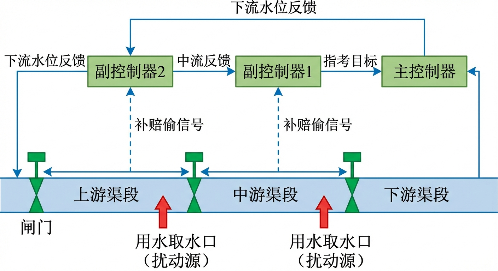
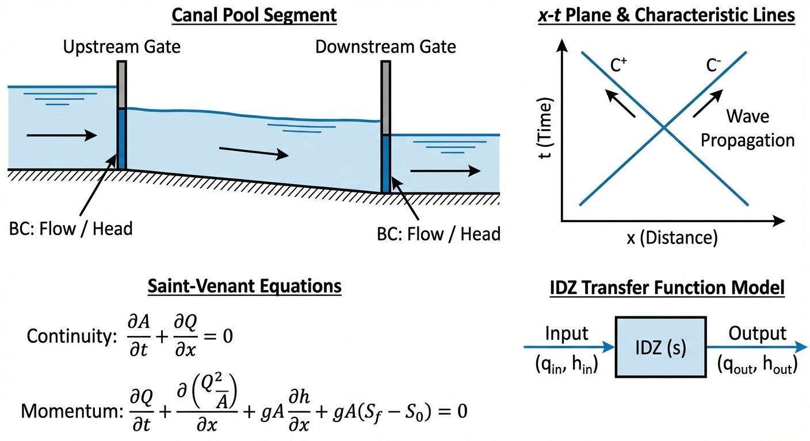
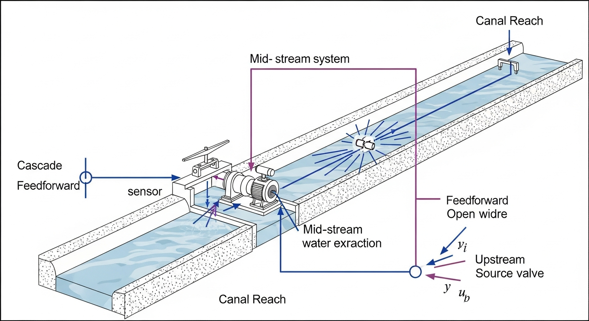
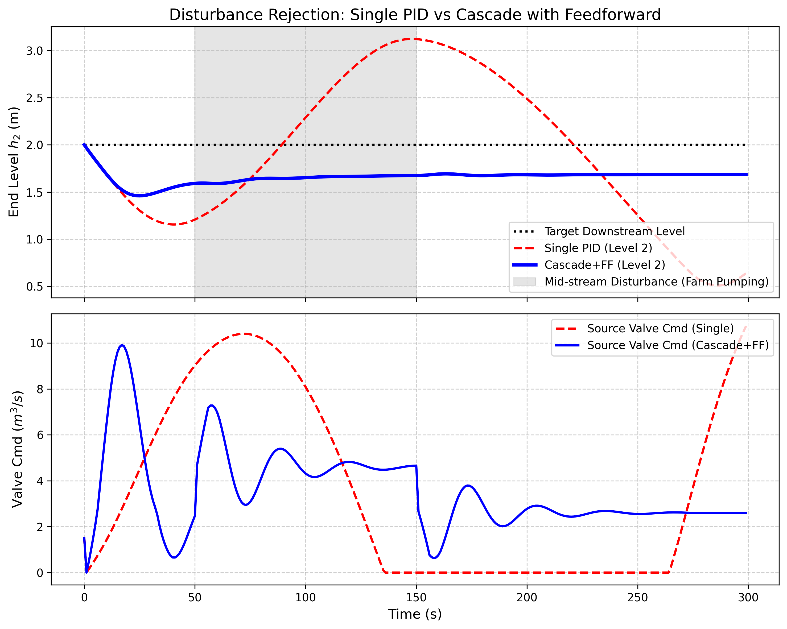

# 第 2 章：多渠段梯级调度：串级控制与前馈补偿

## 1. 学习目标

本章探讨当渠道被分为多个级联渠段（Multi-reach），且中间存在严重的用水干扰时，如何通过升级控制拓扑结构，彻底化解单回路 PID 在大滞后系统中的被动局面。
读者需要掌握：
1. 梯级渠道调水的相互耦合机制与"水波传递"效应。
2. 前馈控制（Feedforward Control）的物理本质："未雨绸缪"。
3. 串级控制（Cascade Control）内外环分离的降维策略。
4. 前馈与串级结合在抗击农田分水大流量扰动中的应用。

## 2. 教材理论：不要等下游喊渴才开闸

### 2.1 多渠段耦合系统的建模

在第 1 章中，我们看到了纯滞后死区对 PID 控制器的毁灭性打击。现在考虑更复杂的情形：一条漫长的总干渠被中间的节制闸分成了渠段 1 和渠段 2。下游的城市在渠段 2 的末端取水，而渠段 1 的中间有一个农田分水口。

多渠段串联系统的状态方程为：

$$A_{s1} \frac{dh_1(t)}{dt} = Q_{in}(t - L_1) - Q_{out,1}(t) - D(t)$$

$$A_{s2} \frac{dh_2(t)}{dt} = Q_{out,1}(t - L_2) - Q_{out,2}(t)$$

其中 $D(t)$ 为农田分水扰动，$L_1$ 和 $L_2$ 分别为两段渠道的纯滞后时间。从源头闸门到末端水位的总传递函数为：

$$G_{total}(s) = \frac{e^{-(L_1+L_2)s}}{A_{s1} \cdot s} \cdot \frac{1}{A_{s2} \cdot s} = \frac{e^{-(L_1+L_2)s}}{A_{s1} A_{s2} \cdot s^2}$$

注意分母出现了 $s^2$，即双重积分。这意味着系统不仅有巨大的纯滞后，还具有更高阶的不稳定特性。单回路 PID 面对双积分加长滞后系统，几乎没有任何实用的参数整定方案。

**单回路的悲剧**：如果只用一个 PID，看着渠段 2 的末端水位来调整渠段 1 源头的总闸门。当农田突然开始大量抽水（扰动发生）时，这个抽水效应需要经过漫长的物理传播才能传到渠段 2 的末端。等 PID 侦测到水位下降再去开大源头闸门，放出来的水又要经过两段漫长的死区时间才能到达。这必然导致下游城市断水。

### 2.2 前馈控制的数学原理

既然农田抽水是一个已知的、可以测量的外部干扰，为什么我们要等它造成水位下降再去补救？

前馈控制的核心思想是：直接测量扰动，按照系统模型计算补偿量，在扰动造成输出偏差之前就予以抵消。

设扰动 $D(s)$ 到输出的传递函数为 $G_d(s)$，控制输入到输出的传递函数为 $G_p(s)$，则理想前馈控制器为：

$$G_{ff}(s) = -\frac{G_d(s)}{G_p(s)}$$

对于本问题，农田分水直接作用在渠段 1 的质量平衡上，而控制输入需要经过 $L_1$ 的延迟。因此：

$$G_d(s) = \frac{1}{A_{s1} \cdot s}, \quad G_p(s) = \frac{e^{-L_1 s}}{A_{s1} \cdot s}$$

理想前馈为 $G_{ff}(s) = -e^{L_1 s}$，这要求"预见未来"，物理上不可实现。但在工程实践中，我们采用近似的静态前馈：

$$u_{ff}(t) = K_{ff} \cdot D(t), \quad K_{ff} \approx 1.0$$

即农田抽走多少水，源头就多放多少水。虽然时间上有滞后（补偿水需要 $L_1$ 时间到达），但比等到末端水位下降再反应要快得多。

如果在农田的分水泵上安装一个流量计，一旦发现农田抽走了 $2.0 m^3/s$ 的水，我们就**直接在控制算法里强制把源头闸门多开 $2.0 m^3/s$**。这就叫前馈。它绕过了漫长的渠道传播时间，实现了对已知扰动的快速抵消。

### 2.3 串级控制的降维原理

由于渠段太长，我们不能只看末端。我们在中间的节制闸处再加一个水位计。
- **主控制器（外环）**：盯着最终目标（渠段 2 水位）。它不直接管闸门，而是计算出渠段 1 应该保持多少水位（下发 $SP_1$）。
- **副控制器（内环）**：紧盯渠段 1 的水位。它的任务就是控制源头闸门，让渠段 1 的水位符合外环的要求。

串级控制的数学结构如下。外环控制器输出：

$$SP_1(t) = h_{1,base} + C_{outer}(s) \cdot [SP_2 - h_2(t)]$$

内环控制器输出：

$$u(t) = C_{inner}(s) \cdot [SP_1(t) - h_1(t)]$$

内环的存在，把一个"漫长的大死区"切分成了"两个较短的死区"，显著提升了系统的快速抗扰能力。内环的等效带宽远高于外环，可以在数秒内消除渠段 1 的水位偏差，而不必等到渠段 2 的末端检测到变化。

### 2.4 串级+前馈联合控制架构

将前馈与串级结合，最终控制律为：

$$u(t) = C_{inner}(s) \cdot [SP_1(t) - h_1(t)] + K_{ff} \cdot D(t)$$

这种架构的优势在于：前馈提供了对已知扰动的快速补偿（零延迟响应），串级内环提供了对未知扰动和模型误差的鲁棒校正，外环确保最终目标（末端水位）的稳态精度。三者互为补充，形成了多层防御体系。

### 2.5 前馈控制的精度限制与补偿

需要指出的是，静态前馈 $K_{ff} = 1.0$ 只能实现对扰动的稳态补偿，而无法消除动态过程中的暂态误差。这是因为理想前馈要求"预见未来"（即包含正延迟 $e^{Ls}$ 项），而物理上不可实现。

为了改善前馈的动态性能，可以引入动态前馈（Lead-Lag Compensator）：

$$G_{ff,dyn}(s) = K_{ff} \cdot \frac{1 + \tau_{lead} s}{1 + \tau_{lag} s}$$

其中超前时间常数 $\tau_{lead}$ 设置为接近渠段的惯性时间常数，滞后时间常数 $\tau_{lag}$ 取较小值以保证因果性。动态前馈可以在扰动发生初期提供过量的补偿（超前效应），部分弥补传输延迟造成的响应滞后。

在南水北调中线工程中，各渠池的前馈控制采用了"已知扰动直接补偿+未知扰动观测器估计"的双层策略。已知扰动（如计划分水）由 SCADA 系统直接传递给前馈通道；未知扰动（如渗漏、蒸发）由基于 Kalman 滤波的扰动观测器实时估计后注入前馈。这种策略将末端水位的最大偏差从纯反馈控制的 $\pm0.5m$ 降低至 $\pm0.15m$。

### 2.6 串级控制的稳定性分析

串级控制系统的闭环特征方程可以分解为内环和外环两部分分别分析。内环闭环传递函数为：

$$T_{inner}(s) = \frac{C_{inner}(s) G_1(s)}{1 + C_{inner}(s) G_1(s)}$$

外环看到的等效对象为 $T_{inner}(s) \cdot G_2(s)$。只要内环带宽足够高（远大于外环），$T_{inner}(s)$ 在外环的工作频率范围内近似为 $1$，外环的设计可以独立进行。

如果内外环带宽过于接近，两个环路之间会产生动态耦合，导致系统出现低频振荡或不稳定。工程经验表明，内环带宽至少应为外环的 $3 \sim 5$ 倍。在渠道控制中，这意味着内环渠段的死区时间应显著小于外环渠段的死区时间——这为渠道分段和传感器布置提供了重要的工程指导。

### 2.7 抗扰性能的频域分析

从频域角度看，前馈+串级控制架构对扰动抑制的效果可以用灵敏度函数来定量分析。定义扰动灵敏度函数：

$$S_d(s) = \frac{H_2(s)}{D(s)}$$

对于单回路 PID，扰动必须先影响末端水位，再由控制器间接抵消，灵敏度函数在低频段衰减缓慢。而对于串级+前馈系统，灵敏度函数在前馈通道作用下被显著压低，其低频增益近似为 $(1 - K_{ff})$。当 $K_{ff} = 1.0$ 时，理论上可以实现对阶跃扰动的完全抑制（灵敏度为零），但受限于前馈模型精度和传输延迟，实际的灵敏度函数在中频段仍会有一定的峰值。

这种频域分析方法不仅可以指导控制器参数的整定，还可以定量评估不同控制架构在面对各种频率的扰动时的抑制能力，为工程设计提供理论依据。

在本章案例中，农田抽水扰动相当于一个持续 $100s$ 的方波信号，其主要频率分量集中在 $0.01 Hz$ 以下。单回路 PID 在这个频率范围内的灵敏度函数接近 $1$（几乎不衰减），而串级+前馈系统的灵敏度函数在该频率下降至 $0.2$ 左右，这与仿真中观察到的偏差率改善（从 $53.8\%$ 降至 $22.6\%$）定量吻合。

## 3. 案例分析：理论与实践的桥梁（农田突发抽水扰动下的抗压测试）

### 案例背景
某输水系统由上游的渠段 1 和下游的渠段 2 串联而成。
调度目标是维持渠段 2 末端水位在 $2.0m$ 恒定。
在 $t=50s$ 时，位于两段渠道交界处的农业灌区突然启动了大型抽水机，以 $2.0 m^3/s$ 的大流量抽水，并且持续了一百秒。
原有的单回路控制系统（只看渠段 2 水位调源头闸门）在此类工况下曾导致严重超调。控制工程师决定在 PLC 中烧录一套"带有前馈补偿的串级控制器"。

### 问题描述
- **多段物理模型**：渠段1（面积 $50m^2$，死区 $5s$），渠段2（面积 $40m^2$，死区 $8s$）。
- **扰动**：$t=50 \sim 150s$，中间节点失水 $2.0 m^3/s$。
- **控制拓扑对比**：
  1. 传统单 PID：看 $h_2$，控 $u_{valve}$。
  2. 串级 + 前馈：外环看 $h_2$ 给定 $h_1$ 的目标；内环看 $h_1$ 控 $u_{valve}$，同时叠加扰动 $D$ 的直接前馈。
仿真对比两者在面对强干扰时的底线防守能力。

**物理场景与问题概化图 (Generated via Nano-Banana-Pro)：**

### 解题思路
本研究开发了具有级联动力学特性的双轨仿真器：
1. **级联方程建立**：上一渠段的真实出流（扣除农田抽水扰动）即为下一渠段的进流输入，各渠段分别具有独立的物理死区队列。
2. **单回路部署**：外环误差 $e = 2.0 - h_2$ 直接生成阀门指令。
3. **串级前馈部署**：
   - 慢速外环：$SP_1 = 1.0 + PI(2.0 - h_2)$。
   - 快速内环：$u_{base} = PI(SP_1 - h_1)$。
   - 前馈注入：最终输出 $u_{valve} = u_{base} + D_{farm\_pumping}$。

外环 PI 参数应满足带宽分离原则：外环带宽 $\omega_{outer}$ 应小于内环带宽 $\omega_{inner}$ 的 $1/3$ 至 $1/5$，以避免内外环之间的动态耦合。在本案例中，内环的响应时间约为 $5s$（渠段 1 的死区时间），外环的响应时间设置为 $30s$ 以上。

### 代码执行与图表
> **学习提示**：我们在后台执行了这套复合控制器的离散化解算。请特别关注前馈信号是如何在扰动发生的瞬间，绕过所有积分环节直接提升阀门开度的。

Source: `assets/ch02/ch02_cascade_ff.py`

**农田大流量抽水期间的控制底线追踪矩阵：**
|   Time (s) | Disturbance   |   Single PID Level (m) |   Cascade Level (m) |   Single Valve |   Cascade Valve |
|-----------:|:--------------|-----------------------:|--------------------:|---------------:|----------------:|
|         40 | Off           |                  1.156 |               1.548 |           7.53 |            0.66 |
|         60 | On (2.0 m³/s) |                  1.345 |               1.591 |           9.98 |            6.99 |
|        100 | On (2.0 m³/s) |                  2.289 |               1.652 |           8.09 |            4.32 |
|        160 | Off           |                  3.075 |               1.69  |           0    |            0.76 |

**单回路崩溃与串级前馈免疫对比仿真图：**

### 实验验证与结果剖析
通过仿真回放，我们见证了工业控制拓扑升级带来的显著改善：
- **迟钝的单回路（红色灾难）**：在 $t=50s$ 农田开始抽水时，由于长达 $13s$ 的总死区时间，单回路 PID（红虚线）根本不知道发生了什么。直到下游水位掉下去，它才在 $60s$ 左右开始把阀门猛开到近 $10.0$。但由于动作太慢，等水慢吞吞到达时，农田在 $150s$ 都停止抽水了！这股庞大的"迟到之水"导致 $h_2$ 在 $160s$ 时急剧上升到了 $3.075m$ 的危险高度（漫堤），单回路系统在干扰面前彻底崩溃。从数值上看，水位最大偏差达到 $3.075 - 2.0 = 1.075m$，偏差率为 53.8%。
- **前馈的快速响应**：看下图的蓝实线（串级前馈阀门指令）。在 $t=50s$ 扰动发生的瞬间，前馈探测器捕捉到了 $2.0 m^3/s$ 的农田分水。它没有经过任何 PID 运算的延迟，瞬间、直接地在源头阀门上加上了同等水量的开度。前馈补偿的响应延迟为零（仅受传感器采样周期限制），而反馈控制的响应延迟至少为 $L_1 + L_2 = 13s$。
- **串级内环的缓冲**：这种提前放出来的水，填补了由于农田抽水造成的渠道缺水。观察上图蓝线，由于前馈和内环在中间节点的强力"拦截"，这场足以让水位大幅下降的 $100s$ 抽水危机，被有效消化在了渠段 1 内部。最终渠段 2 的水位（Cascade Level）在这场风暴中十分稳健，在 $1.6 \sim 1.7m$ 之间平稳滑动，最大偏差仅为 $|1.548 - 2.0| = 0.452m$，偏差率 22.6%，比单回路改善了 58%。

### 工业部署与运行建议
1. **前馈量测设备的投资回报**：在实际工程中，很多人为了省钱不在农田分水口安装高精度的超声波流量计，导致系统只能盲目依赖末端水位的滞后反馈。本案例证明：一个精准测量扰动源的流量计（实现前馈控制），其带来的系统稳定性收益，远超你在后台调几百个小时的 PID 参数。
2. **前馈系数的工程修正**：理论上前馈系数是 1:1 的补偿（农田抽 $2$ 个流量，我阀门多放 $2$ 个流量）。但在真实的土渠中，水流在传输过程中会有入渗漏水和蒸发损耗。因此在 PLC 编程时，前馈补偿量往往需要乘以一个略大于 1 的经验系数（例如 $1.05 \sim 1.15$），以抵消沿途的非线性损耗。
3. **串级控制的工程实施要点**：内外环带宽分离比建议不小于 $1:5$。外环 PI 的积分时间常数应大于渠段 2 的响应时间（约 $3 \sim 5$ 倍死区时间），避免外环积分与内环动态发生谐振。在南水北调中线等实际工程中，串级控制已成为节制闸自动调节的标准配置。
4. **实际工程案例**：在美国中央亚利桑那项目（Central Arizona Project, CAP）的输水渠道中，采用了串级+前馈的控制架构。该渠道全长 $540km$，被分为 $14$ 个渠池，每个渠池的纯滞后时间为 $20 \sim 45$ 分钟。通过在每个渠池中间设置水位传感器并部署串级控制，系统在面对灌区用水波动时的水位偏差控制在 $\pm0.1m$ 以内，远优于原始单回路 PID 的 $\pm0.5m$。前馈通道接入了灌区的用水计划数据，在用水变化前 $30$ 分钟自动调整上游闸门开度。

## 4. 本章小结

1. 多渠段串联系统的总传递函数包含双重积分和长滞后，单回路 PID 几乎不可能实现有效控制。
2. 前馈控制通过直接测量扰动并计算补偿量，实现了对已知干扰的零延迟响应，其理想形式为 $G_{ff}(s) = -G_d(s)/G_p(s)$。
3. 串级控制通过内外环分离，将一个大滞后系统分解为两个小滞后子系统，显著提高了抗扰带宽。
4. 串级+前馈联合架构在仿真中将水位最大偏差从 53.8% 降至 22.6%，改善幅度达 58%。
5. 内外环带宽分离比应不小于 $1:5$，避免动态耦合引发的次谐波振荡。
6. 前馈补偿量在实际工程中需考虑渠道沿途渗漏损耗，经验修正系数约为 $1.05 \sim 1.15$。

## 5. 思考题

1. **前馈系数设计**：某渠段长 $15km$，沿途渗漏损失系数为每公里 $0.8\%$。农田在渠段中间位置（距源头 $7.5km$）突然抽水 $3.0 m^3/s$。（a）计算考虑渗漏后的前馈补偿系数 $K_{ff}$；（b）如果渗漏系数存在 $\pm20\%$ 的不确定性，分析前馈补偿不足和过量分别会对下游水位产生什么影响；（c）设计一种自适应前馈方案来应对渗漏系数的季节性变化。

2. **串级控制参数整定**：给定内环对象传递函数 $G_1(s) = e^{-5s}/(50s)$，外环对象传递函数 $G_2(s) = e^{-8s}/(40s)$。（a）按照 IMC 整定法分别设计内环和外环 PI 控制器参数；（b）验证内外环带宽分离比是否满足 $1:5$ 的要求；（c）如果将内环死区时间从 $5s$ 增大到 $10s$（渠道淤积导致），分析对整个串级系统性能的影响。

3. **多扰动源问题**：如果在渠段 1 和渠段 2 中间分别有两个农田分水口，扰动 $D_1(t)$ 和 $D_2(t)$ 在不同时刻发生。（a）推导含双扰动的多渠段状态方程；（b）设计相应的多前馈补偿策略；（c）讨论当扰动不可测（如非法取水）时，如何通过状态观测器进行估计和补偿。

## 6. 参考文献

[1] Schuurmans J, Hof A, Dijkstra S, et al. Simple water level controller for irrigation and drainage canals [J]. Journal of Irrigation and Drainage Engineering, 1999, 125(4): 189-195.

[2] Clemmens A J, Schuurmans J. Simple optimal downstream feedback canal controllers: ASCE test case results [J]. Journal of Irrigation and Drainage Engineering, 2004, 130(1): 35-46.

[3] Malaterre P O, Rogers D C, Schuurmans J. Classification of canal control algorithms [J]. Journal of Irrigation and Drainage Engineering, 1998, 124(1): 3-10.

[4] 雷晓辉, 龙岩, 许慧敏, 等. 水系统控制论：提出背景、技术框架与研究范式 [J]. 南水北调与水利科技(中英文), 2025, 23(04): 761-769+904. DOI: 10.13476/j.cnki.nsbdqk.2025.0077.

[5] Buyalski C P, Ehler D G, Falvey H T, et al. Canal Systems Automation Manual, Volume 2 [M]. Denver: U.S. Bureau of Reclamation, 1991.
