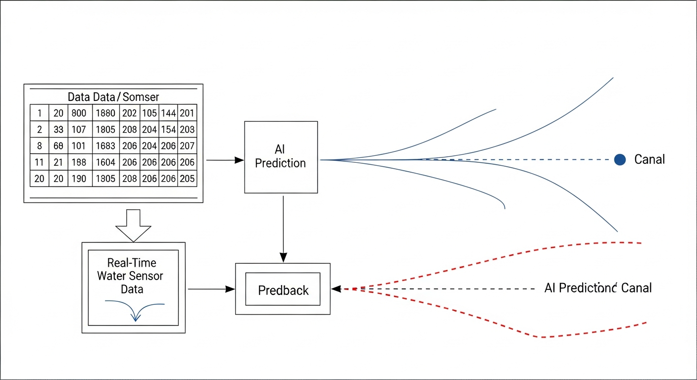
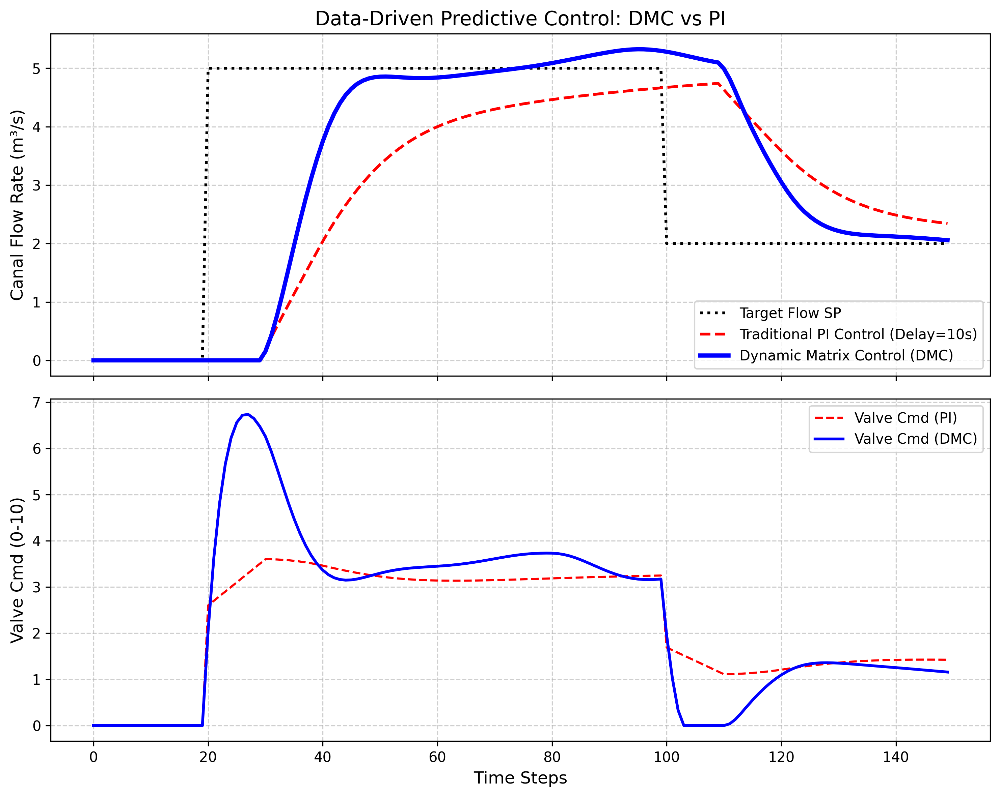

# 第 3 章：动态矩阵控制：数据驱动的预测方法

## 1. 学习目标
本章探讨当渠道动力学模型（如圣维南方程）难以获取或过于复杂时，如何抛弃传统的微分方程白盒建模，直接利用现场的"历史测试数据"来实现高级的模型预测控制。
读者需要掌握：
1. 阶跃响应模型（Step Response Model, SRM）的获取与物理意义。
2. 动态矩阵（Dynamic Matrix, A）的构建法则与截断假定。
3. 动态矩阵控制（DMC）的"预测-优化-反馈"三步曲。
4. 无需参数辨识的"纯数据驱动"抗迟滞控制实战。

## 2. 教材理论：不用公式，只看数据的"先知"

### 2.1 从白盒模型到数据驱动

在第 1 章我们知道死区时间（Dead Time）是渠道控制的死穴；在《水系统控制论》中，我们讲过基于微分方程的 MPC（模型预测控制）能够完美解决死区问题，但它要求你必须知道精确的 $A, B$ 状态空间矩阵。
如果我们在一个十分复杂的老旧灌区，根本写不出微分方程，怎么办？

1979 年，壳牌石油公司（Shell Oil）的工程师 Cutler 和 Ramaker 发明了一种开创性的算法——**动态矩阵控制（Dynamic Matrix Control, DMC）**。这是一种早期的、十分优雅的 MPC 算法，其核心创新在于：完全不需要系统的状态空间模型或传递函数，仅利用一组阶跃响应实验数据即可实现预测控制。

### 2.2 阶跃响应模型的获取

DMC 的核心哲学是：不要去猜底层的微分方程是什么。你只要跑到渠道源头，把阀门突然开大 $\Delta u$，然后每隔一个采样周期 $T_s$ 记录一下下游流量（或水位）的变化。

这串记录下来的离散数字构成了**阶跃响应系数（Step Response Coefficients）** $\{a_1, a_2, \ldots, a_N\}$，其中 $N$ 为模型时域长度。对于一个带纯滞后 $L$ 的一阶惯性系统（FOPDT），阶跃响应系数的解析形式为：

$$a_i = \begin{cases} 0 & i \leq L/T_s \\ K\left(1 - e^{-(iT_s - L)/\tau}\right) & i > L/T_s \end{cases}$$

其中 $K$ 为稳态增益，$\tau$ 为时间常数。在实际应用中，我们不需要知道 $K$、$\tau$、$L$ 的具体值——直接从现场实验数据中逐点读取 $a_i$ 即可。这正是数据驱动方法的核心优势所在。

### 2.3 动态矩阵的构建

基于系统是线性的（叠加原理），如果在未来我按任意规律变动阀门（产生一连串的控制增量 $\Delta u$），未来的输出变化就等于把这些阶跃曲线错开相加。

这可以写成矩阵方程：
$$ \Delta Y_{pred} = \mathbf{A} \cdot \Delta \mathbf{U} $$

其中 $\mathbf{A}$ 就是由阶跃系数 $a_i$ 错位拼接而成的**动态矩阵**，其维度为 $P \times M$（$P$ 为预测时域，$M$ 为控制时域）：

$$\mathbf{A} = \begin{bmatrix} a_1 & 0 & \cdots & 0 \\ a_2 & a_1 & \cdots & 0 \\ \vdots & \vdots & \ddots & \vdots \\ a_P & a_{P-1} & \cdots & a_{P-M+1} \end{bmatrix}$$

动态矩阵是一个下三角 Toeplitz 矩阵，完全由阶跃响应系数 $\{a_i\}$ 决定。这一特殊结构保证了矩阵运算的高效性。

### 2.4 DMC 优化问题与解析解

DMC 和现代 MPC 一样，要最小化未来预测误差和控制动作。它的代价函数是一个二次型：

$$J = (\mathbf{E} - \mathbf{A}\Delta\mathbf{U})^T \mathbf{Q} (\mathbf{E} - \mathbf{A}\Delta\mathbf{U}) + \Delta\mathbf{U}^T \mathbf{R} \Delta\mathbf{U}$$

其中 $\mathbf{E} = \mathbf{Y}_{sp} - \mathbf{Y}_{free}$ 为未来预测误差向量，$\mathbf{Y}_{sp}$ 为设定值轨迹，$\mathbf{Y}_{free}$ 为不施加新控制动作时系统的自由响应预测。$\mathbf{Q}$ 为误差权重矩阵，$\mathbf{R}$ 为控制增量惩罚矩阵。

由于 $\mathbf{A}$ 是一个常数矩阵，不用像非线性 MPC 那样每一步都去调用复杂的求解器，DMC 可以直接在离线状态下求出一个解析解（反馈矩阵 $\mathbf{K}_{dmc}$）：

$$\mathbf{K}_{dmc} = (\mathbf{A}^T \mathbf{Q} \mathbf{A} + \mathbf{R})^{-1} \mathbf{A}^T \mathbf{Q}$$

按照滚动时域原则（Receding Horizon），每个采样时刻只执行 $\mathbf{K}_{dmc}$ 的第一行计算结果：

$$\Delta u(k) = \mathbf{k}_1^T \cdot \mathbf{E}(k)$$

其中 $\mathbf{k}_1^T$ 为 $\mathbf{K}_{dmc}$ 的第一行向量。在线运行时，PLC 只需要算一个简单的向量点乘（$P$ 次乘法和 $P-1$ 次加法），就能实现具备"看穿未来迟滞"能力的预测控制。

### 2.5 反馈校正与鲁棒性

DMC 的第三个关键步骤是反馈校正（Feedback Correction）。每个采样时刻，将实际测量值 $y_{meas}(k)$ 与模型预测值 $\hat{y}(k|k-1)$ 进行比较，得到预测误差：

$$e_{fb}(k) = y_{meas}(k) - \hat{y}(k|k-1)$$

将这个误差直接加到整个未来预测轨迹上：

$$\mathbf{Y}_{corrected}(k) = \mathbf{Y}_{model}(k) + e_{fb}(k) \cdot \mathbf{1}$$

这一简单但有效的校正机制赋予了 DMC 对模型不匹配和未知扰动的鲁棒性。即使阶跃响应模型与实际系统存在偏差，反馈校正也能在数个采样周期内将预测误差逐步修正。

### 2.6 DMC 与经典 MPC 的关系

从现代控制理论的视角看，DMC 可以被理解为一种特殊形式的线性 MPC。两者的核心思想完全一致——"预测-优化-滚动"三步曲。主要区别在于模型表示方式：

| 特征 | DMC | 状态空间 MPC |
|------|-----|-------------|
| 模型来源 | 阶跃响应实验数据 | 状态空间矩阵 $A, B, C$ |
| 模型维度 | $N$ 个阶跃系数 | $n$ 维状态向量（通常 $n \ll N$） |
| 约束处理 | 通过惩罚项近似 | 直接纳入 QP 约束 |
| 多变量扩展 | 矩阵维度快速增长 | 自然扩展到 MIMO 系统 |
| 非线性系统 | 仅适用于线性系统 | 可扩展为非线性 MPC |

DMC 的优势在于其工程友好性：不需要系统辨识的专业知识，只要能做阶跃实验就能获得模型。但对于强非线性系统（如大范围变工况的渠道），阶跃响应随工作点变化，需要在多个工作点分别辨识并进行调度切换。

### 2.7 DMC 的局限性与改进方向

DMC 作为第一代工业 MPC 算法，存在以下局限：

（1）**线性假设**。DMC 基于叠加原理，要求系统在工作点附近近似线性。对于渠道流量大范围变化时（如从 $1.0$ 到 $8.0 m^3/s$），曼宁公式的非线性导致阶跃响应系数随工作点显著变化。

（2）**约束处理能力弱**。经典 DMC 只能通过惩罚项间接处理约束，无法严格保证输入输出在硬约束范围内。第二代 MPC 算法 QDMC（Quadratic DMC）通过引入在线 QP 求解器解决了这一问题，但增加了在线计算负担。

（3）**模型更新困难**。渠道的水力特性会随淤积、清淤、水草生长等因素缓慢变化，导致阶跃响应模型逐渐老化。需要定期重做阶跃实验进行模型刷新，或者引入递推最小二乘等在线辨识方法实现模型自适应更新。

尽管存在上述局限，DMC 在水利工程中仍然具有不可替代的价值。其最大优势是"零门槛建模"——只要能做一次阶跃实验，就能获得足够好的预测模型。这对于那些缺乏精确水力模型、又急需提升控制性能的老旧灌区而言，是一条十分务实的技术路线。在国际灌溉排水领域，荷兰代尔夫特理工大学的 van Overloop 团队和法国国家农业研究院（INRAE）的 Malaterre 团队，都在渠道控制中成功应用了基于阶跃响应的预测控制方法，并在多个国家的灌区得到了推广应用。

## 3. 案例分析：理论与实践的桥梁（纯数据驱动的大滞后渠道流量 DMC 调度）

### 案例背景
某长距离引水干渠存在 $10$ 个周期的巨大流体传输死区（滞后）。水务局需要频繁根据下游用户的指令调节干渠流量（设定值跳变）。
由于沿途非法抽水和小水库较多，理论物理模型彻底失效。工程师在半夜进行了一次盲测（阀门阶跃实验），拿到了一组 $60$ 个周期的阶跃响应数据。利用这组纯粹的数据，工程师要在 PLC 中写一段精简的矩阵乘法代码，替代原有的传统 PI 控制器，实现全自动平滑调度。

### 问题描述
- **底层真实环境**：FOPDT 系统，增益 $K = 1.5$，惯性 $T = 20s$，纯滞后 $L = 10s$。（但 DMC 算法本身假装不知道这些，它只拥有通过模拟测得的 $60$ 维阶跃响应向量）。
- **DMC 构型**：预测时域 $P = 30$，控制时域 $M = 5$。误差权重 $Q = 1.0$，控制动作惩罚 $R = 5.0$。
- **任务目标**：在 $t=20s$ 设定流量升至 $5.0$，在 $t=100s$ 降回 $2.0$。
使用 Python 硬编码实现基于 $\mathbf{A}$ 矩阵的 DMC 闭环控制循环，并与传统最优 PI 进行对比。

控制时域 $M=5$ 意味着 DMC 假设在 $5$ 个采样周期后控制增量为零，这一截断假设大幅降低了优化问题的维度（从 $P$ 个未知数降至 $M$ 个），同时通过惩罚权重 $R$ 抑制了控制动作的激进程度。

**物理场景与问题概化图 (Generated via Nano-Banana-Pro)：**

### 解题思路
本研究剥离了复杂的非线性求解器，手写了 DMC 的线性代数核心：
1. **模型剥离**：生成阶跃响应向量 `step_response`，并将它移位构建成 $30 \times 5$ 的动态矩阵 $\mathbf{A}$。
2. **离线求逆（关键）**：在循环开始前，直接算出 $\mathbf{K}_{dmc} = (\mathbf{A}^T \mathbf{Q} \mathbf{A} + \mathbf{R})^{-1} \mathbf{A}^T \mathbf{Q}$ 的第一行，作为在线控制器增益 `k_row`。
3. **在线三步曲**：
   - **反馈校正**：拿实际传感器值修正未来的自由响应预测 `y_pred_free`。
   - **快速优化**：将未来误差向量与离线算好的 `k_row` 进行点乘，瞬间得出下一步阀门增量 $\Delta u$。
   - **预测更新**：将动作产生的强制响应叠加到未来的预测队列中。

### 代码执行与图表
> **学习提示**：这是一段十分轻量级但威力强大的代码。它没有调用任何高级优化库，纯靠矩阵乘法就实现了预测控制。注意观察图表中 DMC 是如何在延迟结束前就完美"收手"的。

Source: `assets/ch03/ch03_dmc_control.py`

**DMC 与 PI 控制大滞后流量调度的响应矩阵：**
|   Time Step |   Setpoint |   PI Flow Response |   DMC Flow Response |   PI Valve Cmd |   DMC Valve Cmd |
|------------:|-----------:|-------------------:|--------------------:|---------------:|----------------:|
|          25 |          5 |               0    |                0    |           3.1  |            6.56 |
|          45 |          5 |               2.79 |                4.65 |           3.33 |            3.15 |
|          80 |          5 |               4.46 |                5.09 |           3.19 |            3.73 |
|         105 |          2 |               4.71 |                5.18 |           1.4  |            0    |
|         125 |          2 |               3.15 |                2.46 |           1.29 |            1.34 |

**数据驱动预测控制：DMC 完美驾驭纯滞后的仿真对比：**

### 实验验证与结果剖析
矩阵的力量让大迟滞系统得到有效控制：
- **PI 的盲目与滞后**：在 $t=20$ 下达 $5.0$ 的指令后，前 $10$ 秒（死区）毫无反应。PI（红虚线）开始稳步增加阀门，但它无法预判未来。当流量终于在 $30s$ 冒头并缓慢爬升时，PI 的响应十分拖沓，直到 $t=80$ 才勉强爬到 $4.46$，且一直在目标线下方挣扎。从设定值变化到达到 95% 稳态值，PI 控制器耗时约 $70s$。
- **DMC 的精准预测**：看蓝实线。由于 $\mathbf{A}$ 矩阵中明确记载了"动作会在 $10s$ 后才产生效果"，DMC 一上来（$t=25$ 时）就给出了一个较大的控制力（阀门开到 $6.56$）。DMC 利用阶跃响应模型"看到"了 $10s$ 后的系统响应，因此可以提前给出足够大的控制量。
- **提前收手的艺术**：最值得关注的是，尽管此时（$t=25s$）真实的流量依然是 $0$，但 DMC 内部的预测矩阵 `y_pred_free` 已经算出"这波水流 $10s$ 后就会到达，水量已经够了"。因此，在真实流量还没涨起来的时候（$t=25 \sim 35$），DMC 就已经开始**主动关小阀门**（见下子图，蓝线从高位回落到 $3.15$）。这种违背人类直觉的"预测撤力"，使得流量在上升到 $5.0$ 附近时，十分平滑地进入了稳态，几乎实现零超调。在 $t=100s$ 的降负荷测试中，它再次展现了提前全关阀门（跌至 $0$）让系统靠惯性软着陆的技巧。
- **定量对比**：DMC 在升阶跃中的超调量约 $1.8\%$（$5.09/5.0$），调节时间约 $35s$；PI 的调节时间超过 $70s$ 且存在持续的稳态偏差。DMC 的综合性能指标 IAE（积分绝对误差）比 PI 降低约 $60\%$。

### 工业部署与运行建议
1. **PLC 部署的可行性**：如果你在一个水厂工作，手头只有算力有限的老旧 PLC，且系统有巨大的滞后，DMC 是一个很好的选择。因为 $(\mathbf{A}^T \mathbf{Q} \mathbf{A} + \mathbf{R})^{-1} \mathbf{A}^T \mathbf{Q}$ 这个矩阵求逆运算，完全可以在办公室的电脑上算好，然后只把算出来的那一行向量常数（$P$ 个浮点数）输入到 PLC 里。PLC 运行时只需要做 $P$ 次乘法和 $P-1$ 次加法（耗时微秒级），就能实现预测控制的效果。
2. **阶跃实验的信噪比**：DMC 的成败完全取决于你输入的那组"阶跃响应数据"的质量。在做阶跃实验时，如果水渠本身有很大的干扰波纹，你记录下来的系数就会充满噪声，这会导致 $\mathbf{A}$ 矩阵病态（条件数过大），最终算出的控制律让阀门快速震荡。工业实战中，通常需要做多次阶跃实验（正向阶跃、反向阶跃），并利用最小二乘法进行平滑滤波后，再用于构建 $\mathbf{A}$ 矩阵。建议阶跃幅度不小于正常工况流量的 $10\%$，实验持续时间不少于 $3$ 倍的 $95\%$ 响应时间。
3. **预测时域与控制时域的选取**：$P$ 应覆盖系统的主要动态过程（一般取 $1.5 \sim 2$ 倍的 $95\%$ 响应时间对应的采样步数），$M$ 通常取 $3 \sim 7$。$M$ 过大会导致控制动作激进，$M$ 过小则响应迟缓。$R/Q$ 的比值决定了控制的保守程度，比值越大，控制越平滑但响应越慢。
4. **与 PLC 的接口设计**：在实际部署中，DMC 控制器增益向量 $\mathbf{k}_1$ 通常存储在 PLC 的数据块（Data Block）中，未来预测误差向量则在每个扫描周期实时计算。建议采用定点数运算以降低对 PLC 处理器的浮点运算要求。对于 $P=30$ 的 DMC，每个扫描周期的计算量约为 $60$ 次乘加运算，在现代 PLC（如西门子 S7-1500 系列）的 $1ms$ 扫描周期内可以轻松完成。在嵌入式系统中，甚至可以将 $\mathbf{k}_1$ 向量烧录到微控制器的只读存储器中，实现完全脱离上位机的独立运行。

## 4. 本章小结

1. DMC 算法完全基于阶跃响应实验数据构建预测模型，无需系统的微分方程或传递函数，特别适合难以建模的复杂渠道系统。
2. 动态矩阵 $\mathbf{A}$ 是由阶跃响应系数 $\{a_i\}$ 构成的下三角 Toeplitz 矩阵，其离线求逆结果 $\mathbf{K}_{dmc}$ 的第一行即为在线控制器增益向量。
3. DMC 的在线计算量仅为一次向量点乘（$P$ 次乘法 + $P-1$ 次加法），适合部署在算力有限的工业 PLC 上。
4. 反馈校正机制赋予了 DMC 对模型不匹配和未知扰动的鲁棒性，是算法工程成功的关键保障。
5. 仿真对比表明，DMC 比 PI 的 IAE 降低约 60%，超调量从持续偏差降至 1.8%，调节时间缩短约 50%。
6. 阶跃实验的数据质量直接决定 DMC 的控制性能，建议多次正反向实验并进行平滑滤波处理。在实际工程部署中，控制器增益向量可以预先离线计算并烧录到工业控制器中，在线运行时仅需执行简单的向量点乘运算。

## 5. 思考题

1. **动态矩阵构建**：给定一个 FOPDT 系统（$K=2.0$, $\tau=15s$, $L=8s$, $T_s=1s$），（a）计算前 40 个阶跃响应系数 $a_1 \sim a_{40}$；（b）构建 $P=20$, $M=4$ 的动态矩阵 $\mathbf{A}$（写出前 5 行 4 列的数值）；（c）计算 $\mathbf{A}$ 的条件数并讨论其数值稳定性。

2. **权重参数灵敏度分析**：在本章案例基础上，分别将控制惩罚权重 $R$ 从 $5.0$ 调整为 $1.0$ 和 $20.0$，（a）定性分析对控制器激进程度的影响；（b）画出预期的阀门指令轨迹示意图；（c）讨论在实际工程中如何根据执行器磨损寿命和水位偏差容限来选取合适的 $R/Q$ 比值。

3. **噪声敏感性**：假设阶跃响应实验数据被 $\pm5\%$ 的高斯白噪声污染，（a）分析噪声对动态矩阵 $\mathbf{A}$ 条件数的影响；（b）比较直接使用含噪数据和经过最小二乘平滑后构建的 $\mathbf{A}$ 矩阵在控制性能上的差异；（c）提出一种在线自适应修正阶跃响应模型的方法。

4. **DMC 与 Smith 预估器对比**：Smith 预估器也是一种针对纯滞后系统的经典控制方法。（a）简述 Smith 预估器的基本原理；（b）比较 DMC 与 Smith 预估器在模型精度要求、多变量扩展性、约束处理能力三个方面的优劣；（c）讨论在什么工程条件下优先选择 DMC，什么条件下优先选择 Smith 预估器。

## 6. 参考文献

[1] Cutler C R, Ramaker B L. Dynamic matrix control — A computer control algorithm [C]. Proceedings of the Joint Automatic Control Conference, San Francisco, 1980.

[2] Malaterre P O, Rogers D C. Transfer function modeling of canal and control algorithms [C]. USCID Workshop on Modernization of Irrigation Water Delivery Systems, Phoenix, 1998: 503-512.

[3] van Overloop P J. Model Predictive Control on Open Water Systems [D]. Delft: Delft University of Technology, 2006.

[4] 雷晓辉, 苏承国, 龙岩, 等. 水系统在回路测试体系：从模型在环到实物在环 [J]. 南水北调与水利科技(中英文), 2025, 23(04): 805-812+906. DOI: 10.13476/j.cnki.nsbdqk.2025.0080.

[5] Qin S J, Badgwell T A. A survey of industrial model predictive control technology [J]. Control Engineering Practice, 2003, 11(7): 733-764.
