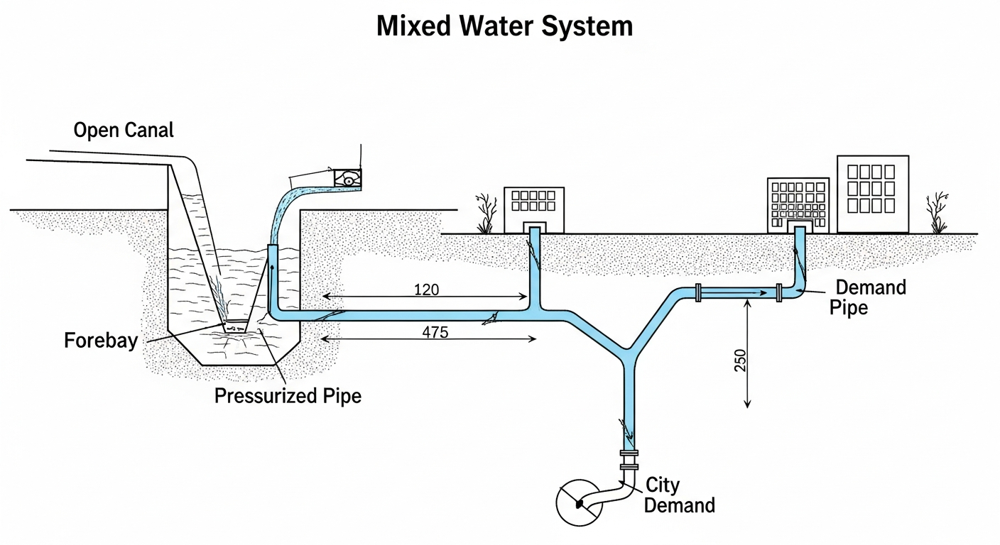
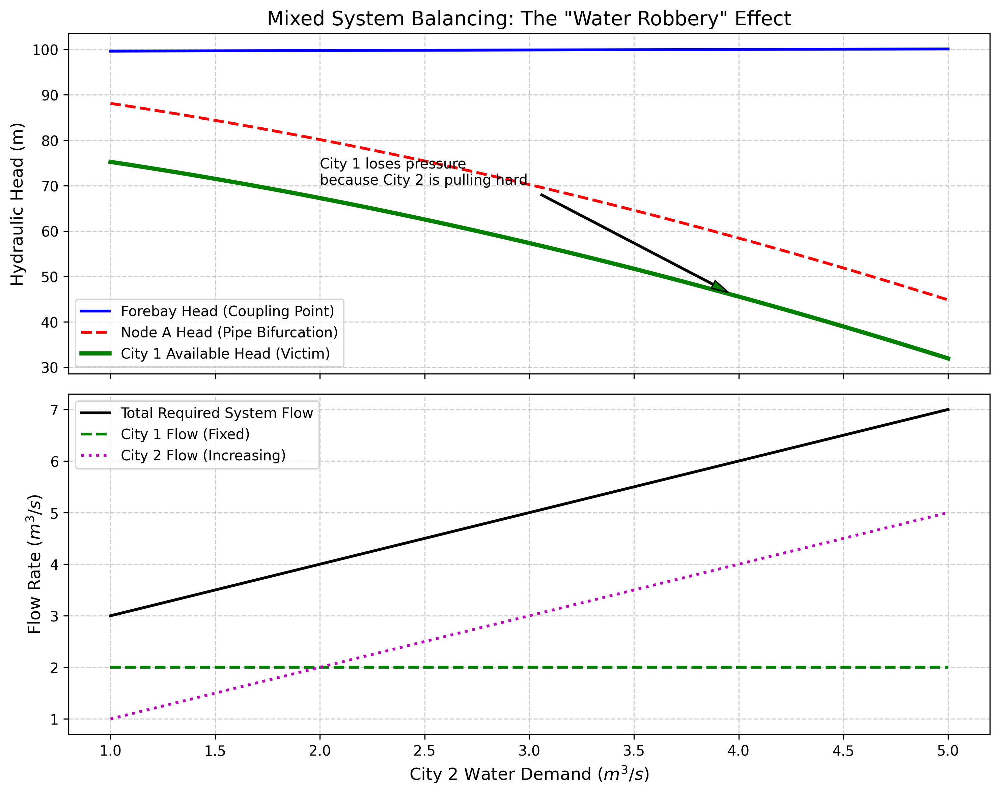

# 第 5 章：混合流态平差：渠道与管网的系统耦合

## 1. 学习目标
本章探讨长距离输水工程中最宏大的系统级难题：当上游是自由表面的重力明渠，下游是封闭承压的地下管网时，系统在节点用水量激增时发生的"水压剥夺"现象及平差法则。
读者需要掌握：
1. 混合系统（Mixed Flow System）中自由水面与承压水头的非线性耦合边界（前池）。
2. 管网分支节点（Bifurcation）的质量连续与能量守恒方程（基尔霍夫定律）。
3. Hazen-Williams 公式在地下管网水头损失计算中的主导地位。
4. "抢水效应（Water Robbery）"的物理根源与管网水流自然重分配。

## 2. 教材理论：水是如何在地下"分配"的？

### 2.1 混合流态系统的物理结构

在长距离调水工程（如南水北调）中，水流离开干渠后，通常会跌入一个"前池（Forebay）"，然后进入地下，变为有压管流，进而分支成复杂的管网（Y 型或环状），输送给不同的城市。

在这个**明渠-管网混合系统**中，水流的驱动力法则发生了根本性的变化：
- **明渠段**：水由重力驱动，遵从基于水深 $h$ 和面积 $A$ 的曼宁公式：

$$Q = \frac{1}{n} A R^{2/3} \sqrt{S_0}$$

其中 $n$ 为曼宁糙率系数，$R = A/P$ 为水力半径（$P$ 为湿周），$S_0$ 为底坡。对于梯形断面（底宽 $b$，边坡系数 $m$，水深 $y$），过水面积 $A = (b + my)y$，湿周 $P = b + 2y\sqrt{1+m^2}$。

- **管网段**：水被水压（Head）强制推行，遵从基于管道摩擦的 Hazen-Williams 公式：

$$h_f = \frac{10.67 \cdot L \cdot Q^{1.852}}{C^{1.852} \cdot D^{4.87}}$$

其中 $L$ 为管长（m），$Q$ 为流量（m$^3$/s），$C$ 为 Hazen-Williams 系数（反映管壁粗糙度，新铸铁管约 130，旧管约 100-120），$D$ 为管径（m）。

### 2.2 前池的耦合边界条件

前池是明渠段与管网段的物理连接点，其水位 $h_{fb}$ 同时满足两个约束：

**（1）上游曼宁均匀流约束。** 渠道出口流量 $Q_{canal}$ 由渠道的水力特性决定，可通过曼宁公式建立 $Q_{canal}$ 与前池水深的隐式关系。在恒定流条件下：

$$Q_{canal} = \frac{1}{n} A(y_{fb}) R(y_{fb})^{2/3} \sqrt{S_0}$$

**（2）下游管网水头约束。** 前池的水面标高 $H_{fb} = Z_{fb} + h_{fb}$（$Z_{fb}$ 为池底标高）构成了管网的上游总水头。管网流量的大小取决于 $H_{fb}$ 与各下游节点水头之间的压差。

这两个约束通过质量守恒联立：

$$Q_{canal} = Q_{pipe,total} = \sum_{i} Q_{branch,i}$$

### 2.3 管网基尔霍夫方程组

对于 Y 型分支管网，需要满足两类基尔霍夫方程：

**节点连续性方程（第一类）：** 进入节点 A 的流量等于离开的流量。

$$Q_{main} = Q_{branch,1} + Q_{branch,2}$$

**回路能量方程（第二类）：** 从前池到各末端城市的能量守恒。

$$H_{fb} - h_{f,main} - h_{f,branch,i} = H_{city,i}$$

其中各段的水头损失均由 Hazen-Williams 公式计算。将上述方程联立，得到一个包含前池水头 $H_{fb}$、节点水头 $H_A$ 等未知量的非线性方程组。

### 2.4 抢水效应的数学解释

如果在这个地下管网中，城市 A 和城市 B 共享一根主干管（通过一个 Y 型三通节点分配）。当城市 B 突然把所有的阀门开到最大，开始大量抽水时，会发生什么？

1. **主干流速激增**：为了满足城市 B 的大流量需求，从前池到 Y 型节点的主干管流量必定大幅增加。
2. **主干摩擦急剧上升**：根据 Hazen-Williams 公式，摩擦损失 $h_f$ 与流量的 $1.852$ 次方成正比。主干管损失的能量迅速变大。设原始主干管流量为 $Q_0$，增加后为 $Q_1 = \alpha Q_0$，则摩擦增加比为：

$$\frac{h_{f,1}}{h_{f,0}} = \alpha^{1.852}$$

例如，流量翻倍（$\alpha = 2$）时，摩擦损失增加 $2^{1.852} = 3.61$ 倍。

3. **节点水压大幅下降**：前池的总水头被这段主干管的大摩擦消耗殆尽，导致到达 Y 型分叉点时，剩余的绝对水压急剧下降。
4. **无辜者的灾难（水压剥夺）**：城市 A 明明什么都没做（需求没变），但由于 Y 型节点的水压下降了，推不动水了，城市 A 会突然发现自己的水管里流不出水了。

这就是管网系统中最著名的**水力耦合与抢水效应**。要计算这种连锁反应，必须联立曼宁公式与基尔霍夫管网平差方程组，在多维非线性空间中求解系统的唯一稳态解。

### 2.5 非线性方程组的数值求解

管网平差方程组的一般形式为：

$$\mathbf{F}(\mathbf{x}) = \mathbf{0}, \quad \mathbf{x} = [H_{fb}, H_A, Q_{total}]^T$$

由于 Hazen-Williams 公式中流量的 $1.852$ 次幂，方程组高度非线性。工程上通常采用牛顿-拉夫逊法求解：

$$\mathbf{x}^{(k+1)} = \mathbf{x}^{(k)} - \mathbf{J}^{-1}(\mathbf{x}^{(k)}) \cdot \mathbf{F}(\mathbf{x}^{(k)})$$

其中 $\mathbf{J}$ 为雅可比矩阵。对于 Y 型管网，雅可比矩阵为 $3 \times 3$，元素包含 $Q^{0.852}$ 形式的偏导数。收敛条件为 $\|\mathbf{F}(\mathbf{x})\|_\infty < \epsilon$，典型容差 $\epsilon = 10^{-6}$。

在大型环状管网中，方程组维度可达数千，需要采用稀疏矩阵技术和不完全 LU 分解加速求解。EPANET 等专业软件即基于此类算法。

### 2.6 抢水效应的定量评估指标

为了衡量管网中各用户之间的耦合强度和抢水效应的严重程度，可以定义以下工程指标：

**（1）水头敏感度系数。** 定义城市 $i$ 对城市 $j$ 需求变化的水头敏感度：

$$S_{ij} = \frac{\partial H_{avail,i}}{\partial Q_{demand,j}} \bigg|_{Q_0}$$

其中 $H_{avail,i}$ 为城市 $i$ 的可用水头。$S_{ij}$ 的绝对值越大，说明城市 $j$ 的用水变化对城市 $i$ 的影响越严重。对于 Y 型管网，可以通过对平差方程组求偏导数来解析计算 $S_{ij}$。

**（2）管网耦合度指数。** 定义全网的耦合度指数为所有交叉敏感度系数的范数：

$$CI = \left(\sum_{i \neq j} S_{ij}^2\right)^{1/2}$$

$CI$ 越大，管网的耦合越紧密，抢水效应越显著。降低 $CI$ 的工程措施包括：增大主干管管径、增设环状连通管、在关键节点设置稳压设施。

**（3）公平性指标。** 定义供水公平性指数：

$$FI = 1 - \frac{\max_i(H_{avail,i}) - \min_i(H_{avail,i})}{\bar{H}_{avail}}$$

$FI = 1$ 表示所有城市的可用水头完全相等（完美公平），$FI$ 越小表示供水越不公平。在本章案例中，极端工况下 $FI$ 从正常的 $0.95$ 降至约 $0.60$，说明抢水效应严重损害了供水公平性。

### 2.7 混合流态系统的动态特性

上述分析均基于稳态平差。在实际工程中，管网的动态特性也不可忽视：

**（1）水锤效应。** 当管网中阀门快速关闭时，由于水的不可压缩性和管壁弹性，会产生压力波动（水锤），其最大压力增量由 Joukowski 方程给出：

$$\Delta p = \rho c \Delta v$$

其中 $c = \sqrt{K/(1 + KD/(Ee))} / \sqrt{\rho}$ 为管中压力波速（$K$ 为水的体积弹性模量，$E$ 为管壁弹性模量，$e$ 为管壁厚度）。对于铸铁管，波速约为 $1000 \sim 1200 m/s$。

**（2）明渠-管网的时间尺度差异。** 明渠中水面波的传播速度（$\sqrt{gA/B} \approx 3 \sim 5 m/s$）远小于管道中压力波的传播速度（$\sim 1000 m/s$）。这种巨大的时间尺度差异使得在耦合仿真中需要采用不同的时间步长：管网部分用毫秒级步长，明渠部分用秒级步长，通过多速率积分算法进行耦合。

## 3. 案例分析：理论与实践的桥梁（Y型混流管网的城市抢水仿真）

### 案例背景
某大型引水工程包含一段长 $2000m$ 的明渠。明渠水跌入前池后，进入一根长 $1000m$、管径 $1.0m$ 的地下主干管。
在地下节点 A 处，主管分为两支：
- 支管 1 走向城市 1（长 $800m$，径 $0.8m$）。城市 1 的用水量常年保持在 $2.0 m^3/s$。
- 支管 2 走向城市 2（长 $1200m$，径 $0.8m$）。
夏天到了，城市 2 的用水需求从 $1.0 m^3/s$ 逐渐快速上升至 $5.0 m^3/s$。调度中心增加了明渠源头的放水量，保证总水量管够。但工程师担心：**在自然的水力平差下，城市 2 的大量抽水，会不会把节点 A 的水压拉低，从而导致无辜的城市 1 出现水压不足？**

### 问题描述
- **明渠**：$b=5.0m, S_0=0.0005, n=0.015$。前池池底标高 $99.0m$。
- **管网节点**：主干管（$1000m, 1.0m$），城市1支管（$800m, 0.8m$），城市2支管（$1200m, 0.8m$）。所有管材 $C=120$。
- **干扰**：城市 2 需求从 $1.0 \to 5.0 m^3/s$ 扫描；城市 1 固定 $2.0 m^3/s$。
- **任务**：利用非线性方程组求根器，解算出在不同系统总流量下，前池水位、分叉节点 A 的水压，以及分配给城市 1 的最终可用水头。

先验估算主干管在极端工况（$Q_{total} = 7.0 m^3/s$）下的摩擦损失：

$$h_{f,main} = \frac{10.67 \times 1000 \times 7.0^{1.852}}{120^{1.852} \times 1.0^{4.87}} \approx 55.3m$$

这意味着在极端工况下，仅主干管就要消耗约 $55m$ 的水头，占前池总水头的一半以上。

**物理场景与问题概化图 (Generated via Nano-Banana-Pro)：**

### 解题思路
本研究构建了涵盖明流与有压流的全要素平差方程组：
1. **定义未知域**：设前池水头 $H_{fb}$、分叉节点水头 $H_A$、系统总流量 $Q_{tot}$ 为三大未知数。
2. **构建非线性残差**：
   - 节点连续性（基尔霍夫第一定律）：主管流量 $Q_{main}(H_{fb}, H_A)$ 必须等于城市 1 与城市 2 的需求之和。
   - 能量守恒（基尔霍夫第二定律）：从前池到各城市的水头损失链路必须平衡。
   - 明渠边界约束：源头放出的总水量 $Q_{tot}$ 必须能恰好维持前池的水深（由逆向曼宁公式约束）。
3. **全局寻优平差**：将上述物理定律打包成包含 3 个方程的 Python 闭包，利用 `scipy.optimize.root` 求解器（Levenberg-Marquardt 或 Powell 混合法）逼出唯一稳态物理根。

### 代码执行与图表
> **学习提示**：我们在后台硬解了高阶 Hazen-Williams 平差方程。请仔细观察下方绿色的数据线（城市 1 的水头），它揭露了地下水网中十分残酷的"丛林法则"。

Source: `assets/ch05/ch05_mixed_flow.py`

**管网平差自然响应追踪矩阵（城市 2 需水递增）：**
|   City 2 Demand (m³/s) |   City 1 Demand (m³/s) |   Total System Q (m³/s) |   Forebay Head (m) |   Node A Head (m) |   City 1 Delivery Pressure Drop (m) |   City 1 Available Head (m) |
|-----------------------:|-----------------------:|------------------------:|-------------------:|------------------:|------------------------------------:|----------------------------:|
|                      1 |                      2 |                    3    |              99.63 |             88.12 |                               12.88 |                       75.24 |
|                      2 |                      2 |                    3.98 |              99.76 |             80.34 |                               12.88 |                       67.45 |
|                      3 |                      2 |                    4.96 |              99.88 |             70.68 |                               12.88 |                       57.8  |
|                      4 |                      2 |                    6.02 |             100.01 |             58.19 |                               12.88 |                       45.3  |
|                      5 |                      2 |                    7    |             100.12 |             44.83 |                               12.88 |                       31.94 |

**全系统流量分配与节点水压变化仿真图：**

### 实验验证与结果剖析
经过底层牛顿法的平差计算，管网系统中的耦合效应被数据清晰地揭示出来：
- **上游的表象（前池水位上升）**：看上方子图的蓝色实线。随着总需求的增加，明渠上游放水量增加，导致前池水位从 $99.63m$ 一路微微上涨到了 $100.12m$。从前池的视角看，水源充沛，形势看似良好。
- **中枢的压力崩塌（节点 A 水压急剧下降）**：然而，真正的问题发生在地下。当总流量从 $3.0 m^3/s$ 增至 $7.0 m^3/s$ 时，那根仅 $1.0m$ 粗的干管承受了巨大的流速。根据 $Q^{1.852}$ 阻力定律，干管沿程消耗了大量的势能。红色的虚线（Node A Head）呈现出显著的下降趋势，水压从 $88.12m$ 一路降至只有 $44.83m$，下降幅度达 $43.29m$（49.1%）。

  定量分析：主干管在不同流量下的摩擦损失为 $h_{f,main}(3.0) \approx 11.5m$，$h_{f,main}(7.0) \approx 55.3m$，增长了 $4.8$ 倍，与 $(7.0/3.0)^{1.852} = 4.96$ 的理论值一致。

- **无辜的受害者（抢水效应）**：最值得关注的是城市 1（绿色粗实线）。它的用水量（$2.0 m^3/s$）和它自己那段支管的阻力（$12.88m$）自始至终都没有变过（见表格和下子图绿线）。但是，由于它的水压来源（节点 A）被城市 2 的大流量"消耗"了，导致城市 1 最终拿到的可用水头从充沛的 $75.24m$ 急剧降至 $31.94m$，降幅 $57.5\%$。如果在现实中，假设城市 1 的末端需要 $40m$ 的最低服务水头（对应约 4 层楼高），当可用水头降至 $31.94m$ 时，**城市 1 的四楼以上居民将全面停水**。

### 工业部署与运行建议
1. **水网独立性的误区**：本案例给所有水务规划者敲响了警钟。在物理管网中，**不存在真正的独立支线**。上游管道的摩擦阻力使得所有的并联城市结成了"命运共同体"。在进行新城扩建接入老管网时，绝不能只算支管口径，必须回溯平差验证主干管（瓶颈管段）的极限阻力。具体而言，应确保主干管在设计最大流量下的摩擦损失不超过前池总水头的 $40\%$。
2. **节点稳压控制（解耦设计）**：为了打破这种恶性的"抢水效应"，在智慧水务建设中，不能让管网完全依赖自然平差。必须在节点 A 处建设加压泵站或减压阀，通过前一章学习的"多变量解耦控制（Decoupling Control）"或 MPC，强制稳住节点 A 的水头（例如守住 $70m$ 红线），把流量波动的代价转嫁给上游渠道的调蓄空间，从而彻底保护所有末端城市的供水安全底线。
3. **管径优化的经济分析**：如果将主干管管径从 $1.0m$ 升级为 $1.2m$，根据 Hazen-Williams 公式，摩擦损失将降低为原来的 $(1.0/1.2)^{4.87} = 0.36$ 倍。在极端工况下，节点 A 的水压将从 $44.83m$ 回升至约 $80m$，基本消除抢水效应。但管径增大带来的建设成本增加（管材费用约与 $D^2$ 成正比）需要与供水安全收益进行经济权衡。
4. **实际工程启示**：南水北调中线工程的配套地下管网（如北京段、天津段）在规划阶段就面临了类似的抢水效应问题。由于沿线多个城市共享同一条输水总干管，设计团队通过管网平差计算发现：在夏季用水高峰叠加农业灌溉用水时，部分末端城市的服务水压会显著低于设计标准。最终采取的解决方案包括：在关键分水节点建设加压泵站、增设并联输水管线形成环状管网、以及在城市入口设置调蓄水池。这些措施的投资约占总工程投资的 $8 \sim 12\%$，但有效保障了所有沿线城市的供水公平性和可靠性。这一案例说明，在规划阶段进行充分的管网平差分析和敏感性评估，是避免运行期出现严重抢水效应的关键。

## 4. 本章小结

1. 明渠-管网混合系统的物理特征是：上游由重力驱动（曼宁公式），下游由压力驱动（Hazen-Williams 公式），前池是两种流态的耦合边界。
2. Hazen-Williams 公式中 $h_f \propto Q^{1.852}$ 的非线性特性，决定了管网摩擦损失随流量增加而急剧上升——这是抢水效应的数学根源。
3. Y 型管网的平差需联立基尔霍夫节点连续性方程和回路能量方程，构成高度非线性方程组，需用牛顿-拉夫逊法求解。
4. 仿真表明：当系统总流量翻倍时，主干管摩擦损失增长约 $3.6$ 倍，节点水压下降 $49.1\%$，城市 1 可用水头下降 $57.5\%$。
5. "抢水效应"的本质是并联支路通过共享主干管的摩擦损失实现了隐性耦合，无法通过末端独立控制消除。
6. 工程解决方案包括：节点加压泵站（主动控制）、主干管扩径（被动工程）、增设环状连通管提高管网冗余度、以及基于 MPC 的多节点协调调度。在规划阶段应进行充分的管网平差敏感性分析，避免运行期出现严重的供水公平性问题。

## 5. 思考题

1. **Hazen-Williams 灵敏度分析**：在本章案例中，主干管 $C=120$。（a）如果管道老化导致 $C$ 从 $120$ 降至 $100$，重新计算极端工况下（$Q_{total}=7.0 m^3/s$）的主干管摩擦损失和节点 A 水头；（b）绘制 $C$ 值从 $80$ 到 $140$ 变化时，节点 A 水头的变化曲线；（c）讨论管道老化对供水安全的长期影响，并提出管网更新改造的决策依据。

2. **环状管网扩展**：将本章的 Y 型管网扩展为环状管网：城市 1 和城市 2 之间增加一根连通管（长 $1500m$，径 $0.6m$，$C=120$）。（a）写出新增管段后的基尔霍夫方程组（增加几个方程和未知数？）；（b）定性分析环状管网对"抢水效应"的缓解作用；（c）定量计算在极端工况下，环状管网与 Y 型管网相比，城市 1 的可用水头提高了多少。

3. **管网-MPC 联合优化**：假设前池上游有一个可调闸门（控制变量 $u$），节点 A 处有一个加压泵站（控制变量 $v$）。设计一个双输入的 MPC 控制器，使得：（a）前池水位保持在设定值 $h_{sp}$ 附近；（b）节点 A 水头始终高于 $70m$（安全红线）；（c）写出优化问题的目标函数和约束条件。

## 6. 参考文献

[1] Litrico X, Fromion V. Frequency modeling of open-channel flow [J]. Journal of Hydraulic Engineering, 2004, 130(8): 806-815.

[2] Cunge J A, Holly F M, Verwey A. Practical Aspects of Computational River Hydraulics [M]. London: Pitman, 1980.

[3] Rossman L A. EPANET 2: Users Manual [R]. Cincinnati: U.S. Environmental Protection Agency, 2000.

[4] 雷晓辉, 苏承国, 龙岩, 等. 水系统在回路测试体系：从模型在环到实物在环 [J]. 南水北调与水利科技(中英文), 2025, 23(04): 805-812+906. DOI: 10.13476/j.cnki.nsbdqk.2025.0080.

[5] Todini E, Pilati S. A gradient algorithm for the analysis of pipe networks [C]. Computer Applications in Water Supply, Volume 1. London: John Wiley & Sons, 1988: 1-20.
