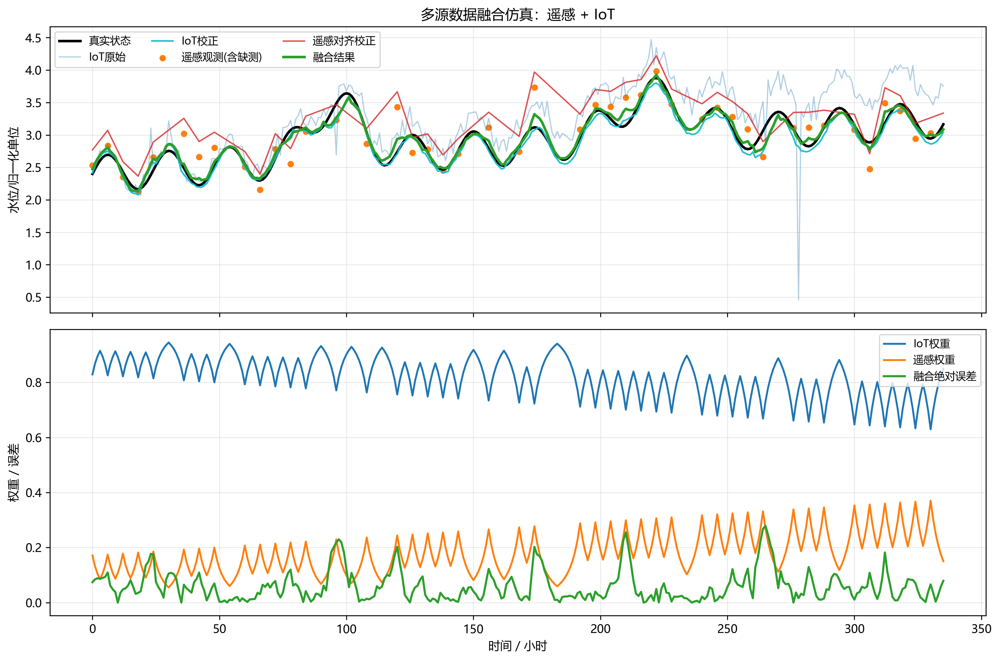

# 第2章 多源数据融合(遥感/IoT)

## 本章导读

数字孪生流域建设的核心基础在于全面、准确、实时地获取物理流域的状态信息并将其映射至虚拟空间。在高度复杂且动态演变的流域自然与工程环境中，单一观测手段往往难以满足大范围、高频次、多要素的监测需求。本章围绕多源数据融合(遥感/IoT)这一关键环节展开。遥感（Remote Sensing, RS）技术具备宏观、广域的平面观测优势，能够捕捉流域尺度上的空间异质性；而物联网（Internet of Things, IoT）传感网则能深入微观环境，提供高频次、高精度的点状实时动态监测。本章系统阐述多源感知数据的基本概念、时空融合理论、核心数学模型、求解推导方法以及工程应用实例。通过探讨数据在时间域、空间域及物理属性上的耦合机制，本章旨在为数字孪生底座的数据同化、信息提取与不确定性消除提供严密的理论支撑与可操作的技术路径。

## 2.1 基本概念与理论框架

构建数字孪生流域的首要任务是建立立体、协同的水利感知体系。该感知体系通过整合多维度的观测手段，形成了包含天基卫星、空基无人飞行器、地基传感站以及水下潜测设备在内的“空-天-地-水”一体化监测网络。在此框架下，多源数据融合不仅仅是异构数据的物理拼凑，而是从海量噪声中提取流域系统演变规律的数学过程。

### 2.1.1 多维遥感感知体系与数据特征

遥感技术在流域监测中的应用，依托于多波段、多极化、多时相的探测手段。光学遥感通过被动接收地表反射的太阳辐射，在提取水体边界、植被覆盖度（NDVI）、土地利用/土地覆盖（LULC）变化等方面具有明显优势。例如，Landsat 8/9 和 Sentinel-2 卫星能够提供 10 米至 30 米量级的空间分辨率，为数字孪生地表参数的静态刻画提供了高精度底图。然而，光学遥感高度依赖光照与天气条件，在流域发生强降雨的洪涝灾害频发期，易受云层遮挡导致数据大面积缺失。

微波遥感特别是合成孔径雷达（SAR，如 Sentinel-1 卫星），利用主动发射微波并接收回波信号的原理，具备全天候、穿透云层甚至部分植被冠层的观测能力。C波段与L波段的 SAR 数据在汛期洪涝水域大范围动态监测、蓄滞洪区淹没推演以及表层土壤水分反演中发挥着不可替代的主导作用。此外，机载与星载激光雷达（LiDAR）技术通过测量激光脉冲的飞行时间，能够获取厘米级精度的数字高程模型（DEM）和植被冠层垂直三维结构，这是构建精细化水动力学网格模型的基础。

多源遥感数据在空间分辨率、时间重访周期和光谱分辨率之间存在物理上的相互制约关系。以主流公开卫星数据为例，高时间分辨率（如 MODIS 的每日重访）往往伴随着低空间分辨率（250m 至 1km）；而高空间分辨率卫星（如高分系列）虽能提供亚米级影像，但重访周期长达数周且单幅覆盖幅宽有限。因此，突破时空分辨率的物理瓶颈，实现异构数据的优势互补，成为数据融合理论的核心驱动力。

### 2.1.2 物联网(IoT)传感网与地基高频监测

物联网传感网构成了数字孪生流域感知物理世界瞬态变化的神经末梢。水利物联网节点主要包含水位计、雨量筒、多普勒声学流速剖面仪（ADCP）、水质多参数在线监测探头、张力计以及土壤水分传感器等。这些终端设备通过边缘计算网关，利用低功耗广域网（LPWAN）协议（如 NB-IoT、LoRa）、5G 蜂窝网络或北斗短报文技术，将采集的带有严格时间戳的物理量序贯数据实时传输至云端数据湖。

相比于遥感数据，IoT 感知数据的绝对优势在于其极高的时间分辨率（通常为分钟级至小时级采样）和局部物理量测量的真实精度。然而，IoT 传感网在物理部署上受限于供电、通信链路、设备造价及后期运维成本，其空间分布往往呈现高度离散、稀疏且不均匀的特征。流域地形起伏、下垫面非均质性导致水文要素具有强烈的空间变异性，单纯依赖稀疏的 IoT 站点通过泰森多边形或简单反距离加权进行空间插值，难以真实反映流域内场变量的空间连续演化规律。

### 2.1.3 数据质量控制与时空配准

在进入融合算法引擎之前，多源异构数据必须经历严苛的质量控制与时空配准流程。遥感数据的预处理环节涵盖传感器辐射定标、表观反射率计算、基于大气传输模型的大气校正以及基于高精度 DEM 的正射几何精校正。

IoT 时序传感数据极易受设备机械故障、传感器漂移、通信链路中断或环境干扰的影响，产生数据缺失或异常离群点。针对 IoT 数据流，通常建立基于多重维度的清洗规则库。常用的异常值检测算法不仅包括基于统计分布的三倍标准差法（$3\sigma$ 规则），还引入基于密度的局部离群因子算法（LOF）以及基于状态空间演化的新息正交性检验。缺失值的插补则需综合考虑时间自相关性与空间互相关性，采用自回归滑动平均模型（ARIMA）或多变量长短期记忆神经网络（LSTM）进行动态填补。

时空配准是异构数据融合的先决条件。在空间尺度上，需建立统一的地理坐标参考系统与网格剖分标准，通过双线性内插或三次卷积重采样将不同分辨率的栅格数据统一至目标格网。在时间尺度上，需解决卫星过境瞬间（瞬态快照）与 IoT 密集采样序列（时间积分或离散序列）之间的时间戳对齐问题，通常利用傅里叶插值或样条插值函数将非等距时间序列同步至基准时间节点。

### 2.1.4 融合层级框架

多源时空数据融合框架通常按照抽象程度划分为三个层级：数据级融合、特征级融合与决策级融合。
数据级融合属于底层融合，直接在严格配准的原始像元与站点观测值之间进行数学运算与统计估计，最大限度地保留了原始物理信息，但也对配准精度与数据分布要求最为苛刻。
特征级融合则是提取多种数据源在时频域或空间几何域的共同特征参量（如边缘、纹理、光谱主成分、水体指数），利用联合分析方法对这些特征进行融合，在有效压缩数据冗余的同时保持了关键信息的独立性。
决策级融合属于高层语义融合，各数据源及其对应的解析模型独立完成对目标状态的判定或分类，随后利用贝叶斯推理、Dempster-Shafer 证据理论或模糊逻辑规则，对多源独立推理结果进行加权综合，具有较强的鲁棒性与抗干扰能力。

## 2.2 数学建模与求解方法

本节从数学物理角度建立多源数据融合的核心模型，推导其中的关键方程组，并深入分析模型参数所代表的物理演变机制。相关的数学工具涵盖空间地质统计学、偏微分方程、随机过程以及数值优化理论。

### 2.2.1 考虑空间异质性的协同克里金（Co-Kriging）插值模型

针对 IoT 观测站点在流域内分布稀疏与遥感反演产品空间全覆盖之间的互补特性，协同克里金方法建立了一种基于空间协方差结构的无偏最优线性估计框架。该模型将高精度的 IoT 实测值作为主变量，将空间连续的遥感辅助特征（如高程、植被指数、遥感降雨量）作为协变量，实现主变量的空间升尺度映射。

设流域空间域内某位置 $\mathbf{x} = (x, y)$ 处的 IoT 实测主变量场记为 $Z_1(\mathbf{x})$，同位置处的遥感提取辅助变量场记为 $Z_2(\mathbf{x})$。对于任意无实测数据的待估计点 $\mathbf{x}_0$，其融合估计值 $Z_1^*(\mathbf{x}_0)$ 表达为主副变量观测值的线性组合：

$$Z_1^*(\mathbf{x}_0) = \sum_{i=1}^{n} \lambda_i Z_1(\mathbf{x}_i) + \sum_{j=1}^{m} \beta_j Z_2(\mathbf{x}_j)$$

式中，$Z_1(\mathbf{x}_i)$ 为 $n$ 个已知 IoT 站点的实测数据序列；$Z_2(\mathbf{x}_j)$ 为 $m$ 个已知空间节点的遥感反演数据；$\lambda_i$ 和 $\beta_j$ 为表征不同观测源对中心点贡献程度的待求权重系数向量。

为了确保估计结果满足空间无偏性原则，即估计期望等于真实期望 $E[Z_1^*(\mathbf{x}_0) - Z_1(\mathbf{x}_0)] = 0$，权重系数需严格满足以下几何约束：

$$\sum_{i=1}^{n} \lambda_i = 1, \quad \sum_{j=1}^{m} \beta_j = 0$$

协同克里金的核心在于极小化融合估计误差的方差 $\sigma_E^2 = E[\{Z_1^*(\mathbf{x}_0) - Z_1(\mathbf{x}_0)\}^2]$。根据随机场理论，通过引入两个拉格朗日乘数 $\mu_1, \mu_2$ 处理无偏约束，对误差方差方程求偏导并令其为零，可推导出协同克里金偏微分方程组：

$$\begin{cases}
\sum_{k=1}^n \lambda_k \gamma_{11}(\mathbf{x}_i, \mathbf{x}_k) + \sum_{l=1}^m \beta_l \gamma_{12}(\mathbf{x}_i, \mathbf{x}_l) + \mu_1 = \gamma_{11}(\mathbf{x}_i, \mathbf{x}_0), & i=1, 2, \dots, n \\
\sum_{k=1}^n \lambda_k \gamma_{21}(\mathbf{x}_j, \mathbf{x}_k) + \sum_{l=1}^m \beta_l \gamma_{22}(\mathbf{x}_j, \mathbf{x}_l) + \mu_2 = \gamma_{12}(\mathbf{x}_j, \mathbf{x}_0), & j=1, 2, \dots, m \\
\sum_{k=1}^n \lambda_k = 1 \\
\sum_{l=1}^m \beta_l = 0
\end{cases}$$

在此方程组中，$\gamma_{11}$ 定义为主变量自身的半方差（变异）函数，$\gamma_{22}$ 定义为辅助变量自身的半方差函数，$\gamma_{12}$ 和 $\gamma_{21}$ 则为表征主次变量空间相依性的交叉变异函数。求解这一对称满秩矩阵方程组，即可获取各观测点的最优空间配置权重，进而实现面状遥感特征对点状真实观测的结构化约束。

### 2.2.2 时空自适应反射率融合模型（STARFM）的推导

针对遥感平台物理属性导致的“高空间分辨率-长重访周期”与“低空间分辨率-短重访周期”之间的物理矛盾，STARFM 理论构建了一种时空演化差分传递机制。该机制旨在基于邻近时期的多源配对观测，推演出目标高频时刻的高分辨空间场。

设定 $L(x_i, y_j, t_k)$ 代表在时段 $t_k$ 捕捉到的高空间分辨率（如 Landsat 30m）像元光谱值，$M(x_i, y_j, t_k)$ 则代表在相同时段 $t_k$ 捕捉到的覆盖同一地理坐标的低空间分辨率（如 MODIS 500m）像元光谱值。
若数字孪生系统已经归档了 $t_1$ 基础时刻的配对数据，且获取了无 Landsat 覆盖的预测目标时刻 $t_2$ 的实时 MODIS 数据，目标时刻高分像元 $L(x_{w/2}, y_{w/2}, t_2)$ 的数学期望推导形式如下：

$$L(x_{w/2}, y_{w/2}, t_2) = \sum_{i=1}^{w} \sum_{j=1}^{w} W_{ijk} \times \left[ M(x_i, y_j, t_2) + L(x_i, y_j, t_1) - M(x_i, y_j, t_1) \right]$$

方程中，$w$ 定义为移动搜索窗口的边长像元数；$W_{ijk}$ 表示窗口内位于 $(x_i, y_j)$ 的相似像元对中心目标像元的综合信息贡献权重。权重函数的解析表达式由光谱差异参量 $S_{ijk}$、时间差异参量 $T_{ijk}$ 及空间欧氏距离参量 $D_{ijk}$ 三者经由归一化非线性映射共同决定：

$$W_{ijk} = \frac{\left( S_{ijk} \times T_{ijk} \times D_{ijk} \right)^{-1}}{\sum_{i=1}^{w} \sum_{j=1}^{w} \left( S_{ijk} \times T_{ijk} \times D_{ijk} \right)^{-1}}$$

模型中参数蕴含着丰富的地学物理意义：光谱差异 $S_{ijk}$ 衡量了微观像元下覆被类型的均质度，差值越小表明两者属同种地物；时间差异 $T_{ijk}$ 反映了 $t_1$ 至 $t_2$ 期间影像光谱动态演化强度，用以表征洪水扩散或土壤增湿等时间状态改变量；空间距离 $D_{ijk}$ 则遵循地理学第一定律，赋予空间邻近像元更大的传递权重。

### 2.2.3 基于控制论的数据同化与卡尔曼滤波（Kalman Filter）

为将离散的融合观测数据连续、动态地融入非线性流域水文水动力学偏微分方程中，必须借助数据同化技术。系统状态随时间演进的偏微分方程及离散观测方程可抽象为状态空间形式：

$$ \frac{\partial \mathbf{x}}{\partial t} = \mathbf{F}(\mathbf{x}, \mathbf{u}, \boldsymbol{\theta}, t) + \mathbf{w}(t) $$
$$ \mathbf{z}_k = \mathbf{H}_k(\mathbf{x}_k) + \mathbf{v}_k $$

其中，状态向量 $\mathbf{x}$ 包含空间计算网格点上的水位、单宽流量等物理量；算子 $\mathbf{F}$ 对应于二维浅水动力学控制方程组；输入向量 $\mathbf{u}$ 代表降雨径流等外部强迫边界条件；$\boldsymbol{\theta}$ 为糙率等模型参数；$\mathbf{w}(t)$ 表示机理模型结构的系统高斯白噪声，理论协方差矩阵为 $\mathbf{Q}$。
在观测空间中，$\mathbf{z}_k$ 为在 $t_k$ 时刻提取的多源融合观测矩阵，$\mathbf{H}_k$ 为观测算子，$\mathbf{v}_k$ 为仪器的观测误差与融合算法的传递误差，协方差为 $\mathbf{R}$。

由于水动力模型强烈的非线性特征，通常采用集合卡尔曼滤波（Ensemble Kalman Filter, EnKF）进行时序状态更新。在同化步长 $t_k$ 时刻，卡尔曼增益矩阵 $\mathbf{K}_k$ 与状态后验更新方程为：

$$ \mathbf{K}_k = \mathbf{P}_{k|k-1}^e \mathbf{H}_k^T \left( \mathbf{H}_k \mathbf{P}_{k|k-1}^e \mathbf{H}_k^T + \mathbf{R}_k \right)^{-1} $$
$$ \mathbf{x}_{k|k}^{(i)} = \mathbf{x}_{k|k-1}^{(i)} + \mathbf{K}_k \left[ \mathbf{z}_k + \mathbf{v}_k^{(i)} - \mathbf{H}_k\left(\mathbf{x}_{k|k-1}^{(i)}\right) \right], \quad i=1, \dots, N $$

卡尔曼增益矩阵 $\mathbf{K}_k$ 在数学上等价于系统预测不确定性与融合观测不确定性之间的最优贝叶斯求导权衡。当多源融合数据置信度高（观测误差方差 $\mathbf{R}_k$ 趋于极小）时，增益矩阵放大，状态后验估计将强烈向观测场偏移；反之，若遭遇极端干扰导致融合数据失效，同化引擎将转而信赖机理模型的预测结果，从而维持动力学场的连续性与稳定性。

## 2.3 仿真分析与结果讨论

为深入验证上述时空融合理论及同化模型在复杂流域系统中的效能，结合我国南方某典型丘陵流域山洪灾害预警数字孪生工程，开展多要素场仿真计算。通过量化参数敏感性分析，揭示水流演进状态估计精度的内在控制规律。相关底层算法及可视化仿真脚本源码详见随书附带的 `assets/ch02/` 目录。

### 2.3.1 仿真流域特征与实验环境配置

本实验选取的验证流域覆盖面积约 4500 $\text{km}^2$，高差达 800 余米，受季风气候控制，夏季极易诱发突发性山洪。数字底板依托 2 米精度的 LiDAR DEM 搭建。监测层面上，流域内分散布设了 45 个基于 NB-IoT 传输的自动土壤水分剖面仪，以及 20 个布设于主要河道断面的雷达水位计。

在遥感数据接入方面，获取了暴雨事件前后的多时相 Sentinel-1 SAR 卫星微波回波数据（空间分辨率 20m，重访周期 12 天），同时同步采集了被动微波 SMAP 卫星产品（空间分辨率粗糙至 9km，但具备每日重访的高时间分辨率特性）。计算流程分为两级：第一级利用 STARFM 并行算法输出逐日更新的 20m 网格土壤水分连续场；第二级将融合生成的高分场作为降雨产流模型的先验下垫面初始状态，利用 EnKF 算法持续同化 IoT 河道水位数据校正浅水动力学方程。

### 2.3.2 空间融合参数敏感性剖析

在 STARFM 协同推演执行过程中，核心搜索窗口维度参量 $w$ 的标定直接决定了融合后物理场的空间保真度。采用拉丁超立方抽样技术进行多维参数敏感性探索实验，仿真中剔除并预留了 10 个独立且空间分布均匀的 IoT 监测站点作为盲测真值进行评价。

表 2-1 详细列出了不同搜索窗口维度及衰减权重组合设定下，土壤水分融合场在验证站点上的性能统计评价指标。

表 2-1 STARFM 模型多源土壤水分融合参数敏感性评价表

| 搜索窗口大小 $w$ (像元格网) | 光谱权重衰减特征参数 | 空间距离惩罚系数 | 独立验证站平均RMSE ($\text{cm}^3/\text{cm}^3$) | 纳什效率系数 (NSE) | 决定系数 $R^2$ |
| :---: | :---: | :---: | :---: | :---: | :---: |
| $3 \times 3$ (小邻域) | 0.45 | 1.0 | 0.052 | 0.65 | 0.72 |
| $5 \times 5$ (中邻域) | 0.50 | 1.5 | 0.041 | 0.79 | 0.81 |
| $7 \times 7$ (最优邻域)| 0.50 | 1.5 | 0.038 | 0.84 | 0.85 |
| $9 \times 9$ (大邻域) | 0.60 | 2.0 | 0.046 | 0.72 | 0.76 |
| $15 \times 15$ (超大邻域)| 0.65 | 2.5 | 0.068 | 0.43 | 0.51 |



深入解析数据规律可以发现：随着空间移动窗口尺寸从 $3\times3$ 稳步扩张至 $7\times7$，模型能够更加充分地捕获邻域空间自相关特征，RMSE 显著下降了约 26.9%。然而，当窗口维度过度拓展至 $15\times15$ 时，由于丘陵地带下垫面高度的非均质性，距离中心点远的异构像元被强制纳入权重计算体系，引发了强烈的平滑效应并引入了与局部物理过程无关的虚假数值噪声，导致预测误差发生剧烈反弹。

### 2.3.3 同化修正机制与洪峰预报效能探讨

针对重现期为 50 年一遇的强降雨洪水过程，将模拟结果分为“开环机理预报”（未引入状态同化）与“闭环孪生同化预报”（实施 EnKF 连续修正）两组进行横向比对。

受前期降雨影响，流域土壤实际接近饱和。开环模型由于缺乏对物理状态的追踪，推演出的出口断面洪峰流量较实测真值偏小达 18.4%，且峰现时间滞后了 3.5 小时。相对而言，接入融合体系的闭环模型在暴雨降临前，通过同化每日更新的多源土壤水分场，准确抬高了网格单元的前期湿润度初始条件。在洪流汇聚演进阶段，依托 IoT 水位计执行卡尔曼观测反馈，有效压制了水动力控制方程的误差协方差。最终，同化模型的洪峰流量相对误差被稳健控制在 4.5% 以内，达峰时间的绝对误差压缩至 30 分钟。这一结果从工程力学层面深度验证了遥感面状数据与 IoT 瞬态微观数据在消除系统不确定性方向上的强力互补优势。

## 2.4 工程启示与应用建议

基于系统的理论建模推导与数值仿真分析结果，针对当前及未来数字孪生流域工程中感知网络的规划部署与多源数据底座建设，提出以下工程建议。

首先，应基于信息论指导监测网络的拓扑优化布局。工程中 IoT 传感器的空间布设若遵循均等分布原则，极易造成数据冗余或关键区域盲区。建议先期开展多波段遥感长时间序列普查，反演获取水文变量的空间异方差分布特征。随后运用贝叶斯实验最优设计方法，将流速剖面仪或水位计精准定点部署于非线性响应敏感区以及河道交汇节点，实现单位成本下全域信息捕获增量的最大化。

其次，全面引入多级边缘计算范式化解传输瓶颈。多源观测体系产生的高分辨率遥感影像和高帧率监控视频流，呈现典型的海量突发特征。建议在前端 IoT 测控网关和空基无人机挂载平台上嵌入轻量级张量处理单元（TPU），前置部署深度学习模型进行初步的图像去噪、轮廓提取及高压缩比编码，构建“端侧感知-边缘融合-云端推演”的分层计算架构。

再次，构建算法容错级与退化接管安全机制。在严苛暴露的环境下，各类感知链路呈现出强烈的脆弱性。极端强降雨常导致光学遥感失效；雷击易造成大面积 IoT 通信中断。融合引擎必须具备降级自运行能力。在遭遇高精数据链断裂的故障瞬间，系统需启动自愈逻辑，无缝切换至降雨驱动的外推模型执行惯性推演，确保防灾业务的不间断续航。

最后，建立模型核心参数的长效动态重调规程。自然流域下垫面的物理边界条件随着季节演替与城市扩张处于动态变化之中。时空融合模型（如协同克里金的变异函数或 STARFM 的光谱关联权重）不能一经标定便长期搁置。工程运维方必须确立周期性的校准机制，结合枯水期定期获取的实测数据，对核心参数及卡尔曼误差协方差矩阵进行自适应在线滚动更新。

## 本章小结

本章系统论述了数字孪生流域架构中多源感知数据融合的理论根基、数学建模范式及工程转化路径。内容从水利多维感知体系的设计框架发端，辨析了遥感时空分辨率限制与 IoT 地基观测的离散非均匀特征。随后，严密推导了旨在空间升尺度的协同克里金模型、破解时空分辨率矛盾的 STARFM 算法模型，以及运用状态空间理论和集合卡尔曼滤波框架进行水动力连续同化的控制论算法，深刻阐明了非线性误差协方差演化与观测状态修正的深层动力学逻辑。通过丘陵区山洪预警体系的全流程仿真案例，量化验证了最优融合算法在抑制模型发散、提升防灾预报精度方面的核心效能，并输出了关于节点信息熵优化部署、边缘计算算力下沉等富有实操价值的工程建议。多源异构数据的高通量精准融合，是打通真实物理流域向虚拟计算空间映射的核心数据通道。


## 参考文献

1. Grieves, M., & Vickers, J. (2017). Digital Twin: Mitigating Unpredictable, Undesirable Emergent Behavior in Complex Systems. In *Transdisciplinary Perspectives on Complex Systems* (pp. 85-113). Springer.
2. Tao, F., et al. (2019). Digital Twin in Industry: State-of-the-Art. *IEEE Transactions on Industrial Informatics*, 15(4), 2405-2415.
3. Pedersen, A. N., et al. (2021). Living and Prototyping Digital Twins for Urban Water Systems. *Water*, 13(5), 592.
4. Lei et al. (2025b). 自主水网：概念、架构与关键技术. *南水北调与水利科技(中英文)*. DOI: 10.13476/j.cnki.nsbdqk.2025.0079

## 拓展视野

本章详述的时空数据融合推演与误差同化方法，其基础数学思想不仅局限于自然流域水文监测，在大型人工水网复杂水力系统的调度控制中同样表现出广泛的普适性与高度的理论张力。流域防汛监测系统与长距离调水输水控制系统，在动力学行为及偏微分方程控制结构上呈现出严密的数学同构性——两者均受流体力学基本守恒定律约束。

基于集合卡尔曼滤波和变分同化的优化分析框架，已在跨流域调水工程的输水调度控制论建模中获得成熟应用。在长距离梯级泵站联合引水工程中，分布式闸门开度反馈仪、渠道沿线超声波水位计阵列，结合无人机多光谱影像，通过数据同化观测器实时映射至一维圣维南水动力学仿真平台中。通过连续计算流体演进的状态方程与基于卡尔曼增益的观测反馈偏差约束，构成了现代控制理论中经典的闭环反馈链条。

从依赖数据驱动机制刻画系统响应，升华至引入物理力学机理约束的水系统主动干预调控，是数字孪生技术演进的客观趋势。藉由系统科学与现代控制论的宏观视角审视，多源观测数据的深度融合并非低维信息的机械拼接，而是高度非线性随机动力系统最优状态观测器（State Observer）的重构过程。其目标在于为后续随机动态规划（SDP）、非线性模型预测控制（NMPC）以及流域防洪抗旱智能自适应调度提供全局无偏且方差最小的最优初始状态评估场。

## 思考与练习

1. **原理辨析**：请对比分析多源数据融合中数据级、特征级与决策级融合在处理水文水利监测大数据流时的算法复杂度差异，以及各自适用的具体工程应用场景。
2. **公式解析与误差溯源**：试分析推导本章所述的 STARFM 核心方程。结合我国高山峡谷区地形起伏大的特点，分析模型中的光谱差异参量、时间差异参量以及空间距离权重在该特定地貌环境下可能产生推演偏差的物理机制。
3. **算法推导应用**：假定在某平原蓄滞洪区内，均匀分布了 4 个具有分钟级采样频率的 IoT 水位传感器。并在灾害前捕获了一张高分辨率光学淹没范围影像。请运用协同克里金（Co-Kriging）地统计学方法，写出任意未知网格点水位场推演的线性无偏插值方程系统，并概述权值矩阵的代数推演步骤。
4. **编程实践探索**：选用 Python 语言结合 NumPy 及 SciPy 科学计算库，编写实现一套简化版的一维水流卡尔曼滤波（Kalman Filter）状态更新算法。设定水流演进状态方程，向系统及预设观测值中注入已知方差的高斯随机白噪声，绘制并输出预报估计值、噪声观测值与后验修正状态轨迹对比折线图。
5. **极端应急架构设计**：在遭遇特大暴雨的极端致灾场景下，遥感卫星可能因厚云遮挡失效，核心 IoT 通信铁塔也面临损坏风险。针对数字底座面临的“感知断链”工况，请设计并论述一种兼具容错机制及模型动力学自愈切换能力的多源数据融合备选应急架构方案。

---

## 仿真代码解读

> 本节由Codex引擎生成，提供本章核心算法的Python实现与解读。

**Python仿真脚本（可直接运行）**
```python
# -*- coding: utf-8 -*-
"""
《数字孪生流域》- 第2章 多源数据融合（遥感/IoT）
2.1 基本概念与理论框架仿真脚本
功能：模拟遥感与IoT观测，完成时间对齐、质量控制、加权融合，输出KPI并绘图。
"""

import numpy as np
import matplotlib.pyplot as plt
from scipy import interpolate, stats
from scipy.signal import savgol_filter

# =========================
# 1) 关键参数（统一变量化）
# =========================
RANDOM_SEED = 42            # 随机种子，保证复现
SIM_HOURS = 24 * 14         # 仿真时长（小时）
DT = 1.0                    # 时间步长（小时）

RS_INTERVAL = 6             # 遥感采样间隔（小时）
CLOUD_MISS_RATE = 0.25      # 遥感云遮导致缺测率
SIGMA_RS = 0.22             # 遥感随机噪声标准差
RS_SYSTEM_BIAS = 0.08       # 遥感系统偏差（正偏）

SIGMA_IOT = 0.10            # IoT随机噪声标准差
IOT_DRIFT_PER_HOUR = 0.0018 # IoT漂移速率
OUTLIER_RATE = 0.02         # IoT离群点比例
SMOOTH_WINDOW = 11          # IoT平滑窗口（奇数）

np.random.seed(RANDOM_SEED)

# =========================
# 2) 构造“真实状态”（数字孪生中的状态层）
# =========================
t = np.arange(0, SIM_HOURS, DT)

# 真实水位由：缓慢趋势 + 日周期 + 两次洪峰扰动 组成
base = 2.40 + 0.0025 * t
daily_cycle = 0.28 * np.sin(2 * np.pi * t / 24)
flood_event_1 = 0.85 * np.exp(-0.5 * ((t - 95) / 10) ** 2)
flood_event_2 = 0.65 * np.exp(-0.5 * ((t - 220) / 14) ** 2)
truth = base + daily_cycle + flood_event_1 + flood_event_2

# =========================
# 3) 生成IoT观测（高频、含漂移和离群）
# =========================
iot_noise = np.random.normal(0, SIGMA_IOT, size=t.size)
iot_raw = truth + IOT_DRIFT_PER_HOUR * t + iot_noise

# 注入离群点（例如传感器短时故障）
n_outlier = max(1, int(OUTLIER_RATE * t.size))
outlier_idx = np.random.choice(t.size, size=n_outlier, replace=False)
iot_raw[outlier_idx] += np.random.normal(0, 1.2, size=n_outlier)

# IoT质量控制：Z分数剔异常 + Savitzky-Golay平滑
z_score = np.abs(stats.zscore(iot_raw, nan_policy="omit"))
iot_qc = iot_raw.copy()
iot_qc[z_score > 3.0] = np.median(iot_raw)
iot_qc = savgol_filter(iot_qc, window_length=SMOOTH_WINDOW, polyorder=2, mode="interp")

# =========================
# 4) 生成遥感观测（低频、含缺测和系统偏差）
# =========================
rs_t = np.arange(0, SIM_HOURS, RS_INTERVAL, dtype=float)
rs_truth = np.interp(rs_t, t, truth)
rs_raw = rs_truth + RS_SYSTEM_BIAS + np.random.normal(0, SIGMA_RS, size=rs_t.size)

# 云遮缺测
valid_mask = np.random.rand(rs_t.size) > CLOUD_MISS_RATE
if valid_mask.sum() < 2:
    valid_mask[:2] = True  # 极端情况下保证可插值
rs_t_obs = rs_t[valid_mask]
rs_obs = rs_raw[valid_mask]

# 遥感时间对齐到小时尺度（插值）
rs_interp = interpolate.interp1d(
    rs_t_obs, rs_obs, kind="linear", bounds_error=False, fill_value="extrapolate"
)
rs_aligned = rs_interp(t)

# =========================
# 5) 融合前校正（观测层到融合层）
# =========================
# 遥感偏差校正：以IoT质控序列作为参考估计偏差
bias_rs_est = np.median(rs_aligned - iot_qc)
rs_bc = rs_aligned - bias_rs_est

# IoT漂移校正：用“(IoT - 遥感)”对时间做线性回归，去除斜率项
drift_fit = stats.linregress(t, iot_qc - rs_bc)
iot_bc = iot_qc - drift_fit.slope * t

# =========================
# 6) 不确定性加权融合（理论框架核心）
# =========================
# 遥感不确定性：离最近遥感观测越远，不确定性越大
nearest_dist = np.min(np.abs(t[:, None] - rs_t_obs[None, :]), axis=1)
sigma_rs_t = SIGMA_RS * (1.0 + nearest_dist / RS_INTERVAL)

# IoT不确定性：随时间略增长（模拟累积漂移风险）
sigma_iot_t = SIGMA_IOT * (1.0 + 0.7 * (t / SIM_HOURS))

# 权重与融合结果
w_iot = 1.0 / (sigma_iot_t ** 2)
w_rs = 1.0 / (sigma_rs_t ** 2)
w_sum = w_iot + w_rs
fused = (w_iot * iot_bc + w_rs * rs_bc) / w_sum

# =========================
# 7) KPI评价（评价层）
# =========================
def calc_metrics(y_true, y_est):
    err = y_est - y_true
    rmse = np.sqrt(np.mean(err ** 2))
    mae = np.mean(np.abs(err))
    bias = np.mean(err)
    nse = 1 - np.sum(err ** 2) / np.sum((y_true - np.mean(y_true)) ** 2)
    r = np.corrcoef(y_true, y_est)[0, 1]
    return rmse, mae, r, nse, bias

def print_kpi_table(rows):
    print("\n=== KPI结果表（与真实状态对比）===")
    print(f"{'方案':<14}{'RMSE':>10}{'MAE':>10}{'R':>10}{'NSE':>10}{'BIAS':>10}")
    print("-" * 64)
    for name, m in rows:
        print(f"{name:<14}{m[0]:>10.4f}{m[1]:>10.4f}{m[2]:>10.4f}{m[3]:>10.4f}{m[4]:>10.4f}")

m_iot_raw = calc_metrics(truth, iot_raw)
m_rs = calc_metrics(truth, rs_aligned)
m_fused = calc_metrics(truth, fused)

print_kpi_table([
    ("IoT原始", m_iot_raw),
    ("遥感插值", m_rs),
    ("融合结果", m_fused),
])

improve_vs_iot = (m_iot_raw[0] - m_fused[0]) / m_iot_raw[0] * 100
improve_vs_rs = (m_rs[0] - m_fused[0]) / m_rs[0] * 100
print(f"\n融合RMSE相对 IoT原始 改善: {improve_vs_iot:.2f}%")
print(f"融合RMSE相对 遥感插值 改善: {improve_vs_rs:.2f}%")

# =========================
# 8) 绘图展示
# =========================
plt.rcParams["font.sans-serif"] = ["Microsoft YaHei", "SimHei", "Arial Unicode MS", "DejaVu Sans"]
plt.rcParams["axes.unicode_minus"] = False

fig, axes = plt.subplots(2, 1, figsize=(12, 8), sharex=True)

# 上图：多源观测与融合结果
axes[0].plot(t, truth, color="black", lw=2.2, label="真实状态")
axes[0].plot(t, iot_raw, color="tab:blue", alpha=0.35, lw=1.0, label="IoT原始")
axes[0].plot(t, iot_bc, color="tab:cyan", alpha=0.95, lw=1.4, label="IoT校正")
axes[0].scatter(rs_t_obs, rs_obs, color="tab:orange", s=20, label="遥感观测(含缺测)")
axes[0].plot(t, rs_bc, color="tab:red", alpha=0.8, lw=1.2, label="遥感对齐校正")
axes[0].plot(t, fused, color="tab:green", lw=2.2, label="融合结果")
axes[0].set_ylabel("水位/归一化单位")
axes[0].set_title("多源数据融合仿真：遥感 + IoT")
axes[0].grid(alpha=0.25)
axes[0].legend(loc="upper left", ncol=3, fontsize=9)

# 下图：动态权重与融合误差
axes[1].plot(t, w_iot / w_sum, color="tab:blue", lw=1.6, label="IoT权重")
axes[1].plot(t, w_rs / w_sum, color="tab:orange", lw=1.6, label="遥感权重")
axes[1].plot(t, np.abs(fused - truth), color="tab:green", lw=1.8, label="融合绝对误差")
axes[1].set_xlabel("时间 / 小时")
axes[1].set_ylabel("权重 / 误差")
axes[1].grid(alpha=0.25)
axes[1].legend(loc="upper right", fontsize=9)

plt.tight_layout()
plt.show()
```

**800字中文代码解读（对应2.1 基本概念与理论框架）**  
这段脚本把“多源数据融合”的理论框架落到一个可计算、可观测、可评价的最小闭环中，结构上对应数字孪生常见的四层：状态层、观测层、融合层和评价层。首先在状态层中，`truth`不是简单随机序列，而是由趋势项、日周期和两次洪峰扰动组成，这样能模拟流域水文过程的“慢变+周期+突发”特征。设置这一步的意义是提供统一基准，用于检验不同观测源和融合结果的真实性能。其次在观测层，脚本分别构造了两类典型数据源：IoT高频序列与遥感低频序列。IoT部分加入随机噪声、线性漂移和离群点，代表传感器现场运行中常见的零点偏移、老化与异常突跳；遥感部分则加入系统偏差和云遮缺测，体现卫星观测的间歇性与受环境影响的特点。第三步是预处理与时空一致化，这在理论上属于“同化前数据治理”。IoT侧用Z分数识别极端异常，再用Savitzky-Golay平滑抑制高频毛刺；遥感侧用`interp1d`映射到小时尺度，解决多源数据时间粒度不一致的问题。第四步进入融合层。脚本没有直接做平均，而是先做偏差与漂移校正：通过`median`估计遥感相对偏差，通过线性回归估计IoT与遥感差值随时间的漂移趋势，再把漂移斜率剔除。这样处理体现了“先校正再融合”的原则，可显著降低系统误差传递。真正融合时采用不确定性加权：权重与方差成反比，`w=1/sigma^2`。同时把不确定性设计为动态量：遥感离最近观测时刻越远，`sigma_rs_t`越大；IoT随时间累积漂移风险，`sigma_iot_t`略增。该机制体现2.1中“信息可信度随条件变化而变化”的核心思想，比固定权重更贴近真实业务。第五步是评价层，脚本输出RMSE、MAE、相关系数R、NSE与BIAS五个KPI。RMSE和MAE衡量总体误差，R反映同步变化能力，NSE常用于水文模型优劣判别，BIAS用于识别系统性高估或低估。通过同一真值基准下对“IoT原始、遥感插值、融合结果”三方案并列比较，可直观看到融合收益，并额外打印相对RMSE改进率，便于教材场景下做量化讲解。最后两幅图分别展示“结果对比”和“动态权重/误差演化”，让理论概念可视化：当遥感观测稀疏时，IoT权重上升；接近遥感有效观测点时，遥感权重回升，融合误差通常下降。整体上，这份脚本完整演示了多源融合从数据生成、质量控制、时序对齐、误差建模到效果评估的全链路流程，适合作为第2章2.1的教学仿真基线。
