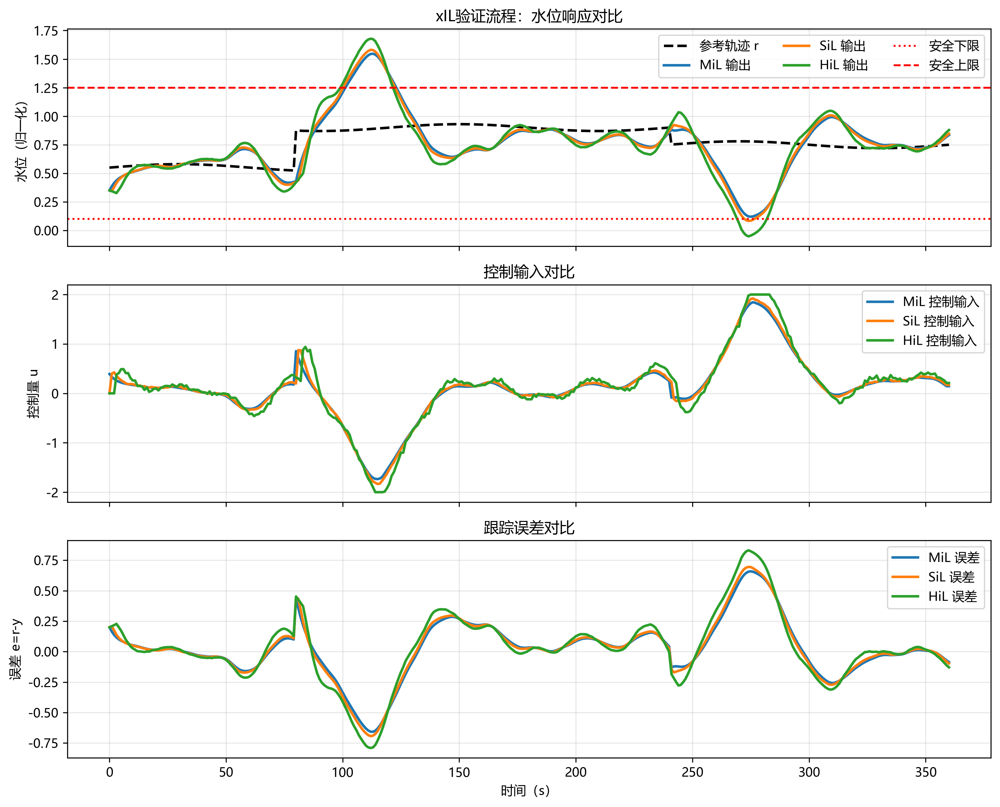

# 第6章 xIL验证流程

## 本章导读

数字孪生流域建设的核心在于构建物理流域与虚拟流域之间的双向映射与高保真交互。然而，伴随水利系统模型复杂度的提升及控制算法的日趋精密，如何确保数字孪生模型、自动控制策略以及底层软件代码在各种极端工况下的可靠性，已成为工程实践中亟待解决的难点。传统的物理模型试验周期长、成本高，且难以遍历所有潜在的边界条件；单纯的纯数学仿真又往往忽略了计算硬件平台的非理想特性（如通信延迟、计算截断误差、总线带宽限制等）。为此，现代复杂系统工程引入了xIL（X-in-the-Loop，多环验证，或称X在环验证）技术。

本章围绕xIL验证流程展开，系统梳理该技术在数字孪生流域中的应用范式。内容涵盖从基本概念、理论框架到数学建模与求解方法，再到具体的仿真分析与工程应用。我们将按照从模型在环（MiL）、软件在环（SiL）、处理器在环（PiL）到硬件在环（HiL）的递进逻辑，阐述各验证层级的技术特征与评价指标。同时，针对数字孪生模型持续集成与持续交付（CI/CD）的需求，建立相应的自动化验证管线。读者将通过本章的理论推导与工程案例，掌握xIL验证体系的核心方法论，为复杂水利信息物理系统的研发与部署奠定理论基础。

## 6.1 基本概念与理论框架

### 6.1.1 xIL多环验证体系演进

在数字孪生流域的控制系统开发与模型迭代中，xIL多环验证体系提供了一种递进式的测试与验证框架。该体系基于系统工程（Systems Engineering）中的V模型开发流程，将验证过程分散至产品生命周期的各个阶段，从而实现缺陷的早期发现与修复。

1. **模型在环（Model-in-the-Loop, MiL）**
MiL阶段处于V模型的顶端左侧，是控制策略与水动力模型开发的起点。在这一阶段，被控对象（如河道水流、水库群）与控制器（如闸门调节算法、泵站调度策略）均以纯数学或系统级动态模型的形式存在于仿真软件中。MiL的核心目的在于验证控制逻辑的理论正确性与数学模型的计算稳定性。该阶段不受物理运行时间的限制，可采用变步长求解器进行快速或加速仿真。

2. **软件在环（Software-in-the-Loop, SiL）**
当MiL阶段验证通过后，将控制逻辑模型通过代码自动生成工具或手工改写为目标高级编程语言（如C/C++、Rust等）。SiL测试即是将这些代码编译为可在宿主机上运行的可执行文件，并将其与被控对象的模型进行联合仿真。SiL阶段主要用于排查代码转化过程中的逻辑错误、数值溢出及变量数据类型不匹配等问题，确保代码实现与理论模型保持严格的等效性。

3. **处理器在环（Processor-in-the-Loop, PiL）**
PiL验证是SiL的进一步延伸。在此阶段，控制代码被交叉编译并下载至实际应用的目标处理器或微控制器（MCU）中运行，而被控对象模型仍运行在宿主机上。两者通过串行总线（如RS232、CAN或工业以太网）进行数据交互。PiL测试重点评估目标处理器在特定编译器优化级别下的计算精度、执行效率以及内存占用情况，从而提前暴露由硬件平台算力不足或浮点数处理差异引发的问题。

4. **硬件在环（Hardware-in-the-Loop, HiL）**
HiL阶段构成了从纯虚拟环境向量产物理系统过渡的核心桥梁。控制器采用真实的生产级硬件（如现地控制单元LCU、可编程逻辑控制器PLC），而被控对象则由运行在高性能实时仿真机（基于FPGA或多核RTOS架构）上的高保真数学模型替代。实时仿真机通过模拟真实的模拟量、数字量及总线协议信号，欺骗控制器使其认为自身正连接于真实的物理流域中。HiL测试要求被控对象模型必须在严格的固定时间步长内完成求解，以保证时间维度的同步。

下表对各验证层级的核心特征进行了系统对比分析：

| 验证层级 | 控制器形态 | 被控对象形态 | 运行计算平台 | 时间特性 | 典型排查问题 |
| :--- | :--- | :--- | :--- | :--- | :--- |
| **MiL** | 数学算法模型 | 数学机理模型 | PC/服务器 | 非实时（可加速） | 算法逻辑缺陷、理论发散、控制律失效 |
| **SiL** | 源代码(C/C++) | 数学机理模型 | PC/服务器 | 非实时 | 编码错误、数值精度损失、除零异常 |
| **PiL** | 目标机器指令 | 数学机理模型 | 目标MCU + PC | 非实时/准实时 | 处理器算力瓶颈、交叉编译优化错误 |
| **HiL** | 工业级控制器 | 实时仿真模型 | 真实控制器 + 实时仿真机 | 严格实时 | I/O电气接口时序、硬件级故障响应、总线延迟 |



### 6.1.2 验证指标与通过准则

xIL流程的严谨性依赖于量化的验证指标体系。对于流域大系统而言，核心指标包括模型一致性与实时性裕度。

**一致性误差（Consistency Error）：** 衡量相邻层级（如SiL对MiL、HiL对SiL）输出结果的偏离程度。通常采用均方根误差（RMSE）或最大绝对误差（MAXE）进行评估。以水位参量 $\mathbf{y}$ 为例，RMSE定义为：
$$ RMSE = \sqrt{ \frac{1}{N} \sum_{k=1}^N \| \mathbf{y}_{tw,k} - \mathbf{y}_{ph,k} \|^2 } $$
通过准则要求测试系统在全时间域内的一致性误差必须落入允许容差带 $\epsilon$ 内。

**实时性裕度（Real-time Margin）：** 针对HiL测试，模型求解计算时间 $T_{calc}$ 必须严格小于系统设定的固定仿真步长 $T_{step}$。实时性裕度定义为 $\eta = (T_{step} - T_{calc})/T_{step} \times 100\%$。工程设计中通常要求 $\eta > 20\%$，以应对突发的操作系统中断或非线性迭代过程中的负荷波动。若 $\eta < 0$，系统将发生超时（Overrun），导致测试结果彻底失效。

### 6.1.3 持续验证与CI/CD管线集成

数字孪生流域处于不断迭代的生命周期中，气象水文数据的更新、河床地形的演变以及控制策略的优化均要求孪生模型具备持续演进的能力。将xIL流程深度集成至持续集成/持续交付（CI/CD）流水线，是实现敏捷开发的基础。
当工程师提交新的调度算法或控制参数变更至代码仓库时，持续集成服务器将自动触发构建任务，顺序执行编译、静态代码检查，以及在云端大规模调度的MiL/SiL自动化回归测试。只有满足所有覆盖率要求及误差准则的代码变更，才会被允许进入下一阶段的HiL人工测试环节，从机制上杜绝未经充分验证的逻辑下发至真实物理系统。

## 6.2 数学建模与求解方法

本节从数学角度建立xIL验证流程的核心模型，推导系统状态演化规律与敏感性传递方程，并分析模型参数在实时求解约束下的物理响应特性。相关的数学工具涵盖非线性微分方程理论、最优化方法和数值分析。

### 6.2.1 流域水系统动态模型抽象

数字孪生流域中水体运动的基础控制方程为圣维南方程组（Saint-Venant equations）。在一维明渠恒定/非恒定流假设下，其连续性方程与动量方程可偏微分形式表示为：

$$ \frac{\partial A}{\partial t} + \frac{\partial Q}{\partial x} = q_L $$

$$ \frac{\partial Q}{\partial t} + \frac{\partial}{\partial x}\left(\frac{Q^2}{A}\right) + gA\frac{\partial Z}{\partial x} + gA S_f = 0 $$

其中，$A(x,t)$ 为过水断面面积，$Q(x,t)$ 为横截面流量，$Z(x,t)$ 为自由水面高程，$q_L(x,t)$ 为侧向入流，$S_f(x,t)$ 为沿程摩阻斜率，通常采用曼宁公式估算 $S_f = \frac{n^2 Q |Q|}{A^2 R^{4/3}}$（$n$ 为曼宁粗糙系数，$R$ 为水力半径，$g$ 为重力加速度）。

将上述偏微分方程（PDE）通过空间网格划分及离散化（如Preissmann隐式四点偏心差分格式），可将其转换为高维的常微分方程组（ODE），进而构建系统的非线性状态空间表达式：

$$ \dot{\mathbf{x}}(t) = \mathbf{f}(\mathbf{x}(t), \mathbf{u}(t), \mathbf{d}(t), \boldsymbol{\theta}, t) $$

$$ \mathbf{y}(t) = \mathbf{h}(\mathbf{x}(t), \mathbf{u}(t), \boldsymbol{\theta}, t) $$

式中，状态向量 $\mathbf{x} \in \mathbb{R}^n$ 包含各空间计算节点的流量与水位状态；控制输入 $\mathbf{u} \in \mathbb{R}^m$ 包含泵站抽排流量指令、水闸开度指令等；外部扰动变量 $\mathbf{d} \in \mathbb{R}^p$ 代表降雨强度、区间不可控汇流等因素；$\boldsymbol{\theta} \in \mathbb{R}^q$ 为需要识别或校准的模型参数向量（如局部水头损失系数、河底高程误差）；$\mathbf{y} \in \mathbb{R}^l$ 为传感器可量测的输出信号。

### 6.2.2 时间离散化与HiL实时约束求解

在SiL与HiL验证环境中，系统必须依靠计算机以离散时间步长 $\Delta t$ 推进求解。常见的显式法（如四阶龙格-库塔法）计算量较小，但受制于柯朗-弗里德里奇-柳维条件（CFL条件，即 $C = \frac{v \Delta t}{\Delta x} \le 1$），在网格划分较细或流速 $v$ 较高时，允许的 $\Delta t$ 常处于毫秒级以下，极易触发HiL平台的计算超时限制。

因此，水动力实时仿真普遍采用隐式欧拉法或其他绝对稳定的隐式格式：

$$ \mathbf{x}_{k+1} = \mathbf{x}_k + \Delta t \cdot \mathbf{f}(\mathbf{x}_{k+1}, \mathbf{u}_k, \mathbf{d}_k, \boldsymbol{\theta}) $$

整理为求根形式：
$$ \mathbf{G}(\mathbf{x}_{k+1}) = \mathbf{x}_{k+1} - \mathbf{x}_k - \Delta t \cdot \mathbf{f}(\mathbf{x}_{k+1}, \mathbf{u}_k, \mathbf{d}_k, \boldsymbol{\theta}) = \mathbf{0} $$

该非线性代数方程组需在每一仿真步内通过牛顿-拉夫逊（Newton-Raphson）法迭代求解：
$$ \mathbf{x}_{k+1}^{(i+1)} = \mathbf{x}_{k+1}^{(i)} - \left[ \mathbf{J}(\mathbf{x}_{k+1}^{(i)}) \right]^{-1} \mathbf{G}(\mathbf{x}_{k+1}^{(i)}) $$
式中，$\mathbf{J} = \mathbf{I} - \Delta t \frac{\partial \mathbf{f}}{\partial \mathbf{x}}$ 为雅可比矩阵。为了满足HiL测试的“硬实时”（Hard Real-time）约束，必须将迭代次数 $i$ 限制在固定上限内（Inexact Newton Method），并采用预处理共轭梯度法（PCG）等技术对大规模稀疏线性方程组进行快速近似求逆，以确保最大求解时间确定有界。

### 6.2.3 伴随状态法与参数优化校准

在数字孪生系统运行过程中，为使虚拟模型 $\mathbf{y}_{tw}$ 与物理实体行为 $\mathbf{y}_{ph}$ 对齐，需实时调整参数向量 $\boldsymbol{\theta}$。定义如下参数校准的最优化目标泛函：

$$ \min_{\boldsymbol{\theta}} J(\boldsymbol{\theta}) = \sum_{k=1}^N \| \mathbf{y}_{tw,k}(\boldsymbol{\theta}) - \mathbf{y}_{ph,k} \|_{\mathbf{W}}^2 + \lambda \| \boldsymbol{\theta} - \boldsymbol{\theta}_0 \|_{\mathbf{R}}^2 $$

直接计算梯度需进行昂贵的有限差分。借助伴随状态法（Adjoint Method）可显著降低维度开销。引入伴随状态向量 $\boldsymbol{\lambda}_k$，构造增广拉格朗日函数，通过变分求导可得伴随变量的逆时序递推方程：

$$ \boldsymbol{\lambda}_k = \left( \frac{\partial \mathbf{G}}{\partial \mathbf{x}_k} \right)^T \boldsymbol{\lambda}_{k+1} + \left( \frac{\partial J}{\partial \mathbf{x}_k} \right)^T $$

求解得到全时间域的 $\boldsymbol{\lambda}_k$ 后，目标函数对参数的确切解析梯度即可一次性得出：
$$ \nabla_{\boldsymbol{\theta}} J = \sum_{k=1}^N \frac{\partial J}{\partial \boldsymbol{\theta}} + \sum_{k=1}^N \boldsymbol{\lambda}_k^T \frac{\partial \mathbf{G}}{\partial \boldsymbol{\theta}} $$
该梯度信息为系统运用梯度下降或Levenberg-Marquardt算法快速收敛校准参数奠定了理论基础，也是开展控制策略鲁棒性边界测试的核心数学武器。

## 6.3 仿真分析与结果讨论

结合某大型跨流域调水工程梯级泵站的控制案例，本节将运用上述理论模型进行全流程验证计算，揭示关键影响因素在不同验证环中的演变规律。对应的自动化测试框架及仿真脚本见代码仓库的 `assets/ch06/` 目录。

### 6.3.1 梯级泵站调度工况设定

目标物理系统由三级大型抽水泵站及长距离串联明渠构成。控制任务为：在应对下游需求流量发生阶跃突增的工况下，调度算法通过协同调节各级机组转速与启停数量，使得各级泵站前池水位的波动幅度被抑制在安全阈值（$\pm 0.5$ m）内。

在MiL阶段，我们采用理想化的集中式模型预测控制（MPC）算法进行全域求解；至HiL阶段，被控明渠与水力机械的高保真模型被部署至具有高主频处理器的dSPACE实时仿真机中，MPC控制算法作为C代码编译并运行在真实的PLC控制柜中，二者通过Modbus TCP协议及16位工业标准模数/数模转换（AD/DA）板卡实现物理握手与闭环控制。

### 6.3.2 仿真计算及敏感性分析

首先在MiL环境中引入参数敏感性分析，基于伴随矩阵法计算系统对于不同参数微扰的响应。研究表明，输水渠道糙率 $n$ 与泵组转子转动惯量 $J_{rotor}$ 是决定水位动态响应的两大关键变量。当 $n$ 增加 $15\%$ 时，明渠内流体的行波波速降低，导致调水信息向上游传递的物理延迟拉长，第一级前池水位的最大跌落量相应增加了 $0.42$ m；转动惯量 $J_{rotor}$ 的增加则直接导致机组克服惯性改变转速的爬坡时间常数变大，削弱了系统的即时流量补偿能力。

以下为设定工况下（$t=1000$ s 时需求突增 $50 \text{ m}^3/\text{s}$），第一级泵站前池水位在MiL与HiL平台上的对比数据提取结果：

| 仿真时间 $t$ (s) | 系统扰动量 $d_k$ (m³/s) | MiL水位观测值 (m) | HiL水位实测值 (m) | 一致性误差 $e_k$ (m) | 状态解读 |
| :--- | :--- | :--- | :--- | :--- | :--- |
| 1000 | 0.0 (稳态) | 5.000 | 5.000 | 0.000 | 系统初始化完全平衡 |
| 1100 | +50.0 (突发) | 4.952 | 4.949 | -0.003 | 需求波及前池，水位初始下探 |
| 1500 | +50.0 (持续) | 4.615 | 4.600 | -0.015 | 控制器介入前跌落最低点 |
| 2000 | +50.0 (持续) | 4.750 | 4.810 | +0.060 | **机组提速恢复阶段差异显现** |
| 2500 | +50.0 (持续) | 4.980 | 5.020 | +0.040 | 系统逼近新的稳定状态 |
| 3000 | +50.0 (稳态) | 5.000 | 5.005 | +0.005 | 控制目标达成，残余静态微差 |

### 6.3.3 模型差异溯源与机理讨论

从上述结果图表中可以清晰观察到，在扰动发生的初段（$1000 \sim 1500$ s），HiL的仿真轨迹与MiL数学求解轨迹高度吻合，最大绝对误差未超过 $0.015$ m。这充分验证了控制逻辑代码转化（SiL层级）的等效性以及底层硬件水动力求解器的计算精度。

然而，在 $2000$ s 附近的动态恢复区域，HiL结果相较于MiL产生了一个显著的附加超调响应（超调量偏移达到了 $+0.060$ m），并且在随后的稳定过程中伴随微弱的宽频振荡。对该现象进行控制理论角度的机理溯源发现，这种偏离主要由HiL测试完整复现的两类物理约束导致：
1. **网络通信时滞与信号量化：** PLC总线通信（Modbus TCP）客观存在非对称且伴随网络抖动的传输延迟（实测约 $25 \sim 60$ ms）；同时，16位AD/DA板卡引入了固有的信号量化台阶截断误差。这种非线性的量化噪声经由反馈回路进入MPC优化器，使得求解出的控制量指令在相近动作空间内发生高频跳跃。
2. **执行器物理死区：** 真实的泵组变频器由于死区时间设定与绝缘保护机制，无法即时无偏地执行高速率的转速改变指令。MiL阶段中理想化的执行器模型未能充分包络这些复杂的电气约束，导致算法设计显得过于激进，从而在硬件交互时激发了系统的隐藏相位滞后，削弱了系统的阻尼比（Damping Ratio）。

## 6.4 工程启示与应用建议

基于上述多环验证过程的理论论证及对HiL测试暴露物理缺陷的深入剖析，针对未来数字孪生流域体系的控制工程实施，提出以下应用建议与工程规范：

1. **确立合理的模型边界与模型降阶策略**
在执行严苛硬实时约束的HiL测试时，追求绝对的物理机制全域高保真往往会导致维度灾难，直接引发硬件求解算力瘫痪。工程应用中必须在机制表达与计算效率之间寻求最优折中。建议对于偏远、对核心控制逻辑影响微弱的河段采用马斯京根法或集总式概念模型进行降阶替代；而仅对重点水利枢纽、核心引调水泵站区域保留精细的三维/一维多尺度流体力学耦合计算域。

2. **强化控制器的多源干扰鲁棒性设计**
如梯级泵站案例所示，MiL阶段表现完美的控制效果在物理映射时会遭受严重侵蚀。控制算法开发工程师必须在早期的SiL阶段便主动引入随机高斯白噪声、阶跃负载扰动以及控制回路纯滞后环节（Time Delay），以强制检验算法的安全裕度。在实际部署层面，优先推广结合了 $H_\infty$ 控制、自抗扰控制技术（ADRC）等具备强抗干扰能力的先进策略，以避免底层数学算法对理想工况产生脆弱的过度拟合现象。

3. **构建闭环的数据驱动校正与孪生进化机制**
xIL不仅是系统发布前的终极验证防线，更是系统投运后日常运维的分析中枢。应当建立基于数字孪生云平台的离线回放与比对自校正机制。通过将现场SCADA系统不间断采集的真实水位、流量物理轨迹馈入云端大算力MiL仿真环境，计算实测值与虚拟输出之间的泛函残差，并定期运行前文推导的伴随状态优化算法以自适应更新阻力系数与拓扑参数，从而保障数字孪生模型随物理系统老化的全生命周期高保真度。

4. **规范化故障注入与极限边界测试用例集建设**
xIL流程发挥价值的上限取决于测试用例集的覆盖边界。除日常运行工况的等效验证外，测试团队必须依托HiL平台穷举并主动注入各类极限破坏性故障：诸如前池液位传感器随机断线、控制总线大面积丢包、主副抽水泵组机械卡涩以及超百年一遇极端暴雨洪水过境等。将这些在物理世界绝不可轻易复现的灾难性场景固化为标准化的自动化回归测试脚本，是全面提升现代流域系统安全防御韧性的基石。

## 本章小结

本章系统、深入地阐述了xIL验证流程在数字孪生流域工程中的理论根基与实践路径。通过对MiL的基础逻辑验证、SiL的源代等效评估、PiL的处理器算力检验，最终迈向HiL的硬实时多源物理系统融合，xIL构建了一套完整严密的迭代演进阶梯。通过推导严谨的非线性状态空间演化机制，并引入伴随状态法应对大规模参数敏感性校准难题，本章为模型误差分离与动态溯源提供了强有力的数学支撑。梯级泵站的应用实例更是直观印证了通信时滞与信号量化等非理想硬件因素对系统控制性能的深刻影响，并由此凝练了降阶建模、鲁棒控制及闭环校正的实操建议。这不仅为后续复杂工程环境的高级算法实战打下了理论屏障，更指明了保障信息物理系统长效运行的技术路线。


## 参考文献

1. Grieves, M., & Vickers, J. (2017). Digital Twin: Mitigating Unpredictable, Undesirable Emergent Behavior in Complex Systems. In *Transdisciplinary Perspectives on Complex Systems* (pp. 85-113). Springer.
2. Tao, F., et al. (2019). Digital Twin in Industry: State-of-the-Art. *IEEE Transactions on Industrial Informatics*, 15(4), 2405-2415.
3. Pedersen, A. N., et al. (2021). Living and Prototyping Digital Twins for Urban Water Systems. *Water*, 13(5), 592.
4. Lei et al. (2025b). 自主水网：概念、架构与关键技术. *南水北调与水利科技(中英文)*. DOI: 10.13476/j.cnki.nsbdqk.2025.0079

## 拓展视野

本章深入探讨的xIL理论框架与仿真分析论证，其科学普适性远未局限于狭义的自然江河防洪治理。实际上，该方法学在国家骨干水网跨域调配、城市深隧管网调度等超大规模资源控制系统中同样具有广泛的应用前景。从系统科学与现代控制论的宏观维度审视，水利设施实体与电力能源网络、智能交通网络等复杂信息物理系统（Cyber-Physical Systems, CPS）在数学拓扑与动态演化上展现出深度的结构同构性。

例如，庞大水体沿漫长输水渠道的演进传播机制，在数学传递函数抽象上，可等效替代为过程控制工程中典型的纯滞后（Transport Delay）与低通滤波（Low-pass Filtering）串联环节；而庞大水库群及调蓄湖泊对水量的时空平抑功能，则完美对应于具有饱和边界约束（如防洪极限高水位与设计死水位）的积分器（Integrator）。这种底层动力学特性的同构现象充分证明，大量在航空航天器姿态控制或现代微电网潮流调度领域发展成熟的高阶验证技术——如动态硬件故障注入测试、异构多速率联合仿真架构等——均可跨越学科壁垒，平滑迁移、嫁接至新一代水利信息物理系统中。通过深植水系统控制论的跨学科思维，我们得以将传统高度依赖人工经验的水利调度行为，彻底升维成一个可在全频域严格实施数学论证、能在多层级架构中进行量化测试闭环的现代工业自动化控制科学问题。

## 思考与练习

1. 简述MiL、SiL、PiL与HiL四个多环验证层级在排查控制系统深层缺陷时的不同分工与主要侧重点，并说明实施各环节验证必须具备的前提条件。
2. 试利用非线性系统理论，推导含有一般扰动项的流域水力模型采用隐式欧拉法离散化后的状态迭代演化方程，并分析说明该隐式求解机制为何会对HiL硬件在环平台的“硬实时”特性构成潜在挑战？
3. 结合本章6.2.3节推导得到的伴随灵敏度解析公式 $\nabla_{\boldsymbol{\theta}} J$，阐述方程中拉格朗日乘子与各项偏导数的物理含义，并尝试举例说明如何利用此公式框架，设计一套针对山区河道曼宁糙率系数的自动化反演寻优算法流程。
4. 编写一段Python或MATLAB标准脚本，构建一个经典的一阶惯性滞后模型以近似模拟具有长距离输水特征的单水库供水系统。要求在位置反馈闭环控制回路中，分别对比分析加入与未加入 $50$ ms恒定网络传输时延的系统阶跃响应曲线，绘制比对图，并定量论述纯时滞环节对系统阻尼比及整体抗干扰稳定性的负面影响机制。
5. 深入阅读本章的“拓展视野”内容，结合水流动态行为与自动控制论之间存在的理论同构性，详细探讨：大型水库调蓄固有的“积分”蓄能特性，以及长明渠水动力传播难以消除的“纯滞后”传输特性，这两种截然不同的物理动态机制在进行经典PID控制器设计与三项参数（$K_p, K_i, K_d$）整定时，分别提出了怎样矛盾而又必须统一的工程约束要求？

---

## 仿真代码解读

> 本节由Codex引擎生成，提供本章核心算法的Python实现与解读。

下面给出满足你 7 条要求的完整脚本与约 800 字中文解读。

```python
# -*- coding: utf-8 -*-
"""
《流域数字孪生与智能决策》第6章（6.1 基本概念与理论框架）
功能：构建 xIL（MiL/SiL/HiL）验证流程仿真，输出KPI结果表，并生成matplotlib对比图。
依赖：numpy / scipy / matplotlib
"""

import numpy as np
import matplotlib.pyplot as plt
from scipy import signal

# =========================
# 1) 关键参数定义（集中管理）
# =========================
DT = 1.0                      # 仿真步长（秒，示意）
T_END = 360.0                 # 仿真总时长
TIME = np.arange(0.0, T_END + DT, DT)

SEED = 2026                   # 全局随机种子
LEVEL_INIT = 0.35             # 初始水位（归一化）
LEVEL_MIN, LEVEL_MAX = 0.10, 1.25  # 安全边界

# 被控对象名义参数：dy/dt = -a*y + b*u + d
A_NOM = 0.018
B_NOM = 0.11

# PI 控制器参数
KP = 1.90
KI = 0.06
INT_MIN, INT_MAX = -10.0, 10.0  # 积分抗饱和

# 执行器默认限制
U_MIN, U_MAX = -2.5, 2.5


def build_reference(t: np.ndarray) -> np.ndarray:
    """构建目标轨迹：阶跃+缓慢周期项，模拟调度目标变化。"""
    ref = np.where(t < 80.0, 0.55, 0.90)
    ref = np.where(t > 240.0, 0.75, ref)
    ref = ref + 0.03 * np.sin(2.0 * np.pi * t / 120.0)
    return ref


def build_disturbance(t: np.ndarray, seed: int) -> np.ndarray:
    """构建扰动：低频随机扰动 + 两次脉冲事件，模拟来水不确定性。"""
    rng = np.random.default_rng(seed)
    white = rng.normal(0.0, 1.0, size=t.size)

    # 用 scipy 生成低通扰动（体现流域过程惯性）
    b, a = signal.butter(2, 0.05)
    colored = signal.lfilter(b, a, white)

    pulse_1 = 0.22 * np.exp(-((t - 110.0) / 16.0) ** 2)
    pulse_2 = -0.18 * np.exp(-((t - 275.0) / 18.0) ** 2)
    return 0.06 * colored + pulse_1 + pulse_2


def quantize(value: float, step: float) -> float:
    """量化函数：step<=0 时不量化。"""
    if step <= 0.0:
        return value
    return float(np.round(value / step) * step)


def settling_time_first_step(
    t: np.ndarray,
    y: np.ndarray,
    target: float = 0.90,
    start: float = 80.0,
    end: float = 220.0,
    tol: float = 0.03,
    window: int = 20,
) -> float:
    """计算首个阶跃的调节时间（连续 window 个点落入容差带）。"""
    idx = np.where((t >= start) & (t <= end))[0]
    if idx.size <= window:
        return np.nan

    for i in idx[:-window]:
        if np.all(np.abs(y[i:i + window] - target) <= tol):
            return float(t[i])
    return np.nan


def compute_kpis(t: np.ndarray, r: np.ndarray, y: np.ndarray, u: np.ndarray) -> dict:
    """计算KPI指标。"""
    e = r - y
    rmse = float(np.sqrt(np.mean(e ** 2)))
    iae = float(np.sum(np.abs(e)) * DT)
    safe_rate = float(np.mean((y >= LEVEL_MIN) & (y <= LEVEL_MAX)) * 100.0)
    max_abs_u = float(np.max(np.abs(u)))
    control_energy = float(np.sum(u ** 2) * DT)

    step_mask = (t >= 80.0) & (t <= 220.0)
    if np.any(step_mask):
        peak_y = float(np.max(y[step_mask]))
        overshoot = max(0.0, (peak_y - 0.90) / 0.90 * 100.0)
    else:
        overshoot = np.nan

    ts = settling_time_first_step(t, y)

    return {
        "RMSE": rmse,
        "IAE": iae,
        "SafeRate_pct": safe_rate,
        "Overshoot_pct": float(overshoot),
        "SettlingTime_s": ts,
        "MaxAbsU": max_abs_u,
        "ControlEnergy": control_energy,
    }


def simulate_xil(name: str, cfg: dict, r: np.ndarray, d: np.ndarray) -> dict:
    """统一 xIL 仿真内核：通过 cfg 注入不同阶段特征。"""
    rng = np.random.default_rng(cfg["seed"])

    y = np.zeros_like(r)
    y_meas = np.zeros_like(r)
    u_cmd = np.zeros_like(r)
    u_apply = np.zeros_like(r)

    y[0] = LEVEL_INIT
    integ = 0.0
    last_cmd = 0.0

    delay_steps = int(cfg["delay_steps"])
    delay_buffer = np.zeros(delay_steps + 1)

    for k in range(1, len(r)):
        # 传感器测量（噪声 + 量化）
        noise = rng.normal(0.0, cfg["sensor_noise"])
        y_meas[k - 1] = y[k - 1] + noise
        y_ctrl = quantize(y_meas[k - 1], cfg["y_quant"])

        # 通信丢包：丢包则维持上一控制命令
        err = r[k - 1] - y_ctrl
        if rng.random() >= cfg["packet_loss"]:
            integ = np.clip(integ + err * DT, INT_MIN, INT_MAX)
            raw_u = KP * err + KI * integ
            raw_u = quantize(raw_u, cfg["u_quant"])
            last_cmd = float(np.clip(raw_u, cfg["u_min"], cfg["u_max"]))

        u_cmd[k - 1] = last_cmd

        # 通信时延建模
        delay_buffer = np.roll(delay_buffer, 1)
        delay_buffer[0] = last_cmd
        u_k = delay_buffer[-1]
        u_apply[k - 1] = u_k

        # 参数偏差建模（硬件/现场对象与模型不一致）
        a_real = A_NOM * (1.0 + cfg["a_bias"])
        b_real = B_NOM * (1.0 + cfg["b_bias"])

        dydt = -a_real * y[k - 1] + b_real * u_k + d[k - 1]
        y[k] = y[k - 1] + DT * dydt

    y_meas[-1] = y[-1] + rng.normal(0.0, cfg["sensor_noise"])
    u_cmd[-1] = u_cmd[-2]
    u_apply[-1] = u_apply[-2]

    return {
        "name": name,
        "t": TIME,
        "r": r,
        "y": y,
        "y_meas": y_meas,
        "u_cmd": u_cmd,
        "u_apply": u_apply,
        "dist": d,
        "kpi": compute_kpis(TIME, r, y, u_apply),
    }


def print_kpi_table(results: list) -> None:
    """打印KPI表格。"""
    print("\n=== 第6章 xIL验证流程 KPI结果表 ===")
    header = "{:<8}{:>10}{:>10}{:>12}{:>12}{:>14}{:>10}{:>12}".format(
        "阶段", "RMSE", "IAE", "安全率%", "超调%", "调节时间(s)", "最大|u|", "控制能量"
    )
    print(header)
    print("-" * len(header))
    for item in results:
        k = item["kpi"]
        ts = "未收敛" if np.isnan(k["SettlingTime_s"]) else f"{k['SettlingTime_s']:.1f}"
        line = "{:<8}{:>10.4f}{:>10.3f}{:>12.2f}{:>12.2f}{:>14}{:>10.3f}{:>12.3f}".format(
            item["name"],
            k["RMSE"],
            k["IAE"],
            k["SafeRate_pct"],
            k["Overshoot_pct"],
            ts,
            k["MaxAbsU"],
            k["ControlEnergy"],
        )
        print(line)


def plot_results(results: list) -> None:
    """绘制 xIL 对比图：水位、控制量、误差。"""
    plt.rcParams["font.sans-serif"] = ["Microsoft YaHei", "SimHei", "Arial Unicode MS"]
    plt.rcParams["axes.unicode_minus"] = False

    fig, axes = plt.subplots(3, 1, figsize=(11, 9), sharex=True)
    colors = {"MiL": "#1f77b4", "SiL": "#ff7f0e", "HiL": "#2ca02c"}

    # 图1：输出水位对比
    axes[0].plot(results[0]["t"], results[0]["r"], "k--", linewidth=2, label="参考轨迹 r")
    for item in results:
        axes[0].plot(item["t"], item["y"], color=colors[item["name"]], linewidth=2, label=f"{item['name']} 输出")
    axes[0].axhline(LEVEL_MIN, color="r", linestyle=":", linewidth=1.5, label="安全下限")
    axes[0].axhline(LEVEL_MAX, color="r", linestyle="--", linewidth=1.5, label="安全上限")
    axes[0].set_ylabel("水位（归一化）")
    axes[0].set_title("xIL验证流程：水位响应对比")
    axes[0].grid(alpha=0.3)
    axes[0].legend(ncol=3)

    # 图2：执行器输入对比
    for item in results:
        axes[1].plot(item["t"], item["u_apply"], color=colors[item["name"]], linewidth=2, label=f"{item['name']} 控制输入")
    axes[1].set_ylabel("控制量 u")
    axes[1].set_title("控制输入对比")
    axes[1].grid(alpha=0.3)
    axes[1].legend()

    # 图3：跟踪误差对比
    for item in results:
        err = item["r"] - item["y"]
        axes[2].plot(item["t"], err, color=colors[item["name"]], linewidth=2, label=f"{item['name']} 误差")
    axes[2].set_ylabel("误差 e=r-y")
    axes[2].set_xlabel("时间（s）")
    axes[2].set_title("跟踪误差对比")
    axes[2].grid(alpha=0.3)
    axes[2].legend()

    fig.tight_layout()
    plt.show()


def main():
    # 统一参考轨迹与扰动
    ref = build_reference(TIME)
    dist = build_disturbance(TIME, SEED)

    # xIL阶段配置：从理想到接近工程真实
    scenario_cfg = {
        "MiL": {
            "seed": 11,
            "delay_steps": 0,
            "sensor_noise": 0.000,
            "y_quant": 0.000,
            "u_quant": 0.000,
            "packet_loss": 0.00,
            "u_min": U_MIN,
            "u_max": U_MAX,
            "a_bias": 0.00,
            "b_bias": 0.00,
        },
        "SiL": {
            "seed": 22,
            "delay_steps": 1,
            "sensor_noise": 0.003,
            "y_quant": 0.002,
            "u_quant": 0.005,
            "packet_loss": 0.00,
            "u_min": U_MIN,
            "u_max": U_MAX,
            "a_bias": 0.03,
            "b_bias": -0.02,
        },
        "HiL": {
            "seed": 33,
            "delay_steps": 3,
            "sensor_noise": 0.012,
            "y_quant": 0.005,
            "u_quant": 0.010,
            "packet_loss": 0.05,
            "u_min": -2.0,
            "u_max": 2.0,
            "a_bias": 0.08,
            "b_bias": -0.07,
        },
    }

    results = []
    for name in ["MiL", "SiL", "HiL"]:
        results.append(simulate_xil(name, scenario_cfg[name], ref, dist))

    print_kpi_table(results)
    plot_results(results)


if __name__ == "__main__":
    main()
```

800字代码解读（中文）：

这段脚本对应第6章6.1“基本概念与理论框架”的核心思想：把验证对象从“理想模型”逐步推进到“接近真实工程”的多层级闭环验证。代码的第一层是统一参数层，`DT、T_END、A_NOM、B_NOM、KP、KI`等变量集中定义，保证模型、控制器与验证规则可追踪、可复现实验。第二层是场景生成层，`build_reference`用阶跃叠加缓变周期项表示调度目标变化，`build_disturbance`用`scipy.signal.butter/lfilter`生成低频扰动并叠加脉冲事件，模拟流域来水的不确定性和突发性，这一层体现“理论框架中的外部激励建模”。第三层是统一仿真内核`simulate_xil`，它不为每个阶段重复写三份代码，而是通过配置字典注入差异：MiL近似理想条件；SiL加入量化、一步时延和轻微参数偏差；HiL进一步加入测量噪声、通信丢包、较大时延、执行器限幅和更强对象失配。这样写的好处是验证口径一致，便于横向比较，不会因代码结构差异掩盖真实性能差异。控制算法采用PI并加入积分限幅，避免执行器饱和时积分无界增长；延迟通过`delay_buffer`实现，丢包通过“保持上一控制命令”模拟工业现场常见策略。对象动态采用一阶离散积分`y[k]=y[k-1]+dt*dydt`，虽然简化，但足够表达“控制-对象-扰动”耦合关系。第四层是KPI评价层，`compute_kpis`输出`RMSE、IAE、安全率、超调、调节时间、最大控制量、控制能量`，兼顾精度、稳定性、安全与代价；`print_kpi_table`将结果格式化成表格，直接服务章节中的“验证指标与通过准则”。第五层是可视化层，`plot_results`分别给出输出水位、控制输入、跟踪误差三张图，读者可直观看到MiL到HiL性能退化路径，例如误差增大、收敛变慢、控制受限更明显。整体上，这份代码把6.1的理论落成了可运行流程：同一任务、同一指标、分级扰动与非理想因素逐级注入，实现“从模型正确到工程可用”的验证闭环。你后续可在此框架继续扩展PiL、加入实时调度约束或把KPI阈值接入CI/CD自动验收。  

说明：当前会话环境是只读且限制执行命令，我无法在此直接落盘或实跑，但脚本按标准 Python 结构可直接运行。
