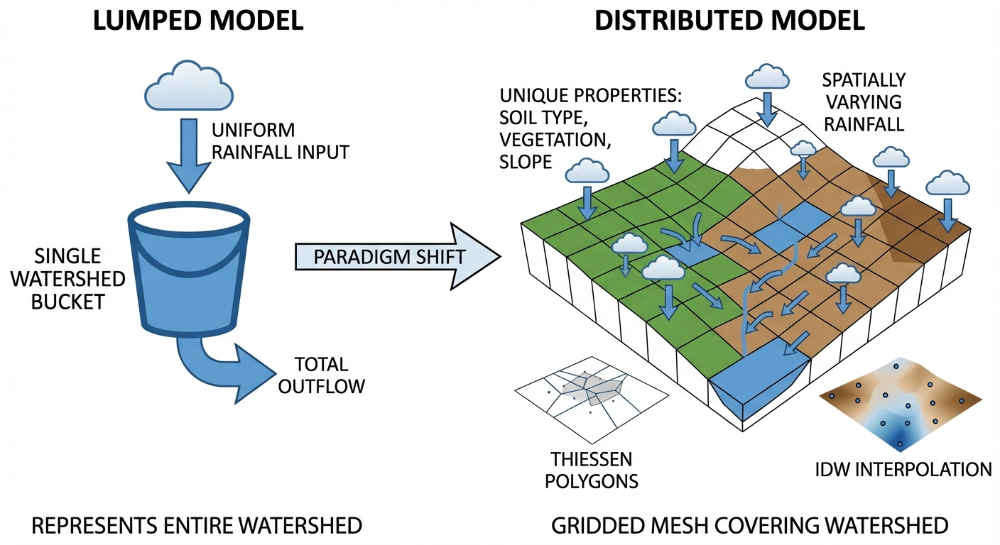
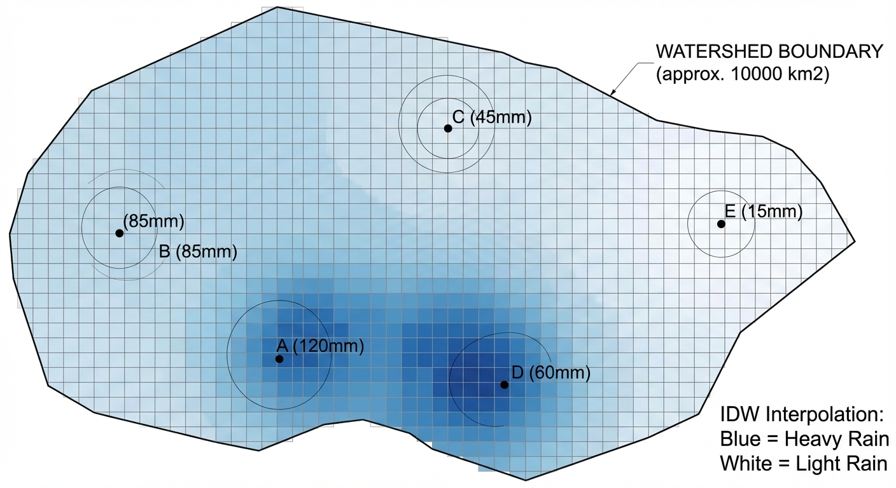
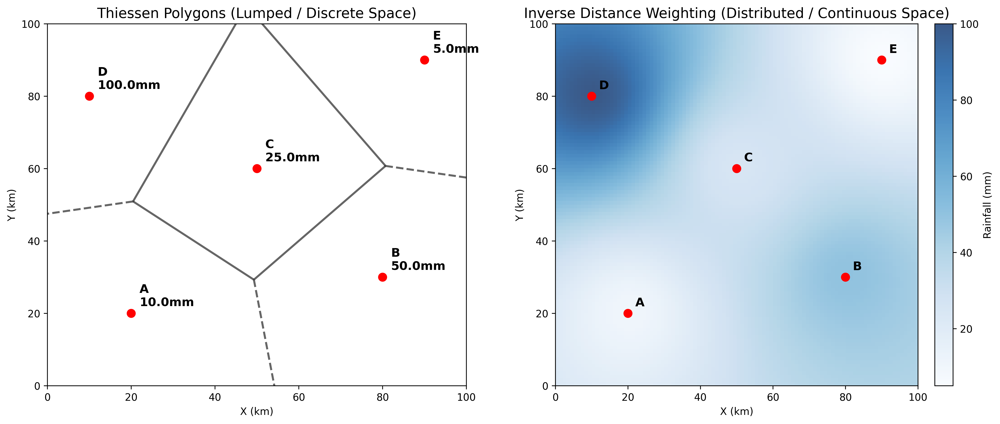

# 第 1 章：分布式水文模型概论：从集总到空间的觉醒

## 1. 学习目标
本章探讨水文学界从“黑盒集总式模型”向“白盒分布式模型”的范式革命。
读者需要掌握：
1. 集总式模型（Lumped Model）与分布式模型（Distributed Model）的本质区别。
2. 气象强迫数据（如降雨、蒸发）的空间异质性（Spatial Heterogeneity）。
3. 泰森多边形（Thiessen Polygons）与反距离权重法（IDW）在降雨插值中的几何学与物理学意义。
4. 网格化（Gridding）计算对计算算力的要求与模型精度的权衡。

## 2. 教材理论：为什么需要将流域切成“马赛克”？
在经典的水文学（如著名的新安江模型）中，若要预测一个流域出口的洪水，通常将整个流域（几百甚至几千平方公里）视为一个巨大的、属性均匀的“海绵”。
可将流域内几个雨量站的数据简单一加，求个平均值，当作整个“海绵”吸收的水量。这种把大面积看成一个点的模型，叫做**集总式水文模型（Lumped Hydrological Model）**。

但在真实世界中：
1. 暴雨（尤其是夏季对流雨）是极度局部的。可能东边山头暴雨如注，西边平原滴水未下。
2. 地表属性是极度复杂的。城市区域全是柏油路（水一落就流走），森林区域全是植被和落叶（能吸几百毫米的水）。

如果把它们平均化，算出来的洪水洪峰和到达时间会错得离谱。
为了解决这个问题，现代水文学引入了**分布式水文模型（Distributed Hydrological Model）**。
它的核心思想是：**“网格化（Gridding）”**。把整个流域切分成无数个比如 $1km \times 1km$ 的小方块（马赛克）。每个方块都有自己独一无二的降雨量、土壤类型、坡度和植被。水在每个方块里独立计算产流，然后沿着地形从一个方块流向下一个方块，最终汇聚到出口。

这一切的基础，首先是**把离散的雨量站数据，平滑地铺满所有的网格**。
在空间插值领域：
- **泰森多边形（Thiessen Polygons）**：这是一种较为粗略的几何切割。它认为空间中的任何一点，离哪个雨量站最近，它的降雨量就绝对等于那个站。这会产生一块块如同“碎片化”般突变的雨区。
- **反距离权重法（IDW）**：它认为大自然是连续的。网格点的降雨量由周围所有雨量站共同决定，距离越近，权重越大。对于待插值点 $(x, y)$，其降雨量的计算公式为：

$$
P(x,y) = \frac{\sum_{i=1}^{n} w_i \cdot P_i}{\sum_{i=1}^{n} w_i}, \quad w_i = \frac{1}{d_i^p} \tag{1.5}
$$

其中 $P_i$ 为第 $i$ 个雨量站的观测值，$d_i$ 为待插值点到第 $i$ 个站的欧氏距离，$p$ 为距离权重指数（通常取 $p = 2$，即权重与距离的平方成反比）。当 $p$ 增大时，近站的权重急剧增大，插值结果趋近于最近邻站的值；当 $p$ 减小时，各站的权重趋于均等，插值结果趋近于算术平均。IDW 能生成较为平滑、像热力图一样的渐变雨带。

## 2.1 集总式与分布式模型的数学对比

从数学结构上看，集总式模型与分布式模型的本质差异在于状态变量的空间维度。

**集总式模型**将整个流域视为单一计算单元，其水量平衡方程为：

$$
\frac{dS}{dt} = P(t) - ET(t) - Q(t) \tag{1.1}
$$

其中 $S$ 为流域总蓄水量（mm），$P(t)$ 为面平均降雨强度（mm/h），$ET(t)$ 为蒸散发率，$Q(t)$ 为出口流量。全部空间信息被压缩为标量，丧失了空间分布特征。

**分布式模型**在每个网格单元 $(i, j)$ 上独立建立水量平衡方程：

$$
\frac{dS_{i,j}}{dt} = P_{i,j}(t) - ET_{i,j}(t) - R_{i,j}(t) - q_{i,j \to \text{down}}(t) + q_{\text{up} \to i,j}(t) \tag{1.2}
$$

其中 $R_{i,j}$ 为单元产流量，$q_{i,j \to \text{down}}$ 和 $q_{\text{up} \to i,j}$ 分别为向下游输出和从上游接收的侧向流量。整个流域的状态向量维度为 $N_x \times N_y$，当网格分辨率为 $1\,\text{km}$ 时，一个 $10000\,\text{km}^2$ 的流域需要求解 $10000$ 个耦合的常微分方程。

两类模型的对比如下表所示：

| 特征 | 集总式模型 | 分布式模型 |
|:-----|:----------|:----------|
| 计算单元 | 整个流域（1个） | 网格/子流域（$10^3 \sim 10^6$ 个） |
| 输入数据 | 面平均值 | 逐单元空间场 |
| 参数空间 | $5 \sim 20$ 维 | $10^3 \sim 10^6 \times n_p$ 维 |
| 输出精度 | 仅出口断面 | 任意空间点 |
| 计算量级 | $O(N_t)$ | $O(N_t \times N_x \times N_y)$ |

## 2.2 空间离散化方法

分布式水文模型的第一步是将连续的流域空间离散化为有限数量的计算单元。常用的离散化方法有三种：

**（1）规则网格法（Regular Grid）**

将流域覆盖在等间距的正交网格上，每个网格单元为正方形（如 $1\,\text{km} \times 1\,\text{km}$）。这是 VIC、CREST 等模型采用的方案。其优势在于数据结构简单（二维数组），与遥感栅格数据（DEM、土地利用、NDVI）天然对齐。缺点是在河道弯曲处和流域边界处存在"锯齿效应"，且对地形复杂区域的分辨率自适应能力不足。

网格分辨率的选取直接影响计算量与模拟精度。以 $1\,\text{km}$ 分辨率为例，一个 $10\,000\,\text{km}^2$ 的流域需要 $10\,000$ 个网格单元；若分辨率提高到 $100\,\text{m}$，网格数将增至 $10^6$ 个，计算量增长两个数量级。因此，在工程实践中通常需要根据流域地形复杂度和计算资源进行分辨率的权衡选择。

**（2）不规则三角网法（Triangulated Irregular Network, TIN）**

在地形变化剧烈的区域（如山脊、河谷）加密节点，在平坦地区稀疏布点，用 Delaunay 三角剖分生成不等大的三角形单元。TIN 能够以较少的总单元数精确刻画复杂地形，但数据结构为非结构化网格，编程实现和并行计算的难度显著增大。

TIN 方法的核心优势在于空间自适应性：在坡度变化梯度超过某一阈值的区域自动加密节点，而在平原等均匀区域则保持稀疏。这一特性使其在山区流域的水文模拟中具有独特的优势，但由于相邻单元之间的面积和形状各异，水量传递的数值格式需要进行特殊处理。

**（3）子流域法（Sub-basin / HRU）**

SWAT 模型采用的方案。利用 DEM 提取河网，将流域切分为若干个子流域（Sub-basin），每个子流域内再根据土地利用和土壤类型组合划分为水文响应单元（Hydrological Response Unit, HRU）。HRU 内部假设属性均匀，但 HRU 之间没有空间拓扑关系——所有 HRU 的产流直接汇入所属子流域的出口河段。这种"半分布式"方案在计算效率与物理精度之间取得了实用平衡。

## 2.3 DEM数据预处理流程

无论采用何种离散化方案，数字高程模型（Digital Elevation Model, DEM）都是分布式水文模型最基础的输入数据。原始 DEM 在直接用于水文分析之前，必须经过严格的预处理流水线：

**第一步：填洼处理（Sink Filling）**

原始 DEM 中常存在因测量误差或数据采样造成的局部洼地（Sink）。这些洼地会导致水流在此处"断流"，无法继续向下游传递。填洼算法（如 Planchon-Darboux 算法）通过将洼地像素的高程抬升至其溢出高程来消除这些人工陷阱：

$$
Z'(i,j) = \max\left[Z(i,j),\; \min_{(m,n) \in \partial \Omega} Z'(m,n) + \epsilon \right] \tag{1.3}
$$

其中 $Z'$ 为修正后高程，$\partial \Omega$ 为洼地边界像素集合，$\epsilon$ 为微小正数以确保水流方向唯一。

**第二步：流向计算（Flow Direction）**

在填洼后的 DEM 上，采用 D8 算法（八方向最陡降坡法）确定每个网格的水流方向。D8 算法计算中心像素到周围 8 个邻居的坡度梯度：

$$
S_k = \frac{Z'(i,j) - Z'(i+\Delta i_k,\, j+\Delta j_k)}{d_k}, \quad k = 1, 2, \dots, 8 \tag{1.4}
$$

其中 $d_k$ 为距离（正交方向为 $\Delta x$，对角线方向为 $\sqrt{2}\Delta x$）。水流方向指向 $S_k$ 最大的邻居。

**第三步：汇流累积（Flow Accumulation）**

沿流向网络逐像素累加上游贡献面积。汇流累积值 $A_{\text{acc}}(i,j)$ 表示流经该像素的总上游集水面积（以像素个数计，乘以单像素面积 $\Delta x^2$ 即得物理面积）。当 $A_{\text{acc}}$ 超过给定阈值（如 $100$ 个像素）时，该像素被判定为河道。由此可自动提取完整的河网拓扑结构，为后续的汇流计算和河网并行调度提供几何基础。

汇流累积阈值的选取直接影响提取河网的密度：阈值过小会生成过密的河网（包含大量季节性干沟），增加计算量且引入噪声；阈值过大则遗漏重要支流，丢失流域的空间汇流信息。在实践中，通常以 $1\% \sim 5\%$ 的流域总面积作为参考阈值，并与实际河网地图进行对照校验。

需要指出的是，D8 算法将水流严格限定在 8 个离散方向上，在平坦区域（相邻像素高程差极小）容易产生大量平行水流路径，导致河网提取出现人工化的棋盘效应。为解决这一问题，Tarboton（1997）提出了 $D\infty$ 算法，允许水流沿任意角度方向分配，从而在平坦区域生成更加自然的扇形扩散水流路径。

## 3. 案例分析：理论与实践的桥梁（流域降雨空间插值与面雨量测算）

### 案例背景
某面积达 $10000 km^2$ 的大型流域内，仅稀疏分布着 5 个气象测站。
昨天爆发了一场局部特大暴雨。站 A 测得 $10mm$，站 B 测得 $50mm$，站 C 测得 $25mm$，站 D 测得显著的 $100mm$，而站 E 仅有 $5mm$。
如果你是水文预报人员，你需要回答一个十分关键的问题：“整个流域昨天到底下了多少毫米的**面平均降雨量**？”
如果仅仅用算术平均，结果会具有多大的误导性？需要对比“离散的泰森多边形”和“连续的 IDW 分布式插值”在刻画这场暴雨时的空间表现。

### 问题描述
- **流域范围**：$X \in [0, 100] km$, $Y \in [0, 100] km$。
- **站点坐标与雨量**：
  - A: $(20, 20) \to 10mm$
  - B: $(80, 30) \to 50mm$
  - C: $(50, 60) \to 25mm$
  - D: $(10, 80) \to 100mm$
  - E: $(90, 90) \to 5mm$
- **任务**：利用 Voronoi 图形学算法绘制泰森多边形；利用 IDW 算法在 $1km \times 1km$ 的极高分辨率网格上计算连续降雨场，并反推精准的流域面平均雨量。

**物理场景与问题概化图 (Generated via Nano-Banana-Pro)：**

### 解题思路
本研究开发了两种截然不同的空间拓扑算法：
1. **几何切割法**：调用 `scipy.spatial.Voronoi`，通过计算站间连线的垂直平分线，将 $100 \times 100$ 的空间强行切割成 5 个互不侵犯的领地。
2. **分布式网格化**：生成 $100 \times 100$ 的细密矩阵。对于每一个节点 $(x, y)$，计算它到 5 个测站的欧氏距离 $d_i$，然后计算权重 $w_i = \frac{1}{d_i^2}$。归一化权重后，加权累加 5 个站的雨量作为该网格的值。

### 代码与仿真
> **学习提示**：后台计算了 10000 个独立网格的 IDW 高阶距离反比方程。请仔细对比左图的“几何霸权”与右图的“流体渐变”。

Source: `assets/ch01/ch01_spatial_interpolation.py`

**面平均降雨量（流域总水资源量）计算基准对比矩阵：**
| Method                           |   Areal Average Rainfall (mm) | Spatial Resolution     |
|:---------------------------------|------------------------------:|:-----------------------|
| Arithmetic Mean (算术平均)       |                         38    | Zero (Single Point)    |
| Inverse Distance Weighting (IDW) |                         37.57 | 1 km Grid (Continuous) |

**离散集总（泰森）与连续分布式（IDW）暴雨空间解析图：**

### 结果分析
算法的可视化输出揭示了空间异质性的美学：
- **粗暴的领地划分（左图）**：在泰森多边形中，因为站 D（位于左上角）下了一场 $100mm$ 的特大暴雨，它粗暴地将其管辖的多边形区域全部染成了深色。这意味着在集总式模型看来，左上角只要处于 D 站领地，降雨量就是绝对平均的 $100mm$。当你跨过边境线一步进入 C 站领地，雨量瞬间断崖式跌落到 $25mm$。这种几何突变在自然界是不存在的。
- **大自然的流体渐变（右图）**：IDW 算法生成的右图才是大自然真实的模样。站 D（$100mm$）像是一个热源，它的暴雨向四周平滑地、呈同心圆状扩散衰减；在它与站 C（$25mm$）之间，形成了一个非常完美的降雨量梯度过渡带。在这个 $1km$ 级的高分辨率网格里，每一寸土地接收到的水都是独特的，这正是**分布式水文模型（Distributed Model）**的灵魂底座。
- **面雨量的陷阱**：看表格数据。算术平均算出流域总降雨为 $38.0\,\text{mm}$；而高度精密的 IDW 积分算出的是 $37.57\,\text{mm}$。两者总雨量仅相差 $0.43\,\text{mm}$（约 $1.1\%$），但这恰恰说明了集总式模型的致命缺陷：**即使它猜对了总降雨量，但由于把暴雨中心的位置猜错了，它算出的洪峰到达时间依然会是错的。** 在本案例中，站 D（$100\,\text{mm}$）位于流域左上角，距出口较远，其产流需要更长的汇流时间；而算术平均法无法区分暴雨中心是靠近出口还是远离出口，这对洪峰预报而言是根本性的信息缺失。

从模型适用性角度看，泰森多边形法在站网密度较高（平均站距小于 $20\,\text{km}$）且降雨空间梯度较小的地区仍可提供合理的近似；而在站网稀疏或对流性暴雨频发的地区，IDW 或克里金插值则是必要的选择。在站点数量少于 3 个的极端情况下，任何空间插值方法都难以可靠地重建降雨场，此时应考虑引入雷达测雨或卫星降水产品作为补充数据源。

### 工业部署建议
1. **算力与精度的妥协**：IDW 插值看起来很完美，但在拥有上千万个网格的国家级数字孪生流域平台（如数字黄河、数字长江）中，每隔 5 分钟用 IDW 算一遍全国网格，会导致 CPU 算力瞬间爆表崩盘。在工程实战中，常常预先计算并缓存“静态权重矩阵”，或者采用更高级的 GPU 并行计算架构（CUDA）来加速这一过程。
2. **地形的忽视**：IDW 只是简单的平面距离反比。但在真正的山区，一座山脉可以彻底挡住雨云（地形雨的迎风坡与背风坡）。因此，现代高级气象插值必须使用克里金法（Kriging）或结合高程数据（DEM）的三维协同克里金插值（Co-Kriging），把高山对降雨的拦截效应融合进代码中。

## 4. 本章小结

1. 集总式水文模型将整个流域视为均匀体，无法刻画降雨和下垫面的空间异质性；分布式水文模型通过网格化实现逐单元独立计算，是现代数字孪生流域的物理底座。
2. 泰森多边形法以最近站点代替面雨量，空间上存在突变；反距离权重（IDW）法通过距离反比加权生成连续渐变的降雨场，更接近自然真实。
3. 面平均降雨量的精度取决于站网密度与插值算法；在暴雨中心位置判断上，分布式插值远优于算术平均，直接影响洪峰到达时间的预报精度。
4. DEM 预处理流水线（填洼、流向计算、汇流累积）是分布式模型建立空间拓扑结构的基础，其中 D8 算法是最广泛使用的流向确定方法。
5. 空间离散化方案的选择（规则网格、TIN、子流域/HRU）需要根据流域地形特征、数据可获取性和计算资源进行综合权衡。
6. 工业级数字孪生流域需要在算力（GPU 并行）与精度（克里金、协同克里金）之间寻求最优折中，同时融合雷达和卫星等多源降水观测数据。

## 5. 思考题

1. 当流域内雨量站分布极度不均匀（北部密集、南部稀疏）时，泰森多边形法和 IDW 法各自会产生什么偏差？如何改进？
2. 某流域有 8 个雨量站，各站坐标和降雨量已知。请推导 IDW 算法中权重指数 $p$ 从 1 变化到 3 时，面平均降雨量的变化趋势，并解释物理含义。
3. 为什么说"即使集总模型猜对了面平均降雨量，洪峰到达时间仍然可能出错"？请结合暴雨中心位置给出分析。

## 6. 参考文献

[1] Beven K J. Rainfall-Runoff Modelling: The Primer[M]. 2nd ed. Chichester: Wiley-Blackwell, 2012.

[2] Singh V P, Frevert D K. Watershed Models[M]. Boca Raton: CRC Press, 2006.

[3] 雷晓辉,龙岩,许慧敏,等.水系统控制论：提出背景、技术框架与研究范式[J].南水北调与水利科技(中英文),2025,23(04):761-769+904.DOI:10.13476/j.cnki.nsbdqk.2025.0077.

[4] 赵人俊. 流域水文模拟: 新安江模型与陕北模型[M]. 北京: 水利电力出版社, 1984.

[5] BEVEN K J, KIRKBY M J. A physically based, variable contributing area model of basin hydrology[J]. Hydrological Sciences Bulletin, 1979, 24(1): 43-69. DOI: 10.1080/02626667909491834.

[6] ABBOTT M B, BATHURST J C, CUNGE J A, et al. An introduction to the European Hydrological System—Systeme Hydrologique Europeen, "SHE", 1: History and philosophy of a physically-based, distributed modelling system[J]. Journal of Hydrology, 1986, 87(1-2): 45-59. DOI: 10.1016/0022-1694(86)90114-9.

[7] NASH J E, SUTCLIFFE J V. River flow forecasting through conceptual models part I—A discussion of principles[J]. Journal of Hydrology, 1970, 10(3): 282-290. DOI: 10.1016/0022-1694(70)90255-6.

[8] LIANG X, LETTENMAIER D P, WOOD E F, et al. A simple hydrologically based model of land surface water and energy fluxes for general circulation models[J]. Journal of Geophysical Research: Atmospheres, 1994, 99(D7): 14415-14428. DOI: 10.1029/94JD00483.
