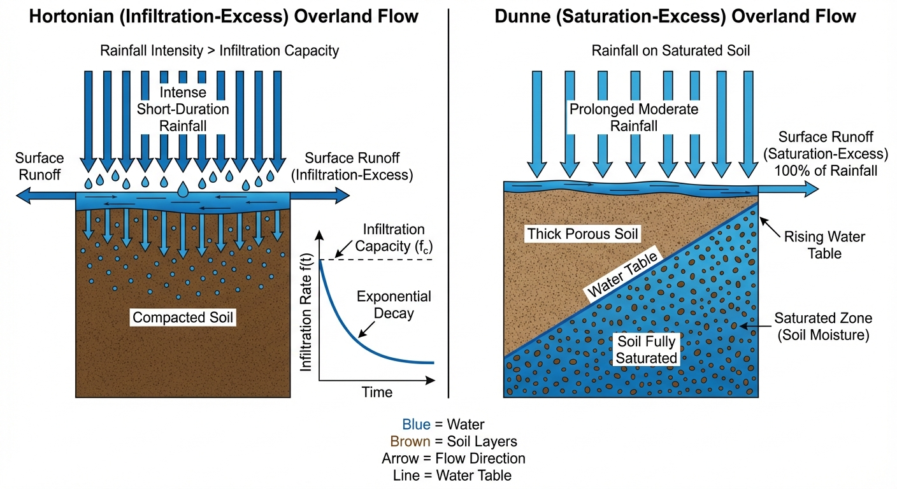
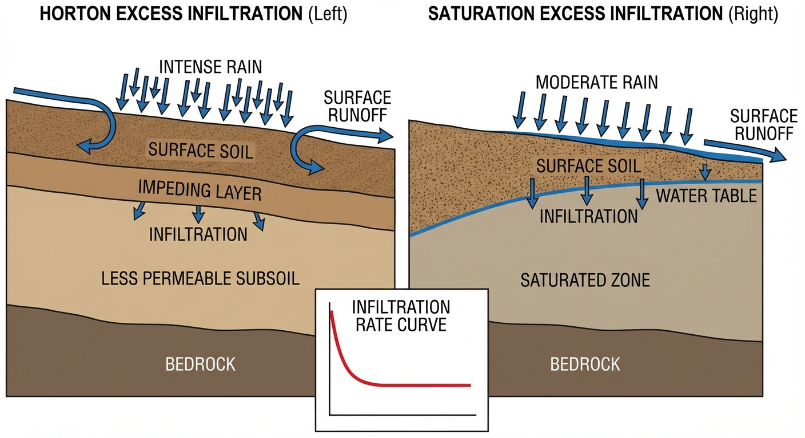
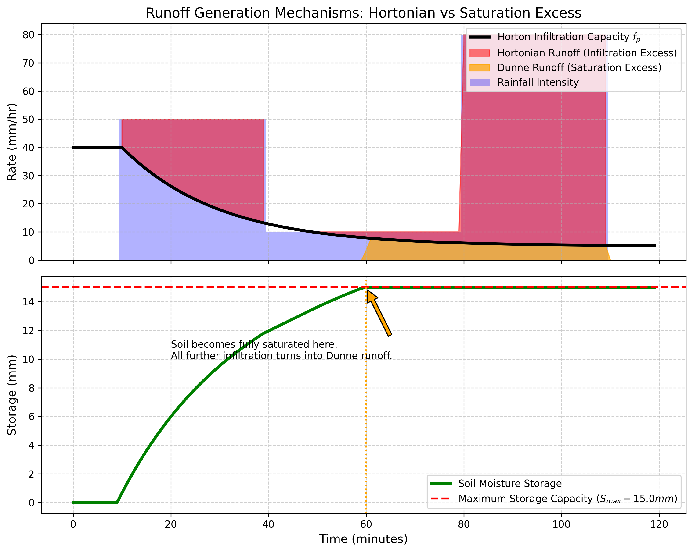

# 第 2 章：产流机制：超渗与蓄满的物理博弈

## 1. 学习目标
本章探讨当暴雨降临大地时，水是如何“决定”渗入地下还是汇聚成地表径流的。这是所有水文模型的核心引擎。
读者需要掌握：
1. 下渗能力（Infiltration Capacity）的衰减规律与霍顿（Horton）模型。
2. 超渗产流（Hortonian Overland Flow）的物理机制与适用地形。
3. 土壤蓄水容量（Soil Moisture Capacity）与蓄满产流（Dunne Overland Flow）的物理机制。
4. 两种产流机制在时间序列上的交替与叠加。

## 2. 教材理论：水为什么会在地表流淌？
当下雨时，水并不是立刻变成洪水的。土壤就像一块巨大的海绵，会拼命地把雨水吸进去。
水变成地表径流（Runoff），只可能因为两种截然不同的物理极限被打破：

**机制 1：下渗能力被击穿（超渗产流 / Hortonian Flow）**
假设你站在铺满石板或极度压实的黄土上。土壤表面能够吸水的速度（下渗率 $f_p$）是非常慢的。
1933年，Horton 提出了著名的下渗曲线：一开始土壤干燥，吸水极快（$f_0$）；但随着表层土壤湿润膨胀，孔隙被堵塞，吸水速度呈指数级衰减，最终稳定在一个极低的值（$f_c$）。
$$ f_p(t) = f_c + (f_0 - f_c) e^{-kt} $$
**超渗产流发生条件**：**雨下得太猛了。**
当降雨强度 $P$ 大于土壤当前的下渗能力 $f_p$ 时，即使土壤深处还有大把的空间没装满水，来不及渗下去的雨水也会立刻在地表汇聚成流。超渗产流的瞬时强度等于降雨强度与下渗能力之差：$R_{\text{Horton}}(t) = P(t) - f_p(t)$。这就是**超渗产流**。这种机制常见于暴雨频发的干旱区或城市柏油路面。

**机制 2：土壤海绵被完全灌满（蓄满产流 / Dunne Flow）**
假设你站在植被茂密的南方森林里。这里的土壤非常疏松，下渗能力 $f_p$ 极大，无论下多大的雨它都能瞬间吸进去。超渗产流在这里绝不会发生。
但是，这块“海绵”的总容积（蓄水容量 $S_{max}$）是有限的。
随着持续不断的降雨，土壤深处的水位（地下水）慢慢抬升，直到某一刻，**整块海绵彻底吸饱了水（土壤达到绝对饱和）**。
**蓄满产流发生条件**：**雨下得太久了。**
一旦土壤饱和（即土壤含水量 $\theta$ 达到饱和含水量 $\theta_s$），无论它的下渗能力有多强都毫无意义。此后降落的**每一滴雨**，都会百分之百地转化为地表径流。这就是**蓄满产流**（又称邓恩产流）。蓄满产流的判定条件为 $S(t) \ge S_{\max}$，其中 $S(t)$ 为当前累积蓄水量，$S_{\max}$ 为土壤最大蓄水容量。这种机制常见于湿润地区的长历时降雨。

在现代分布式水文模型（如 SWAT）中，每个网格都会同时计算这两种机制，看哪一种先被触发。

从水量平衡的角度看，产流量 $R$ 是降雨量 $P$、蒸散发 $ET$、土壤蓄水变化量 $\Delta S$ 和深层渗漏 $D$ 之间的差值：$R = P - ET - \Delta S - D$。超渗产流和蓄满产流的区别在于限制产流的瓶颈不同：前者受限于土壤表面的入渗通道（入渗率 $f_p$），后者受限于土壤的总储水空间（蓄水容量 $S_{\max}$）。理解这一本质差异对于正确配置分布式水文模型的产流模块至关重要。

## 2.1 Horton超渗产流公式的物理推导

Horton下渗曲线的数学表达式为：

$$
f_p(t) = f_c + (f_0 - f_c)\,e^{-kt} \tag{2.1}
$$

其中 $f_0$ 为初始下渗率（mm/h），$f_c$ 为稳定下渗率（mm/h），$k$ 为衰减常数（min$^{-1}$），$t$ 为自降雨开始的时间。各参数的典型取值范围如下：对于砂质土壤，$f_0 = 50 \sim 120\,\text{mm/h}$，$f_c = 10 \sim 25\,\text{mm/h}$；对于黏质土壤，$f_0 = 10 \sim 40\,\text{mm/h}$，$f_c = 1 \sim 5\,\text{mm/h}$；衰减常数 $k$ 通常在 $0.01 \sim 0.10\,\text{min}^{-1}$ 之间。

该方程的物理含义是：干燥土壤表层的大孔隙在降雨初期能够迅速吸收水分，但随着表层土壤逐渐饱和、胶体膨胀堵塞孔隙、以及雨滴击溅导致的土壤结皮效应，下渗能力呈指数衰减，最终趋于由土壤饱和导水率决定的稳定值 $f_c$。该方程的推导基于一个关键的物理假设：下渗能力的衰减速率与当前下渗能力超出稳定值的幅度成正比，即 $df_p/dt = -k(f_p - f_c)$。这是一个典型的一阶线性常微分方程，其解析解即为式 (2.1)。

超渗产流的强度在任意时刻可表达为：

$$
R_{\text{Horton}}(t) = \max\left[P(t) - f_p(t),\; 0\right] \tag{2.2}
$$

将式 (2.1) 对时间积分，可得到从降雨开始到时刻 $t$ 的累积下渗量：

$$
F(t) = f_c \cdot t + \frac{f_0 - f_c}{k}\left(1 - e^{-kt}\right) \tag{2.3}
$$

当 $t \to \infty$ 时，$F(t) \to f_c \cdot t + (f_0 - f_c)/k$，其中 $(f_0 - f_c)/k$ 代表土壤表层的初始"吸水盈余"。

## 2.2 Green-Ampt入渗模型

与Horton经验公式不同，Green和Ampt（1911）从达西定律出发推导了一个具有明确物理基础的入渗模型。该模型假设存在一个清晰的湿润锋面，锋面以上土壤完全饱和（含水率 $\theta_s$），锋面以下保持初始含水率 $\theta_i$。

根据达西定律，通过土壤表面的入渗通量为：

$$
f(t) = K_s \cdot \frac{Z_f(t) + h_0 + |\psi_f|}{Z_f(t)} \tag{2.4}
$$

其中 $K_s$ 为饱和导水率（mm/h），$Z_f(t)$ 为湿润锋面深度（mm），$h_0$ 为地表积水深度（通常忽略），$\psi_f$ 为湿润锋面处的基质吸力水头（mm，取负值）。

由于累积入渗量 $F(t) = (\theta_s - \theta_i) \cdot Z_f(t)$，令 $\Delta\theta = \theta_s - \theta_i$，可将式 (2.4) 改写为关于 $F$ 的隐式方程：

$$
F(t) = K_s \cdot t + |\psi_f|\,\Delta\theta \cdot \ln\left(1 + \frac{F(t)}{|\psi_f|\,\Delta\theta}\right) \tag{2.5}
$$

该方程无法解析求解，需采用Newton迭代法在每个时间步进行数值求解。Newton迭代格式为：

$$
F^{(n+1)} = F^{(n)} - \frac{F^{(n)} - K_s t - |\psi_f|\Delta\theta \ln\left(1 + \frac{F^{(n)}}{|\psi_f|\Delta\theta}\right)}{1 - \frac{K_s |\psi_f|\Delta\theta}{F^{(n)} + |\psi_f|\Delta\theta}} \tag{2.6}
$$

通常经过 3 至 5 次迭代即可收敛至 $10^{-6}\,\text{mm}$ 的精度。Green-Ampt 模型各参数的典型取值为：砂土 $K_s = 11.78\,\text{mm/h}$，$|\psi_f| = 49.5\,\text{mm}$，$\Delta\theta = 0.417$；壤土 $K_s = 3.40\,\text{mm/h}$，$|\psi_f| = 88.9\,\text{mm}$，$\Delta\theta = 0.434$。该模型的优势在于其参数（$K_s$、$\psi_f$、$\theta_s$、$\theta_i$）均可从土壤物理实验或通过 USDA 土壤质地分类表查表获得，具有比 Horton 模型更强的物理可解释性和参数可移植性。

## 2.3 超渗产流与蓄满产流的适用条件对比

两种产流机制的适用条件与物理特征存在本质差异，如下表所示：

| 对比维度 | 超渗产流（Horton） | 蓄满产流（Dunne） |
|:---------|:-------------------|:------------------|
| 触发条件 | 雨强 $P > f_p$（瞬时击穿） | 土壤蓄水 $S \ge S_{\max}$（累积饱和） |
| 主控因素 | 土壤表面特性（结皮、压实） | 土壤深度与地下水位 |
| 典型气候 | 干旱、半干旱区（短历时强降雨） | 湿润、半湿润区（长历时降雨） |
| 典型下垫面 | 黄土坡面、城市硬化路面、裸地 | 森林覆盖区、河谷湿地、浅薄土层山区 |
| 产流速度 | 极快（降雨开始后数分钟） | 较慢（需数小时至数天的前期润湿） |
| 径流系数 | 降雨初期即可较高 | 前期极低，饱和后陡然接近100% |
| 空间特征 | 局部性强，与暴雨中心位置密切相关 | 区域性扩展，饱和面积逐步扩大 |
| 代表模型 | 陕北模型、SCS-CN法 | 新安江模型（XAJ）、TOPMODEL |

在实际流域中，两种机制往往并非截然分离。例如，在半湿润过渡带（如淮河流域），短历时强降雨可能先引发超渗产流，随着降雨持续，土壤逐渐饱和后转变为蓄满产流。现代分布式水文模型通常对每个网格单元同时计算两种机制，取实际触发的那一种作为该单元的产流模式。这种"双机制并行判定"策略显著提高了模型在复杂气候过渡带的适应性。

值得强调的是，在城市化地区，下垫面条件的急剧变化使得产流机制发生了根本性改变。不透水面积比例（Impervious Area Ratio）是衡量城市化对水文过程影响的关键指标。当不透水面积比例从 $10\%$ 增加到 $60\%$ 时，流域的年径流系数可能从 $0.2$ 上升到 $0.6$ 以上，洪峰流量可增加 $2 \sim 5$ 倍，洪峰到达时间缩短 $30\% \sim 50\%$。在分布式水文模型中，城市网格的产流计算需要引入不透水面积比例作为额外参数，将不透水面上的 $100\%$ 直接产流与透水面上的正常入渗产流进行加权叠加。

## 3. 案例分析：理论与实践的桥梁（变雨强下的产流机制动态切换仿真）

### 案例背景
某黄土丘陵流域正在经历一场较为特殊的锋面雨。降雨分为三个阶段：
1. **阶段一（第 $10 \sim 40$ 分钟）**：突然爆发 $50 mm/h$ 的暴雨。
2. **阶段二（第 $40 \sim 80$ 分钟）**：转为 $10 mm/h$ 的绵绵细雨。
3. **阶段三（第 $80 \sim 110$ 分钟）**：再次爆发 $80 mm/h$ 的特大暴雨。
该地区土壤初始下渗率为 $40 mm/h$，稳定下渗率为 $5 mm/h$。土壤较为浅薄，最大蓄水容量仅为 $15 mm$。
水文预报员需要精确推演出在这 $120$ 分钟内，究竟在哪些时刻爆发了超渗洪水？在哪些时刻土壤彻底饱和引发了蓄满洪水？

### 问题描述
- **降雨时序 $P(t)$**：脉冲分段控制。
- **Horton 下渗曲线**：$f_0 = 40 mm/h, f_c = 5 mm/h, k = 0.05 min^{-1}$。
- **土壤蓄水 $S(t)$**：积分累加有效下渗量，上限 $S_{max} = 15.0 mm$。
- **产流剥离**：
  - 若 $P(t) > f_p(t)$ 且 $S < S_{max}$，发生超渗产流。
  - 若 $S \ge S_{max}$，发生蓄满产流。
- **任务**：在一维土柱模型中编写仿真算法，输出两种产流机制在时间轴上的交替与叠加过程。

**物理场景与问题概化图 (Generated via Nano-Banana-Pro)：**

### 解题思路
构建带有物理状态机的时序积分器：
1. **双轨同步计算**：在每个 $\Delta t$ 步长内，先计算 Horton 下渗能力 $f_p$（仅在有雨时发生指数衰减）。
2. **产流第一道防线（超渗判定）**：将当前雨强 $P$ 与 $f_p$ 对比。超出的部分直接切走作为“超渗产流（Hortonian Runoff）”。剩下的部分 $P_{infil} = \min(P, f_p)$ 作为有效入渗量准备进入土壤。
3. **产流第二道防线（蓄满判定）**：将有效入渗量累加到当前土壤含水量 $S$ 中。如果累加后 $S > 15.0mm$，说明土壤炸了。不仅要把多余的部分挤出来作为“蓄满产流（Dunne Runoff）”，而且必须从此刻起，强行切断土壤的下渗能力，后续所有降雨 $100\%$ 产流。

### 代码与仿真
> **学习提示**：后台执行了带状态阻断机制的降雨-径流模型。请仔细观察下方绿色曲线达到红虚线时的那一刻，系统的物理法则发生了根本性扭转。

Source: `assets/ch02/ch02_runoff_generation.py`

**变雨强驱动下产流机制切换追踪矩阵：**
|   Time (min) |   Rainfall (mm/h) |   Infil Capacity fp (mm/h) |   Hortonian Runoff (mm/h) |   Soil Storage (mm) |   Saturation Runoff (mm/h) |
|-------------:|------------------:|---------------------------:|--------------------------:|--------------------:|---------------------------:|
|           20 |                50 |                       26.2 |                      23.8 |                 6   |                        0   |
|           50 |                10 |                        9.7 |                       0.3 |                13.6 |                        0   |
|           90 |                80 |                        5.6 |                      74.4 |                15   |                        5.6 |
|          100 |                80 |                        5.4 |                      74.6 |                15   |                        5.4 |

**Horton 超渗与 Dunne 蓄满双机制产流仿真图：**

### 结果分析
通过算法对水滴去向的精密剥离，大自然的产流密码被彻底破解：
- **第一阶段：单纯的超渗产流**：观察 $t=20$ 分钟时的表格数据和图表。雨强很高（$50\,\text{mm/h}$），而黑色的下渗曲线 $f_p$ 已经衰减到了 $26.2\,\text{mm/h}$。此时雨下得太快，土壤根本吃不下，这中间的差值（图上的红色填充区）变成了 $23.8\,\text{mm/h}$ 的**超渗产流**。此时超渗产流占降雨量的比例为 $23.8/50 = 47.6\%$，即接近一半的降雨直接在地表汇聚成流。注意此时下子图的绿色土壤蓄水曲线还在慢慢往上爬（仅 $6\,\text{mm}$，距饱和阈值 $15\,\text{mm}$ 尚有 $60\%$ 的余量），土壤远远没有饱和。
- **第二阶段：风平浪静的吸收**：在 $t=50$ 分钟时，暴雨转为细雨（$10\,\text{mm/h}$）。虽然此时土壤下渗能力已经很低了（$9.7\,\text{mm/h}$），但勉强还能应付。超渗产流几乎消失（仅 $0.3\,\text{mm/h}$），即降雨的 $97\%$ 被有效吸收。水被稳稳地吸入地下，导致绿色蓄水曲线快速逼近红线。这一阶段的关键物理过程是：尽管 Horton 下渗曲线仍在缓慢衰减，但由于雨强降低，$P(t)$ 与 $f_p(t)$ 之间的差值极小，超渗产流近乎为零。然而，有效入渗量（$\min(P, f_p) = 9.7\,\text{mm/h}$）持续累积，土壤蓄水量从 $6\,\text{mm}$ 迅速上升至 $13.6\,\text{mm}$，距饱和阈值 $15\,\text{mm}$ 仅剩 $1.4\,\text{mm}$ 的余量。这为第三阶段的蓄满产流埋下了伏笔。
- **第三阶段：物理机制的转变与双重叠加**：最显著的一幕出现在 $t \approx 78$ 分钟时。此时下子图的绿色曲线终于撞到了红色的绝对物理上限（$15mm$）。**海绵彻底吸满了。** 此时，虽然第三波特大暴雨（$80 mm/h$）还没到来，但由于土壤饱和，它持续地拒绝了所有水滴的进入。
当 $t=90$ 分钟特大暴雨降临时，灾难是双重的。首先，雨强 $80$ 远大于下渗能力 $5.6$，产生了高达 $74.4 mm/h$ 的红色**超渗产流**。其次，那本该渗入地下的 $5.6 mm/h$ 的水，因为土壤已经饱和（蓄满），也被吐了出来，转化成了黄色的**蓄满产流**（图表黄色填充区）。在土壤饱和后，不管降雨的形态如何，每一滴雨都成了杀人的洪水。

### 工业部署建议
1. **海绵城市的物理降维**：为什么现代城市一遇暴雨就“看海”？因为城市的硬化路面相当于把公式里的 $f_0$ 和 $f_c$ 全部设成了 $0$。所有的降雨不经过任何抵抗，在第 1 秒就全部化为红色的“超渗产流”。而“海绵城市”的透水路面和下沉式绿地，本质上就是十分努力地把 $f_c$ 提高，并极大地拉高下子图里 $S_{max}$ 的红线，用土壤的空间来换取城市的安全时间。
2. **分布式模型的产流选择**：在配置国家级分布式水文模型时，工程师必须对不同网格下达不同的”产流指令”。对于陕北黄土高原的网格，必须强制打开 Horton 超渗模块，关闭蓄满模块（因为黄土极深，永远吸不满，但表面极易结皮）；而对于江南水乡的网格，地下水位极高，必须强制打开 Dunne 蓄满产流模块。如果模块选错，计算出的洪峰到达时间会产生数天的致命误差。
3. **Green-Ampt 模型的数字孪生应用**：在实时洪水预报的数字孪生系统中，Green-Ampt 模型因其参数具有明确的物理意义而具有独特优势。当遥感数据（如卫星土壤湿度产品）提供了初始含水率 $\theta_i$ 的实时观测值时，可以直接更新模型的初始条件而无需重新率定参数。这种”状态更新”能力使得 Green-Ampt 模型在数据同化框架中比纯经验的 Horton 模型更易于集成和维护。

## 4. 本章小结

1. 降雨转化为地表径流存在两种截然不同的物理机制：超渗产流（Horton，雨强超过下渗能力）和蓄满产流（Dunne，土壤蓄水达到饱和）。
2. Horton 下渗曲线 $f_p(t) = f_c + (f_0 - f_c)e^{-kt}$ 描述了土壤表面吸水能力随时间的指数衰减规律，其物理基础是下渗能力的衰减速率与当前超出稳定值的幅度成正比。
3. Green-Ampt 模型从达西定律出发，假设存在清晰的湿润锋面，其参数具有明确的物理意义且可从土壤实验获得，是具有物理基础的替代方案。
4. 在变雨强条件下，两种产流机制可在时间序列上交替甚至叠加出现；土壤一旦达到饱和，后续所有降雨将百分之百转化为径流。
5. 分布式水文模型需根据各网格的气候区和下垫面条件，选择合适的产流模块——干旱区以超渗为主，湿润区以蓄满为主，半湿润过渡带则需双机制并行判定。
6. 海绵城市建设的物理本质是提高下渗能力参数 $f_c$ 和扩大土壤蓄水容量 $S_{\max}$，从而延缓产流时间并削减洪峰。

## 5. 思考题

1. 某地区初始下渗率 $f_0 = 50\,mm/h$，稳定下渗率 $f_c = 8\,mm/h$，衰减常数 $k = 0.03\,min^{-1}$。若降雨强度恒定为 $30\,mm/h$，请计算超渗产流开始的时刻。
2. 为什么城市硬化路面导致的洪水问题本质上是”超渗产流”而非”蓄满产流”？从物理参数 $f_0$、$f_c$、$S_{max}$ 的角度分析。
3. 在一次长历时降雨过程中，先发生超渗产流、后转变为蓄满产流的物理条件是什么？请结合土壤蓄水量 $S(t)$ 的演化过程给出解释。

## 6. 参考文献

[1] Horton R E. The role of infiltration in the hydrologic cycle[J]. Transactions of the American Geophysical Union, 1933, 14(1): 446-460.

[2] Green W H, Ampt G A. Studies on soil physics: I. The flow of air and water through soils[J]. Journal of Agricultural Science, 1911, 4(1): 1-24.

[3] 赵人俊. 流域水文模拟——新安江模型与陕北模型[M]. 北京: 水利电力出版社, 1992.
