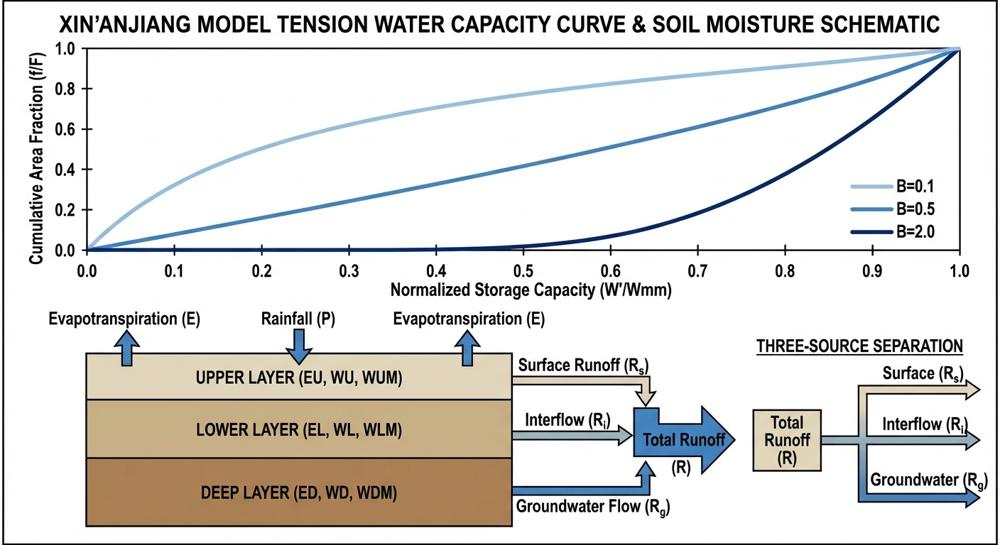
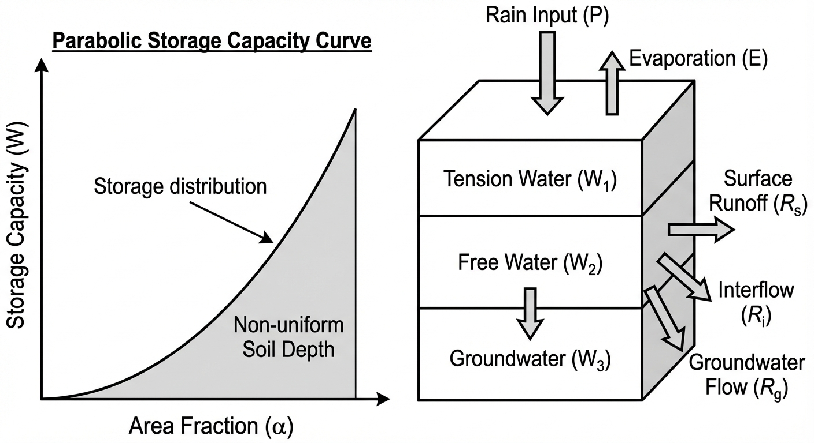
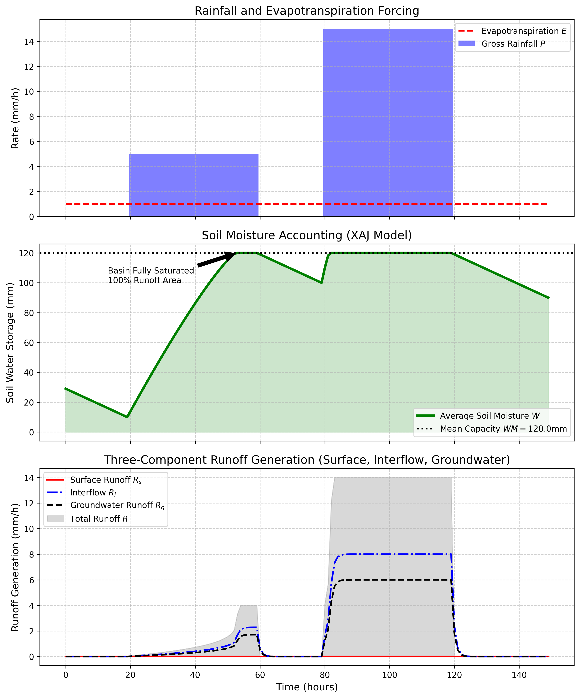

# 第 3 章：蓄满产流：新安江模型的中国智慧

## 1. 学习目标
本章深入探讨在湿润地区水文预报中占据统治地位的中国原创模型——新安江模型（Xin'anjiang Model）。
读者需要掌握：
1. 蓄水容量曲线（Tension Water Capacity Curve）的抛物线假设与非均匀性参数 $B$。
2. 蓄满产流（Saturation Excess）的面积渐变扩张机制。
3. 三水源划分（Surface, Interflow, Groundwater）的动力学逻辑。
4. 蒸散发（Evapotranspiration）在土壤水分核算（Soil Moisture Accounting）中的消耗作用。

## 2. 教材理论：并非所有的土壤都是平的
在第 2 章中，已讨论过“海绵吸饱了就会漏水（蓄满产流）”。但此前采用了一个较为粗略的假设：整个流域的土壤深度是一样的。这意味着，要么一滴水不漏，要么在某一秒钟，全流域 $10000 km^2$ 的土地同时饱和，瞬间产流。
这在现实中是不可能的。

1973年，中国水文气象学家赵人俊先生在开发新安江模型时，提出了一个十分巧妙且符合中国南方湿润地区特征的物理假设：**流域的土壤蓄水容量是不均匀的**。
有的地方土层薄（比如山脊），下一点点雨就饱和产流了；有的地方土层极厚（比如河谷），下了三天三夜的雨还能吸。

赵先生用一条十分优美的抛物线来描述这种不均匀性——**蓄水容量分布曲线**：
$$ \frac{f}{F} = 1 - \left(1 - \frac{W'}{W'_{mm}}\right)^B $$
其中：
- $f/F$ 是流域内已经蓄满（开始产流）的面积比例。
- $W'$ 是某个点的蓄水容量。
- $B$ 是形状指数，代表土壤厚度分布的不均匀程度。

**计算魔法**：当你有一场净雨（降雨减去蒸发，$P-E$）下落时，你不需要知道哪座山饱和了，你只需要在这个抛物线上积分。算出来的产流量 $R$，完美地代表了那些”土层较薄、率先饱和的区域”溢出来的水。随着降雨持续，产流面积比例从 $0\%$ 逐渐扩大到 $10\%$, $50\%$，直到土壤彻底吸饱，全流域 $100\%$ 产流。这种平滑过渡机制，使得新安江模型在模拟大江大河洪水时精度极高。

新安江模型自 1973 年提出以来，已被广泛应用于中国南方数百个流域的洪水预报实践中，涵盖了从面积仅数十平方公里的小型山区流域到数十万平方公里的大江大河流域。在国家防汛抗旱指挥系统中，新安江模型是三大主力预报模型之一（另外两个为陕北模型和大伙房模型）。

## 2.1 蓄水容量曲线的数学表达与产流量推导

新安江模型的核心是蓄水容量分布曲线（Tension Water Capacity Curve）。设流域内任意一点的蓄水容量为 $WM'$，全流域最大点蓄水容量为 $WMM$。则蓄水容量小于 $WM'$ 的面积占总流域面积的比例为：

$$
\frac{f}{F} = 1 - \left(1 - \frac{WM'}{WMM}\right)^B \tag{3.1}
$$

其中 $B$ 为形状指数，控制蓄水容量分布的不均匀程度。当 $B = 0$ 时，全流域蓄水容量完全相同（均匀土壤）；$B$ 越大，不均匀性越强，即少数薄土区域更容易率先饱和产流。

流域平均蓄水容量 $WM$ 与最大点蓄水容量 $WMM$ 的关系通过对式 (3.1) 积分获得：

$$
WM = \int_0^{WMM} \left(1 - \frac{f}{F}\right) dWM' = \frac{WMM}{1 + B} \tag{3.2}
$$

因此 $WMM = WM \cdot (1 + B)$。

设当前时刻流域平均蓄水量为 $W$，则可反算出抛物线上的临界纵坐标 $A$（即当前已饱和区域对应的蓄水容量阈值）：

$$
A = WMM \cdot \left[1 - \left(1 - \frac{W}{WM}\right)^{1/(1+B)}\right] \tag{3.3}
$$

当一场净雨 $PE = P - E$ 降落后，产流量 $R$ 的计算分为两种情况：

**情况一**：若 $A + PE < WMM$（降雨未使全流域饱和），则产流量为：

$$
R = PE - WM + W + WM \cdot \left(1 - \frac{A + PE}{WMM}\right)^{1+B} \tag{3.4}
$$

**情况二**：若 $A + PE \ge WMM$（降雨导致全流域 $100\%$ 饱和），则：

$$
R = PE - (WM - W) \tag{3.5}
$$

此时流域的全部亏缺 $(WM - W)$ 被填满，剩余净雨全部转化为径流。

## 2.2 三层蒸散发模型

新安江模型将土壤蓄水层垂直划分为上层（Upper, $WU$）、下层（Lower, $WL$）和深层（Deep, $WD$）三层，各层蒸散发的计算规则如下：

**上层蒸散发**：优先从上层蒸发。若上层蓄水量 $WU \ge EP$（$EP$ 为蒸散发能力），则：

$$
EU = EP, \quad EL = 0, \quad ED = 0 \tag{3.6}
$$

**下层蒸散发**：若上层蓄水不足以满足蒸发需求（$WU < EP$），上层蒸发完毕后，剩余蒸发需求从下层补充。下层蒸发受到土壤导水率限制，引入系数 $C$（通常取 $0.1 \sim 0.2$）：

$$
EU = WU, \quad EL = C \cdot (EP - WU) \cdot \frac{WL}{WLM} \tag{3.7}
$$

其中 $WLM$ 为下层最大蓄水容量。当 $WL/WLM$ 较小时，下层土壤干燥，蒸发速率受到显著抑制。

**深层蒸散发**：仅当下层蓄水量极低（$WL < C \cdot WLM$）时，蒸发才”渗透”到深层：

$$
ED = C \cdot (EP - WU) \cdot \frac{WD}{WDM} \tag{3.8}
$$

三层蒸散发模型的物理意义在于：浅层土壤水分容易被蒸发消耗，但随着深度增加，水分向上运移的阻力增大，蒸散发速率逐层递减。这一机制使得模型在连续无雨的退水期能够合理地模拟土壤水分的缓慢消耗过程，而非简单地将蓄水量以恒定速率扣除。

三层蓄水容量的取值范围通常为：$WUM = 10 \sim 30\,\text{mm}$，$WLM = 60 \sim 100\,\text{mm}$，$WDM = 20 \sim 50\,\text{mm}$，三者之和即为流域平均蓄水容量 $WM = WUM + WLM + WDM$。

## 2.3 自由水库与三水源划分

新安江模型将产流量 $R$ 进一步划分为地表径流 $R_s$、壤中流 $R_i$ 和地下径流 $R_g$ 三个分量。这一划分通过"自由水库"（Free Water Storage）机制实现。

设自由水蓄水容量为 $SM$（mm），当前自由水蓄水深度为 $S_{\text{free}}$。产流量 $R$ 首先注入自由水库。当 $S_{\text{free}} + R > SM$ 时，超出部分直接溢出形成地表径流：

$$
R_s = R - (SM - S_{\text{free}}) \tag{3.9}
$$

自由水库中的蓄水通过线性出流机制分配给壤中流和地下径流：

$$
R_i = KI \cdot S_{\text{free}}, \quad R_g = KG \cdot S_{\text{free}} \tag{3.10}
$$

其中 $KI$ 为壤中流出流系数（典型取值 $0.3 \sim 0.5$），$KG$ 为地下水出流系数（典型取值 $0.1 \sim 0.4$），且通常要求 $KI + KG < 1$。

三水源划分的物理意义在于：地表径流响应迅速，是洪峰的主要组成部分；壤中流通过土壤非饱和带的横向运移到达河道，具有数小时至数天的延迟；地下径流通过含水层缓慢补给河道，维持枯水期的基流。这三种流态的叠加构成了完整的水文过程线，使新安江模型能够同时刻画洪峰的陡涨和退水的长尾。

## 2.4 形状指数 $B$ 的物理敏感性分析

形状指数 $B$ 是新安江模型中最敏感的参数之一。它控制着蓄水容量分布曲线的凹凸形态，进而决定了产流面积随降雨量增加的扩展速度。

当 $B = 0$ 时，蓄水容量曲线退化为一条水平线，全流域蓄水容量完全均匀，产流特征呈"全有或全无"的阶跃式响应——土壤未饱和时不产流，一旦饱和则全流域同时产流。

当 $B$ 较小（如 $0.1 \sim 0.3$）时，曲线接近线性，蓄水容量分布相对均匀，产流面积随降雨量的增加呈近似线性扩展。这类参数值适用于地形平缓、土壤厚度变化不大的平原流域。

当 $B$ 较大（如 $1.0 \sim 2.0$）时，曲线呈明显的上凸形状，表明流域中存在大量蓄水容量极小的薄土区域。少量降雨即可使这些区域率先饱和产流，导致径流系数在降雨初期就较高。这类参数值适用于岩溶地区或山脊裸露的流域。

## 3. 案例分析：理论与实践的桥梁（典型降雨下新安江蓄水容量曲线积分验证）

### 案例背景
某南方湿润丘陵流域，植被十分茂密，几乎不发生超渗产流。水文局部署了新安江模型进行防汛预警。
根据历史参数率定，该流域平均蓄水容量 $WM = 120 mm$，抛物线指数 $B = 0.2$。当前处于旱季末期，土壤极度干渴，初始蓄水量仅为 $30 mm$。
气象局预报：未来将有两波降雨。第一波是为期 40 小时的绵绵细雨（$5 mm/h$），中间停歇 20 小时后，将爆发十分猛烈的 40 小时主暴雨（$15 mm/h$）。
你需要向防汛指挥部推演这 150 小时内，土壤是如何被逐渐“喂饱”的？洪峰会在何时爆发？降雨转化为洪水的比例（径流系数）是如何非线性飙升的？

### 问题描述
- **输入强迫（Forcing）**：
  - 前期降雨 $P = 5 mm/h$ ($t=20 \sim 60h$)。
  - 主暴雨 $P = 15 mm/h$ ($t=80 \sim 120h$)。
  - 恒定蒸散发 $E = 1.0 mm/h$。
- **XAJ 核心参数**：$WM = 120.0$, $B = 0.2$, 初始 $W = 30.0$。
- **三水源参数**：自由水容量 $SM = 20.0$，分配系数 $EX = 1.0, KI = 0.4, KG = 0.3$。
- **任务**：利用抛物线产流公式，积分计算每个时间步的产流量 $R$ 和土壤蓄水量 $W$，并进一步将 $R$ 拆分为地表径流（$R_s$）、壤中流（$R_i$）和地下径流（$R_g$）。

**物理场景与问题概化图 (Generated via Nano-Banana-Pro)：**

### 解题思路
构建基于新安江模型产流机制的时序差分循环：
1. **气象扣除**：计算净雨 $PE = P - E$。若 $PE \le 0$，则只发生蒸发消耗，土壤蓄水 $W$ 下降。
2. **面积折算积分**：利用蓄水量反算当前抛物线纵坐标 $A$。判断 $A + PE$ 是否超过了最大点蓄水容量 $WMM = WM(1+B)$。若超过，全流域 $100\%$ 产流；若未超过，使用抛物线面积公式扣除未饱和区吸收的水量，求得产流量 $R$。
3. **自由水库分流**：将产流 $R$ 倒入一个虚拟的“自由水库（Free Water Storage $S$）”。溢出部分直接形成凶猛的**地表径流 $R_s$**；库内水体根据系数 $KI, KG$ 缓慢线性渗出，形成平缓的**壤中流 $R_i$** 和**地下径流 $R_g$**。

### 代码与仿真
> **学习提示**：后台执行了赵人俊先生经典的抛物线积分公式。请特别注意图表中，虽然前期雨量也不小，但它几乎没有产生任何径流，全部被干渴的土壤“吞噬”了。

Source: `assets/ch03/ch03_xaj_model.py`

**新安江模型土壤蓄水与非线性产流追踪矩阵：**
|   Time (h) |   Rainfall P (mm/h) |   Soil Storage W (mm) |   Saturation Deficit (mm) |   Total Runoff R (mm/h) | Runoff Coefficient R/P   |
|-----------:|--------------------:|----------------------:|--------------------------:|------------------------:|:-------------------------|
|         10 |                   0 |                  19   |                     101   |                    0    | 0.0%                     |
|         40 |                   5 |                  86.3 |                      33.7 |                    0.74 | 14.8%                    |
|         70 |                   0 |                 109   |                      11   |                    0    | 0.0%                     |
|        100 |                  15 |                 120   |                       0   |                   14    | 93.3%                    |
|        130 |                   0 |                 109   |                      11   |                    0    | 0.0%                     |

**降雨强迫、土壤蓄水与三水源产流极值仿真图：**

### 结果分析
新安江模型的数据完美诠释了南方流域“前期干旱、后期洪涝”的非线性突变特征：
- **第一波雨的“泥牛入海”**：观察 $t=20 \sim 60h$ 的第一波降雨（蓝条）。此时土壤极度干旱（缺水 $101mm$）。这场雨虽然下了 $40$ 个小时，但你从最下方的产流图（灰色区域）可以看到，**几乎没有产生任何洪水**。在 $t=40h$ 时，径流系数仅为可怜的 $14.8\%$。这 $85\%$ 的雨水全被绿色的土壤蓄水曲线（中图）贪婪地吸了进去，仅仅使得少数土层极薄的岩石区发生了微弱的产流。这就是防汛中常说的“前期土壤润湿”。
- **致命的蓄满爆点**：在第一波雨的滋润下，土壤蓄水 $W$ 已经爬升到了 $109mm$（十分逼近红线 $WM=120mm$）。当 $t=80h$ 主暴雨降临的那一刻，灾难瞬间爆发。因为土壤海绵已经满了（缺水量仅剩 $11mm$）。在中图中，黑色的虚线被瞬间击穿，系统触发了图中标识的 `Basin Fully Saturated`。
- **100% 的产流收割与三水源**：看表格 $t=100h$ 的数据。此时降雨 $15\,\text{mm/h}$，因为土壤彻底饱和拒绝吸水（扣除 $1.0$ 的蒸发后），剩下的 $14\,\text{mm/h}$ 净雨被 $100\%$ 转化为洪水。径流系数飙升至 $93.3\%$（未达 $100\%$ 是因为蒸发仍在消耗 $1.0\,\text{mm/h}$）。
在最下方的子图中，你可以看到这股洪水被分配成了三种流态：红色**地表径流（Surface Runoff）**迅速拔起，构成了洪峰的主力；而蓝色的**壤中流**和黑色的**地下水**则以平缓的形态，即使在雨停后（$t>120h$），依然在缓慢地向河道里补给水量，维持着河流长达数十小时的退水长尾（Baseflow Recession）。
- **非线性突变的定量刻画**：将 $t=40h$ 与 $t=100h$ 的径流系数进行对比，前者仅为 $14.8\%$，后者高达 $93.3\%$，两者相差超过 6 倍。这种非线性突变特征是蓄满产流模型区别于超渗产流模型的根本标志。在超渗产流中，径流系数主要取决于瞬时雨强与下渗能力的差值，与前期土壤含水量的关系较弱；而在蓄满产流中，径流系数几乎完全由前期土壤含水量（即距饱和的亏缺量）决定。这意味着，对蓄满产流区的洪水预报而言，前期降雨量和土壤墒情信息的重要性甚至超过了当前雨强本身。

### 工业部署建议
1. **参数率定（Calibration）的诅咒**：新安江模型十分强大，但它的参数（如 $WM, B, SM, KI, KG$ 等多达 15 个）在物理上是无法直接测量的。这就引出了水文学最痛苦的环节——参数率定。在部署数字孪生流域时，工程师必须收集过去 10 年真实的降雨和河道流量历史数据，利用 SCE-UA（混洗复形演化算法）等全局启发式优化算法，让计算机在 15 维空间里剧烈盲搜，找出让模拟洪水与历史洪水“长得最像”的那组参数。
2. **干旱半干旱区的禁区**：切记，**新安江模型只适用于南方湿润、半湿润地区（蓄满产流区）。** 如果你把它强行部署在黄土高原或者新疆（十分干旱，土层深不见底，降雨短促猛烈），它会因为土壤永远填不满而算出”永远不发洪水”的荒谬结论。在干旱区，必须切换回上一章带有 Horton 衰减的超渗产流模型。
3. **数字孪生流域中的实时土壤墒情更新**：本案例揭示了前期土壤含水量对蓄满产流模型的决定性作用。在数字孪生流域平台中，准确获取实时土壤墒情是洪水预报精度的关键。现代方案包括：利用卫星微波遥感（如 SMAP、SMOS）获取表层 $5\,\text{cm}$ 的土壤湿度数据，或通过地面传感器网络（TDR 探针）直接测量。这些实时观测数据可通过数据同化技术（如集合卡尔曼滤波）融入新安江模型，实时更新各网格的蓄水状态 $W(t)$，从而将蓄水容量曲线上的”起点”精确定位，显著提升产流预报的时效性和准确性。

## 4. 本章小结

1. 新安江模型是中国原创的蓄满产流模型，其核心假设是流域土壤蓄水容量服从抛物线分布，参数 $B$ 控制不均匀程度，$WMM = WM(1+B)$ 为最大点蓄水容量。
2. 蓄水容量曲线通过面积积分机制实现产流面积的渐变扩张：从少数薄土区率先饱和到全流域 100% 产流，避免了”全有或全无”的简化假设。
3. 三层蒸散发模型（上层、下层、深层）合理刻画了蒸发消耗随土壤深度递减的物理过程，使模型在连续无雨的退水期能够准确模拟土壤水分的缓慢消耗。
4. 自由水库三水源划分（地表径流、壤中流、地下径流）通过出流系数 $KI$ 和 $KG$ 实现流态分配，赋予模型刻画洪水退水长尾的能力。
5. 径流系数在蓄满产流机制下呈强非线性特征，前期土壤含水量是决定产流比例的关键因素，这使得土壤墒情信息对洪水预报具有核心价值。
6. 新安江模型参数不可直接测量，必须依赖历史数据进行率定（第 6 章），且仅适用于湿润半湿润地区，在干旱区必须切换为超渗产流模型。

## 5. 思考题

1. 新安江模型中，若将形状指数 $B$ 从 0.2 增大到 1.5，蓄水容量分布曲线的形态如何变化？对产流比例有何影响？
2. 某流域平均蓄水容量 $WM = 150\,mm$，$B = 0.3$，初始蓄水量 $W_0 = 50\,mm$。若一次净雨量为 $40\,mm$，请利用抛物线积分公式估算该次降雨的产流量 $R$。
3. 为什么新安江模型在干旱半干旱区会失效？从蓄水容量与实际降雨量的关系角度定性分析。
4. 如果将新安江模型与第 2 章的 Horton 超渗模型组合，设计一个适用于半湿润过渡带的双机制产流方案，应如何确定两种机制的切换条件？

## 6. 参考文献

[1] 赵人俊. 流域水文模拟——新安江模型与陕北模型[M]. 北京: 水利电力出版社, 1992.

[2] Zhao R J. The Xinanjiang model applied in China[J]. Journal of Hydrology, 1992, 135(1-4): 371-381.

[3] 雷晓辉,苏承国,龙岩,等.基于无人驾驶理念的下一代自主运行智慧水网架构与关键技术[J].南水北调与水利科技(中英文),2025,23(04):778-786.DOI:10.13476/j.cnki.nsbdqk.2025.0079.

[4] NASH J E, SUTCLIFFE J V. River flow forecasting through conceptual models part I—A discussion of principles[J]. Journal of Hydrology, 1970, 10(3): 282-290. DOI: 10.1016/0022-1694(70)90255-6.
