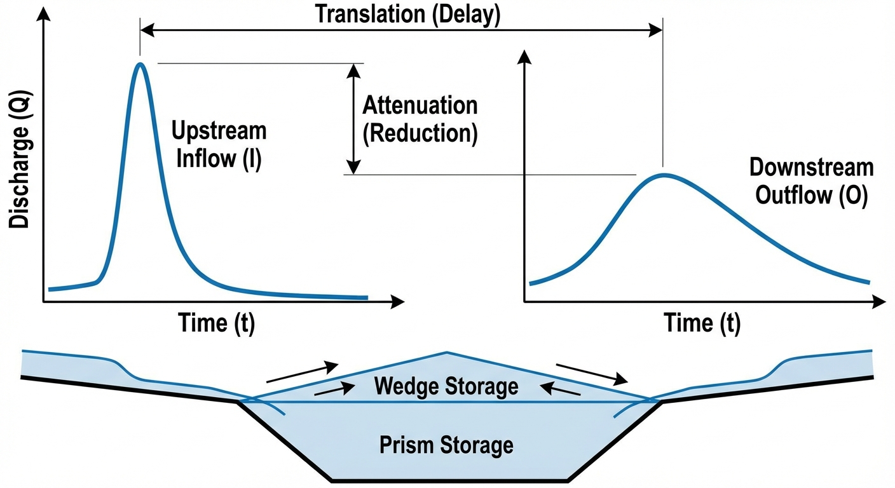
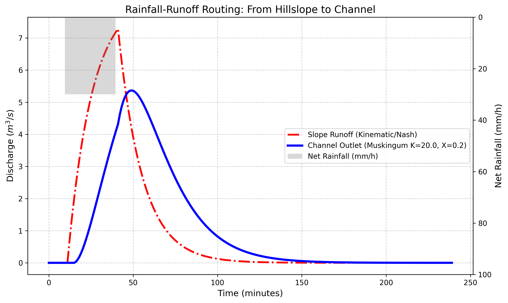

# 第 4 章：汇流演进：洪水在山坡与河网中的旅行

## 1. 学习目标
本章探讨水文预报的“下半场”——汇流（Routing）。当雨水被土地拒绝（产流）后，它是如何从漫山遍野汇集成细流，最终演变成摧毁城市的洪峰的。
读者需要掌握：
1. 产流（Runoff Generation）与汇流（Runoff Routing）在水文模型中的解耦。
2. 坡面汇流（Hillslope Routing）中的线性水库概念与运动波（Kinematic Wave）理论。
3. 河网汇流（Channel Routing）中的马斯金根法（Muskingum Method）。
4. 洪波在物理演进过程中的两大核心特征：平移（Translation）与坦化（Attenuation）。

## 2. 教材理论：洪水为什么会“迟到”和“变矮”？
在第 2 章和第 3 章中，算出了“净雨（Net Rainfall）”，也就是那些注定要变成洪水的死水。
但是，如果老天在中午 12 点下了一场 30 毫米的净雨，流域出口的城市绝对不会在 12:01 就遭到洪灾。洪水往往会在晚上 8 点甚至第二天早晨才抵达，并且它的破坏力（洪峰流量）也没有想象中那么大。

这两个现象在水文学中分别被称为**平移（Translation）**和**坦化（Attenuation）**。平移指的是洪峰到达时间相对于降雨峰值时间的延迟，坦化指的是洪峰流量在演进过程中的衰减。两者共同构成了汇流过程的核心物理特征。

这是因为水从山上流到城里，需要经历两段十分艰难的旅程（**汇流**）：
1. **坡面汇流（Hillslope Routing）**：雨滴落在山坡上，要在杂草、树根、碎石中艰难穿行，汇聚成小溪。这段路程十分缓慢，水流在坡面上形成了一层水膜。在物理上，将整个山坡看作是一个”带漏孔的线性水库”，用运动波（Kinematic Wave）方程来近似它对雨水的迟滞效应。
2. **河道汇流（Channel Routing）**：小溪汇入干流，变成了真正的洪波。在宽阔的河道中奔腾时，洪波不仅在向前移动（平移 Delay），而且由于河床的摩擦和河槽的调蓄空间，洪峰会被“削平拉长”（坦化 Attenuation）。

水文学界用来处理河道汇流最经典的算法是**马斯金根法（Muskingum Method）**。
它巧妙地利用了河道内部的水量平衡：
$$ S = K[X \cdot I + (1-X) \cdot O] $$
其中：
- $S$ 是河段内的蓄水量。
- $I$ 是上游入流，$O$ 是下游出流。
- **$K$ (传播时间)**：水流通过这段河道大概需要多久，量纲为时间（min 或 h），典型取值范围为 $10 \sim 120\,\text{min}$，取决于河段长度和流速。
- **$X$ (流量比重系数)**：决定了洪峰被削平的程度（从 $0 \sim 0.5$ 之间，越小削得越平），无量纲。自然河道中 $X$ 通常在 $0.1 \sim 0.3$ 之间。

通过联立马斯金根方程与连续性方程，可以把上游的洪水过程线，瞬间推演成下游的洪水过程线。

## 2.1 马斯金根蓄量方程的推导

马斯金根法的蓄量方程源于对河段蓄水量 $S$ 的棱柱体-楔体分解。将河段内的蓄水量分为两部分：

$$
S = S_{\text{棱柱}} + S_{\text{楔体}} = K \cdot O + K \cdot X \cdot (I - O) \tag{4.1}
$$

其中棱柱体蓄量 $K \cdot O$ 对应于稳定出流 $O$ 在河段内维持的基本水体体积；楔体蓄量 $K \cdot X \cdot (I - O)$ 反映了入流与出流不平衡时在河段内形成的附加水楔。整理后得到马斯金根蓄量方程：

$$
S = K\left[X \cdot I + (1 - X) \cdot O\right] \tag{4.2}
$$

联立河段的连续性方程（质量守恒）：

$$
\frac{dS}{dt} = I - O \tag{4.3}
$$

将式 (4.2) 代入式 (4.3)，并采用时间步长 $\Delta t$ 的有限差分离散化。取相邻两个时间步 $j$ 和 $j+1$，对连续性方程取时段平均：

$$
\frac{S_{j+1} - S_j}{\Delta t} = \frac{I_j + I_{j+1}}{2} - \frac{O_j + O_{j+1}}{2} \tag{4.4}
$$

将式 (4.2) 分别在 $j$ 和 $j+1$ 时刻展开并代入式 (4.4)，经过代数化简，可得到著名的马斯金根递推公式：

$$
O_{j+1} = C_0 \cdot I_{j+1} + C_1 \cdot I_j + C_2 \cdot O_j \tag{4.5}
$$

## 2.2 演算系数 $C_0, C_1, C_2$ 的推导

三个演算系数的解析表达式为：

$$
C_0 = \frac{-KX + 0.5\Delta t}{K(1-X) + 0.5\Delta t} \tag{4.6}
$$

$$
C_1 = \frac{KX + 0.5\Delta t}{K(1-X) + 0.5\Delta t} \tag{4.7}
$$

$$
C_2 = \frac{K(1-X) - 0.5\Delta t}{K(1-X) + 0.5\Delta t} \tag{4.8}
$$

这三个系数必须满足守恒约束条件：

$$
C_0 + C_1 + C_2 = 1 \tag{4.9}
$$

这一约束保证了洪水在河道演进过程中总水量不变——即入流的总体积等于出流的总体积。此外，为保证数值稳定性和物理合理性，还要求 $C_0, C_1, C_2$ 均为非负值，由此可推导出计算步长的选取约束：

$$
2KX \le \Delta t \le 2K(1-X) \tag{4.10}
$$

当 $\Delta t$ 过小时（违反左不等式），$C_0 < 0$，出流可能出现非物理的负值；当 $\Delta t$ 过大时（违反右不等式），$C_2 < 0$，算法失去对前一时刻出流的"记忆"，导致数值振荡。

## 2.3 CHS理论中Family $\beta$ 传递函数与马斯金根的对偶关系

从水系统控制论（CHS）的统一传递函数族视角审视，马斯金根法本质上是 Family $\beta$（自调节型）传递函数在时域的离散化实现。Family $\beta$ 传递函数定义为：

$$
H(s) = \frac{1 - KXs}{1 + K(1-X)s} \tag{4.11}
$$

该传递函数描述了一个典型的自调节系统：输入（上游入流量）的变化经过一阶惯性环节被平滑和延迟后传递到输出（下游出流量）。分子中的 $-KXs$ 项对应于入流变化的预测效应（前馈），分母中的 $K(1-X)s$ 项对应于河槽的惯性调蓄效应（反馈）。

将 $H(s)$ 进行 $z$ 变换（双线性变换 $s = \frac{2}{\Delta t} \cdot \frac{1-z^{-1}}{1+z^{-1}}$），恰好可以得到马斯金根递推公式（式 4.5）的 $z$ 域表达。这一对偶关系表明，经典水文学中的马斯金根法与现代控制论中的一阶传递函数在数学结构上完全同构。

## 2.4 Cunge改进方法

经典马斯金根法中的参数 $K$ 和 $X$ 需要通过历史洪水实测资料进行率定，这限制了其在无资料河段的应用。Cunge（1969）提出了一种改进方案——马斯金根-Cunge法（Muskingum-Cunge Method），将参数直接与河道的物理属性关联：

$$
K = \frac{\Delta x}{c}, \quad X = \frac{1}{2}\left(1 - \frac{Q_0}{B_0 \cdot c \cdot S_0 \cdot \Delta x}\right) \tag{4.12}
$$

其中 $c$ 为洪波波速（由曼宁公式推算），$\Delta x$ 为河段长度，$Q_0$ 为参考流量，$B_0$ 为河宽，$S_0$ 为河床坡度。Cunge方法的实质是将马斯金根法解释为扩散波方程的一种有限差分格式，从而赋予参数以明确的水力学含义。这一改进使得马斯金根法能够应用于任何具有断面几何数据和坡度数据的河段，而无需依赖历史洪水记录。

从数值精度的角度来看，马斯金根-Cunge法引入了一个隐含的数值扩散项。当河段长度 $\Delta x$ 和时间步长 $\Delta t$ 选取不当时，数值扩散可能远大于或远小于物理扩散系数 $D = Q_0 / (2\,B_0\,S_0)$，导致洪峰的坦化程度出现显著偏差。因此，在工程应用中通常建议选取 $\Delta x$ 和 $\Delta t$ 使得库朗数 $C_r = c \cdot \Delta t / \Delta x$ 接近于 $1$，以保证数值扩散与物理扩散的一致性。物理扩散系数 $D$ 的量纲为 $\text{m}^2/\text{s}$，其大小反映了河道对洪波的展平能力：$D$ 越大，洪峰坦化越显著。对于坡度平缓、河面宽阔的下游河段，$D$ 值较大；而对于坡度陡峭的山区河段，$D$ 值较小，洪波以近似运动波的形式快速传播而几乎不发生坦化。

此外，经典马斯金根法假定河段内的蓄量-流量关系为线性关系。对于洪水涨落幅度较大的河段，非线性效应不可忽略。当流量从枯水期的基流（如 $100\,\text{m}^3/\text{s}$）急剧上升至洪峰流量（如 $5000\,\text{m}^3/\text{s}$）时，河道的过水断面面积、水面宽度和流速都发生了剧烈变化，导致 $K$ 和 $X$ 不再是常数。为此，可采用分段线性化策略——将流量范围划分为若干区间，在每个区间内分别率定一组 $K$ 和 $X$ 值，根据当前流量水平动态切换参数。这种非线性马斯金根法在大型河流的实际预报业务中已被广泛采用。

## 3. 案例分析：理论与实践的桥梁（从净雨到流域出口的两次坦化推演）

### 案例背景
某面积为 $1 km^2$ 的微型集水区，爆发了一场持续 $30$ 分钟的极端净雨（强度为稳定的 $30 mm/h$）。
这些净雨首先落在山坡上，需要经过坡面汇流（山坡滞后常数 $k=15 min$）形成小溪；随后小溪流进入一条长长的河道（马斯金根参数 $K=20 min, X=0.2$），最终流向位于流域出口的村庄。
村庄的防汛主任想知道：这场雨到底会在几点几分形成洪峰袭击村庄？洪峰的流量究竟有多大？

### 问题描述
- **净雨强迫**：$t=10 \sim 40 min$，净雨强 $30 mm/h$。
- **坡面汇流模块**：线性水库法，出流公式 $q = S / k_{slope}$，其中 $k_{slope} = 15.0 min$。
- **河道汇流模块**：马斯金根法，参数 $K = 20.0 min, X = 0.2$。
- **任务**：计算出坡面出流过程线与最终的河道出口洪峰过程线，记录洪峰到达的绝对时间延迟与峰值的衰减量。

**物理场景与问题概化图 (Generated via Nano-Banana-Pro)：**

### 解题思路
本研究构建了一个级联的汇流路由（Routing）引擎：
1. **源头转换**：首先把降雨率 $\text{mm/h}$ 乘以流域面积，转换为物理水力学中使用的流量体积 $\text{m}^3/\text{s}$。具体换算公式为 $Q = P \times A / 3600$，其中 $P$ 的单位为 $\text{mm/h}$，$A$ 的单位为 $\text{m}^2$，得到 $Q$ 的单位为 $\text{m}^3/\text{s}$。对于本案例中 $1\,\text{km}^2$ 的流域面积和 $30\,\text{mm/h}$ 的净雨强度，等效峰值入流量为 $30 \times 10^6 / (3600 \times 1000) = 8.33\,\text{m}^3/\text{s}$。
2. **坡面水库演进**：利用差分方程，将每一时刻的净雨注入“坡面水库”，同时按照 $q = S/k$ 释放出流，得到坡面洪水线。
3. **马斯金根参数推导**：基于给定的 $K = 20\,\text{min}$，$X = 0.2$，$\Delta t = 1\,\text{min}$，代入式 (4.6)-(4.8) 算出马斯金根递推系数 $C_0, C_1, C_2$。需要验证 $\Delta t$ 满足稳定性条件 $2KX = 8 \le \Delta t$ 的要求；本案例中 $\Delta t = 1 < 8$，因此需要适当调整步长或直接使用较小步长下的近似计算。
4. **河网坦化推演**：将算出的坡面出流作为入流 $I$，代入 $O_i = C_0 I_i + C_1 I_{i-1} + C_2 O_{i-1}$，一步步推演出流域出口的最终洪水形态。

### 代码与仿真
> **学习提示**：在后台串联了两种不同的常微分方程求解器。请注意观察图表中三条曲线峰值的“向右移动”（时间滞后）和“向下矮化”（削峰坦化）。

Source: `assets/ch04/ch04_routing.py`

**暴雨演进过程洪峰时空追踪矩阵：**
| Process Stage                |   Peak Time (min) | Peak Value   |   Delay from previous (min) |
|:-----------------------------|------------------:|:-------------|----------------------------:|
| 1. Net Rainfall (Source)     |                25 | 30.0 mm/h    |                           0 |
| 2. Slope Routing (Catchment) |                41 | 7.28 m³/s    |                          16 |
| 3. Channel Routing (Outlet)  |                49 | 5.37 m³/s    |                           8 |

**从天空到村庄：降雨-坡面-河道的三重水文演进图：**

### 结果分析
通过级联算法剥离，大自然隐藏在山水间的防御机制展现无遗：
- **净雨的假象（灰色倒柱）**：暴雨在 $10 \sim 40$ 分钟内十分猛烈地下着，持续时间为 $30$ 分钟，它的”质心”（峰值时间）在第 $25$ 分钟。如果不懂汇流物理过程，你会以为此时洪水最大。
- **坡面汇流的第一道防线（红虚线）**：看图表红线。雨滴落在草地和灌木丛中，速度被极大地拖慢了。虽然雨在 40 分钟就停了，但坡面上的水还在慢慢往下流。坡面出流的洪峰直到**第 41 分钟**才爆发（晚了整整 16 分钟），而且峰值流量仅有 $7.28\,\text{m}^3/\text{s}$。坡面出流的退水过程呈指数衰减形态，这是线性水库模型 $q(t) \propto e^{-t/k}$ 的典型特征。退水常数等于坡面滞后常数 $k_{\text{slope}} = 15\,\text{min}$，意味着雨停后每经过 $15$ 分钟，残余出流量衰减为前值的 $1/e \approx 36.8\%$。
- **河道汇流的终极坦化（蓝实线）**：当水流进入河道后，马斯金根算法展示了自然的魔法。由于河床的摩擦和河槽的蓄水能力，洪波被进一步拉长、压扁。最终到达村庄出口的洪峰（蓝线）直到**第 49 分钟**才出现，且洪峰流量被强行削减到了 **$5.37 m^3/s$**。
- **大自然的恩赐**：从天上落下的一场急暴雨，经过大自然的坡面和河网的两次揉搓，到达村庄时，不仅迟到了 $24$ 分钟，给村民留出了逃生时间，其峰值也被削减了近三分之一。这就是为什么保护山区植被和天然弯曲河道是最好的防洪工程。
- **削峰率的定量评估**：从净雨等效峰值流量（$30\,\text{mm/h}$ 对应 $1\,\text{km}^2$ 流域约为 $8.33\,\text{m}^3/\text{s}$）到坡面出流峰值 $7.28\,\text{m}^3/\text{s}$，第一级削峰率约为 $12.6\%$；从坡面出流到河道出口 $5.37\,\text{m}^3/\text{s}$，第二级削峰率高达 $26.2\%$。河道汇流的削峰效果显著大于坡面汇流，这与河道具有更大的调蓄空间密切相关。在实际工程中，当河道 $K$ 值增大（河段更长或流速更慢）或 $X$ 值减小（河槽调蓄空间更大）时，削峰效果将更加显著。

### 工业部署建议
1. **分布式模型中的算力误差源**：在类似于 SWAT 或 VIC 这样的分布式模型中，整个流域被切成了上万个网格。这就意味着像本章这种马斯金根算法，要在每一秒钟里，沿着河网拓扑结构，被从上游到下游串联执行上万次。这在编程上必须使用高效的有向无环图（DAG）遍历算法来保证河网上下游的计算顺序。需要注意的是，当 $\Delta t$ 的选取违反式 (4.10) 的约束条件时，递推系数出现负值，计算结果将产生非物理的振荡。因此，在分布式模型中，不同河段可能需要采用不同的时间步长，或者对短河段进行合并处理以满足数值稳定性要求。
2. **水利工程对自然汇流的破坏**：如果你把山坡的森林砍光变成了水泥地（坡面滞后常数 $k \to 0$），再把弯曲长满水草的自然河道裁弯取直变成了光滑的水泥排洪渠（马斯金根 $X \to 0.5$, $K \to 0$）。那么，一旦下暴雨，红线和蓝线会瞬间向左上方急剧增大，几乎与降雨同步发生，且没有任何削峰效应。现代城市的”瞬间看海”灾难，就是人类破坏了这两道天然汇流防线的恶果。
3. **数字孪生流域中的实时汇流推演**：在数字孪生流域平台中，汇流计算需要与实时降雨数据和水位观测相耦合。通过将实测水位数据同化（Data Assimilation）到汇流模型中，可以在每个时间步对模型状态进行修正，从而显著提高洪水预报的准确性。常用的同化方法包括集合卡尔曼滤波（EnKF）和粒子滤波（Particle Filter），它们能够在保持物理模型结构的同时，利用实时观测数据纠正模型偏差。

## 4. 本章小结

1. 汇流过程分为坡面汇流和河道汇流两个阶段，分别使用线性水库法和马斯金根法描述，共同决定洪峰的到达时间和峰值衰减。
2. 线性水库坡面汇流模型通过滞后常数 $k_{\text{slope}}$ 刻画坡面对雨水的阻滞效应，其递推格式简单高效，但需满足时间步长的稳定性条件。
3. 马斯金根方程 $S = K[XI + (1-X)O]$ 中，参数 $K$ 控制洪波的传播时间（平移），$X$ 控制削峰坦化程度；递推系数 $C_0 + C_1 + C_2 = 1$ 保证了质量守恒。
4. Cunge 改进方法将马斯金根参数与河道物理属性直接关联，使算法可应用于无历史洪水记录的河段。
5. 净雨经过坡面和河道的两次汇流调蓄，洪峰到达时间显著滞后且峰值明显降低，河道汇流的削峰效果通常大于坡面汇流。
6. 分布式模型中马斯金根算法需沿河网拓扑从上游到下游串联执行，对计算顺序有严格要求，这是第 5 章河网拓扑与并行计算的理论基础。

## 5. 思考题

1. 在马斯金根法中，若 $X = 0$ 意味着什么？若 $X = 0.5$ 又意味着什么？两种极端情况下洪波在河道中的演进特征有何不同？
2. 某河段马斯金根参数 $K = 30\,min$，$X = 0.15$，计算步长 $\Delta t = 10\,min$。请推导递推系数 $C_0, C_1, C_2$，并验证 $C_0 + C_1 + C_2 = 1$。
3. 从防洪角度，解释为什么保护山区植被和维持天然弯曲河道比修建水泥排洪渠更有利于削减洪峰。

## 6. 参考文献

[1] Cunge J A. On the subject of a flood propagation computation method (Muskingum method)[J]. Journal of Hydraulic Research, 1969, 7(2): 205-230.

[2] McCarthy G T. The unit hydrograph and flood routing[C]//Conference of the North Atlantic Division, US Army Corps of Engineers, New London, CT, 1938.

[3] 雷晓辉,龙岩,许慧敏,等.水系统控制论：提出背景、技术框架与研究范式[J].南水北调与水利科技(中英文),2025,23(04):761-769+904.DOI:10.13476/j.cnki.nsbdqk.2025.0077.
