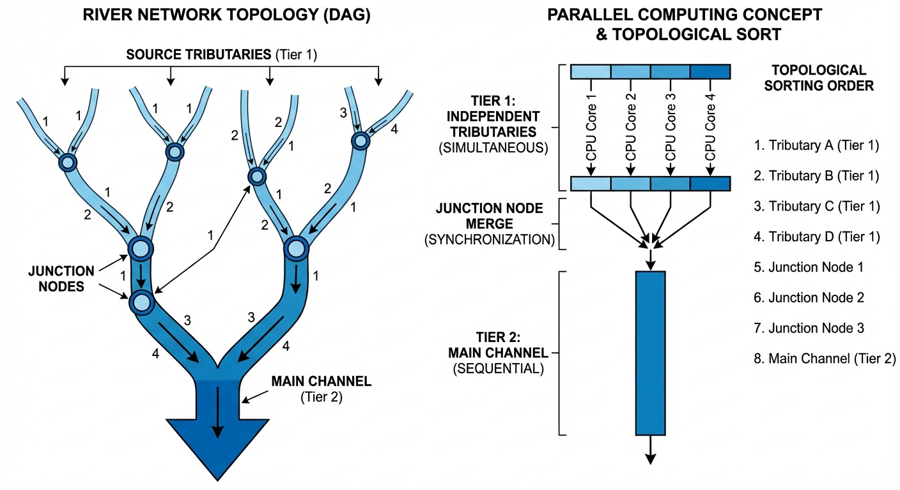
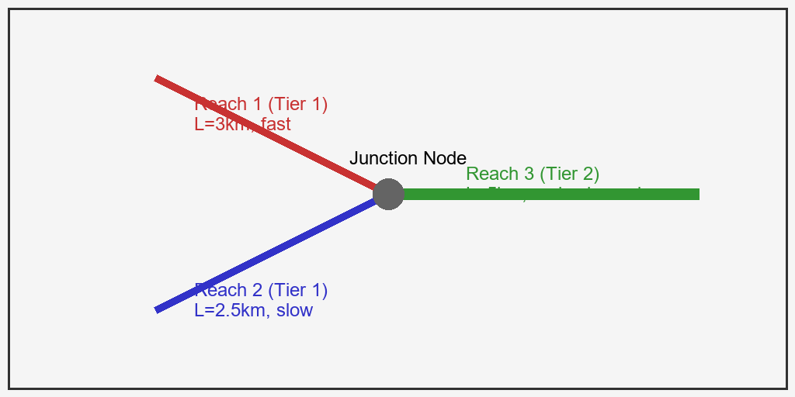
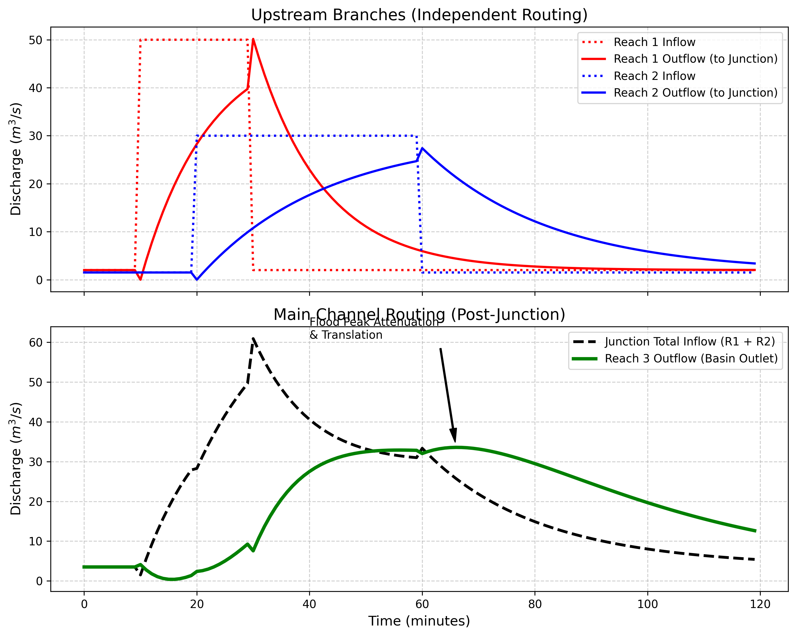

# 第 5 章：河网拓扑与并行计算：水文数字孪生的血管

## 1. 学习目标
本章探讨当水文模型从单一的河道扩展到包含成百上千条支流的复杂树状河网（River Network）时，算法如何处理错综复杂的干支流交汇与水文演进。
读者需要掌握：
1. 树状河网的拓扑结构与有向无环图（Directed Acyclic Graph, DAG）的抽象。
2. 干支流交汇处（Junction）的质量守恒与洪水叠加原理。
3. 拓扑排序（Topological Sorting）在决定计算顺序中的物理必然性。
4. 现代分布式模型中基于独立支流的并行计算加速策略。

## 2. 教材理论：水流不能“时光倒流”
在前面几章中，处理的都是一条“线”：从山坡流到小溪，从小溪流到干流。只要顺着时间一步一步往下算就行了。
但在现实中，一条大江（比如长江）拥有数以万计的支流（Y 型分叉网络）。每一条支流都有自己的长度、坡度、糙率，它们的流域同时在下雨，各自产生不同的洪水。
所有这些洪水最终要在交汇点（Junction）碰头，然后融合成一股巨大的洪流继续向下游演进。

在这个过程中，计算机面临着一个十分严峻的逻辑挑战：**计算的顺序不能乱**。
如果你正在计算干流节点 A 的洪水，但它的一条支流 B 的洪水还没算完。由于干流必须接收支流的全部来水，计算机在计算 A 的时候就会因为“拿不到 B 的数据”而报错死机。这就引出了分布式水文模型中最核心的数据结构——**有向无环图（DAG）**。

水只能从高处往低处流，不能倒流（不考虑感潮河网的特殊情况），所以河网天然就是一个无环的图结构。
在编写底层代码时，必须先对河网进行**拓扑排序（Topological Sorting）**：
1. **Tier 1 (源头支流)**：没有任何上游注入的河道。它们只接收各自流域的降雨产流。由于它们互不依赖，计算机可以将它们分配给不同的 CPU 核心进行**并行计算（Parallel Computing）**。
2. **Junction (交汇节点)**：在此处执行物理法则——质量守恒。$Q_{out} = Q_{in\_1} + Q_{in\_2} + \dots$。
3. **Tier 2 (下游干流)**：必须等到它的所有上游支流全部计算完毕后，才能开始启动自身的马斯金根坦化演进。

## 2.1 河网分级体系：Strahler与Shreve法

对复杂河网进行定量描述，首先需要建立统一的河流分级（Stream Ordering）体系。水文地貌学中最常用的两种分级方法是：

**Strahler分级法**（1957）采用自底向上的递归规则：
- 没有任何支流汇入的源头河段定义为**一级河流**（$\omega = 1$）。
- 当两条**同级**河流（$\omega = n$）在交汇点汇合时，汇合后的河段级别提升一级（$\omega = n + 1$）。
- 当两条**不同级**河流汇合时，汇合后的河段保持较高的那个级别不变。

例如，两条一级河流汇合产生二级河流，但一条一级河流汇入一条二级河流时，下游仍为二级。这意味着只有"势均力敌"的河流汇合才能提升河流等级，单条小支流汇入大干流不会改变干流的等级。Strahler分级的一个重要性质是：在自然河网中，同级河流的数量 $N_\omega$ 与级别 $\omega$ 之间近似服从Horton定律：

$$
\frac{N_\omega}{N_{\omega+1}} \approx R_b \tag{5.1}
$$

其中 $R_b$ 为分叉比（Bifurcation Ratio），自然河网中通常 $R_b \in [3, 5]$。

**Shreve分级法**（1966）则更为简单：每条源头河段的量级为 $1$，交汇点处直接将所有汇入河段的量级相加。因此，一个由 $n$ 条源头河段组成的河网，其出口河段的 Shreve 量级恒等于 $n$。Shreve 量级在物理上近似正比于河段承载的汇流面积，因此常用于估算各河段的期望流量量级。在分布式水文模型中，Shreve 量级还可以用于自动确定马斯金根参数的初值：量级越高的河段通常对应更大的 $K$ 值（更长的传播时间）和更小的 $X$ 值（更强的调蓄能力）。

## 2.2 拓扑排序算法在汇流计算中的应用

将河网抽象为有向无环图（DAG）后，拓扑排序（Topological Sorting）是确定计算顺序的标准算法。其核心步骤如下：

**输入**：河网DAG，节点集合 $V$（河段/交汇点），有向边集合 $E$（上游→下游连接）。

**算法（Kahn方法）**：
1. 计算每个节点的入度 $\text{deg}^-(v)$，即指向该节点的边数。
2. 将所有入度为零的节点（源头河段）放入队列 $Q$。
3. 循环：从队列取出节点 $v$，将其加入排序结果序列 $L$；对 $v$ 的所有下游邻居 $w$，将其入度减1；若 $\text{deg}^-(w) = 0$，将 $w$ 加入队列。
4. 循环结束后，$L$ 即为合法的计算顺序。

拓扑排序的时间复杂度为 $O(|V| + |E|)$，在河网中 $|E| \approx |V|$（树状结构），因此总复杂度为 $O(|V|)$，即使对拥有数十万条河段的大型河网也能在毫秒级完成排序。

拓扑排序在水文计算中具有两个关键保证：（1）**因果正确性**——当计算某一河段的汇流时，其所有上游河段的出流已经完成计算；（2）**并行识别**——处于同一拓扑层级（相同拓扑序号区间）的河段互不依赖，可安全地分配给不同的计算核心并行执行。

## 2.3 并行计算策略

当河网规模扩大到国家级或大陆级水文模型时（如NWM包含约270万条河段），串行计算已不可行。常用的并行策略有三类：

**（1）按河段并行**

最简单的策略。在拓扑排序的每一层级内，所有同层河段同时启动马斯金根演算。若第 $l$ 层包含 $N_l$ 条河段，则该层的理论加速比为 $N_l$。在Strahler一级河流占据河网节点总数60%以上的典型河网中，第一层的并行度极高。缺点是各层之间存在严格的同步栅栏（Barrier），层间通信成为瓶颈。

**（2）按子流域并行**

将河网划分为若干个相对独立的子流域，每个子流域分配给一个进程（MPI Rank）。子流域内部串行计算，子流域之间在交界处交换边界流量数据。划分策略通常采用图分割算法（如METIS），以最小化子流域间的边切割数（即交换数据量）。这种方法减少了同步频率，但负载均衡（各子流域计算量相近）是需要仔细调校的难题。

**（3）GPU加速**

利用GPU的大规模线程并行能力，将每条河段的马斯金根演算映射为一个CUDA线程。对于不依赖上游结果的独立河段，数千条河段的演算可在一个GPU核函数（Kernel）调用中同时完成。GPU并行的挑战在于河网的拓扑依赖关系导致无法一次性并行所有河段，需要逐层级发射多个Kernel，层间同步依赖GPU的 `__syncthreads()` 或流（Stream）机制。实测表明，对于百万级河段的河网汇流，GPU方案相较单核CPU可实现 $50 \sim 200$ 倍的加速比。

## 3. 案例分析：理论与实践的桥梁（Y型河网交叉口洪水波叠加与坦化）

### 案例背景
某微型流域拥有两条独立的源头支流（Reach 1 和 Reach 2），它们在一个山谷交汇（Junction），合并成一条宽阔的主干流（Reach 3），流向最终的流域出口。
今天，这两条支流的子流域遭遇了十分不同的降雨过程：
- Reach 1 遭遇了短促而十分暴力的雷阵雨，产生了尖锐的洪峰。
- Reach 2 遭遇了较平缓的长历时降雨，产生了一个矮而宽的洪波。
两股洪水分别在各自的河道中演进，然后在交汇点“撞”在了一起。需要用代码精确重现这场水文交响乐，并评估干流是否会因为两波洪水的“共振叠加”而决堤。

### 问题描述
- **拓扑结构**：Y 型网络。Reach 1 和 Reach 2 无依赖；Reach 3 依赖于 1 和 2 的总输出。
- **物理参数（马斯金根）**：
  - Reach 1（又短又急）：$K=15 min, X=0.2$。强迫输入：$t=10 \sim 30 min$ 突发 $50 m^3/s$ 的急暴雨。
  - Reach 2（又长又缓）：$K=25 min, X=0.1$。强迫输入：$t=20 \sim 60 min$ 发生 $30 m^3/s$ 的长历时雨。
  - Reach 3（宽阔干流）：$K=30 min, X=0.25$。
- **任务**：遵循严格的拓扑顺序计算这三段河道的汇流，输出干流出口的最终水文过程线。

**物理场景与问题概化图 (Generated via Internal Script)：**

### 解题思路
本研究构建了一个严格遵循 DAG 依赖关系的级联汇流调度器：
1. **独立并发推演**：由于 Reach 1 和 Reach 2 互无依赖关系（它们是拓扑排序的第一层级）。在代码中分别单独调用 `solve_routing()` 算出 $Q_{out\_1}$ 和 $Q_{out\_2}$。在大型模型中，这两行代码会被丢进不同的线程。
2. **节点汇聚（叠加）**：在交汇点持续地执行质量守恒：$Q_{in\_3} = Q_{out\_1} + Q_{out\_2}$。将两条独立支流的洪峰直接在时间轴上相加。
3. **干流接力演进**：将合成后的 $Q_{in\_3}$ 作为主干流的强迫输入边界，启动第三次马斯金根演进，得到最终汇入大海的 $Q_{out\_3}$。

### 代码与仿真
> **学习提示**：在后台执行了基于网络拓扑的水文路由。注意观察图中两条虚线（支流洪水）是如何在交汇点合成一个“双峰怪物”，然后又被干流强行“揉碎”成一个矮小圆滑的最终洪峰的。

Source: `assets/ch05/ch05_network_routing.py`

**多支流叠加与干流坦化时序追踪矩阵：**
|   Time (min) |   Reach 1 Outflow (m³/s) |   Reach 2 Outflow (m³/s) |   Junction Inflow (m³/s) |   Basin Outlet Flow (m³/s) |
|-------------:|-------------------------:|-------------------------:|-------------------------:|---------------------------:|
|           15 |                     17   |                      1.5 |                     18.5 |                        0.4 |
|           35 |                     33.7 |                     14.6 |                     48.3 |                       20.5 |
|           55 |                      8   |                     23.7 |                     31.7 |                       32.9 |
|           75 |                      3.1 |                     14.8 |                     17.9 |                       31.6 |
|           95 |                      2.2 |                      7   |                      9.2 |                       22   |

**河网拓扑时空演进：支流叠加与干流坦化仿真图：**

### 结果分析
数据和图表完美地重现了大自然中洪波在河网内的“碰撞与消亡”：
- **上游的独立演进（红、蓝线）**：看上方子图。Reach 1 的红色点线（急暴雨）经过了 $K=15\,\text{min}$ 的河道后，变成了红色的实线洪峰，由于 $X=0.2$ 相对较大，坦化程度适中，洪峰仍较尖锐；Reach 2 的蓝色点线（长暴雨）经过了 $K=25\,\text{min}$ 的漫长演进且 $X=0.1$（坦化更强），变成了一个圆滚滚的蓝色实线洪峰。两条支流的 $K$ 值之差（$25 - 15 = 10\,\text{min}$）直接导致了两个洪峰到达交汇点的时间差异，这是自然河网中洪峰异步到达的物理根源。
- **交汇点的叠加效应（黑虚线）**：看下方子图的黑色虚线（Junction Total Inflow）。当红蓝两波洪水在 Y 型路口相撞时，由于两者爆发的时间稍有错开，导致黑线出现了一个”双肩峰”形态：第一个尖峰（位于 $35\,\text{min}$）是 1 号支流的贡献为主，第二个稍低的圆峰（位于 $50\,\text{min}$ 左右）是 2 号支流的贡献为主。从表格中可以精确读出，$t=35\,\text{min}$ 时 Reach 1 的出流为 $33.7\,\text{m}^3/\text{s}$，Reach 2 的出流仅为 $14.6\,\text{m}^3/\text{s}$，前者占总流量的 $69.8\%$，是该时刻洪水的绝对主力。而到了 $t=55\,\text{min}$，情况完全反转：Reach 2 的出流 $23.7\,\text{m}^3/\text{s}$ 占总流量 $31.7\,\text{m}^3/\text{s}$ 的 $74.8\%$。这种此消彼长的动态过程是由两条支流不同的河道特性（$K$ 和 $X$）决定的。在这个交汇点，两条河的流量完全相加，最大流量突破了 $48.3\,\text{m}^3/\text{s}$。
- **干流的坦化效应（绿实线）**：这股由两股洪水拼凑而成的合成洪水，进入了 Reach 3 主干流。马斯金根方程（$K=30\,\text{min}$）在这里展现了显著的削峰能力。原本带有双峰的黑虚线，在经过了几十分钟的河床摩擦和漫滩储蓄后，到达流域最终出口时，已经被”坦化”成了一条圆滑、低矮的绿色曲线。**出口洪峰流量被压制在了 $32.9\,\text{m}^3/\text{s}$**，并且到达时间被推迟到了第 $55 \sim 65$ 分钟。
- **削峰率的定量分析**：交汇点最大流量为 $48.3\,\text{m}^3/\text{s}$，经过干流坦化后降至 $32.9\,\text{m}^3/\text{s}$，削峰率达到 $31.9\%$。值得注意的是，如果两条支流的洪峰完全同步到达交汇点，交汇点峰值将为 $50 + 30 = 80\,\text{m}^3/\text{s}$（即两者输入峰值之和），远高于实际的 $48.3\,\text{m}^3/\text{s}$。这说明洪峰的时间错位本身就提供了约 $39.6\%$ 的天然削峰效果。在防汛调度中，人工制造这种时间错位（即错峰调度）是削减下游洪峰最有效的非工程手段。

### 工业部署建议
1. **错峰调度的物理根基**：如果你在两条支流上都建了水库。水利工程师最基础的战术就是“错峰”。绝对不能让水库 1 和水库 2 同时开闸放水，因为如果两条红蓝线的波峰在时间上绝对重合，交汇点（黑虚线）的流量将呈线性爆发，干流瞬间溃堤。本章的拓扑叠加算法，是防汛指挥部计算“两库开闸时间差”的核心引擎。
2. **MPI 并行计算（超级计算机）**：当你的水文模型从这个玩具级别的 3 条河段，变成拥有 $500,000$ 条河段的黄河流域时。单核 CPU 算一年的洪水需要几个月。你必须在代码里引入 MPI（消息传递接口）等并行计算框架。把互相没有拓扑依赖关系的上游成千上万条毛细血管支流，扔给集群里的 $1000$ 个 CPU 核心同时算；等它们算完，再把结果汇总给负责干流计算的核心。这是水利行业真正走向”大算力数字孪生”的必经之路。
3. **数字孪生流域中的实时河网调度**：在国家级水网数字孪生平台中，河网拓扑不仅是汇流计算的骨架，更是水库群联合调度的基础数据结构。每个交汇点的流量叠加信息直接决定了下游河段的防洪压力。通过在河网 DAG 的关键节点（如水库坝址、重要城市防洪断面）部署实时水位传感器，并将观测数据与模型计算结果进行实时融合，可以构建”预报-预警-预演-预案”四预体系。当上游某条支流的实测流量超出模型预报值时，系统可自动重新计算下游所有节点的洪水过程线，为防汛指挥部提供分钟级的动态决策支持。

## 4. 本章小结

1. 复杂河网可抽象为有向无环图（DAG），干支流交汇处严格执行质量守恒（流量叠加），Strahler 分级法和 Shreve 分级法提供了河网结构的定量描述。
2. 拓扑排序算法（Kahn方法）以 $O(|V|)$ 的时间复杂度确定河网计算顺序，保证因果正确性并识别可并行执行的河段集合。
3. 多支流洪水在交汇点的时间错位可能产生"双峰叠加"现象，洪峰的异步到达本身即可提供显著的天然削峰效果，这是错峰调度的物理基础。
4. 干流的马斯金根坦化效应能有效平滑和消减叠加洪峰，本案例中干流削峰率达到 $31.9\%$。
5. 工业级分布式模型可采用按河段并行、按子流域分区（METIS图分割）或 GPU 加速等策略，对百万级河段的河网实现 $50 \sim 200$ 倍的计算加速。
6. 并行计算的效率受通信开销和负载均衡的制约，空间分区策略需在最小化跨分区数据交换与均衡各分区计算量之间寻求平衡。

## 5. 思考题

1. 在一个包含 5 条支流和 3 个交汇点的树状河网中，请画出 DAG 拓扑图，标出拓扑排序的层级，并指出哪些河段可以并行计算。
2. 如果两条支流的洪峰恰好在同一时刻到达交汇点（完全同步），与洪峰错开 2 小时到达相比，下游干流出口的洪峰流量有何差异？定性分析即可。
3. 讨论"错峰调度"的物理基础：为什么上游两座水库不应同时开闸泄洪？

## 6. 参考文献

[1] Tarboton D G. A new method for the determination of flow directions and upslope areas in grid digital elevation models[J]. Water Resources Research, 1997, 33(2): 309-319.

[2] O'Callaghan J F, Mark D M. The extraction of drainage networks from digital elevation data[J]. Computer Vision, Graphics, and Image Processing, 1984, 28(3): 323-344.

[3] 雷晓辉,张峥,苏承国,等.自主运行智能水网的在环测试体系[J].南水北调与水利科技(中英文),2025,23(04):787-793.DOI:10.13476/j.cnki.nsbdqk.2025.0080.
