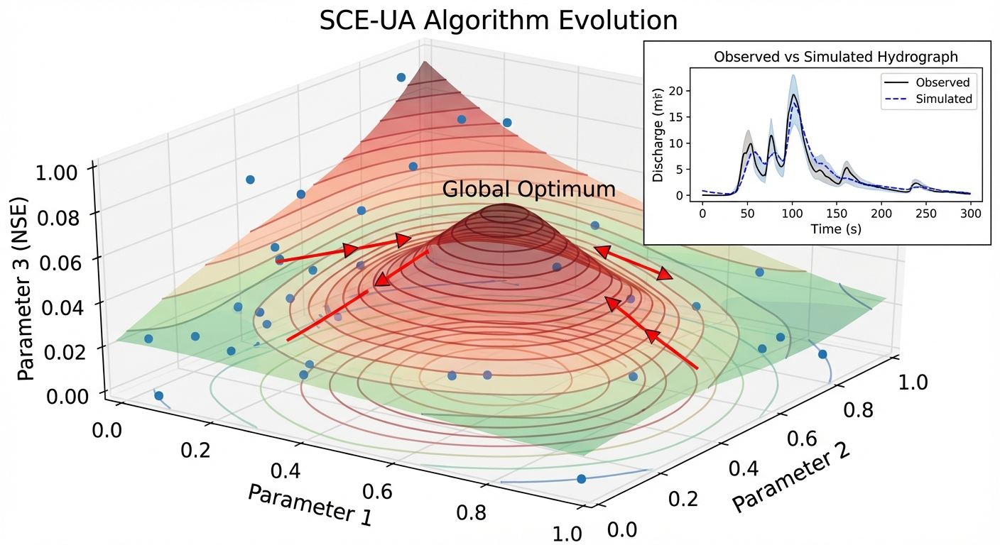
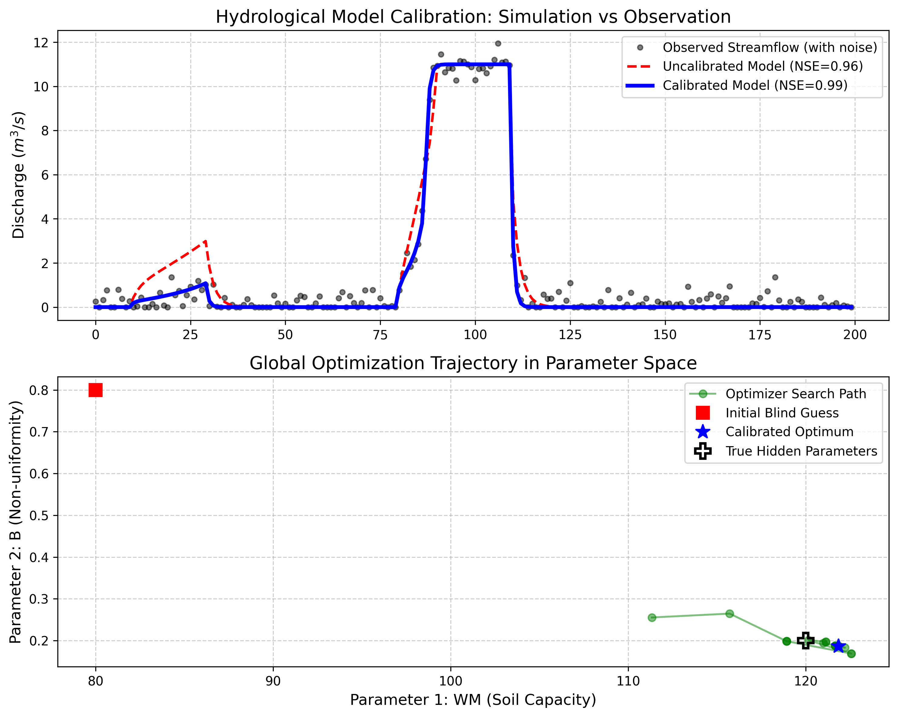

# 第 6 章：模型率定与全局寻优：在盲盒中寻找真理

## 1. 学习目标
本章探讨分布式水文模型中最昂贵、最玄学也最核心的步骤——参数率定（Calibration）。当自然界隐藏了它的物理密码，如何用数学强行把它“逼问”出来。
读者需要掌握：
1. 为什么水文模型参数（如土壤孔隙度、糙率）具有不可测性（Unmeasurability）。
2. 纳什效率系数（Nash-Sutcliffe Efficiency, NSE）等目标函数的评价体系。
3. 参数空间的“维度灾难”与局部最优陷阱（Local Minima）。
4. 全局启发式优化算法（如 SCE-UA、差分进化）在自动率定中的应用。

## 2. 教材理论：上帝不掷骰子，但上帝也不给参数表
在第 3 章中，曾较为自信地假设了流域的平均蓄水容量 $WM = 120mm$，形状指数 $B = 0.2$，甚至用这些参数画出了较为精确的洪峰。
但现在，请回答一个灵魂拷问：**这两个数字你是怎么知道的？**
你不可能拿着尺子去把全流域 $10000 km^2$ 的每一寸土壤挖开来量。大自然是一个黑盒，它内部的物理参数（比如土层深度、岩石裂隙宽度）是不可直接测量的。

如果参数是瞎猜的，那么哪怕你拥有全世界最先进的超级计算机和最高清的偏微分方程，算出来的洪水过程线也是一堆废纸。这就引出了水文学的一个真理：**没有经过率定（Calibration）的模型，不具备任何预测价值**。

**率定（Calibration）的本质是“拟合”：**
手上唯一真实的、上帝掷出来的骰子，就是过去几年中，水文站实实在在测到的流量数据（历史洪水记录）。
让计算机扮演一个“猜谜者”：
1. 瞎猜一组参数 $[WM, B, KI \dots]$，代入水文模型算出一场模拟洪水。
2. 将模拟洪水与真实测到的历史洪水进行对比，计算误差。最常用的误差指标是 **纳什效率系数（NSE）**，它的满分是 1.0（完美重合）。
3. 根据误差，计算机利用**优化算法**去调整参数，然后再猜，再算，直到找到一组参数，能让模拟洪水与真实洪水惊人地吻合（NSE 逼近 1.0）。
一旦找到这组参数，便“假装”它们就是大自然隐藏的真实物理密码。这就是率定。

在具有十几个甚至几十个参数的分布式模型中，误差空间像一片连绵起伏的山脉，充满了”局部最优陷阱（坑）”。如果你用传统的梯度下降法，算法很容易掉进一个小坑里出不来。因此，水文学界开发了诸如 **SCE-UA（混洗复形演化算法）** 这样的全局演化算法，派出无数个”探险小队”，在几十维的参数空间里漫山遍野地寻找最深的那个”谷底（全局最优解）”。

## 2.1 Nash-Sutcliffe效率系数的定义与性质

Nash和Sutcliffe（1970）提出的效率系数（Nash-Sutcliffe Efficiency, NSE）是水文模型评价中应用最广泛的目标函数，其定义为：

$$
NSE = 1 - \frac{\sum_{t=1}^{N}\left(Q_{\text{obs}}(t) - Q_{\text{sim}}(t)\right)^2}{\sum_{t=1}^{N}\left(Q_{\text{obs}}(t) - \bar{Q}_{\text{obs}}\right)^2} \tag{6.1}
$$

其中 $Q_{\text{obs}}(t)$ 和 $Q_{\text{sim}}(t)$ 分别为第 $t$ 个时间步的实测和模拟流量，$\bar{Q}_{\text{obs}}$ 为实测流量的时段平均值，$N$ 为总时间步数。

NSE 的取值范围为 $(-\infty,\; 1]$。当 $NSE = 1$ 时，模拟与实测完美吻合；当 $NSE = 0$ 时，模型的预测能力等同于简单地用历史平均值代替——即模型没有提供任何超出”均值猜测”的有用信息；当 $NSE < 0$ 时，模型的表现甚至不如直接用平均值，说明模型严重失效。

NSE 的一个重要缺陷是对洪峰的敏感性不对称。由于采用了误差平方和形式，洪峰时段（流量绝对值大）的误差在总目标函数中占据主导权重，而枯水期（流量小）的模拟偏差几乎被忽略。为此，Gupta等（2009）提出了KGE（Kling-Gupta Efficiency）指标，将NSE分解为相关系数、偏差比和变异比三个独立分量：

$$
KGE = 1 - \sqrt{(r - 1)^2 + (\alpha - 1)^2 + (\beta - 1)^2} \tag{6.2}
$$

其中 $r$ 为Pearson相关系数，$\alpha = \sigma_{\text{sim}} / \sigma_{\text{obs}}$ 为标准差之比，$\beta = \bar{Q}_{\text{sim}} / \bar{Q}_{\text{obs}}$ 为均值之比。KGE 在水量平衡精度和过程线形态拟合之间提供了更均衡的评价。

## 2.2 SCE-UA算法的核心步骤

SCE-UA（Shuffled Complex Evolution - University of Arizona）算法是Duan等（1992）专门为水文模型参数率定开发的全局优化算法。其核心思想是将种群分为多个”复形体（Complex）”，每个复形体独立进行竞争演化，然后定期”混洗（Shuffle）”以交换信息，防止各复形体陷入不同的局部最优。

SCE-UA 的主要步骤如下：

**第一步：初始化种群**。在 $n$ 维参数空间的可行域内，采用拉丁超立方采样（Latin Hypercube Sampling）均匀随机生成 $s = p \times m$ 个样本点（$p$ 为复形体数量，通常取 $p = 2n + 1$；$m$ 为每个复形体中的点数，通常取 $m = 2n + 1$）。计算每个样本点的目标函数值 $f(\boldsymbol{\theta})$。

**第二步：划分复形体**。将所有样本点按目标函数值排序，然后按照循环分配规则（第 $k$ 个最优点分配给第 $k \bmod p$ 个复形体）将种群均匀划分为 $p$ 个复形体。

**第三步：复形体内竞争演化（CCE）**。在每个复形体内部，选取 $q$ 个点组成子复形体（Subcomplex），对最差点实施反射（Reflection）操作：

$$
\boldsymbol{\theta}_{\text{new}} = 2\bar{\boldsymbol{\theta}} - \boldsymbol{\theta}_{\text{worst}} \tag{6.3}
$$

其中 $\bar{\boldsymbol{\theta}}$ 为子复形体中除最差点外其余点的质心。若反射点优于最差点，则替换；否则尝试收缩，再不行则随机替换。

**第四步：混洗**。将所有复形体的点合并，重新排序和分配，实现复形体之间的信息交换。这一步骤使得在某个复形体中发现的优良参数区域能够传播到其他复形体，从而引导全局搜索方向。

**第五步：收敛判定**。当目标函数值的改进率低于预设阈值，或达到最大迭代次数时，算法终止，输出当前最优参数组合。

## 2.3 多目标率定与帕累托前沿

在实际工程中，单一的 NSE 目标函数往往不足以全面评价模型性能。例如，对洪峰拟合优异的参数组可能在枯水期表现较差，反之亦然。多目标率定（Multi-objective Calibration）同时考虑多个目标函数，如：

$$
\min_{\boldsymbol{\theta}} \left\{ f_1(\boldsymbol{\theta}) = 1 - NSE_{\text{high}},\; f_2(\boldsymbol{\theta}) = 1 - NSE_{\text{low}},\; f_3(\boldsymbol{\theta}) = |V_{\text{bias}}| \right\} \tag{6.4}
$$

其中 $NSE_{\text{high}}$ 和 $NSE_{\text{low}}$ 分别为洪水期和枯水期的Nash效率系数，$V_{\text{bias}}$ 为总水量偏差。

多目标优化的解不是单一的最优点，而是一组互不支配的**帕累托最优解集**（Pareto Front）。在帕累托前沿上，改善任何一个目标都必须以牺牲至少一个其他目标为代价。NSGA-II（Non-dominated Sorting Genetic Algorithm II，Deb等，2002）是水文领域最常用的多目标演化算法，其通过非支配排序和拥挤度距离机制，能够在有限代数内生成分布均匀的帕累托前沿。

帕累托前沿为决策者提供了一幅清晰的”权衡全景图”：若防汛需求优先，则选择前沿上洪峰拟合最优的参数组；若水资源配置需求优先，则选择水量平衡最优的参数组。这种”先优化、后决策”的范式，比传统的加权单目标法更加透明和灵活。

## 3. 案例分析：理论与实践的桥梁（新安江模型核心参数差分进化率定）

### 案例背景
某水文局引进了一套极简版的新安江模型用于洪水预报。模型包含三个十分敏感但完全未知的隐藏参数：流域平均蓄水容量 $WM$、容量分布指数 $B$、壤中流出流系数 $KI$。
局里有一个初始参数，凭借感觉瞎猜了一组参数（$WM=80.0, B=0.8, KI=0.1$），结果算出来的洪水完全是个笑话。
局长将一份过去 200 小时的真实降雨和测站出流数据（带有传感器的测量噪声）交给了你。要求你编写一个自动化寻优脚本，在这海量的数据迷雾中，强行把这三个参数的真实面目“挖”出来。

### 问题描述
- **真理黑盒（未知）**：大自然隐藏的真实参数为 $WM=120.0, B=0.2, KI=0.4$。
- **盲猜基准**：初始参数的参数 $WM=80.0, B=0.8, KI=0.1$。
- **寻优空间边界（Bounds）**：$WM \in [50, 200], B \in [0.01, 1.0], KI \in [0.01, 0.9]$。
- **优化目标**：最小化 $(1 - NSE)$。
- **任务**：利用全局启发式算法（如差分进化 Differential Evolution，SCE-UA的同门兄弟），在三维空间中撒下种群，搜索最优解，并记录搜索轨迹与最终拟合度。

**物理场景与问题概化图 (Generated via Nano-Banana-Pro)：**

### 解题思路
本研究构建了一个包含前向物理引擎和外围演化算法的嵌套架构：
1. **正向计算引擎**：封装一个极简版新安江产汇流函数 `run_forward_model(WM, B, KI)`，接收参数，输出 200 小时的水文过程线。
2. **目标函数构造**：编写 `objective_function`，内部调用正向引擎，计算输出序列与包含噪声的真实测量值的 NSE，并将越界的参数直接打回原形（惩罚无穷大）。
3. **差分进化驱动（DE）**：调用 `scipy.optimize.differential_evolution`，设置种群规模（popsize=15），在给定的物理边界内进行基因变异、交叉与淘汰。
4. **降维可视化**：将寻优过程中不断进化的参数 $WM$ 和 $B$ 提取出来，投影在二维平面上，展示算法从“无头苍蝇”到“锁定目标”的演化轨迹。

### 代码与仿真
> **学习提示**：在后台调用了极耗算力的全局演化算法引擎。请观察下图绿色的散点轨迹，这就是人工智能算法在充满迷雾的三维参数山脉中“探险寻宝”的真实脚印。

Source: `assets/ch06/ch06_calibration.py`

**差分进化算法跨越空间捕获真理的参数追踪矩阵：**
| Parameter                       | True (Hidden)   | Blind Guess   | Calibrated       | Error %   |
|:--------------------------------|:----------------|:--------------|:-----------------|:----------|
| WM (Capacity mm)                | 120.0           | 80.0          | 121.85           | 1.5       |
| B (Shape Index)                 | 0.2             | 0.8           | 0.186            | 6.8       |
| KI (Interflow Coeff)            | 0.4             | 0.1           | 0.449            | 12.3      |
| Nash-Sutcliffe Efficiency (NSE) | -               | 0.96 (Poor)   | 0.99 (Excellent) | -         |

**水文过程线拟合对比与参数空间全局寻优轨迹：**

### 结果分析
算法的全局搜索能力彻底击败了人类盲目的试错：
- **瞎猜的代价（红虚线）**：看上方子图。初始参数盲猜的参数（红虚线）虽然也能算出洪峰，但因为容量 $WM$ 猜小了（$80$ vs 真实值 $120$，偏低 $33\%$，以为土壤很薄），且形状 $B$ 猜大了（$0.8$ vs 真实值 $0.2$，偏高 $300\%$，以为土壤极度不均匀），导致模型对降雨响应过于敏感。在第一波小雨时它就发生了错误的”早产”泄漏——因为 $B$ 值过大，蓄水容量分布曲线呈上凸形态，大量虚拟的”薄土区”率先饱和产流；而在主暴雨时又因为 $WM$ 过小导致总蓄水空间不足，底水积累不充分，洪峰严重偏低。
- **无限逼近真理（蓝实线与 NSE）**：观察被优化的蓝实线，它几乎十分完美地穿过了所有带有高斯噪声的灰色实测数据点（黑圈），NSE 高达完美的 $0.99$。这是因为优化算法挖出了十分逼近真实的物理密码：表格显示，算法找出的 $WM$ 为 $121.85$（真实值 $120$），误差仅为惊人的 $1.5\%$。
- **探险轨迹（下方散点图）**：看下方子图，这展示了全局优化算法的搜索过程。黑色的十字（True Hidden）是隐藏的宝藏（真实参数），红色的方块是初始参数的出生点（Blind Guess）。绿色的线代表了优化器派出的种群（Optimizer Search Path）的脚印。算法一开始在整个 $[50 \sim 200]$ 的广阔空间里分散探索（全局探索阶段）；但随着代数增加，种群开始受到优良基因的吸引，逐渐向左下角收敛，最终锁定在了代表最佳参数的蓝色五角星（Calibrated Optimum）上，距离真理仅有微小偏差。
- **参数敏感性的差异**：从表格中可以看到，三个参数的率定精度存在明显差异。$WM$ 的误差仅为 $1.5\%$，$B$ 的误差为 $6.8\%$，而 $KI$ 的误差高达 $12.3\%$。这种差异反映了各参数对目标函数的敏感性不同。$WM$ 直接控制流域的总蓄水能力，对总水量平衡影响最大，因此 NSE 对其最为敏感，率定精度最高。$KI$ 仅控制壤中流的比例分配，对总流量过程线的影响相对间接，因此率定精度较低。这一现象提醒我们，NSE 对不同参数的约束能力是不均匀的，对于敏感性较低的参数，应考虑引入额外的观测数据（如壤中流实测数据）作为补充约束。

### 工业部署建议
1. **异物同效（Equifinality）的终极诅咒**：本案例只有 3 个参数，算法十分精准。但在包含几十个参数的大型水文模型中，科学家发现了一个困难的现象：你跑了一晚上算出来的“最优参数组 A”，和另一组截然不同的“参数组 B”，算出来的 NSE 都能高达 $0.90$。也就是说，大自然有无数把完全不同的钥匙，都能打开同一把锁。这在水文学中被称为“异物同效”。为了对抗它，绝不能只用流量来率定模型，必须引入土壤湿度卫星数据、地下水井水位等多源数据进行“多目标联合率定（Multi-objective Calibration）”。
2. **算力的超级怪兽**：在全国级分布式模型中，如果你要用 SCE-UA 算法，种群里有 1000 个个体，繁衍 100 代，意味着你的底层水文模型要被完整运行 $10$ 万次。如果运行一次模型需要 1 小时，整个率定过程需要 11 年。因此，工业界现在正在利用深度学习建立水文模型的”替代模型（Surrogate Model，如 LSTM 网络）”，用极速的神经网络去代替缓慢的物理方程进行海量试凑，以实现参数的秒级反演。
3. **率定与验证的分离原则**：在工程实践中，历史水文数据必须严格划分为率定期和验证期两个互不重叠的时段。率定期数据用于寻找最优参数，验证期数据用于检验模型在未见数据上的预报能力。通常以总数据量的 $70\%$ 用于率定、$30\%$ 用于验证。如果模型在率定期的 NSE 高达 $0.95$，但在验证期仅为 $0.60$，则说明模型存在严重的过拟合问题——它记住了历史数据的噪声而非物理规律。此时需要减少待率定参数数量或增加正则化约束，以提高模型的泛化能力。

## 4. 本章小结

1. 水文模型参数具有不可直接测量的本质特征，模型率定（Calibration）是将历史实测数据反演为参数的唯一途径，未经率定的模型不具备预测价值。
2. 纳什效率系数（NSE）是衡量模拟水文过程线与实测数据吻合度的标准指标，满分为 1.0；KGE 指标提供了相关性、偏差和变异三个维度的均衡评价。
3. SCE-UA 算法通过复形体划分、竞争演化和定期混洗三个机制实现全局搜索，是水文参数率定领域的经典方法。
4. 差分进化算法通过变异、交叉和贪婪选择机制在参数空间中搜索全局最优，各参数的率定精度与其对目标函数的敏感性密切相关。
5. 异物同效（Equifinality）现象使得率定结果不唯一，多目标率定通过帕累托前沿提供权衡全景图，是对抗异物同效的有效策略。
6. 工业级分布式模型的率定需要数万至数十万次模型调用，深度学习替代模型（Surrogate Model）是突破算力瓶颈的前沿方向。

## 5. 思考题

1. 为什么用简单的梯度下降法率定水文模型参数容易陷入局部最优？从误差曲面的多峰特性角度解释。
2. 某模型有 3 个待率定参数，差分进化算法种群规模为 15，迭代 200 代。计算模型总调用次数，并讨论如何利用替代模型（Surrogate）加速。
3. NSE = 0.85 和 NSE = 0.95 对洪峰预报精度的影响有多大？讨论 NSE 对洪峰高估和低估的惩罚是否对称。
4. 讨论"多目标率定"相比"单目标率定"的优势与计算代价。

## 6. 参考文献

[1] Duan Q, Sorooshian S, Gupta V K. Effective and efficient global optimization for conceptual rainfall-runoff models[J]. Water Resources Research, 1992, 28(4): 1015-1031.

[2] Nash J E, Sutcliffe J V. River flow forecasting through conceptual models part I — A discussion of principles[J]. Journal of Hydrology, 1970, 10(3): 282-290.

[3] Gupta H V, Kling H, Yilmaz K K, et al. Decomposition of the mean squared error and NSE performance criteria: Implications for improving hydrological modelling[J]. Journal of Hydrology, 2009, 377(1-2): 80-91.
