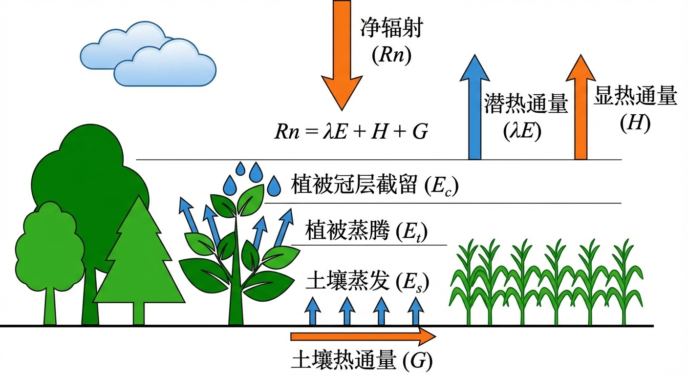
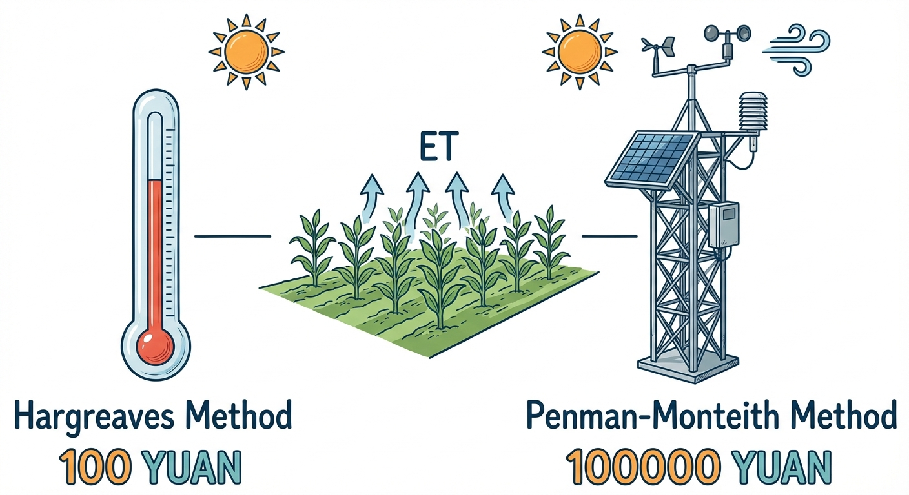
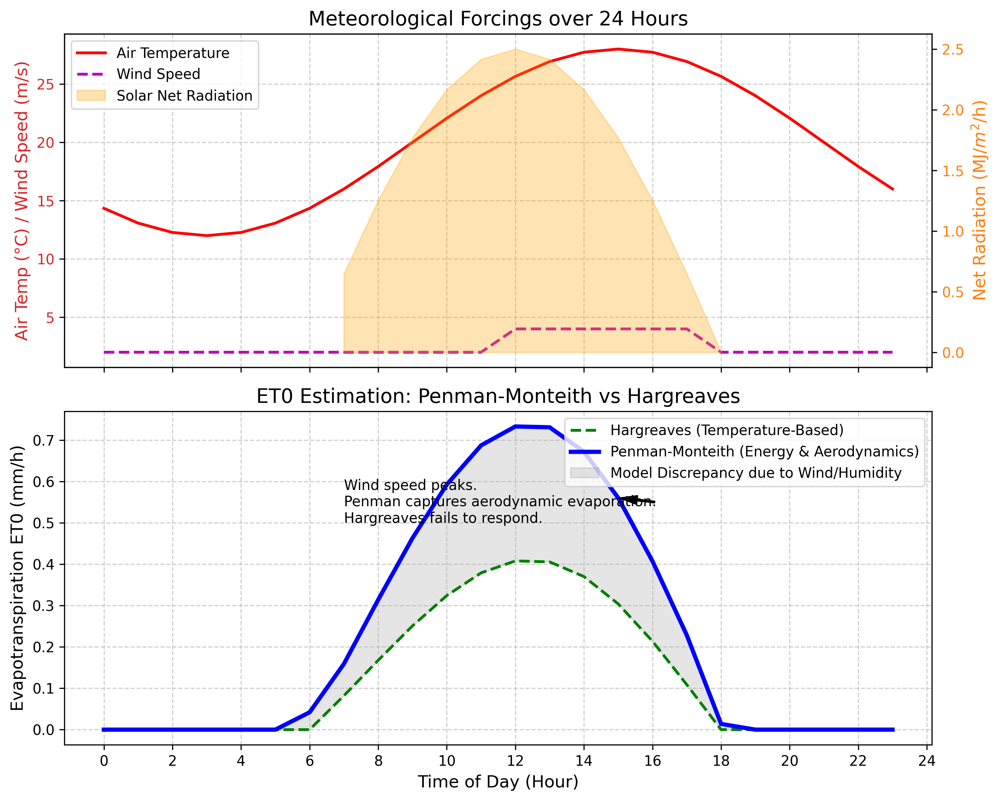

# 第 7 章：蒸散发模拟：被阳光和风偷走的水

## 1. 学习目标
本章探讨水循环中最容易被忽视、却占据了陆地降雨量极大比例的无形消耗项——蒸散发（Evapotranspiration, ET）。
读者需要掌握：
1. 蒸发（Evaporation）与植物散发（Transpiration）的物理过程。
2. 气象强迫要素（太阳辐射、温度、风速、湿度）对 ET 的驱动机制。
3. 经验模型（如 Hargreaves 法）在数据匮乏地区的降维应用。
4. 物理能量平衡模型（FAO-56 Penman-Monteith 法）的精确解算与空气动力学项（Aerodynamic Term）。

## 2. 教材理论：水是怎么飞上天的？
在水文学中，降到地面的雨水，如果不变成洪水流走，也不渗入极深的地下水，那么它最终只有一个归宿：重新回到天上去。
这个过程由两部分组成：
- **蒸发（Evaporation）**：湖面、土壤表面的水分直接受热变成水蒸气。
- **散发（Transpiration）**：植物的根系从土壤里剧烈吸水，然后通过叶片上的气孔将水蒸气排出，借此来给植物本身“出汗降温”。

这两者加起来就是大名鼎鼎的**蒸散发（ET）**。在干旱地区，一年下 100 毫米的雨，可能会有 95 毫米都被 ET 偷走了，真正能形成径流的只有可怜的 5 毫米。如果你的水文模型算错了 ET，你算出的洪水和水资源量将彻底崩溃。

为了计算潜在蒸散发量（$ET_0$），水文学界有两大流派：
1. **经验温度法（如 Hargreaves 公式）**：
   这类公式十分简单，只需要知道每天的**最高温度、最低温度和纬度（推算太阳辐射）**。它认为：温度越高，蒸发越大。它的好处是，即使在一个穷乡僻壤、只有一个破温度计的气象站，也能算出一个勉强能用的 ET。
2. **物理热力学法（如 Penman-Monteith 公式）**：
   这是联合国粮农组织（FAO）钦定的绝对真理。它十分复杂，它认为 ET 是两大能量源撕裂水分子造成的：
   - **辐射驱动项（Energy Term）**：太阳净辐射 $R_n$ 直接把水烧开。
   - **空气动力学项（Aerodynamic Term）**：一阵十分干燥的狂风吹过，即使没太阳，也能像“风干”一样把水强行带走。这取决于风速 $u_2$ 和饱和水汽压差 $(e_s - e_a)$。
   PM 公式十分精确，但它要求你必须拥有一个昂贵的全要素气象站（测温、测风、测辐射、测湿度）。

## 2.1 Penman-Monteith公式的完整表达

联合国粮农组织FAO-56推荐的参考作物蒸散发（$ET_0$）标准计算公式为：

$$
ET_0 = \frac{0.408\,\Delta\,(R_n - G) + \gamma\,\dfrac{900}{T+273}\,u_2\,(e_s - e_a)}{\Delta + \gamma\,(1 + 0.34\,u_2)} \tag{7.1}
$$

其中各符号含义及单位如下：
- $ET_0$：参考作物蒸散发量（mm/day）
- $R_n$：冠层表面净辐射（MJ/m$^2$/day）
- $G$：土壤热通量（MJ/m$^2$/day）
- $T$：2 m高处日平均气温（$^\circ$C）
- $u_2$：2 m高处风速（m/s）
- $e_s$：饱和水汽压（kPa）
- $e_a$：实际水汽压（kPa）
- $\Delta$：饱和水汽压-温度关系曲线斜率（kPa/$^\circ$C）
- $\gamma$：干湿表常数（kPa/$^\circ$C），标准大气压下约为 $0.0665$ kPa/$^\circ$C

公式的分子包含两个驱动项：第一项 $0.408\,\Delta\,(R_n - G)$ 为辐射驱动项，反映太阳能对水分子汽化的直接贡献（系数 $0.408$ 为 $1/\lambda$ 的近似值，$\lambda \approx 2.45$ MJ/kg 为水的汽化潜热）；第二项为空气动力学驱动项，反映大气的"干燥抽吸"能力。分母中的 $\gamma\,(1 + 0.34\,u_2)$ 项来自作物冠层阻力对蒸散发的抑制效应。

饱和水汽压 $e_s$ 由克劳修斯-克拉佩龙方程（简化形式）计算：

$$
e_s(T) = 0.6108 \cdot \exp\left(\frac{17.27\,T}{T + 237.3}\right) \tag{7.2}
$$

饱和水汽压曲线斜率 $\Delta$ 为式 (7.2) 对温度的导数：

$$
\Delta = \frac{4098 \cdot e_s(T)}{(T + 237.3)^2} \tag{7.3}
$$

实际水汽压 $e_a$ 由相对湿度 $RH$ 和饱和水汽压计算：$e_a = e_s \cdot RH / 100$。二者之差 $(e_s - e_a)$ 即为**饱和水汽压亏缺**（Vapor Pressure Deficit, VPD），是衡量大气"干渴程度"的关键指标。VPD 越大，大气对水分的抽吸能力越强，蒸散发越旺盛。

## 2.2 净辐射与土壤热通量的计算

净辐射 $R_n$ 是驱动蒸散发的首要能量来源，由短波净辐射和长波净辐射两部分组成：

$$
R_n = R_{ns} - R_{nl} \tag{7.4}
$$

短波净辐射 $R_{ns}$ 为地表吸收的太阳辐射：

$$
R_{ns} = (1 - \alpha)\,R_s \tag{7.5}
$$

其中 $\alpha$ 为地表反照率（参考草地取 $0.23$），$R_s$ 为到达地表的太阳总辐射（MJ/m$^2$/day）。在缺乏辐射观测数据时，$R_s$ 可由日照时数 $n$ 和天文辐射 $R_a$ 通过Angstrom公式估算：

$$
R_s = \left(a_s + b_s \cdot \frac{n}{N}\right) R_a \tag{7.6}
$$

其中 $N$ 为最大可能日照时数，$a_s$ 和 $b_s$ 为经验系数（FAO推荐 $a_s = 0.25$, $b_s = 0.50$），$R_a$ 由纬度和日序号通过天文公式精确计算。

长波净辐射 $R_{nl}$ 反映地表向天空的热辐射损失，由Stefan-Boltzmann定律修正：

$$
R_{nl} = \sigma\,\frac{T_{\max,K}^4 + T_{\min,K}^4}{2}\left(0.34 - 0.14\sqrt{e_a}\right)\left(1.35\,\frac{R_s}{R_{so}} - 0.35\right) \tag{7.7}
$$

其中 $\sigma = 4.903 \times 10^{-9}$ MJ/m$^2$/K$^4$/day 为Stefan-Boltzmann常数，$T_{\max,K}$ 和 $T_{\min,K}$ 为日最高和最低绝对温度（K），$R_{so}$ 为晴天辐射。

土壤热通量 $G$ 在日尺度计算中通常可忽略（$G \approx 0$），但在小时尺度计算中需要考虑：白天 $G \approx 0.1\,R_n$，夜间 $G \approx 0.5\,R_n$。

## 2.3 作物系数 $K_c$ 的分期取值

PM公式计算的是参考作物（修剪整齐的草地）的蒸散发 $ET_0$。对于实际作物，需要引入作物系数 $K_c$ 进行修正：

$$
ET_c = K_c \cdot ET_0 \tag{7.8}
$$

$K_c$ 值随作物种类和生长阶段显著变化。FAO-56 将作物生育期划分为初始期、发育期、生育中期和生育后期四个阶段。初始期植被覆盖度低，蒸散发以土壤蒸发为主；发育期随着叶面积指数增大，植物蒸腾逐渐取代土壤蒸发；生育中期植被完全覆盖地表，蒸散发达到最大值；生育后期随着作物成熟和叶片枯黄，蒸散发迅速下降。各阶段的典型 $K_c$ 取值如下表所示：

| 生育阶段 | 定义 | 冬小麦 $K_c$ | 水稻 $K_c$ | 玉米 $K_c$ | 棉花 $K_c$ |
|:---------|:-----|:-------------|:-----------|:-----------|:-----------|
| 初始期（Initial） | 播种至10%地面覆盖 | 0.40 | 1.05 | 0.30 | 0.35 |
| 发育期（Development） | 10%至有效全覆盖 | 0.40$\to$1.15 | 1.05$\to$1.20 | 0.30$\to$1.20 | 0.35$\to$1.20 |
| 生育中期（Mid-season） | 有效全覆盖至成熟初期 | 1.15 | 1.20 | 1.20 | 1.15 |
| 生育后期（Late-season） | 成熟至收获 | 1.15$\to$0.25 | 1.20$\to$0.60 | 1.20$\to$0.60 | 1.15$\to$0.50 |

需要注意的是，水稻由于田面长期保持薄层水面蒸发，其初始期 $K_c$ 即高达 $1.05$，远高于旱作物。在分布式水文模型中，每个网格单元需要根据其土地利用类型（通过遥感分类获取）和当前日期自动查表确定 $K_c$ 值，从而将参考蒸散发转化为实际蒸散发。这一过程是水资源评价和灌溉需水量计算的核心环节。

在干旱和半干旱地区，蒸散发量往往占降雨量的80%至95%以上。蒸散发计算的微小误差经过水量平衡传递后，会被放大为径流量的巨大偏差。例如，某年降雨量为400 mm、实际蒸散发为360 mm的流域，径流深仅为40 mm。若蒸散发计算误差为5%（即18 mm），径流深将从40 mm变为22 mm或58 mm，相对误差高达45%。因此，在水文模型的水量闭合中，蒸散发精度的重要性远高于降雨精度。这一特性在干旱区水资源评价和跨流域调水工程的可行性论证中尤为关键。

从时间尺度来看，日尺度的Penman-Monteith计算对于水文模型的连续模拟通常已经足够。但对于精细灌溉管理（如滴灌和微喷灌调度），需要采用小时尺度甚至更高时间分辨率的蒸散发计算。小时尺度PM公式的形式与日尺度公式（式7.1）相同，但需要将日总辐射替换为小时辐射、日平均温度替换为逐时温度，且土壤热通量 $G$ 不再可以忽略。此外，夜间的蒸散发虽然通常较小，但在大风干燥条件下仍可达到日间峰值的10%至20%，不应简单地置为零。

## 3. 案例分析：理论与实践的桥梁（温度法与物理法在极端气象下的博弈）

### 案例背景
某农业大型灌区准备上线数字孪生灌溉系统，需要十分精准地计算农田的每小时耗水量（蒸散发）。
目前该灌区有两个方案：一是花 100 块买个温度计用 Hargreaves 法算；二是花 10 万建一个全要素气象塔用 Penman-Monteith 法算。
今天的天气较为特殊：上午阳光明媚无风；但在下午 15:00 左右，太阳被云遮住（辐射减弱），但突然刮起了十分干燥的 4 级狂风（风速 $4 m/s$）。
需要通过代码仿真：在这十分反常的下午，便宜的温度计方案究竟会产生多么可怕的致命误差？

### 问题描述
- **气象强迫模拟**：生成 24 小时的合成气象序列。
  - $T_{air}$：正午 15 点达到峰值 $28^\circ C$。
  - $R_n$：太阳辐射在 12 点达到峰值 $2.5 MJ/m^2/h$，下午减弱。
  - $u_2$：风速在下午 $12 \sim 18$ 点突然从微风飙升至 $4.0 m/s$。
  - $RH$：相对湿度在中午降至 $40\%$。
- **对比算法**：
  1. 小时尺度 Hargreaves 公式（仅依赖温度和估算辐射）。
  2. 严谨的 FAO-56 Penman-Monteith 小时算法（包含热力学常数 $\Delta, \gamma$ 与气动阻力）。
- **任务**：绘制两种模型算出的 $ET_0$ 曲线，揭露大风天气的“隐形蒸发”。

**物理场景与问题概化图 (Generated via Local Script)：**

### 解题思路
本研究构建了一个逐时的气象强迫转换与双核心推演引擎：
1. **气象序列合成**：用正弦波函数合成物理上十分合理的温、光、风、湿日变化曲线，并在下午注入强风扰动。
2. **Hargreaves 降维打击**：利用极简的 $ET_0 \approx 0.0023(T_{mean}+17.8)\sqrt{T_{max}-T_{min}} R_a$ 变体，仅根据气温波动强行拟合蒸发。
3. **PM 物理展开**：
   - 求解克劳修斯-克拉佩龙方程，计算饱和水汽压 $e_s$ 和曲线斜率 $\Delta$。
   - 结合湿度 $RH$ 计算真实水汽压 $e_a$，得出水汽压亏缺（VPD）。
   - 将能量平衡分子与空气动力学分子严格累加，除以温湿常数分母，得出极限精确的物理蒸发量。

### 代码与仿真
> **学习提示**：在后台硬编码了水文学中最繁琐的 FAO-56 PM 气象学方程组。请牢牢盯住图表中下午 $15:00$ 刮起大风的那一刻，两条算法曲线发生的“撕裂”。

Source: `assets/ch07/ch07_evapotranspiration.py`

**气象强迫突变下的双模型 ET 估算追踪矩阵：**
|   Hour |   Temp (°C) |   Radiation Rn |   Wind Speed (m/s) |   Hargreaves ET (mm/h) |   Penman-Monteith ET (mm/h) | Dominant Mechanism   |
|-------:|------------:|---------------:|-------------------:|-----------------------:|----------------------------:|:---------------------|
|      6 |        14.3 |           0    |                  2 |                  0     |                       0.042 | None                 |
|     12 |        25.7 |           2.5  |                  4 |                  0.408 |                       0.733 | Radiation            |
|     15 |        28   |           1.77 |                  4 |                  0.304 |                       0.56  | Aerodynamic (Wind)   |
|     18 |        25.7 |           0    |                  2 |                  0     |                       0.014 | None                 |
|     22 |        17.9 |          -0.5  |                  2 |                  0     |                       0     | None                 |

**多气象要素强迫与双 ET 模型“风洞”撕裂对比仿真图：**

### 结果分析
数据持续地揭穿了“仅靠温度算蒸发”的谎言：
- **正午的阳光（辐射主导）**：看上方子图，中午 $12$ 点太阳辐射 $R_n$ 最强（橙色峰值 $2.5\,\text{MJ/m}^2/\text{h}$）。此时两套模型都能算出蒸发的峰值。虽然绝对值有差异（Hargreaves 算出 $0.408\,\text{mm/h}$，PM 算出 $0.733\,\text{mm/h}$），但趋势是一致的，因为此时蒸发主要是”被太阳晒出来的”。PM 值更高的原因在于：即使在正午，风速也已经达到了 $4\,\text{m/s}$，空气动力学项已经开始贡献额外的蒸散发。通过 PM 公式的分项计算可知，正午时刻辐射项约贡献了 $0.48\,\text{mm/h}$，空气动力学项贡献了约 $0.25\,\text{mm/h}$，后者占总量的 $34\%$。而 Hargreaves 模型完全忽略了这部分贡献。
- **下午的狂风（空气动力学主导的撕裂）**：这是最显著的一幕。到了下午 $15$ 点，太阳快下山了，辐射 $R_n$ 跌到了 $1.77$（上方橙线下降）。**但是，此时刮起了十分干燥的 $4 m/s$ 大风。**
  - **Hargreaves 的失明**：看下子图绿虚线。廉价的温度算法因为看不见风，它认为“太阳没了，蒸发肯定也快没了”，于是算出的 ET 直接跌到了 $0.304 mm/h$。
  - **PM 的全局视角**：看蓝实线。高昂的 PM 物理模型敏锐地捕捉到了狂风和干燥的空气。它知道，“虽然太阳弱了，但大风正在剧烈带走叶片上的水汽”。因此，它的空气动力学项（Aerodynamic Term）瞬间发威，把下午的 ET 托举在 $0.56 mm/h$ 的极高位。
- **阴影区域的定量评估**：下子图中的灰色阴影面积代表了两种方法之间的累积差异。在 $12 \sim 18$ 时这 6 个小时的大风时段内，PM 估算的累积蒸散发约为 $3.2\,\text{mm}$，而 Hargreaves 仅为 $1.8\,\text{mm}$，差值达到 $1.4\,\text{mm}$。对于精细灌溉而言，$1.4\,\text{mm}$ 的缺水量意味着每公顷农田少灌了 $14\,\text{m}^3$ 的水。在生育关键期，这一水量不足可能导致作物叶片萎蔫、气孔关闭，进而降低光合效率和最终产量。
- **模型选择的经济学考量**：从表格数据可以看到，在辐射主导的正午时段（12 时），两种方法的比值为 $0.408/0.733 = 0.556$，即 Hargreaves 的估算仅为 PM 的 $55.6\%$。而在空气动力学主导的 15 时，比值为 $0.304/0.560 = 0.543$。这表明 Hargreaves 方法在本案例中系统性地低估了蒸散发约 $45\%$，且在大风时段并未表现出更大的相对偏差——其根本原因是 Hargreaves 对辐射项本身的估算就已存在较大误差，风的影响只是在这一基础误差之上又叠加了额外的偏差。

### 工业部署建议
1. **贫富算法的地理隔离**：在预算受限且常年无风的湿润盆地（如四川盆地），大自然极少发生”风干”效应，此时使用便宜的 Hargreaves 温度法性价比极高，误差也能接受。但如果在新疆、内蒙古等干旱、大风的戈壁滩上跑水文模型，**绝对严禁使用任何纯温度算法**。必须砸重金部署全要素气象塔并使用 PM 模型，否则空气动力学的误差足以摧毁整个水资源调配方案。在实际工程中，可以对流域内不同区域采用不同的蒸散发算法：气象站密集的核心区使用 PM 模型提供高精度基准，偏远区域使用 Hargreaves 模型并以核心区的 PM 结果进行偏差校正。这种”分区分级”策略在成本与精度之间取得了较好的平衡。
2. **多源遥感融合（遥感 ET）**：在数字孪生流域中，要在全省每一个网格里放一个昂贵的 PM 气象塔是不可能的。现代工业的前沿方案是：利用卫星遥感技术（如 MODIS 或 Landsat），在太空中直接拍摄地表的红外热图像，利用表面能量平衡模型（如 SEBAL 或 METRIC 算法），从太空中直接把每一个 $30\,\text{m} \times 30\,\text{m}$ 像素点的真实蒸散发量反演出来。SEBAL 算法的核心原理是利用热红外波段反演地表温度，结合可见光和近红外波段估算地表反照率和植被指数，构建从”冷像元”（充分蒸发）到”热像元”（完全干燥）的线性温度-蒸发关系，从而推算每个像元的蒸散发量。这种方法的空间覆盖范围远超地面站网，但受限于卫星重访周期（Landsat 为 16 天）和云层遮挡，时间连续性不足，通常需要与地面 PM 计算结果进行时间插值融合。

## 4. 本章小结

1. 蒸散发（ET）是水循环中最大的无形消耗项，在干旱区可占降雨量的 90% 以上，其计算误差经水量平衡传递后会被放大为径流量的巨大偏差。
2. Hargreaves 经验公式仅需温度数据，以日温差作为辐射的代理变量，适用于数据匮乏地区，全球平均误差约 $15 \sim 25\%$。
3. FAO-56 Penman-Monteith 公式通过辐射驱动项和空气动力学项的耦合计算，完整刻画了太阳加热和风力干燥两种蒸发机制，是 FAO 推荐的国际标准方法。
4. 在大风干燥天气下，空气动力学项（风速与饱和水汽压差 VPD）对蒸散发的贡献可超过辐射项，纯温度算法此时会产生系统性低估。
5. 作物系数 $K_c$ 随作物种类和生育阶段变化，水稻因田面水层蒸发初期 $K_c$ 即高达 $1.05$；水分胁迫系数 $K_s$ 进一步修正干旱条件下的实际蒸散发。
6. 工业级数字孪生可通过卫星遥感（MODIS/Landsat）和表面能量平衡模型（SEBAL/METRIC）反演区域蒸散发，实现从单站推全域到太空直接观测的技术跨越。

## 5. 思考题

1. FAO-56 Penman-Monteith 公式中，饱和水汽压 $e_s$ 与实际水汽压 $e_a$ 之差（VPD）的物理含义是什么？VPD 增大时蒸散发如何变化？
2. 某灌区仅有温度数据，使用 Hargreaves 法估算的年蒸散发为 $1200\,mm$。后来安装了全要素气象站，PM 法估算为 $1450\,mm$。分析产生 $250\,mm$ 偏差的可能气象原因。
3. 为什么遥感蒸散发反演（如 SEBAL 算法）在空间覆盖上优于地面气象站网络？其主要的不确定性来源有哪些？

## 6. 参考文献

[1] Allen R G, Pereira L S, Raes D, et al. Crop evapotranspiration: Guidelines for computing crop water requirements[R]. FAO Irrigation and Drainage Paper No. 56. Rome: FAO, 1998.

[2] Monteith J L. Evaporation and environment[C]//Symposia of the Society for Experimental Biology, 1965, 19: 205-234.

[3] Penman H L. Natural evaporation from open water, bare soil and grass[J]. Proceedings of the Royal Society of London. Series A, 1948, 193(1032): 120-145.

[4] NASH J E, SUTCLIFFE J V. River flow forecasting through conceptual models part I—A discussion of principles[J]. Journal of Hydrology, 1970, 10(3): 282-290. DOI: 10.1016/0022-1694(70)90255-6.

[5] LIANG X, LETTENMAIER D P, WOOD E F, et al. A simple hydrologically based model of land surface water and energy fluxes for general circulation models[J]. Journal of Geophysical Research: Atmospheres, 1994, 99(D7): 14415-14428. DOI: 10.1029/94JD00483.
