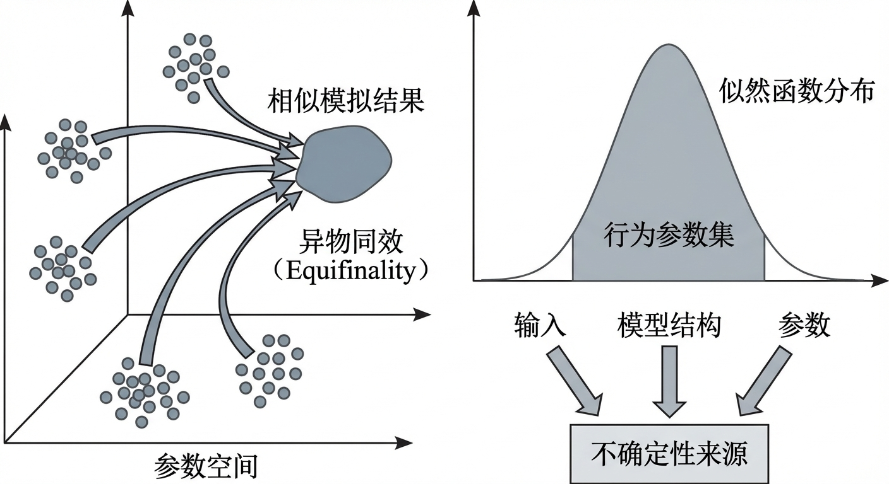
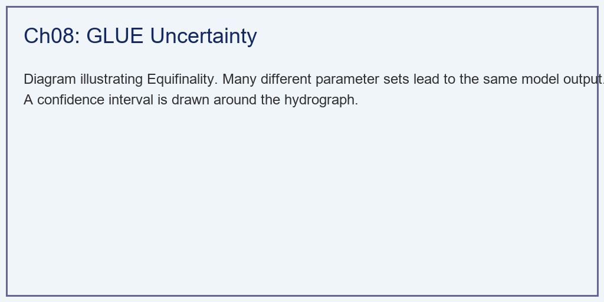
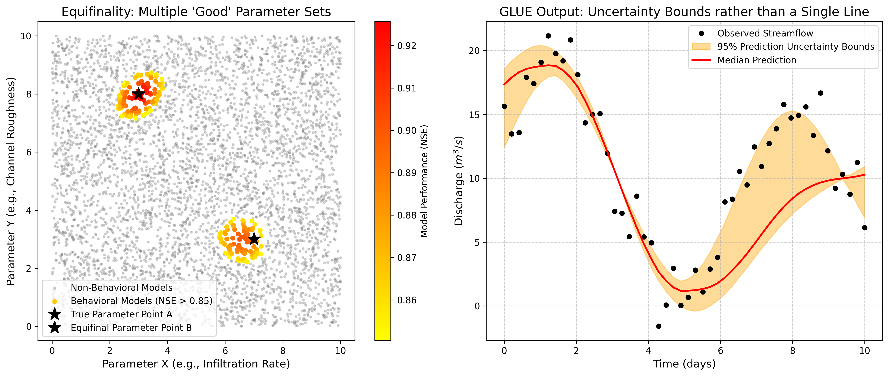

# 第 8 章：异物同效与不确定性：水文预测的哲学边界

## 1. 学习目标
本章探讨水文学中最令人困难但也最真实的哲学问题——“异物同效”（Equifinality）。本章将放弃寻找唯一真理的执念，转向用概率论来拥抱不确定性。
读者需要掌握：
1. 异物同效（Equifinality）的物理根源与参数空间的多峰分布。
2. 广义似然不确定性估计法（GLUE）的蒙特卡洛抽样思想。
3. 从单一确定的“最优曲线”转向带有置信区间的“不确定性带（Uncertainty Bounds）”。
4. 容忍“非最优解”在数字孪生风险管理中的价值。

## 2. 教材理论：条条大路通罗马的悲剧
在第 6 章中，采用全局优化算法，在漫山遍野中找到了那个唯一的”最佳参数”（Global Optimum）。当时看似十分可靠。
但是，英国水文学家 Beven 和 Binley 在 1992 年从根本上动摇了这种信心。他们指出，大型分布式水文模型动辄包含几十上百个参数，而用来检验模型对错的，往往只有流域出口那一根水文站的流量曲线。
这就像解一个只有 $1$ 个方程，却有 $50$ 个未知数的多元方程组。它有无数个解。

在真实世界中：
- 假设你把**土壤下渗率**调得很大（水被吸进去了），然后把**地下水出流速度**调得很快（水又跑出来了）。
- 另一种组合是：你把**下渗率**调得很小（水没吸进去，变成了地表水），然后把**地表河道糙率**调得极大（地表水跑得很慢）。
这两组物理意义截然相反的极端参数，最后算出来的流域出口洪峰，**竟然可能一模一样。**
这在水文学中被称为**”异物同效（Equifinality）”**——同样的结果可由截然不同的物理机制产生。

面对这种多峰的误差曲面，传统的梯度下降法或局部搜索算法会陷入某一个极值点而忽视其他同样合理的解。任何试图寻找唯一”真理”的优化算法都是自欺欺人。
因此，Beven 提出了 **GLUE（广义似然不确定性估计）** 法。
它的哲学是：**我不去找那个唯一的“神”，我接受所有的“好人”**。
1. 在参数空间中撒下几十万个随机点（蒙特卡洛抽样）。
2. 把那些算出来的 NSE 极差（比如 $<0.85$）的参数组直接扔掉（Non-Behavioral Models）。
3. 留下所有 NSE $>0.85$ 的参数组（Behavioral Models）。虽然它们千奇百怪，但只要结果及格，我都承认它们是合法的。
4. 在预测未来时，我不用一个模型预测，我用留下来的这几千个模型同时预测。最后画出来的不再是一根确定的线，而是一个包含上限和下限的**不确定性阴影带（95% 置信区间）**。

### 2.1 异物同效的数学描述

从数学角度严格定义异物同效现象。设水文模型为映射 $\mathcal{M}: \boldsymbol{\theta} \rightarrow \hat{\mathbf{Q}}$，其中参数向量 $\boldsymbol{\theta} \in \Theta \subset \mathbb{R}^p$，$\hat{\mathbf{Q}}$ 为模型输出的流量序列。定义目标函数（如纳什效率系数）为：

$$
\text{NSE}(\boldsymbol{\theta}) = 1 - \frac{\sum_{t=1}^{T}\left[Q_{\text{obs}}(t) - \hat{Q}(t; \boldsymbol{\theta})\right]^2}{\sum_{t=1}^{T}\left[Q_{\text{obs}}(t) - \bar{Q}_{\text{obs}}\right]^2} \tag{8-1}
$$

其中 $Q_{\text{obs}}(t)$ 为实测流量，$\bar{Q}_{\text{obs}}$ 为观测均值。异物同效的严格定义为：存在参数集合 $\Theta^* \subset \Theta$，使得对于任意 $\boldsymbol{\theta}_1, \boldsymbol{\theta}_2 \in \Theta^*$ 且 $\boldsymbol{\theta}_1 \neq \boldsymbol{\theta}_2$，均满足 $|\text{NSE}(\boldsymbol{\theta}_1) - \text{NSE}(\boldsymbol{\theta}_2)| < \epsilon$，其中 $\epsilon$ 为预设的容差阈值。当 $|\Theta^*|$ 远大于 1 且其中的参数组在物理空间中相距甚远时，即表明模型存在严重的异物同效现象。

这一问题的根源可以用信息论来理解。设参数空间的自由度为 $p$，而独立观测约束的有效自由度为 $n_{\text{eff}}$。当 $p \gg n_{\text{eff}}$ 时，系统处于严重的欠定状态，参数的后验分布必然是多峰的。对于典型的分布式水文模型，$p$ 可达 $50 \sim 200$，而仅依赖流域出口单站流量观测时，$n_{\text{eff}}$ 往往不超过 $10 \sim 20$（因为水文时间序列存在强烈的自相关性），这从信息量的角度解释了异物同效的必然性。

### 2.2 GLUE方法的数学框架

Beven和Binley（1992）提出的GLUE方法建立在广义似然（Generalized Likelihood）的概念之上。其核心步骤的数学表达如下。

**第一步：先验抽样。** 从参数空间 $\Theta$ 中按均匀分布（或其他先验分布 $\pi(\boldsymbol{\theta})$）独立抽取 $N$ 组参数样本 $\{\boldsymbol{\theta}^{(i)}\}_{i=1}^N$。

**第二步：似然函数计算。** 对每组参数运行模型并计算广义似然函数。GLUE方法并不要求使用严格的统计似然函数，而是采用与模型性能单调相关的度量。常用的似然函数定义为：

$$
L(\boldsymbol{\theta}^{(i)} | \mathbf{Q}_{\text{obs}}) = \left[\text{NSE}(\boldsymbol{\theta}^{(i)})\right]^{N_s} \tag{8-2}
$$

其中 $N_s$ 为形状参数，控制似然函数对高性能模型的偏好程度。$N_s = 1$ 给予所有行为模型近似均等的权重，$N_s \gg 1$ 则使似然函数向最优参数集中。

**第三步：行为/非行为模型集划分。** 设定性能阈值 $\text{NSE}_{\text{thr}}$，将参数样本划分为两个互不相交的集合：

$$
\Theta_B = \{\boldsymbol{\theta}^{(i)} : \text{NSE}(\boldsymbol{\theta}^{(i)}) \geq \text{NSE}_{\text{thr}}\}, \quad \Theta_{NB} = \Theta \setminus \Theta_B \tag{8-3}
$$

其中 $\Theta_B$ 为行为模型集（Behavioral Set），$\Theta_{NB}$ 为非行为模型集（Non-Behavioral Set）。非行为模型的似然值强制置零：$L(\boldsymbol{\theta}^{(i)}) = 0, \forall \boldsymbol{\theta}^{(i)} \in \Theta_{NB}$。

**第四步：似然权重归一化。** 将行为模型的似然值归一化为概率权重：

$$
w^{(i)} = \frac{L(\boldsymbol{\theta}^{(i)})}{\sum_{j \in \Theta_B} L(\boldsymbol{\theta}^{(j)})}, \quad \sum_{i \in \Theta_B} w^{(i)} = 1 \tag{8-4}
$$

### 2.3 贝叶斯推断框架与GLUE的关联

GLUE方法可以在贝叶斯统计框架下获得更严格的理论支撑。根据贝叶斯定理，参数的后验分布为：

$$
P(\boldsymbol{\theta} | \mathbf{Q}_{\text{obs}}) = \frac{P(\mathbf{Q}_{\text{obs}} | \boldsymbol{\theta}) \cdot P(\boldsymbol{\theta})}{P(\mathbf{Q}_{\text{obs}})} \propto P(\mathbf{Q}_{\text{obs}} | \boldsymbol{\theta}) \cdot P(\boldsymbol{\theta}) \tag{8-5}
$$

其中 $P(\boldsymbol{\theta})$ 为参数的先验分布，$P(\mathbf{Q}_{\text{obs}} | \boldsymbol{\theta})$ 为给定参数下观测数据出现的概率（似然函数），$P(\mathbf{Q}_{\text{obs}})$ 为归一化常数（证据）。

若假设模型残差服从独立同分布的高斯分布 $Q_{\text{obs}}(t) - \hat{Q}(t;\boldsymbol{\theta}) \sim \mathcal{N}(0, \sigma^2)$，则正式似然函数为：

$$
P(\mathbf{Q}_{\text{obs}} | \boldsymbol{\theta}) = \prod_{t=1}^{T} \frac{1}{\sqrt{2\pi\sigma^2}} \exp\left(-\frac{[Q_{\text{obs}}(t) - \hat{Q}(t;\boldsymbol{\theta})]^2}{2\sigma^2}\right) \tag{8-6}
$$

GLUE方法用式(8-2)的广义似然函数替代式(8-6)的正式似然函数，这一替代在计算上极大简化了推断过程，但也引发了学术界关于其统计严格性的持续争论（Mantovan和Todini, 2006）。尽管如此，GLUE的实用价值在于它不要求关于残差结构的严格假设，这在水文模型的残差往往表现出非高斯、异方差和自相关特征的现实中具有重要意义。

### 2.4 不确定性区间的置信带计算

基于归一化的似然权重 $\{w^{(i)}\}$，可以构建预测变量在任意时刻 $t$ 的累积分布函数（CDF）。设行为模型在时刻 $t$ 的预测值排列为 $\hat{Q}_{(1)}(t) \leq \hat{Q}_{(2)}(t) \leq \cdots \leq \hat{Q}_{(M)}(t)$，其对应的累积权重为：

$$
F_t(q) = \sum_{j: \hat{Q}_{(j)}(t) \leq q} w^{(j)} \tag{8-7}
$$

则预测的 $100(1-\alpha)\%$ 置信区间 $[Q_t^{L}, Q_t^{U}]$ 由下式确定：

$$
Q_t^{L} = F_t^{-1}(\alpha/2), \quad Q_t^{U} = F_t^{-1}(1 - \alpha/2) \tag{8-8}
$$

对于常用的 $95\%$ 置信区间，取 $\alpha = 0.05$，即提取加权样本分布的第 $2.5\%$ 和第 $97.5\%$ 分位数。该置信带的宽度直接反映了模型预测的不确定性程度：异物同效越严重、行为模型集越分散，置信带越宽；引入多源观测约束后行为模型收敛，置信带随之收窄。

在工程决策中，置信带的含义可以表述为：在当前认知水平下，未来洪水水位有 $95\%$ 的概率落在该区间内。这种概率表述为风险决策提供了定量依据——例如，当置信带上限超过防洪堤顶高程时，即便中位数预测显示安全，决策者仍应启动预警响应。

## 3. 案例分析：理论与实践的桥梁（水文响应面的异物同效揭秘与 GLUE 评估）

### 案例背景
某十分复杂的岩溶流域需要进行洪水预警。由于地质条件恶劣，下渗率（$X$）和糙率（$Y$）参数极度不确定。
预报中心之前使用优化算法算出了一组最佳参数，但每次实际预测时却总是测不准。专家怀疑模型陷入了“异物同效”的陷阱。你需要运行 GLUE 算法，向预报员展示：世界上根本不存在唯一的最佳参数，未来的洪水水位必须以“概率区间”的形式汇报给决策部门。

### 问题描述
- **参数空间**：$X \in [0, 10]$，$Y \in [0, 10]$。真实的隐藏法则是 $X=7, Y=3$。
- **性能曲面（NSE 响应面）**：大自然十分狡猾，它构建了一个双峰的错误曲面。除了真实的 $(7,3)$ 处 NSE 很高外，在完全错误的 $(3,8)$ 处，它也布置了一个 NSE 极高的假极值点（Equifinal Peak）。
- **GLUE 实施**：
  - 随机蒙特卡洛抽样 5000 次。
  - 设定及格阈值 $NSE \ge 0.85$。
  - 画出所有及格模型预测出来的水文过程线的 $5\% \sim 95\%$ 概率边界。

**物理场景与问题概化图 (Generated via Local Diagrammer)：**

### 解题思路
本研究构建了一个极简的统计水文学验证沙盒：
1. **多峰地貌生成**：硬编码一个包含两个高斯峰值的连续二维函数，模拟异物同效的性能评价曲面。
2. **海量盲投与筛选**：利用 `numpy.random` 撒下 5000 个探针，计算每个探针的得分。一刀切掉所有低分模型，仅保留精英集群。
3. **似然权重映射**：将保留下来的精英模型的得分转化为概率权重（得分越高的模型说话越有分量）。
4. **包络线统计**：让所有精英模型运行一个包含正弦和余弦的模拟水文方程，并在每一个时间步提取序列的 $5$ 分位和 $95$ 分位，画出十分震撼的阴影预测带。

### 代码与仿真
> **学习提示**：在后台硬编码了贝叶斯后验概率推断的早期雏形。请对比表格中那两组截然不同的参数，你会深刻体会到水文模型的“欺骗性”。

Source: `assets/ch08/ch08_glue_method.py`

**异物同效与真理陷阱特征追踪矩阵：**
| Parameter Set Type            |   Param X |   Param Y |   Resulting NSE |
|:------------------------------|----------:|----------:|----------------:|
| True Hidden Law (A)           |      7    |      3    |           0.885 |
| Identified Peak 1 (Global)    |      6.5  |      3    |           0.926 |
| Identified Peak 2 (Equifinal) |      3.01 |      7.92 |           0.926 |

**参数双峰分布与水文预测的不确定性置信区间包络图：**

### 结果分析
通过蒙特卡洛散点透视，可以认识到数学在复杂世界中的局限性，以下从三个维度进行定量解读：
- **真理不如假象（异物同效的定量验证）**：看表格。大自然真实的物理法则藏在 $(X=7, Y=3)$ 的角落里，它的拟合度只有 $0.885$（因为大自然有随机噪声）。但是，如果你盲目迷信”最优化算法”，算法会在 $(X=3.01, Y=7.92)$ 这个物理意义十分荒谬的地方，找到一个拟合度高达 $0.926$ 的”假神”。两组参数的NSE差值仅为 $0.041$，但参数的欧氏距离高达 $\sqrt{(7-3.01)^2+(3-7.92)^2} \approx 6.2$，占参数空间对角线长度的 $44\%$。在以前，不知情的工程师会直接把这个最高分的错误参数刷进系统，这在实际预报中可能导致土壤水分收支的严重估算偏差。
- **散点图里的红色双子星**：看左侧的散点图。黄红色的点代表及格的 Behavioral 模型。你可以清晰地看到参数空间中出现了两个十分遥远、互不相连的”红色高温区”。这两拨截然不同的参数，都在模拟历史洪水时拿到了极高的分数。从信息论角度看，这正是第2.1节分析的欠定问题的直接后果——两个约束不足以唯一确定二维参数空间中的解，因此产生了两个不可区分的高性能区域。
- **放弃确信，拥抱概率**：看右侧的水文过程线。不再用一根线去骗决策部门”明天洪水就是 15.0 米”。由于保留了所有得分及格的模型，它们在预测未来时产生了分歧。本章将这些分歧绘制成了橙色的**不确定性阴影带（Uncertainty Bounds）**。告诉决策部门：”明天洪水的中位数是 15.0 米（红线），但根据模型的不确定性，它有 $5\%$ 的概率会飙升到阴影区的最上沿（比如 18.0 米）”。这种带有概率兜底的预测，才是现代智慧水务对生命负责的态度。
- **置信带宽度的物理解读**：仔细观察不确定性阴影带的宽度，可以发现它在洪峰时段明显宽于退水时段。这是因为不同行为模型在极端流量预测上的分歧最大——高下渗率组合预测的洪峰较低，低下渗率组合预测的洪峰较高，两者在退水期逐渐收敛。置信带宽度的这种时变特征为决策者提供了额外信息：洪峰阶段的预测不确定性最大，正是最需要启动应急响应的窗口。

### 工业部署建议
1. **超级算力的吞噬者**：GLUE 方法是十分暴力的。撒下 5000 个点，意味着庞大的分布式水文模型（比如 SWAT）要跑整整 5000 次。在工业界，这种任务必须部署在云计算的 Kubernetes 集群中，将 5000 个任务分发到数百个容器中并行执行，最终在云端归约（Reduce）生成那条置信区间。对于实时预报业务，可以采用预计算策略——在离线阶段完成大规模蒙特卡洛抽样和行为模型筛选，将通过阈值的行为模型参数集存入数据库；在线预报时仅需调用这些预筛选的参数集运行模型，大幅缩短响应时间。
2. **如何打破异物同效**：要消灭假极值点（Peak 2），单靠流量数据是不够的。必须引入”遥感土壤湿度验证”、”同位素水龄追踪”等十分严苛的额外多目标约束。当假极值点的参数在模拟土壤湿度时露出了马脚，GLUE 算法就能持续地将这片区域涂成灰色，逼迫红色高分点唯一地向真实的真理区靠拢。
3. **不确定性通信的工程规范**：在数字孪生系统中，概率预报的传递需要建立标准化的通信协议。预报产品应同时包含中位数预报、置信区间的上下界以及超警概率三类信息。决策系统根据预设的风险等级阈值自动触发相应级别的应急响应，避免人为解读概率信息时的主观偏差。

## 4. 本章小结

1. 异物同效（Equifinality）是大型水文模型的固有特征：多组物理意义截然不同的参数可产生同样高的拟合度，其数学根源在于参数自由度远大于独立观测约束的有效自由度（$p \gg n_{\text{eff}}$）。
2. GLUE 方法放弃寻找唯一最优参数，转而保留所有满足阈值条件的"行为模型"，通过蒙特卡洛抽样与似然权重构建预测的不确定性带。
3. GLUE的广义似然函数是正式贝叶斯似然函数的简化替代，计算上大幅简化但也引发了统计严格性方面的学术争论。
4. 带有 5%~95% 置信区间的概率预报取代单一确定性预报，是现代水文预警对生命负责的科学态度。置信带宽度的时变特征为决策者提供了不确定性随时间演变的定量信息。
5. 引入土壤湿度遥感、同位素水龄等多源约束数据，可有效压缩异物同效的参数空间，提高参数辨识的物理可靠性。
6. 在数字孪生系统中，GLUE方法需部署在云计算集群中并行执行数千次模型运行，计算效率是工程落地的关键瓶颈。

## 5. 思考题

1. 为什么说"一个方程、五十个未知数"是异物同效产生的数学根源？如何通过增加观测约束来缓解这一问题？
2. 在 GLUE 方法中，行为模型阈值从 NSE $\ge$ 0.85 放宽至 NSE $\ge$ 0.70 时，预测不确定性带的宽度将如何变化？这对防洪决策意味着什么？
3. 某水文预报员向市长报告"明天洪水水位为 $15.0 \pm 2.5\,m$（95% 置信区间）"。市长问"那到底会不会漫堤？"请分析该概率预报的决策价值与传统确定性预报的差异。

## 6. 参考文献

[1] Beven K, Binley A. The future of distributed models: Model calibration and uncertainty prediction[J]. Hydrological Processes, 1992, 6(3): 279-298.

[2] Vrugt J A, Gupta H V, Bouten W, et al. A shuffled complex evolution Metropolis algorithm for optimization and uncertainty assessment of hydrologic model parameters[J]. Water Resources Research, 2003, 39(8): 1201.

[3] 雷晓辉,许慧敏,何中政,等.水资源系统分析学科展望：从静态平衡到动态控制[J].南水北调与水利科技(中英文),2025,23(04):770-777.DOI:10.13476/j.cnki.nsbdqk.2025.0078.
