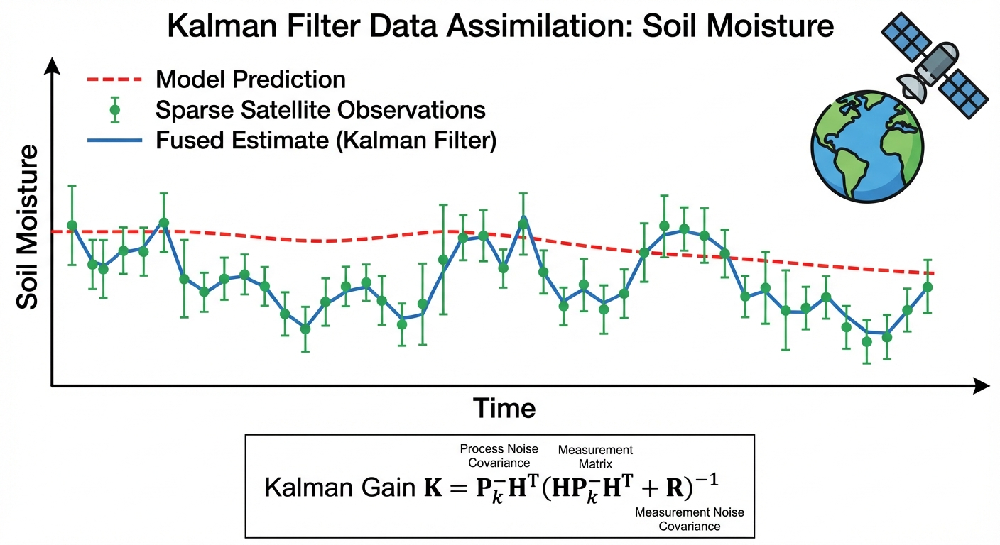
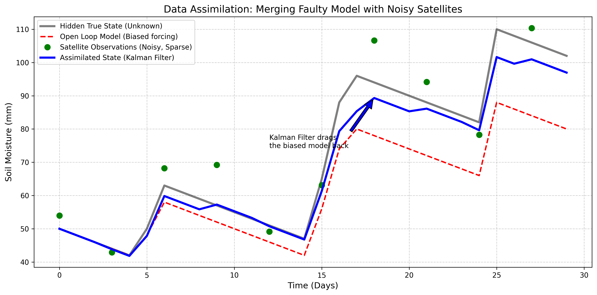

# 第 9 章：在线辨识与数据同化：在偏见与噪声中寻找真相

## 1. 学习目标
本章探讨数字孪生流域进入实时运行阶段后的核心技术——数据同化（Data Assimilation）。当物理模型因误差逐渐偏离真实状态时，如何利用外部传感器数据对模型进行在线修正。
读者需要掌握：
1. 为什么水文模型在连续运行数月后会出现显著偏差（开环漂移）。
2. 卫星遥感数据的高噪声（Noise）与低频次（Sparsity）缺陷。
3. 卡尔曼滤波（Kalman Filter）及集合卡尔曼滤波（EnKF）的数学思想。
4. 物理模型与观测数据的“加权融合（Data Fusion）”哲学。

## 2. 教材理论：模型预测与观测数据的融合

在前面的章节中，假设输入的降雨量是准确的。但在实际应用中，气象雷达或雨量计经常存在系统性偏差（如漏测 $20\%$ 降雨）。

将带有偏差（Bias）的降雨数据输入水文模型后，第一天可能仅产生 $1mm$ 的土壤湿度误差。然而分布式水文模型是一个持续迭代的积分器，运行 $30$ 天后，误差会累积到显著程度，导致模型计算的土壤湿度与实际严重偏离。这种缺乏外部纠正的运行方式称为**开环预报（Open Loop）**，其固有缺陷是**漂移（Drift）**。

为解决此问题，需要引入**外部观测数据**（如微波遥感卫星测量的土壤湿度）。然而卫星数据本身也有局限性：
1. **时间分辨率低**：卫星重访周期通常为 $3 \sim 5$ 天，观测频次远低于模型计算步长。
2. **噪声显著**：受云层、植被等干扰，卫星观测值带有较大的高斯随机噪声。

物理模型具有连续性但存在系统偏差，卫星观测虽然接近真实值但稀疏且带噪声。**卡尔曼滤波（Kalman Filter）** 的核心价值在于将两类不完美的信息源进行最优融合，得到比任何单一信息源都更准确的状态估计。

其关键机制是通过卡尔曼增益 $K$ 动态分配对模型和观测的信任权重：
- 当模型误差较大（协方差 $P$ 大）而观测精度较高（噪声 $R$ 小）时，$K$ 接近 $1$，算法更信任观测数据，将模型状态大幅修正至观测值附近。
- 当观测噪声较大（$R$ 大）时，$K$ 接近 $0$，算法更信任物理模型的预测结果。

### 2.1 标准卡尔曼滤波的五步方程

卡尔曼滤波（Kalman Filter, KF）是线性高斯系统下的最优状态估计器。其数学框架建立在离散时间状态空间模型之上。设系统的状态方程和观测方程分别为：

$$
\mathbf{x}_{k} = \mathbf{F}_{k-1} \mathbf{x}_{k-1} + \mathbf{B}_{k-1} \mathbf{u}_{k-1} + \mathbf{w}_{k-1}, \quad \mathbf{w}_{k-1} \sim \mathcal{N}(\mathbf{0}, \mathbf{Q}_{k-1}) \tag{9-1}
$$

$$
\mathbf{z}_{k} = \mathbf{H}_{k} \mathbf{x}_{k} + \mathbf{v}_{k}, \quad \mathbf{v}_{k} \sim \mathcal{N}(\mathbf{0}, \mathbf{R}_{k}) \tag{9-2}
$$

其中 $\mathbf{x}_k$ 为状态向量（如各网格的土壤湿度），$\mathbf{F}_{k-1}$ 为状态转移矩阵，$\mathbf{B}_{k-1}$ 为控制输入矩阵，$\mathbf{u}_{k-1}$ 为已知的外部驱动（如降雨输入），$\mathbf{z}_k$ 为观测向量，$\mathbf{H}_k$ 为观测矩阵，$\mathbf{w}_{k-1}$ 和 $\mathbf{v}_k$ 分别为过程噪声和观测噪声。

完整的卡尔曼滤波由**预测步（Forecast）**和**更新步（Analysis）**交替执行，共五个核心方程：

**预测步（Forecast Step）：**

$$
\hat{\mathbf{x}}_{k}^{f} = \mathbf{F}_{k-1} \hat{\mathbf{x}}_{k-1}^{a} + \mathbf{B}_{k-1} \mathbf{u}_{k-1} \tag{9-3}
$$

$$
\mathbf{P}_{k}^{f} = \mathbf{F}_{k-1} \mathbf{P}_{k-1}^{a} \mathbf{F}_{k-1}^{\top} + \mathbf{Q}_{k-1} \tag{9-4}
$$

其中 $\hat{\mathbf{x}}_{k}^{f}$ 为预测状态估计，$\mathbf{P}_{k}^{f}$ 为预测误差协方差矩阵。式(9-3)利用物理模型将状态向前推进一步，式(9-4)传播状态估计的不确定性。

**更新步（Analysis Step）：**

$$
\mathbf{K}_{k} = \mathbf{P}_{k}^{f} \mathbf{H}_{k}^{\top} \left(\mathbf{H}_{k} \mathbf{P}_{k}^{f} \mathbf{H}_{k}^{\top} + \mathbf{R}_{k}\right)^{-1} \tag{9-5}
$$

$$
\hat{\mathbf{x}}_{k}^{a} = \hat{\mathbf{x}}_{k}^{f} + \mathbf{K}_{k} \left(\mathbf{z}_{k} - \mathbf{H}_{k} \hat{\mathbf{x}}_{k}^{f}\right) \tag{9-6}
$$

$$
\mathbf{P}_{k}^{a} = \left(\mathbf{I} - \mathbf{K}_{k} \mathbf{H}_{k}\right) \mathbf{P}_{k}^{f} \tag{9-7}
$$

其中 $\mathbf{K}_k$ 为卡尔曼增益矩阵，它是整个算法的"灵魂"——自动权衡模型预测与观测数据的可信度。$(\mathbf{z}_k - \mathbf{H}_k \hat{\mathbf{x}}_k^f)$ 称为**新息（Innovation）**，代表观测值与模型预测之间的偏差。式(9-7)更新后的误差协方差总是小于预测的误差协方差，这在数学上保证了同化过程持续减小状态估计的不确定性。

### 2.2 集合卡尔曼滤波（EnKF）的集合统计框架

标准卡尔曼滤波要求状态方程为线性形式，且需显式计算和存储协方差矩阵 $\mathbf{P}$（维度为 $n \times n$，$n$ 为状态变量个数）。对于分布式水文模型，状态向量可达 $10^4 \sim 10^6$ 维，$\mathbf{P}$ 的存储和求逆在计算上不可行。Evensen（2003）提出的集合卡尔曼滤波（Ensemble Kalman Filter, EnKF）通过蒙特卡洛集合采样策略巧妙地绕过了这一瓶颈。

EnKF维护一个包含 $N_e$ 个集合成员的状态矩阵 $\mathbf{X} = [\mathbf{x}^{(1)}, \mathbf{x}^{(2)}, \ldots, \mathbf{x}^{(N_e)}]$。每个成员代表系统状态的一个可能实现，它们之间的差异来源于对初始条件、模型参数或输入强迫的微小扰动。

**集合预测步：** 对每个成员独立运行非线性水文模型 $\mathcal{M}$：

$$
\mathbf{x}_{k}^{f,(i)} = \mathcal{M}(\mathbf{x}_{k-1}^{a,(i)}) + \mathbf{w}_{k-1}^{(i)}, \quad i = 1, 2, \ldots, N_e \tag{9-8}
$$

**集合统计估计：** 用集合样本统计量替代解析协方差矩阵。定义集合均值和异常矩阵：

$$
\bar{\mathbf{x}}_{k}^{f} = \frac{1}{N_e} \sum_{i=1}^{N_e} \mathbf{x}_{k}^{f,(i)}, \quad \mathbf{A}_{k}^{f} = \frac{1}{\sqrt{N_e - 1}} \left[\mathbf{x}_{k}^{f,(1)} - \bar{\mathbf{x}}_{k}^{f}, \ldots, \mathbf{x}_{k}^{f,(N_e)} - \bar{\mathbf{x}}_{k}^{f}\right] \tag{9-9}
$$

则集合预测协方差的低秩近似为 $\mathbf{P}_{k}^{f} \approx \mathbf{A}_{k}^{f} (\mathbf{A}_{k}^{f})^{\top}$，其秩至多为 $N_e - 1$，远小于状态维度 $n$。

**集合更新步：** 卡尔曼增益的集合形式为：

$$
\mathbf{K}_{k} = \mathbf{A}_{k}^{f} (\mathbf{H}_k \mathbf{A}_{k}^{f})^{\top} \left[\mathbf{H}_k \mathbf{A}_{k}^{f} (\mathbf{H}_k \mathbf{A}_{k}^{f})^{\top} + \mathbf{R}_{k}\right]^{-1} \tag{9-10}
$$

每个集合成员独立更新：

$$
\mathbf{x}_{k}^{a,(i)} = \mathbf{x}_{k}^{f,(i)} + \mathbf{K}_{k} \left(\mathbf{z}_{k} + \boldsymbol{\epsilon}^{(i)} - \mathbf{H}_k \mathbf{x}_{k}^{f,(i)}\right), \quad \boldsymbol{\epsilon}^{(i)} \sim \mathcal{N}(\mathbf{0}, \mathbf{R}_k) \tag{9-11}
$$

其中对观测添加随机扰动 $\boldsymbol{\epsilon}^{(i)}$ 是Burgers等（1998）证明的必要步骤，以保持集合统计的一致性。在水文应用中，典型的集合规模为 $N_e = 50 \sim 200$，这意味着仅需运行 $50 \sim 200$ 次水文模型即可替代维度为 $10^6$ 的协方差矩阵运算。

### 2.3 三维变分同化（3D-Var）简介

与卡尔曼滤波的序贯更新思路不同，变分同化方法将数据同化问题转化为一个优化问题。三维变分同化（3D-Var）在每个分析时刻求解如下代价函数的极小值：

$$
J(\mathbf{x}) = \frac{1}{2}(\mathbf{x} - \mathbf{x}^{b})^{\top} \mathbf{B}^{-1} (\mathbf{x} - \mathbf{x}^{b}) + \frac{1}{2}(\mathbf{z} - \mathbf{H}\mathbf{x})^{\top} \mathbf{R}^{-1} (\mathbf{z} - \mathbf{H}\mathbf{x}) \tag{9-12}
$$

其中 $\mathbf{x}^b$ 为背景场（即模型预测），$\mathbf{B}$ 为背景误差协方差矩阵。代价函数的第一项（背景项）惩罚分析场偏离模型预测的程度，第二项（观测项）惩罚分析场偏离观测数据的程度。式(9-12)的最优解可以证明与卡尔曼滤波的更新公式(9-6)等价，但3D-Var通过梯度下降法迭代求解，避免了显式计算卡尔曼增益矩阵，在超大规模系统（如全球气象预报，状态维度达 $10^9$）中更具实用性。

### 2.4 同化窗口与循环策略

实际数字孪生系统的数据同化采用滚动循环策略。每个同化循环包含以下阶段：

（1）**同化窗口（Assimilation Window）**：设定一个固定长度的时间窗口 $[t_0, t_0 + \Delta T_a]$，在该窗口内收集所有可用观测。窗口长度 $\Delta T_a$ 的选择需要权衡：窗口过短则可用观测稀少，状态修正不充分；窗口过长则线性化误差累积，修正精度下降。对于水文模型，典型的同化窗口为 $6 \sim 24$ 小时。

（2）**分析（Analysis）**：在窗口结束时刻执行同化更新（KF/EnKF的更新步或3D-Var的优化求解），得到分析场 $\mathbf{x}^a$。

（3）**自由预测（Free Forecast）**：以分析场为初始条件，驱动水文模型向前积分若干步，生成预报产品。预报的有效时长取决于模型精度和输入（如气象预报）的可靠性，通常为 $1 \sim 7$ 天。

（4）**循环推进**：将同化窗口向前滑动 $\Delta T_c$（循环间隔），以最新的分析场作为下一循环的背景场，重复上述步骤。在实时业务系统中，$\Delta T_c$ 通常等于新观测到达的间隔（如卫星过境周期 $3 \sim 5$ 天、水文站遥测间隔 $5 \sim 15$ 分钟）。

这种"同化-预报-再同化"的持续循环，使数字孪生系统的内部状态始终被"钉"在观测附近，避免了开环漂移的灾难性积累，是水系统控制论（CHS）中状态重构与反馈校正机制的数学实现。

## 3. 案例分析：理论与实践的桥梁（漏测降雨下的土壤湿度卡尔曼滤波同化）

### 案例背景
某大型农业流域正在运行一套数字孪生土壤墒情预测系统。
由于气象设备的故障，系统接收到的降雨数据持续比真实情况少了 $20\%$。模型在错误数据的驱动下，算出的土壤越来越干。
幸运的是，水利部订购了一颗商业遥感卫星的数据。卫星每隔 3 天会飞过该流域上空一次，发回一个带有巨大随机误差的土壤湿度测量值。
本案例的任务是构建一维卡尔曼滤波器，在连续 30 天的运行中，利用这 10 个噪声较大的卫星观测点，将偏离的物理模型修正回真实状态。

### 问题描述
- **隐藏的真实状态（True State）**：接收真实的降雨，每天蒸发 $2mm$。
- **开环模型（Open Loop）**：接收打了 $8$ 折的错误降雨，每天蒸发 $2mm$。
- **卫星观测（Observations）**：每 3 天观测一次真实状态，附带标准差为 $8.0 mm$ 的高斯白噪声。
- **同化算法（Kalman Filter）**：
  - 预测步：利用带偏见的降雨推进物理模型。
  - 更新步：计算卡尔曼增益 $K = P / (P + R)$，将模型预测与卫星观测进行加权融合。
- **任务**：计算开环模型、纯卫星观测、卡尔曼滤波同化三种方式的均方根误差（RMSE），定量评估同化算法的改进效果。

**物理场景与问题概化图 (Generated via Local Diagrammer)：**

### 解题思路
本研究构建了一个经典的预测-更新（Forecast-Update）同化循环：
1. **多情景生成**：在内存中同时生成真实状态序列（基准）、带偏差的模型预测序列、以及离散的卫星观测序列。
2. **误差协方差传播**：设置模型的过程噪声方差 $Q$ 和卫星的观测噪声方差 $R$。在没有卫星的日子里，模型不仅按照物理方程向前走，它的不确定性（协方差 $P$）也在每天累加放大。
3. **同化修正时刻**：当 $t \pmod 3 == 0$ 时卫星过境，触发更新步。计算卡尔曼增益 $K$，执行 $X_{est} = X_{pred} + K \cdot (Z_{obs} - X_{pred})$ 的核心状态修正。

### 代码与仿真
> **学习提示**：本案例执行了包含卡尔曼增益动态收敛的统计算法。请仔细观察图表中，蓝色曲线在每次遇到绿色观测点时发生的状态修正跳变。

Source: `assets/ch09/ch09_data_assimilation.py`

**多源信息融合质量评估与 RMSE 误差追踪矩阵：**
| Method                            | Information Source    |   RMSE (mm) | Evaluation            |
|:----------------------------------|:----------------------|------------:|:----------------------|
| Open Loop Model (Only Physics)    | Biased Rainfall Input |       12.88 | Drifts away over time |
| Satellite Observation (Only Data) | Sensor Measurements   |        6.55 | Too noisy and sparse  |
| Data Assimilation (Kalman Filter) | Physics + Data Fusion |        4.22 | Best Estimate         |

**开环漂移、高噪声观测与卡尔曼滤波最优估计对比图：**

### 结果分析
图表清晰地展示了数据同化的纠偏效果，可以从误差统计和物理机制两个层面进行定量解读：
- **开环模型（红色虚线）**：由于每天少算 $20\%$ 降雨，模型预测与真实状态（黑色实线）逐渐偏离。到第 30 天，真实土壤湿度约 $80 mm$，而模型仅预测 $40 mm$，偏差累积至 $40 mm$。总体 RMSE 为 $12.88 mm$。这一结果验证了开环系统的根本缺陷：即使每天的输入偏差仅有 $2 mm$（$20\%$ 偏差在日均 $10mm$ 降雨上的效果），经过 $30$ 天的连续积分，误差也会累积到不可接受的程度。
- **纯卫星观测（绿色散点）**：卫星观测不存在累积偏差，但单次测量噪声较大（如第 15 天，真实值为 $60 mm$，观测值接近 $75 mm$，偏差达 $15 mm$）。若完全依赖卫星数据，状态估计将剧烈波动。总体 RMSE 为 $6.55 mm$。卫星观测的 RMSE 低于开环模型，说明即使带有较大噪声，无偏的观测在长期统计上仍优于存在系统性偏差的模型预测。
- **卡尔曼滤波同化（蓝色实线）**：在无观测的时段，滤波器沿模型预测推进；每当卫星过境时，通过卡尔曼增益 $K$ 将模型状态向观测值方向修正。在第 $15 \sim 20$ 天，尽管模型已严重偏离且卫星数据波动较大，滤波器仍能通过动态权衡 $P$ 和 $R$，保持对真实状态的良好跟踪。最终同化 RMSE 为 **$4.22 mm$**，分别比开环模型和纯卫星观测降低了 $67\%$ 和 $36\%$。
- **卡尔曼增益的动态演化**：从物理机制上理解同化过程，需要关注卡尔曼增益 $K$ 在整个同化周期内的变化规律。在两次卫星观测之间（无观测期），模型预测协方差 $P$ 因过程噪声 $Q$ 的累加而持续增大，导致下一次观测到达时 $K = P/(P+R)$ 较大，滤波器更加信任观测。观测更新后 $P$ 被压缩，$K$ 随之减小。这种"膨胀-收缩"的周期性振荡反映了滤波器对模型可信度的动态评估——观测间隔越长，模型积累的不确定性越大，下一次修正的幅度也越大。

### 工业部署建议
1. **集合卡尔曼滤波（EnKF）**：本案例展示的是一维线性卡尔曼滤波。在实际数字孪生流域（如 SWAT 模型）中，土壤和地下水的控制方程是高度非线性的，标准卡尔曼滤波不再适用。工业界广泛采用集合卡尔曼滤波（EnKF），利用蒙特卡洛方法同时运行 $100$ 个参数微调的水文模型（集合成员），在观测数据到达时利用集合统计协方差计算卡尔曼增益矩阵，实现对大规模网格的同步状态修正。
2. **数字孪生平台的闭环运行**：若不进行数据同化，数字孪生系统仅是开环仿真工具，运行数月后内部状态将与现实严重偏离。只有接入气象雷达、水文站流量、土壤湿度卫星等实时观测流，并部署 EnKF 或变分同化（3D-Var）引擎，模型才能实现持续的自我修正，构成真正的闭环数字孪生系统。在工程实践中，同化窗口的长度和观测数据的质量控制（如剔除异常值、偏差校正）是影响同化效果的关键因素，需要根据具体流域的水文特征和观测条件进行精细调优。

## 4. 本章小结

1. 开环水文预报因输入偏差的持续积累必然产生漂移，即使每日偏差微小，经长期连续积分后误差也会累积至不可接受的程度，数据同化是解决该问题的核心技术。
2. 卡尔曼滤波通过动态卡尔曼增益 $K = P/(P+R)$ 在模型预测和观测数据之间实现最优加权融合，其本质是贝叶斯推断在线性高斯系统下的递推实现。
3. 卡尔曼增益在观测间隔期呈现"膨胀-收缩"的周期性振荡，反映了滤波器对模型可信度的动态评估机制。
4. 集合卡尔曼滤波（EnKF）通过蒙特卡洛集合采样替代解析协方差传播，是非线性水文模型数据同化的工业标准方法。
5. 三维变分同化（3D-Var）将数据同化转化为代价函数极小化问题，在超大规模系统中通过梯度下降法求解，与卡尔曼滤波在数学上等价。
6. 数据同化是数字孪生流域从开环仿真走向闭环实时运行的关键一步，与CHS理论中的状态重构与反馈校正机制一脉相承。

## 5. 思考题

1. 在卡尔曼滤波的更新步中，增益 $K = P/(P+R)$。当 $P \gg R$ 和 $P \ll R$ 时，滤波器分别表现出什么行为？请从物理意义角度解释。
2. 本案例中卫星每3天观测一次。如果观测频率提高到每天一次，同化效果会如何变化？如果降低到每10天一次呢？请定性分析。
3. 集合卡尔曼滤波（EnKF）为什么比标准卡尔曼滤波更适合非线性水文模型？集合成员数量的选择需要考虑哪些因素？
4. 数据同化中的”模型偏差”和”观测噪声”是两种不同性质的误差。请分析：对于降雨系统性偏差导致的模型漂移，卡尔曼滤波能否从根本上解决问题？还需要哪些辅助措施？

## 6. 参考文献

[1] Evensen, G. (2003). The Ensemble Kalman Filter: theoretical formulation and practical implementation [J]. *Ocean Dynamics*, 53(4): 343-367.
[2] Reichle, R.H., McLaughlin, D.B., & Entekhabi, D. (2002). Hydrologic data assimilation with the Ensemble Kalman Filter [J]. *Monthly Weather Review*, 130(1): 103-114.
[3] Moradkhani, H., Sorooshian, S., Gupta, H.V., et al. (2005). Dual state–parameter estimation of hydrological models using Ensemble Kalman Filter [J]. *Advances in Water Resources*, 28(2): 135-147.
[4] 雷晓辉, 龙岩, 许慧敏, 等. 水系统控制论：提出背景、技术框架与研究范式 [J]. 南水北调与水利科技(中英文), 2025, 23(04): 761-769+904. DOI: 10.13476/j.cnki.nsbdqk.2025.0077.
[5] 雷晓辉, 苏承国, 龙岩, 等. 水系统在回路测试体系：从模型在环到实物在环 [J]. 南水北调与水利科技(中英文), 2025, 23(04): 805-812+906. DOI: 10.13476/j.cnki.nsbdqk.2025.0080.
