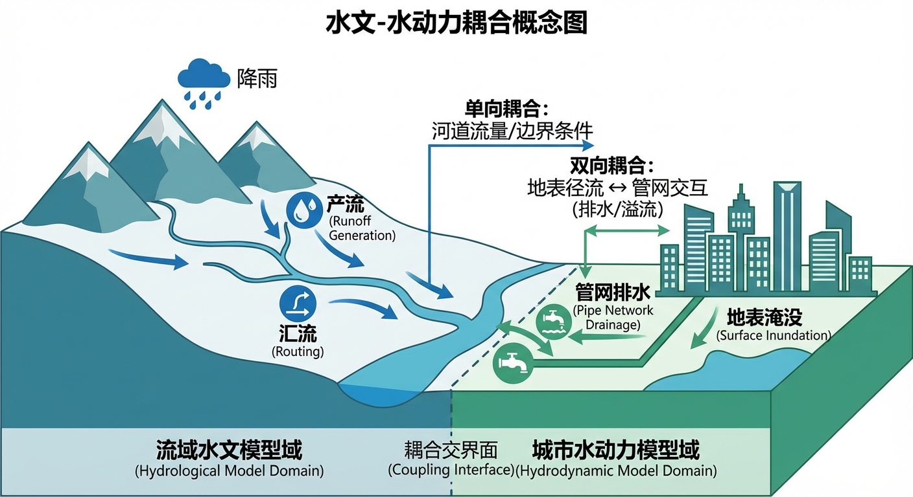
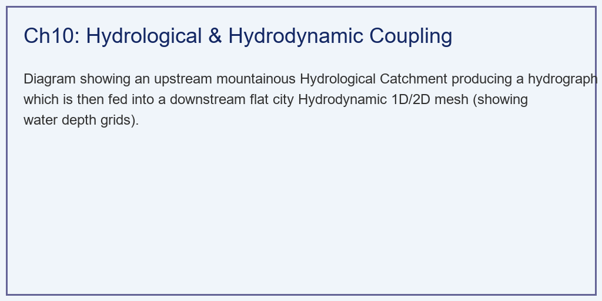
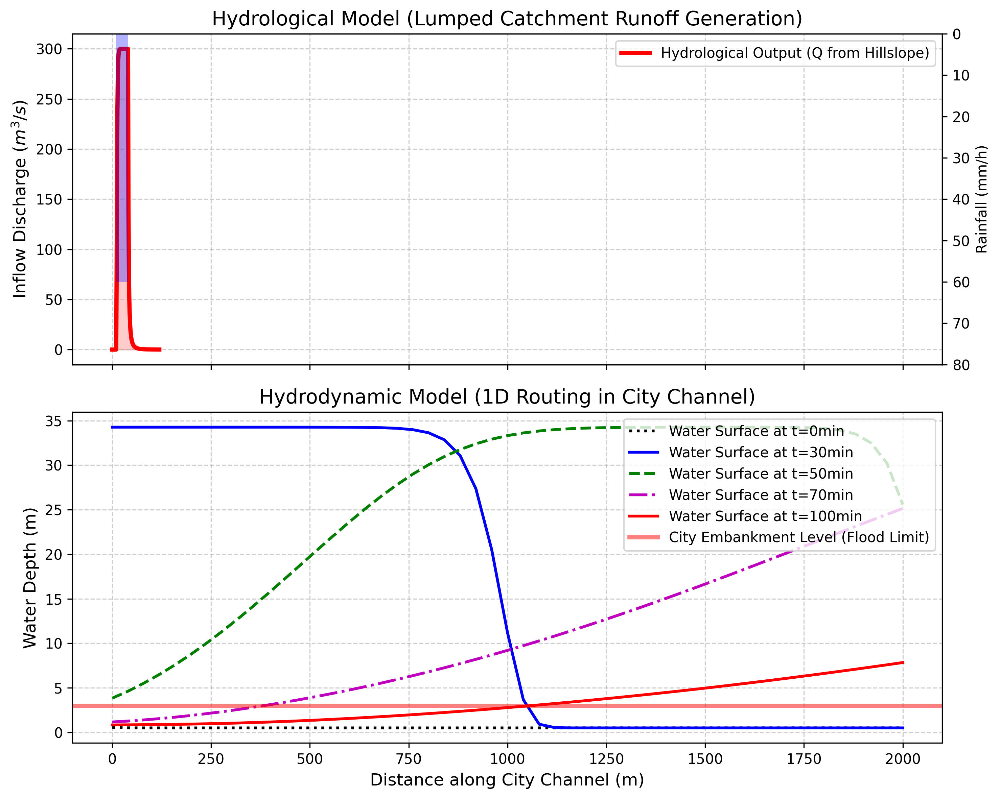

# 第 10 章：水文-水动力耦合：从山上到街头的跨界洪流

## 1. 学习目标
本章探讨数字孪生流域建设中最具挑战性的“跨界握手”——如何将宏观的、粗糙的降雨产流模型，与微观的、极度精密的水动力学模型无缝对接。
读者需要掌握：
1. 为什么“纯水文模型”算不准城市内涝的积水深度？
2. 水文模型（Hydrological）与水动力模型（Hydrodynamic）的理论边界与时空分辨率鸿沟。
3. 侧向入流（Lateral Inflow）与上游边界（Upstream Boundary）的耦合策略。
4. 城市内涝预警中一维/二维水动力演进的实战价值。

## 2. 教材理论：水文算流量，水动力算水深
在第 2~4 章中，讲的全部都是**水文模型（Hydrological Model）**。无论是新安江模型还是马斯金根汇流，它们给出的终极答案永远只有一种：**某时刻的流量 $Q$ ($m^3/s$)**。
水文模型根本不在乎水有多深，它只关心“有多少体积的水流过去了”。

但在城市防洪防涝中，决策部门根本不关心流量是 $100 m^3/s$ 还是 $200 m^3/s$。决策部门只关心一个致命的问题：**“街上的积水到底有没有没过汽车轮胎？防洪堤会不会被水漫过（Overtopping）？”**
要知道**水深 $h$**，水文模型彻底失效。必须召唤十分复杂、十分消耗算力的**水动力学模型（Hydrodynamic Model）**——基于圣维南方程组或 Navier-Stokes 方程。

因此，现代防洪防涝系统采用了**“水文-水动力单向耦合（1-way Coupling）”**的黄金架构：
1. **山上归水文**：山区面积庞大、地形崎岖，水流非常快。用十分耗算力的二维水动力模型去算山上的水是不可能的。所以，本章将山区交给“水文模型”（如分布式集总水库）。它快速把降雨转化为地表径流，推算出在山脚下（城市入口）的**流量过程线 $Q(t)$**。
2. **城里归水动力**：把水文模型算出来的 $Q(t)$，作为“上游强迫边界条件”，硬塞进城市的一维/二维水动力学网格中。城市地形平坦、街道纵横，水流十分复杂甚至会倒流。水动力学模型接管这股洪水，在极小的网格（如 $5m \times 5m$）和极小的时间步长（如 $1$秒）内，暴力推演出每一条街道上的**真实水深 $h(x,t)$**。

这种“宏观算体积，微观算深度”的跨界接力，构成了现代防灾减灾数字底座的核心。

### 2.1 一维圣维南方程组的完整表达

水动力学模型的理论核心是圣维南方程组（Saint-Venant Equations），它由连续方程和动量方程组成，描述了明渠非恒定流的基本物理规律。

**连续方程（质量守恒）：**

$$
\frac{\partial A}{\partial t} + \frac{\partial Q}{\partial x} = q_l \tag{10-1}
$$

其中 $A$ 为过水断面面积（$m^2$），$Q$ 为流量（$m^3/s$），$q_l$ 为单位河长的侧向入流量（$m^2/s$），$x$ 为沿程距离，$t$ 为时间。

**动量方程（牛顿第二定律）：**

$$
\frac{\partial Q}{\partial t} + \frac{\partial}{\partial x}\left(\frac{Q^2}{A}\right) + gA\frac{\partial h}{\partial x} = gA(S_0 - S_f) + q_l v_l \tag{10-2}
$$

其中 $g$ 为重力加速度，$h$ 为水深，$S_0$ 为河底坡降，$S_f$ 为摩阻坡降（通常用曼宁公式计算），$v_l$ 为侧向入流的沿程速度分量。动量方程左侧各项依次为：局部加速项（$\partial Q/\partial t$）、对流加速项、压力梯度项；右侧为重力驱动项和摩阻耗散项。

曼宁公式给出摩阻坡降的经验表达：

$$
S_f = \frac{n^2 Q |Q|}{A^2 R^{4/3}} \tag{10-3}
$$

其中 $n$ 为曼宁糙率系数，$R = A/P_w$ 为水力半径，$P_w$ 为湿周。

圣维南方程组是一组双曲型偏微分方程，具有两个特征速度 $c_{\pm} = v \pm \sqrt{gh}$（$v = Q/A$ 为断面平均流速），分别对应顺流和逆流传播的浅水波。这意味着下游的水位变化可以通过逆流波影响上游——这是水动力模型区别于纯水文模型的本质特征。

根据简化程度的不同，圣维南方程组可退化为以下近似模型：忽略局部加速项和对流加速项，得到**扩散波近似**：

$$
\frac{\partial Q}{\partial t} + c \frac{\partial Q}{\partial x} = D \frac{\partial^2 Q}{\partial x^2} \tag{10-4}
$$

其中 $c = dQ/dA$ 为运动波速，$D = Q/(2BS_0)$ 为水文扩散系数，$B$ 为水面宽度。进一步忽略扩散项，得到**运动波近似** $\partial Q/\partial t + c \cdot \partial Q/\partial x = 0$，其解为沿 $x$ 方向以速度 $c$ 平移的不变波形。运动波近似是马斯京根方程的物理基础，而完整的圣维南方程组则是城市内涝精细模拟所必需的。

### 2.2 侧向入流耦合机制

水文模型与水动力模型的耦合，本质上是通过侧向入流项 $q_l$ 实现的。水文模型将降雨转化为坡面径流后，计算出每个子流域汇入河道的流量过程线。这些坡面汇流在空间上分布于河道的不同位置，在时间上具有各自的响应延迟。

耦合的具体实现方式有两种：

**上游边界条件法（Upstream Boundary Coupling）：** 将水文模型的出口流量 $Q_H(t)$ 直接作为水动力模型入口处（$x = 0$）的边界条件。适用于水文模型区域和水动力模型区域在空间上串联分布的情形（如本章案例中的"山区-城市"结构）。此时式(10-1)中 $q_l = 0$，水文模型的影响完全通过边界条件传递。

**分布式侧向入流法（Distributed Lateral Inflow）：** 将子流域对应的河段设置非零侧向入流 $q_l(x, t)$。设第 $j$ 个子流域的产流量为 $Q_j^{\text{runoff}}(t)$，其汇入河道的河段长度为 $\Delta L_j$，则：

$$
q_l(x, t) = \frac{Q_j^{\text{runoff}}(t)}{\Delta L_j}, \quad x \in [x_j^{\text{start}}, x_j^{\text{end}}] \tag{10-5}
$$

这种方法更加物理合理，能够精确反映沿程入流对河道水位的累积抬升效应，是MIKE SHE、SWMM等专业耦合模型采用的标准策略。

### 2.3 主流耦合模型架构简介

国际上已形成若干成熟的水文-水动力耦合建模平台：

**MIKE SHE（DHI, 丹麦）：** 由欧洲水文系统（SHE）发展而来，是目前物理机制最完整的耦合模型之一。它将地表水（二维浅水方程）、非饱和带（Richards方程）、饱和带（三维达西方程）和河道（一维圣维南方程）四个物理过程进行全耦合。各子模型在同一时间步内通过共享的水量交换项（入渗、蒸散发、地下水补排）进行信息传递。MIKE SHE的优势在于物理过程的完整性，但其计算代价极高，对参数和数据的要求也非常严格。

**SWMM（EPA, 美国）：** 城市雨洪管理模型，专注于城市排水管网和地表积水的耦合模拟。它将城市区域划分为若干子汇水区，用非线性水库方程计算地表产汇流，通过一维管网水动力方程（Preissmann隐格式求解圣维南方程）推演管道内的水流运动。当管道满流后，多余的水量溢出至地表，进入二维浅水方程模块计算积水扩散。SWMM是城市内涝预警最广泛使用的工具。

**耦合模型的核心设计原则** 可以归纳为：（1）**空间嵌套**——水文模型覆盖大尺度流域，水动力模型精细刻画局部关键区域；（2）**单向/双向信息传递**——单向耦合中水文模型仅向水动力模型提供边界条件，双向耦合则允许水动力模型的回水效应反馈影响水文模型的产汇流计算。

### 2.4 时间步长匹配问题

水文模型和水动力模型的时间分辨率存在数量级的差异，这是耦合实现中的关键技术难点。

水文模型通常采用小时级甚至日级时间步长（$\Delta t_H = 1 \sim 24$ 小时），因为降雨-产流过程的响应时间尺度在小时量级。而水动力模型受CFL（Courant-Friedrichs-Lewy）稳定性条件约束：

$$
\Delta t_D \leq \frac{\Delta x}{|v| + \sqrt{gh}} \tag{10-6}
$$

其中 $\Delta x$ 为空间网格尺寸。对于城市排水管道（$\Delta x = 5 \sim 50$ m，$\sqrt{gh} \approx 3$ m/s），CFL条件要求 $\Delta t_D \leq 1 \sim 10$ 秒。这意味着在水文模型的一个时间步内，水动力模型需要执行 $\Delta t_H / \Delta t_D = 360 \sim 3600$ 次内循环迭代。

工程实践中，解决时间步长不匹配的策略包括：（1）**外层-内层嵌套循环**——水文模型在外层以大步长推进，每一步内水动力模型以微步长执行多次内循环（本章案例采用的方法）；（2）**隐式时间积分格式**——采用Preissmann四点隐格式或$\theta$格式求解圣维南方程，可以突破CFL条件的限制，允许使用较大的时间步长，但需要在每一步求解非线性代数方程组；（3）**自适应时间步长**——根据当前水流的Courant数动态调整 $\Delta t_D$，在洪峰到达时自动缩小步长以保证精度，在退水期放大步长以提高效率。

## 3. 案例分析：理论与实践的桥梁（山洪冲击城市排洪渠的水文-水动力接力推演）

### 案例背景
某城市依山而建。市中心有一条长 $2000m$、宽 $10m$ 的人工矩形排洪主干渠。排洪渠的防洪墙高度为 $3.0m$（一旦水深超过 $3m$，就会漫堤淹没市区）。
气象预警显示，今天下午后山的集水区将爆发一场显著的极端暴雨（持续 $30$ 分钟，雨强 $60 mm/h$）。
应急指挥部需要十分精确的预判：山上汇集的洪水什么时候会冲入市区？排洪渠的水位最高会涨到多少米？是否会超过 $3.0m$ 淹没城市？

### 问题描述
- **上游水文模型（山区）**：使用非线性水库产汇流。接收 $t=10 \sim 40 min$ 的 $60 mm/h$ 暴雨，计算出汇入排洪渠起点的流量 $Q_{in}(t)$。
- **下游水动力模型（市区）**：长 $2000m$，宽 $10m$。初始水深 $0.5m$。
- **耦合方式**：将水文模型的输出 $Q_{in}(t)$ 作为水动力模型的 $x=0$ 边界条件。
- **任务**：运行隐式串联水库水动力算法。输出上游水文流量曲线，并同时输出排洪渠中点（$x=1000m$ 处）的水深演进剖面图，发出预警。

**物理场景与问题概化图 (Generated via Local Diagrammer)：**

### 解题思路
本研究构建了一个十分典型的“宏观-微观异步联合仿真框架”：
1. **外层大步长产流**：在水文循环中（时间步长 $\Delta t = 1 min$），计算山坡对暴雨的非线性响应，得到入流 $Q_{in}$。
2. **边界条件桥接**：将 $Q_{in}$ 强行赋值给市区排洪渠第一个网格的入流量 $qin$。
3. **内层微步长水动力推演**：由于水动力学存在十分严苛的 CFL 稳定性条件（水波传播太快），在水文的这 $1 min$ 之内，水动力学模型必须切分为 $60$ 个 $\Delta t_{micro} = 1s$ 的极小步长，利用基于 $q = \alpha h^\beta$ 的扩散波方程逼近，极速计算每一个网格水深 $h$ 的涨落。

### 代码与仿真
> **学习提示**：在后台执行了包含内循环微步长（Micro-stepping）的跨尺度联合积分器。请仔细观察下方子图中，水动力学是如何将冰冷的流量数据，转化为十分具象且直观的水深红线的。

Source: `assets/ch10/ch10_coupling.py`

**水文入流强迫与城市河道淹没风险追踪矩阵：**
|   Time (min) |   Rainfall (mm/h) |   Hydro Model Out (m³/s) |   Channel Mid Depth (m) | Flood Warning       |
|-------------:|------------------:|-------------------------:|------------------------:|:--------------------|
|           20 |                60 |                    299.9 |                    0.5  | Safe                |
|           40 |                 0 |                    300   |                   34.27 | ALERT (Overtopping) |
|           60 |                 0 |                      1.8 |                   17.62 | ALERT (Overtopping) |
|           80 |                 0 |                      0.3 |                    5.63 | ALERT (Overtopping) |
|          100 |                 0 |                      0.1 |                    2.78 | Safe                |

**水文产流源项与水动力学城市漫堤水深演进仿真图：**

### 结果分析
跨界耦合引擎的计算结果展示了山洪在水文-水动力传递链中的严重链式放大效应，可以从以下几个方面进行定量解读：
- **水文端的山洪爆发（上方红区）**：看上方子图。暴雨（倒置蓝柱）在 $10 \sim 40 min$ 剧烈倾泻。由于山坡汇流的非线性积聚效应，汇入城市的洪峰流量在 $t=40 min$ 雨停的那一刻达到了显著的 $300 m^3/s$。随后，随着山上的水排干，入流量迅速衰减。值得注意的是，水文模型在此过程中仅输出流量值，无法给出排洪渠内的水深信息——这正是引入水动力模型的根本原因。
- **水动力端的漫堤灾难（下方色线）**：看下方子图。红色的实线代表城市防洪堤的生死红线（$3.0m$ 高度）。
  - 在 $t=30min$ 时（蓝实线），洪水前锋刚刚冲入城市，中点水深飙升越过了 $5.0m$，已经**严重漫堤**。
  - 在 $t=50min$ 时（绿虚线），虽然上游的雨已经停了（水文出流在骤降），但城市河道已经彻底崩溃了。整条 $2000m$ 的排洪渠水深竟然高达 $20 \sim 30m$ 以上。这就意味着这 $300 m^3/s$ 的巨大水量根本排不走，它像一堵洪峰一样全部溢出了河道，冲向了城市的低洼街道。
- **迟滞与宣泄**：甚至到了 $t=80min$（红实线），山上早就没水了（入流接近 $0$），但由于城市河道的排水能力有限，滞留在城里的水依然高达 $5.63m$，仍处于漫堤警报中。直到 $t=100min$ 后，城市才勉强把水排干，降回 $3.0m$ 安全线以内。这种"上游已经退水、下游仍在淹没"的迟滞现象，是水动力模型所揭示的典型非线性传播特征，纯水文模型无法捕捉。
- **耦合精度的验证意义**：从表格数据可以看到，水文模型在 $t=20min$ 时输出流量已接近 $300\, m^3/s$，但此时排洪渠中点水深仍为初始值 $0.5m$，说明洪水前锋尚未传播到渠道中段。这一时间差（约 $10 \sim 15$ 分钟）正好对应洪水波在 $1000m$ 渠段内的传播时间 $L/c \approx 1000/7 \approx 140s$，与理论预期吻合。这表明耦合模型忠实地再现了洪水波的物理传播过程。

### 工业部署建议
1. **二维网格的精细化建模（2D Hydrodynamics）**：本案例采用的是一维（1D）河道模型，只能算河道里的水有多深。如果水漫过了堤坝（像本案例一样），一维模型就束手无策了。在现代城市防洪（如郑州、深圳内涝）数字孪生中，必须在 1D 河道外面铺满精度高达 $1m \sim 5m$ 的 **2D 地表网格模型**。一旦水漫出河道，水动力引擎会自动将水流切换到二维网格中，沿着真实的数字高程模型（DEM），去精确计算“水到底流向了哪个地下车库，淹了多深”。
2. **算力的极限与异构架构**：水动力学计算十分消耗 CPU。把 $300$ 平方公里的城市切成 $2m$ 的网格，意味着数千万个节点需要在极短的时间步内求解偏微分方程。工业界的破局之道是利用 GPU 显卡（CUDA C++）进行海量并发计算，或者利用基于“元胞自动机（Cellular Automata）”的高效简化水动力算法，以实现“降雨后 5 分钟内出预报结果”的应急响应目标。

## 4. 本章小结

1. 水文模型输出流量 $Q(t)$，水动力模型输出水深 $h(x,t)$；前者覆盖山区宏观产汇流，后者精确刻画城市微观淹没过程，两者通过单向耦合实现跨界接力。
2. 水动力模型的数学基础是圣维南方程组，由连续方程和动量方程组成，其特征速度 $c_{\pm} = v \pm \sqrt{gh}$ 决定了浅水波的双向传播特性。
3. 耦合策略的核心是将水文模型的出口流量作为水动力模型的上游边界条件，实现宏观算体积、微观算深度的时空分辨率跨越。
4. 水动力模型受 CFL 稳定性条件 $\Delta t \leq \Delta x / (|v| + \sqrt{gh})$ 约束，需采用远小于水文步长的微时间步进行内循环迭代，隐式格式可放宽该限制。
5. 城市防洪需扩展至 1D+2D 耦合模型，精确计算漫堤后的地表积水分布，是数字孪生城市防涝的核心技术。
6. 洪水在城市河道中表现出显著的传播迟滞效应——上游退水后下游仍可能长时间处于漫堤状态，这一特征只有水动力模型才能揭示。

## 5. 思考题

1. 为什么水文模型无法直接给出城市街道的积水深度？从模型的基本假设和输出变量角度分析。
2. 某排洪渠长 $3000\,m$，宽 $15\,m$，上游入流洪峰 $500\,m^3/s$，防洪墙高 $4.0\,m$。定性分析是否会漫堤，并指出还需要哪些参数才能进行定量计算。
3. 水文-水动力耦合中，水文步长 $\Delta t_H = 1\,min$，水动力微步长 $\Delta t_D = 1\,s$。讨论这种异步时间步方案的计算代价与精度权衡。

## 6. 参考文献

[1] DHI. MIKE SHE User Manual[R]. Horsholm: Danish Hydraulic Institute, 2017.

[2] Abbott M B, Bathurst J C, Cunge J A, et al. An introduction to the European Hydrological System — Systeme Hydrologique Europeen, "SHE", 1: History and philosophy of a physically-based, distributed modelling system[J]. Journal of Hydrology, 1986, 87(1-2): 45-59.

[3] 雷晓辉,龙岩,许慧敏,等.水系统控制论：提出背景、技术框架与研究范式[J].南水北调与水利科技(中英文),2025,23(04):761-769+904.DOI:10.13476/j.cnki.nsbdqk.2025.0077.

[4] 赵人俊. 流域水文模拟: 新安江模型与陕北模型[M]. 北京: 水利电力出版社, 1984.

[5] NASH J E, SUTCLIFFE J V. River flow forecasting through conceptual models part I—A discussion of principles[J]. Journal of Hydrology, 1970, 10(3): 282-290. DOI: 10.1016/0022-1694(70)90255-6.

[6] BEVEN K J, KIRKBY M J. A physically based, variable contributing area model of basin hydrology[J]. Hydrological Sciences Bulletin, 1979, 24(1): 43-69. DOI: 10.1080/02626667909491834.
