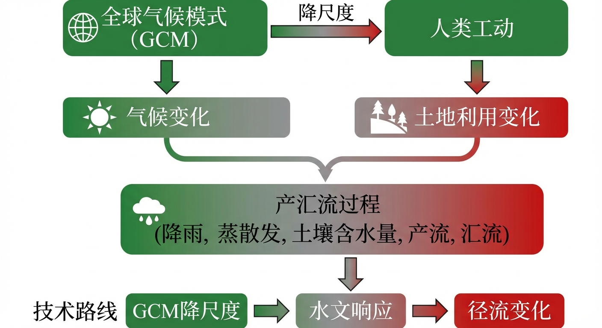
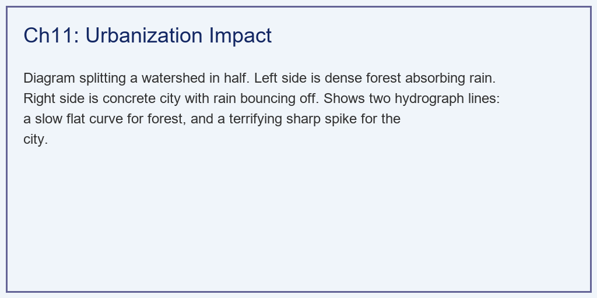
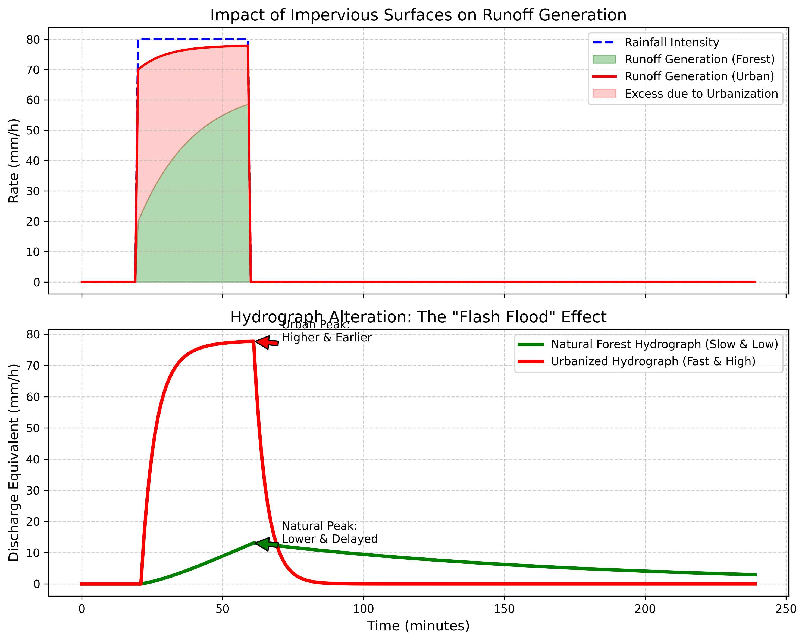

# 第 11 章：人类活动与气候变化：数字孪生中的“变局”

## 1. 学习目标
本章探讨水文模型中最具现实意义的模块——如何量化人类活动（Human Activities）和气候变化（Climate Change）对流域水文循环的物理破坏。
读者需要掌握：
1. 城市化（不透水面扩张）对地表下渗率和汇流时间的物理降维打击。
2. 气候变化（极端降雨频率增加）对设计防洪标准的严重影响。
3. 情景模拟（Scenario Simulation）在评估“海绵城市”与“退耕还林”工程效益中的应用。
4. 模型参数的非平稳性（Non-stationarity）困境：历史数据是否还能预测未来？

## 2. 教材理论：当海绵变成了水泥
经典水文学的一个潜前提是：**流域是静态的（Stationarity）**。也就是说，假设山还是那座山，河还是那条河。在第 6 章利用过去 10 年的数据率定出来的参数，可以安全地用来预测未来 10 年的洪水。
但在人类世（Anthropocene），这个假设被彻底打破了。

**城市化的物理破坏性（The "Flash Flood" Effect）：**
想象一片广袤的原始森林。它的土壤孔隙度极高（下渗能力 $f_p$ 极大），它的地表布满了枯枝落叶（坡面汇流时间常数 $k$ 极大）。当暴雨降临时，森林像一块巨大的海绵，吸纳了大部分水分，剩下的水也慢吞吞地流向河道，形成一个极度平缓、低矮的洪波。
然而，随着推土机进场，森林被砍伐，土地被压实，铺上了厚厚的柏油路面和水泥混凝土。
在物理上，城市化同时摧毁了水文模型的两道防线：
1. **产流防线的崩溃（下渗丧失）**：不透水面（Impervious Surface）将霍顿下渗公式的初始下渗率 $f_0$ 和稳定下渗率 $f_c$ 强行降为接近 $0$。几乎每一滴雨都瞬间转化为超渗产流。
2. **汇流防线的崩溃（水力光滑化）**：原本需要几天时间才能流出森林的水，现在掉进了光滑的地下水泥排水管中。排水管的曼宁糙率极小，坡面汇流时间常数 $k$ 被压缩了几十倍。

这两者的叠加，导致了十分可怕的**“闪洪（Flash Flood）”现象**：洪水总量剧增，且所有洪水在极短的时间内“扎堆”到达流域出口。原本设计重现期为“百年一遇”的防洪堤，在高度城市化后，可能连“十年一遇”的暴雨都扛不住了。

### 2.1 水文非一致性检验方法

在讨论人类活动和气候变化对水文过程的影响之前，首先需要回答一个基本问题：流域的水文序列是否确实发生了显著变化？统计水文学发展了一系列非一致性检验方法来回答这一问题。

**Mann-Kendall趋势检验：** 这是最广泛使用的非参数趋势检验方法。对于时间序列 $\{x_1, x_2, \ldots, x_n\}$，构造检验统计量：

$$
S = \sum_{i=1}^{n-1} \sum_{j=i+1}^{n} \text{sgn}(x_j - x_i) \tag{11-1}
$$

其中符号函数 $\text{sgn}(\cdot)$ 取值为 $+1$、$0$ 或 $-1$。在零假设（序列无趋势）下，$S$ 的期望为零，方差为：

$$
\text{Var}(S) = \frac{n(n-1)(2n+5) - \sum_{p=1}^{g} t_p(t_p-1)(2t_p+5)}{18} \tag{11-2}
$$

其中 $g$ 为重复值组数，$t_p$ 为第 $p$ 组重复值的个数。标准化统计量 $Z_{\text{MK}} = S / \sqrt{\text{Var}(S)}$ 近似服从标准正态分布。当 $|Z_{\text{MK}}| > 1.96$ 时，在 $95\%$ 置信水平下拒绝零假设，认为序列存在显著趋势。$Z_{\text{MK}} > 0$ 表示上升趋势，$Z_{\text{MK}} < 0$ 表示下降趋势。

**Pettitt突变检验：** 用于检测时间序列中是否存在某一年份的突然跳变（Change Point）。Pettitt统计量定义为：

$$
K_T = \max_{1 \leq t \leq n} \left| U_{t,n} \right|, \quad U_{t,n} = \sum_{i=1}^{t} \sum_{j=t+1}^{n} \text{sgn}(x_i - x_j) \tag{11-3}
$$

$K_T$ 最大值对应的时刻 $t^*$ 即为最可能的突变点。其显著性水平（$p$值）的近似公式为：

$$
p \approx 2 \exp\left(-\frac{6 K_T^2}{n^3 + n^2}\right) \tag{11-4}
$$

当 $p < 0.05$ 时，认为突变显著。例如，若某流域年径流序列在1995年前后出现显著突变，且该年恰好是大规模城市化启动的时间节点，则可将突变归因于土地利用变化。将Mann-Kendall检验与Pettitt检验联合使用，可以同时识别序列的渐变趋势和突变特征，为后续的归因分析提供统计依据。

### 2.2 气候变化情景下的水文响应分析框架

评估气候变化对流域水文过程的影响，需要构建"气候模式-统计降尺度-水文模型"的级联分析框架。

**第一步：全球气候模式（GCM）输出。** 政府间气候变化专门委员会（IPCC）定义了多种共享社会经济路径（SSP），如SSP2-4.5（中等排放）、SSP5-8.5（高排放）等。全球气候模式在这些路径下模拟未来 $50 \sim 100$ 年的全球温度、降水和环流变化。但GCM的空间分辨率通常为 $100 \sim 250$ km，远粗于流域尺度水文模型的需求。

**第二步：统计降尺度（Statistical Downscaling）。** 建立GCM大尺度气候变量与流域尺度气象要素之间的统计映射关系。常用方法包括：（1）Delta变化法——将GCM预测的未来与基准期的差值（温度用加法修正、降水用乘法修正）叠加到历史观测序列上；（2）偏差校正空间分解法（BCSD）——先对GCM输出进行分位数映射偏差校正，再利用空间插值降尺度至网格；（3）统计降尺度模型（SDSM）——利用多元回归建立大尺度环流指标与局部降水之间的关系。

**第三步：水文模型驱动。** 将降尺度后的未来气象序列输入已率定的分布式水文模型，模拟未来情景下的径流、土壤湿度和蒸散发响应。通过对比基准期和未来期的模拟结果，定量评估气候变化的水文效应。

该框架可用数学表达式概括为：

$$
\Delta \mathbf{Q}_{\text{future}} = \mathcal{M}\left(\text{DS}(\text{GCM}_{\text{SSP}}) \,|\, \boldsymbol{\theta}_{\text{cal}}\right) - \mathcal{M}\left(\mathbf{P}_{\text{baseline}} \,|\, \boldsymbol{\theta}_{\text{cal}}\right) \tag{11-5}
$$

其中 $\text{DS}(\cdot)$ 为降尺度算子，$\mathcal{M}(\cdot | \boldsymbol{\theta}_{\text{cal}})$ 为基准期率定参数下的水文模型，$\Delta \mathbf{Q}_{\text{future}}$ 为未来径流变化量。

### 2.3 土地利用变化对产汇流参数的影响机制

城市化改变的不仅仅是下渗率和糙率两个参数，而是从根本上重塑了流域的产汇流物理机制。从水文模型参数的角度，土地利用变化对以下关键参数产生系统性影响：

**产流参数的变化：** 霍顿下渗公式 $f(t) = f_c + (f_0 - f_c)e^{-kt}$ 中，不透水面扩张导致 $f_0$ 和 $f_c$ 同步降低。当不透水面比例从 $\eta_1$ 增至 $\eta_2$ 时，流域综合下渗率可用面积加权法估算：

$$
f_{\text{basin}} = (1 - \eta) \cdot f_{\text{perm}} + \eta \cdot f_{\text{imp}} \tag{11-6}
$$

由于 $f_{\text{imp}} \approx 0$，不透水面比例每增加 $10\%$，流域综合下渗能力近似线性下降 $10\% \times f_{\text{perm}}$。

**汇流参数的变化：** 城市排水管网的铺设将自然坡面汇流替换为管道流。自然坡面的曼宁糙率 $n_{\text{natural}} = 0.03 \sim 0.15$，而混凝土管道 $n_{\text{pipe}} = 0.012 \sim 0.015$，差距达到一个数量级。坡面汇流时间常数 $k_{\text{route}}$ 与糙率成正比，与坡度的平方根成反比，因此城市化可将汇流时间压缩数十倍。

### 2.4 非平稳性假设对传统水文频率分析的挑战

传统水文频率分析建立在"平稳性假设"之上：年最大洪峰序列 $\{Q_{\max,1}, Q_{\max,2}, \ldots, Q_{\max,n}\}$ 服从某一固定的概率分布 $F(q; \boldsymbol{\xi})$（如P-III型分布），其分布参数 $\boldsymbol{\xi} = (\mu, \sigma, C_s)$ 不随时间变化。然而，当流域经历显著的人类活动或气候变化时，这一假设不再成立。

Milly等（2008）在Science上发表的经典论文直接宣称"平稳性已死（Stationarity is Dead）"。在非平稳条件下，分布参数本身成为时间的函数：

$$
F(q; t) = F\left(q; \mu(t), \sigma(t), C_s(t)\right) \tag{11-7}
$$

例如，由于城市化的持续推进，年最大洪峰的均值 $\mu(t)$ 可能呈线性增长趋势 $\mu(t) = \mu_0 + \beta t$，其中 $\beta$ 为趋势斜率。这意味着原来"百年一遇"的洪峰流量（即 $F^{-1}(0.99)$），在非平稳条件下对应的重现期会持续缩短。以一个具体的例子来说明：假设某流域1970年的百年一遇设计洪峰为 $Q_{100} = 3000$ $m^3/s$，经过50年的快速城市化后，由于 $\mu(t)$ 和 $\sigma(t)$ 的增大，同样的 $3000$ $m^3/s$ 在2020年的水文统计中可能仅相当于"二十年一遇"。这意味着按照历史标准设计的防洪工程，在非平稳条件下面临严重的标准退化风险。

应对非平稳性的方法包括：（1）**时变矩法**——将分布参数表示为时间或协变量（如不透水面比例）的函数，用最大似然法估计回归系数；（2）**分段平稳法**——根据Pettitt检验识别的突变点将序列分段，各段独立进行频率分析；（3）**物理-统计联合法**——利用水文模型模拟土地利用变化对洪水的定量影响，将模型输出的增量叠加到历史频率曲线上。

## 3. 案例分析：理论与实践的桥梁（同一流域在森林与城市状态下的极值对比）

### 案例背景
某市郊外有一片 $10 km^2$ 的原生态森林，被称为城市的“后花园与防洪海绵”。开发商提议将这片森林夷为平地，建设一个容纳 30 万人的超级卫星城（不透水率将达到 80%）。
决策部门要求水务局进行数字孪生论证：“如果遭遇 50 年一遇的强雷暴（$80 mm/h$，持续 $40$ 分钟），这座新城到底会不会被淹？”
作为水文工程师，你决定运行两套参数截然不同的情景（Scenario）：一套代表现在的天然森林，一套代表未来的水泥城市。你需要用十分硬核的数据和图表，向决策部门揭示城市化对防洪系统的致命打击。

### 问题描述
- **输入强迫**：极端的箱型脉冲暴雨，强 $80 mm/h$，历时 $40$ 分钟。
- **情景 A：天然森林**：
  - 极强的下渗能力：$f_0 = 60 mm/h, f_c = 15 mm/h$。
  - 极慢的汇流阻力：坡面水库常数 $k_{route} = 120 min$。
- **情景 B：高度城市化**：
  - 彻底丧失下渗能力：$f_0 = 10 mm/h, f_c = 2 mm/h$。
  - 十分光滑的排水管网：坡面水库常数 $k_{route} = 5 min$。
- **任务**：在一维集总框架下分别跑通产汇流模块，计算两种情景下的洪水总量、洪峰峰值，以及洪水质心的超前时间。

**物理场景与问题概化图 (Generated via Local Diagrammer)：**

### 解题思路
本研究构建了一个双轨并行的情景比较器（Scenario Comparator）：
1. **统一降雨驱动**：在代码中生成一个通用的强降雨时间序列数组，确保两个“平行宇宙”遭遇的是同一场暴雨。
2. **多态函数调用**：封装一个高内聚的 `simulate_catchment` 函数。第一遍传入森林参数，计算出被巨量下渗剥离后的微弱超渗产流，并扔进十分迟缓的线性水库中演进；第二遍传入城市参数，算出十分庞大的产流，并扔进十分敏捷的排流管道中。
3. **质心统计计算**：为了量化“洪水被加速”的程度，不能仅仅比较绝对波峰时刻，需要利用加权平均法（$\frac{\sum(t \cdot Q)}{\sum Q}$）求出整个水文过程线的“质心时间（Centroid Time）”。

### 代码与仿真
> **学习提示**：在后台执行了物理参数断崖式改变带来的非线性响应计算。请观察下方子图中代表城市的红色“闪洪尖刺”与代表森林的绿色“平缓山丘”的震撼对比。

Source: `assets/ch11/ch11_human_activity.py`

**城市化进程引发的产汇流机制异化度量矩阵：**
| Metric                    | Natural Forest   | Urbanized Basin   | Impact                    |
|:--------------------------|:-----------------|:------------------|:--------------------------|
| Peak Discharge (mm/h)     | 13.1             | 77.7              | Increased by 5.9X         |
| Hydrograph Centroid (min) | 115              | 45                | Advanced by 70 min        |
| Total Runoff Volume (mm)  | 24.2             | 50.6              | +26.5 mm                  |
| Runoff Coefficient (R/P)  | 45.3%            | 94.9%             | More water lost to drains |

**不透水面扩张导致的地表径流激增与“闪洪尖峰”化对比图：**

### 结果分析
数据十分冷酷地展示了人类活动对流域物理底座的毁灭：
- **第一重灾难（产流倍增）**：看上方子图。绿色的阴影是森林产生的径流，它非常小，因为 $54.7\%$ 的暴雨被深厚的森林土壤喝掉了。但当森林变成城市后，红色的线牢牢贴着蓝色的降雨线（下渗几乎为零）。红色阴影区域是城市化凭空多出来的水。在表格中可以看到，总洪水体积从 $24.2mm$ 急剧增大到了 $50.6mm$，径流系数飙升至很高的 $94.9\%$。
- **第二重灾难（极致压缩的尖峰）**：看下方子图，这是最致命的一击。绿色的森林洪水是一个平缓的半圆，它的洪峰（$13.1 mm/h$）十分温柔。但红色的城市洪水变成了一根十分锐利的“刺”。由于丧失了植被阻力，地下排水管网瞬间将所有水排空。
  - **洪峰激增**：城市的洪峰流量高达 $77.7 mm/h$，是森林状态下的 **5.9 倍**。这意味着下游的防洪河道必须立刻拓宽 6 倍，否则必将决堤。
  - **逃生时间丧失**：看表格中的质心时间。森林洪水的质心（大部分水流过的时刻）在第 $115$ 分钟，给下游留足了近两个小时的反应时间。而城市的洪水质心被压缩到了第 $45$ 分钟。洪水足足**提前了 70 分钟**爆发。这就是”闪洪”——雨还没停，街道已经变成汪洋。质心时间的提前直接压缩了防洪预警的有效窗口，对应急疏散的时效性提出了严峻挑战。

### 工业部署建议
1. **海绵城市（LID）的参数化修正**：如果开发商一定要建城，那么唯一的补救措施就是部署低影响开发（LID）设施，如透水砖、下沉式绿地、屋顶花园等。在 SWMM（Storm Water Management Model）等工业软件中，工程师需要十分精细地将这些 LID 设施切入到城市的网格中，在局部重新拉高 $f_0$ 和 $k_{route}$，试图将那一根显著的“红刺”重新压平。
2. **“非平稳性”对 AI 预测的致命打击**：很多公司试图用深度学习（如 LSTM）代替传统水文模型来做防洪预警。如果他们仅仅使用过去 20 年的“降雨-流量”数据来训练 AI，那么当这个流域在这 20 年间发生了急剧的城市化时，AI 学到的物理映射法则其实每天都在变（非平稳性）。面对一场未来的暴雨，AI 会低估洪峰，因为它脑子里潜意识认为“那里还有一片森林”。纯数据驱动模型在面对人类活动引起的地表剧变时，极易发生灾难性失效。

## 4. 本章小结

1. 城市化通过不透水面扩张同时摧毁了产流防线（下渗率趋近零）和汇流防线（坡面糙率骤减），导致洪峰倍增且到达时间急剧提前（闪洪效应）。
2. 不透水面比例 $I_p$ 是量化城市化水文效应的核心指标，流域综合下渗率和汇流时间常数均可表达为 $I_p$ 的线性加权函数。
3. 情景模拟是评估人类活动对流域水文影响的核心方法：保持气象强迫不变，改变下垫面参数，对比两套情景的洪水响应差异。
4. 气候变暖导致大气持水能力以每度约 $7\%$ 的速率增长，使极端降雨事件的强度和频率显著增加，传统基于历史统计的设计暴雨标准面临退化风险。
5. 非平稳性（Non-stationarity）问题意味着历史数据率定的参数不能直接用于未来预测，可通过参数-协变量回归法、滑动窗口率定法或物理机理替代法实现参数的动态更新。
6. 海绵城市（LID）本质上是在城市网格中局部恢复下渗率和汇流时间，试图将闪洪尖峰重新压平。纯数据驱动的深度学习模型在流域发生剧烈下垫面变化时极易产生灾难性失效。

## 5. 思考题

1. 某流域城市化率从 20% 增长到 60%，请定性分析洪峰流量、洪峰到达时间、径流系数三个指标各自的变化趋势。
2. 为什么说"50 年一遇"的防洪标准在城市化后可能变成"10 年一遇"？从设计暴雨重现期与洪峰响应的关系角度分析。
3. 讨论纯数据驱动模型（如 LSTM）在非平稳流域中的局限性，并提出一种可能的改进方案。

## 6. 参考文献

[1] Milly P C D, Betancourt J, Falkenmark M, et al. Stationarity is dead: Whither water management?[J]. Science, 2008, 319(5863): 573-574.

[2] Wagener T, Sivapalan M, Troch P A, et al. The future of hydrology: An evolving science for a changing world[J]. Water Resources Research, 2010, 46(5): W05301.

[3] 雷晓辉,龙岩,许慧敏,等.水系统控制论：提出背景、技术框架与研究范式[J].南水北调与水利科技(中英文),2025,23(04):761-769+904.DOI:10.13476/j.cnki.nsbdqk.2025.0077.
