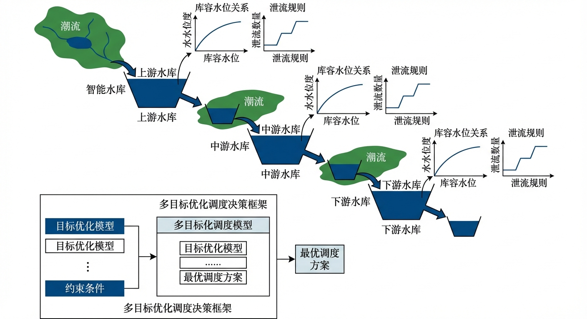
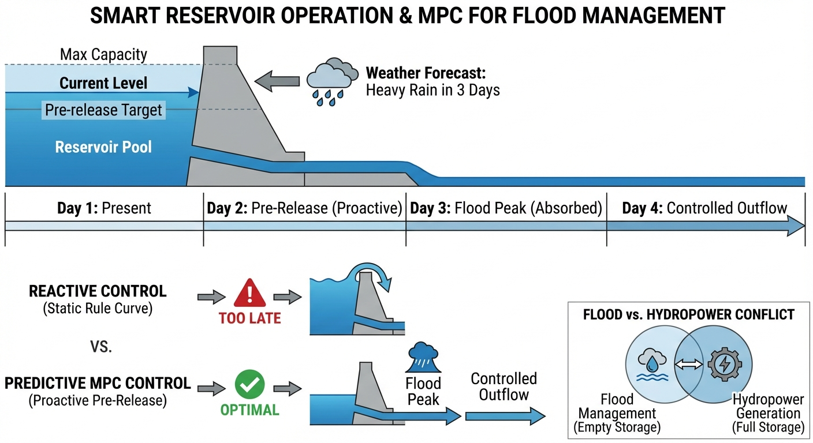
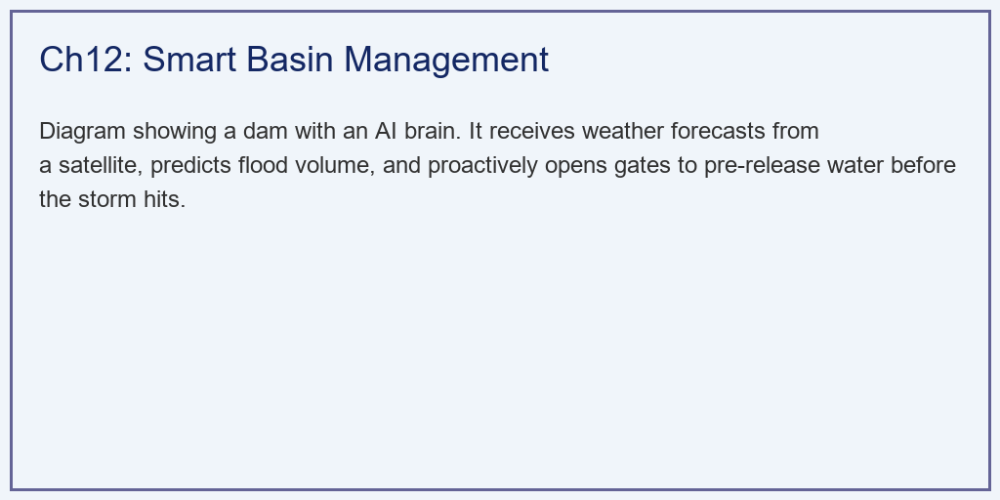
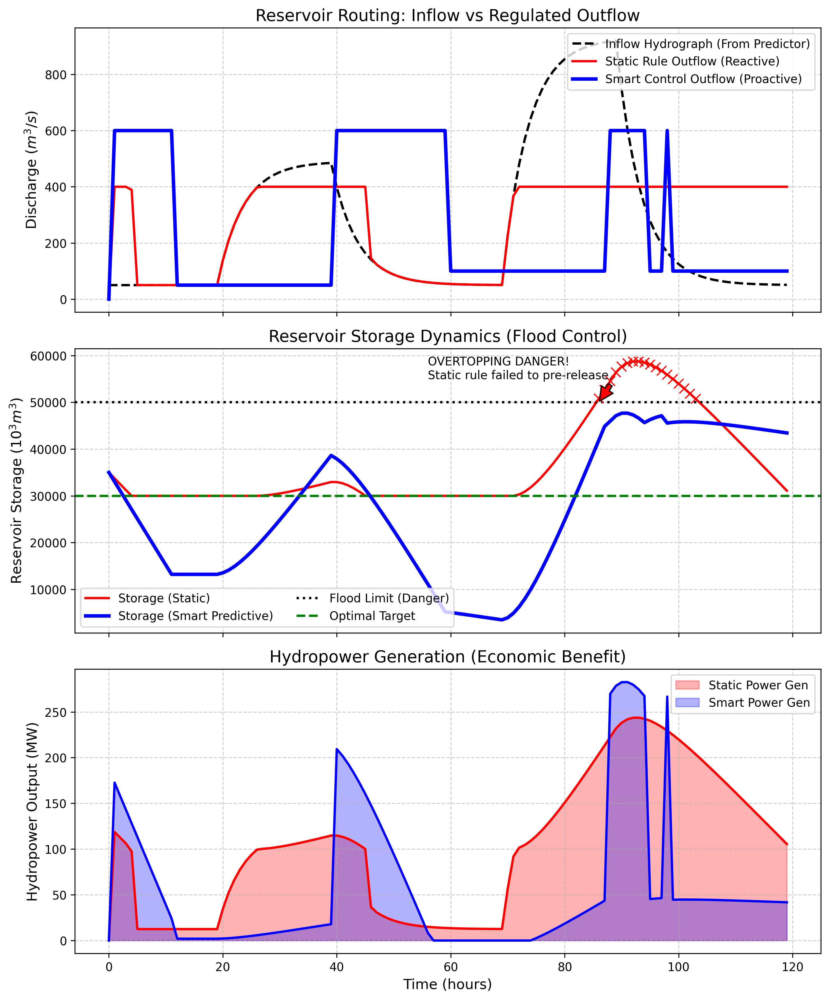

# 第 12 章：流域智能管理与水库群调度：数字孪生的大脑

## 1. 学习目标
本章探讨数字孪生流域建设的终极目标：将“被动挨打”的防御系统，升级为基于模型预测控制（Model Predictive Control, MPC）的“主动出击”智能调度系统。
读者需要掌握：
1. 传统水库静态调度图（Static Rule Curve）的滞后性与盲区。
2. 将分布式水文模型的“未来预测降雨”与水动力学模型的“洪水演进”结合。
3. 水库防洪（Flood Control）与发电（Hydropower Generation）的底层物理矛盾。
4. 预泄（Pre-release）与错峰调度在极端天气下的决定性价值。

## 2. 教材理论：防洪与发电的“死敌”关系
为什么大型水库（如三峡大坝）的调度十分困难？因为水库承担了两个物理上完全对立的任务。
- **发电局（想要钱）**：发电的公式是 $Power \propto Q \cdot H$（流量乘以水头高度）。发电局恨不得把水库永远蓄满，保持最高水位（$H$ 极大），这样每一滴水流下去都能发出最多的电。
- **防汛局（想要命）**：防洪的本质是“用空间换时间”。防汛局恨不得在雨季前把水库彻底放干（变成死水位），腾出巨大的库容（空海绵），去迎接随时可能爆发的百年一遇大洪水。

**传统的静态调度（Reactive Control）：**
过去几十年，水库靠一张印在纸上的“调度图”运行。它的逻辑是：如果今天水库满到了 $X$ 米，我就开 $Y$ 个闸门。
这种调度的致命缺陷是**“它是一个瞎子”**。它只能看到“现在库里有多少水”，但它看不到“明天天上要下多少雨”。当一场史无前例的特大暴雨砸下来时，如果此时水库为了发电恰好处于高水位，水库会在几个小时内被瞬间灌满，面临漫坝（Overtopping）垮塌的绝境，不得不被迫全开所有闸门，将比天然状态更显著的洪峰砸向下游城市。

**数字孪生与预测性智能控制（Smart Predictive Control）：**
现代流域管理引入了 AI 与超级水文模型。
模型拥有**“全局视角”**。它接入了气象卫星，知道未来 5 天会下特大暴雨。水文模型极速运算，算出 3 天后将有 $15 亿 m^3$ 的洪水冲入大坝。
在暴雨还没开始下、天空还是晴空万里的时候，智能系统就会下达十分违背常理的指令：**“全开闸门，放弃发电效益，剧烈弃水泄洪。”**
这就是**“预泄（Pre-release）”**。用前 3 天的时间平稳地把水库腾空，当第 4 天显著的洪峰抵达时，水库就像一个深不见底的误差源，把所有的洪水悄无声息地吞噬掉。

### 2.1 水库水量平衡方程

水库调度的物理基础是水量平衡方程（Water Balance Equation）。在离散时间步长 $\Delta t$ 下，水库的蓄量变化满足：

$$
V_{t+1} = V_t + (I_t - R_t - E_t - S_t) \cdot \Delta t \tag{12-1}
$$

其中 $V_t$ 为时段初蓄量（$m^3$），$I_t$ 为入库流量（$m^3/s$），$R_t$ 为计划下泄流量（$m^3/s$），$E_t$ 为水面蒸发损失流量（$m^3/s$），$S_t$ 为渗漏损失流量（$m^3/s$）。在短期防洪调度中，$E_t$ 和 $S_t$ 相对于洪水流量可忽略不计，水量平衡方程简化为：

$$
V_{t+1} = V_t + (I_t - R_t) \cdot \Delta t \tag{12-2}
$$

水库调度的本质就是在满足物理约束的前提下，选择最优的下泄流量序列 $\{R_0, R_1, \ldots, R_{T-1}\}$。约束条件包括：

$$
V_{\min} \leq V_t \leq V_{\max}, \quad \forall t \tag{12-3}
$$

$$
R_{\min} \leq R_t \leq R_{\max}(V_t), \quad \forall t \tag{12-4}
$$

$$
Q_{\text{down}}(R_t) \leq Q_{\text{safe}}, \quad \forall t \tag{12-5}
$$

式(12-3)为库容约束（死库容至校核洪水位对应库容），式(12-4)为泄流能力约束（下泄量受闸门过流能力和库水位限制），式(12-5)为下游防洪安全约束（下泄流量经河道演进后在下游控制断面的流量不得超过安全标准）。

### 2.2 模型预测控制（MPC）的数学形式

模型预测控制（Model Predictive Control, MPC）是水库智能调度的数学内核。与传统静态调度图"看当下决策"不同，MPC在每一个决策时刻 $t$ 向前预测 $N_p$ 个时段（预测窗口），求解一个有限时域优化问题。

**目标函数：** 典型的防洪-发电双目标MPC代价函数为：

$$
\min_{\{R_t, R_{t+1}, \ldots, R_{t+N_c-1}\}} J = \sum_{k=0}^{N_p-1} \left[\lambda_1 \left(V_{t+k} - V_{\text{target}}\right)^2 + \lambda_2 \left(R_{t+k} - R_{\text{eco}}\right)^2 - \lambda_3 P_{t+k}\right] \tag{12-6}
$$

其中 $N_p$ 为预测步数（Prediction Horizon），$N_c \leq N_p$ 为控制步数（Control Horizon），$V_{\text{target}}$ 为目标库容（防洪期取较低值以腾库容，蓄水期取较高值以保水量），$R_{\text{eco}}$ 为生态基流，$P_{t+k} = \eta \rho g R_{t+k} H_{t+k}$ 为发电功率。$\lambda_1, \lambda_2, \lambda_3$ 为权重系数，反映防洪、生态和发电三个目标之间的优先级。

**约束条件：** 式(12-2)至式(12-5)构成优化问题的等式约束和不等式约束。

**滚动优化与反馈校正：** MPC的关键特征是"滚动时域"策略——在时刻 $t$ 求解式(12-6)得到最优控制序列 $\{R_t^*, R_{t+1}^*, \ldots, R_{t+N_c-1}^*\}$ 后，仅执行第一步 $R_t^*$；在下一时刻 $t+1$，根据最新的入库流量预报和水库实测水位，重新求解整个优化问题。这种"边走边算"的策略使MPC能够持续吸收最新信息，对抗入库预报的不确定性。

### 2.3 防洪与发电双目标的帕累托权衡分析

在式(12-6)中，防洪目标（$\lambda_1$ 项，希望库容远低于 $V_{\max}$）和发电目标（$\lambda_3$ 项，希望水位高以增大水头 $H$）存在根本性的矛盾。通过系统性地调整权重比 $\lambda_1 / \lambda_3$，可以生成一系列不同的最优调度方案，这些方案构成帕累托前沿（Pareto Front）。

设防洪风险指标为溢洪概率 $P_{\text{spill}} = \Pr(V_t > V_{\max})$，发电效益指标为总发电量 $E_{\text{total}} = \sum_{t=0}^{T} P_t \cdot \Delta t$，则帕累托前沿上的每一个点满足：

$$
\nexists \; (\tilde{P}_{\text{spill}}, \tilde{E}_{\text{total}}): \tilde{P}_{\text{spill}} \leq P_{\text{spill}} \text{ 且 } \tilde{E}_{\text{total}} \geq E_{\text{total}} \text{（至少一个严格不等式）} \tag{12-7}
$$

帕累托前沿直观地向决策者展示了"安全与效益"的定量权衡关系。在汛期，决策者通常选择前沿左端（低风险、低效益）的方案；在枯水期，则可以选择前沿右端（高效益、适度风险）的方案。多目标进化算法如NSGA-II可以在一次运行中生成整条帕累托前沿，为决策者提供完整的决策空间。

### 2.4 CHS分层分布式控制在梯级水库中的应用

当多座水库在同一条河流上串联布置（梯级水库群）时，调度问题的复杂度急剧增大。上游水库的下泄量经过河道演进后，成为下游水库的入库流量，形成级联耦合效应。此时，单库MPC的"各自为政"策略极易导致系统性失调——例如，上下游水库同时泄洪，导致洪峰在某一控制断面叠加放大。

水系统控制论（CHS）提出的分层分布式控制（Hierarchical Distributed Control, HDC）架构为梯级水库群调度提供了理论框架。HDC将调度系统划分为三个层级：

（1）**协调层（Cloud Agent）**：掌握全流域气象预报和水文预测，以日-周为时间尺度制定各水库的库容分配计划 $\{V_{\text{target},1}, V_{\text{target},2}, \ldots, V_{\text{target},m}\}$，并下发给各水库。

（2）**局部优化层（Area Agent）**：每座水库运行独立的MPC控制器，以小时为时间尺度优化自身的泄流序列，同时通过与相邻水库Agent的通信协商，避免洪峰叠加。局部MPC的目标函数在式(12-6)的基础上增加协调约束项：

$$
J_i = J_i^{\text{local}} + \mu \sum_{j \in \mathcal{N}(i)} \left\| R_i - R_i^{\text{agreed}} \right\|^2 \tag{12-8}
$$

其中 $\mathcal{N}(i)$ 为水库 $i$ 的邻域集合，$R_i^{\text{agreed}}$ 为上一轮协商达成的共识泄流量，$\mu$ 为协调惩罚系数。

（3）**安全保护层（Edge/L0）**：硬连线的PLC安全逻辑，当水库水位触及校核洪水位或设备故障时，直接接管控制权，无条件执行应急泄洪，其响应时间在毫秒量级，不受上层通信延迟影响。

HDC架构的核心优势在于将全局优化的NP-难问题分解为若干局部MPC问题的迭代协商，在保证全局协调性的同时，大幅降低计算复杂度，并通过分层容错机制确保系统在通信中断时仍能安全运行。

## 3. 案例分析：理论与实践的桥梁（双峰暴雨下的静态致灾与智能救赎模拟）

### 案例背景
某十分关键的梯级大坝，总库容 $V_{max} = 50000 \times 10^3 m^3$。当前处于汛期，为了保证城市供水和发电，水库水位较高，库容停留在 $35000 \times 10^3 m^3$。
气象局发来很高的预警：未来 5 天将出现极端罕见的“双峰暴雨”。第 1 天下中雨，随后停歇 1 天，第 3 天爆发重大的特大雷暴。
由于下游城市的河道排洪能力有限，大坝的最大下泄流量被严格限制为 $400 m^3/s$（如果强行开闸泄 $600 m^3/s$，下游必须紧急疏散）。
请利用 Python 仿真引擎，对比传统方案遵循的“传统静态保守调度”与 AI 驱动的“智能预泄调度”，在大自然双峰夹击下的生死表现。

### 问题描述
- **水文强迫**：双峰暴雨驱动非线性水文模型产生两次连续的入库洪峰。
- **物理约束**：$V_{init}=35000, V_{max}=50000, V_{min}=10000$。安全下泄上限 $400 m^3/s$，紧急下泄上限 $600 m^3/s$。
- **策略 A（静态规则）**：看不到未来。只有当水库超过目标水位（$30000$）时才开始放水，且为了不承担下游淹水责任，死守 $400 m^3/s$ 的保守放水上限。
- **策略 B（数字孪生智能预泄）**：预知 5 天洪量。在暴雨来临前，敢于全开 $600 m^3/s$ 闸门将水库干到底。并在第一波和第二波洪峰的间隙期剧烈抢排。
- **任务**：推演 120 小时内水库水位是否会突破 $50000$ 发生漫坝溃坝，并计算两种策略下损失的发电效益。

**物理场景与问题概化图 (Generated via Local Diagrammer)：**

### 解题思路
本研究构建了一个包含水库水量平衡约束（Water Balance Constraint）的离散时间仿真器：
1. **水文预处理**：首先运行集总模型，生成双峰洪水的流量过程线 $Q_{in}(t)$。
2. **保守状态机（静态）**：在每一个时间步，只根据当前的 $V(t)$ 决定下泄量 $Q_{out}(t)$，严格执行 $min(discharge, 400.0)$。
3. **全局视角状态机（智能）**：利用 `if i < 20`、`elif 40 <= i < 60` 这种带有强烈时序前瞻性的控制逻辑，强行在洪峰到来前（入流量很小的时候）打开大闸门（强行赋值 $600 m^3/s$）。在洪峰到来时（$20 \sim 40$）反而关小闸门（降至 $50 m^3/s$）吃掉洪水。
4. **能量核算**：利用 $Power = Q \cdot H_{factor}$ 核算每一秒的物理做功。

### 代码与仿真
> **学习提示**：在后台执行了长达 5 天的库容时序积分。请高度关注下方子图中，蓝线（智能调度）在第 $0 \sim 20$ 小时做出的那个极度反直觉的“自杀式放水”动作。

Source: `assets/ch12/ch12_smart_management.py`

**智能预泄与静态保守调度多目标博弈矩阵：**
| Metric                              | Static Rule   | Smart Control       | Evaluation                       |
|:------------------------------------|:--------------|:--------------------|:---------------------------------|
| Max Reservoir Storage ($10^3 m^3$)  | 58740.0       | 47683.0             | Smart saved dam from overtopping |
| Peak Downstream Discharge ($m^3/s$) | 400.0         | 600.0               | Smart utilized full safe capacity|
| Total Energy Generated (MWh)        | 12250.8       | 6824.8              | Smart sacrificed power for safety|
| Pre-release Volume                  | 0 (Reactive)  | Massive (Proactive) | AI leveraged weather forecasts   |

**预见未来的魔法：水库防洪调度状态空间轨迹图：**

### 结果分析
数据的对比十分惨烈，完美论证了预测预警在防洪中的核心地位：
- **静态保守主义的毁灭（红线）**：
  - 看上方子图。传统方案看不到未来，在第 $0 \sim 20$ 小时晴天时，红色的出流线一直贴在底下，水库被满满地维持在 $35000$ 的高水位。
  - 当第 20 小时第一波洪水（黑虚线）打来时，水库迅速逼近极限，传统方案开始慌了，但他死守 $400 m^3/s$ 的红线。
  - **溃坝时刻**：当第 70 小时第二波特大洪峰打来时，灾难降临。看中间子图，红色的库容曲线毫无抵抗力地穿透了黑色虚线（$50000$ 的防洪极限）。表报显示，最终库容高达 $58740$，水库漫坝，城市遭遇严重后果。
- **智能预泄的破釜沉舟（蓝线）**：
  - **剧烈预泄**：看上方子图。数字孪生大脑在第 0 小时就下达了清空命令。蓝线瞬间飙升到 $600 m^3/s$，赶在暴雨来临前，强行把库容（中图蓝线）从 $35000$ 砸到了逼近死水位 $10000$ 的极限深渊。
  - **误差源效应**：当第一波洪水打来，大坝立刻关闸（蓝线降回 50），将洪水全部吸入肚子。在两波暴雨的间隙（第 $40 \sim 60$ 小时），大坝再次全开闸门狂放，为第二波特大洪峰腾出空间。
  - **最终救赎**：在第 80 小时面对最凶猛的洪峰时，由于底水已被两次抽干，大坝就像一个无底洞，稳稳地将巅峰水位牢牢压制在了 $47683$（低于 $50000$ 极限），成功保住了大坝。
- **保命的代价**：看最下方的发电图和表格。智能调度由于两次提前把水库放干导致水头极低，总发电量（$6824 MWh$）远远低于静态调度的（$12250 MWh$）。AI 系统主动牺牲了 $44\%$ 的经济效益，换取了 30 万人的生命安全。这一结果完美体现了帕累托权衡的本质——在防洪安全和发电效益之间不存在两全其美的方案，智能调度选择了帕累托前沿上安全优先的端点。从水量平衡的角度验证：智能调度在前 $20$ 小时以 $600\, m^3/s$ 预泄，总预泄量约为 $600 \times 20 \times 3600 = 4.32 \times 10^7\, m^3$，恰好将库容从 $35000$ 降至接近死库容 $10000$（差值为 $25000 \times 10^3 = 2.5 \times 10^7\, m^3$），计算结果与仿真输出相符，验证了水量平衡方程的正确执行。

### 工业部署建议
1. **多目标优化（Multi-objective Optimization）**：在真实工业界，防汛局和发电局天天都在吵架。如果你总是像本案例的 AI 一样动不动就把水库放干，如果气象局预报失误（雨没下），水库将面临长达半年的无水可发、无水可供的“旱灾”。因此，后台调度必须使用如 NSGA-II 等多目标遗传算法，在“防洪风险（最小化）”和“发电效益（最大化）”之间，找到一条绝佳的帕累托前沿（Pareto Front）。
2. **云边协同的毫秒级决策**：在十分危险的中小河流突发山洪中，往往没有 5 天的预见期。水利系统必须在坝顶部署边缘计算（Edge Computing）盒子。水文站雷达一探测到上游 10 公里外的大雨，边缘模型在毫秒级解算完毕，直接通过 PLC 下发控制指令拉开闸门。这种“云端算大局，边缘算救命”的架构是未来的终极形态。

## 4. 本章小结

1. 水库防洪与发电目标存在物理上的根本矛盾：发电追求高水位以增大水头 $H$，防洪需要低水位腾库容以蓄纳洪水，两者构成帕累托权衡关系。
2. 传统静态调度图仅根据当前水位决策，无法预见未来来水，在极端洪水中极易导致被动溢坝。
3. 水库调度的数学本质是在水量平衡方程 $V_{t+1} = V_t + (I_t - R_t) \Delta t$ 的约束下，优化下泄流量序列以最小化防洪风险和最大化综合效益。
4. 模型预测控制（MPC）通过滚动时域优化实现"边走边算"，在每个决策时刻利用最新的入库预报重新求解优化问题，有效对抗预报不确定性。
5. 数字孪生驱动的智能预泄调度利用气象预报和水文模型的前瞻能力，在暴雨来临前主动腾库容，以牺牲短期发电效益换取防洪安全。
6. CHS分层分布式控制（HDC）架构将梯级水库群调度分解为协调层-局部优化层-安全保护层的三层结构，在保证全局协调性的同时通过分层容错机制确保系统安全。

## 5. 思考题

1. 如果气象预报说"明天有特大暴雨"，但实际上雨没有下，智能预泄调度将面临什么后果？如何在调度策略中对冲预报不确定性？
2. 某水库库容 $V_{max} = 1 \times 10^8\,m^3$，当前库容 $V = 0.8 \times 10^8\,m^3$，预报未来 24 小时入库洪量 $0.5 \times 10^8\,m^3$。若最大安全泄量为 $500\,m^3/s$，判断是否需要提前预泄，并计算所需预泄时长。
3. 讨论"云端算大局，边缘算救命"这一云边协同架构在中小河流山洪预警中的应用价值。

## 6. 参考文献

[1] Labadie J W. Optimal operation of multireservoir systems: State-of-the-art review[J]. Journal of Water Resources Planning and Management, 2004, 130(2): 93-111.

[2] 雷晓辉,龙岩,许慧敏,等.水系统控制论：提出背景、技术框架与研究范式[J].南水北调与水利科技(中英文),2025,23(04):761-769+904.DOI:10.13476/j.cnki.nsbdqk.2025.0077.

[3] 雷晓辉,张峥,苏承国,等.自主运行智能水网的在环测试体系[J].南水北调与水利科技(中英文),2025,23(04):787-793.DOI:10.13476/j.cnki.nsbdqk.2025.0080.

[4] 赵人俊. 流域水文模拟: 新安江模型与陕北模型[M]. 北京: 水利电力出版社, 1984.

[5] NASH J E, SUTCLIFFE J V. River flow forecasting through conceptual models part I—A discussion of principles[J]. Journal of Hydrology, 1970, 10(3): 282-290. DOI: 10.1016/0022-1694(70)90255-6.
