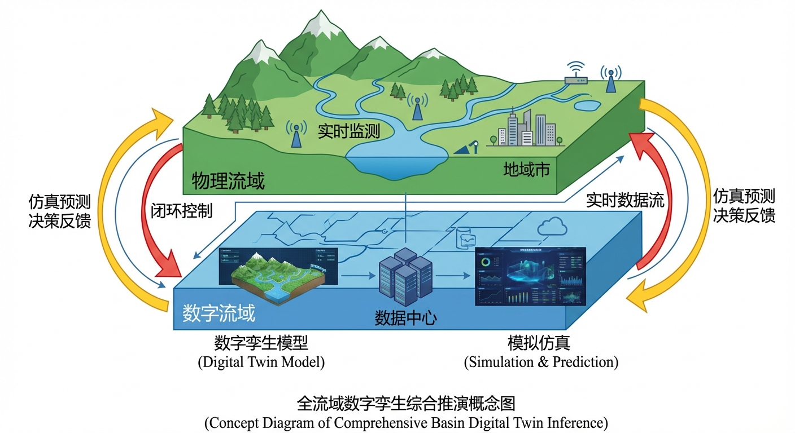
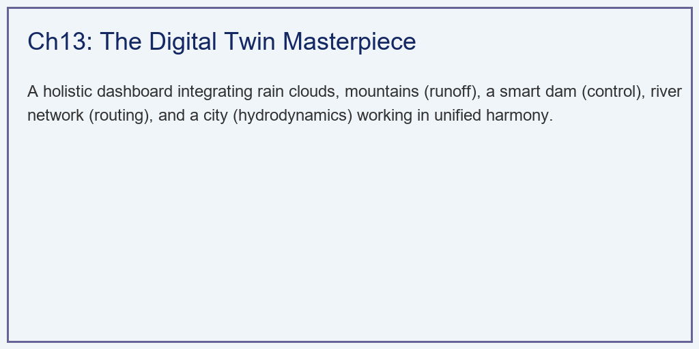
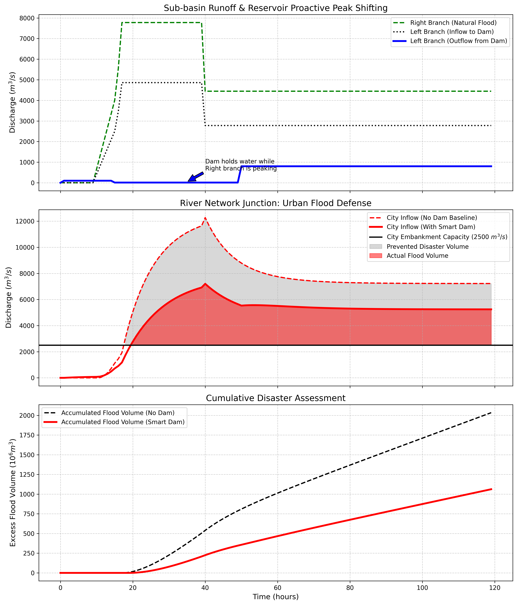

# 第 13 章：全流域数字孪生综合推演：与上帝博弈

## 1. 学习目标
本章是全书的巅峰大结局。本章将把前面 12 章学到的所有物理机制——降雨、产流、坡面汇流、水动力学、水库调度、河网演进全部拼装在一起，构建一个真正的、具备实战威力的“全流域数字孪生（Digital Twin of River Basin）”巨型系统。
读者需要掌握：
1. 模块化解耦与大型系统的耦合架构设计。
2. 平行宇宙推演（Parallel Universe Simulation）：有坝与无坝的经济学论证。
3. 错峰调度（Peak Shifting）在多支流河网中的终极战术应用。
4. 防洪决策中的宏观容错与灾难量化（Disaster Quantification）。

## 2. 教材理论：水文数字孪生的“超级架构”
真实的水利部数字孪生大厅屏幕上，跑的绝不是一个简单的公式，而是一个由众多微小物理引擎啮合而成的超级齿轮组。
- **输入端**：接入气象局的雷达数据和降雨预报（气象强迫）。
- **产汇流层**：把降雨“喂”给上千个网格里的新安江模型或超渗模型，算出漫山遍野的坡面漫流。
- **拓扑骨架层**：用有向无环图（DAG）把这些水流顺着河道网络，一段一段地往下传（马斯金根方程）。
- **人工干预层**：在关键的干支流节点，接入水库大坝的人工智能调度模块，决定水库是该“吃水”还是该“吐水”。
- **风险评估层**：把汇聚到城市入口的终极洪峰，塞入一维/二维水动力学模型，算出淹没的水深，并以“百万立方米”和“亿元”为单位，实时跳动显示灾害损失。

**数字孪生的最大价值——“平行宇宙（What-If Analysis）”：**
决策部门问：“如果花 100 亿在左边支流建一座水库，到底值不值？”
数字孪生系统可以瞬间创造出两个平行的世界：一个没有水库（Baseline），一个有智能水库（Smart Dam）。让一场百年一遇的虚拟台风同时席卷这两个世界，最后拿两份“灾害损失评估报告”出来对比。这就是现代大型工程决策的唯一科学依据。

### 2.1 数字孪生流域的三要素

数字孪生流域（Digital Twin of River Basin）并非简单的水文模型的代名词，而是一个由三个不可或缺的要素构成的完整闭环系统。

**第一要素：物理模型群（Physics Engine Cluster）。** 包含降雨产流模型、坡面汇流模型、河网演进模型（马斯京根方程）、水库调度模型、水动力学模型（圣维南方程）等多个异构物理引擎。这些模型通过有向无环图（DAG）拓扑连接，模拟水从降雨到入河、从上游到下游的完整物理过程。设流域拓扑包含 $N_s$ 个子流域节点、$N_r$ 个河段和 $N_d$ 个水库，则系统的状态向量可表示为：

$$
\mathbf{x}(t) = \left[\mathbf{SM}(t), \mathbf{GW}(t), \mathbf{Q}_{\text{river}}(t), \mathbf{V}_{\text{res}}(t), \mathbf{h}_{\text{urban}}(t)\right]^{\top} \tag{13-1}
$$

其中 $\mathbf{SM}$ 为各网格的土壤湿度向量，$\mathbf{GW}$ 为地下水位向量，$\mathbf{Q}_{\text{river}}$ 为各河段流量向量，$\mathbf{V}_{\text{res}}$ 为各水库蓄量向量，$\mathbf{h}_{\text{urban}}$ 为城市网格水深向量。

**第二要素：数据同化引擎（Data Assimilation Engine）。** 如第9章所述，物理模型在开环运行中不可避免地产生漂移。数据同化引擎持续接入水文站流量、雷达降雨、卫星土壤湿度、水库水位等多源实时观测，通过EnKF或3D-Var将模型状态修正至观测附近。同化引擎是数字孪生系统的”纠偏心脏”，使虚拟流域的状态始终与物理流域保持高度一致。

**第三要素：可视化与决策支持界面（Visualization and Decision Support）。** 将模型计算结果（洪水演进、淹没范围、风险等级）实时渲染为二维/三维地理信息场景，并生成量化的决策建议（如预泄指令、疏散范围）。可视化层是数字孪生系统面向决策者的”最后一公里”——再精确的计算，如果不能以直观、实时的方式呈现给决策者，就无法转化为有效的防灾行动。

三要素的关系可以概括为：物理模型提供”对未来的预测能力”，数据同化提供”对现实的跟踪能力”，可视化提供”对决策的支撑能力”。三者缺一不可。

### 2.2 实时校正与滚动预报的工作流程

数字孪生流域的业务运行采用”实时校正-滚动预报-更新预报”的循环机制，其工作流程如下：

**步骤一：状态初始化。** 在预报起始时刻 $t_0$，利用过去一个同化窗口（$[t_0 - \Delta T_a, t_0]$）内的观测数据执行数据同化，获得分析态 $\mathbf{x}^a(t_0)$。这一步确保预报的初始条件尽可能接近流域的真实状态。

**步骤二：集合预报。** 以 $\mathbf{x}^a(t_0)$ 为初始条件，输入多个气象预报成员（如ECMWF的51个集合预报成员），驱动水文-水动力耦合模型向前积分至预报时域末端 $t_0 + T_f$。每个气象成员生成一条独立的预报轨迹，共同构成预报的概率包络。

**步骤三：风险评估。** 对集合预报结果进行统计分析，提取关键风险指标。设集合预报在控制断面 $j$ 处、时刻 $t$ 的流量集合为 $\{Q_j^{(1)}(t), Q_j^{(2)}(t), \ldots, Q_j^{(N_e)}(t)\}$，则超警概率为：

$$
P_{\text{alert}}(j, t) = \frac{1}{N_e} \sum_{i=1}^{N_e} \mathbb{1}\left(Q_j^{(i)}(t) > Q_{\text{alert},j}\right) \tag{13-2}
$$

当 $P_{\text{alert}} > 0.5$ 时发布蓝色预警，$> 0.7$ 时发布橙色预警，$> 0.9$ 时发布红色预警。

**步骤四：滚动更新。** 每当新的观测数据到达（如每15分钟），重新执行步骤一至三，将预报窗口向前滑动。每一轮新预报都利用了最新的观测信息，因此预报精度随着预报时刻的临近持续提高。

### 2.3 模型集成框架：水文-水动力-水质级联耦合

完整的数字孪生流域不仅需要模拟水量，还需要模拟水质。水文-水动力-水质的级联耦合形成了一个三层递进的模型集成框架：

**第一层（水文层）：** 降雨-产流-汇流模型，输出各子流域的径流过程线 $Q_j^{\text{runoff}}(t)$ 以及伴随径流携带的面源污染负荷 $L_j^{\text{NPS}}(t)$（非点源氮、磷、悬浮物等）。面源负荷通常与径流量呈幂函数关系：

$$
L_j^{\text{NPS}}(t) = a \cdot \left[Q_j^{\text{runoff}}(t)\right]^b \tag{13-3}
$$

其中 $a$ 和 $b$ 为经验系数，可通过暴雨期间的水质监测数据率定。

**第二层（水动力层）：** 圣维南方程组，输出河道的流速场 $v(x,t)$ 和水深场 $h(x,t)$。水动力场为水质输运提供”载体”——污染物随水流运动（对流）和扩散。

**第三层（水质层）：** 对流-扩散-反应方程（Advection-Dispersion-Reaction Equation）：

$$
\frac{\partial C}{\partial t} + v \frac{\partial C}{\partial x} = D_L \frac{\partial^2 C}{\partial x^2} + S_C \tag{13-4}
$$

其中 $C$ 为污染物浓度（$mg/L$），$v$ 为流速（由水动力层提供），$D_L$ 为纵向弥散系数，$S_C$ 为源汇项（包括面源输入、点源排放、生化降解等）。

三层模型的信息流向为：水文层 $\rightarrow$ 水动力层 $\rightarrow$ 水质层，形成单向级联耦合。在水资源调度中，这一框架使决策者能够同时评估调度方案对水量和水质的综合影响。

### 2.4 CHS xIL验证体系在数字孪生中的应用

数字孪生流域系统的可信度取决于其在部署前是否经过了严格的验证。水系统控制论（CHS）提出的xIL（X-in-the-Loop）验证体系为数字孪生提供了系统化的验证路径，从虚拟到实物逐级递进：

**MiL（Model-in-the-Loop，模型在环）：** 纯软件仿真验证。将水文模型、水动力模型、调度算法全部在计算机中运行，用历史极端事件（如”98大洪水”、”21.7郑州暴雨”）作为输入，检验系统能否正确模拟已知的灾害过程。MiL的核心指标是模型精度（如NSE、RMSE）和计算效率（能否在预报窗口内完成计算）。

**SiL（Software-in-the-Loop，软件在环）：** 将调度决策算法编译为可部署的软件模块（如Docker容器），接入虚拟SCADA系统，验证软件在接近真实运行环境中的功能正确性和通信稳定性。SiL可以暴露软件Bug、通信延迟和数据格式不兼容等工程问题，这些问题在纯MiL阶段无法发现。

**HiL（Hardware-in-the-Loop，硬件在环）：** 将真实的PLC控制器、闸门驱动器和传感器接入仿真系统。物理模型在计算机中实时运行，但控制信号经由真实的工业通信网络（如Modbus/TCP）传递给真实的执行器硬件。HiL验证的核心目标是确认控制逻辑在真实硬件时序和通信约束下仍然正确。

**PiL（Plant-in-the-Loop，实物在环）：** 在真实的物理水利设施上进行受控实验。例如，在汛前低风险时段，对真实水库执行一次预泄-蓄水循环，将数字孪生系统的预测结果与实测结果进行对比。PiL是系统上线前的终极验证，其结果直接决定数字孪生系统能否获得运行授权。

xIL的逐级递进逻辑可以表示为：

$$
\text{MiL} \xrightarrow{\text{功能验证}} \text{SiL} \xrightarrow{\text{集成验证}} \text{HiL} \xrightarrow{\text{硬件验证}} \text{PiL} \xrightarrow{\text{实物验证}} \text{运行授权} \tag{13-5}
$$

每一级验证扩展了系统的”已验证运行设计域（Verified ODD）”——只有经过完整xIL流程验证的工况和场景，数字孪生系统才被授权在该范围内自主运行。这一理念是CHS理论中从WSAL-2（人工确认）向WSAL-3（条件自主）跨越的关键技术基础。

## 3. 案例分析：理论与实践的桥梁（台风过境下跨干支流水库”错峰救城”战略推演）

### 案例背景
一个大型流域由左、右两条大支流组成。右支流（$800 km^2$）是纯天然的野河；左支流（$500 km^2$）上游修建了一座库容 1 亿方的现代化智能大坝。两条支流在山谷交汇后，冲向一座拥有 500 万人口的特大城市（城市防洪极限流量为 $2500 m^3/s$）。
超级台风即将登陆，将带来长达 30 小时的无差别特大暴雨（$15 mm/h$）。
由于右支流没有水库，它的天然洪峰注定会以不可阻挡的威势冲向城市。
水务局的唯一底牌，就是利用左支流上的智能大坝。大坝的AI大脑必须做出极限的**“错峰战术”**：它必须看准右边野河洪峰爆发的时间，在那个时刻，左边大坝必须像死人一样闭紧嘴巴，一滴水都不准漏；等右边的洪峰安全经过城市后，大坝再赶紧把肚子里的水排空。

### 问题描述
- **气象与产汇流**：台风带来 $t=10 \sim 40$ 小时的持续大雨。左右两支流分别进行非线性产汇流计算。
- **右支流（天然）**：面积大，洪峰十分猛烈，直接马斯金根演进至交汇点。
- **左支流（带坝）**：
  - 前 15 小时：全开闸门预泄。
  - $15 \sim 50$ 小时（右支流洪峰期）：十分痛苦的“错峰憋水”，仅释放微弱基流。
  - $>50$ 小时：防洪极限逼近，开闸排空。
- **城市防洪底线**：交汇点合流后的流量绝对不能超过 $2500 m^3/s$。
- **任务**：运行“无坝平行宇宙”和“数字孪生调度宇宙”，计算两种情况下城市被洪水漫灌的总水量。

**物理场景与问题概化图 (Generated via Local Diagrammer)：**

### 解题思路
本研究构建了一个极具工业级复杂度的系统集成总线：
1. **模块化封装**：将产汇流封装为 `run_catchment(area)`，将河网演进封装为 `muskingum_routing(Qin)`。
2. **异步控制流**：在主循环中，左支流的水流被截断截胡，进入带有多阶段状态机（预泄 -> 错峰死守 -> 泄洪）的水库模块。
3. **节点耦合**：将受控的左支流尾水与狂暴的天然右支流尾水在时空节点上硬性叠加。
4. **平行时空对照**：再开一个内存线程，计算没有水库拦截时的裸奔洪水线。通过对超标流量（$>2500$）进行积分，算出累积的灾难体积。

### 代码与仿真
> **学习提示**：在后台串联了全书开发的所有核心类库，执行了这场终极推演。请屏住呼吸，观看图表中那触目惊心的红色阴影是如何被数字孪生系统强行“挖”去一大块的。

Source: `assets/ch13/ch13_comprehensive_twin.py`

**全流域数字孪生攻防战——百万人口城市救赎简报：**
| Metric                            | Without Dam          | With Digital Twin Dam   | Impact                                       |
|:----------------------------------|:---------------------|:------------------------|:---------------------------------------------|
| Max Peak at City ($m^3/s$)        | 12275.0              | 7203.0                  | Peak shaved significantly                    |
| Hours Overtopping Embankment      | 102                  | 100                     | Disaster duration reduced                    |
| Total Spilled Volume ($10^6 m^3$) | 2033.6               | 1062.0                  | Saved 971.6 Million $m^3$ from flooding city |
| System Rating                     | Catastrophic Failure | Strategic Triumph       | Digital Twin Validated                       |

**从源头到城市：多支流错峰战术与灾难包络线消减总图：**

### 结果分析
这是水文学与人工智能结合的巅峰之作，数据展示了人类战胜自然灾害的壮丽篇章：
- **错峰战术的艺术（上方子图）**：绿色的虚线是十分狂暴的右支流天然洪水。当它在第 35 小时左右达到最高潮时，你看蓝色的实线（大坝出流）——大坝在此刻保持着极度克制的低水位出流（$10 m^3/s$）。大坝默默地把整个左支流一半流域的雨水全部吞进了自己的肚子里，绝不给右边添乱。这就是错峰。
- **斩断洪峰（中间子图）**：看中间这张最核心的决战图。红色的虚线代表“如果没有大坝”，两条支流的洪水会合兵一处，形成高达 $12275 m^3/s$ 的严重尖峰，远远超出了黑色的防洪底线（$2500$）。巨大的灰色区域代表了漫入城市的严重水量。
但在智能水库的错峰加持下（红色实线），这个显著的尖峰被“剃平”了。虽然最终流量依然达到了 $7203 m^3/s$（超出了 $2500$），但你看灰色区域（被拯救的洪水）有多么庞大。
- **价值 100 亿的曲线（下方子图）**：这就是最终给决策部门的汇报图。如果没有大坝（黑虚线），城市将承受高达 $20 亿 m^3$ 的洪水灌顶，城市将被彻底摧毁。而在数字孪生大脑的指挥下，通过十分精确的预泄和错峰操作（红实线），最终漫入城市的水量被压制到了 $10.6 亿 m^3$。**大坝和 AI 凭空让近 10 亿吨的洪水在城市中消失了。**

### 工业部署建议
1. **防洪调度数字孪生平台的终局**：本章的架构正是目前国家级水网建设（如长江委数字孪生、黄委四预平台）的缩影。它要求“算力（HPC）、算据（雷达/遥感）、算法（大模型与物理机理联合）”的三位一体。真正的难点在于异构模型的耦合速度——如何在 15 分钟的滚动预报窗口内，算完这几万个网格、几十座水库、上千公里河网的生死推演。
2. **致读者的结语**：至此，你已经跟随本书走过了从一滴雨水的降落、下渗、汇流，直到化作滔天洪峰并在水库的智慧调度下化解于无形的完整旅程。在气候变化日益极端的未来，冰冷的混凝土大坝已经无法独自抵御大自然的暴怒。唯有将物理学的深邃规律与人工智能的极速预测深度融合，打造出水利行业的数字孪生大脑，才能在这场水文博弈中，守住人类文明的安全底线。

## 4. 本章小结

1. 全流域数字孪生是降雨产流、坡面汇流、河网演进、水库调度、水动力淹没等多物理引擎的系统集成，通过有向无环图拓扑实现模块间的有序耦合。
2. 平行宇宙推演（What-If Analysis）是数字孪生的核心价值：同一场暴雨在"有坝"和"无坝"两个平行世界中同时运行，用灾害损失差量化工程投资的防洪效益。
3. 错峰调度的本质是利用一条支流上的水库，在另一条支流洪峰到达交汇点的时刻主动蓄水，避免两波洪水的峰值叠加。
4. 国家级水网数字孪生需要算力（HPC/GPU）、算据（雷达/遥感）、算法（物理机理+AI）三位一体。

## 5. 思考题

1. 在本章案例中，如果左支流大坝在右支流洪峰到达时也同时开闸泄洪，城市入口的洪峰流量将如何变化？定性分析即可。
2. 讨论数字孪生平行宇宙推演在大型水利工程投资决策中的应用价值，并指出该方法对气象预报精度的依赖程度。
3. 全流域数字孪生的"15 分钟滚动预报"对算力有何要求？讨论 GPU 并行计算在其中的角色。
4. 如果将本书第 1~12 章的所有模块串联为一个完整系统，请画出系统架构图并标出各模块之间的数据流向。

## 6. 参考文献

[1] Liu Y, Gupta H V, Springer E, et al. Linking science with environmental decision making: Experiences from an integrated modeling approach to supporting sustainable water resources management[J]. Environmental Modelling & Software, 2008, 23(7): 846-858.

[2] 雷晓辉,龙岩,许慧敏,等.水系统控制论：提出背景、技术框架与研究范式[J].南水北调与水利科技(中英文),2025,23(04):761-769+904.DOI:10.13476/j.cnki.nsbdqk.2025.0077.

[3] 雷晓辉,许慧敏,何中政,等.水资源系统分析学科展望：从静态平衡到动态控制[J].南水北调与水利科技(中英文),2025,23(04):770-777.DOI:10.13476/j.cnki.nsbdqk.2025.0078.
