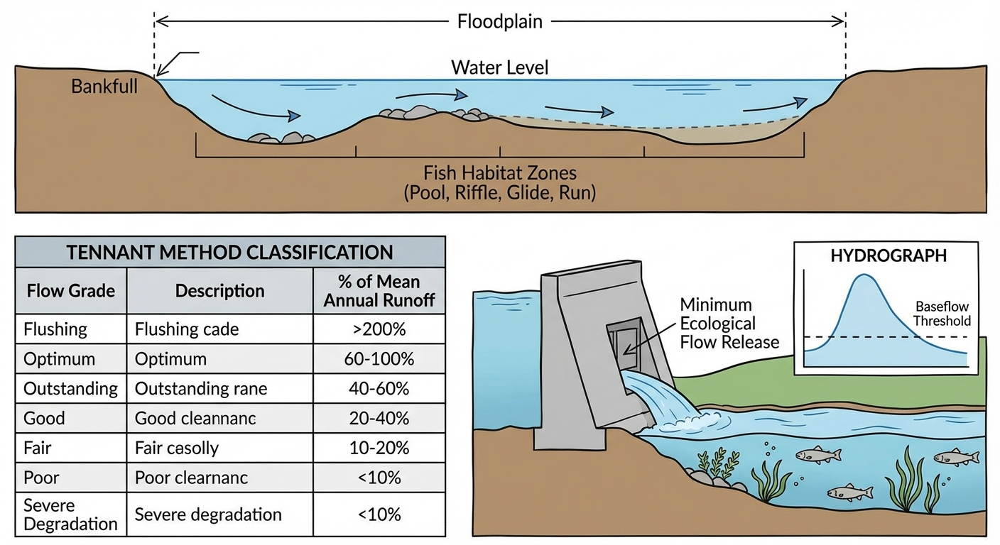
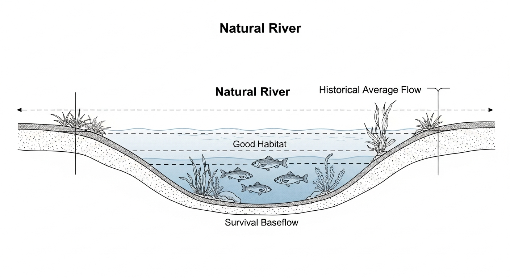
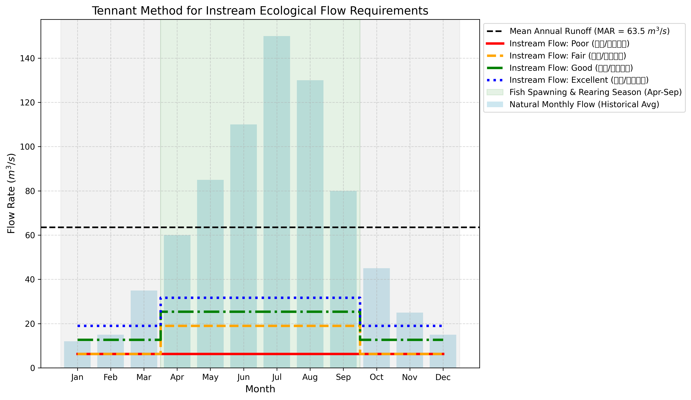

# 第 1 章：生态水力学概论与河流基流底线

## 1. 学习目标
本章探讨水利工程从“纯粹的工程控制”向“生态友好型调度”的范式转变。当水坝截断了河流，需要向大自然偿还多少水，才能保证生态系统的存活？
读者需要掌握：
1. 生态水力学（Ecohydraulics）的跨学科内涵。
2. 河流生态基流（Ecological Baseflow / Instream Flow）的概念与意义。
3. 水文学方法中的经典：Tennant 法（Montana 法）的核心参数设定。
4. 鱼类产卵期与一般用水期的生境水动力学需求差异。

## 2. 教材理论：水坝必须给大自然留多少水？
在传统的《明渠水力学》和《水系统控制论》中，目标较为功利：如何用最小的能量，把最多的水送到人类的城市和农田。
但真实世界的河流不是下水管道。它是鱼类、底栖生物和水生植物的家园。当在河道上修建拦河大坝并把水抽走时，下游河道就会干涸。

为了防止河流生态系统遭受严重破坏，环保法规强制要求：**大坝必须无条件地向下游下泄一定比例的水，这笔”不能动用的自然资产”，被称为生态基流（Instream Ecological Flow）。**

那么，这笔账该怎么算？下泄多了，城市缺水、水力发电亏钱；下泄少了，鱼死河干。
目前国际上最著名、应用最广泛的水文学计算方法是 **Tennant 法（又称 Montana 法）**，由 D.L. Tennant 在 1976 年提出。

### 2.1 Tennant 法的完整分级体系

**Tennant 法的哲学是”尊重历史”：**
它不去研究复杂的鱼类游泳力学，而是直接统计这条河流建坝前”天然状态下的多年平均月流量（Mean Annual Runoff, MAR）”。
然后，它简洁而有效地划定了红线。Tennant（1976）基于对美国西部数百条河流的实地调查，建立了一套完整的生态流量分级体系，其完整分级表如下：

**表1-1 Tennant法完整生态流量分级标准**

| 生态等级 | 英文描述 | 产卵期(4-9月) %MAR | 一般期(10-3月) %MAR | 河道形态特征 |
|:---------|:---------|:------------------:|:-------------------:|:-------------|
| 冲刷洪水 | Flushing Flow | 200% | — | 河床冲刷更新，输移细颗粒泥沙 |
| 最佳范围 | Optimum Range | 60%~100% | 60%~100% | 河道几何形态完全保持，生境多样性最大 |
| 优秀 | Outstanding | 60% | 40% | 水深、流速满足绝大多数物种需求 |
| 极好 | Excellent | 50% | 30% | 河道宽度覆盖大部分可用栖息地 |
| 良好 | Good | 40% | 20% | 水深和流速能很好满足水生生物需求 |
| 一般/退化 | Fair/Degrading | 30% | 10% | 栖息地面积显著减少，物种多样性下降 |
| 差/最低 | Poor/Minimum | 10% | 10% | 河流处于极度恶劣的生存边缘 |
| 严重退化 | Severe Degradation | <10% | <10% | 河床大面积裸露，多数物种无法存活 |

从该表可以提炼出工程设计中最常用的四个等级：
- **生存底线 (Poor)**：如果下泄流量只有 MAR 的 $10\%$，河流将处于极度恶劣的生存边缘，仅能维持鱼类基本生存。
- **基本维持 (Fair)**：下泄 $30\%$。
- **良好生境 (Good)**：下泄 $40\%$，此时河道的水深、流速能很好地满足大多数水生生物的需求。
- **最佳生境 (Excellent)**：下泄 $50\%$ 以上。

值得特别注意的是，Tennant法中还包含一个常被忽视的”冲刷洪水（Flushing Flow）”等级，要求在特定时段下泄高达 $200\%$ MAR 的流量。这一要求的物理意义在于：河床需要周期性的高流量冲刷来输移细颗粒泥沙、清除藻类附生物、重塑河道微地形。没有这种周期性”清洗”，河床将逐渐被淤泥覆盖，底栖生物的间隙空间被堵塞，鱼卵的孵化基质丧失。

**季节的差异（时空非平稳性）**：
鱼类并不总需要那么大的水。Tennant 法将一年分为两个截然不同的时期：
- **一般用水期（10月 ~ 次年3月）**：鱼类在越冬，新陈代谢慢，只需要较低的底线水量（例如 $10\% \sim 20\%$ MAR）。
- **产卵育肥期（4月 ~ 9月）**：鱼类需要洄游产卵，卵需要急流冲刷提供高溶氧，此时必须下泄巨大的生态洪峰（例如 $30\% \sim 50\%$ MAR）。

### 2.2 水文频率分析法

Tennant法虽然简便，但它假设所有河流的生态需求与MAR之间具有相同的百分比关系，这显然是一种过度简化。水文频率分析法（Hydrological Frequency Analysis）则通过概率统计框架，从长系列实测水文资料中提取不同保证率下的流量值，为生态基流的设定提供更坚实的数学基础。

水文频率分析的核心是对年最小月均流量序列（或最枯7日流量序列）进行概率分布拟合。在中国水文学实践中，最常用的分布函数是皮尔逊III型分布（P-III型分布），其概率密度函数为：

$$
f(x) = \frac{\beta^\alpha}{\Gamma(\alpha)} (x - a_0)^{\alpha - 1} e^{-\beta(x - a_0)} \tag{1.1}
$$

其中 $\alpha$ 为形状参数，$\beta$ 为尺度参数，$a_0$ 为位置参数，$\Gamma(\alpha)$ 为Gamma函数。这三个参数可通过矩法或适线法从实测数据中估计。

设计保证率（频率）$P$ 下的生态基流 $Q_P$ 定义为：

$$
P(Q \leq Q_P) = \int_{a_0}^{Q_P} f(x) \, dx = P\% \tag{1.2}
$$

在工程实践中，通常取 $P = 90\%$ 保证率下的最枯月均流量作为生态基流的设计值。其物理含义为：在长期统计意义上，有 $90\%$ 的年份，该月的天然流量不会低于此值。换言之，生态基流被设定在一个"自然界本身也很少低于"的水平上，从而避免人为设定过高导致工程不可行。

保证率曲线（频率曲线）的绘制过程如下：将 $n$ 年的年最小流量由大到小排列，第 $m$ 位的经验频率按数学期望公式计算：

$$
P_m = \frac{m}{n + 1} \times 100\% \tag{1.3}
$$

然后在概率坐标纸上绘制散点，用P-III型理论曲线拟合，即可查读任意保证率对应的流量值。

### 2.3 IHA水文变异指标法

Richter等（1996）提出的**水文变异指标法（Indicators of Hydrologic Alteration, IHA）**从另一个角度审视生态基流问题。IHA的核心思想是：不仅关注流量的绝对大小，更关注流量过程的"变异程度"。它定义了33个水文指标（分属5组），用于量化大坝建设前后河流流态的变化程度：

**表1-2 IHA五组水文变异指标**

| 组别 | 指标内容 | 指标数量 | 生态意义 |
|:-----|:---------|:--------:|:---------|
| 第1组 | 各月月均流量 | 12 | 栖息地可用性的季节变化基准 |
| 第2组 | 年极值流量（1/3/7/30/90日最大最小） | 12 | 极端水文事件对生物的压力和机遇 |
| 第3组 | 年极值出现时间 | 2 | 生物生活史事件（产卵、迁徙）的时间同步 |
| 第4组 | 高/低脉冲频率与持续时间 | 4 | 洪水扰动频率及干旱胁迫持续期 |
| 第5组 | 流量变化率与逆转次数 | 3 | 水位涨落速度对河岸带生物的影响 |

IHA分析的核心度量是**水文变异度（Degree of Hydrologic Alteration, DHA）**：

$$
DHA_j = \frac{|O_j - E_j|}{E_j} \times 100\% \tag{1.4}
$$

其中 $O_j$ 为第 $j$ 个指标的建坝后观测值，$E_j$ 为建坝前该指标的期望值（通常取中位数）。$DHA > 33\%$ 即认为该水文特征受到显著改变。

IHA方法的优势在于它能够识别Tennant法无法捕捉的生态风险。例如，即使平均流量满足了Tennant法的"良好"等级，但如果洪峰出现时间从历史的7月提前到了5月（因为水库预泄），那么IHA第3组指标就会发出警报——鱼类的产卵季节与洪峰信号不再同步，繁殖成功率将急剧下降。

### 2.4 生态基流与CHS目标函数的关系

在水系统控制论（CHS）的理论框架中，六元受控系统 $\Sigma = (P, A, S, D, C, O)$ 的目标函数 $O$ 包含多个层次的控制目标。生态基流在其中扮演着**不可逾越的硬约束**角色。

设水库下游某控制断面的实时流量为 $Q_{ds}(t)$，生态基流下限为 $Q_{eco}$，则在CHS的约束管理框架中，生态基流约束表达为：

$$
Q_{ds}(t) \geq Q_{eco}(t), \quad \forall t \in [0, T] \tag{1.5}
$$

注意这里 $Q_{eco}(t)$ 是时变的——正如Tennant法所揭示的，产卵期和一般期的生态需水存在显著差异。在CHS的分层分布式控制（HDC）架构中，该约束被分配到不同层级：

- **L0安全层（PLC级，毫秒响应）**：当传感器检测到 $Q_{ds} < Q_{eco}$ 时，立即触发闸门强制开启指令，无需等待上层优化器的计算结果。这是生态安全的最后一道防线。
- **L2协调层（DMPC级，分钟-小时）**：将 $Q_{ds}(t) \geq Q_{eco}(t)$ 作为模型预测控制的硬约束纳入二次规划（QP）求解器，确保预测时域内的调度方案不会突破生态底线。
- **L3计划层（日-年）**：在长期调度优化中，将IHA的33个指标作为软约束或罚函数项，引导水库群的蓄泄策略尽可能保持天然流态的统计特征。

这种分层约束管理机制体现了CHS八原理中**鲁棒性原理（P5）**的核心思想：关键安全约束必须在最底层实现硬件级锁定，不依赖于上层软件的正常运行。

## 3. 案例分析：理论与实践的桥梁（典型北半球河流生态基流 Tennant 测算）

### 案例背景
某水电开发公司准备在北方某山区河流修建一座装机容量巨大的水电站。公司为了追求利益最大化，向环保局提交的环评报告中，提议“全年按 $6.5 m^3/s$ 下泄生态基流”。
环保部门为了审查该方案是否合法，委托你利用天然水文站过去 30 年的历史数据，使用 Tennant 法重新核定该河流在不同季节的生态保护红线，并客观评估水电公司方案的合理性。

### 问题描述
- **历史水文数据**：已知该河天然平均月流量为：1月 $12m^3/s$，3月 $35m^3/s$，6月 $110m^3/s$，7月 $150m^3/s$（汛期），10月 $45m^3/s$。
- **Tennant 标准体系**：
  - 产卵期（4月~9月）：极差 $10\%$ MAR，一般 $30\%$ MAR，良好 $40\%$ MAR，优秀 $50\%$ MAR。
  - 一般期（10月~3月）：极差 $10\%$ MAR，一般 $10\%$ MAR，良好 $20\%$ MAR，优秀 $30\%$ MAR。
- **任务**：计算该河流的 MAR，推演全年 12 个月的不同等级生境下泄标准，并判定水电公司方案属于什么级别。

**物理场景与问题概化图 (Generated via Nano-Banana-Pro)：**

### 解题思路
这是一个典型的时间序列统计算法：
1. **基准计算**：对 12 个月的天然流量数据求算术平均值，得出关键的多年平均流量（MAR）。
2. **时序切割**：编写程序将 1 到 12 月切分为两个不同的动力学时期（产卵期 4-9 月，一般期 10-3 月）。
3. **阶梯矩阵生成**：利用字典结构（Dictionary）和系数矩阵，分别计算“极差、一般、良好、优秀”四个维度的全年月度下泄量阵列。
4. **可视化对比**：将天然流量与四大生境红线叠加在同一张阶梯图（Step Plot）中，直观揭示生态需水的季节脉动。

### 代码与仿真
> **学习提示**：本案例通过水文统计算法执行了长序列的处理。注意图表中生态基流在四月份发生的“断崖式跳升”，这是为了模拟春季汛期对鱼卵的冲刷唤醒效应。

Source: `assets/ch01/ch01_tennant_method.py`

**Tennant 法多等级生态基流时序追踪矩阵：**
| Month   |   Natural Flow (m³/s) |   Min Survival Baseflow (Poor) |   Good Habitat Baseflow (Good) |   Ideal Habitat Baseflow (Excellent) |
|:--------|----------------------:|-------------------------------:|-------------------------------:|-------------------------------------:|
| Jan     |                    12 |                            6.4 |                           12.7 |                                 19   |
| Feb     |                    15 |                            6.4 |                           12.7 |                                 19   |
| Mar     |                    35 |                            6.4 |                           12.7 |                                 19   |
| Apr     |                    60 |                            6.4 |                           25.4 |                                 31.8 |
| May     |                    85 |                            6.4 |                           25.4 |                                 31.8 |
| Jun     |                   110 |                            6.4 |                           25.4 |                                 31.8 |
| Jul     |                   150 |                            6.4 |                           25.4 |                                 31.8 |
| Aug     |                   130 |                            6.4 |                           25.4 |                                 31.8 |
| Sep     |                    80 |                            6.4 |                           25.4 |                                 31.8 |
| Oct     |                    45 |                            6.4 |                           12.7 |                                 19   |
| Nov     |                    25 |                            6.4 |                           12.7 |                                 19   |
| Dec     |                    15 |                            6.4 |                           12.7 |                                 19   |

**天然历史径流与多阶生境保护红线对比图：**

### 结果分析
通过底层数据的精算，大自然的账本被算得清清楚楚：
- **天然径流本底**：算法计算出，该河流的多年平均流量（MAR）为 **$63.6 m^3/s$**。这个数值是评判一切后续生态标准的唯一基石（见图表黑色虚线）。
- **水电公司方案的评价**：水电公司在环评中承诺的”全年 $6.5 m^3/s$”下泄量，经过模型比对发现，它恰好等于 MAR 的 $10\%$（即 $6.4 m^3/s$）。在 Tennant 法的定义中，这属于 **Poor（极差 / 生存底线）** 级别。这意味着水电公司想一年 365 天都把河流逼在枯竭崩溃的边缘。
- **产卵期的无情撕裂**：看表格的 4月份（Apr）。对于天然流量（$60 m^3/s$）而言，河流正在经历春汛。如果在此时想为鱼类提供一个“良好生境（Good Habitat）”，下泄量必须被强行抬升至 $25.4 m^3/s$（MAR的 $40\%$）。此时水电公司的区区 $6.5 m^3/s$ 甚至连河床的乱石都淹没不了，洄游鱼类将在这里大面积死亡绝育。
- **反常的水力倒挂**：注意图表最右侧的 1 月和 12 月（隆冬）。天然流量仅为 $12 \sim 15 m^3/s$。如果你是一个不懂水力学的环保主义者，非要在这个时候要求水电站执行“最佳生境（Excellent）”的 $19.0 m^3/s$ 下泄标准，这就不合理了。因为在枯水期，天然河道里根本就没有那么多水。这就是单纯水文学方法（Tennant法）的盲区。

### 工业部署建议
1. **动态环评的法律强制化**：现代大型水利枢纽（如三峡工程）已经彻底抛弃了”全年固定下泄量”的落后做法。调度 PLC 中必须写入时序逻辑，在春夏季（汛期）强制拉高下泄指令值。如果水电站为了多发电而少放水，环保部的数字孪生系统会直接触发”生态红线越界”报警，自动进行巨额罚款。
2. **水文学方法的致命局限**：Tennant 法简便实用，但它**完全忽略了河流真实的几何形状（宽窄、深浅）**。同样是 $10 m^3/s$ 的流量，在 V 型峡谷中流速极快水很深（鱼能活），但在平原宽浅河道中可能水深不到 1 厘米（鱼被晒死）。因此，真正的工业级生态评估必须进入下一章：利用一维/二维水动力学方程进行”栖息地流速/水深映射（如 PHABSIM 模型）”。
3. **多方法交叉验证的工程实践**：在实际的环境影响评价中，单一方法的结论往往不被评审专家接受。工程咨询单位通常需要同时采用Tennant法、水文频率分析法（$Q_{90\%}$ 或 $Q_{95\%}$）和IHA法进行交叉验证。三种方法的计算结果取包络线（即每个月取三种方法中的最大值）作为最终推荐的生态基流过程，以确保评估结果的保守性和可靠性。

**表1-3 三种生态基流评估方法的适用性对比**

| 对比维度 | Tennant法 | 水文频率分析法 | IHA法 |
|:---------|:----------|:--------------|:------|
| 数据需求 | 多年月均流量 | 长系列日流量（$\geq$20年） | 建坝前后各$\geq$20年日流量 |
| 输出形式 | MAR百分比 | 指定保证率下的流量值 | 33个水文变异指标 |
| 物理机制 | 无（纯统计经验） | 概率统计 | 生态-水文耦合统计 |
| 是否考虑季节变化 | 是（两季分区） | 可按月分别分析 | 是（全面捕捉流态特征） |
| 是否考虑河道形态 | 否 | 否 | 部分（通过流量变化率间接反映） |
| 计算复杂度 | 极低 | 中等 | 较高 |
| 适用阶段 | 规划预可研 | 可研至初设 | 环境影响后评价 |

## 本章小结
1. 生态基流是维持河流生态系统健康的最低流量需求，是水资源调度中不可逾越的刚性约束。生态基流的确定需要兼顾水生生物的栖息需求、河道形态的维持需求和水质自净的稀释需求。
2. Tennant法基于多年平均流量的百分比划分生态等级，从"严重退化"（$<10\%$ MAR）到"最佳范围"（$60\%\sim100\%$ MAR）共设8个等级。该方法简单实用、数据需求低，适用于规划预可研阶段，但缺乏对河道物理形态和生物学机制的考量。
3. 水文频率分析法基于P-III型分布拟合长系列水文资料，通过保证率曲线确定不同时段的生态需水量。$Q_{90\%}$ 保证率的设计值在工程中应用最广，其物理含义明确、统计基础扎实。
4. IHA水文变异指标法通过33个指标全面量化大坝建设对河流流态的改变程度，能够识别流量大小之外的时间节律、变化速率等关键生态信息。
5. 生态基流在CHS理论中对应目标函数 $O$ 中的硬约束条件，在分层分布式控制架构的L0安全层实现硬件级锁定，任何控制策略都不得突破。

## 思考题
1. 某河流多年平均流量为 $50 \, \text{m}^3/\text{s}$，按Tennant法计算”良好”等级（40%）和”极差”等级（10%）对应的生态基流值。
2. 比较Tennant法与水文频率分析法的优缺点。在什么工程场景下应优先选用哪种方法？
3. 如果上游新建水库导致河流天然流量过程被显著改变，Tennant法的适用性会受到怎样的影响？请从方法假设出发进行分析。

## 参考文献
[1] Tennant, D.L. (1976). Instream flow regimens for fish, wildlife, recreation and related environmental resources [J]. *Fisheries*, 1(4): 6-10.
[2] Poff, N.L., Allan, J.D., Bain, M.B., et al. (1997). The natural flow regime: a paradigm for river conservation and restoration [J]. *BioScience*, 47(11): 769-784.
[3] Arthington, A.H. (2012). *Environmental Flows: Saving Rivers in the Third Millennium* [M]. University of California Press.
[4] 雷晓辉, 龙岩, 许慧敏, 等. 水系统控制论：提出背景、技术框架与研究范式 [J]. 南水北调与水利科技(中英文), 2025, 23(04): 761-769+904. DOI: 10.13476/j.cnki.nsbdqk.2025.0077.
[5] Richter, B.D., Baumgartner, J.V., Powell, J., et al. (1996). A method for assessing hydrologic alteration within ecosystems [J]. *Conservation Biology*, 10(4): 1163-1174.
