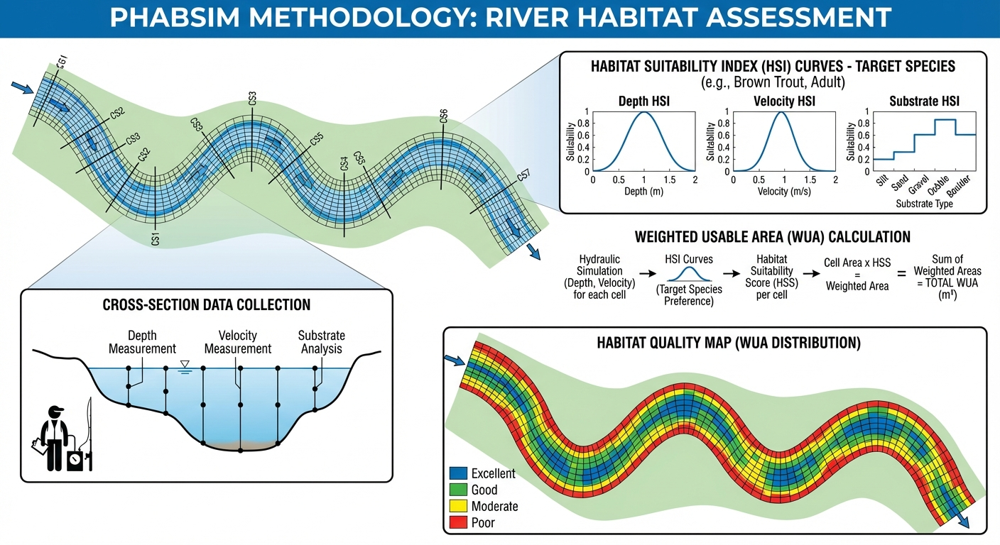
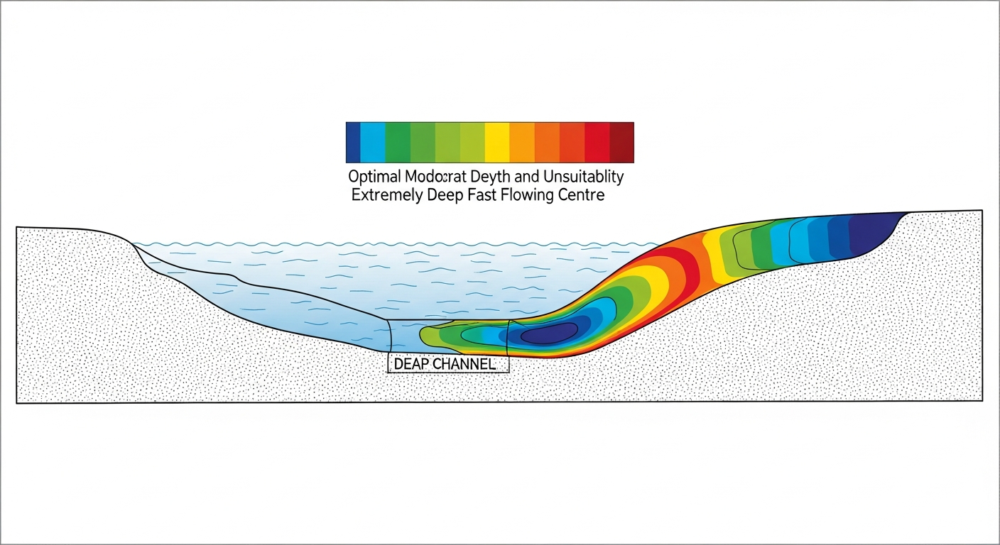
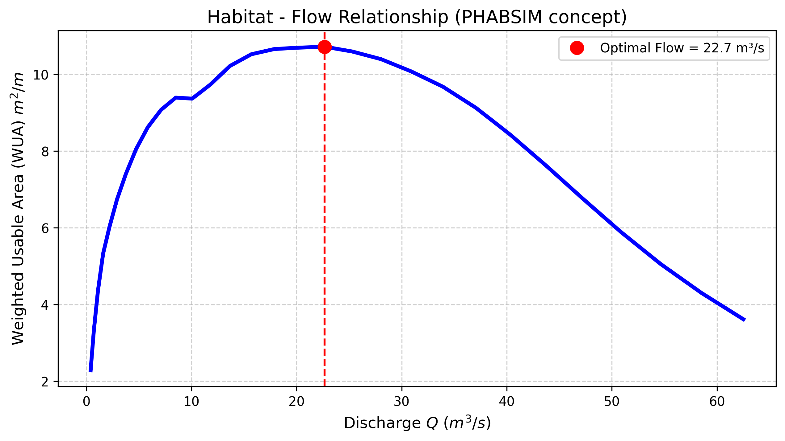
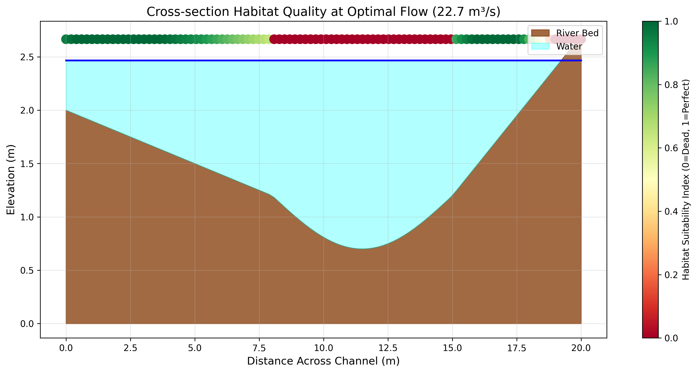

# 第 2 章：物理栖息地模拟：水动力学与生物学的联姻

## 1. 学习目标
本章打破单纯水文学（如 Tennant 法）的局限，探讨如何利用一维/二维水动力学模型精确刻画河流的几何形态，并将其映射为鱼类的生存指数。
读者需要掌握：
1. 物理栖息地模拟系统（PHABSIM）的核心架构。
2. 栖息地适宜性指数（Habitat Suitability Index, HSI）的构建方法（流速、水深）。
3. 加权可用面积（Weighted Usable Area, WUA）作为生态护栏指标的计算。
4. “水越大越好”这一生态谬误的流体力学证伪。

## 2. 教材理论：鱼喜欢的并不是“流量”
在第一章的 Tennant 法中，第一章简单地认为大坝下泄的流量（$m^3/s$）越大，鱼就活得越好。这是水文工作者的视角。
但从鱼的角度来看，它根本不知道什么是流量。它只能感知到自己身体周围的两个物理量：**水深（Depth）和 流速（Velocity）**。
- 如果水太浅（$<0.2m$），鱼会暴露在鸟类的视线中被吃掉，或者背鳍露出水面被晒死。
- 如果水太深（$>2.0m$），底层可能因为阳光穿透不足而缺乏藻类食物，且水温过低。
- 如果流速太慢（死水），水中溶氧极低，且鱼卵无法孵化。
- 如果流速太快（$>1.2 m/s$），鱼为了停留在原地必须耗尽全部体力，最终力竭被冲走。

所以，鱼喜欢的是**“不深不浅，不快不慢”**的特定物理微环境。
而同样是 $20 m^3/s$ 的流量，在一个狭窄的 V 型峡谷里，它意味着流速 $3m/s$ 的死亡洪流；但流到了宽阔的平原浅滩，它又变成了流速 $0.2m/s$ 的静谧深潭。
这就暴露了纯水文算法的局限性，必须引入河流的真实地形截面。

美国鱼类和野生动物管理局开发的 **PHABSIM (Physical Habitat Simulation System)** 是这个领域应用最广泛的主导工具。
它的运行逻辑如下：
1. **水动力引擎**：给定一个流量 $Q$，算出这个横截面上每一个网格点（微生境）的局部水深 $d_i$ 和局部流速 $v_i$。
2. **生物学打分**：查阅生物学家给出的适宜性曲线，计算该点水深得分 $HSI_d$ 和流速得分 $HSI_v$。
3. **几何平均**：得出该网格的综合生存质量 $HSI_i = \sqrt{HSI_d \times HSI_v}$（得分在 0 到 1 之间）。
4. **面积折算**：把每个网格的物理面积乘以它的质量得分，全断面累加，就得到了大名鼎鼎的**加权可用面积（WUA）**。

### 2.1 WUA 计算的完整数学表达

WUA 的严格数学定义如下。将河段划分为 $N$ 个计算单元（网格），每个单元的面积为 $A_i$，则：

$$
WUA = \sum_{i=1}^{N} A_i \cdot CSI_i \tag{2.1}
$$

其中 $CSI_i$ 为第 $i$ 个单元的**复合适宜性指数（Composite Suitability Index）**，由多个栖息地因子的适宜性指数复合而成：

$$
CSI_i = f(v_i) \cdot f(d_i) \cdot f(s_i) \tag{2.2}
$$

这里 $f(v_i)$ 为流速适宜性函数，$f(d_i)$ 为水深适宜性函数，$f(s_i)$ 为底质适宜性函数。三个因子均取值于 $[0, 1]$ 区间。当某一因子为0时（例如流速超过致死阈值），无论其他因子多好，该单元的 $CSI_i$ 直接归零。这种乘法结构体现了生态学中”木桶效应”的基本原理——决定物种存活的是最差的那个因子。

在实际计算中，如果仅考虑流速和水深两个主导因子（底质信息不可获取时），$CSI$ 常采用几何平均形式：

$$
CSI_i = \sqrt{f(v_i) \cdot f(d_i)} \tag{2.3}
$$

几何平均相比于算术平均，能更敏感地反映任一因子的退化：当 $f(v_i) = 0.01$, $f(d_i) = 1.0$ 时，算术平均给出 $0.505$（似乎还不错），但几何平均仅给出 $0.1$（正确反映了该单元的恶劣状况）。

### 2.2 HSI 曲线的构建方法

适宜性指数（Habitat Suitability Index, HSI）曲线是 PHABSIM 方法的生物学核心，其质量直接决定了整个分析的可靠性。HSI 曲线的构建通常遵循以下科学流程：

**第一步：现场生物采样**。在目标河段布设多个采样断面，使用电鱼法、网捕法或水下观测记录目标鱼种的实际栖息位置。在每个鱼类出现点，同步测量局部水深 $d$、平均流速 $v$ 和底质粒径 $s$。

**第二步：频率分析**。统计所有观测点的水深、流速和底质数据，按等距分组计算频率直方图。高频率区间对应鱼类偏好的物理条件范围。

**第三步：标准化处理**。将频率直方图除以河段内该物理变量的自然可用频率（Available Habitat），消除采样偏差。然后将最大值归一化到 $1.0$，得到标准的HSI曲线：

$$
HSI(x) = \frac{U(x) / A(x)}{\max[U(x) / A(x)]} \tag{2.4}
$$

其中 $U(x)$ 为鱼类在物理变量值 $x$ 处的使用频率，$A(x)$ 为该值在河段中的自然可用频率。

**表2-1 典型冷水鱼种（成年鳟鱼）HSI曲线特征值**

| 物理变量 | 致死下限 | 适宜范围 | 最优值 | 致死上限 |
|:---------|:--------:|:--------:|:------:|:--------:|
| 水深 $d$ (m) | $<0.1$ | $0.3\sim1.2$ | $0.6$ | $>2.5$ |
| 流速 $v$ (m/s) | $<0.05$ | $0.2\sim0.8$ | $0.4$ | $>1.5$ |
| 底质粒径 $s$ (mm) | $<2$（细砂） | $16\sim128$ | $64$（卵石） | $>256$（巨砾） |

### 2.3 曼宁公式在一维水力学模拟中的应用

PHABSIM 的水力学引擎需要根据给定流量 $Q$ 计算每个横截面网格点的局部水深和流速。在一维稳态均匀流假设下，这一计算的核心工具是曼宁公式：

$$
v_i = \frac{1}{n_i} R_i^{2/3} S_0^{1/2} \tag{2.5}
$$

其中 $v_i$ 为第 $i$ 个分条的断面平均流速（m/s），$n_i$ 为该分条的曼宁糙率系数，$R_i = A_i / P_i$ 为水力半径（$A_i$ 为过水面积，$P_i$ 为湿周长度），$S_0$ 为河床纵坡。

对于横截面被划分为 $M$ 个分条的情况，总流量通过断面积分获得：

$$
Q = \sum_{i=1}^{M} v_i \cdot A_i = \sum_{i=1}^{M} \frac{1}{n_i} R_i^{2/3} S_0^{1/2} \cdot A_i \tag{2.6}
$$

给定目标流量 $Q$，需要通过迭代法（如二分法或Newton-Raphson法）求解水面高程 WSE，使得式(2.6)的计算流量与目标流量相等。每一个水面高程对应一组唯一的 $(d_i, v_i)$ 分布，进而通过HSI曲线映射得到该流量下的WUA值。

### 2.4 WUA-Q 关系曲线的物理解释

当对一系列流量值逐一执行上述计算流程后，就可以绘制出WUA随流量变化的关系曲线。这条曲线几乎总是呈现出一个**倒U型（抛物线型）**的特征形状，其物理解释如下：

- **上升段（低流量区）**：随着流量增加，水面覆盖更多河床面积，原本干露的浅滩被水淹没，可用栖息地面积扩大。同时水深从致死的极浅值进入适宜范围，$f(d_i)$ 快速上升。
- **峰值区（最优流量）**：在某一特定流量 $Q^*$ 处，水深和流速在最大数量的网格单元中同时落入适宜范围，$CSI$ 值的空间积分达到最大。此即**生态最优流量**。
- **下降段（高流量区）**：流量继续增大后，深槽区流速突破致死上限（$f(v_i) \to 0$），同时水深超过适宜上限（$f(d_i) \to 0$）。虽然浅滩区可能仍然适宜，但深槽区大面积”死亡”导致总WUA急剧下降。

这一倒U型特征是反驳”水越多越好”这一朴素直觉的有力证据。它为水库调度提供了一个明确的定量依据：生态最优下泄流量 $Q^*$ 是WUA-Q曲线的极值点，可通过求解 $dWUA/dQ = 0$ 精确确定。

WUA 就是大坝调度人员最终要考核的”生态 KPI”。

## 3. 案例分析：理论与实践的桥梁（自然河道 WUA-Q 关系曲线的反直觉推演）

### 案例背景
某河流包含复杂的横截面地形：左侧是长满杂草的缓坡浅滩，中间是布满卵石的深槽，右侧是陡峭的石岸。
该河流是某种濒危成年鳟鱼的产卵地。生物学家指出：这种鳟鱼最喜欢的水深是 $0.5 \sim 1.0m$，最喜欢的流速是 $0.3 \sim 0.7 m/s$。
环保组织要求水库在繁殖期开闸放水，并且认为“开得越大越好”。作为系统工程师，你需要建立 PHABSIM 仿真模型，扫描从 $1m$ 到 $3.5m$ 的所有水位（流量从极小到极大），计算出对应的 WUA。你必须找出**最能最大化鱼类栖息地面积的“最优流量”**，并用数据告诉环保组织：洪水对鱼类同样是致命的。

### 问题描述
- **河道地形**：宽 $20m$。$x \in [0,8]$ 为浅滩（高程 $2.0 \sim 1.2m$，糙率 $0.04$）；$x \in [8,15]$ 为深槽（最深处高程 $0.7m$，糙率 $0.03$）。底坡 $S_0 = 0.001$。
- **适宜性曲线**：
  - 水深 HSI：$0 \sim 0.1m$ 死亡(0)；$0.5 \sim 1.0m$ 最佳(1.0)；$>2.0m$ 死亡(0)。
  - 流速 HSI：$0.3 \sim 0.7m/s$ 最佳(1.0)；$>1.2m/s$ 死亡(0)。
- **任务**：求解 WUA 与流量 $Q$ 的非线性关系曲线，找出系统极值点，并绘制最优流量下的横截面生态质量热力图。

**物理场景与问题概化图 (Generated via Nano-Banana-Pro)：**

### 解题思路
本研究构建了一个微缩版的 1D 物理栖息地模拟器：
1. **水力学网格化**：将横截面切分为 100 个微积分条（$\Delta x$）。
2. **水面抬升扫描**：设定一系列水面绝对高程（WSE）。对于每一个 WSE，利用局部曼宁公式计算出每个微条内的水深和流速。
3. **生物映射与积分**：将物理数据喂给 `hsi_depth` 和 `hsi_velocity` 函数进行惩罚打分，得到几何平均 $HSI$ 后进行全截面面积积分。
4. **寻优与抛物线拟合**：提取 WUA 序列的最高峰值，输出对应的黄金最优流量（Optimal Flow）。

### 代码与仿真
> **学习提示**：本案例硬编码了水力学曼宁分条法与生物学适应性曲线的交叉验证算法。注意看 WUA-Q 曲线的抛物线形状，它是反驳盲目增加生态基流的利器。

Source: `assets/ch02/ch02_habitat_model.py`

**流量激增与栖息地面积存亡追踪矩阵：**
|   Water Surface Elev (m) |   River Discharge Q (m³/s) |   Weighted Usable Area WUA | Habitat Rating   |
|-------------------------:|---------------------------:|---------------------------:|:-----------------|
|                     1.43 |                       2.92 |                       6.74 | Fair             |
|                     1.86 |                       8.5  |                       9.39 | Fair             |
|                     2.47 |                      22.68 |                      10.72 | Optimal          |
|                     2.72 |                      30.91 |                      10.08 | Fair             |
|                     3.41 |                      58.53 |                       4.3  | Poor             |

**加权可用面积（WUA）随流量衰减的反直觉曲线：**

**最优流量下（$Q \approx 22.7 m^3/s$）的横截面生境质量评级剖面：**

### 结果分析
PHABSIM 引擎清晰地揭示了水动力与生态之间的微妙平衡：
- **“水越大越好”的破产**：看图表 `wua_flow_curve.png` 和数据矩阵。当流量从干旱的 $2.92 m^3/s$ 涨到 $22.68 m^3/s$ 时，WUA 从 $6.74 m^2$ 增加到了峰值 $10.72 m^2$。此时水面覆盖了深槽并漫上了浅滩，为鱼类提供了广阔的空间。然而，当流量继续增大到 $58.53 m^3/s$（水位涨至 $3.41m$）时，WUA 反而急剧下降，锐减至仅 $4.3 m^2$。
- **流体力学死区（Velocity Death Zone）**：为什么洪水期鱼反而没地方待了？观察横截面图，在极高水位下，中间的深槽区域因为水深超过了 $2.0m$（底层缺乏阳光且水流冲力过猛，局部流速飙升突破了死亡线 $1.2 m/s$），导致该区域的 $HSI$ 直接归零。本来是鱼类乐园的中心深槽，在洪水中变成了高风险区。
- **浅滩的救赎**：看 `cross_section_habitat.png` 中散点图的颜色（红色代表极差，绿色代表完美）。在最优流量（$22.7 m^3/s$）下，中间深槽的流速恰到好处，呈现高度适宜的深绿色。而如果是大洪水期间，深槽会全部变成红色，鱼类只能被迫退缩到左侧狭窄的 $x \in [0,5]$ 浅滩缓坡区域（由于水浅摩擦力大，这里的流速勉强没有超过致死线）勉强维持生存。
- **从WUA到调度指令的转化逻辑**：本案例的WUA-Q曲线峰值出现在 $Q^* \approx 22.7 \, m^3/s$ 处。在实际工程中，这一数值将被写入水库调度规程的生态条款，成为繁殖期下泄流量的"推荐值"。但需要注意的是，WUA峰值附近曲线较为平坦（$Q \in [18, 28] \, m^3/s$ 范围内WUA均保持在峰值的$90\%$以上），这意味着调度员拥有一定的操作裕度——不必精确到小数点，而是在这个"生态安全带"内灵活调配，兼顾发电和供水需求。这种"宽容带"的量化识别，对于平衡多目标冲突具有重要的工程实用价值。

### 工业部署建议
1. **精准调度的生态妥协**：本案例证明，水库调度并非放水越多越环保。对于这个断面，最佳下泄流量就是精准的 **$22.7 m^3/s$**。多了浪费发电水头且杀鱼，少了水深不够也杀鱼。这种基于 WUA 曲线找极值点的方法，是现代水利枢纽（如白鹤滩、溪洛渡）制定生态流量泄放准则的重要依据。
2. **生境修复的土木工程学**：如果一条渠道被修成了光秃秃的”U型水泥渠”，由于各处水深和流速完全一样，在洪水期整条河都会变成致死流速，导致 WUA 直接归零。现代生态修复（Eco-restoration）的土木做法是：故意在河道里扔大石头、挖深坑、造浅滩，人为制造多样化的地形（Heterogeneity）。这样无论流量怎么变，鱼类总能在某个旮旯角落里找到流速和水深都符合 $HSI$ 要求的微型避风港。
3. **PHABSIM的不确定性管理**：在工程应用中必须清醒认识到，PHABSIM的输出精度高度依赖于三个环节的数据质量：（a）河道地形测量的精度——高分辨率多波束声呐扫描可将地形误差控制在厘米级，但成本高昂；（b）曼宁糙率的率定——糙率值的$\pm 20\%$变化可导致流速计算结果$\pm 15\%$的偏差；（c）HSI曲线的代表性——基于少量样本（$<50$个观测点）建立的HSI曲线可能无法反映鱼类行为的种群差异和季节变化。因此，工程实践中通常需要进行**敏感性分析**：分别将糙率和HSI曲线在合理范围内扰动，考察WUA-Q关系曲线的变化幅度，以此评估最终建议值的可信区间。

**表2-2 PHABSIM方法主要不确定性来源及其影响量级**

| 不确定性来源 | 典型变化范围 | 对WUA的影响 | 控制措施 |
|:-------------|:------------|:-----------|:---------|
| 河道地形测量误差 | $\pm 0.1$~$0.3$ m | $\pm 10\%$~$20\%$ | 多波束声呐+RTK-GPS |
| 曼宁糙率估计 | $\pm 20\%$ | $\pm 15\%$~$25\%$ | 实测水面线率定 |
| HSI曲线样本量 | $n < 50$ vs $n > 200$ | $\pm 20\%$~$40\%$ | 多年多季节持续采样 |
| 一维稳态假设偏差 | — | $\pm 5\%$~$15\%$ | 升级为二维非恒定流模型 |

## 本章小结
1. PHABSIM方法将一维水力学模拟（曼宁公式）与生物适宜度指数（HSI）相结合，通过逐网格计算复合适宜性指数 $CSI$，量化栖息地面积随流量的非线性变化关系。
2. 加权可用面积 $WUA = \sum A_i \cdot CSI_i$ 是评估不同流量方案生态效果的核心指标。WUA-Q关系曲线呈倒U型，其极值点对应生态最优流量，这一发现有力地证伪了"水越多越好"的朴素认知。
3. HSI曲线的构建遵循"现场采样-频率分析-可用性校正-标准化"的科学流程，其质量直接决定了PHABSIM输出的可靠性。基于不足50个样本建立的HSI曲线可能导致WUA估计的$\pm 40\%$偏差。
4. 曼宁公式是PHABSIM水力学引擎的数学基础，通过分条积分将给定流量转化为横截面上的水深-流速分布。糙率系数的合理率定是保证水力学计算精度的前提。
5. 栖息地模拟结果可直接作为水库生态调度的目标函数或约束条件输入。在CHS的分层分布式控制框架中，WUA最大化可作为L2协调层DMPC优化器的生态目标项。

### PHABSIM方法与Tennant法的互补关系

从方法论角度审视，第1章的Tennant法和本章的PHABSIM方法并非替代关系，而是在不同精度层次上的互补工具。Tennant法可以在几分钟内完成计算，适用于区域尺度的初筛；而PHABSIM需要数周的野外测量和数天的模拟计算，但能给出空间分辨率达到米级的栖息地评价结果。在完整的环境影响评价流程中，通常先用Tennant法快速圈定候选河段和初始流量范围，再对重点河段部署PHABSIM进行精细化分析。两种方法的结论如果出现显著分歧，则需要追溯原因——往往是因为河道形态特殊（如极宽浅或极窄深），导致流量百分比与实际水深流速之间的对应关系偏离了Tennant法的统计经验基础。

## 思考题
1. 某河段长 $500 \, \text{m}$，宽 $20 \, \text{m}$，均匀划分为50个计算单元。当流量为 $Q = 15 \, \text{m}^3/\text{s}$ 时，各单元水深和流速已知。请写出WUA的计算公式，并说明HSI如何影响最终结果。
2. 为什么PHABSIM方法对HSI曲线的质量高度敏感？如果HSI曲线基于少量样本建立，可能导致什么问题？
3. 比较PHABSIM与纯水文学方法（如Tennant法）在生态基流评估中的优劣。

## 参考文献
[1] Bovee, K.D. (1982). A guide to stream habitat analysis using the Instream Flow Incremental Methodology [R]. *USFWS Biological Services Program*, FWS/OBS-82/26.
[2] Stalnaker, C., Lamb, B.L., Henriksen, J., et al. (1995). The Instream Flow Incremental Methodology: A primer for IFIM [R]. *US Geological Survey*, Biological Report 29.
[3] Jowett, I.G. (1997). Instream flow methods: a comparison of approaches [J]. *Regulated Rivers: Research & Management*, 13(2): 115-127.
[4] 雷晓辉, 苏承国, 龙岩, 等. 基于无人驾驶理念的下一代自主运行智慧水网架构与关键技术 [J]. 南水北调与水利科技(中英文), 2025, 23(04): 778-786. DOI: 10.13476/j.cnki.nsbdqk.2025.0079.
[5] Waddle, T. (2001). PHABSIM for Windows: User's Manual and Exercises [R]. *US Geological Survey*, Open-File Report 2001-340.
