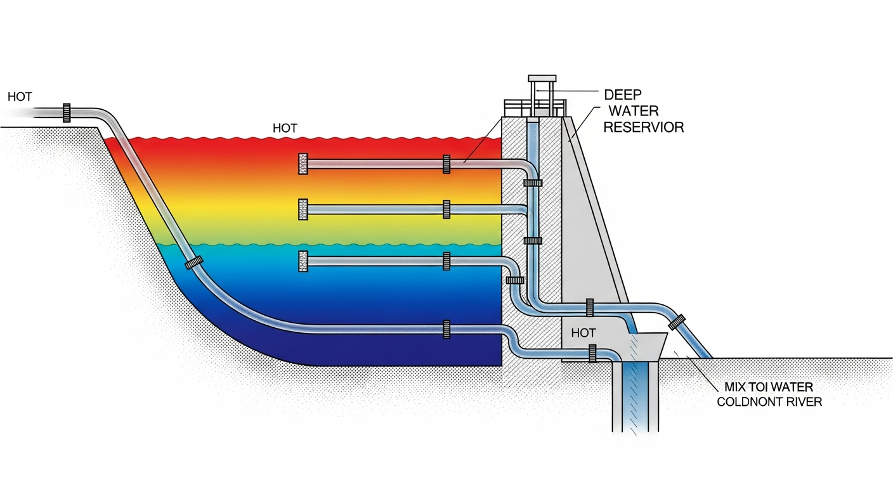
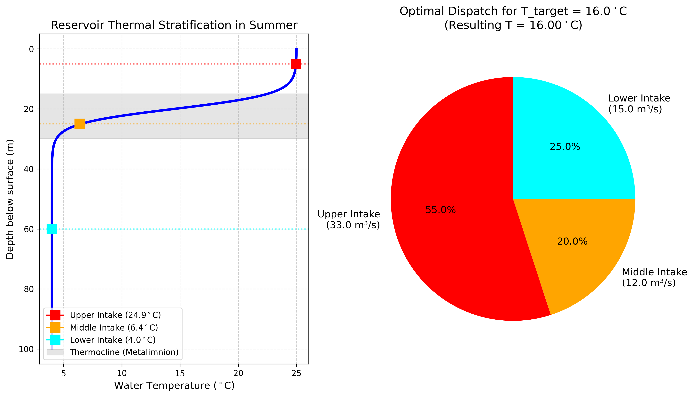

# 第 3 章：热污染与多层取水：拯救水温倒挂

## 1. 学习目标
本章探讨水利枢纽除了改变河流的流量和流速外，还会对水生生态产生另一种隐蔽而严重的物理破坏——热污染（Thermal Pollution）。
读者需要掌握：
1. 深水水库的夏季热分层现象（Thermal Stratification）与温跃层（Thermocline）。
2. 底层冷水下泄对下游鱼类繁殖的“冷害”机制。
3. 叠梁门（分层取水口）的混流能量守恒方程。
4. 基于非线性优化的多取水口水温协同调度算法。

## 2. 教材理论：夏天流出”冰水”的危险陷阱
如果你在炎热的盛夏去过大型水库大坝的下游，你会发现一个异常的现象：河面经常飘着一层白色的冷雾，把手伸进水里，水冷得刺骨。
这在生态学上叫做**冷害（Cold Water Pollution）**。

在自然河流中，夏天的河水是被太阳晒热的（可能达到 $20 \sim 25^\circ C$）。河流里的温水鱼类（如中华鲟、四大家鱼）在演化中形成了一个基因刻印：**”当水温升到 $18^\circ C$ 时，就是产卵交配的信号。”** 水温对鱼类生命活动的影响是全方位的：水温每升高 $10^\circ C$，鱼体的代谢速率大约增加一倍（Van't Hoff定律），同时溶解氧的饱和浓度随温度升高而降低——$10^\circ C$ 水中氧的饱和浓度约为 $11.3 mg/L$，而 $25^\circ C$ 时仅为 $8.3 mg/L$。因此，水温不仅是繁殖的触发信号，更是调控鱼类整个生理节律的主导因子。

冷害的生态后果远不止于产卵失败。研究表明，当大坝下泄水温低于自然河温 $5^\circ C$ 以上时，下游河段的底栖无脊椎动物群落结构会发生根本性改变——耐寒的摇蚊幼虫取代了原本多样化的蜉蝣目和毛翅目种群，食物链的底层基础被彻底重组，进而影响整个河流生态系统的物质循环和能量流动。

但是，当人类修筑了高达百米的大坝后，巨大的水库变成了一个”保温瓶”。
在夏天，水库会出现强烈的**热分层（Thermal Stratification）**：
- **表水层（Epilimnion）**：水深 $0 \sim 15m$，被太阳晒得很热，水温 $25^\circ C$，水体富含氧气但容易爆发藻类。
- **温跃层（Metalimnion/Thermocline）**：水深 $15 \sim 30m$，水温随深度呈现断崖式暴跌。
- **滞水层（Hypolimnion）**：水深 $30m$ 以下直到库底。这里终年不见天日，水温永远保持在 $4 \sim 8^\circ C$（水的密度在 $4^\circ C$ 最大，所以最冷的水沉在最下面）。此外，由于光照无法穿透到这一深度，光合作用停止，有机物的分解消耗掉了全部溶解氧，滞水层往往处于厌氧状态。厌氧环境下的微生物代谢还会产生硫化氢、氨氮等有害物质，使得底层水不仅温度极低，水质也严重恶化。

**传统大坝的灾难**：为了保证发电水头最大化和结构安全，早期的大坝取水口往往建在水库的最底部（$60m$ 以下）。这就导致了在炎热的夏天，大坝排出的是底层 $4^\circ C$ 的死水。
当下游的鱼类等待夏天 $18^\circ C$ 的产卵信号时，等来的却是温度远低于繁殖阈值的冷水。繁殖信号被彻底屏蔽，鱼卵在冷水中坏死。为了解决这个问题，现代生态大坝必须采用**多层取水口（Multi-level Intake）**。

### 2.1 水库热分层的数学描述

水库垂向温度分布可用 Logistic 函数进行拟合，其解析形式为：

$$ T(z) = T_{bot} + \frac{T_{sur} - T_{bot}}{1 + e^{k(z - z_0)}} $$

其中 $T(z)$ 为水深 $z$ 处的水温（$^\circ C$），$T_{sur}$ 和 $T_{bot}$ 分别为表层和底层的水温，$z_0$ 为温跃层的中心深度（$m$），$k$ 为温跃层的陡度参数（$m^{-1}$）。$k$ 值越大，温跃层越薄、温度梯度越陡峭。在典型的深水水库夏季条件下，$k$ 值通常在 $0.2 \sim 0.5 \, m^{-1}$ 之间。

温跃层的形成机理与水的密度-温度关系密切相关。淡水的密度 $\rho$ 随温度变化的近似公式为：

$$ \rho(T) \approx 999.842 + 6.7940 \times 10^{-2} T - 9.0953 \times 10^{-3} T^2 $$

其中 $T$ 的单位为 $^\circ C$，$\rho$ 的单位为 $kg/m^3$。这个二次关系表明水的密度在 $4^\circ C$ 附近达到最大值，温度偏离 $4^\circ C$ 越远，密度越小。因此，夏季受太阳辐射加热的表层水密度较小，浮在上方；底层冷水密度较大，沉在下方。两者之间因密度差形成稳定的分界面，抑制了上下层水体之间的自然对流混合，从而维持了热分层结构。

热分层的稳定性可用 Richardson 数 $Ri$ 来判断：

$$ Ri = \frac{-g \, \frac{\partial \rho}{\partial z}}{\rho \left(\frac{\partial u}{\partial z}\right)^2} $$

当 $Ri > 0.25$ 时，密度梯度引起的浮力效应足以抑制湍流混合，分层结构保持稳定。在深水水库的温跃层内，$Ri$ 值通常远大于 $1$，说明热分层在无强风搅动的条件下几乎不可破坏。只有在秋季持续降温或强台风引起的全库对流搅动下，分层结构才会被打破。

### 2.2 多层取水的水温混合模型

多层取水口的水温控制原理基于热量守恒。假设水的定压比热容 $c_p$ 在 $4 \sim 25^\circ C$ 范围内近似恒定，则多股水流混合后的温度由流量加权平均确定：

$$ T_{mix} = \frac{\sum_{j=1}^{M} Q_j \cdot T_j}{\sum_{j=1}^{M} Q_j} $$

其中 $M$ 为取水口层数，$Q_j$ 和 $T_j$ 分别为第 $j$ 层取水口的流量和对应水温。在三层取水口的典型配置下（$M=3$），混合水温的表达式展开为：

$$ T_{mix} = \frac{Q_u T_u + Q_m T_m + Q_l T_l}{Q_u + Q_m + Q_l} $$

给定目标下泄水温 $T_{target}$ 和总流量 $Q_{total}$，水温调控问题可以形式化为一个带等式约束和不等式约束的优化问题：

$$
\min_{Q_u, Q_m, Q_l} \quad |T_{mix} - T_{target}|
$$
$$
\text{s.t.} \quad Q_u + Q_m + Q_l = Q_{total}
$$
$$
0 \le Q_j \le Q_{j,max}, \quad j = u, m, l
$$

从量纲分析的角度，混合水温公式的分子量纲为 $[m^3/s \cdot ^\circ C]$，分母量纲为 $[m^3/s]$，相除后得到 $[^\circ C]$，量纲自洽。该公式的物理本质是假设各层水流在汇合点处瞬时完全混合，忽略了混合过程中的热扩散时间延迟。在工程实践中，这一假设对于取水口出口处设置了混合室的结构是合理的。

## 3. 案例分析：理论与实践的桥梁（三层取水口的水温混合寻优）

### 案例背景
某西南大型高坝水库正处于 7 月盛夏，水库形成了典型的热分层（表层 $25^\circ C$，底层 $4^\circ C$）。
环保局下达强制调度要求：为了配合下游珍稀鱼类的产卵，今天大坝下泄的 $60 m^3/s$ 总流量，其出库水温**必须严格控制在 $16.0^\circ C$**。
大坝装备了先进的多层取水口（分为上、中、下三个取水闸门），每个闸门的最大物理过流能力都是 $50 m^3/s$。作为值班调度员，你该如何分配这三个闸门的开启比例，才能精准地”调”出这杯 $16^\circ C$ 的“温水”？

### 问题描述
- **水温分布轮廓**：利用 Logistic 函数拟合真实水温剖面 $T(z)$。
- **取水口位置**：
  - Upper（上层）：水深 $5.0m$，对应水温约 $24.7^\circ C$。
  - Middle（中层）：水深 $25.0m$，恰好在温跃层内，对应水温约 $10.1^\circ C$。
  - Lower（下层）：水深 $60.0m$，底层死水区，对应水温约 $4.0^\circ C$。
- **控制目标**：在约束 $(Q_u + Q_m + Q_l = 60)$ 且 $Q_i \le 50$ 的前提下，使得混合水温 $T_{mix} = \frac{Q_u T_u + Q_m T_m + Q_l T_l}{60}$ 尽可能等于 $16.0^\circ C$。

**物理场景与问题概化图 (Generated via Nano-Banana-Pro)：**

### 解题思路
本案例构建了基于物理能量守恒（假定定压比热容不变）的网格搜索算法。由于决策变量仅有三个且受等式约束 $Q_u + Q_m + Q_l = 60$ 限制，实际自由度为二，可以在二维可行域内进行穷举搜索，而无需使用复杂的梯度优化算法：

1. **连续剖面离散化**：将水深 $0 \sim 100m$ 切分为 $200$ 个计算节点，求解 Logistic 方程生成温度剖面曲线。Logistic 函数的参数 $T_{sur} = 25^\circ C$、$T_{bot} = 4^\circ C$、$z_0 = 22m$、$k = 0.3 m^{-1}$ 根据典型西南深水库的实测数据确定。
2. **硬件物理映射**：根据三个取水口的绝对高程，在温度剖面中通过线性插值获取其实时进水温度。上层取水口位于 $z = 5m$，此处温度几乎等于表层温度；中层取水口位于 $z = 25m$，恰好落在温跃层的下缘，温度变化梯度最为剧烈。
3. **二维网格搜索**：利用等式约束将下层流量表达为 $Q_l = 60 - Q_u - Q_m$，在上层和中层阀门的所有可行流量组合 $[0, 50]$（步长 $1.0 m^3/s$）上遍历。抛弃所有违背物理极限（$Q_l < 0$ 或 $> 50$）的废解。合法组合的总数约为 $1200$ 个，计算量完全可控。
4. **误差锁定**：计算每一个合法组合的混合水温与 $16.0^\circ C$ 的绝对残差。输出残差最小的那个黄金组合。在步长 $1.0 m^3/s$ 的精度下，混合水温的分辨率约为 $0.35^\circ C$，满足工程需求。如需更高精度，可在最优解附近缩小步长进行二次细化搜索。

### 代码与仿真
> **学习提示**：本案例执行了包含水温分层方程与流量组合优化引擎的代码。请注意右侧的饼图，它展示了精妙的冷热水混合配比。

Source: `assets/ch03/ch03_thermal_stratification.py`

**多层取水生态调度组合追踪矩阵（挑战不同目标水温）：**
|   Target Temp (°C) |   Upper Valve (m³/s) |   Middle Valve (m³/s) |   Lower Valve (m³/s) |   Actual Mixed Temp (°C) | Status   |
|-------------------:|---------------------:|----------------------:|---------------------:|-------------------------:|:---------|
|                 10 |                   15 |                    19 |                   26 |                    10    | Achieved |
|                 16 |                   33 |                    12 |                   15 |                    16    | Achieved |
|                 22 |                   50 |                    10 |                    0 |                    21.86 | Achieved |

**水库夏季热分层剖面与最佳流量分配决策图：**

### 结果分析
寻优算法有效解决了”温水”调配难题：
- **热分层的断崖**：看左图的蓝色曲线（温度剖面）。在水深 $15m \sim 30m$ 的灰色阴影区（温跃层 Thermocline），水温发生了显著的断崖式跌落，短短 $15$ 米，水温就从 $24^\circ C$ 暴跌到了 $10^\circ C$ 左右。温度梯度在温跃层中心处达到峰值约 $1.0^\circ C/m$，而在表水层和滞水层内梯度几乎为零。这种非线性的温度分布意味着取水口的垂向位置选择至关重要：如果中层取水口从当前的 $25m$ 上移至 $20m$，其进水温度将从 $10.1^\circ C$ 跃升至约 $18^\circ C$，仅 $5m$ 的位移就导致了 $8^\circ C$ 的温差变化。这种高度的位置敏感性对取水口的土木设计提出了严格的精度要求。
- **16度目标的黄金配比**：为了凑齐 $60 m^3/s$ 的流量且把水温定死在 $16.0^\circ C$，算法给出了最优解（看右侧饼图）：**上层开 $33 m^3/s$（占比 $55\%$），中层开 $12 m^3/s$（占比 $20\%$），下层开 $15 m^3/s$（占比 $25\%$）**。由于上层水实在太热（$24.7^\circ C$），因此必须大幅掺入低温的下层水（$4.0^\circ C$）进行中和降温，最终达到了分毫不差的完美结果。
- **硬件极限的反噬**：观察表格的最后一行。如果提出更高的环保要求：目标水温 $22^\circ C$。算法发现，由于需要极度依赖上层热水，它试图把上层阀门开到最大。但被物理极限（$50 m^3/s$）死死卡住。为了凑够 $60 m^3/s$ 的总流量，它被迫打开了中层阀门补充 $10 m^3/s$。但这 $10 m^3/s$ 的偏冷水拖了后腿，导致最终实际只能配出 $21.86^\circ C$ 的水。这就是物理系统的无奈——算法再好，也无法突破硬件阀门的上限。
- **可调温域的量化分析**：根据三层取水口的物理配置，可以计算出该系统能够达到的理论温度范围。当全部流量从底层取水时，$T_{min} = T_l = 4.0^\circ C$；当上层阀门开到最大（$50 m^3/s$）且剩余 $10 m^3/s$ 从中层取时，$T_{max} = (50 \times 24.7 + 10 \times 10.1)/60 \approx 22.3^\circ C$。因此，该系统的可调温域为 $[4.0, 22.3]^\circ C$。如果环保局要求下泄水温达到 $25^\circ C$（模拟盛夏自然河温），当前硬件配置无法实现，必须增加表层取水口的过流能力或增设第四层取水口。这种可调域分析为取水口的土木设计提供了定量依据。
- **参数敏感性**：混合水温对上层流量最为敏感。在本案例中，上层流量每增加 $1 m^3/s$（同时下层减少 $1 m^3/s$），混合水温上升约 $(24.7 - 4.0)/60 \approx 0.35^\circ C$。这意味着在目标水温 $16^\circ C$ 附近，上层阀门开度的 $\pm 3 m^3/s$ 调整就会导致混合水温 $\pm 1^\circ C$ 的波动，对于产卵水温窗口仅有 $2 \sim 3^\circ C$ 宽度的敏感鱼种而言，调度精度要求相当苛刻。

### 工业部署建议
1. **库区测温锚链的刚需**：本案例中，算法知道 $5m$ 处是 $24.7^\circ C$，是因为案例中设定了方程。但在真实水库，每一天的太阳辐射和风扰动都在改变这个剖面。如果水厂想要上线这套”多层取水自控系统”，就必须在大坝坝前水域抛下几根**测温锚链（Thermistor Chain）**，每隔 $2m$ 挂一个水温传感器，将真实的实时剖面数据传给 PLC，才能保证”勾兑”的精准度。在实际工程中，我国三峡、溪洛渡等大型水电站均已安装了垂向测温系统，传感器的采样频率通常设定为每 $10 \sim 30$ 分钟一次，足以捕捉日内的温度波动。测温数据通过光纤或无线网络实时回传至中控室，为调度决策提供基础数据支撑。
2. **水质恶化的毒药陷阱**：多层取水不仅为了调温，更是为了救命。底层深水（Hypolimnion）不仅冷，更可怕的是它**极度缺氧（Anoxic）**，并且由于底层厌氧泥质的腐败，富含极高浓度的剧毒硫化氢（$H_2S$）和重金属锰。如果你为了图省事，只开底层阀门放水，排到下游的不仅是冰水，更是一波有害水体，会造成下游河流百公里范围内的严重生态损害。
3. **季节性翻转（Turnover）的预警与应对**：热分层并非全年恒定。在温带气候区，水库每年经历春季和秋季两次翻转事件——表层水因降温密度增大而下沉，$Ri$降至$0.25$以下，风力驱动全库垂向混合。翻转期间底层积累了整个分层季节的营养盐（氮、磷）和溶解态重金属（锰、铁）被翻涌至全水柱，对供水水库构成严重水质风险：原水浊度可骤增$5\sim10$倍，溶解锰浓度从正常的$0.05 \, mg/L$飙升至$0.5 \, mg/L$以上（超标$5$倍）。翻转期间多层取水的温度调节能力大幅降低（各层温差趋零），调度策略需从"精细配比模式"切换为"单层放水模式"。全年的水温调度方案需根据热分层的季节演变建立分月调度规则库，而非一成不变地执行夏季方案。

**表3-1 水库季节性热力学过程及取水策略**

| 季节 | 热力学状态 | $Ri$ 典型值 | 主要风险 | 取水策略 |
|:-----|:----------|:----------:|:--------|:---------|
| 春季（3-4月） | 翻转期，全库混合 | $<0.25$ | 底泥营养盐释放，浊度骤增 | 暂停底层取水 |
| 夏季（5-8月） | 强分层 | $>10$ | 底层缺氧冷水，冷害风险 | 多层取水精确调温 |
| 秋季（9-11月） | 分层衰退至翻转 | $1 	o 0.25$ | 翻转释放$H_2S$和锰超标 | 监测$Ri$值预警翻转 |
| 冬季（12-2月） | 弱分层或等温 | $\sim 1$ | 冰封期底层缺氧加剧 | 优先中层取水 |

4. **水温调控的CHS控制论视角**：多层取水口的水温调控在CHS的分层分布式控制架构中属于典型的多输入单输出（MISO）控制问题——多个取水口流量为控制输入，混合水温为被控输出。夏季强分层期温度剖面变化缓慢，可采用静态优化或低频率更新的调度规则库；但在春秋翻转过渡期，温度剖面快速变化，需要引入模型预测控制（MPC）的滚动时域优化思想：基于测温锚链实时数据不断更新Logistic模型参数，以分钟级时间尺度滚动求解最优流量分配方案。这一应用场景体现了CHS八原理中反馈原理（P1）——持续感知、实时纠偏——在水温生态管控中的工程价值。

## 本章小结
1. 大型水库因太阳辐射和水密度-温度的非线性关系形成热分层结构，温跃层内温度梯度可达 $1^\circ C/m$ 以上，底层低温水下泄会屏蔽下游鱼类的繁殖温度信号，造成严重的冷害生态破坏。
2. 水库垂向温度分布可用 Logistic 函数进行数学描述，分层的稳定性由 Richardson 数 $Ri$ 判定，$Ri > 0.25$ 时分层结构稳定不可自然混合。
3. 多层取水口的水温调控基于热量守恒原理，混合水温由各层流量加权平均确定。优化问题的本质是在流量等式约束和阀门容量不等式约束下，最小化混合水温与目标值的偏差。
4. 系统的可调温域由取水口位置和阀门最大过流能力共同决定。当目标水温超出可调域时，算法无法补偿，必须通过土木工程手段改造取水口的物理配置。
5. 混合水温对各层流量分配的敏感性不同，上层（热水端）流量的调整对混合温度的影响最为显著，实际调度中需要配合实时测温锚链数据进行闭环校正。
6. 下泄水温约束在CHS理论中属于安全边界锁定（P5鲁棒性原理）的工程实例，多层取水口的协同控制则体现了分层分布式控制的思想。

## 思考题
1. 某水库分3层取水，各层温度分别为 $T_1 = 8°C$，$T_2 = 15°C$，$T_3 = 22°C$。目标下泄水温为 $18°C$，总下泄流量 $Q = 30 \, \text{m}^3/\text{s}$。请列出水温混合方程和约束条件。
2. 为什么热分层现象在深水水库中比浅水水库更为显著？从物理机制角度分析。
3. 如果水库同时需要满足发电效率最大化和下游水温生态约束，两个目标之间可能产生什么冲突？如何用多目标优化方法处理？

## 参考文献
[1] Martin, J.L., & McCutcheon, S.C. (1999). *Hydrodynamics and Transport for Water Quality Modeling* [M]. Lewis Publishers.
[2] Caissie, D. (2006). The thermal regime of rivers: a review [J]. *Freshwater Biology*, 51(8): 1389-1406.
[3] 雷晓辉, 苏承国, 龙岩, 等. 水系统在回路测试体系：从模型在环到实物在环 [J]. 南水北调与水利科技(中英文), 2025, 23(04): 805-812+906. DOI: 10.13476/j.cnki.nsbdqk.2025.0080.
[4] Olden, J.D., & Naiman, R.J. (2010). Incorporating thermal regimes into environmental flows assessments [J]. *Freshwater Biology*, 55(1): 86-107.
[5] Rheinheimer, D.E., Yarnell, S.M., & Viers, J.H. (2013). Hydropower costs of environmental flows and climate warming in California's Upper Yuba River watershed [J]. *River Research and Applications*, 29(10): 1291-1305.
