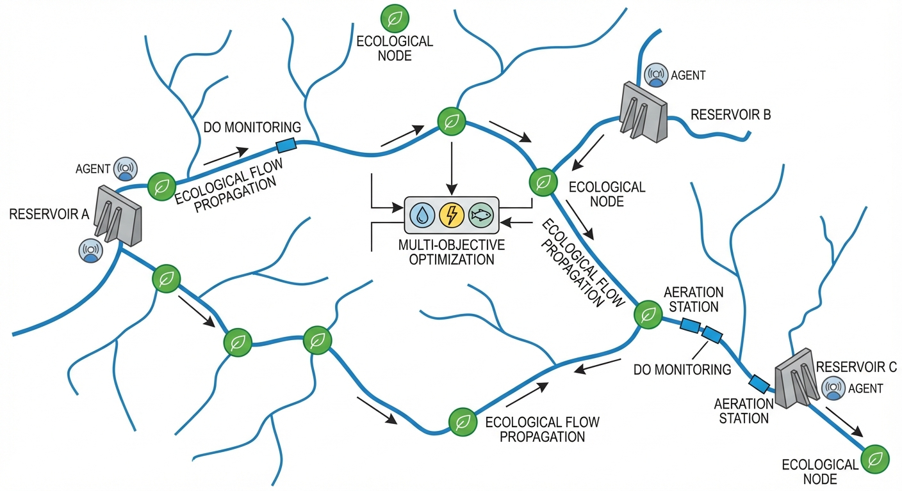
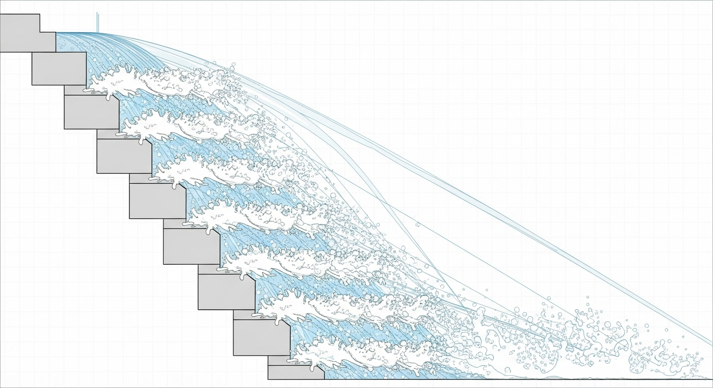
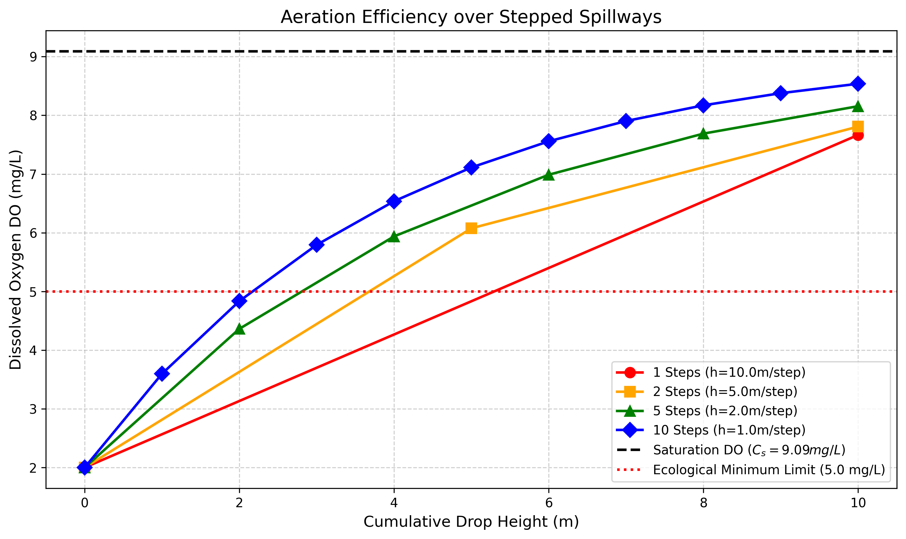

# 第 4 章：气体传递模型：阶梯溢洪道的生命之氧

## 1. 学习目标
本章探讨水力学与环境化学的交叉领域——气液传质动力学。当大坝排出严重缺氧的水体时，如何利用水利工程自身的结构，将其转化为天然的“巨型制氧机”。
读者需要掌握：
1. 水体溶解氧（Dissolved Oxygen, DO）的气液相平衡与饱和浓度定理。
2. 跌水曝气（Aeration Drop）的物理机制（射流破裂与空气卷吸）。
3. 曝气效率（Aeration Efficiency, E）的经验模型计算。
4. 阶梯式溢洪道（Stepped Spillway）在生态修复中的降维打击。

## 2. 教材理论：给窒息的河流做人工呼吸
上一章已指出，深水库的底层滞水层不仅水温极低，而且**严重缺氧（DO 接近于 0 mg/L）**。
鱼类和绝大多数底栖生物的生存红线是 $DO > 5.0 mg/L$。如果底层水不加处理直接排入下游，将导致下游长达数十公里的河段成为“无氧死亡带”。

那么，怎么给这种千万吨级的水体增氧？用工业气泵去打气是不可能的，耗电量将是天文数字。
自然界提供了一个低成本且高效的解决方案：**跌水曝气（Aeration）**。

氧气在水中的溶解遵循亨利定律（Henry's Law）：饱和溶解氧浓度 $C_s$ 与大气中氧的分压（约 $0.21 \, atm$）成正比，同时强烈依赖于水温——温度越高，气体溶解度越低。$5^\circ C$ 时 $C_s \approx 12.8 \, mg/L$，$20^\circ C$ 时降至 $9.09 \, mg/L$，$30^\circ C$ 时仅为 $7.56 \, mg/L$。因此夏季高温条件下，水体的"氧容量"本身就较低，溶解氧管理面临更大挑战。

当水流从高处跌落，砸在下面的岩石或水面上时，两个物理过程协同驱动了氧气传递：
1. **射流破裂**：完整的水柱被撕裂成无数微小的水滴，极大地增加了水与空气的接触总表面积。若将直径 $D$ 的水柱破碎为直径 $d$ 的水滴群，总接触面积增大约 $D/d$ 倍。在典型跌水条件下，水滴直径约 $1 \sim 3 \, mm$，接触面积可增大数百倍。
2. **空气卷吸（Air Entrainment）**：水滴砸入下游水池时，会将大量的气泡砸入水下。气泡在水中上升的过程中，其内部的氧气会因为浓度差被强行压入水中。研究表明，直径小于 $2 \, mm$ 的微气泡上升速度慢、停留时间长，是跌水增氧的主要贡献者。

溶解氧的传递遵循经典动力学方程：
$$ \frac{d(DO)}{dt} = K_L a (C_s - DO) $$
其中 $C_s$ 是该温度下水的饱和溶解氧浓度（例如 $20^\circ C$ 下约为 $9.09 mg/L$）。这说明：**水越缺氧，它从空气中吸氧的速度就越快**。

在水利工程中，可将这段复杂的积分过程简化为一个宏观的**曝气效率公式**：
$$ DO_{down} = DO_{up} + E \times (C_s - DO_{up}) $$
$E$ 越大，这趟跌水“捞”回来的氧气就越多。
科学家发现，相比于让水从 $10m$ 高的大坝直接”一镜到底”地砸下去，**如果把大坝修成阶梯状（比如分成 10 个 1m 高的小台阶），水流每下两个台阶就砸起一片水花，其整体曝气效率 $E$ 将显著提升。**

### 2.1 Streeter-Phelps 模型：河流自净的经典方程

在大坝下泄的缺氧水进入下游河道后，溶解氧的恢复不仅依赖于物理曝气，还受到河流中有机污染物耗氧（BOD衰减）和大气复氧两个过程的共同控制。1925年，Streeter和Phelps在研究俄亥俄河污染问题时，建立了描述这一耦合过程的经典微分方程。

定义**氧亏（Oxygen Deficit）**为饱和浓度与实际浓度之差：$D = C_s - DO$，则Streeter-Phelps方程为：

$$
\frac{dD}{dt} = k_1 L - k_2 D \tag{4.1}
$$

其中 $k_1$ 为BOD衰减速率常数（脱氧系数，$d^{-1}$），$L$ 为剩余BOD浓度（$mg/L$），$k_2$ 为大气复氧速率常数（复氧系数，$d^{-1}$），$D$ 为氧亏值（$mg/L$）。

方程右侧的两项具有明确的物理意义：$k_1 L$ 代表有机物分解消耗氧气的速率（使氧亏增大），$k_2 D$ 代表大气向水体补充氧气的速率（使氧亏减小）。当耗氧速率大于复氧速率时，水中DO持续下降；当两者平衡时，DO达到最低点。

BOD的一阶衰减方程为：

$$
L(t) = L_0 e^{-k_1 t} \tag{4.2}
$$

将式(4.2)代入式(4.1)并求解，得到氧亏随时间变化的解析表达式：

$$
D(t) = \frac{k_1 L_0}{k_2 - k_1} \left( e^{-k_1 t} - e^{-k_2 t} \right) + D_0 e^{-k_2 t} \tag{4.3}
$$

其中 $L_0$ 为排污口处的初始BOD浓度，$D_0$ 为初始氧亏。

### 2.2 临界氧亏点：河流最危险的位置

Streeter-Phelps方程最重要的工程应用是确定**临界氧亏点**——即下游DO最低的位置，也是水生生物面临最大生存威胁的位置。对式(4.3)求导并令 $dD/dt = 0$，可以求得临界时间：

$$
t_c = \frac{1}{k_2 - k_1} \ln \left\{ \frac{k_2}{k_1} \left[ 1 - \frac{D_0 (k_2 - k_1)}{k_1 L_0} \right] \right\} \tag{4.4}
$$

将 $t_c$ 代入式(4.3)即得最大氧亏值 $D_c$。若河流平均流速为 $u$（$m/s$），则临界点距排污口的距离为 $x_c = u \cdot t_c$。

临界氧亏点的DO浓度 $DO_{min} = C_s - D_c$ 必须满足水环境功能区划的最低标准。下表列出了我国《地表水环境质量标准》（GB 3838-2002）中不同水质类别对DO的要求：

**表4-1 地表水溶解氧标准对照表**

| 水质类别 | I类 | II类 | III类 | IV类 | V类 |
|:---------|:---:|:----:|:-----:|:----:|:---:|
| DO下限 ($mg/L$) | $\geq 7.5$ | $\geq 6$ | $\geq 5$ | $\geq 3$ | $\geq 2$ |
| 适用功能 | 源头水 | 集中式饮用水源地 | 一般鱼类保护区 | 工业用水 | 农业用水 |

### 2.3 曝气效率的物理模型与影响因素

单次跌水的曝气效率 $E$ 取决于多个物理因素。Gulliver等（1990）总结了影响曝气效率的主要因子：

$$
E = 1 - \exp\left( -\frac{K_L \cdot a \cdot t_{contact}}{1} \right) \tag{4.5}
$$

其中 $K_L$ 为液膜传质系数（$m/s$），$a$ 为单位体积内气液接触面积（$m^2/m^3$），$t_{contact}$ 为水滴与空气的接触时间（$s$）。

影响曝气效率的主要物理因素包括：

**表4-2 影响跌水曝气效率的主要物理因素**

| 影响因素 | 影响机制 | 效率响应方向 |
|:---------|:---------|:------------|
| 跌落高度 $h$ | 增加接触时间和撞击速度 | $E \uparrow$，但边际效益递减 |
| 单宽流量 $q$ | 大流量时水膜厚，内部氧传递困难 | $E \downarrow$ |
| 水温 $T$ | 高温降低氧在水中的饱和浓度$C_s$，但提高$K_L$ | 综合效果：$E$ 略$\uparrow$ |
| 初始DO浓度 | 越缺氧，浓度梯度越大，传质驱动力越强 | $E \uparrow$ |
| 水中表面活性剂 | 抑制气泡合并，减小$K_L$ | $E \downarrow$（可达$30\%$以上） |

多阶跌水的总曝气效率并非各阶效率的简单求和，而是通过逐阶迭代计算。由于每一阶的出口DO都高于入口DO，下一阶面临的浓度梯度 $(C_s - DO)$ 减小，传质驱动力递减。因此，阶梯式增氧存在**边际效益递减**效应——前几阶的增氧量远大于后几阶。这也解释了为什么从5阶增加到10阶，总效率仅从$86.8\%$提升到$92.2\%$（仅增$5.4\%$），而从1阶到5阶则提升了$6.9\%$。

## 3. 案例分析：理论与实践的桥梁（阶梯式跌水堰的增氧效率仿真）

### 案例背景
某深水库需要向生态保护区下泄流量。传感器报警显示：即将下泄的库底水溶解氧浓度仅为可怜的 $2.0 mg/L$（严重缺氧）。
大坝与下游河道之间有 $10.0m$ 的绝对落差。土木工程师提出了四种溢洪道泄流方案：
- 方案 A：一镜到底（1 阶，每阶 $10m$）。
- 方案 B：修 2 个大台阶（每阶 $5m$）。
- 方案 C：修 5 个中台阶（每阶 $2m$）。
- 方案 D：修 10 个小台阶（典型的阶梯溢洪道，每阶 $1m$）。
请用气液传质模型计算这四种方案最终能把下游的溶解氧“砸”到多少？能否越过 $5.0 mg/L$ 的环保红线？

### 问题描述
- **水质本底**：水温 $20^\circ C$，饱和溶解氧 $C_s = 9.09 mg/L$。初始溶解氧 $DO_0 = 2.0 mg/L$。
- **物理模型**：总落差 $H = 10.0m$。
- **经验公式**：单阶曝气效率 $E_i = E_{base} + (1 - E_{base})(1 - e^{-k h_i})$，其中基础碰撞破裂效率 $E_{base} = 0.10$，降落传质系数 $k = 0.15 m^{-1}$。
- **任务**：遍历 1 阶、2 阶、5 阶、10 阶四种工况，输出各自的最终 DO 值及阶梯递进剖面。

**物理场景与问题概化图 (Generated via Nano-Banana-Pro)：**

### 解题思路
本研究构建了一个逐级迭代的浓度推演引擎：
1. **离散化跌水**：对于给定的总阶数 $N$，算出单阶高度 $h_{step} = 10.0 / N$。
2. **微积分累加**：写一个循环。水每走过一阶，就根据高度 $h_{step}$ 算出一个单阶效率 $E_i$。
3. **浓度重置**：然后用上一阶底部的 $DO_{out}$ 作为下一阶的 $DO_{in}$，利用公式 $DO_{out} = DO_{in} + E_i(C_s - DO_{in})$ 动态更新浓度。
4. **对比验证**：将四条路径的 DO 增长轨迹在同一张图中绘制，直观展现水面碰撞次数与总效率的正相关性。

### 代码与仿真
> **学习提示**：本案例硬编码了非线性的曝气碰撞模型。请注意，虽然单次跌落越高，单次的效率越大；但多次的小型跌落叠加起来，其总传质效率远超一次大落差的单次撞击。

Source: `assets/ch04/ch04_aeration_spillway.py`

**台阶切割战术与溶解氧恢复极限追踪矩阵：**
|   Number of Steps |   Height per Step (m) |   Initial DO (mg/L) |   Final DO (mg/L) | Total Aeration Efficiency E   | Ecological Status   |
|------------------:|----------------------:|--------------------:|------------------:|:------------------------------|:--------------------|
|                 1 |                    10 |                   2 |              7.67 | 79.9%                         | Pass                |
|                 2 |                     5 |                   2 |              7.81 | 81.9%                         | Pass                |
|                 5 |                     2 |                   2 |              8.16 | 86.8%                         | Pass                |
|                10 |                     1 |                   2 |              8.54 | 92.2%                         | Pass                |

**阶梯式溢洪道沿程溶解氧飙升仿真图：**

### 结果分析
以下是水力学”碎片化策略”的分析结果：
- **安全线越过**：好消息是，由于初始水太缺氧了（浓度梯度极大），无论哪种方案，从 $10m$ 的高空砸下来，最终的 DO 都越过了红色的 $5.0 mg/L$ 警戒线。这证明了物理跌水是消除死水厌氧的绝佳手段。
- **一镜到底的局限（单阶 $10m$）**：看图中的红色圆点线。如果水流直接从 $10m$ 高空砸下去，虽然势能巨大，但水只与空气进行了一次剧烈的碰撞摩擦，总曝气效率仅为 **$79.9\%$**，最终 DO 停留在 $7.67 mg/L$。因为水滴内部很快被氧气充满，氧气无法深入水团核心。
- **阶梯魔法的威力（10阶小步快跑）**：看图中深蓝色的菱形线。把 $10m$ 分成 10 个 $1m$ 的小台阶，水流每下一米就被硬生生”打碎”一次，重新与空气大面积接触。经历了 10 次反复的表面更新与卷吸后，虽然每次的高度不高，但总曝气效率显著提升至 **$92.2\%$**，使溶解氧达到 $8.54 mg/L$ 的高浓度（接近 $9.09$ 的物理极限）。
- **边际效益递减的定量分析**：对比四种方案的增量效率可以发现明显的递减趋势。从1阶到2阶，总效率提升了$2.0\%$（$79.9\% \to 81.9\%$），增加的阶数为1；从2阶到5阶，提升了$4.9\%$，增加的阶数为3；从5阶到10阶，提升仅$5.4\%$，增加的阶数为5。每增加一阶所带来的效率边际贡献在递减。这一现象的物理根源在于式(4.5)中的浓度梯度项 $(C_s - DO)$：随着DO逐阶升高，剩余的可吸收氧空间越来越小，每次碰撞能传递的氧量也越来越少。因此，工程设计中需要在增氧效果与建造成本之间寻找经济最优点——并非阶数越多越好。
- **与Streeter-Phelps模型的衔接**：本案例聚焦于大坝出口处的”瞬时增氧”效果。但真正需要关心的是：经过阶梯增氧后的水体，在下游河道中能维持多远的距离不跌破$5.0 \, mg/L$的生态红线？这需要用式(4.3)进行后续计算。以10阶方案的出口$DO = 8.54 \, mg/L$为初始条件，若下游存在BOD负荷为$10 \, mg/L$的面源污染输入，假设$k_1 = 0.2 \, d^{-1}$、$k_2 = 0.4 \, d^{-1}$、流速$0.5 \, m/s$，可以估算临界氧亏点距大坝约$15\sim20 \, km$处，$DO_{min} \approx 6.2 \, mg/L$，仍能满足III类水标准。但若初始DO仅为单阶方案的$7.67 \, mg/L$，则$DO_{min}$可能降至$5.3 \, mg/L$，安全裕度显著收窄。这再次印证了阶梯增氧的工程价值——它为下游水质管理争取了宝贵的缓冲空间。

### 工业部署建议
1. **消能与增氧的双赢**：现代水库大坝广泛采用”阶梯式溢洪道（Stepped Spillway）”。这不仅仅是因为它能高效补氧改善生态，更重要的是，无数个阶梯构成了显著的表面粗糙度（Macro-roughness）。水在上面滚下来的过程中，超过 $60\%$ 的高强度动能会被阶梯的摩擦力消耗掉，极大地保护了下游河床不被冲毁。这就是生态工程学最完美的”一石二鸟”。
2. **尾水闸的消力池强制曝气**：对于那些没有溢洪道，只能通过底部暗涵排冷水的大坝。必须在其出口的消力池中安装巨大的”挡水墙（Baffle Blocks）”或跳坎，人为逼迫底层水流高高跃起，形成”水跃（Hydraulic Jump）”。水跃区域剧烈的白色沸腾泡沫，是天然的最佳制氧区。
3. **Streeter-Phelps模型在大坝下游的应用**：即使大坝出口处通过阶梯溢洪道将DO恢复到了接近饱和的高水平，下游河段的DO并不一定能始终保持。如果下游存在城镇排污口或农业面源污染输入，新增的BOD负荷将再次消耗溶解氧，形成第二个氧亏谷。工程师需要使用式(4.3)对每一段河道进行分段计算：上一段的出口DO和剩余BOD作为下一段的初始条件，同时在每个排污口处叠加新的BOD输入量。这种**分段串联的Streeter-Phelps模型**，本质上就是一个沿程的状态递推过程。对于复杂的多排污口河段，可以将其编写为矩阵形式的状态空间方程进行统一求解。

**表4-3 不同曝气工程措施的效率对比**

| 工程措施 | 适用场景 | 典型曝气效率 | 投资成本 | 运行能耗 |
|:---------|:---------|:----------:|:--------:|:--------:|
| 阶梯溢洪道 | 有落差的大坝出口 | $80\%\sim95\%$ | 高（土建） | 零（利用重力） |
| 消力池水跃 | 底孔出流的大坝 | $50\%\sim70\%$ | 中（改造） | 零（利用重力） |
| 人工跌水堰 | 平原河道 | $30\%\sim60\%$ | 中 | 零 |
| 机械曝气器 | 深水湖泊/河道 | $60\%\sim85\%$ | 低 | 高（持续耗电） |
| 纯氧注入 | 应急处置 | $>90\%$ | 极高 | 极高 |

从上表可以看出，利用水力势能的被动曝气方案（前三种）在长期运行成本上具有压倒性优势，但其前提是工程现场具有足够的地形落差。对于平原地区的长距离输水工程（如南水北调东线），沿途无可利用的自然落差，当输水水质出现DO偏低时，只能依赖机械曝气或人工跌水堰进行补充增氧。

4. **DO监测与闭环控制的CHS工程实践**：在CHS的自主运行水网架构中，DO管控属于典型的分布式约束管理问题。沿河设置的在线DO传感器（如光学荧光法DO探头，精度$\pm 0.1 \, mg/L$，响应时间$<60 \, s$）构成分布式感知网络。当某一断面的DO低于预警阈值时，上游的可控闸门或曝气设备需要在分钟级时间尺度内做出响应——增大泄流量以增强跌水曝气，或启动备用的机械曝气器。这种”感知-决策-执行”的闭环逻辑，正是CHS反馈原理（P1）在水环境管控中的具体体现。

## 本章小结
1. 溶解氧（DO）是河流水质的关键指标，我国GB 3838-2002标准对不同功能水体的DO下限有明确要求，一般鱼类保护区（III类水）要求$DO \geq 5 \, mg/L$。
2. Streeter-Phelps模型通过式(4.1)描述了BOD衰减耗氧与大气复氧的耦合动力学过程，其临界氧亏点公式(4.4)是确定河流最危险断面位置的核心工具。
3. 跌水曝气效率受跌落高度、单宽流量、水温、初始DO浓度等多因素影响。阶梯式溢洪道通过增加水气接触次数和表面积，能显著提升总曝气效率，但存在边际效益递减效应。
4. 分段曝气策略（阶梯溢洪道、消力池挡水墙、人工水跃）通过在关键断面设置增氧设施，可将严重缺氧的库底水恢复至接近饱和浓度。10阶台阶方案可达$92.2\%$的总曝气效率。
5. DO管控在CHS理论中属于分布式约束管理问题：大坝出口处的DO保障是L0安全层的硬约束，下游河段的DO分布管理则属于L2协调层的空间优化范畴。

## 思考题
1. 某河段排污口下游BOD初始浓度为 $L_0 = 20 \, \text{mg/L}$，DO亏缺 $D_0 = 2 \, \text{mg/L}$。衰减系数 $k_1 = 0.3 \, \text{d}^{-1}$，复氧系数 $k_2 = 0.5 \, \text{d}^{-1}$。请用Streeter-Phelps模型的式(4.4)计算最大DO亏缺出现的时间，并结合河流平均流速 $u = 0.3 \, m/s$ 确定临界氧亏点距排污口的距离。
2. 曝气效率为什么随水深增加而提高？从气泡传质的物理过程角度解释。提示：考虑气泡在水中的停留时间和静水压力对气体溶解度的影响。
3. 如果一条河流沿程存在3个排污口，且各排污口之间有一定的自然河段间距，请说明如何用分段串联的Streeter-Phelps模型进行全河段DO分布计算。每一段的初始条件如何确定？
4. 某大坝总落差 $8 \, m$，初始 $DO_0 = 1.5 \, mg/L$，$C_s = 9.09 \, mg/L$。如果单阶曝气效率模型为 $E_i = 0.10 + 0.90(1 - e^{-0.15 h_i})$，分别计算2阶和8阶方案的最终DO值，并分析哪种方案的性价比更高。

## 参考文献
[1] Streeter, H.W., & Phelps, E.B. (1925). A study of the pollution and natural purification of the Ohio River [R]. *US Public Health Bulletin*, No. 146.
[2] Chapra, S.C. (2008). *Surface Water-Quality Modeling* [M]. Waveland Press.
[3] 雷晓辉, 许慧敏, 何中政, 等. 水资源系统分析学科展望：从静态平衡到动态控制 [J]. 南水北调与水利科技(中英文), 2025, 23(04): 770-777. DOI: 10.13476/j.cnki.nsbdqk.2025.0078.
[4] Cox, B.A. (2003). A review of dissolved oxygen modelling techniques for lowland rivers [J]. *Science of the Total Environment*, 314-316: 303-334.
[5] Ji, Z.G. (2017). *Hydrodynamics and Water Quality: Modeling Rivers, Lakes, and Estuaries* [M]. 2nd ed. Wiley.
