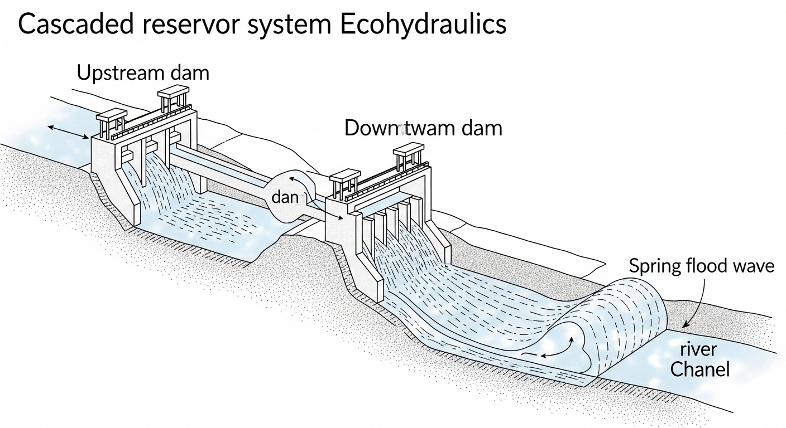
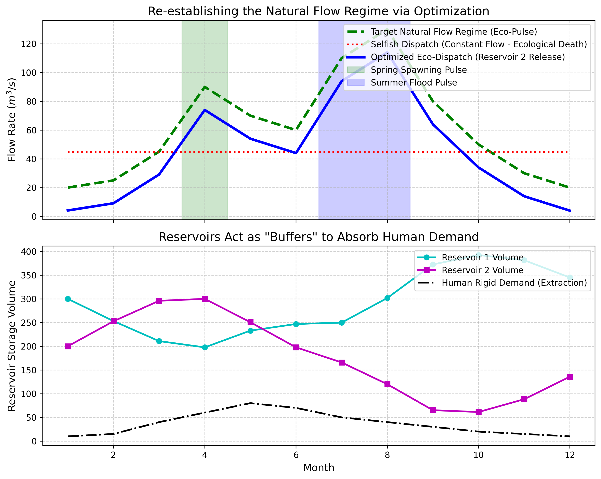

# 第 5 章：水库群生态调度：人类与自然的博弈优化

## 1. 学习目标
本章探讨在面临人类社会大量需求水资源（灌溉、工业、生活）的刚性约束下，如何通过数学优化（Optimization）手段，在多个梯级水库的调度中挤出最后一点“生态脉冲”，恢复河流的自然流态。
读者需要掌握：
1. 生态流态（Natural Flow Regime）在河流连续体（River Continuum）中的重要性。
2. 水库蓄水对自然汛期脉冲（Flood Pulse）的致命抹平效应。
3. 梯级水库群调度优化模型的目标函数（Objective Function）与物理容量约束。
4. 人类耗水与生态护流的零和博弈本质。

## 2. 教材理论：河流需要“脉搏”
在第 1 章中，Tennant 法给出了每个月需要留下的最低水量。但这远远不够。
现代生态水力学认为：**河流的灵魂在于其流量的“季节性脉冲波动”（Flow Regime）**。
- 春天，冰雪融化带来的一波涨水（春汛），是许多鱼类洄游产卵的唯一集结号。
- 夏天，暴雨带来的大洪水（夏汛），能够冲刷掉河床底部的淤泥，把沉积在滩涂上的树叶和营养物质卷入河中，喂养整个食物链。

但是，水库大坝的天职恰恰是**“削峰填谷”**。大坝的管理者（Selfish Dispatch）最喜欢把春汛和夏汛的水全部拦截在水库里，然后一年四季像自来水管一样，均匀地、平平淡淡地往下游放水（用于恒定发电或供水）。
这种“恒定流”对人类最有利，但对生态是致命的。鱼类再也等不到春汛的号角，它们停止了繁衍；河床不再被洪水冲刷，慢慢被淤泥堵死。

为了拯救河流，调度员必须设计一种**生态优化调度（Optimized Eco-Dispatch）**。
其核心思想是：利用上游一系列串联的水库群作为“海绵”，吸收人类用水量忽高忽低的扰动；同时，故意让最下游的那个水库**在春天和夏天人为制造出一波“人造洪水”**，尽可能地去模仿大自然亿万年来的脉搏。这在数学上就是一个带约束的非线性优化问题（NLP）。

### 2.1 多目标优化的数学模型

水库群生态调度的完整数学规划模型包含目标函数和约束条件两部分。设水库群由 $K$ 座串联水库组成，调度时段为 $T$ 个月，第 $k$ 座水库在第 $t$ 月的下泄量为 $R_k(t)$，则决策变量总数为 $K \times T$ 维。

**目标函数**通常包含两个相互冲突的目标：

目标一：最小化生态偏离度（与天然流态的均方差）：

$$
f_1 = \min \sum_{t=1}^{T} \left[ R_K(t) - Q_{nat}(t) \right]^2 \tag{5.1}
$$

其中 $R_K(t)$ 为最下游水库（第$K$座）在第$t$月的下泄量，$Q_{nat}(t)$ 为天然流态目标值。

目标二：最大化发电效益（或等效地最小化发电损失）：

$$
f_2 = \max \sum_{k=1}^{K} \sum_{t=1}^{T} \eta_k \cdot \rho g \cdot R_k(t) \cdot H_k(t) \cdot \Delta t \tag{5.2}
$$

其中 $\eta_k$ 为第$k$座电站的综合效率，$H_k(t)$ 为发电净水头（与水库蓄水量相关），$\Delta t$ 为时段长度。

**约束条件**包括：

水量平衡约束（对每座水库和每个时段）：

$$
V_k(t+1) = V_k(t) + I_k(t) + R_{k-1}(t) - R_k(t) - W_k(t), \quad \forall k, t \tag{5.3}
$$

其中 $V_k(t)$ 为库容，$I_k(t)$ 为区间入流，$W_k(t)$ 为人类刚性取水量。

库容约束（不得低于死库容或超过最大库容）：

$$
V_{k,min} \leq V_k(t) \leq V_{k,max}, \quad \forall k, t \tag{5.4}
$$

下泄能力约束和生态基流约束：

$$
R_{k,min}(t) \leq R_k(t) \leq R_{k,max}, \quad \forall k, t \tag{5.5}
$$

$$
R_K(t) \geq Q_{eco}(t), \quad \forall t \tag{5.6}
$$

式(5.6)中 $Q_{eco}(t)$ 为第1章确定的生态基流下限，是不可逾越的硬约束。

### 2.2 帕累托最优与NSGA-II算法

当目标函数 $f_1$ 和 $f_2$ 同时存在时，不可能找到一个方案使两个目标同时达到最优——增加生态脉冲流量必然减少可用于发电的水量。这种"鱼与熊掌不可兼得"的困境，在数学上对应**帕累托（Pareto）最优**的概念。

帕累托最优解集（Pareto Front）的定义为：不存在另一个可行解能在不恶化任何目标的前提下改善至少一个目标。帕累托前沿上的每一个点代表了一种"不同的妥协方案"——偏左侧的点生态效果好但发电损失大，偏右侧的点发电效益高但生态偏离严重。

求解多目标优化问题的主流算法是**NSGA-II（Non-dominated Sorting Genetic Algorithm II）**，由Deb等（2002）提出。其核心步骤包括：
- **非支配排序**：将种群按帕累托支配关系分层，第一层为当前帕累托前沿，优先保留。
- **拥挤度距离**：在同一层中，优先保留与邻居距离较远的个体，确保前沿的均匀分布。
- **精英保留策略**：父代和子代合并后统一排序，保留最优的 $N$ 个个体进入下一代。

NSGA-II的优势在于一次运行即可获得整条帕累托前沿，为决策者提供"菜单式"的方案选择空间，而无需预先指定两个目标之间的权重。

### 2.3 生态调度中的时序约束

生态调度不仅关注流量的大小，更关注流量事件出现的时间节律。基于第1章IHA方法的理念，生态调度中常见的时序约束包括：

**产卵期脉冲流量约束**：在目标鱼种的产卵期（如4-5月），必须制造一次持续$3\sim7$天的洪峰脉冲，峰值流量不低于天然洪峰的$60\%$：

$$
\max_{t \in [t_s, t_e]} R_K(t) \geq 0.6 \cdot Q_{nat,peak}, \quad t_s \leq t \leq t_e \tag{5.7}
$$

**枯水期基流保障约束**：在10月至次年3月的枯水期，每月下泄量不得低于Tennant法"一般"等级（$10\%$ MAR）：

$$
R_K(t) \geq 0.10 \cdot MAR, \quad t \in \{10, 11, 12, 1, 2, 3\} \tag{5.8}
$$

**流量变化率约束**：为避免流量骤变导致河岸带生物被搁浅或冲走，相邻时段的下泄量变化率需要限制：

$$
\left| R_K(t+1) - R_K(t) \right| \leq \Delta R_{max}, \quad \forall t \tag{5.9}
$$

这些时序约束将优化问题从"每个时段独立决策"提升为"全时域联合优化"，显著增加了问题的维度和求解难度。

### 2.4 CHS分层调度架构的映射

在CHS的分层分布式控制（HDC）架构中，水库群生态调度对应不同层级的控制问题：

- **L3计划调度层（时间尺度：月-年）**：负责制定年度调度方案，确定12个月的下泄量计划。使用式(5.1)-(5.6)的多目标优化模型求解，输出帕累托前沿供决策者选择。该层的计算可以离线完成，允许较长的求解时间。
- **L2协调优化层（时间尺度：日-旬）**：在L3计划的框架下，根据短期天气预报和实时来水信息，利用分布式模型预测控制（DMPC）进行滚动修正。各水库的本地Agent基于自身库容状态和邻居信息进行协调博弈。
- **L1实时调节层（时间尺度：小时-分钟）**：执行L2下达的日下泄量指令，通过闸门PID控制器实现流量的精确跟踪。
- **L0安全保护层（时间尺度：秒-毫秒）**：硬件级保护，当库水位触及死水位或最高洪水位时，强制锁定闸门开度，不接受上层指令。

这种分层架构的核心价值在于：L3层的年度计划可以使用精度要求不高但全局视野宽的简化模型（如式(5.3)的月水量平衡），而L1层的实时控制则使用高精度的水力学模型（如Saint-Venant方程）。这正是CHS八原理中**降阶原理（P3）**的体现——"在每一层使用刚好足够精细的模型"。

## 3. 案例分析：理论与实践的桥梁（串联双库系统的生态脉冲恢复寻优）

### 案例背景
某流域被两座大型串联水库（水库 1 和水库 2）截断。
自然界原本在 4月（春汛）和 7-8月（夏汛）有两次极高流量的生态脉冲。
然而，该流域沿岸布满了重工业和大型灌区，每个月都有巨大的刚性耗水需求（人类抽走的水，彻底消失，无法排入河道）。
管理部门提出了严格的要求：必须满足每个月的全部用水需求；水库不能干涸（跌破死水位）；在这个前提下，尽可能地让水库 2 排向下游的流量恢复出“双峰脉冲”的自然形态，以安抚抗议的环保组织。

### 问题描述
- **水库物理约束**：
  - 水库 1：库容 $100 \sim 500$ 之间。初始蓄水 $300$。
  - 水库 2：库容 $50 \sim 300$ 之间。初始蓄水 $200$。
- **干扰与需求**：全年 12 个月的天然来水序列、区间降雨序列、人类刚性提取需求序列已知（如 5 月人类需水高达 $80 m^3/s$）。
- **自然目标**：自然流态序列（双峰型，峰值出现在 4月 和 8月）。
- **优化器构型**：利用 L-BFGS-B 算法求解 $24$ 维连续变量（1库和2库的全年 12 个月下泄量）。
  - 目标函数：$\text{Minimize} \sum (\text{下泄}_2 - \text{自然目标})^2$。
  - 极重度惩罚：违反库容上下限、破坏水量平衡。

**物理场景与问题概化图 (Generated via Nano-Banana-Pro)：**

### 解题思路
本研究构建了一个宏观流域级的水量平衡与生态拟合耦合引擎：
1. **决策空间展开**：24 个独立变量（$R_1[0..11], R_2[0..11]$）。
2. **水库代偿网络计算**：对于月份 $t$，$V_1(t+1) = V_1(t) + In_1 - R_1$；$V_2(t+1) = V_2(t) + R_1 + In_2 - R_2 - Demand_{human}$。
3. **软约束包裹硬底线**：如果在某一步迭代中，水库算出的 $V_1$ 或 $V_2$ 小于死水位，立刻给代价函数加上 $10^5 \times 越界量^2$ 的致命惩罚，迫使寻优算法退回安全区。
4. **自私调度对比基准**：计算出满足总水量的恒定均匀下泄率 $R_{selfish}$（即传统水务局最爱的操作），以此衬托优化调度的价值。

### 代码与仿真
> **学习提示**：本案例求解了高维带边界约束的非线性规划。注意观察图表中生态保真度（Eco-Fidelity）的误差率，它清楚地表明在满足人类需水前提下恢复生态流态的难度。

Source: `assets/ch05/ch05_flow_regime.py`

**人类刚需剥削下的生态脉冲修复追踪矩阵（节选）：**
|   Month |   Target Natural Pulse (m³/s) |   Selfish Dispatch (m³/s) |   Optimized Eco-Release (m³/s) |   Human Demand (m³/s) | Eco-Fidelity (Error %)   |
|--------:|------------------------------:|--------------------------:|-------------------------------:|----------------------:|:-------------------------|
|       1 |                            20 |                      44.6 |                            4.1 |                    10 | 79.5%                    |
|       4 |                            90 |                      44.6 |                           74   |                    60 | 17.8%                    |
|       5 |                            70 |                      44.6 |                           54   |                    80 | 22.9%                    |
|       8 |                           130 |                      44.6 |                          114   |                    40 | 12.3%                    |
|      11 |                            30 |                      44.6 |                           14   |                    15 | 53.4%                    |

**流态恢复与水库库容代偿（海绵效应）多维仿真图：**

### 结果分析
L-BFGS-B 优化器给出了以下调度妥协方案：
- **自私调度的冷酷无情（红点线）**：看上图的红色虚线。如果没有环保约束，水务局每个月都会均匀地下泄 $44.6 m^3/s$。这导致在 4 月（需要 $90$ 流量产卵）和 8 月（需要 $130$ 冲刷），下游河道水量严重不足，鱼类直接灭绝。
- **优化引擎的奋力抗争（蓝实线）**：加入了生态目标后，算法（蓝线）充分利用可调空间去逼近绿色虚线（天然流态）。在最关键的春汛（第 4 月）和夏汛（第 8 月），它成功地造出了两波巨大的人造洪峰（$74 m^3/s$ 和 $114 m^3/s$）。虽然未能完全达到天然的最高峰值（由于硬件库容不足被砍掉了一截，误差在 $12\% \sim 17\%$ 左右），但这已经足够为鱼类创造适宜的繁殖条件。
- **水库的海绵代偿（下子图）**：算法是怎么挤出这些洪水的？看下方的库容图。为了在 8 月份放出一波大洪水，水库 1（青线）和 水库 2（紫线）在 6 月和 7 月大量蓄水（库容曲线猛涨）。等洪水放完后，它们的库存瞬间被掏空。甚至在 12 月枯水期，为了满足人类刚需，水库被逼近了干涸的底线。这两座水库犹如两块巨大的海绵，在吸收人类大量取水（黑色虚线）对自然流态造成的冲击。

### 工业部署建议
1. **梯级水库的联合调度（Joint Operation）**：本案例证明，如果只有一个孤立的水库，在面临巨大人类需求时，它难以造出生态洪水。必须依靠上游多个梯级水库相互串联，通过复杂的统筹算法“集腋成裘”，把平时省下来的水一层层传导到最下游。这也是为什么现代流域管理局（如长江委、黄委）必须拥有跨省调度的统一权限。
2. **永远无法完美的妥协**：看表格第 1 月的数据，天然流量是 $20 m^3/s$，但算法算出的最优化下泄竟然只有可怜的 $4.1 m^3/s$（误差高达 $79.5\%$）。为什么算法在此选择了低下泄量？因为要在接下来的几个月里保住人类的供水并准备春汛，算法在数学上判定”1月份鱼还在睡觉，渴死几条也比人类城市断水或大坝枯竭的代价小得多”。这就是优化算法基于代价函数做出的权衡取舍决策。生态修复从来没有完美，只有在人类存活前提下的极限妥协。
3. **帕累托前沿的决策支持价值**：本案例采用了单目标优化（仅最小化生态偏离度）。在实际工程中，决策者更需要的是帕累托前沿——一组互不支配的方案集合。例如，方案A在夏汛期释放$114 \, m^3/s$的生态脉冲但年发电量减少$8\%$，方案B释放$95 \, m^3/s$但发电损失仅$3\%$。将整条帕累托前沿呈现给流域管理委员会，由委员会根据当年的旱涝形势、电力供需状况和生态优先级做出最终选择。这种”算法提供菜单、人类做最终决策”的模式，正是CHS理论中”人机协同”运行理念的具体体现——算法不替代人类的价值判断，而是为价值判断提供经过严格优化的定量依据。
4. **气候变化的深远影响**：当全球变暖导致流域年径流量系统性减少时，帕累托前沿将整体向”两个目标都恶化”的方向收缩——在更少的水资源总量下，生态保障和发电效益都将被迫降低。研究表明，年径流减少$20\%$时，帕累托前沿上的”平衡点”（两个目标等比例妥协的方案）对应的生态保真度可能从$80\%$降至$60\%$以下。这一量化预警为流域适应性管理提供了重要的科学依据。

## 本章小结
1. 水库群联合生态调度是多目标、多约束的复杂优化问题。其数学模型包含生态偏离度最小化和发电效益最大化两个目标函数，以及水量平衡、库容限制、下泄能力和生态基流保障等多层面约束条件。$K$座水库、$T$个时段的问题维度为$K \times T$。
2. 两个目标之间存在本质的帕累托冲突——增加生态脉冲必然减少发电水量。NSGA-II等多目标演化算法可一次性求得帕累托前沿，为决策者提供"菜单式"方案选择空间，免去人为设定权重的主观性。
3. 生态调度中的时序约束（产卵期脉冲、枯水期基流、流量变化率限制）将问题从"逐时段独立决策"提升为"全时域联合优化"，显著增加了求解复杂度但更好地反映了生态需求的时间节律。
4. 在CHS分层分布式控制架构中，生态调度问题被分解为四个层级：L3计划层制定年度方案（月尺度水量平衡模型），L2协调层根据短期预报进行DMPC滚动修正（日-旬），L1调节层执行流量跟踪（小时-分钟），L0安全层实现库水位的硬件级保护。各层使用"刚好足够精细"的模型，体现降阶原理（P3）。
5. 梯级水库的"海绵代偿"效应是联合调度的关键机制——上游水库为下游水库的生态脉冲制造腾出蓄水空间，通过时空上的协调配合实现单库无法完成的生态流量恢复目标。

## 思考题
1. 某梯级水库群包含2座水库，各自有防洪限制水位和最小生态下泄流量约束。请列出联合调度优化问题的数学规划模型（目标函数+约束条件）。
2. 为什么水库群联合调度比单库调度困难得多？从耦合性和维度角度分析。
3. 如果气候变化导致年径流量减少20%，对帕累托前沿中"发电效益-生态保障"的权衡关系会产生什么影响？

## 参考文献
[1] Labadie, J.W. (2004). Optimal operation of multireservoir systems: state-of-the-art review [J]. *Journal of Water Resources Planning and Management*, ASCE, 130(2): 93-111.
[2] Jager, H.I., & Smith, B.T. (2008). Sustainable reservoir operation: can we generate hydropower and preserve ecosystem values? [J]. *River Research and Applications*, 24(3): 340-352.
[3] 雷晓辉, 龙岩, 许慧敏, 等. 水系统控制论：提出背景、技术框架与研究范式 [J]. 南水北调与水利科技(中英文), 2025, 23(04): 761-769+904. DOI: 10.13476/j.cnki.nsbdqk.2025.0077.
[4] 雷晓辉, 许慧敏, 何中政, 等. 水资源系统分析学科展望：从静态平衡到动态控制 [J]. 南水北调与水利科技(中英文), 2025, 23(04): 770-777. DOI: 10.13476/j.cnki.nsbdqk.2025.0078.
[5] Yin, X.A., Yang, Z.F., & Petts, G.E. (2011). Reservoir operating rules to sustain environmental flows in regulated rivers [J]. *Water Resources Research*, 47(8): W08509.
