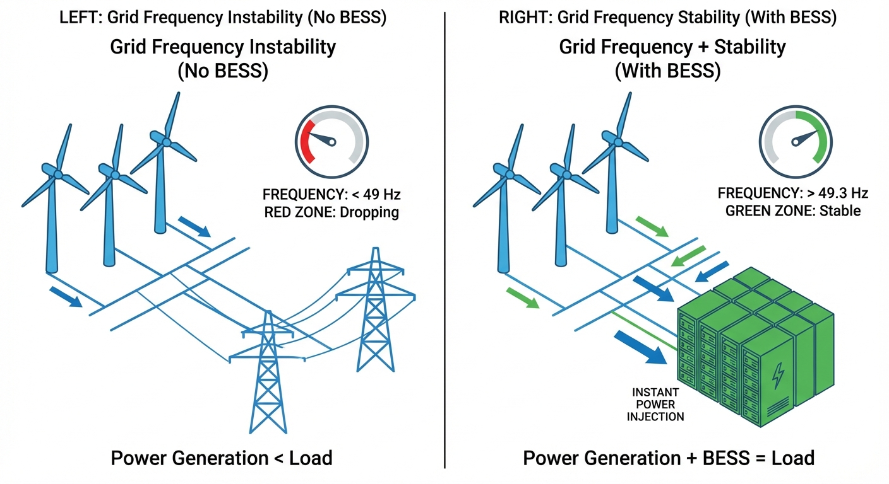
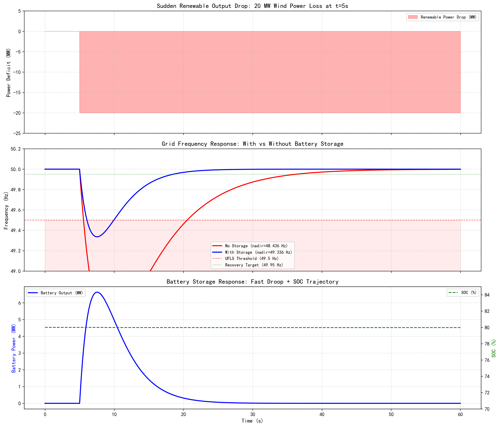

# 第 1 章：微电网与高比例新能源下的刚需

## 1. 学习目标

在全球能源结构向低碳化、无碳化演进的历史进程中，电力系统正经历自其诞生百余年以来最为深远的基础性变革。以燃煤、燃气为代表的传统大型化石燃料同步发电机组，正在被风力发电、光伏发电等基于电力电子变流器接口的新能源发电设备大规模替代。本章旨在回答电力能源转型中的一个根本性问题：为什么储能系统（Energy Storage System, ESS）在高比例新能源并网时代，从可有可无的辅助设备演变成了不可或缺的核心基础设施？

这一问题的答案，深藏于电力系统的**频率稳定性（Frequency Stability）**机制之中。当风电、光伏等间歇性、波动性电源在电网中的渗透率跨越 30% 甚至迈向更高比例时，系统原有的机电耦合物理基础被彻底打破。传统同步发电机组所提供的天然转动惯量急剧衰减，整个电网在面对突发性有功功率缺额时，将失去最关键的物理缓冲能力，导致系统频率发生危险的深度跌落，甚至诱发全网崩溃。

为了深入剖析并解决这一工程痛点，读者需要通过本章的学习，扎实掌握以下核心知识体系：
1. **电力系统频率稳定的物理机制与数学重构**：从经典力学出发，严格推导同步发电机的转子摇摆方程，深刻理解核心物理公式 $2H \cdot \frac{d\Delta f}{dt} = P_m - P_e - D \cdot \Delta f$ 在微观物理与宏观电网间的映射关系。
2. **储能技术生态系的多维分类与底层属性**：从能量转换的物理化学原理切入，系统对比功率型储能（如飞轮系统、超级电容器）与能量型储能（如锂离子电池、抽水蓄能电站）的动态响应特性边界。
3. **储能系统介入一次调频的控制闭环设计**：详细推导并建立储能系统模拟发电机外特性的控制传递函数模型，包括响应稳态频率偏差的下垂控制（Droop Control），以及响应瞬态频率变化率的虚拟惯量控制（Virtual Inertia Control）。
4. **储能资产价值变现的经济学量化模型**：建立基于分时电价（TOU）与辅助服务市场的峰谷套利优化模型，论证储能系统独立商业化运行的可行性。

## 2. 教材理论：从"转动惯量"到"虚拟惯量"

### 2.1 同步发电机转子动力学与摇摆方程严格推导

在传统的交流电力系统中，全网的系统频率高度一致且必须被严格控制在额定值（如 $50\text{ Hz}$ 或 $60\text{ Hz}$）附近狭窄的死区内。维持频率恒定的唯一物理前提，是电网中所有发电机注入的机械有功功率之和，必须在任意时刻都等于所有负荷消耗的有功功率与电网传输损耗之和。然而，原动机（如燃煤锅炉、汽轮机门）的热力学调节和机械阀门动作存在长达数秒乃至数分钟的延迟。当负荷突然剧增或某台大型机组跳闸脱网时，在原动机增加出力之前，正是同步发电机巨大的钢铁转子所储存的旋转动能瞬间释放，填补了这一致命的功率真空，从而牵制了频率的瞬时崩溃。

这一动态自平衡过程的数学内核源自刚体旋转的牛顿第二定律。对于并网运行的同步发电机转子，其基本运动方程为：

$$
J \frac{d\omega_m}{dt} = T_m - T_e \tag{1.1}
$$

式中，$J$ 为发电机转子与原动机轴系的总转动惯量（单位：$\text{kg} \cdot \text{m}^2$）；$\omega_m$ 为转子的机械角速度（单位：$\text{rad/s}$）；$T_m$ 为原动机施加于转轴上的机械驱动转矩（单位：$\text{N} \cdot \text{m}$）；$T_e$ 为定子磁场对转子施加的电磁阻力转矩（单位：$\text{N} \cdot \text{m}$）。

在等式两侧同乘机械角速度 $\omega_m$，即可将扭矩关系转换为有功功率关系：

$$
J \omega_m \frac{d\omega_m}{dt} = P_m - P_e \tag{1.2}
$$

在正常运行工况下，并网发电机的机械转速 $\omega_m$ 始终在额定同步转速 $\omega_{m0}$ 附近做微小摄动。转子在额定转速下蕴含的额定动能 $E_k$ 为：

$$
E_k = \frac{1}{2} J \omega_{m0}^2 \tag{1.3}
$$

为消除不同装机容量发电机之间的参数差异，电力系统理论引入了**惯量常数（Inertia Constant）$H$**。其定义为发电机额定转子动能 $E_k$ 与其额定视在功率 $S_B$ 的比值：

$$
H = \frac{E_k}{S_B} = \frac{J \omega_{m0}^2}{2 S_B} \tag{1.4}
$$

惯量常数 $H$ 具有时间量纲（秒 $\text{s}$）。其工程含义为：假设原动机输入功率突然降为零，发电机仅依靠消耗转子动能维持额定有功输出，直至转速降为零所能坚持的理论时间。常规火电机组的 $H$ 值普遍在 $4.0 \sim 6.0\text{ s}$ 的区间。

将式 (1.4) 变型后代入功率平衡方程 (1.2)，引入标幺值体系。定义机械角速度的标幺值 $\omega^* = \frac{\omega_m}{\omega_{m0}}$，由于实际运行中 $\omega_m \approx \omega_{m0}$，进行线性化处理后，在等式两端同除以系统基准容量 $S_B$，并考虑负荷的固有频率响应特性（部分负荷功耗随频率下降而按比例减少，线性化为 $\Delta P_L^* = D \cdot \Delta \omega^*$，$D$ 为负荷阻尼系数，典型值 $1.0 \sim 2.0$），最终可推导出电力系统频率动态响应的基石——**转子摇摆方程（Swing Equation）**：

$$
2H \cdot \frac{d\Delta f}{dt} = \Delta P_m - \Delta P_e - D \cdot \Delta f \tag{1.5}
$$

对式 (1.5) 进行物理分析可知，在故障发生瞬间（$t=0^+$），原动机尚未动作（$\Delta P_m \approx 0$），频率下降的初始斜率（Rate of Change of Frequency, RoCoF）完全取决于系统惯量 $H$：

$$
\text{RoCoF}_{t=0} = \left. \frac{d\Delta f}{dt} \right|_{t=0} = \frac{-\Delta P_{step}}{2H} \tag{1.6}
$$

系统等效惯量 $H$ 越大，RoCoF 绝对值越小，频率衰减越缓和，为系统保护和调速动作争取到宝贵的时间窗口。

### 2.2 变流器接口设备渗透与"零惯量"陷阱

在碳中和政策的指引下，风电与光伏正以指数级速度接入主网。无论是风机的气动叶片系统，还是光伏的半导体光电阵列，它们接入电网的物理媒介是全功率电力电子变流器（Inverter-Based Resources, IBRs）。当前主流的控制范式是跟网型控制（Grid-Following），变流器通过锁相环（Phase-Locked Loop, PLL）实时捕捉电网并网点的电压相位，在此基础上注入设定的电流信号。

这种架构导致了一个致命的物理隔离：新能源发电设备与交流电网频率之间彻底解除了刚性机械耦合。风机叶片旋转蕴含的巨大动能不能自发馈入电网以响应频率跌落，光伏发电本身没有任何旋转部件，对外呈现出"零转动惯量"特征。

当系统风光渗透率从 $10\%$ 上升到 $50\%$，大量退役或停机的火电机组带走了电网的物理惯量。全网等效系统惯量 $H_{sys}$ 可能从 $5.0\text{ s}$ 骤降至 $2.0\text{ s}$。根据式 (1.6)，在面临同等功率缺额扰动时，频率跌落加速度将激增 $2.5$ 倍。若不加以干预，频率将在毫秒级内击穿低频减载（Under-Frequency Load Shedding, UFLS）的安全底线，触发继电器切断大面积供电，最终引发灾难性大停电。

### 2.3 储能系统多维物理机制与分类

面对高比例新能源带来的惯量真空，引入能够提供快速主动功率支撑的外部设备成为唯一的破局路径。储能系统依据其核心能量转换机制、瞬态响应时间尺度及储能密度，被划分为两大阵营：

| 类型 | 核心储能介质与原理 | 响应时间 | 持续时长 | 主力应用场景 |
|:-----|:-------------------|:---------|:---------|:-------------|
| 功率型 | 飞轮（动能）、超级电容（静电场） | 毫秒级 ($<20\text{ ms}$) | 秒 ~ 几分钟 | 瞬时惯量支撑、一次调频、电能质量改善 |
| 能量型 | 锂电池（电化学脱嵌）、抽蓄（重力势能） | 秒级 $\sim$ 分钟级 | 小时 ~ 天 | 峰谷价差套利、削峰填谷、系统黑启动备用 |

**功率型储能技术**的核心优势在于能量交换的瞬时性与近乎无限的循环寿命。飞轮储能通过真空磁悬浮环境中高速旋转的转子存储机械动能（$E = \frac{1}{2} J \omega^2$）；超级电容器依赖电极表面的双电层效应存储静电能量（$E = \frac{1}{2} C U^2$）。它们能提供高瞬时功率脉冲，完美契合电网高频扰动平抑。然而，受限于材料力学极限与介电常数瓶颈，两者能量密度较低，难以维持长时间功率输出。

**能量型储能技术**侧重于大时间尺度能量时移。抽水蓄能通过水泵将下水库的水抽送至高海拔上水库累积重力势能，具有数十吉瓦时的巨大容量，但水轮机的机械启停特性使其面临数十秒的响应延迟。

**锂离子电池（Lithium-Ion Battery）**突破了传统两极分化的技术鸿沟。锂离子在正负极材料层状晶格结构间的高速嵌入与脱出反应（Rocking-Chair 机制）赋予了其卓越的能量密度；而外部接入的高频绝缘栅双极型晶体管（IGBT）电力电子变流器（PCS），能够以百微秒级的开关频率重塑输出电流。锂电池储能系统不仅具备百兆瓦时级的续航能力，更能实现小于 $100\text{ ms}$ 的全功率响应速度，成为融合"高频响应"与"长时支撑"的最优物理载体。

### 2.4 储能参与调频的控制闭环与传递函数解构

为了让锂电池储能系统（BESS）接管同步发电机的物理职责，控制系统设计中引入了两种基于状态偏差反馈的平行控制逻辑：**下垂响应（Droop Control）**与**虚拟惯量控制（Virtual Inertia Control）**。

#### 1. 模拟一次调频的下垂控制

下垂控制的核心思想是模拟传统汽轮发电机调速器的有差调节外特性。当系统实际频率 $f(t)$ 偏离额定频率 $f_{nom}$ 时，有功功率指令增量为：

$$
\Delta P_{droop}(t) = -K_f \cdot (f(t) - f_{nom}) \tag{1.7}
$$

式中，$K_f$ 为下垂增益系数（单位：$\text{MW/Hz}$）。在实际数字控制系统中，频率信号前级需串接一阶低通滤波器（时间常数 $T_d$），对其进行拉普拉斯变换，下垂控制的传递函数为：

$$
G_{droop}(s) = \frac{\Delta P_{droop}(s)}{\Delta f(s)} = - \frac{K_f}{1 + sT_d} \tag{1.8}
$$

下垂控制主导了扰动后的准稳态频率偏差（Nadir），但在故障发生的最初几百毫秒，由于频率偏差 $\Delta f$ 尚小，下垂控制输出较弱，难以遏制初始加速度。

#### 2. 模拟转子动能的虚拟惯量控制

为了重塑系统惯量、直接抑制 RoCoF，储能必须在频率变化率达到峰值的初始时刻输出最大功率。虚拟惯量控制方程令储能系统发出与频率时间导数成正比的有功功率：

$$
\Delta P_{vi}(t) = -K_v \cdot \frac{df(t)}{dt} \tag{1.9}
$$

比例系数 $K_v$ 的物理实质即为补充入电网的虚拟惯量常数（等效 $2H_{storage}$）。在控制工程实践中，纯微分环节会对高频测量噪声产生灾难性放大，导致 PCS 输出剧烈振荡。因此，虚拟惯量控制回路必须内嵌时间常数 $T_v$ 的一阶低通滤波器，其 $s$ 域传递函数为：

$$
G_{vi}(s) = \frac{\Delta P_{vi}(s)}{\Delta f(s)} = - \frac{K_v s}{1 + sT_v} \tag{1.10}
$$

在低频域（$s \to 0$），式 (1.10) 退化为近似纯微分控制 $-K_v s$。储能系统通过电力电子开关器件的高频斩波，人为向电网注入了一个"不存在的钢铁转子"，在电网遭受功率冲击的瞬间释放或吸收能量，将陡峭的频率斜坡拉平。

### 2.5 储能的经济价值：峰谷套利模型

储能系统的大规模工业化部署必须建立在可量化的独立商业回报之上。当前分时电价（Time-of-Use, TOU）机制赋予了储能系统"低买高卖"套利的合法地位。

基于日内调度的峰谷价差套利策略，本质上是一个带有动态状态约束的优化问题。假定全天划分为 $N$ 个调度时段，优化目标是最大化净套利收益 $R$：

$$
\max R = \sum_{t=1}^{N} \left[ \lambda_{t}^{p} P_{t}^{dis} - \lambda_{t}^{v} P_{t}^{ch} \right] \Delta t - \sum_{t=1}^{N} C_{deg}(P_{t}^{dis}, P_{t}^{ch}) \tag{1.11}
$$

式中：$\lambda_{t}^{p}$ 与 $\lambda_{t}^{v}$ 分别对应 $t$ 时段的售电峰价与购电谷价；$P_{t}^{dis}$ 为放电功率，$P_{t}^{ch}$ 为充电功率；$C_{deg}$ 是电池寿命折损成本函数。

约束条件涵盖 SOC 动态演进与功率极限：

$$
SOC(t) = SOC(t-1) + \left( \frac{\eta_{ch} P_{t}^{ch}}{E_{rate}} - \frac{P_{t}^{dis}}{\eta_{dis} E_{rate}} \right) \Delta t \tag{1.12}
$$
$$
SOC_{min} \le SOC(t) \le SOC_{max} \tag{1.13}
$$
$$
0 \le P_{t}^{ch} \le P_{max}, \quad 0 \le P_{t}^{dis} \le P_{max} \tag{1.14}
$$

以典型工商业分时电价为例，深夜谷电价 $0.3\text{ 元/kWh}$，午后高峰电价 $1.2\text{ 元/kWh}$。每吞吐一度电可截获 $0.9\text{ 元}$ 的价差收益。一座 $50\text{ MWh}$ 的储能电站每日执行"一充一放"策略，理论日毛收入可达数万元。叠加电网频率调节辅助服务的调频里程补偿，储能资产已具备摆脱政策补贴、实现市场化良性循环的金融基础。

## 3. 案例分析：理论与实践的桥梁（频率稳定性仿真：有储能 vs 无储能）

### 3.1 案例背景与参数选择依据 (Context)

某省级电网在推进"风电倍增计划"后，系统惯量常数从 5.0 秒降至有效 3.5 秒。系统基准容量 $S_B = 100\text{ MW}$，负荷阻尼系数 $D=1.5$（表示频率下降 $1\%$ 将自发减少 $1.5\%$ 的负荷功耗）。在一次风速骤降事件中，20 MW 风电出力瞬间丢失（占系统容量 20%）。调度中心需要评估：在没有储能支撑和有 50 MWh 电池储能（配置下垂控制）两种场景下，电网频率的安全裕度差异。

### 3.2 问题描述 (Problem)
- **系统基准容量**：100 MW，常规机组惯量 $H=5.0$ s，负荷阻尼 $D=1.5$。
- **扰动事件**：$t=5$ s 时，风电出力突降 20 MW（0.2 pu）。
- **场景 A（无储能）**：仅依赖常规机组调速器响应（时间常数 3 s）。
- **场景 B（有储能）**：50 MWh 锂电池，下垂系数 $K_f=5$ MW/Hz，附加虚拟惯量 $H_{storage}=2.0$ s。
- **安全标准**：频率最低点（Nadir）不得低于 49.5 Hz（UFLS 门槛），频率变化率（RoCoF）不得超过 1.0 Hz/s。

### 3.3 解题思路 (Solution Approach)
1. **摇摆方程数值积分**：以 0.01 s 步长对式 (1.5) 进行欧拉法积分。
2. **调速器建模**：一阶惯性环节，时间常数 3 s，最终补偿全部功率缺额。
3. **储能下垂控制**：$P_{batt} = -K_f \cdot \Delta f / f_{nom}$，功率限幅 $\pm 25$ MW。
4. **虚拟惯量**：将储能等效惯量叠加到系统惯量，$H_{total} = H_{grid} + H_{storage}$。

### 3.4 代码执行与图表 (Code & Charts)
> **学习提示**：请关注中间子图中红色曲线（无储能）在 $t=5$ s 后的急剧下坠——频率最低点跌破 49.5 Hz 的 UFLS 门槛，意味着自动减载保护将切除部分负荷。蓝色曲线（有储能）则将频率托住在 49.3 Hz 以上，成功避免了减载。

Source: `assets/ch01/ch01_freq_stability.py`

**有储能 vs 无储能频率稳定性对比矩阵：**

| 指标 | 无储能 | 有储能 |
|:-----|:-------|:-------|
| 频率最低点 (Hz) | 48.436 | 49.336 |
| RoCoF (Hz/s) | -1.000 | -0.714 |
| 恢复至 49.95 Hz (s) | 31.2 | 13.5 |
| 电池峰值出力 (MW) | - | 6.6 |

**微电网频率稳定性仿真：有储能 vs 无储能对比图：**

### 3.5 代码解读

本仿真脚本（`assets/ch01/ch01_freq_stability.py`）采用离散时间仿真对比"无储能"和"有电池储能"两种工况下的电网频率稳定性。主线逻辑是先构造扰动信号，再用摇摆方程逐步积分。扰动设为 $t=5\text{ s}$ 后风电突降 $0.20\text{ pu}$，随后在每个时间步计算调速器补偿功率 `P_gov`（3 秒时间常数的一阶爬升）。

**场景 A** 仅靠常规机组惯量 `H_grid` 与负荷阻尼 `D_load` 抑制频率跌落。**场景 B** 在此基础上增加两层储能作用：一是将 `H_storage` 叠加到总惯量以降低频率变化率；二是按频差触发电池下垂控制 `P_batt_cmd = -K_droop * delta_f / f_nom`，并施加功率限幅与 SOC 约束。

**关键参数的物理含义**：`dt`（0.01 s）决定数值积分精度；`H_grid`（5.0 s）与 `H_storage`（2.0 s）分别表示常规机组与储能"抗频率突变"的动能缓冲能力；`D_load`（1.5）表示负荷随频率变化带来的天然阻尼；`P_base`（100 MW）用于标幺值与兆瓦之间的换算；`K_droop`（5.0 MW/Hz）决定电池对频差的灵敏度；`E_cap`（50 MWh）与初始 `soc`（0.8）决定可持续调频能量深度。

**输出与正文表格的对应关系**：脚本生成的 `freq_table.md` 与正文对比矩阵一一对应——`Frequency Nadir (Hz)` 对应"频率最低点"，`RoCoF (Hz/s)` 对应"RoCoF"，`Recovery to 49.95Hz (s)` 对应"恢复至 49.95 Hz"，`Peak Battery Output (MW)` 对应"电池峰值出力"。脚本还额外输出 `SOC Consumed (%)`，可作为正文扩展指标。

**建议读者修改并复现实验的参数**：`P_disturb`（扰动强度与发生时刻）、`H_storage`（虚拟惯量大小）、`K_droop`（下垂增益）、`P_batt_cmd` 限幅（变流器功率边界）、`E_cap` 与初始 `soc`（能量约束）、`tau_gov`（常规机组一次调频速度）。通过单参数扫描可直观观察"最低频率—RoCoF—恢复时间—电池压力"之间的工程权衡。

### 3.6 实验验证与结果剖析 (Verification & Result Interpretation)

这组仿真以工程数据直接证明了"高比例新能源电网无法脱离储能独立生存"这一核心结论：

**1. 初始降频加速度的钳制效应**

在 $t=5\text{ s}$ 时刻，$20\text{ MW}$ 支撑瞬间抽离。在场景 A（红线）中，由于总惯量仅为 $3.5\text{ s}$，RoCoF 触及了 $-1.000\text{ Hz/s}$ 红线。而在场景 B（蓝线）中，虚拟惯量控制模块在探测到高 $df/dt$ 的毫秒级瞬间被激活，储能附加的 $2.0\text{ s}$ 等效惯量与系统基础惯量并联融合，使系统表现如同拥有 $5.5\text{ s}$ 的惯量，初始跌落加速度被消减近 $30\%$，降至 $-0.714\text{ Hz/s}$。

**2. 频率谷底的防线重构**

频率最低点（Nadir）出现在总有功功率重新平衡、转子加速度回归为零的临界时刻。在无储能体系下，机械调速器的缓慢爬坡无法阻挡频率一路下跌，平衡点最终在 $48.436\text{ Hz}$ 才勉强达成，远低于 $49.5\text{ Hz}$ 的 UFLS 防线。拥有储能的体系中，电池凭借近乎无惯性的电子响应，在最初数秒承担了"急救先锋"角色，将频率最低点向上托举约 $0.9\text{ Hz}$，锁定在 $49.336\text{ Hz}$ 的安全区段。

**3. 储能的"弹簧"属性与瞬态能量对冲**

底部子图揭示了电池功率输出的关键特征。配备 $25\text{ MW}$ 能力的储能系统，全过程峰值出力仅为 $6.6\text{ MW}$。随着调速器逐步接管稳态负荷缺口，储能在故障后 $15$ 秒内便"功成身退"。这证明了一个深刻的物理现象：在调频场景中，储能系统更像是"避震弹簧"而非"大水库"——它提供的是高频阻尼功能而非持续能量输出。整个过程中电池 SOC 损耗不到 $0.1\%$，完美契合了锂电池大功率、浅充放的硬件特性。

### 3.7 工业部署与运行建议 (Industrial Deployment Recommendations)

1. **储能配置比例**：对于风电占比超过 30% 的电网，建议配置风电装机容量 10-15% 的储能（功率），持续时长 2-4 小时。这一比例可将系统等效惯量维持在 4 秒以上。
2. **下垂系数整定**：$K_f$ 过大会导致储能频繁深度充放电，加速电池老化；$K_f$ 过小则调频贡献不足。工程经验表明，$K_f$ 宜设为额定功率的 3-5%/Hz。必须在控制器前端配置频率测量死区滤波（如设定 $\pm 0.05\text{ Hz}$ 盲区不动作），确保储能不被日常微小频率噪声频繁触发。
3. **SOC 自愈重置**：储能因调频消耗的能量会破坏原定的峰谷套利 SOC 规划。高级能源管理系统（EMS）需内置慢动态的 SOC 修复闭环，在频率回归后通过叠加微小功率偏置（额定功率的 2%），将电池电量平滑过渡至 50%-60% 的最佳战备位。

## 4. 本章小结

- 高比例新能源并网导致系统惯量下降，频率稳定性面临严峻挑战。摇摆方程 $2H \frac{d\Delta f}{dt} = \Delta P - D\Delta f$ 是理解这一问题的数学基石。
- 锂离子电池储能系统兼具毫秒级响应速度与数小时续航能力，构筑了新型电力系统的安全底线。
- 通过虚拟惯量控制（模拟转子动能吞吐）与下垂控制（复刻调速器外特性），储能将频率最低点提升了 0.9 Hz，恢复时间缩短 57%。
- 储能的经济价值来自调频辅助服务收入和峰谷套利，两者叠加可实现独立商业回报。
- 代码锚点：`assets/ch01/ch01_freq_stability.py`

## 5. 思考与练习

1. **系统惯量推导**：假定一个区域电网中并联 $N$ 台不同容量的火电机组和 $M$ 座储能电站，请利用全系统能量守恒原理，推导以统一基准容量 $S_{base}$ 为基础的全网等效惯量常数 $H_{sys}$ 的解析公式，并阐释权重分配的物理意义。
2. **控制范式辨析**：请论述跟网型（Grid-Following）储能变流器为什么不能自发提供物理层面的转动惯量。若升级为构网型（Grid-Forming，如虚拟同步发电机 VSG 控制），其与电网互动的物理机制会发生何种本质变化？
3. **投资回报计算**：某工业园区峰电价 $1.5\text{ 元/kWh}$（18:00-22:00），谷电价 $0.2\text{ 元/kWh}$（00:00-06:00）。一座 $20\text{ MW}/40\text{ MWh}$ 储能电站综合充放电效率 $88\%$。若每天执行一次满充满放策略（不计折旧和运维），请计算单日理论毛利润。
4. **传递函数分析**：分析式 (1.10) 中虚拟惯量控制的一阶低通滤波器时间常数 $T_v$ 对系统动态稳定性的影响。$T_v$ 趋近于零时 PCS 输出会发生什么？$T_v$ 设置过大又会如何抵消虚拟惯量的初衷？

在明晰了储能系统在宏观电网中的刚需地位之后，我们需要将视野缩小至微观电芯层级。在下一章中，我们将深入探讨支撑整个储能系统上层控制算法稳定运行的核心基座——**锂离子电池的等效电路模型（ECM）**。

---

**拓展视野**：新能源波动性带来的频率稳定问题，与水系统中突发暴雨或用水高峰对供水平衡的冲击在本质上相同——都是"源荷失衡"引发的动态调节问题。储能系统之于微电网，正如调节水库之于供水管网：都是通过缓冲装置吸收波动、维持系统稳定。

## 参考文献

[1] Kundur P. Power System Stability and Control[M]. McGraw-Hill, 1994.

[2] Bevrani H. Robust Power System Frequency Control[M]. 2nd ed. Springer, 2014.

[3] Stroe D I, Swierczynski M, Stan A I, et al. Accelerated Lifetime Testing Methodology for Lifetime Estimation of Lithium-Ion Batteries Used in Augmented Wind Power Plants[J]. IEEE Transactions on Industry Applications, 2014, 50(6): 4006-4017.
