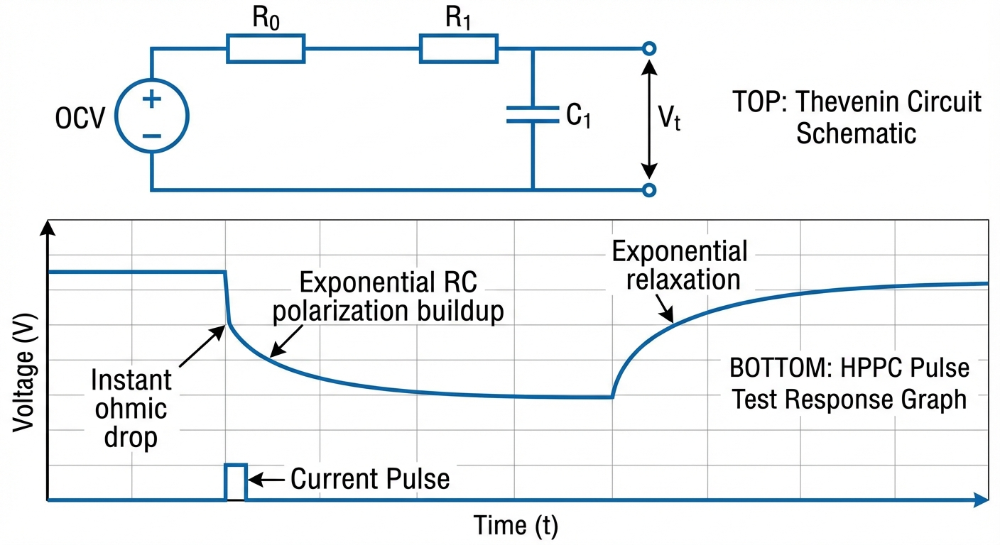

# 第 2 章：锂离子电池的等效电路模型（ECM）

> 在上一章中，我们从宏观电网视角论证了储能系统在高比例新能源并网中的刚需地位。本章将视角聚焦至微观电芯层级，探讨如何将复杂的电化学反应抽象为可用于实时控制的等效电路模型。

## 1. 学习目标

等效电路模型（Equivalent Circuit Model, ECM）是连接电池电化学行为与电池管理系统（BMS）控制算法的核心桥梁。在基于模型的设计（Model-Based Design, MBD）框架下，精确的 ECM 是 SOC 估计、功率预测和安全管理等一切上层算法的基石。

读者需要掌握：
1. 开路电压（OCV）与荷电状态（SOC）的非线性映射关系及其多项式拟合方法。
2. 欧姆内阻（$R_0$）对电流突变的瞬时压降效应及其物理来源。
3. 一阶/二阶 RC 戴维南模型（Thevenin Model）中极化现象的电路建模与状态空间表达。
4. 混合脉冲功率特性（HPPC）测试的标准流程与参数辨识方法。

## 2. 教材理论：从电化学到等效电路

### 2.1 电池端电压的物理组成

一颗锂离子电池的端电压 $V_t$ 并非一个简单的常数，而是由多个物理过程叠加而成的动态信号。当外部有电流 $I$ 流过（约定放电为正）时，端电压可分解为三个层次：

$$
V_t = V_{OCV}(SOC) - I \cdot R_0 - V_{pol} \tag{2.1}
$$

其中：
- **$V_{OCV}(SOC)$** 为开路电压，代表电池在热力学平衡状态下的电动势，仅与 SOC 有关。
- **$I \cdot R_0$** 为欧姆压降，源于电解液离子传导电阻和集流体电子传导电阻，响应速度在微秒量级，表现为电流阶跃瞬间的电压跳变。
- **$V_{pol}$** 为极化过电压，源于锂离子在电极活性材料内部的固相扩散迟滞以及电极/电解液界面的电荷转移动力学，表现为电压的指数型弛豫（Relaxation）行为。

从电化学角度，欧姆压降的物理来源可以进一步分解为三个部分：(1) 电解液中锂离子迁移的离子导电阻抗，该部分约占总欧姆阻抗的 60-70%；(2) 正负极集流体（铝箔和铜箔）的电子传导阻抗，约占 10-15%；(3) 各层之间的接触电阻，包括活性材料与集流体的界面阻抗以及极耳焊接阻抗，约占 15-25%。理解这些物理来源有助于分析电池老化过程中 $R_0$ 增大的具体原因——例如，集流体腐蚀主要影响第 (2) 部分，而 SEI 膜增厚则主要增大界面阻抗。

### 2.2 OCV-SOC 映射关系与多项式拟合

开路电压 $V_{OCV}$ 是 SOC 的单调递增函数，但呈现显著的非线性特征。在 SOC 的中间区段（20%-80%），OCV 近似线性变化；在两端（接近 0% 和 100%），OCV 曲线的斜率急剧增大。

工程上通常采用低阶多项式对 OCV-SOC 关系进行最小二乘拟合。设采集到 $M$ 个实验数据点 $(SOC_k, V_{OCV,k})$，$k=1,2,...,M$，采用 $n$ 阶多项式模型：

$$
V_{OCV}(SOC) = a_0 + a_1 \cdot SOC + a_2 \cdot SOC^2 + \cdots + a_n \cdot SOC^n \tag{2.2}
$$

拟合系数向量 $\mathbf{a} = [a_0, a_1, ..., a_n]^T$ 通过最小化残差平方和获得：

$$
\mathbf{a}^* = \arg\min_{\mathbf{a}} \sum_{k=1}^{M} \left[ V_{OCV,k} - \sum_{j=0}^{n} a_j \cdot SOC_k^j \right]^2 \tag{2.3}
$$

这是一个经典的线性最小二乘问题，其解析解为 $\mathbf{a}^* = (\mathbf{X}^T \mathbf{X})^{-1} \mathbf{X}^T \mathbf{V}$，其中 $\mathbf{X}$ 为范德蒙矩阵。实践中，三阶多项式（$n=3$）通常能在拟合精度与模型简洁性之间取得良好平衡。本书仿真采用的 NMC 电池 OCV 曲线为：

$$
V_{OCV}(SOC) = 3.0 + 1.2 \cdot SOC - 0.5 \cdot SOC^2 + 0.5 \cdot SOC^3 \tag{2.4}
$$

该多项式在 $SOC=0$ 时给出 3.0 V（接近锂电池放电截止电压），在 $SOC=1$ 时给出 4.2 V（接近满充电压），符合 NMC 电池的典型特征。

需要指出的是，OCV-SOC 关系存在滞回效应（Hysteresis）：充电过程测得的 OCV 曲线略高于放电过程测得的曲线，差异可达 5-15 mV。对于 NMC 电池，该效应较小，可忽略；但对于 LFP（磷酸铁锂）电池，滞回效应在平台区可达 30-50 mV，此时需要引入 Plett 提出的"一阶滞回模型"进行补偿。

### 2.3 一阶 RC 戴维南模型的电路拓扑与微分方程推导

一阶戴维南等效电路由三个串联元件组成：理想电压源 $V_{OCV}(SOC)$、欧姆电阻 $R_0$、以及一组并联的极化电阻 $R_1$ 与极化电容 $C_1$。极化 RC 网络用于捕捉电池的动态弛豫行为。

从基尔霍夫电流定律（KCL）出发推导极化支路的微分方程。设极化电容两端电压为 $U_1$，流经极化电阻 $R_1$ 的电流为 $i_{R_1}$，流经电容 $C_1$ 的电流为 $i_{C_1}$，外部总电流为 $I$。根据 KCL：

$$
I = i_{R_1} + i_{C_1} = \frac{U_1}{R_1} + C_1 \frac{dU_1}{dt} \tag{2.5}
$$

将式 (2.5) 整理为标准一阶常微分方程形式：

$$
\frac{dU_1}{dt} = -\frac{U_1}{R_1 C_1} + \frac{I}{C_1} \tag{2.6}
$$

该方程的物理含义清晰：右侧第一项 $-U_1/(R_1 C_1)$ 为 RC 网络的自然衰减项（时间常数 $\tau_1 = R_1 C_1$），驱动极化电压向零回归；第二项 $I/C_1$ 为电流激励项，持续向电容充电以建立极化电压。

对式 (2.6) 进行齐次和特解分析，可以得到其解析解。在恒流 $I$ 激励、初始条件 $U_1(0) = U_{1,0}$ 下：

$$
U_1(t) = I \cdot R_1 \left(1 - e^{-t/\tau_1}\right) + U_{1,0} \cdot e^{-t/\tau_1} \tag{2.6a}
$$

该解由两部分组成：第一项为强迫响应，$U_1$ 最终趋向稳态值 $I \cdot R_1$；第二项为自由响应，初始极化以指数形式衰减。当电流突然归零时，$U_1(t) = U_{1,0} \cdot e^{-t/\tau_1}$，即纯指数衰减——这正是 HPPC 测试中观测到的弛豫曲线形态。

结合 OCV 和欧姆压降，端电压的完整表达式为：

$$
V_t = V_{OCV}(SOC) - I \cdot R_0 - U_1 \tag{2.7}
$$

同时，SOC 的动态方程由安时积分给出：

$$
\frac{dSOC}{dt} = -\frac{I}{Q_n} \tag{2.8}
$$

其中 $Q_n$ 为电池额定容量（单位：As）。

### 2.4 状态空间表达

将上述微分方程整理为标准状态空间形式，定义状态向量 $\mathbf{x} = [SOC, U_1]^T$，输入 $u = I$，输出 $y = V_t$：

**状态方程**：
$$
\dot{\mathbf{x}} = \begin{bmatrix} 0 & 0 \\ 0 & -\frac{1}{R_1 C_1} \end{bmatrix} \mathbf{x} + \begin{bmatrix} -\frac{1}{Q_n} \\ \frac{1}{C_1} \end{bmatrix} u \tag{2.9}
$$

**观测方程**：
$$
y = V_{OCV}(SOC) - R_0 \cdot u - U_1 \tag{2.10}
$$

由于 $V_{OCV}(SOC)$ 是 SOC 的非线性函数，该系统为非线性状态空间模型。这一非线性特征正是下一章引入扩展卡尔曼滤波（EKF）而非标准卡尔曼滤波的根本原因。

值得注意的是，状态方程 (2.9) 的系统矩阵 $\mathbf{A}$ 是对角阵，且两个对角元素分别为 0 和 $-1/(R_1C_1)$。这意味着系统具有两个解耦的模态：SOC 状态是一个纯积分器（$\lambda_1 = 0$），其值由电流的累积决定；极化电压 $U_1$ 是一个稳定的一阶衰减模态（$\lambda_2 = -1/\tau_1 < 0$），受到电流的持续激励。这种"一个积分模态 + 一个衰减模态"的结构在控制理论中具有重要的可控性和可观测性含义。

### 2.5 离散化与数值求解

在 BMS 的嵌入式微控制器（MCU）中，式 (2.6) 的连续微分方程必须转化为离散差分方程才能执行。采用一阶向前欧拉法（Forward Euler），设采样周期为 $\Delta t$：

$$
U_{1,k} = U_{1,k-1} + \left( -\frac{U_{1,k-1}}{R_1 C_1} + \frac{I_k}{C_1} \right) \Delta t \tag{2.13}
$$

该离散化方法要求采样周期满足数值稳定性条件 $\Delta t < 2 R_1 C_1 = 2\tau_1$。对于 $\tau_1 = 30\text{ s}$ 的典型参数，$\Delta t < 60\text{ s}$，在工程实践中（$\Delta t = 0.1\sim1\text{ s}$）远远满足。

更精确的离散化方法是精确离散化（Zero-Order Hold, ZOH），利用矩阵指数计算：

$$
U_{1,k} = e^{-\Delta t/\tau_1} \cdot U_{1,k-1} + R_1(1 - e^{-\Delta t/\tau_1}) \cdot I_k \tag{2.14}
$$

该公式在任意 $\Delta t$ 下都精确成立，无数值稳定性限制。在计算资源充裕时（如 PC 端仿真），推荐使用此精确形式。

**精确离散化的推导过程**：式 (2.14) 可从一阶线性 ODE 的通解严格推导。假设在采样区间 $[k\Delta t, (k+1)\Delta t]$ 内电流 $I$ 恒定（零阶保持器），式 (2.6) 的解析解为：

$$
U_1(t) = e^{-(t-k\Delta t)/\tau_1} \cdot U_{1,k} + I R_1 \left(1 - e^{-(t-k\Delta t)/\tau_1}\right) \tag{2.14a}
$$

令 $t = (k+1)\Delta t$ 即得式 (2.14)。在矩阵形式下，完整系统的离散化为 $\mathbf{x}_{k+1} = \mathbf{A}_d \mathbf{x}_k + \mathbf{B}_d u_k$，其中 $\mathbf{A}_d = e^{\mathbf{A}\Delta t}$，$\mathbf{B}_d = \mathbf{A}^{-1}(\mathbf{A}_d - \mathbf{I})\mathbf{B}$。对于一阶戴维南模型的对角 $\mathbf{A}$ 矩阵，矩阵指数可逐元素计算。

两种离散化方法的误差可以定量比较。设 $\alpha = \Delta t / \tau_1$，则欧拉法的局部截断误差为 $O(\alpha^2)$，而 ZOH 方法为零（精确解）。当 $\alpha = 1/30$（即 $\Delta t = 1$ s，$\tau_1 = 30$ s）时，欧拉法的相对误差约为 $0.06\%$，工程上完全可接受。但当 $\alpha$ 接近 1 或更大时（如低采样率场景），欧拉法误差迅速增大，甚至可能发散，此时必须使用 ZOH 方法。

SOC 的离散更新同样基于安时积分：

$$
SOC_k = SOC_{k-1} - \frac{I_k \cdot \Delta t}{Q_n} \tag{2.15}
$$

端电压在每个离散时刻的计算为：

$$
V_{t,k} = V_{OCV}(SOC_k) - I_k \cdot R_0 - U_{1,k} \tag{2.16}
$$

式 (2.13)-(2.16) 构成了一阶戴维南模型的完整离散时间仿真算法，也是第 3 章 EKF 状态估计的模型基础。

### 2.6 二阶 RC 模型的扩展

当需要更精确地捕捉多时间尺度的极化动力学时，可将模型扩展为二阶 RC 网络，增加第二组极化支路 $(R_2, C_2)$：

$$
\frac{dU_2}{dt} = -\frac{U_2}{R_2 C_2} + \frac{I}{C_2} \tag{2.11}
$$

$$
V_t = V_{OCV}(SOC) - I \cdot R_0 - U_1 - U_2 \tag{2.12}
$$

其中 $\tau_1 = R_1 C_1$（通常 1-30 s）对应电荷转移极化的快动态，$\tau_2 = R_2 C_2$（通常 100-1000 s）对应固相扩散极化的慢动态。二阶模型增加了两个待辨识参数，但能将电压预测误差从一阶模型的 $\pm 20\text{ mV}$ 降至 $\pm 5\text{ mV}$。

二阶模型的状态空间维度从 2 升至 3（$\mathbf{x} = [SOC, U_1, U_2]^T$），系统矩阵变为 $3 \times 3$ 对角阵。虽然计算量增加不大，但参数辨识的难度显著上升——两个 RC 网络的时间常数如果过于接近，辨识算法可能出现数值病态。工程实践中，建议 $\tau_2 / \tau_1 > 5$ 以确保两个极化过程在频域上充分分离。

### 2.7 HPPC 测试标准流程与参数辨识

混合脉冲功率特性（Hybrid Pulse Power Characterization, HPPC）测试是辨识 ECM 参数的工业标准方法，其流程如下：

1. **SOC 标定**：以 C/20 小电流将电池充至 100% SOC，静置 2 小时以消除极化。
2. **阶梯放电**：以 C/3 电流放电至目标 SOC 点（如 90%、80%、...、10%），每个点静置 1 小时。
3. **脉冲激励**：在每个 SOC 点施加标准脉冲序列——先 10 s 放电脉冲（通常 1C），静置 40 s，再 10 s 充电脉冲（通常 0.75C），静置 40 s。
4. **参数提取**：
   - **$R_0$**：由脉冲起始瞬间的电压阶跃除以电流得到，$R_0 = \Delta V_{instant} / I_{pulse}$。
   - **$R_1, C_1$**：对脉冲结束后的电压弛豫曲线进行指数拟合，$V(t) = V_\infty + \Delta V \cdot e^{-t/\tau_1}$，其中 $\tau_1 = R_1 C_1$，$R_1 = \Delta V / I_{pulse}$。

通过在多个 SOC 点重复上述过程，可建立 $R_0(SOC)$、$R_1(SOC)$、$C_1(SOC)$ 的查找表，捕捉参数随 SOC 变化的非线性依赖关系。

参数辨识的具体数据处理步骤值得详细说明。以放电脉冲结束后的弛豫阶段为例：(1) 记录脉冲结束瞬间（$t_0$）的电压 $V(t_0)$ 和充分弛豫后的稳态电压 $V_\infty$（即该 SOC 点的 OCV）。(2) 对弛豫曲线 $V(t) - V_\infty$ 取自然对数，若为单指数衰减则得到直线 $\ln[V(t) - V_\infty] = \ln(\Delta V) - t/\tau_1$。(3) 对该直线进行线性回归，斜率的负倒数即为 $\tau_1$，截距可得 $\Delta V$。(4) 若残差呈现系统偏离（弛豫曲线的对数图呈曲线而非直线），则说明需要二阶 RC 模型，此时应采用双指数拟合。

### 2.8 ECM 模型的局限性与适用范围

ECM 作为一种"灰箱"模型，在以下场景中表现优异：SOC 估计（第 3 章）、功率极限预测、充电策略仿真（第 4 章）。然而，ECM 存在固有局限：

1. **参数温度依赖性**：$R_0$ 在低温下可增大 3-5 倍（电解液黏度增大），$R_1$ 和 $C_1$ 同样受温度显著影响。常温下辨识的参数不能直接用于极端温度工况。
2. **参数 SOC 依赖性**：实际电池的 $R_0$、$R_1$、$C_1$ 均随 SOC 变化，在满充和深放区间变化尤为剧烈。精确模型需要建立参数查找表 $R_0(SOC, T)$。
3. **老化效应**：随循环次数增加，$R_0$ 和 $R_1$ 逐步增大，$Q_n$ 逐步衰减。ECM 参数需要定期重新辨识。
4. **高频动态**：ECM 无法准确捕捉 kHz 以上的高频阻抗特性（如电感效应），不适用于电化学阻抗谱（EIS）分析。

对于需要精确捕捉电化学微观机制的应用（如锂枝晶生长预测、电解液分解速率计算），需要采用基于物理的电化学模型（如 Newman 伪二维模型 P2D），但其计算量比 ECM 高 3-4 个数量级，不适合实时嵌入式部署。

## 3. 案例分析：HPPC 动态脉冲仿真

### 3.1 案例背景 (Context)

为验证一阶戴维南模型的工程有效性，本节构建了一个基于 Python 的数字仿真环境，模拟 NMC 锂电池在多种脉冲电流激励下的端电压动态响应。仿真参数选取依据如下：

- **电池容量** $Q_n = 50\text{ Ah}$：对应大型方壳动力电池的典型规格。
- **欧姆内阻** $R_0 = 0.01\text{ }\Omega$：反映新电池的低阻特征。
- **极化参数** $R_1 = 0.015\text{ }\Omega$，$C_1 = 2000\text{ F}$：时间常数 $\tau_1 = 30\text{ s}$，对应电荷转移极化的典型响应时间。
- **初始 SOC** = 80%：处于 OCV 曲线的线性区段，便于观察。

### 3.2 问题描述 (Problem)

脉冲电流序列设计为三段式 HPPC 变体：
- $t = 500\sim800\text{ s}$：1C 放电脉冲（50 A），持续 300 s。
- $t = 1500\sim1800\text{ s}$：1C 充电脉冲（-50 A），持续 300 s。
- $t = 2500\sim3000\text{ s}$：2C 放电脉冲（100 A），持续 500 s。

任务是记录各脉冲的瞬时欧姆压降、极化电压峰值及弛豫恢复过程。

### 3.3 代码执行与图表

Source: `assets/ch02/ch02_thevenin.py`

**HPPC 动态脉冲响应关键性能指标：**

| Time Phase           | Current    | Instant Voltage Drop   | Physical Meaning                          | Polarization Voltage   | Voltage Behavior            |
|:---------------------|:-----------|:-----------------------|:------------------------------------------|:-----------------------|:----------------------------|
| t=500s (Pulse Start) | 50 A (1C)  | 0.50 V                 | Ohmic Resistance (Electrolyte)            | nan                    | nan                         |
| t=800s (Pulse End)   | 0 A        | nan                    | Diffusion/Charge Transfer limit           | 0.750 V                | nan                         |
| t=800~1000s          | 0 A        | nan                    | RC Relaxation phase                       | nan                    | Exponential recovery to OCV |
| t=2500s (2C Pulse)   | 100 A (2C) | 1.00 V                 | Deep voltage sag risks undervoltage limit | nan                    | nan                         |

### 3.4 代码解读

本仿真脚本（`assets/ch02/ch02_thevenin.py`）用一阶戴维南等效电路完成了"脉冲电流激励下端电压动态响应"的离散仿真。核心算法按时间步 $dt=1\text{ s}$ 循环更新四个状态量：SOC、OCV、极化电压 $U_1$、端电压 $V_t$。

每一步的计算顺序对应了真实物理过程：首先用安时积分 $SOC_k = SOC_{k-1} - I \cdot dt / (Q_n \cdot 3600)$ 更新荷电状态；然后将 SOC 代入三次多项式 `get_ocv(soc)` 得到开路电压；随后按微分方程 (2.6) 做欧拉离散，得到极化支路电压 $U_1$；最后代入式 (2.7) 合成端电压。这个顺序能在脉冲开始时出现"瞬时下跳"（欧姆压降），在脉冲结束后出现"指数恢复"（RC 弛豫），完整再现 HPPC 测试中观察到的快慢双时间尺度动力学。

**关键参数物理含义**：`Q_capacity`（50 Ah）决定同样电流下 SOC 变化速度；`R0`（0.01 $\Omega$）直接决定 $I \cdot R_0$ 阶跃压降幅值；`R1`（0.015 $\Omega$）与 `C1`（2000 F）共同定义极化支路，时间常数 $\tau_1 = R_1 C_1 = 30\text{ s}$ 决定电压恢复快慢。

**输出与正文表格的对应关系**：脚本生成的表格（六列：时间阶段、电流、瞬时压降、物理含义、极化电压、电压行为）与本节的 KPI 表一一对应。具体而言：$t=500$ s 行对应 1C 脉冲起始瞬时欧姆压降 0.50 V；$t=800$ s 行对应脉冲结束后的极化电压峰值约 0.750 V；$t=800\sim1000$ s 行对应 RC 指数弛豫；$t=2500$ s 行对应 2C 工况下 1.00 V 的更深电压下陷风险。图像输出则提供了电流、OCV/端电压、内压降分解三联图，用于解释各指标的来源。

需要特别注意的是，脚本中 SOC 未做上下限截断。如果将大电流持续时间拉长，可能出现 $SOC < 0$ 或 $SOC > 1$ 的非物理区间——这一点正好可作为读者进行模型健壮性改进的切入点，例如添加 SOC 限幅和欠压/过压保护逻辑。

**建议读者修改的实验参数**：(1) 改 $R_0$ 观察瞬时压降的线性缩放关系；(2) 固定 $R_1$ 改 $C_1$（或直接改 $\tau_1$）观察恢复速度变化；(3) 调整 `I_load` 的幅值与脉宽，对比 0.5C、1C、2C 下电压凹陷差异；(4) 改初始 SOC 并替换 OCV 曲线，观察不同 SOC 区间的非线性敏感性；(5) 将 $dt$ 从 1 s 改为 0.1 s 验证数值精度。

### 3.5 结果物理解释

仿真结果清晰地展示了 ECM 各元件的物理角色：

- **瞬时欧姆压降**：在 $t=500\text{ s}$ 1C 脉冲开始时，端电压瞬间下跳 $\Delta V = I \cdot R_0 = 50 \times 0.01 = 0.50\text{ V}$。这一阶跃完全由 $R_0$ 决定，与 $R_1, C_1$ 无关。在 $t=2500\text{ s}$ 的 2C 脉冲中，欧姆压降加倍至 $1.00\text{ V}$，验证了 $\Delta V \propto I$ 的线性关系。
- **极化电压建立**：在 1C 放电持续 300 s 后，极化电压 $U_1$ 逐步建立至约 $0.750\text{ V}$。由于 $\tau_1 = 30\text{ s}$ 远小于脉冲持续时间 300 s，极化电压已充分饱和至稳态值 $U_{1,\infty} = I \cdot R_1 = 50 \times 0.015 = 0.75\text{ V}$。
- **弛豫恢复过程**：在 $t=800\text{ s}$ 电流归零后，$R_0$ 压降瞬间消失，但 $U_1$ 并非立即回零——它以时间常数 $\tau_1 = 30\text{ s}$ 呈指数衰减，$U_1(t) = 0.75 \cdot e^{-(t-800)/30}$。这一弛豫过程正是 HPPC 测试用于辨识 $R_1, C_1$ 参数的关键窗口。
- **2C 工况风险**：当电流加倍至 100 A 时，总电压凹陷深度达到 $I(R_0 + R_1) = 100 \times 0.025 = 2.5\text{ V}$，端电压可能跌至 3.7 - 2.5 = 1.2 V 以下，触及欠压保护阈值。这说明了 BMS 在大倍率放电时的功率限制必须基于准确的 ECM 参数。

## 4. 本章小结

- 锂电池端电压由 OCV（热力学平衡）、欧姆压降（瞬态）和极化过电压（动态弛豫）三个层次叠加而成。
- 一阶戴维南模型用一组 RC 并联网络捕捉极化动力学，其微分方程可从基尔霍夫电流定律严格推导。
- OCV-SOC 关系通过多项式最小二乘拟合建立，三阶多项式能在精度与简洁性之间取得平衡。
- 状态空间表达 $\mathbf{x} = [SOC, U_1]^T$ 将 ECM 转化为标准非线性系统形式，为下一章 EKF 状态估计奠定了模型基础。
- HPPC 测试通过脉冲激励与弛豫分析辨识 $R_0$、$R_1$、$C_1$，是 ECM 参数标定的工业标准方法。
- 代码锚点：`assets/ch02/ch02_thevenin.py`

## 5. 思考与练习

1. **参数辨识推导**：假设 HPPC 测试在某 SOC 点施加 1C 放电脉冲 10 s 后静置。请推导如何从脉冲结束后的电压弛豫曲线 $V(t)$ 中提取 $R_0$、$R_1$ 和 $\tau_1 = R_1 C_1$ 三个参数，并写出具体的数据处理步骤。
2. **模型阶数选择**：试比较一阶 RC 模型和二阶 RC 模型在 HPPC 测试中的电压预测精度。在什么应用场景下，增加模型阶数（和计算量）是值得的？在什么场景下一阶模型已经足够？
3. **温度依赖性**：本章的 ECM 参数假设为恒温 25°C。请分析温度变化（如 -10°C 低温或 45°C 高温）对 $R_0$、$R_1$、$C_1$ 和 OCV 曲线各有什么影响，并说明如何将温度效应纳入模型。
4. **老化效应**：随着电池循环次数增加，$R_0$ 和 $R_1$ 通常会增大，$Q_n$ 会衰减。请讨论如何通过周期性 HPPC 复测来追踪参数漂移，以及这对 SOC 估计精度的影响。

## 6. 拓展视野

从电化学反应到等效电路的降阶建模过程，与水力学中从Saint-Venant方程到积分延迟（ID）模型的降阶思想高度一致。两者的共同哲学是"刚好足够精确"——在保留关键动态特征的前提下，将复杂的分布参数系统简化为易于控制器设计的低阶集总模型。

在掌握了电池等效电路模型的建模方法之后，下一章将探讨如何利用这一模型，结合扩展卡尔曼滤波算法，实现**电池荷电状态（SOC/SOH）的在线联合估计**。

## 参考文献

[1] Plett G L. Battery Management Systems, Volume I: Battery Modeling[M]. Artech House, 2015.

[2] He H, Xiong R, Fan J. Evaluation of Lithium-Ion Battery Equivalent Circuit Models for State of Charge Estimation by an Experimental Approach[J]. Energies, 2011, 4(4): 582-598.

[3] Hu X, Li S, Peng H. A Comparative Study of Equivalent Circuit Models for Li-Ion Batteries[J]. Journal of Power Sources, 2012, 198: 359-367.
