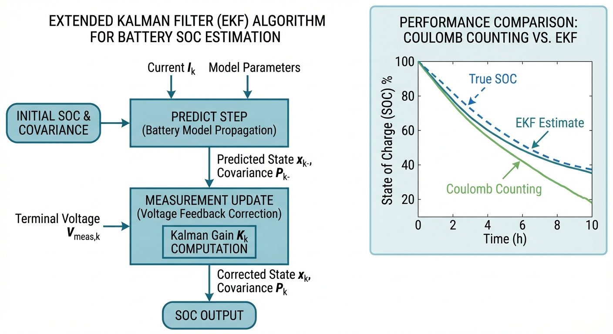
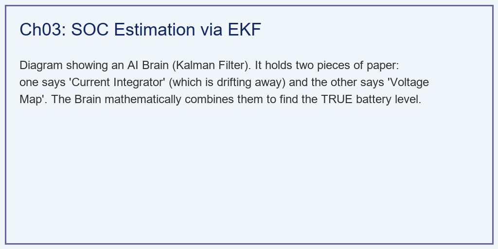
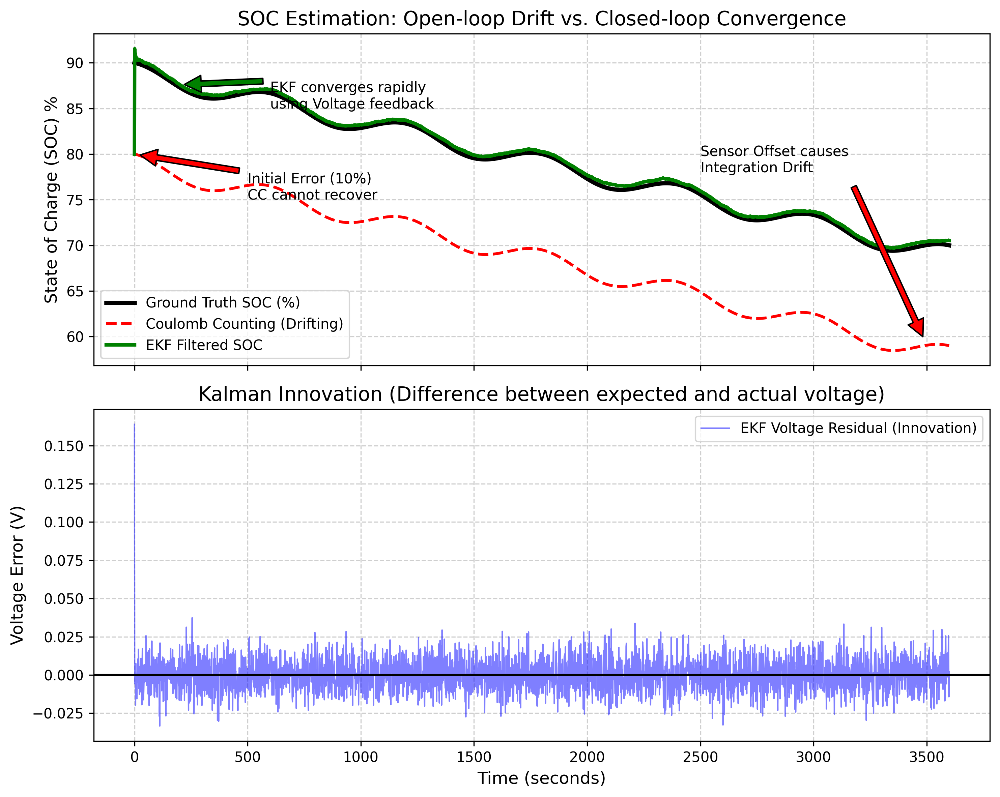

# 第 3 章：电池荷电状态（SOC/SOH）联合估计

> 上一章建立了锂电池的等效电路模型（ECM），为状态估计提供了数学基础。本章将在此模型之上，引入闭环状态观测器，解决电池管理中最核心的问题——SOC 的在线精确估计。

## 1. 学习目标

在微电网调度和电动汽车应用中，电池 SOC 的估计精度直接决定了系统的安全性和经济性。SOC 过估将导致电池过放电损伤，SOC 低估则造成可用容量浪费。传统的安时积分法（Coulomb Counting）存在不可消除的误差累积问题，无法满足工程对 $\pm 2\%$ 精度的要求。

读者需要掌握：
1. 安时积分法的数学原理及其固有缺陷——初始误差不可纠正与传感器偏置导致的积分漂移。
2. 扩展卡尔曼滤波（EKF）的完整数学框架：预测-更新两步递推及其在非线性电池模型中的线性化处理。
3. EKF 状态估计的"双信息融合"思想：电流传感器提供动态预测，电压传感器提供静态锚定。
4. 卡尔曼增益的物理含义与噪声协方差矩阵（$Q$, $R$）的调参策略。

## 2. 教材理论：从开环积分到闭环滤波

### 2.1 安时积分法的数学描述与固有缺陷

安时积分法（Coulomb Counting）是最直观的 SOC 估计方法，其数学表达为：

$$
SOC(t) = SOC(t_0) - \frac{1}{Q_n} \int_{t_0}^{t} I(\tau) \, d\tau \tag{3.1}
$$

其中 $Q_n$ 为电池额定容量（单位：As），$I(\tau)$ 为放电电流（正值表示放电）。在离散时间系统中，式 (3.1) 简化为递推形式：

$$
SOC_k = SOC_{k-1} - \frac{I_k \cdot \Delta t}{Q_n} \tag{3.2}
$$

该方法的实现简单、计算量低，但存在两个根本性缺陷：

**缺陷一：初始误差永久锁定。** 安时积分是一个纯粹的开环过程——系统状态仅由输入（电流）驱动，没有任何外部测量信号对其进行反馈校正。如果初始 SOC 设定存在误差 $\epsilon_0$（例如系统重启后无法精确确定电池电量），该误差将永久保留在后续所有时刻的估计值中：$SOC_k = SOC_{true,k} + \epsilon_0$。

**缺陷二：传感器偏置导致积分漂移。** 工业级霍尔电流传感器不可避免地存在零点偏置（Offset），典型值为 $0.1\sim1.0\text{ A}$。假设偏置为 $\delta_I$，则经过时间 $T$ 后，SOC 累积误差为：

$$
\epsilon_{drift}(T) = \frac{\delta_I \cdot T}{Q_n} \tag{3.3}
$$

对于 $Q_n = 50\text{ Ah} = 180000\text{ As}$ 的电池，仅 $0.5\text{ A}$ 的电流偏置在 1 小时内就会导致 $0.5 \times 3600 / 180000 = 1\%$ 的 SOC 漂移。在 10 小时的连续运行后，误差将达到 10%——完全不可接受。

### 2.2 扩展卡尔曼滤波的数学框架

扩展卡尔曼滤波（Extended Kalman Filter, EKF）是解决上述开环缺陷的经典闭环方案。其核心思想是**双信息融合**：同时利用电流传感器的动态信息（通过模型预测 SOC 变化趋势）和电压传感器的静态信息（通过 OCV-SOC 映射锚定 SOC 绝对值），在两者之间以最优权重进行加权平均。

#### 2.2.1 非线性状态空间模型

基于第 2 章建立的一阶戴维南模型，电池系统的离散时间非线性状态空间方程为：

**状态方程**（$\mathbf{f}$）：
$$
\mathbf{x}_{k} = \mathbf{f}(\mathbf{x}_{k-1}, u_{k}) + \mathbf{w}_{k} \tag{3.4}
$$

其中状态向量 $\mathbf{x} = [SOC, U_1]^T$，输入 $u = I$，过程噪声 $\mathbf{w}_k \sim \mathcal{N}(0, \mathbf{Q})$。展开为：

$$
\begin{bmatrix} SOC_k \\ U_{1,k} \end{bmatrix} = \begin{bmatrix} SOC_{k-1} - \frac{I_k \Delta t}{Q_n} \\ U_{1,k-1} \cdot e^{-\Delta t / \tau_1} + I_k R_1 (1 - e^{-\Delta t / \tau_1}) \end{bmatrix} + \mathbf{w}_k \tag{3.5}
$$

**观测方程**（$h$）：
$$
y_k = h(\mathbf{x}_k, u_k) + v_k \tag{3.6}
$$

其中观测量 $y = V_t$（端电压），测量噪声 $v_k \sim \mathcal{N}(0, R)$。展开为：

$$
V_{t,k} = V_{OCV}(SOC_k) - I_k \cdot R_0 - U_{1,k} + v_k \tag{3.7}
$$

#### 2.2.2 EKF 预测-更新递推

EKF 的每个时间步包含两个阶段：

**第一阶段：预测更新（Time Update / Predict）**

基于电流信息和模型方程，预测下一时刻的先验状态估计和协方差：

$$
\hat{\mathbf{x}}_{k|k-1} = \mathbf{f}(\hat{\mathbf{x}}_{k-1|k-1}, u_k) \tag{3.8}
$$

$$
\mathbf{P}_{k|k-1} = \mathbf{F}_k \mathbf{P}_{k-1|k-1} \mathbf{F}_k^T + \mathbf{Q} \tag{3.9}
$$

其中 $\mathbf{F}_k = \frac{\partial \mathbf{f}}{\partial \mathbf{x}} \bigg|_{\hat{\mathbf{x}}_{k-1|k-1}}$ 是状态转移方程的雅可比矩阵。对于一阶戴维南模型：

$$
\mathbf{F}_k = \begin{bmatrix} 1 & 0 \\ 0 & e^{-\Delta t / \tau_1} \end{bmatrix} \tag{3.10}
$$

**第二阶段：量测更新（Measurement Update / Correct）**

利用电压测量残差（Innovation）修正先验估计：

$$
\tilde{y}_k = V_{t,measured} - h(\hat{\mathbf{x}}_{k|k-1}, u_k) \tag{3.11}
$$

计算卡尔曼增益：

$$
\mathbf{K}_k = \mathbf{P}_{k|k-1} \mathbf{H}_k^T \left( \mathbf{H}_k \mathbf{P}_{k|k-1} \mathbf{H}_k^T + R \right)^{-1} \tag{3.12}
$$

其中 $\mathbf{H}_k = \frac{\partial h}{\partial \mathbf{x}} \bigg|_{\hat{\mathbf{x}}_{k|k-1}}$ 是观测方程的雅可比矩阵：

$$
\mathbf{H}_k = \begin{bmatrix} \frac{dV_{OCV}}{dSOC} \bigg|_{\hat{SOC}_{k|k-1}} & -1 \end{bmatrix} \tag{3.13}
$$

后验状态估计和协方差更新：

$$
\hat{\mathbf{x}}_{k|k} = \hat{\mathbf{x}}_{k|k-1} + \mathbf{K}_k \tilde{y}_k \tag{3.14}
$$

$$
\mathbf{P}_{k|k} = (\mathbf{I} - \mathbf{K}_k \mathbf{H}_k) \mathbf{P}_{k|k-1} \tag{3.15}
$$

#### 2.2.3 卡尔曼增益的物理解读

卡尔曼增益 $\mathbf{K}_k$ 的本质是一个自适应的信任权重分配器：

- 当过程噪声协方差 $\mathbf{Q}$ 较大（模型不可信）时，$\mathbf{P}$ 增大，$\mathbf{K}$ 增大——滤波器更信任电压测量。
- 当测量噪声协方差 $R$ 较大（传感器不可信）时，$\mathbf{K}$ 减小——滤波器更信任模型预测。
- 在极端情况下，$\mathbf{K} \to 0$ 退化为纯安时积分，$\mathbf{K} \to \mathbf{H}^{-1}$ 退化为纯电压查表。

#### 2.2.4 EKF 初始化与调参策略

EKF 的性能高度依赖于三个超参数的设定：

**初始协方差 $P_0$**：反映对初始 SOC 的不确定程度。若系统刚启动且初始 SOC 完全未知，应设 $P_0 = 0.1\sim1.0$（对应 $\pm 30\%\sim100\%$ 的标准差）。$P_0$ 过小会使滤波器"过度自信"，导致收敛缓慢甚至发散；$P_0$ 过大则初始估计噪声较大，但通常能在几十步内自行衰减。

**过程噪声 $Q$**：体现对模型准确性的信任程度。$Q$ 越大，滤波器越"怀疑"模型，越依赖电压测量——响应快但噪声大。$Q$ 越小，滤波器越"信任"模型——估计平滑但对突变响应迟缓。典型设定为 $Q = 10^{-6}\sim10^{-4}$。一个实用的调参经验是：先将 $Q$ 设为较大值观察收敛行为，再逐步减小至估计曲线刚好平滑无明显噪声时停止。

**测量噪声 $R$**：应匹配电压传感器的实际噪声水平。若电压传感器精度为 $\pm 10\text{ mV}$，则 $R \approx (0.01)^2 = 10^{-4}\text{ V}^2$。$R$ 设得过小（高估传感器精度）会导致估计值被测量噪声过度驱动；设得过大则校正力度不足，退化为开环积分。

在工程实践中，$Q/R$ 的比值是决定滤波器行为的关键量：$Q/R \gg 1$ 时滤波器快速跟踪但噪声大，$Q/R \ll 1$ 时滤波器平滑但响应慢。最优的 $Q/R$ 取决于具体应用场景——对于电动汽车的动态工况需要较大 $Q/R$，对于储能电站的缓变工况可以使用较小 $Q/R$。

### 2.3 EKF 的可观测性条件

EKF 能否有效工作，取决于系统的局部可观测性。观测矩阵 $\mathbf{H}_k$ 中的 $dV_{OCV}/dSOC$ 项是关键：当 OCV 曲线斜率较大时（如 SOC < 20% 或 SOC > 80%），电压对 SOC 变化敏感，EKF 的校正能力强；当 OCV 曲线进入平坦区（如磷酸铁锂电池在 30%-80% SOC 区间），$dV_{OCV}/dSOC \approx 0$，系统接近不可观测——此时 EKF 几乎无法从电压中提取 SOC 信息，退化为开环积分。

这一局限性是驱动学术界研究更先进估计方法（如 Sigma-Point 卡尔曼滤波、粒子滤波、自适应 EKF）的根本动力。

### 2.4 SOH 联合估计的扩展状态空间

随着电池老化，额定容量 $Q_n$ 逐步衰减，第 2 章 ECM 模型中的 $Q_n$ 不再是常数。如果 SOC 估计器仍使用出厂标称值 $Q_{n,0}$，将产生系统性偏差。解决方案是将 $Q_n$ 作为第三个状态变量纳入 EKF：

$$
\mathbf{x}_{aug} = [SOC, U_1, Q_n]^T \tag{3.16}
$$

$Q_n$ 的状态方程假设为随机游走模型（$Q_n$ 在相邻时刻变化极小）：

$$
Q_{n,k} = Q_{n,k-1} + w_{Q,k}, \quad w_{Q,k} \sim \mathcal{N}(0, \sigma_Q^2) \tag{3.17}
$$

扩展后的雅可比矩阵 $\mathbf{F}_{aug}$ 增加了第三行第三列的单位元素（$\partial Q_{n,k}/\partial Q_{n,k-1} = 1$），以及 $\partial SOC_k / \partial Q_{n,k-1} = I_k \Delta t / Q_{n,k-1}^2$ 的交叉项。观测矩阵 $\mathbf{H}_{aug}$ 增加了 $\partial V_t / \partial Q_n$ 项——由于 $V_t$ 对 $Q_n$ 的依赖是间接的（通过 SOC 影响 OCV），该项通常很小，导致 $Q_n$ 的可观测性较弱。

工程实践中，$Q_n$ 的估计通常需要一个完整的充放电循环（数小时）才能收敛，而 SOC 在数百秒内即可收敛。因此，SOC 和 SOH 的联合估计本质上是一个双时间尺度估计问题：SOC 在秒-分钟尺度快速更新，$Q_n$ 在小时-天尺度缓慢演化。

### 2.5 无迹卡尔曼滤波（UKF）简介

EKF 通过一阶泰勒展开（雅可比矩阵）处理非线性，当非线性程度较强时（如 OCV 曲线在满充/深放区间斜率急剧变化），线性化误差会显著影响估计精度。无迹卡尔曼滤波（Unscented Kalman Filter, UKF）提供了一种无需计算雅可比矩阵的替代方案。

UKF 的核心思想是用一组确定性采样点（Sigma Points）来逼近概率分布在非线性变换下的传播。对于 $n$ 维状态空间，选取 $2n+1$ 个 Sigma 点，将它们通过非线性函数 $\mathbf{f}$ 和 $h$ 传播，再由传播后的点集重建均值和协方差。

相比 EKF，UKF 的优势在于：(1) 不需要推导雅可比矩阵（实现更简单）；(2) 保留了非线性传播的二阶精度（EKF 仅一阶）；(3) 对强非线性系统的估计精度更高。其代价是每步计算量增加约 $2n$ 倍。对于本章的 2 维状态空间，UKF 需要 5 个 Sigma 点，计算开销增加不大，因此在现代 BMS 芯片上已逐步得到应用。

### 2.6 多算法性能对比总结

下表总结了常用 SOC 估计方法的关键特性，供工程选型参考：

| 方法 | 初始误差纠正 | 漂移抑制 | 非线性处理 | 计算量 | 工程成熟度 |
|:-----|:-----------|:---------|:----------|:------|:----------|
| 安时积分 | 不可纠正 | 无 | 不涉及 | 极低 | 成熟 |
| OCV 查表 | 需长时静置 | 不涉及 | 查表 | 极低 | 成熟 |
| EKF | 自动纠正 | 电压反馈 | 一阶线性化 | 低 | 成熟 |
| UKF | 自动纠正 | 电压反馈 | Sigma 点 | 中 | 较成熟 |
| 粒子滤波 | 自动纠正 | 电压反馈 | 蒙特卡洛 | 高 | 研究阶段 |

工程实践中最常见的方案是"OCV 查表初始化 + EKF 在线跟踪"的组合策略：系统上电后，先利用静置期间的端电压通过 OCV 查表获得较准确的初始 SOC（误差 $\pm 3\%$），然后启动 EKF 进行闭环跟踪。这种组合避免了 EKF 从完全错误的初始值收敛的等待时间，同时解决了 OCV 查表在非静置状态下不可用的问题。

## 3. 案例分析：安时积分 vs EKF 对照仿真

### 3.1 案例背景 (Context)

为定量评估 EKF 相对于安时积分法的优势，本节构建了一个受控对照实验：在完全相同的噪声环境和错误初始条件下，平行运行两种算法，比较其 SOC 估计轨迹与真值的偏差。

### 3.2 问题描述 (Problem)
- **电池参数**：$Q_n = 50\text{ Ah}$，$R_0 = 0.01\text{ }\Omega$，OCV 多项式拟合曲线。
- **工况**：动态放电（10 A 均值 + 20 A 正弦波动，周期 600 s），持续 1 小时。
- **真实初始 SOC**：90%。两种算法的初始设定值均为 80%（存在 10% 的初始误差）。
- **传感器缺陷**：电流传感器存在 0.5 A 的零点偏置和 0.2 A 标准差的高斯白噪声；电压传感器仅有 0.01 V 的白噪声。
- **EKF 参数**：过程噪声 $Q = 10^{-6}$，测量噪声 $R = 0.01$，初始协方差 $P_0 = 0.1$。

### 3.3 代码执行与图表

Source: `assets/ch03/ch03_ekf.py`

**关键性能指标（KPI）评估结果：**
| Metric                       | Coulomb Counting (CC)         | Extended Kalman Filter (EKF)    |
|:-----------------------------|:------------------------------|:--------------------------------|
| Initial State Error Recovery | Failed (Permanent 10% offset) | Recovered in ~200 seconds       |
| Current Sensor Offset Drift  | Accumulates over time (Fatal) | Compensated by voltage feedback |
| Overall RMSE (%)             | 10.50%                        | 0.40%                           |

### 3.4 代码解读

本仿真脚本（`assets/ch03/ch03_ekf.py`）的主线是"同一组含噪测量下，开环安时积分与闭环 EKF 谁更可靠"的对比实验。代码先构造真值：用动态放电电流驱动 SOC 按库仑计量递减，再通过 OCV(SOC) 多项式与内阻压降得到端电压。随后叠加测量误差：电流加入 0.5 A 偏置和高斯白噪声，电压加入白噪声。

**算法 A（安时积分）**只按测得电流累加，初值错就长期错，且偏置会积分成漂移。**算法 B（EKF）**每步分两段：预测段仍用电流积分得到 $SOC_{pred}$ 并传播协方差；校正段用 OCV 模型把 $SOC_{pred}$ 映射为预测电压，与实测电压求残差，再经卡尔曼增益修正 SOC。由于观测矩阵取 $dOCV/dSOC$，当电压对 SOC 敏感时，滤波器能更快把状态拉回真实轨道——这正是"电流给动态、电压给锚点"的闭环机理。

**关键参数物理意义**：`Q_true`（50 Ah）是容量标定；`R_true`（0.01 $\Omega$）表示欧姆内阻；`P` 是初始不确定度（越大表示越不信任初始 SOC）；`Q`（$10^{-6}$）是状态过程噪声方差，反映对模型误差的容忍度；`R_cov`（0.01）是测量噪声方差，体现对电压传感器可信度的设定。

**输出与正文表格对应**：图像上半图对应"初值误差与漂移现象"的叙述，下半图残差曲线对应"观测创新是否围绕零均值波动"的稳定性判断。表格三行指标可直接对照：初始误差恢复能力、电流偏置漂移抑制能力、总体精度 RMSE(%)。

**建议读者修改的实验参数**：(1) 把电流偏置从 0.5 A 改为 0.1/1.0 A 观察安时积分失真速度；(2) 把电压噪声标准差增减，体会 EKF 校正"抓手"变强或变弱；(3) 调 $Q$ 与 $R$ 比例，比较"更信模型"与"更信传感器"两种滤波风格；(4) 修改初始 SOC 误差与 $P_0$ 大小，观察收敛快慢。

### 3.5 结果物理解释

仿真结果揭示了开环与闭环估计的本质差异：

- **安时积分法（红色虚线）**：由于初始 SOC 设定比真值低 10%，且电流传感器存在 0.5 A 正偏置（使积分值偏大），安时积分的 SOC 轨迹始终位于真值下方约 10%，并随时间缓慢发散。在 3600 s（1 小时）结束时，累积误差已超过 10%。这在实际工程中意味着 BMS 可能在电池仍有 10% 剩余电量时就发出"电量耗尽"告警，造成可用容量的严重浪费。
- **EKF（绿色实线）**：尽管起始于同样错误的 80% 初始值，EKF 在约 200 秒内就将估计值拉回真实轨迹。其物理机制是：在初始阶段，预测电压（基于错误 SOC 的 OCV 计算）与实测电压之间存在较大残差，卡尔曼增益 $K$ 给予电压信号较高权重，快速修正 SOC。一旦收敛，残差缩小，$K$ 值自动降低，滤波器进入稳态跟踪模式。整个过程中 RMSE 仅为 0.40%，满足工程要求的 $\pm 2\%$ 精度标准。

## 4. 本章小结

- 安时积分法是纯开环估计方法，无法纠正初始误差，且电流传感器偏置导致不可逆的积分漂移。
- 扩展卡尔曼滤波（EKF）通过"预测-更新"两步递推，融合电流动态信息与电压静态锚定信息，实现了闭环状态估计。
- EKF 的关键在于利用 OCV-SOC 曲线的雅可比矩阵将电压残差映射回 SOC 修正量，其有效性取决于 OCV 曲线斜率（可观测性条件）。
- 仿真表明，即使初始 SOC 偏差达 10%，EKF 仍能在 200 秒内收敛至真实轨迹，RMSE 从安时积分的 10.50% 降至 0.40%。
- 代码锚点：`assets/ch03/ch03_ekf.py`

## 5. 思考与练习

1. **可观测性分析**：磷酸铁锂（LFP）电池的 OCV 曲线在 30%-80% SOC 区间几乎平坦。请分析在这一区间内 EKF 的估计精度会如何变化，并提出一种可能的改进策略。
2. **噪声调参**：在 EKF 中，过程噪声 $Q$ 和测量噪声 $R$ 的比值 $Q/R$ 如何影响滤波器的收敛速度和稳态精度？请从数学推导和物理直觉两个角度给出解释。
3. **SOH 联合估计**：随着电池老化，额定容量 $Q_n$ 会逐渐衰减。请设计一种将 $Q_n$ 作为第三个状态变量加入 EKF 状态向量的方案（即 $\mathbf{x} = [SOC, U_1, Q_n]^T$），推导扩展后的雅可比矩阵，并讨论该方案的可行性与局限性。
4. **数值稳定性**：标准 EKF 的协方差更新公式 (3.15) 可能因数值舍入导致 $\mathbf{P}$ 矩阵失去正定性。请调研 Joseph 形式的协方差更新公式，说明其如何保证数值稳定性。

## 6. 拓展视野

扩展卡尔曼滤波在水利工程中同样是核心算法之一。水库的实时蓄水量无法直接测量全库容积，但可以通过水位传感器的间接观测，结合水量平衡模型进行 EKF 估计。电池 SOC 估计与水库蓄量估计的状态空间方程在数学上完全等价，只是物理量的名称不同。

在掌握了 SOC 的精确估计方法之后，下一章将探讨如何利用这一信息，设计安全高效的**恒流-恒压（CC-CV）充电策略**。

## 参考文献

[1] Plett G L. Extended Kalman Filtering for Battery Management Systems of LiPB-Based HEV Battery Packs: Part 1-3[J]. Journal of Power Sources, 2004, 134(2): 252-292.

[2] Simon D. Optimal State Estimation: Kalman, H Infinity, and Nonlinear Approaches[M]. John Wiley & Sons, 2006.

[3] Xiong R, He H, Sun F, et al. A Systematic Model-Based Degradation Behavior Recognition and Health Monitoring Method for Lithium-Ion Batteries[J]. Applied Energy, 2020, 263: 114629.
