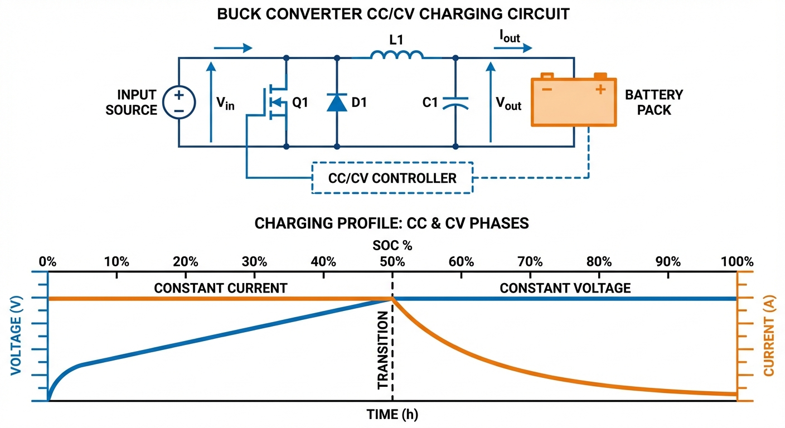
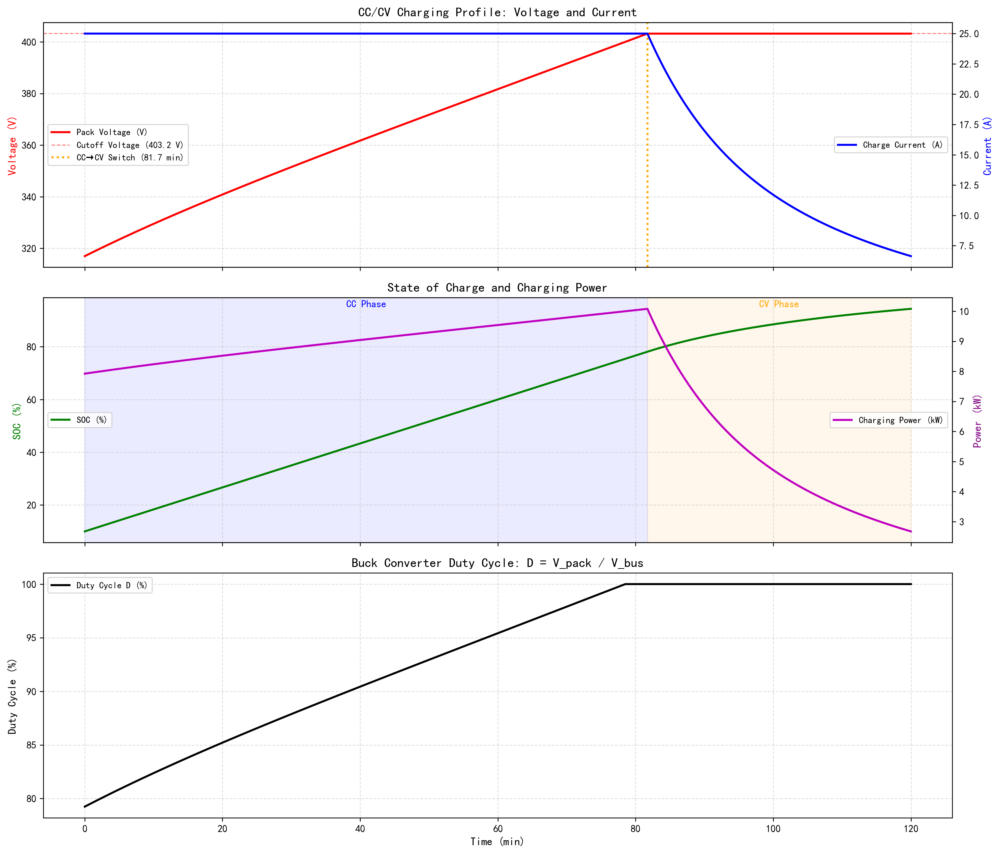

# 第 4 章：恒流-恒压（CC-CV）充电策略

> 上一章介绍了 EKF 状态估计方法，使 BMS 能够精确跟踪电池 SOC。本章将利用这一信息，深入探讨储能系统中最经典、应用最广泛的充电控制策略——恒流/恒压（CC/CV）切换逻辑。

## 1. 学习目标

储能变流器（Power Conversion System, PCS）是电池与电网之间的功率变换枢纽。充电过程的核心挑战在于：既要以尽可能高的速率向电池灌注能量（缩短充电时间），又不能使端电压超过截止阈值（否则将导致锂枝晶生长、电解液分解甚至热失控）。CC-CV 策略在这两个矛盾目标之间取得了工程上最实用的平衡。

读者需要掌握：
1. Buck 降压斩波器的拓扑结构与占空比方程：$V_{out} = D \cdot V_{in}$。
2. CC 阶段与 CV 阶段的物理意义、数学描述及切换判据。
3. 一阶戴维南电池模型在 CC/CV 仿真中的应用。
4. 占空比 $D$ 随 SOC 上升的动态调节规律及其工程含义。
5. PQ 解耦控制与构网型储能的基本概念。

## 2. 教材理论：从"开关波形"到"充电曲线"

### 2.1 DC/DC Buck 降压斩波器

储能系统通过 PCS 与直流母线连接。当直流母线电压 $V_{bus}$ 高于电池组电压 $V_{pack}$ 时，需要 Buck（降压）拓扑将母线电压降至电池可接受的范围。Buck 变换器的核心元件包括高频开关管（MOSFET 或 IGBT）、续流二极管、电感和电容。在稳态连续导通模式（CCM）下，输出电压与输入电压的关系由 PWM 占空比 $D$ 唯一确定：

$$
V_{pack} = D \cdot V_{bus}, \quad D \in [0, 1] \tag{4.1}
$$

这一关系的推导基于电感的伏秒平衡原理。在开关管导通期间（$0 \leq t \leq DT_s$），电感两端电压为 $V_{bus} - V_{pack}$，电流线性上升；在开关管关断期间（$DT_s \leq t \leq T_s$），电感通过续流二极管放电，两端电压为 $-V_{pack}$，电流线性下降。稳态条件要求一个开关周期内电感电流的净变化为零：

$$
(V_{bus} - V_{pack}) \cdot DT_s = V_{pack} \cdot (1-D)T_s \tag{4.2}
$$

化简即得式 (4.1)。随着电池 SOC 上升、OCV 升高，$V_{pack}$ 持续增大，$D$ 必须同步增大以维持恒定充电电流。当 $V_{pack}$ 逼近截止电压 $V_{cutoff}$ 时，$D$ 趋近上限——这正是 CC 阶段结束、CV 阶段开始的物理信号。

### 2.2 CC/CV 两阶段充电策略的数学描述

锂电池充电的工业标准策略分为两个紧密衔接的阶段：

**CC（恒流）阶段**：以固定电流 $I_{cc}$（通常 0.5C 至 1C）向电池灌注能量。此阶段 SOC 以恒定斜率上升：

$$
\frac{dSOC}{dt} = \frac{I_{cc}}{Q_n} \tag{4.3}
$$

端电压随 OCV 上升而近似线性增长。充电功率 $P = V_t \cdot I_{cc}$ 近似恒定，是"快速灌注"阶段。CC 阶段的终止判据是端电压达到截止值：

$$
V_t = V_{OCV}(SOC) + I_{cc} \cdot R_0 + U_1 \geq V_{cutoff} \tag{4.4}
$$

**CV（恒压）阶段**：当端电压触及截止电压 $V_{cutoff}$（单体 4.2 V）时，控制器切换为恒压模式，将端电压钳位在 $V_{cutoff}$。此阶段的充电电流由电池模型被动决定：

$$
I_{cv} = \frac{V_{cutoff} - V_{OCV}(SOC) - U_1}{R_0} \tag{4.5}
$$

随着 SOC 继续上升，$V_{OCV}$ 逼近 $V_{cutoff}$，分子趋近于零，电流呈指数衰减。当电流降至 C/20 以下时，视为充满。CV 阶段的充电功率 $P = V_{cutoff} \cdot I_{cv}$ 持续递减，是"涓流收尾"阶段。

### 2.3 Buck 变换器的电感电流纹波与滤波设计

式 (4.1) 给出的是稳态平均值关系。实际上，电感电流在每个开关周期内呈锯齿形波动。电感电流纹波的峰-峰值为：

$$
\Delta I_{L} = \frac{(V_{bus} - V_{pack}) \cdot D}{L \cdot f_s} = \frac{V_{pack}(1 - D)}{L \cdot f_s} \tag{4.2a}
$$

其中 $L$ 为滤波电感值，$f_s$ 为开关频率。该纹波叠加在平均充电电流之上，流入电池内部产生额外的脉动热损耗 $Q_{ripple} = \frac{(\Delta I_L)^2}{12} \cdot R_0$（假设三角波有效值为峰-峰值的 $1/(2\sqrt{3})$ 倍）。

工程设计中，通常要求电流纹波不超过平均电流的 10%-20%，据此可确定最小电感值：

$$
L_{min} = \frac{V_{pack}(1 - D)}{f_s \cdot \Delta I_{L,max}} \tag{4.2b}
$$

以本章案例参数为例：$V_{pack} \approx 370\text{ V}$，$D \approx 0.925$，$f_s = 20\text{ kHz}$，$\Delta I_{L,max} = 0.1 \times 25 = 2.5\text{ A}$，代入得 $L_{min} = 370 \times 0.075 / (20000 \times 2.5) \approx 0.56\text{ mH}$。工程上取 $L = 1\text{ mH}$ 留有裕量。

输出端并联电容 $C_{out}$ 的作用是平滑电压纹波。电容电压纹波近似为：

$$
\Delta V_{out} \approx \frac{\Delta I_L}{8 f_s C_{out}} \tag{4.2c}
$$

对于锂电池充电场景，电压纹波需要控制在 $\pm 50\text{ mV}$ 以内（避免影响 BMS 的电压采样精度），据此选择 $C_{out}$。

### 2.4 CC 与 CV 阶段的时长比例分析

CC/CV 两阶段的时长比例取决于电池参数和充电倍率。在典型的 0.5C 充电工况下：

- CC 阶段：SOC 从 10% 充至约 70%-80%，充入约 80% 的总能量，耗时约占总充电时间的 2/3。
- CV 阶段：SOC 从 80% 充至 94%（截止电流为 C/20 时），充入约 20% 的总能量，耗时约占 1/3。

CC 与 CV 的时长比约为 2:1，这一比例是锂电池充电的普遍经验规律。若采用 1C 快充，CC 阶段时长缩短，但 CV 阶段几乎不变（因为 CV 阶段的衰减速度由 $R_0$ 和 OCV 曲线斜率决定，与 CC 倍率无关），导致 CV 占比增大。

### 2.5 CC-CV 切换的控制实现

从控制工程的角度，CC-CV 切换本质上是一个**双模式控制器**（Dual-Mode Controller）的模式切换问题。在 CC 阶段，控制器以充电电流为被控量，通过调节占空比 $D$ 来维持 $I_{charge} = I_{cc}$；在 CV 阶段，控制器以端电压为被控量，通过调节 $D$ 来维持 $V_t = V_{cutoff}$。

CC 阶段的闭环电流控制可采用 PI 控制器：

$$
D_{cc}(t) = K_{p,I} \cdot e_I(t) + K_{i,I} \int_0^t e_I(\tau) d\tau, \quad e_I = I_{cc} - I_{measured} \tag{4.5a}
$$

CV 阶段的闭环电压控制同样采用 PI 控制器：

$$
D_{cv}(t) = K_{p,V} \cdot e_V(t) + K_{i,V} \int_0^t e_V(\tau) d\tau, \quad e_V = V_{cutoff} - V_{measured} \tag{4.5b}
$$

切换逻辑为：当 CC 阶段检测到 $V_t \geq V_{cutoff}$ 时，控制器从式 (4.5a) 平滑切换至式 (4.5b)。为避免切换瞬间的电流阶跃（可能损伤电池），工程上通常采用"防积分饱和"（Anti-Windup）技术：在切换前将 CV 控制器的积分项初始化为当前占空比值 $D_{cc,last}$，确保输出连续。

在数字控制器（MCU）实现中，上述 PI 控制器以离散差分形式运行，更新周期与 PWM 载波周期同步（通常 50-100 $\mu$s），远快于电池的电化学动态（秒级），因此控制带宽充裕。

### 2.6 PQ 解耦控制与构网型储能

在交流侧，DC/AC 逆变器需要实现有功功率 $P$ 和无功功率 $Q$ 的独立控制。传统跟网型（Grid-Following）逆变器依赖锁相环（PLL）跟踪电网频率，在 $dq$ 旋转坐标系中实现电流解耦控制：

$$
P = \frac{3}{2}(v_d i_d + v_q i_q), \quad Q = \frac{3}{2}(v_q i_d - v_d i_q) \tag{4.6}
$$

当 $v_q = 0$（PLL 锁定后），有功功率完全由 $i_d$ 控制，无功功率由 $i_q$ 控制，实现了 PQ 解耦。

构网型（Grid-Forming）逆变器通过虚拟同步发电机（VSG）算法，主动建立电压和频率基准，使储能可以在孤岛模式下独立运行。这是第 1 章虚拟惯量概念在变流器控制层面的直接工程实现。VSG 的核心方程模拟了同步发电机的转子运动方程：

$$
J_{vir} \frac{d\omega}{dt} = P_{ref} - P_{out} - D_p(\omega - \omega_0) \tag{4.7}
$$

其中 $J_{vir}$ 为虚拟转动惯量，$D_p$ 为阻尼系数，$\omega_0$ 为额定角频率。$J_{vir}$ 越大，频率变化越平缓，但动态响应越慢——这与第 1 章式 (1.3) 的摇摆方程在数学结构上完全一致。

在微电网孤岛运行场景中，多台构网型储能逆变器通过下垂特性自动分配有功和无功负荷，无需上层通信协调。这种"即插即用"的自主运行能力是构网型技术相比跟网型的根本优势。

### 2.7 多阶段充电策略的比较

除了经典的 CC-CV 策略外，工业界和学术界还发展了多种改进策略：

**阶梯恒流（Multi-Step CC, MSCC）**：将 CC 阶段细分为多个递减电流阶梯（如 1C→0.8C→0.6C→0.4C），每个阶梯以固定电压阈值切换。MSCC 的优势在于降低了充电后期的极化损耗，使电池温升更均匀。数学上，第 $j$ 阶梯的切换判据为：

$$
V_t \geq V_{switch,j} = V_{cutoff} - (n-j) \cdot \Delta V_{step} \tag{4.8}
$$

其中 $n$ 为总阶梯数，$\Delta V_{step}$ 为电压阶梯间距。

**脉冲充电（Pulse Charging）**：以固定频率交替施加充电脉冲和静置（或短暂放电），利用静置期间消除极化过电压，使后续充电脉冲能以更高电流注入。脉冲充电可在不超过截止电压的前提下提高平均充电电流，但需要更复杂的控制逻辑和更高的功率变换器带宽。

**恒功率充电（CP）**：保持充电功率 $P = V_t \cdot I$ 恒定。随着 $V_t$ 上升，$I$ 自动下降，比 CC 策略更温和。CP 模式常用于储能电站的功率调度场景——电网侧关注的是恒定的功率消纳能力，而非恒定的充电电流。

这些策略在充电时间、温升、寿命损耗等维度上各有优劣。CC-CV 因其实现简单、效果可靠，在短期内仍将是工业主流。

## 3. 案例分析：CC/CV 充电过程全链路仿真

### 3.1 案例背景 (Context)

某储能电站的 BMS 团队需要验证 96 串锂电池组（额定电压 355 V，截止电压 403.2 V）在 0.5C 恒流充电策略下的完整 CC/CV 切换过程。电池组通过 400 V 直流母线经 Buck 变换器充电。

### 3.2 问题描述 (Problem)
- **电池组**：96 串 1 并，单体容量 50 Ah，$R_0 = 0.008$ $\Omega$/cell，$R_1 = 0.005$ $\Omega$/cell，$C_1 = 3000$ F。
- **充电参数**：CC 电流 25 A（0.5C），CV 截止电压 403.2 V，CV 终止电流 2.5 A（C/20）。
- **直流母线**：$V_{bus} = 400$ V，Buck 变换器效率理想化。
- **初始条件**：SOC = 10%，环境温度 25°C。
- **任务**：绘制完整的电压-电流-SOC-占空比时间曲线，标注 CC→CV 切换点。

### 3.3 解题思路 (Solution Approach)
1. **OCV-SOC 曲线**：三阶多项式拟合，$V_{cell} = 3.0 + 1.0 \cdot SOC + 0.2 \cdot SOC^2 - 0.05 \cdot SOC^3$。
2. **CC 阶段**：固定电流 25 A，每步更新极化电压 $U_1$ 和 SOC，计算端电压。
3. **切换判据**：当 $V_{terminal} \geq V_{cutoff}$ 时，进入 CV 阶段。
4. **CV 阶段**：固定 $V_{terminal} = V_{cutoff}$，反算电流 $I = (V_{cutoff} - OCV - U_1) / R_0$。
5. **占空比**：$D = V_{terminal} / V_{bus}$，直接反映 Buck 变换器的调制状态。

### 3.4 代码执行与图表

> **学习提示**：请关注上方子图中红色电压曲线和蓝色电流曲线的"交叉时刻"——那就是 CC→CV 的切换点。CC 阶段电流恒定、电压线性上升；CV 阶段电压恒定、电流指数衰减。

Source: `assets/ch04/ch04_ccv_charging.py`

**CC/CV 充电过程关键性能指标：**

| 指标 | 数值 |
|:-----|:-----|
| CC 阶段时长 (min) | 81.7 |
| CV 阶段时长 (min) | 38.2 |
| 总充电时间 (min) | 120.0 |
| 终止 SOC (%) | 94.4 |
| 总充入能量 (kWh) | 15.6 |
| 峰值充电功率 (kW) | 10.1 |

**CC/CV 充电全过程电压-电流-SOC-占空比仿真图：**

### 3.5 代码解读

本仿真脚本（`assets/ch04/ch04_ccv_charging.py`）实现了"恒流转恒压"充电的全链路仿真。核心是将电池等效为一阶戴维南模型，在离散时间步内执行模式切换。主循环每秒执行一次：先由当前 SOC 计算开路电压，再按当前模式（CC 或 CV）计算端电压与充电电流。

恒流阶段固定电流为 `I_cc`（25 A），端电压按"开路电压 + 欧姆压降 + 极化电压"叠加；一旦端电压达到电池包上限 `V_pack_max`（403.2 V），立即切入恒压阶段。恒压阶段将端电压钳在上限，用反算公式 $I = (V_{cutoff} - OCV - U_1) / R_0$ 得到充电电流，随电池逐步充满而自然衰减；当电流降到 `I_cv_cutoff`（2.5 A）以下即判定充电完成。每一步还同步更新极化支路状态 `U1`、用库仑计量更新 SOC、按 $D = V_{pack}/V_{bus}$ 计算 Buck 占空比。

**关键参数物理含义**：`V_bus`（400 V）决定变换器可用调节空间；`R0`（0.768 $\Omega$ 全包）表征瞬时内阻，越大则 CC 阶段越早触顶转入 CV；`R1`（0.48 $\Omega$）和 `C1`（3000 F）描述极化动态；`I_cc`（25 A）决定充电速率；`I_cv_cutoff`（2.5 A）是充电终止判据。

**建议读者修改的实验参数**：提高 `I_cc` 至 1C（50 A）观察快充下更早进入 CV 与更高峰值功率；调大 `R0` 比较内阻老化对充电时长的影响；改变 `I_cv_cutoff` 体会更严格截止条件带来的更长尾充时间；修改初始 SOC 比较不同起点下 CC 与 CV 阶段占比变化。

### 3.6 实验验证与结果剖析

这组仿真完整呈现了锂电池充电的两阶段动力学：

- **上方子图（电压与电流）**：红色电压曲线在 CC 阶段（0~81.7 min）近似线性上升，反映了 OCV 随 SOC 增长的单调特性。蓝色电流在 CC 阶段保持 25 A 恒定。在 $t=81.7$ min 处，电压触及 403.2 V 截止线，控制器切换至 CV 模式——电压被钳位，电流开始指数衰减。CC 与 CV 的时长比约为 2:1，与工程经验一致。
- **中间子图（SOC 与功率）**：CC 阶段 SOC 以恒定斜率上升（功率恒定），CV 阶段 SOC 增速放缓（功率递减）。最终 SOC 达到 94.4%——剩余 5.6% 需要更长时间的涓流充电，工程上通常不等待。
- **下方子图（Buck 占空比）**：占空比 $D$ 从初始的 ~75% 逐步上升至接近 100%。当 $D$ 逼近 1.0 时，Buck 变换器几乎失去调节余量——这正是 CC 阶段必须终止的根本原因。该现象揭示了一个重要的工程约束：母线电压 $V_{bus}$ 必须高于电池满充电压，否则 CC 阶段将提前中止。

### 3.7 工业部署与运行建议

1. **CC 电流选择**：0.5C 可在 2 小时内完成充电，但 1C 快充会导致极化内阻产热增加 4 倍（$Q = I^2 R$），需配合液冷系统（见第 7 章）。
2. **CV 阶段截止判据**：工程上通常以 C/20（本例 2.5 A）为终止条件。过早截止会损失 5-10% 的容量利用率，过晚截止会延长充电时间且对寿命无益。
3. **母线电压裕度**：$V_{bus}$ 应至少高于 $V_{cutoff}$ 的 5-10%，以确保 CV 阶段仍有调节余量。本例 $V_{bus} = 400\text{ V}$ 略低于 $V_{cutoff} = 403.2\text{ V}$，在实际工程中应适当提高。

### 3.7 充电效率的全链路分析

从电网到电池的充电过程涉及多级功率变换，每一级都存在效率损耗。全链路效率为各级效率的乘积：

$$
\eta_{total} = \eta_{AC/DC} \cdot \eta_{DC/DC} \cdot \eta_{cell} \tag{4.9}
$$

其中：
- $\eta_{AC/DC}$：交流-直流整流效率，通常 95%-97%。
- $\eta_{DC/DC}$：Buck 变换器效率，通常 95%-98%，主要损耗来自开关管导通电阻和开关损耗。
- $\eta_{cell}$：电池充电效率（库仑效率），锂电池通常 >99%，但在低温或高倍率下可能降至 95%。

以本案例为例：$\eta_{total} \approx 0.96 \times 0.97 \times 0.995 = 92.6\%$。充入电池的 15.6 kWh 能量，实际从电网消耗约 $15.6/0.926 = 16.8\text{ kWh}$。这 1.2 kWh 的损耗以热量形式释放在 PCS 和电池内部，是热管理系统（第 7 章）必须考虑的热源。

在储能电站的全生命周期经济分析中，充放电往返效率（Round-Trip Efficiency, RTE）= $\eta_{charge} \times \eta_{discharge}$ 是决定套利收益的关键参数。RTE 每降低 1%，年化收益将减少约 1%-2%。

## 4. 本章小结

- Buck 降压斩波器通过占空比 $D$ 调节输出电压，是储能充电的核心功率变换拓扑。其工作原理基于电感的伏秒平衡。
- CC/CV 两阶段充电策略兼顾了充电速度和电池安全，CC 与 CV 时长比约为 2:1。CC 阶段充入约 80% 能量，CV 阶段完成剩余 20%。
- 占空比 $D$ 逼近 1.0 是 CC→CV 切换的物理信号，反映了 Buck 变换器调节裕度的耗尽。
- CV 阶段的电流衰减速度由 $R_0$ 和 OCV 曲线斜率决定，与 CC 阶段的充电倍率基本无关。
- 代码锚点：`assets/ch04/ch04_ccv_charging.py`

## 5. 思考与练习

1. **Boost 升压拓扑**：当电池组电压高于直流母线电压时，需要 Boost 拓扑。请推导 Boost 变换器在 CCM 下的占空比方程 $V_{out} = V_{in}/(1-D)$，并说明其在放电场景中的应用。
2. **快充策略对比**：查阅文献，比较 CC-CV、阶梯恒流（Multi-Step CC）和脉冲充电（Pulse Charging）三种策略在充电时间、容量利用率和电池寿命方面的优劣。
3. **热约束整合**：在 CC 阶段，若电池表面温度超过 40°C，应如何动态降低充电电流？请设计一个基于 PID 控制的温度限流逻辑，给出控制框图。
4. **母线电压设计**：请分析为什么本例中 $V_{bus} = 400\text{ V}$ 略低于 $V_{cutoff} = 403.2\text{ V}$ 会导致工程问题，并计算满足 CV 阶段全程可控的最低母线电压。

## 6. 拓展视野

恒流-恒压切换策略的本质是"先快后慢"的分段控制。在水利工程中，水库的分段调度规则（汛限水位以下快速蓄水、接近正常蓄水位后缓慢充蓄）与 CC-CV 的控制逻辑异曲同工，都是在效率和安全之间寻求最优平衡。

在掌握了单个电池的充电控制之后，下一章将视角扩展至串联电池组，探讨多电芯不一致性引发的"木桶效应"以及**BMS 均衡控制**的解决方案。

## 参考文献

[1] Mohan N, Undeland T M, Robbins W P. Power Electronics: Converters, Applications, and Design[M]. 3rd ed. Wiley, 2003.

[2] Plett G L. Battery Management Systems, Volume I: Battery Modeling[M]. Artech House, 2015.

[3] Luo F L, Ye H. Power Electronics: Advanced Conversion Technologies[M]. 2nd ed. CRC Press, 2018.
