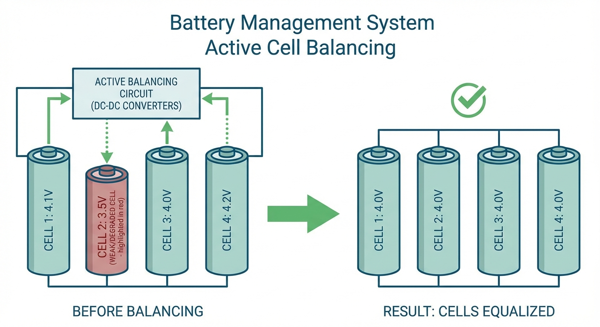
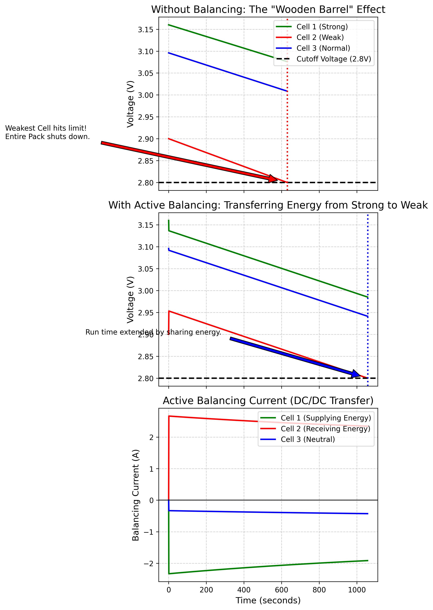
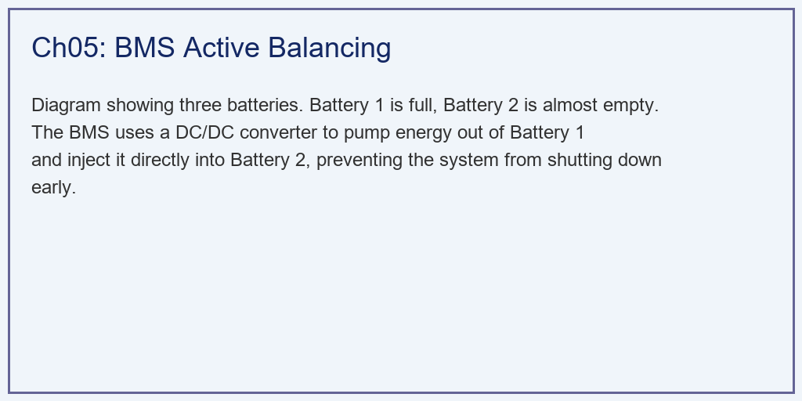

# 第 5 章：电池管理系统（BMS）与均衡控制

> 上一章讨论了单个电池的 CC-CV 充电策略。然而，储能电站中成百上千的电芯串联运行，单体不一致性问题成为制约系统性能的关键瓶颈。本章将深入探讨 BMS 均衡控制如何破解这一"木桶效应"。

## 1. 学习目标

串联电池组在长期运行中不可避免地出现单体不一致性——由制造工艺离散性、温度梯度和老化速率差异等因素共同导致。这种不一致性引发了严重的**短板效应（木桶效应）**：系统可用容量由最弱电芯决定，而非所有电芯的平均水平。

读者需要掌握：
1. 串联电池组不一致性的物理来源与量化表征方法。
2. 被动均衡（Passive Balancing）的电路拓扑与能量耗散机制。
3. 主动均衡（Active Balancing）的 DC/DC 能量转移拓扑及其控制策略。
4. 基于 SOC 偏差的比例均衡控制器设计与参数整定。
5. 均衡控制对系统可用容量和运行寿命的定量影响。

## 2. 教材理论：从"各自为政"到"协同共生"

### 2.1 串联电池组不一致性的物理来源

在储能系统中，为了达到所需的系统电压（如 400 V 直流母线），通常需要 96 个以上的电芯串联。串联意味着所有电芯流过完全相同的电流——这是一个强耦合的物理约束。然而，每颗电芯的内部参数并不完全相同：

- **容量不一致性**：制造过程中活性材料涂布厚度的微小差异，导致各电芯实际可用容量存在 $\pm 2\%\sim5\%$ 的离散。
- **内阻不一致性**：电极片的压实密度差异、极耳焊接质量差异，导致各电芯欧姆内阻存在 $\pm 10\%\sim20\%$ 的离散。
- **自放电率不一致性**：隔膜微缺陷导致部分电芯具有更高的内部漏电流。
- **温度梯度效应**：电池模组内部的中心电芯与边缘电芯散热条件不同，温差可达 5-10°C，导致电化学反应速率差异。

经过数百次循环后，这些初始微小差异会通过正反馈机制持续放大：容量小的电芯 SOC 变化更快、更易触发过充/过放保护、更早进入加速老化区间。

**不一致性的量化表征**：工程上通常用极差（Range）和标准差（Standard Deviation）来衡量电池组的不一致性程度。对于 $N$ 个串联电芯，SOC 不一致性指标定义为：

$$
\sigma_{SOC} = \sqrt{\frac{1}{N}\sum_{i=1}^{N}(SOC_i - \overline{SOC})^2} \tag{5.1a}
$$

$$
\Delta_{SOC} = \max_i(SOC_i) - \min_i(SOC_i) \tag{5.1b}
$$

对于新出厂电池组，$\sigma_{SOC}$ 通常在 1%-2%；经过 1000 次循环后，该值可增大至 5%-10%。当 $\Delta_{SOC} > 15\%$ 时，系统可用容量损失通常超过 20%，此时均衡控制的介入已刻不容缓。

### 2.2 木桶效应的数学描述

对于 $N$ 个串联电芯组成的电池组，设第 $i$ 个电芯的容量为 $Q_i$，SOC 为 $SOC_i$，在恒流放电（电流 $I$）工况下：

$$
\frac{dSOC_i}{dt} = -\frac{I}{Q_i}, \quad i = 1, 2, ..., N \tag{5.1}
$$

由于 $Q_i$ 不同，各电芯的 SOC 下降速率不同。容量最小的电芯（设为 $Q_{min}$）SOC 下降最快，最先触及截止 SOC（如 $SOC_{cutoff} = 0.05$），此时整包必须停止放电。系统可用容量为：

$$
Q_{sys} = Q_{min} \cdot (SOC_{init,min} - SOC_{cutoff}) \cdot \frac{Q_{min}}{\max(Q_i)} \tag{5.2}
$$

显然，$Q_{sys} < \bar{Q} \cdot (SOC_{init,avg} - SOC_{cutoff})$，即系统容量低于所有电芯的平均水平。这就是"木桶的容量由最短那块板决定"的定量表述。

### 2.3 被动均衡（Passive Balancing）

被动均衡是工程上最简单的均衡方案。其电路拓扑为：在每个电芯两端并联一个开关和一个泄放电阻。当某电芯的 SOC（或电压）高于设定阈值时，闭合开关，通过电阻将多余能量以热量形式耗散。

被动均衡的数学描述为：

$$
I_{bal,i} = \begin{cases} \frac{V_i}{R_{bal}} & \text{if } SOC_i > SOC_{avg} + \delta_{th} \\ 0 & \text{otherwise} \end{cases} \tag{5.3}
$$

其中 $R_{bal}$ 为泄放电阻（通常 10-100 $\Omega$），$\delta_{th}$ 为均衡触发死区。

被动均衡的优点是电路简单、成本低（每通道仅需一个 MOSFET 和一个电阻）。缺点是：(1) 只能向下均衡（削高补不了低），无法利用高 SOC 电芯的多余能量；(2) 泄放电阻产热严重，在大功率均衡时需要额外散热设计。

### 2.4 主动均衡（Active Balancing）

主动均衡通过 DC/DC 变换器实现能量在电芯之间的双向转移，将高 SOC 电芯的"富余"能量注入低 SOC 电芯。常见的拓扑包括：

- **相邻电芯型**（Adjacent Cell-to-Cell）：每对相邻电芯之间配置一个小功率双向 Buck-Boost 变换器。
- **电芯到包型**（Cell-to-Pack / Pack-to-Cell）：通过变压器或谐振变换器，在单体与整包之间实现能量搬运。
- **飞跨电容型**（Flying Capacitor）：利用电容器在不同电芯之间来回搬运电荷。

本章采用基于 SOC 偏差的比例控制策略，其均衡电流指令为：

$$
I_{bal,i} = K_p \cdot (SOC_{avg} - SOC_i) \tag{5.4}
$$

其中 $K_p$ 为比例增益（单位：A），$SOC_{avg} = \frac{1}{N}\sum_{i=1}^N SOC_i$ 为全组平均 SOC。$I_{bal,i} > 0$ 表示向第 $i$ 个电芯注入能量，$I_{bal,i} < 0$ 表示从中抽取能量。

为保证系统内能量守恒（忽略 DC/DC 损耗），需施加约束：

$$
\sum_{i=1}^{N} I_{bal,i} = 0 \tag{5.5}
$$

实际操作中，通过将所有均衡电流减去其均值来满足此约束。同时，均衡电流受硬件限制：

$$
|I_{bal,i}| \leq I_{bal,max} \tag{5.6}
$$

典型的 $I_{bal,max}$ 在 1-5 A 之间，取决于 DC/DC 变换器的额定功率。

### 2.5 主动均衡的闭环稳定性分析

比例均衡控制律 (5.4) 的闭环稳定性可通过 Lyapunov 方法严格证明。定义误差向量 $\mathbf{e} = [SOC_1 - \overline{SOC}, SOC_2 - \overline{SOC}, ..., SOC_N - \overline{SOC}]^T$，其中 $\overline{SOC}$ 为组平均 SOC。将均衡电流 (5.4) 代入 SOC 动态方程 (5.1)，忽略主回路电流（仅考虑均衡作用），得到误差动态：

$$
\frac{de_i}{dt} = -\frac{K_p \cdot e_i}{Q_i} \tag{5.4a}
$$

该方程表明，每个电芯的 SOC 偏差以指数速率衰减至零，时间常数为 $\tau_{bal,i} = Q_i / K_p$。选择 Lyapunov 候选函数 $V = \frac{1}{2}\sum_{i=1}^{N} e_i^2$，其导数为：

$$
\dot{V} = \sum_{i=1}^{N} e_i \dot{e}_i = -\sum_{i=1}^{N} \frac{K_p}{Q_i} e_i^2 \leq 0 \tag{5.4b}
$$

当且仅当 $K_p > 0$ 时 $\dot{V} < 0$（排除平凡解 $e_i = 0$），证明均衡系统全局渐近稳定。均衡完成时间可估算为 $t_{bal} \approx 3\tau_{bal} = 3Q_{max}/K_p$——对于 $Q = 50\text{ Ah}$、$K_p = 100\text{ A}$，$t_{bal} \approx 5400\text{ s}$（约 1.5 小时）。

然而，上述分析忽略了硬件限幅 (5.6) 的影响。当 $|I_{bal,i}| = I_{bal,max}$ 时，均衡电流被钳位，系统进入饱和状态，衰减速度不再随 $K_p$ 线性增加。这解释了为什么在实际工程中，增大 $K_p$ 超过一定阈值后均衡速度不再提升——瓶颈从控制器参数转移至硬件限幅。

### 2.6 均衡控制的全局优化视角

上述比例控制策略是一种分散式（Decentralized）方法，每个通道独立决策。更先进的集中式方法可以构建全局优化问题：

$$
\min_{\mathbf{I}_{bal}} \sum_{i=1}^{N} (SOC_i - SOC_{target})^2 \tag{5.7}
$$

约束条件包括式 (5.5) 的能量守恒和式 (5.6) 的硬件限幅。在数字孪生架构中，BMS 可以利用每个电芯的 ECM 模型预测未来 SOC 轨迹，实现基于模型预测控制（MPC）的前瞻性均衡调度，而非仅响应当前偏差。

### 2.7 均衡效率与能量损耗

主动均衡的 DC/DC 变换器存在转换效率 $\eta$（通常 85%-95%），每次能量转移会损失一部分能量。对于从电芯 $i$ 转移至电芯 $j$ 的均衡过程，实际到达接收端的能量为：

$$
E_{received} = \eta \cdot E_{transferred} \tag{5.7a}
$$

系统总能量的损耗率为 $(1-\eta) \cdot \sum |I_{bal,i}| \cdot V_i / 2$（除以 2 避免重复计算）。在上述 3S1P 案例中，若均衡持续 1000 s、平均均衡电流 3 A、平均电压 3.7 V、$\eta = 90\%$，则总损耗约为 $0.1 \times 3 \times 3.7 \times 1000 / 3600 \approx 0.31\text{ Wh}$——相对于 5.88 Ah $\times$ 3.7 V $\approx 21.8 Wh 的可用能量，效率损失仅 1.4%。

这一定量分析表明，在电芯不一致性达到工程可见水平时，主动均衡带来的容量增益（68%）远大于效率损耗（1.4%），投资回报率显著。

### 2.8 飞跨电容均衡的工作原理

飞跨电容（Flying Capacitor）均衡是一种结构简洁的主动均衡拓扑，特别适合电芯数量较多的场景。其工作原理为：一个电容器通过模拟开关矩阵在两个相邻电芯之间来回切换。

在第一半周期，电容连接至高 SOC 电芯，被充电至该电芯电压 $V_{high}$：

$$
Q_{cap} = C_{fly} \cdot V_{high} \tag{5.8}
$$

在第二半周期，电容切换至低 SOC 电芯，将存储的电荷注入该电芯。由于电容电压 $V_{high} > V_{low}$，电荷自然从高电位流向低电位。每个切换周期转移的能量约为：

$$
\Delta E = \frac{1}{2} C_{fly} (V_{high}^2 - V_{low}^2) \approx C_{fly} \cdot \bar{V} \cdot \Delta V \tag{5.9}
$$

其中 $\bar{V}$ 为两电芯的平均电压，$\Delta V$ 为电压差。均衡速度受限于 $C_{fly}$ 的容值和切换频率 $f_{sw}$。等效均衡电流为 $I_{eq} = C_{fly} \cdot \Delta V \cdot f_{sw}$。

飞跨电容均衡的优势是：(1) 无需电感和变压器，体积小；(2) 效率较高（损耗主要来自开关管导通电阻）。缺点是：(1) 只能在相邻电芯间转移，若最强和最弱电芯相距较远，需要多级传递；(2) 均衡电流受 $C_{fly}$ 和 $f_{sw}$ 限制，对于大容量电芯可能不足。

## 3. 案例分析：主动均衡协同仿真

### 3.1 案例背景 (Context)

为定量评估主动均衡的工程价值，本节构建了一个 3S1P 电池组放电仿真场景。三颗电芯中，刻意引入一颗容量衰减、内阻增大的劣化电芯（模拟实际使用中的老化退化）。

### 3.2 问题描述 (Problem)
- **电芯参数不一致性**：
  - Cell 1（健康）：$Q_1 = 50\text{ Ah}$，$R_1 = 0.01\text{ }\Omega$
  - Cell 2（劣化）：$Q_2 = 42\text{ Ah}$，$R_2 = 0.02\text{ }\Omega$（容量衰减 16%，内阻翻倍）
  - Cell 3（普通）：$Q_3 = 48\text{ Ah}$，$R_3 = 0.012\text{ }\Omega$
- **初始 SOC**：$[0.30, 0.25, 0.28]$（也存在差异）
- **工况**：恒流放电 20 A
- **截止电压**：2.8 V（任一电芯触及即停机）
- **均衡参数**：最大均衡电流 5 A，比例增益 $K_p = 100$
- **场景 A**：无均衡控制
- **场景 B**：主动均衡（基于 SOC 偏差的比例控制）

### 3.3 代码执行与图表

Source: `assets/ch05/ch05_balancing.py`

**仿真性能对比矩阵：**
| Metric                    | No Balancing   | Active Balancing   | Impact                        |
|:--------------------------|:---------------|:-------------------|:------------------------------|
| System Shutdown Time      | 631 s          | 1058 s             | Operation time extended       |
| Usable Capacity (Ah)      | 3.51 Ah        | 5.88 Ah            | Capacity increased by 2.37 Ah |
| Cell 1 (Strong) Final SOC | 23.0%          | 17.0%              | Strong cell utilized fully    |
| Cell 2 (Weak) Final SOC   | 16.7%          | 12.7%              | Weak cell protected           |

### 3.4 代码解读

本仿真脚本（`assets/ch05/ch05_balancing.py`）用 3S1P 电池组的离散时间仿真演示"木桶效应"与主动均衡的差异。主流程分两组工况：先算"无均衡"，再算"主动均衡"。

**无均衡工况**：每个单体都承担同样的放电电流 `I_load`（20 A），按库仑计量逐秒更新 SOC，再用端电压模型 $V = OCV(SOC) - I \cdot R$ 求电压。弱电芯（Cell 2）因容量小、内阻大，SOC 下降最快、电压最低，最先跌破 2.8 V 截止阈值，整包在 631 s 即被迫停机。

**主动均衡工况**：代码先求三节电芯的平均 SOC，再根据"与均值偏差"生成均衡电流指令（比例系数 100），用 $\pm 5$ A 限幅；随后通过"减去均值"让三路均衡电流总和为零，实现包内能量转移。高 SOC 电芯被抽能、低 SOC 电芯被补能，弱电芯到达截止电压的时间被延后至 1058 s。

**建议读者修改的实验参数**：(1) 改 $Q_{caps}$ 与 $R_{ohms}$ 的离散程度，比较不一致性加剧时的木桶效应；(2) 改初始 SOC，验证初始失衡对续航的影响；(3) 调 `max_bal_current` 与比例系数，比较均衡速度与稳定性；(4) 在均衡电流处加入效率因子（$\eta < 1$），评估 DC/DC 损耗对收益的削弱。

### 3.5 结果物理解释

仿真数据揭示了主动均衡的三重工程价值：

- **运行时间延长 68%**：从 631 s 延长至 1058 s。本质上，均衡控制将健康电芯中"被锁死"的多余容量释放给了劣化电芯，使系统不再被最弱一环束缚。
- **可用容量提升 68%**：从 3.51 Ah 提升至 5.88 Ah。在没有增加任何电芯的情况下，仅通过软件和少量均衡硬件就实现了等效"扩容"。
- **电芯利用率均衡化**：无均衡时，Cell 1 的终止 SOC 为 23%（大量容量被浪费），Cell 2 为 16.7%（已接近极限）。主动均衡后，Cell 1 终止 SOC 降至 17%（更充分利用），Cell 2 终止 SOC 降至 12.7%（被保护性地延缓了放电速度）。

### 3.6 工业部署建议

1. **均衡电流选择**：均衡电流越大，均压速度越快，但 DC/DC 变换器的体积和成本也越大。对于储能电站级应用（循环周期数小时），2-5 A 的均衡电流通常已足够。
2. **均衡策略选择**：被动均衡适合成本敏感的消费类产品（如笔记本电池），主动均衡适合性能敏感的储能电站和电动汽车。混合策略（充电时被动均衡、放电时主动均衡）也是一种工程折中方案。
3. **与 SOH 估计的联动**：均衡控制的效果高度依赖于 SOC 估计的精度。若第 3 章的 EKF 估计出现偏差，均衡电流方向可能发生错误，反而加速不一致性。因此，BMS 必须将 SOC 估计与均衡控制作为一个整体系统进行联合设计。

### 3.7 均衡控制的工程实施要点

在从仿真走向实际 BMS 硬件部署时，需要关注以下工程细节：

**均衡电路的 EMC 设计**：主动均衡中的 DC/DC 变换器以数十 kHz 至数百 kHz 频率开关，产生的高频电磁干扰（EMI）可能影响 BMS 的电压采样精度。解决方案包括：(1) 均衡电路与采样电路在 PCB 布局上空间隔离；(2) 在均衡使能信号上增加延迟，使均衡动作避开 ADC 采样窗口；(3) 增加 LC 滤波器抑制开关纹波。

**均衡使能策略**：并非所有运行状态都适合进行均衡。在大电流充放电过程中，电芯端电压被欧姆压降和极化过电压严重扰动，基于电压的均衡判断将失真。工程上通常仅在以下窗口启用均衡：(1) 充电末期的 CV 阶段（电流小，极化影响弱）；(2) 长时间静置期间（无极化干扰，OCV 可靠）；(3) 小电流放电过程（如待机状态）。

**多级均衡架构**：对于大型储能系统（如 96 串），单级均衡（所有电芯直接参与全局均衡）的硬件复杂度过高。工业实践中采用分级架构：第一级在模组内部（如 12 串）使用飞跨电容或相邻电芯均衡，第二级在模组之间使用变压器隔离的能量转移。这种分级策略将硬件复杂度从 $O(N)$ 降至 $O(\sqrt{N})$，同时保持全局均衡能力。

## 4. 本章小结

- 串联电池组的不一致性来源于制造工艺、温度梯度和老化差异，随循环次数加深。
- 木桶效应使系统可用容量受限于最弱电芯，被动均衡只能"削高"不能"补低"。
- 主动均衡通过 DC/DC 变换器在电芯间转移能量，可在不增加电芯的前提下实现等效扩容 68%。
- 基于 SOC 偏差的比例控制是最简单有效的均衡策略，满足式 (5.5) 的能量守恒约束。
- 代码锚点：`assets/ch05/ch05_balancing.py`

## 5. 思考与练习

1. **被动 vs 主动的能效分析**：假设电池组包含 96 颗电芯，SOC 不一致性标准差为 3%。分别计算被动均衡和主动均衡完成均压所需的能量损耗（假设主动均衡效率 90%），比较两者的能效差异。
2. **均衡速度与稳定性**：在比例控制策略中，增益 $K_p$ 越大均衡越快，但可能导致过冲振荡。请分析在什么条件下会出现振荡，并提出一种带死区和积分项的改进控制律。
3. **温度梯度效应**：假设电池模组中心电芯温度比边缘高 8°C，且内阻温度系数为 $-0.5\%$/°C。请分析温度梯度对不一致性演化的影响方向，并讨论热管理与均衡控制的协同优化策略。
4. **经济性评估**：对比一座 100 MWh 储能电站配备被动均衡与主动均衡的全生命周期成本差异，考虑初始硬件投资、运维成本和因容量提升带来的收益增加。

## 6. 拓展视野

电池组的单体不一致性管理，可类比水网中多条并联管道的流量分配问题。当管道阻力特性不一致时，需要通过调节阀门开度实现流量均衡，这与主动均衡电路通过 DC/DC 变换器实现电芯间能量转移的思路完全对应。两者的控制目标都是消除因物理参数差异导致的"短板效应"，使系统整体性能逼近理论上限而非受制于最弱环节。在水网工程中，并联管道的流量偏差若不加控制，将导致部分管道流速过快（管道磨损加剧，类似电池过放电加速老化），部分管道流速过慢（水资源利用效率低下，类似电池容量浪费）。均衡控制的核心思想——通过局部能量/流量的重新分配实现全局性能最优化——是工程系统设计中的通用范式。

在解决了电芯不一致性问题之后，下一章将回到系统层面，探讨储能在微电网中的**经济调度与调频**双重角色。

## 参考文献

[1] Gallardo-Lozano J, Romero-Cadaval E, Milanes-Montero M I, et al. Battery Equalization Active Methods[J]. Journal of Power Sources, 2014, 246: 934-949.

[2] Daowd M, Omar N, Van Den Bossche P, et al. Passive and Active Battery Balancing Comparison Based on MATLAB Simulation[C]// IEEE Vehicle Power and Propulsion Conference (VPPC). IEEE, 2011: 1-7.

[3] Plett G L. Battery Management Systems, Volume II: Equivalent-Circuit Methods[M]. Artech House, 2015.
