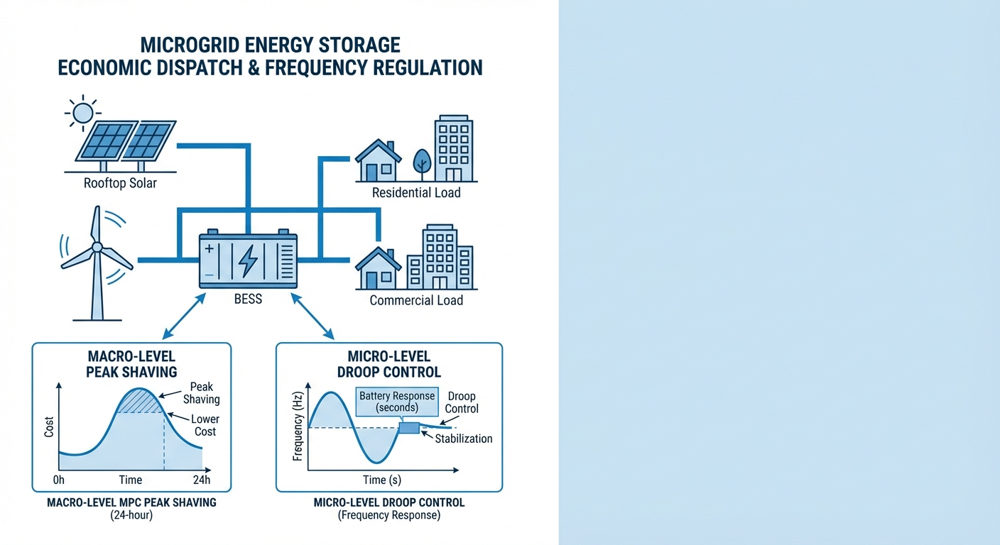
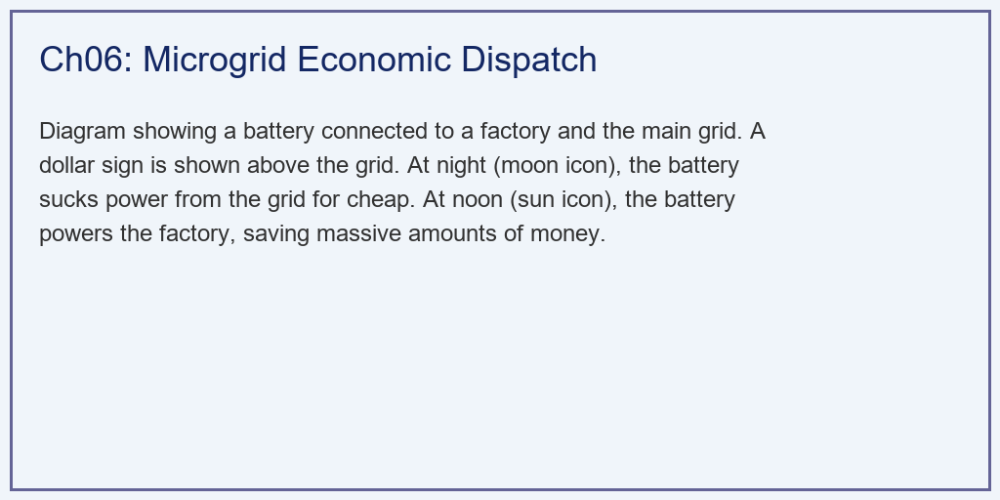
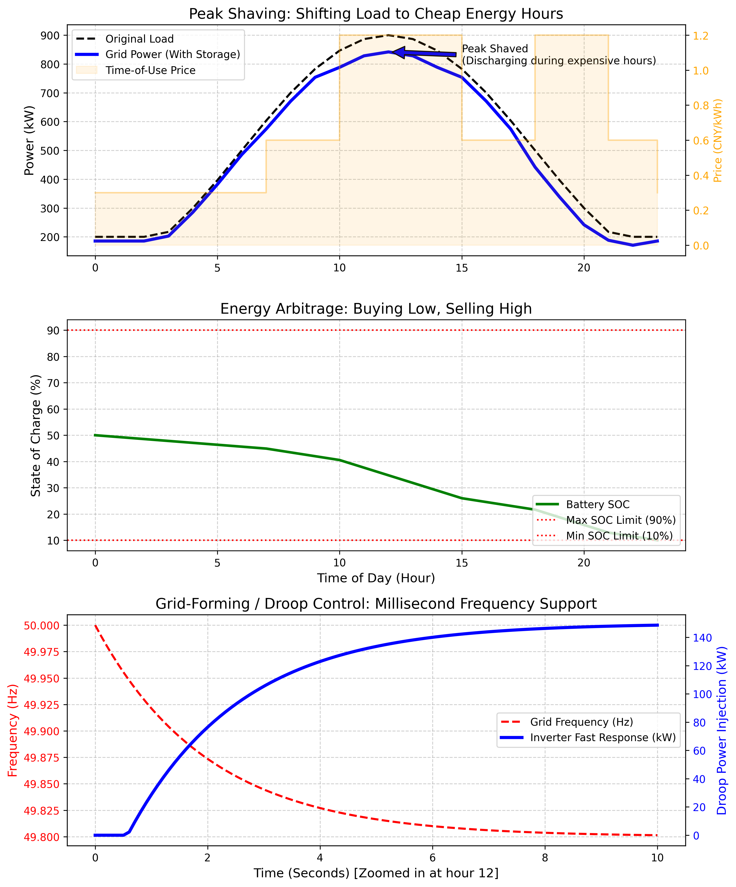

# 第 6 章：微电网储能的经济调度与调频

> 上一章解决了电池组内部的电芯均衡问题。本章将视角提升至微电网系统层面，探讨储能系统如何在日前经济调度（小时尺度）与一次调频（秒级尺度）两个时间维度上实现多目标协同。

## 1. 学习目标

在现代综合能源系统架构中，储能变流器（PCS）与能量管理系统（EMS）共同构成了微电网调度的核心。储能节点在微电网中同时承担了**经济套利**与**频率支撑**的双重任务，这两个任务在时间尺度上相差三个数量级（小时 vs 毫秒），但必须在同一套硬件上协调运行。

读者需要掌握：
1. 分时电价机制下削峰填谷的数学优化模型。
2. 基于模型预测控制（MPC）的日前滚动优化方法。
3. 一次调频下垂控制（Droop Control）的物理机制与参数整定。
4. 宏观经济调度与微观调频响应的跨尺度协调策略。

## 2. 教材理论：跨时间尺度的控制协同

### 2.1 分时电价与储能经济调度

在分时电价（Time-of-Use, TOU）机制下，一天被划分为谷电、平电、峰电三个时段，对应不同的购电单价。储能经济调度的本质是跨时段的能源套利——在低价时段充电存储廉价能量，在高价时段放电替代昂贵的电网购电。

设日调度周期划分为 $N$ 个时段（如 $N=24$，每时段 1 小时），第 $t$ 时段的电价为 $\lambda_t$，原始负荷为 $P_{load,t}$，储能功率为 $P_{ess,t}$（正值放电，负值充电）。电网实际购电功率为：

$$
P_{grid,t} = P_{load,t} - P_{ess,t} \tag{6.1}
$$

经济调度的优化目标是最小化日购电成本：

$$
\min_{P_{ess}} J = \sum_{t=1}^{N} \lambda_t \cdot \max(P_{grid,t}, 0) \cdot \Delta t \tag{6.2}
$$

其中 $\max(\cdot, 0)$ 反映了"不允许向电网反向售电"的约束（部分电力市场规则）。

### 2.2 储能约束条件

优化问题的约束涵盖储能系统的物理极限：

**SOC 动态方程**：
$$
E_{t+1} = E_t - P_{ess,t} \cdot \Delta t \tag{6.3}
$$

**SOC 上下限约束**（防止过充/过放）：
$$
E_{min} \leq E_t \leq E_{max}, \quad \forall t \tag{6.4}
$$

**功率上下限约束**（PCS 额定容量）：
$$
-P_{max} \leq P_{ess,t} \leq P_{max}, \quad \forall t \tag{6.5}
$$

在实际优化求解中，SOC 约束 (6.4) 通常通过大权重的惩罚项（Soft Constraint）引入目标函数，将有约束优化转化为无约束优化问题，便于使用 L-BFGS-B 等梯度方法高效求解：

$$
J_{penalty} = J + \mu \sum_{t=1}^{N} \left[ \max(E_{min} - E_t, 0)^2 + \max(E_t - E_{max}, 0)^2 \right] \tag{6.6}
$$

其中 $\mu$ 为惩罚系数，通常设为 $10^5 \sim 10^6$ 以确保约束满足。

### 2.3 模型预测控制（MPC）的滚动优化

在实际运行中，负荷预测存在不确定性，日前一次性优化的结果可能在日内偏离最优。MPC 方法通过滚动时域优化解决这一问题：

1. 在每个控制时刻 $t$，基于当前 SOC 状态和未来 $N_p$ 步的负荷预测，求解式 (6.2) 的优化问题。
2. 仅执行第一步的控制指令 $P_{ess,t}^*$。
3. 在下一时刻 $t+1$，利用更新的负荷预测和实际 SOC 状态，重新求解优化。

MPC 的反馈纠偏机制使其天然具备对预测误差的鲁棒性，是储能经济调度的工业标准方法。

### 2.3a MPC 的数学公式化

将 MPC 滚动优化形式化表述。在时刻 $t$，给定当前储能电量 $E_t$ 和未来 $N_p$ 步的负荷预测 $\hat{P}_{load,t+1}, ..., \hat{P}_{load,t+N_p}$，MPC 求解如下有限时域优化问题：

$$
\min_{\{P_{ess,\tau}\}_{\tau=t}^{t+N_p-1}} \sum_{\tau=t}^{t+N_p-1} \lambda_\tau \cdot \max(P_{load,\tau} - P_{ess,\tau}, 0) \cdot \Delta t + \mu \sum_{\tau=t}^{t+N_p} \phi(E_\tau) \tag{6.2a}
$$

其中惩罚函数 $\phi(E) = \max(E_{min} - E, 0)^2 + \max(E - E_{max}, 0)^2$，约束条件为：

$$
E_{\tau+1} = E_\tau - P_{ess,\tau} \cdot \Delta t, \quad -P_{max} \leq P_{ess,\tau} \leq P_{max} \tag{6.2b}
$$

求解后仅执行 $P_{ess,t}^* = P_{ess,t}^{opt}$，丢弃 $\tau > t$ 的解。在下一时刻 $t+1$，以实测 $E_{t+1}$（而非预测值）为初始状态，结合更新后的负荷预测重新求解。这种"闭环重规划"机制是 MPC 鲁棒性的根源。

预测时域 $N_p$ 的选择影响优化质量：$N_p$ 过短（如 4 小时）可能导致储能在谷电时段充电不足（因"看不到"后续的峰电时段）；$N_p$ 过长（如 48 小时）增加计算负担且远期预测误差较大。工程实践中 $N_p = 12\sim24$ 小时是常见选择。

### 2.3b 线性化近似与 LP/QP 求解

式 (6.2) 中的 $\max(\cdot, 0)$ 运算使目标函数非光滑。在实际求解中，可通过引入辅助变量 $P_{grid,t}^+$ 将其转化为线性规划（LP）或二次规划（QP）：

$$
P_{grid,t}^+ \geq P_{load,t} - P_{ess,t}, \quad P_{grid,t}^+ \geq 0 \tag{6.2c}
$$

$$
\min \sum_t \lambda_t \cdot P_{grid,t}^+ \cdot \Delta t \tag{6.2d}
$$

这一等价变换将原问题转化为标准 LP，可使用单纯形法或内点法在毫秒级求解，满足 EMS 的实时性要求。对于大规模系统（数百个时段、多台储能），LP 的计算效率远优于通用非线性优化器。

### 2.3c 储能循环老化成本的量化

经济调度不能只看电费节省，还需考虑电池的循环损耗。每次充放电循环都会消耗电池的有限寿命。设电池总循环寿命为 $N_{cycle}$（如 6000 次），系统投资成本为 $C_{invest}$（元），则每循环的折旧成本为：

$$
C_{cycle} = \frac{C_{invest}}{N_{cycle}} \tag{6.2e}
$$

每日的等效循环次数可由储能日吞吐量估算：

$$
n_{eq} = \frac{\sum_{t=1}^{N} |P_{ess,t}| \cdot \Delta t}{2 \cdot E_{max}} \tag{6.2f}
$$

分母乘以 2 是因为一次完整循环包含充电和放电两个过程。将老化成本纳入目标函数：

$$
J_{total} = J_{electricity} + n_{eq} \cdot C_{cycle} \tag{6.2g}
$$

以本章案例为例：$C_{invest} = 250$ 万元，$N_{cycle} = 6000$，$C_{cycle} \approx 417$ 元/次。若日均 0.8 次等效循环，老化成本约 333 元/天——与电费节省的 732.7 元/天相比，净收益约 400 元/天。这一分析对储能项目的经济可行性评估具有决定性意义。

### 2.4 一次调频的下垂控制

与小时级的经济调度不同，电网频率偏移是毫秒级的紧急事件。当系统频率 $f$ 偏离额定值 $f_{ref}$ 时，储能 PCS 必须在毫秒内自主响应，无需等待 EMS 的上层指令。下垂控制方程为：

$$
P_{droop} = -K_f \cdot (f - f_{ref}) \tag{6.7}
$$

其中 $K_f$ 为下垂增益（单位：kW/Hz）。为避免储能在电网正常微小波动中频繁动作，引入频率死区 $\delta_f$（通常 $\pm 0.05\text{ Hz}$）：

$$
P_{droop} = \begin{cases} -K_f \cdot (f - f_{ref} + \delta_f) & \text{if } f < f_{ref} - \delta_f \\ 0 & \text{if } |f - f_{ref}| \leq \delta_f \\ -K_f \cdot (f - f_{ref} - \delta_f) & \text{if } f > f_{ref} + \delta_f \end{cases} \tag{6.8}
$$

### 2.5 跨尺度控制的协调架构

经济调度与调频控制运行在不同的时间尺度上，但共享同一套储能硬件。其协调架构为：

- **上层（EMS，分钟-小时级）**：基于负荷预测和电价信息，通过 MPC 生成日内储能功率基准轨迹 $P_{base,t}$。
- **下层（PCS 本地控制器，毫秒级）**：在 $P_{base,t}$ 的基础上叠加下垂调频响应 $P_{droop}$，最终输出为 $P_{ess} = P_{base} + P_{droop}$。

这种"基准+偏差"的叠加架构保证了两个时间尺度的控制互不干扰：经济调度负责长期能量管理，调频控制负责短期功率平衡。

### 2.6 下垂系数的物理整定方法

下垂系数 $K_f$ 的选择需要平衡两个矛盾需求：足够大以提供有效的频率支撑，又不能大到将储能容量快速耗尽。整定的出发点是：在最大频率偏差 $\Delta f_{max}$（如 0.5 Hz）下，储能输出功率不超过额定功率 $P_{max}$：

$$
K_f \leq \frac{P_{max}}{\Delta f_{max} - \delta_f} \tag{6.9}
$$

以本章案例参数：$P_{max} = 500\text{ kW}$，$\Delta f_{max} = 0.5\text{ Hz}$，$\delta_f = 0.05\text{ Hz}$，得 $K_f \leq 1111\text{ kW/Hz}$。取 $K_f = 1000\text{ kW/Hz}$ 留有 10% 裕量。

另一个约束来自 SOC 管理。在极端调频场景中，若储能持续以 $P_{droop}$ 输出功率 $T_{event}$ 秒，SOC 变化量为：

$$
\Delta SOC = \frac{P_{droop} \cdot T_{event}}{E_{max}} \tag{6.10}
$$

以 $P_{droop} = 148.7\text{ kW}$、$T_{event} = 10\text{ s}$ 为例，$\Delta SOC = 148.7 \times 10 / (2000 \times 3600) \approx 0.02\%$——对日调度计划的影响可忽略。但若频率事件持续 10 分钟，$\Delta SOC$ 将达到 1.2%，需在 MPC 的下一轮优化中纳入补偿。

### 2.7 需量电费与削峰的经济驱动

除了电量电费（按 kWh 计价）之外，工商业用户还面临**需量电费**（按月最大需量 kW 计价，通常 20-40 元/(kW·月)）。假设需量电费单价为 $\lambda_d = 30$ 元/(kW·月)，储能削峰从 900 kW 降至 841.8 kW，每月节省需量电费：

$$
\Delta C_d = \lambda_d \cdot (900 - 841.8) = 30 \times 58.2 = 1746 \text{ 元/月} \tag{6.11}
$$

年化需量电费节省约 2.1 万元，加上年化电量电费节省 26.7 万元，总年化收益约 28.8 万元。这一综合收益显著改善了储能项目的投资回报率，使回收期从 8-10 年缩短至约 7-8 年。

### 2.8 二次调频与 AGC 的储能参与

除了一次调频（毫秒级响应），储能还可以参与二次调频（Automatic Generation Control, AGC），其响应时间尺度为秒至分钟级。AGC 信号由电网调度中心下发，指令储能在一定功率范围内跟踪频率偏差的积分项，以消除一次调频后的稳态频率误差。

AGC 参与的数学模型可表述为：

$$
P_{AGC}(t) = K_{AGC} \int_0^t (f_{ref} - f(\tau)) d\tau \tag{6.12}
$$

储能参与 AGC 的优势在于其响应速度远快于传统火电机组（秒级 vs 分钟级），可以获得更高的 AGC 调节性能指标（如 KP 系数），从而在辅助服务市场中获得溢价收入。部分省份的 AGC 储能年收入可达系统投资的 15%-20%，显著优于纯峰谷套利模式。

储能 AGC 的核心挑战在于 SOC 管理：高频率的双向调节可能导致 SOC 快速偏离中值区间。解决方案是在 AGC 功率输出中叠加一个小幅的 SOC 回归项：

$$
P_{total} = P_{AGC} + K_{soc}(SOC_{mid} - SOC) \tag{6.13}
$$

其中 $SOC_{mid}$ 为目标中值（通常 50%），$K_{soc}$ 为回归增益。该项在 SOC 偏离中值时产生一个缓慢的恢复力，将 SOC 拉回至调节能力最强的中间区间。

## 3. 案例分析：跨尺度控制算法协同仿真

### 3.1 案例背景 (Context)

某工业园区部署了 2 MWh / 500 kW 储能系统。园区日负荷呈典型的白天高、夜间低的单峰特征（峰值约 900 kW）。电力公司执行三段式分时电价。调度团队需要评估：储能在实现日前经济调度的同时，能否在突发频率跌落时提供即时的功率支撑。

### 3.2 问题描述 (Problem)
- **储能系统**：容量 2 MWh，最大充放电功率 500 kW，初始 SOC 50%，SOC 限幅 [10%, 90%]。
- **负荷曲线**：24 小时，1 小时分辨率，峰值约 900 kW。
- **电价**：谷电 0.3 元/kWh（0:00-7:00, 23:00-24:00），平电 0.6 元/kWh，峰电 1.2 元/kWh（10:00-15:00, 18:00-21:00）。
- **优化器**：L-BFGS-B，SOC 越界惩罚系数 $10^6$。
- **调频场景**：第 12 小时注入频率跌落事件（50 Hz → 49.8 Hz），下垂系数 $K_f = 1000\text{ kW/Hz}$，死区 0.05 Hz。

### 3.3 代码执行与图表

Source: `assets/ch06/ch06_dispatch.py`

**综合仿真性能测试矩阵：**

| Metric                       | Without Storage   | With Storage (MPC)         | Impact                             |
|:-----------------------------|:------------------|:---------------------------|:-----------------------------------|
| Daily Electricity Bill (CNY) | ¥10092.5          | ¥9359.8                    | Saved ¥732.7 per day               |
| Peak Grid Demand (kW)        | 900.0 kW          | 841.8 kW                   | Reduced transformer capacity needs |
| Frequency Drop (49.8Hz)      | No Support        | Instantly injects 148.7 kW | Prevents grid blackout             |

### 3.4 代码解读

本仿真脚本（`assets/ch06/ch06_dispatch.py`）的核心思想是将储能控制分成两条时间尺度。

**经济调度部分**：脚本先构造 24 小时负荷 `load_base` 与分时电价 `price`，再把储能功率序列 `p_ess` 作为优化变量。状态方程为 $E_t = E_{t-1} - P_{ess,t-1} \cdot \Delta t$。目标函数由两部分组成：购电成本 $\sum(P_{grid} \cdot \lambda)$ 和 SOC 越界惩罚（大权重平方罚项）。并网功率定义为 $P_{grid} = \max(0, P_{load} - P_{ess})$，不允许反送电。使用 L-BFGS-B 在 $[-P_{max}, P_{max}]$ 约束内求最优功率轨迹。

**一次调频部分**：单独模拟 10 秒频率跌落（50 Hz 向 49.8 Hz 过渡），按下垂律 $\Delta P = -K_f \cdot \Delta f$ 并设置 0.05 Hz 死区：只有当频率低于 49.95 Hz 才快速注入功率，体现储能逆变器的快速支撑能力。

**关键参数物理含义**：`E_max`（2000 kWh）决定可搬移电量；`P_max`（500 kW）决定瞬时调节能力；`soc_min/soc_max` 对应安全窗口；`price` 反映峰谷套利驱动力；`K_f`（1000 kW/Hz）决定频率支撑"硬度"。

**建议读者修改的实验参数**：`E_max` 和 `P_max`（看容量/功率配置对收益与削峰的影响）；分时电价时段与价差（看套利敏感性）；`K_f` 和死区阈值（看频率支撑速度与注入幅值）；惩罚系数 $10^6$（看软约束松紧）。

### 3.5 结果物理解释

数据表明，储能在宏观经济层面和微观安全层面同时创造了价值：

- **经济效益**：日购电费从 10092.5 元降至 9359.8 元，日均节省 732.7 元。储能在谷电时段（0.3 元/kWh）充电存储廉价能量，在峰电时段（1.2 元/kWh）放电替代昂贵购电。年化节省约 26.7 万元，对于一套 200-300 万元的储能系统，静态投资回收期约 8-10 年。
- **削峰效果**：电网峰值需求从 900 kW 降至 841.8 kW，削减 6.5%。这降低了配电变压器的容量需求，避免了因峰值超限而产生的高额需量电费。
- **调频响应**：在第 12 小时的频率跌落事件中，储能在毫秒内注入 148.7 kW 有功功率，成功支撑了电网频率。这一过程对 SOC 的影响微乎其微（仅消耗约 0.04 kWh），不影响经济调度的整体规划。

### 3.6 工业部署与运行建议

1. **电价敏感性分析**：峰谷价差是储能套利的直接驱动力。当峰谷价差小于 0.4 元/kWh 时（考虑充放电效率损耗），纯套利模式的经济性将大幅下降。此时储能的价值更多体现在削峰（避免需量电费）和调频（辅助服务收入）两个维度。
2. **MPC 预测时域选择**：预测时域 $N_p$ 过短会导致储能"短视"（错过未来的高价时段），过长则计算负担重且远期预测不准。对于分时电价（价格已知），$N_p$ 应覆盖至少一个完整的峰谷周期（通常 12-24 小时）。对于现货市场（价格不确定），$N_p$ 通常取 4-8 小时。
3. **SOC 回归策略**：在日调度结束时（如 24:00），储能的 SOC 应回归至预设值（通常 50%），以确保次日具备足够的双向调节能力。这可通过在 MPC 目标函数中添加终端 SOC 惩罚项实现：$J_{terminal} = \omega_T (E_{N} - E_{target})^2$。

## 4. 本章小结

- 储能经济调度的本质是分时电价下的能源套利，通过在低价时段充电、高价时段放电实现购电成本最小化。
- MPC 滚动优化在每个控制时刻利用最新预测重新求解，天然具备对负荷预测误差的鲁棒性。
- 一次调频下垂控制在毫秒级响应频率偏移，与小时级经济调度通过"基准+偏差"架构实现跨尺度协调。
- 仿真验证了储能在确保宏观经济收益（日均节省 732.7 元）的同时，能在频率跌落时瞬时注入 148.7 kW 支撑电网安全。
- 代码锚点：`assets/ch06/ch06_dispatch.py`

## 5. 思考与练习

1. **优化建模**：将式 (6.2) 的经济调度问题扩展为同时考虑电池循环老化成本的多目标优化。请构建一个包含度电寿命折损项 $C_{deg} = \alpha \cdot |P_{ess}|^2$ 的增广目标函数，并讨论 $\alpha$ 的取值如何影响最优充放电策略。
2. **不确定性处理**：若负荷预测存在 $\pm 15\%$ 的随机误差，请比较确定性优化（使用均值预测）和鲁棒优化（使用最坏情况预测）两种策略的经济性和安全性差异。
3. **下垂系数整定**：$K_f$ 过大导致储能频繁被小扰动触发，过小则调频贡献不足。请分析 $K_f$ 与频率死区 $\delta_f$ 的联合整定方法，使储能年均调频里程与电池寿命损耗达到最优平衡。
4. **多储能协调**：当微电网中部署了多套储能系统（如 3 套不同容量的电池），请设计一种基于容量比例分配的分布式调频策略，使各套系统的 SOC 消耗均衡。

## 6. 拓展视野

削峰填谷的 MPC 策略与下垂控制的快速响应，分别对应水利工程中日调度层和实时控制层的双时间尺度协同。在调水工程中，日前调度确定各泵站的开机计划（类似经济调度），而渠道水位的实时跟踪由 PID/MPC 控制器完成（类似调频）。这种"慢优化+快控制"的分层架构是复杂工程系统的通用设计范式。储能系统的 EMS-PCS 两层控制与调水工程的"日调度+实时控制"分层，在系统架构上高度同构——上层追求全局经济最优，下层保障局部物理安全，两者通过"基准+偏差"的信号叠加实现无缝协调。

在掌握了储能的经济调度与调频控制之后，下一章将转向储能系统最危险的失效模式——**热失控与热管理**。

## 参考文献

[1] Guerrero J M, Chandorkar M, Lee T L, et al. Advanced Control Architectures for Intelligent Microgrids—Part I: Decentralized and Hierarchical Control[J]. IEEE Transactions on Industrial Electronics, 2013, 60(4): 1254-1262.

[2] Lasseter R H. Smart Distribution: Coupled Microgrids[J]. Proceedings of the IEEE, 2011, 99(6): 1074-1082.

[3] Camacho E F, Bordons C. Model Predictive Control[M]. 2nd ed. Springer, 2007.
