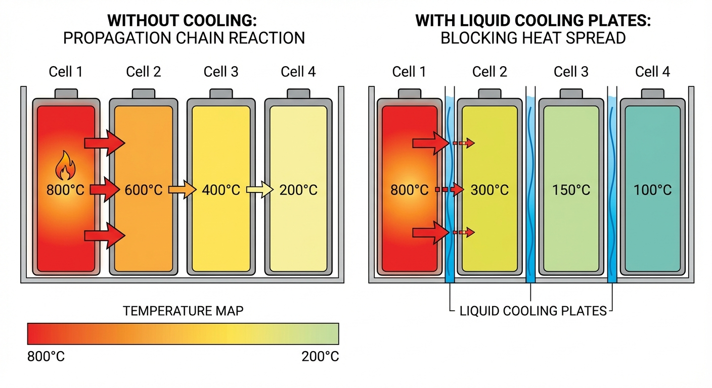
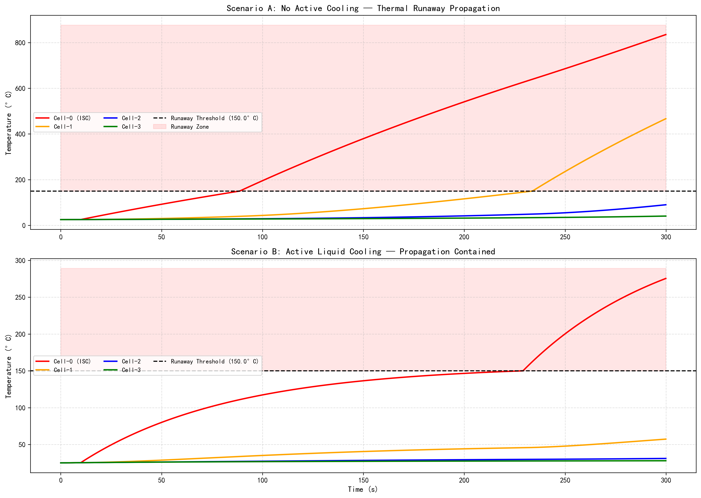

# 第 7 章：储能系统热管理与安全

> 上一章讨论了储能的经济调度与调频控制。然而，无论控制策略多么精妙，如果热管理失败，一切都将化为灰烬——甚至字面意义上的灰烬。本章将探讨储能系统最危险的失效模式：锂电池热失控。

## 1. 学习目标

锂电池热失控（Thermal Runaway）是一个正反馈的链式放热过程。一旦单体电池因内部短路失控，产生的高温可能引燃相邻电池，形成热蔓延（Thermal Propagation），最终导致整个储能电站起火甚至爆炸。2020-2025 年间，全球已发生数十起储能电站火灾事故，其中多起源于热蔓延未能及时阻断。

读者需要掌握：
1. 锂电池热失控的三阶段物理化学机制（SEI 分解 → 隔膜熔化 → 电解液分解）。
2. 集总参数热模型的建立方法：$m c_p \frac{dT}{dt} = Q_{gen} - Q_{amb} - Q_{neighbor}$。
3. 内部短路（ISC）的产热机制与热失控触发温度。
4. 电池间热蔓延的物理路径与时间尺度。
5. 液冷系统如何通过降低热阻切断热蔓延链条。

## 2. 教材理论：从"单体失控"到"模组蔓延"

### 2.1 锂电池热失控的三阶段

热失控是一个由多种电化学副反应级联触发的正反馈过程，可分为三个阶段：

**第一阶段：SEI 膜分解（~90°C）**。固体电解质界面膜（Solid Electrolyte Interphase, SEI）是在首次充放电过程中，电解液在负极表面还原形成的钝化层。当温度超过 90°C 时，SEI 膜开始分解，暴露负极活性碳材料直接与电解液接触，引发放热反应。此阶段产热率约 10-50 W，温升速率约 0.5-2°C/min。

**第二阶段：隔膜熔化（~130°C）**。聚乙烯（PE，熔点 130°C）或聚丙烯（PP，熔点 165°C）隔膜收缩熔化，正负极直接短路，短路电流可达数百安培，产热剧增至数百瓦。此阶段是从"可控"到"不可逆"的临界转折点。

**第三阶段：电解液分解（~150°C+）**。碳酸酯类电解液在高温下分解产生大量可燃气体（CO、H₂、CH₄等），温度可飙升至 600-800°C 以上。若电池外壳因气压过高破裂，可燃气体泄出后可能被引燃，造成明火。

一旦温度越过 150°C 门槛，热失控不可逆转。工程上的防线必须设在这个门槛之前。

### 2.1a 热失控的动力学建模

三阶段放热反应的总产热速率可用 Arrhenius 方程描述。以 SEI 分解为例：

$$
\dot{Q}_{SEI} = A_{SEI} \cdot c_{SEI} \cdot \exp\left(-\frac{E_{a,SEI}}{R_g T}\right) \tag{7.1a}
$$

其中 $A_{SEI}$ 为频率因子（W/kg），$c_{SEI}$ 为 SEI 归一化浓度（初始为 1，反应完全后为 0），$E_{a,SEI}$ 为活化能（J/mol），$R_g$ 为气体常数（8.314 J/(mol·K)），$T$ 为绝对温度（K）。

SEI 浓度的消耗速率为：

$$
\frac{dc_{SEI}}{dt} = -A_{SEI,c} \cdot c_{SEI} \cdot \exp\left(-\frac{E_{a,SEI}}{R_g T}\right) \tag{7.1b}
$$

类似的 Arrhenius 方程也适用于隔膜分解和电解液分解反应，只是各自的动力学参数 $(A, E_a)$ 不同。三个反应的总产热为 $Q_{gen} = \dot{Q}_{SEI} + \dot{Q}_{sep} + \dot{Q}_{elec}$，代入式 (7.1) 即构成完整的热-化学耦合模型。

该模型的关键特征是温度-产热的正反馈：温度升高 $\rightarrow$ 反应速率指数增长 $\rightarrow$ 产热增大 $\rightarrow$ 温度进一步升高。当散热速率无法跟上产热增速时，系统进入热失控。定义热失控触发的判据为 $dT/dt > 1$ °C/s，这一温升速率一旦出现，在自然对流条件下几乎不可逆转。

### 2.2 集总参数热模型

对于电池模组级别的热分析，采用集总参数模型（Lumped-Parameter Model），将每个电池视为温度均匀的热节点。对第 $i$ 个电池，能量守恒方程为：

$$
m c_p \frac{dT_i}{dt} = Q_{gen,i} - \frac{T_i - T_{amb}}{R_{amb}} - \sum_{j \in \mathcal{N}(i)} \frac{T_i - T_j}{R_{cc}} \tag{7.1}
$$

其中：
- $m$ 为电池质量（kg），$c_p$ 为比热容（J/(kg·K)）
- $Q_{gen,i}$ 为第 $i$ 个电池的产热功率（W）
- $R_{amb}$ 为电池到环境的热阻（K/W）
- $R_{cc}$ 为相邻电池之间的导热热阻（K/W）
- $\mathcal{N}(i)$ 为第 $i$ 个电池的相邻节点集合

**正常工况产热**：$Q_{gen} = I^2 R_{int}$（焦耳热），对于 5 A 放电、0.05 $\Omega$ 内阻的 18650 电芯，$Q_{gen} = 1.25\text{ W}$。

**内部短路产热**：当发生制造缺陷导致的内部微短路（ISC）时，短路电流绕过外部回路在电池内部形成回路，产热可达 50-200 W。

**热失控产热**：一旦温度超过 150°C 触发全面热失控，放热反应产热可达 200-500 W。

### 2.3 热蔓延的物理判据

热蔓延能否发生，取决于两个竞争过程的博弈：

- **热传入**：失控电池通过 $R_{cc}$ 向相邻电池传导热量，传热功率为 $Q_{in} = (T_{fail} - T_j) / R_{cc}$。
- **热散出**：相邻电池通过 $R_{amb}$ 向环境散热，散热功率为 $Q_{out} = (T_j - T_{amb}) / R_{amb}$。

蔓延发生的条件是：在某个时刻，相邻电池 $j$ 的温度持续上升至 150°C——即热传入长期大于热散出加上电池自身蓄热的消耗。

定性地，当 $R_{amb} \gg R_{cc}$ 时（散热差、导热强），热量"进得多、出得少"，蔓延不可避免。当 $R_{amb} \ll R_{cc}$ 时（散热强、导热弱），热量"进得少、出得多"，蔓延可被阻断。

**蔓延阻断的临界热阻比**：设失控电池稳态温度为 $T_{fail}$，蔓延阈值温度为 $T_{runaway}$，环境温度为 $T_{amb}$。对于相邻电池的稳态温度 $T_j$，联立热平衡方程：

$$
\frac{T_{fail} - T_j}{R_{cc}} = \frac{T_j - T_{amb}}{R_{amb}} \tag{7.1c}
$$

解得：

$$
T_j = \frac{R_{amb} \cdot T_{fail} + R_{cc} \cdot T_{amb}}{R_{amb} + R_{cc}} \tag{7.1d}
$$

蔓延不发生的条件是 $T_j < T_{runaway}$，代入整理得临界热阻比：

$$
\frac{R_{amb}}{R_{cc}} < \frac{T_{runaway} - T_{amb}}{T_{fail} - T_{runaway}} \tag{7.1e}
$$

以 $T_{fail} = 600$°C、$T_{runaway} = 150$°C、$T_{amb} = 25$°C 为例，临界比值为 $(150-25)/(600-150) = 0.278$。即 $R_{amb}$ 必须小于 $0.278 \times R_{cc}$。当 $R_{cc} = 8$ K/W 时，$R_{amb} < 2.22$ K/W——这正解释了为什么液冷热阻需要降至 2 K/W 才能可靠阻断蔓延。

### 2.4 液冷系统的热阻降低效应

自然对流条件下，电池到环境的热阻 $R_{amb}$ 约为 50 K/W，散热能力有限。液冷系统通过在电池模组底部或侧面铺设冷却液管路（通常为乙二醇-水混合液），将 $R_{amb}$ 降至 2-3 K/W——散热能力提升约 20 倍。

以量化方式说明这一差异的决定性作用：假设失控电池稳定在 300°C，相邻电池通过 $R_{cc} = 8\text{ K/W}$ 接收的热流为 $(300 - T_j) / 8$。当 $T_j = 100$°C 时，热流入为 25 W。

- **自然对流**（$R_{amb} = 50\text{ K/W}$）：散热功率为 $(100 - 25) / 50 = 1.5\text{ W}$。热入远大于热出，温度继续攀升。
- **液冷**（$R_{amb} = 2\text{ K/W}$）：散热功率为 $(100 - 25) / 2 = 37.5\text{ W}$。热出大于热入，温度开始下降。

这一定量分析解释了为什么液冷系统是阻断热蔓延的决定性手段。

### 2.5 Biot 数与集总参数模型的适用条件

集总参数模型假设电池内部温度均匀分布，这一假设的有效性由 Biot 数判定：

$$
Bi = \frac{h \cdot L_c}{k_{cell}} \tag{7.2}
$$

其中 $h$ 为表面换热系数（W/(m²·K)），$L_c = V_{cell}/A_{cell}$ 为特征长度（体积与表面积之比），$k_{cell}$ 为电池导热系数（W/(m·K)）。

- 当 $Bi < 0.1$ 时，电池内部温度梯度可忽略，集总参数模型有效。
- 当 $Bi > 0.1$ 时，内部温差显著，需要采用分布参数模型（有限元法）。

对于 18650 圆柱电芯：$L_c \approx 0.003\text{ m}$，$k_{cell} \approx 1\text{ W/(m·K)}$（径向）。自然对流 $h \approx 10\text{ W/(m²·K)}$ 时，$Bi = 0.03 < 0.1$，集总模型有效。但在液冷条件下 $h$ 可达 200 W/(m²·K)，$Bi = 0.6 > 0.1$——此时严格来说应使用有限元方法。然而，考虑到模组级热蔓延分析的主要关注点是电池间的热传导时间尺度（分钟级），而非电池内部的温度分布（秒级），集总模型在工程精度层面仍然可用。

### 2.6 热管理系统的功耗与能效

液冷系统本身也消耗电力。冷却泵的电功率约为 $P_{pump} = \Delta p \cdot \dot{V} / \eta_{pump}$，其中 $\Delta p$ 为管路压降（通常 20-50 kPa），$\dot{V}$ 为冷却液流量（L/min），$\eta_{pump}$ 为泵效率。对于 1 MW 储能系统，冷却系统的自耗电约占系统容量的 1%-3%，这一寄生损耗需要纳入储能系统的全生命周期效率计算。

此外，冷却液的温度控制也需要考虑：在冬季低温环境（如 -20°C），冷却液可能需要加热以避免粘度过高导致流量下降；在夏季高温环境（如 40°C+），可能需要制冷机组将冷却液温度降至 25°C 以下。这些场景使热管理系统的设计从简单的"散热"问题升级为"温度调节"问题。

### 2.7 气体探测与多维度预警体系

热失控的早期预警需要多种传感器的协同工作，构成"电-热-气"三维度预警体系：

**电信号预警**（最早，可提前数小时至数天）：内部微短路会导致电芯的自放电率异常升高。BMS 通过监测静置期间的电压下降速率（$dV/dt$），可在极早期发现 ISC 隐患。判据为：

$$
\left|\frac{dV_i}{dt}\right|_{rest} > 3\sigma_{dV/dt} \tag{7.3}
$$

其中 $\sigma_{dV/dt}$ 为同组电芯的电压下降速率标准差。超过 3 倍标准差的电芯被标记为疑似 ISC。

**热信号预警**（可提前数分钟至数十分钟）：温度传感器检测到电芯温度异常上升（$dT/dt > 1$ °C/min），或电芯间温差超过阈值（$\Delta T_{max} > 5$°C）。

**气体信号预警**（可提前数秒至数分钟）：电解液分解产生的特征气体（CO、H₂、碳酸二甲酯蒸气等）被舱体内的气体传感器捕捉。气体信号是热失控的"最后一道防线"，一旦探测到即应触发紧急切断和消防系统。

三维度预警的协同逻辑为：电信号 → 发出低级别告警、启动远程监控 → 热信号 → 降低充放电功率、启动强制冷却 → 气体信号 → 紧急断电、启动灭火。这种分级响应策略在保证安全的同时避免了误报导致的频繁停机。

## 3. 案例分析：热失控蔓延仿真（自然冷却 vs 液冷）

### 3.1 案例背景 (Context)

某储能电站发生了一起电池内部短路事故：4 串电池模组中的 Cell-0 因制造缺陷产生内部微短路（ISC），持续产热 80 W。安全工程师需要评估：在自然冷却和液冷两种热管理方案下，热失控是否会从 Cell-0 蔓延至相邻电池。

### 3.2 问题描述 (Problem)
- **模组结构**：4 个 18650 电池串联排列，每个质量 45 g，比热 1000 J/(kg·K)。
- **热阻参数**：电池间热阻 $R_{cc} = 8$ K/W，自然对流 $R_{amb} = 50$ K/W，液冷 $R_{cool} = 2$ K/W。
- **故障注入**：$t=10$ s 时，Cell-0 发生 ISC，产热 80 W。达到 150°C 后进入全热失控（200 W）。
- **正常产热**：$I^2 R = 5^2 \times 0.05 = 1.25$ W/cell。
- **模拟时长**：300 s（5 分钟），时间步长 0.1 s。

### 3.3 代码执行与图表

> **学习提示**：请对比上下两张子图中 Cell-1（橙色曲线）的命运。在无冷却场景中，Cell-1 在 233.8 s 被引燃，温度飙升——热蔓延发生。在液冷场景中，Cell-1 的温度始终被压制在 150°C 以下——蔓延被阻断。

Source: `assets/ch07/ch07_thermal_runaway.py`

**热失控蔓延对比矩阵：**

| 指标 | 无冷却 | 液冷 |
|:-----|:-------|:-----|
| 峰值温度 (°C) | 835.2 | 275.4 |
| 热失控电池数 (共 4) | 2 | 1 |
| Cell-0 热失控时间 (s) | 88.7 | 229.1 |
| 首次蔓延时间 (s) | 233.8 | 从未蔓延 |
| 蔓延是否阻断 | 否 | 是 |

**热失控蔓延仿真：自然冷却 vs 液冷对比图：**

### 3.4 代码解读

本仿真脚本（`assets/ch07/ch07_thermal_runaway.py`）用"集总参数热模型"模拟四串圆柱电芯在热失控中的连锁传播，对比"无主动冷却"和"液冷抑制"两种工况。

核心算法是显式时间步进：每个时间步、每个电芯先设定发热功率 `Q_gen`（正常工况 1.25 W，ISC 阶段 80 W，全失控 200 W），再计算对环境散热 $Q_{amb} = (T - T_{amb})/R_{to\_amb}$ 与相邻电芯导热 $Q_{neighbor} = \sum(T_i - T_j)/R_{cc}$，最后按能量守恒 $m c_p \cdot dT/dt = Q_{gen} - Q_{amb} - Q_{neighbor}$ 更新温度。Cell-0 在 $t_{isc} = 10\text{ s}$ 后进入 ISC，一旦某电芯温度超过 150°C，其 flag 置真，后续发热提升到 200 W，形成"触发—升温—传导—再触发"的传播链。

**关键参数物理含义**：`m_cell`（0.045 kg）与 `cp`（1000 J/(kg·K)）决定热惯量——越大越不易升温；`R_cc`（8 K/W）决定电芯间热耦合强弱——越小传播越快；`R_amb`/`R_cool` 决定对外散热能力；`Q_short`（80 W）与失控阶段 200 W 决定异常热源强度。

**建议读者修改的实验参数**：(1) `R_cool`（验证冷却强度阈值）；(2) `R_cc`（验证模组结构隔热设计效果）；(3) `Q_short` 与失控放热功率（验证故障烈度影响）；(4) `T_runaway`（验证触发判据保守性）；(5) `m_cell`/`cp`（验证材料与规格差异）。每次只改一个参数并记录五个指标，最容易得到可解释的工程结论。

### 3.5 实验验证与结果剖析

这组仿真揭示了液冷系统在热安全中的决定性作用：

- **上方子图（无冷却）**：Cell-0（红色）在 $t=88.7$ s 达到 150°C 触发热失控，温度迅速飙升至 835°C。由于自然对流散热能力不足（$R_{amb}=50$ K/W），Cell-0 的热量通过 $R_{cc}=8$ K/W 的导热路径持续向 Cell-1 传递。Cell-1（橙色）在 $t=233.8$ s 也被引燃——热蔓延发生。两个电池的联合产热高达 400 W，如果模组包含更多电池，蔓延将继续扩展。
- **下方子图（液冷）**：Cell-0 同样在 $t=229.1$ s 达到热失控（延迟了 140 s，因为液冷在初期有效抑制了温升）。但 Cell-1 的温度被液冷系统牢牢压制在 150°C 以下——蔓延被彻底阻断。液冷将 $R_{amb}$ 从 50 K/W 降至 2 K/W，散热功率从 $(150-25)/50 = 2.5$ W 提升至 $(150-25)/2 = 62.5$ W，远超 Cell-1 通过 $R_{cc}$ 接收的热流。
- **核心结论**：热蔓延能否被阻断，取决于液冷散热功率是否大于电池间导热功率。当 $R_{cool} \ll R_{cc}$ 时，蔓延可控。

### 3.6 工业部署与运行建议

1. **液冷系统冗余设计**：液冷泵应配置 N+1 冗余。一旦冷却液循环中断，模组将在数分钟内从"可控"退化为"不可控"。
2. **早期预警指标**：在 ISC 早期（温升 5-10°C），电池端电压会出现微小异常（自放电率上升）。BMS 应设置电压一致性监控告警，在热失控前 30 分钟发出预警。
3. **隔热设计**：增大 $R_{cc}$（如在电芯之间填充气凝胶隔热垫）可以从源头减缓热传导速度，为液冷系统和消防系统争取更多响应时间。
4. **气体探测**：电解液分解产生的特征气体（如 CO）可被传感器捕捉。在舱体内部署气体探测器，能在热失控触发前 10-30 秒发出独立告警。

## 4. 本章小结

- 热失控是锂电池最危险的失效模式，一旦超过 150°C 门槛即不可逆。其三阶段机制为：SEI 分解 → 隔膜熔化 → 电解液分解。
- 集总参数热模型将每个电池视为热节点，通过热阻网络计算温度演化，适用于模组级别的热蔓延分析。
- 液冷系统将电池-环境热阻降低约 20 倍（50 → 2 K/W），成功阻断了热蔓延链条。
- 蔓延能否被阻断的判据：$R_{cool} \ll R_{cc}$，即液冷散热率必须远大于电池间导热率。
- 代码锚点：`assets/ch07/ch07_thermal_runaway.py`

## 5. 思考与练习

1. **热阻临界值**：给定 $R_{cc} = 8\text{ K/W}$、$Q_{gen,fail} = 200\text{ W}$、$T_{runaway} = 150$°C、$T_{amb} = 25$°C，请推导阻断热蔓延所需的最大 $R_{amb}$ 值（即液冷系统的最低设计要求）。
2. **有限元对比**：集总参数模型假设电池内部温度均匀。请讨论这一假设在什么条件下会失效（提示：Biot 数），以及如何判断是否需要采用有限元方法进行更精细的热分析。
3. **消防系统设计**：如果液冷系统失效，需要在多少秒内启动全氟己酮气体灭火才能阻止蔓延？请基于本章仿真数据估算这一时间窗口。
4. **多物理场耦合**：热失控过程中电池内阻急剧增大，导致产热特性发生非线性变化。请讨论如何将电化学模型与热模型耦合，建立更精确的热失控预测模型。

## 6. 拓展视野

热失控的级联传播机制与水利系统中的溃坝洪水传播有相似的灾害链特征：局部故障通过物理耦合引发全局灾难。两者的安全防护策略也具有共性——物理隔离（防火墙/分区闸门）、早期预警（温度/渗流监测）、应急响应（喷淋/泄洪）。

在解决了储能系统的热安全问题之后，下一章将把视角从单个电站扩展到区域电网，探讨**虚拟电厂与储能聚合**如何实现分散资源的协调调度。

## 参考文献

[1] Feng X, Ouyang M, Liu X, et al. Thermal Runaway Mechanism of Lithium Ion Battery for Electric Vehicles: A Review[J]. Energy Storage Materials, 2018, 10: 246-267.

[2] Wang Q, Ping P, Zhao X, et al. Thermal Runaway Caused Fire and Explosion of Lithium Ion Battery[J]. Journal of Power Sources, 2012, 208: 210-224.

[3] Chen M, Sun Q, Li Y, et al. A Thermal Runaway Simulation on a Lithium Titanate Battery and the Battery Module[J]. Energies, 2019, 12(16): 3099.
