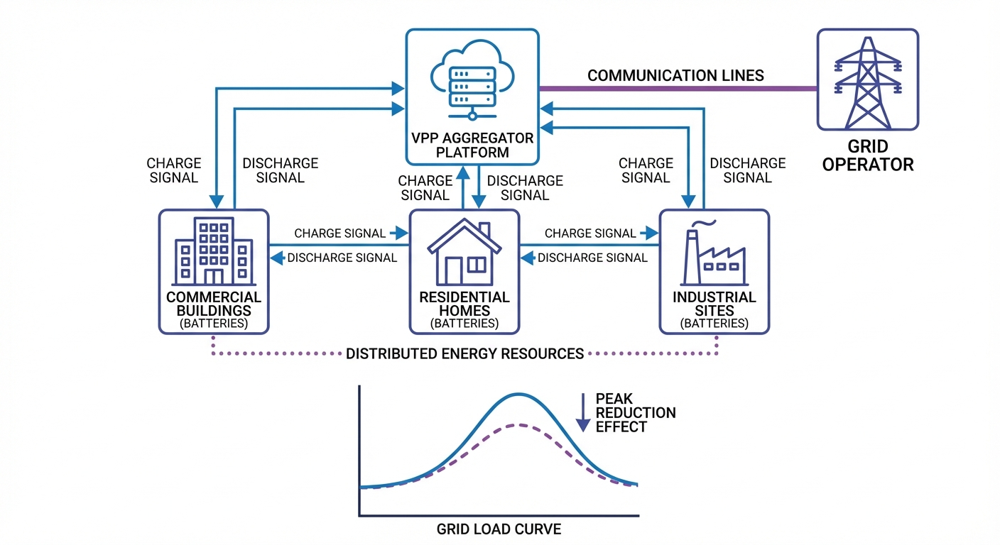

# 第 8 章：虚拟电厂（VPP）与储能聚合

> 上一章解决了单个储能电站内部的热安全问题。本章将视角从单一电站扩展到区域电网层面，探讨如何将分散在工业园区、商业楼宇和居民社区的小型储能单元聚合为统一可调度的"虚拟大电厂"。

## 1. 学习目标

虚拟电厂（Virtual Power Plant, VPP）是新型电力系统的关键商业模式创新。与传统集中式发电厂不同，VPP 不拥有任何实体发电设备，而是通过通信网络将物理上分散的分布式能源资源（DER）——包括分布式储能、屋顶光伏、电动汽车充电桩等——聚合为一个在电力市场中可统一报价、统一调度的虚拟实体。

读者需要掌握：
1. 分布式储能聚合调度的两层架构：VPP 聚合商 → 分布式单元。
2. 协调调度与非协调调度的数学模型及其在削峰效果上的本质差异。
3. 分时电价机制下的储能套利与电网削峰之间的权衡关系。
4. SOC 均衡管理——防止个别单元过度充放电的全局约束。
5. 抽水蓄能与电化学储能的异构协同架构。

## 2. 教材理论：从"各自为战"到"协同作战"

### 2.1 抽水蓄能与电化学储能的异构协同

抽水蓄能（Pumped Hydro Storage, PHS）是全球装机量最大的储能形式（占比 >95%），具备 GW 级功率和数十小时的持续放电能力。电化学储能（锂电池为主）则以毫秒级响应速度见长。两者形成天然的互补格局：

| 特性 | 抽水蓄能 | 电化学储能 |
|:-----|:---------|:-----------|
| 响应时间 | 分钟级 | 毫秒级 |
| 持续时长 | 6-12 小时 | 2-4 小时 |
| 单站容量 | GW 级 | MW 级 |
| 选址约束 | 需要高差地形 | 灵活部署 |
| 循环寿命 | >50 年 | 5000-8000 次 |

在"双碳"目标下，两者的协同调度——抽蓄承担日间大规模调峰，电化学储能提供秒级调频和分钟级功率平滑——将成为新型电力系统的标准配置。VPP 作为聚合平台，可以统一管理这两类异构资源。

### 2.2 虚拟电厂的两层调度架构

VPP 的调度架构分为两层：

**聚合层（VPP 聚合商）**：接收电网调度指令（如"在 17:00-21:00 削减 5 MW 峰值负荷"），将总功率指令按各单元的可用容量、SOC 状态和充放电约束进行最优分配。聚合层求解的是一个带约束的最优功率分配问题：

$$
\min_{\{P_u\}} \left\| P_{target} - \sum_{u=1}^{N_u} P_u \right\|^2 \tag{8.1}
$$

$$
\text{s.t.} \quad |P_u| \leq P_{max,u}, \quad SOC_{min,u} \leq SOC_u \leq SOC_{max,u} \tag{8.2}
$$

**执行层（分布式单元）**：各储能单元根据分配到的功率指令，由本地 BMS/PCS 执行充放电操作。执行层无需了解全局状态，仅需忠实执行上层指令并反馈自身 SOC 状态。

### 2.3 非协调调度的固有缺陷

非协调调度是一种完全去中心化的策略：每个单元独立执行简单规则，如"谷电时段充电，峰电时段放电"。这种策略的问题在于**同步共振效应**：

所有单元在同一时段同时执行相同动作——谷电时段全部满功率充电造成巨大的反向功率尖峰（可能触发配电变压器反向保护），峰电时段全部满功率放电但 SOC 不一致导致部分单元提前耗尽。

数学上，非协调调度对负荷曲线的影响可以表达为：

$$
P_{grid,t}^{uncoor} = P_{load,t} - \sum_{u=1}^{N_u} P_u^{rule}(t) \tag{8.3}
$$

其中 $P_u^{rule}(t)$ 是各单元独立的规则响应。由于所有 $P_u^{rule}$ 在同一时段符号相同且幅值接近最大，叠加效应导致 $\sum P_u^{rule}$ 远大于实际削峰需求。

### 2.4 协调调度的数学模型

协调调度的目标是将电网负荷曲线平滑至接近日均值（Load Leveling），消除尖峰和低谷：

$$
P_{target,t} = P_{load,t} - \bar{P}_{load} \tag{8.4}
$$

其中 $\bar{P}_{load} = \frac{1}{N}\sum_{t=1}^{N} P_{load,t}$ 为日均负荷。VPP 聚合商将 $P_{target,t}$ 按各单元的可用容量比例分配：

$$
P_{u,t} = P_{target,t} \cdot \frac{C_{avail,u,t}}{\sum_{u'} C_{avail,u',t}} \tag{8.5}
$$

其中可用容量 $C_{avail,u,t}$ 根据当前 SOC 和充放电方向动态计算：

$$
C_{avail,u,t} = \begin{cases} \min\left(P_{max,u}, \frac{(SOC_u - SOC_{min}) \cdot E_u}{\Delta t}\right) & \text{if } P_{target,t} > 0 \text{ (放电)} \\ \min\left(P_{max,u}, \frac{(SOC_{max} - SOC_u) \cdot E_u}{\Delta t}\right) & \text{if } P_{target,t} < 0 \text{ (充电)} \end{cases} \tag{8.6}
$$

这种分配策略天然实现了 SOC 均衡——可用容量大的单元承担更多任务，SOC 逐步收敛。

### 2.5 协调调度的 SOC 均衡性证明

可以严格证明式 (8.5) 的容量比例分配策略具有 SOC 收敛特性。设两个单元的初始 SOC 分别为 $SOC_1 > SOC_2$，容量相同 $E_1 = E_2 = E$。在放电时段（$P_{target} > 0$），由式 (8.6)：

$$
C_{avail,1} = \min\left(P_{max}, \frac{(SOC_1 - SOC_{min}) \cdot E}{\Delta t}\right) > C_{avail,2} \tag{8.7}
$$

因此 $P_1 > P_2$（SOC 高的单元多放电），SOC 差值在下一时刻缩小：

$$
\Delta SOC' = \Delta SOC - \frac{(P_1 - P_2) \cdot \Delta t}{E} < \Delta SOC \tag{8.8}
$$

在充电时段（$P_{target} < 0$），SOC 低的单元可用充电容量更大，获得更多充电功率，SOC 差值同样缩小。这一双向收敛机制保证了在任意初始 SOC 分布下，各单元的 SOC 将渐近趋向一致。

收敛速率取决于分配比例的不对称程度：SOC 差异越大，分配越不均匀，收敛越快。当所有单元 SOC 相同时，分配完全均匀，差值保持为零——这是系统的稳定平衡点。

### 2.5 局部最优与全局约束的权衡

一个深层的经济学矛盾是：非协调调度对各单元自身而言是局部最优的（在最便宜时充满电、在最贵时全放完），但对电网全局而言造成了反向冲击。协调调度牺牲了部分局部套利收益（不允许谷电时满功率充电），换取了满足电网削峰要求（避免高额需量电费惩罚）的全局约束满足。

这种"局部最优 ≠ 全局最优"的矛盾，是分布式系统设计中的经典困境，也是 VPP 存在的商业价值基础——通过聚合协调实现帕累托改进。

### 2.6 博弈论视角下的 VPP 激励机制

从博弈论角度，VPP 中的每个储能单元是一个理性参与者，追求自身收益最大化。如果协调调度使某些单元的收益低于非协调情形（如限制了其在谷电时段的满功率充电），这些单元将缺乏参与协调的动力。

VPP 聚合商需要设计一种**激励相容**（Incentive Compatible）的收益分配机制。设 VPP 从电网获得的削峰服务费为 $R_{total}$，各单元的边际贡献可由 Shapley 值计算：

$$
\phi_u = \sum_{S \subseteq U \setminus \{u\}} \frac{|S|!(|U|-|S|-1)!}{|U|!} \left[ v(S \cup \{u\}) - v(S) \right] \tag{8.9}
$$

其中 $v(S)$ 为联盟 $S$ 的削峰价值函数。Shapley 值分配满足效率性（$\sum \phi_u = R_{total}$）、对称性和零贡献无报酬三条公理，是合作博弈中公认的公平分配方案。

在实际运营中，由于精确计算 Shapley 值的复杂度为 $O(2^N)$（需遍历所有子集），通常采用近似方法：按各单元的可用容量或实际放电量成比例分配。当单元数量 $N > 20$ 时，蒙特卡洛采样近似 Shapley 值成为可行的替代方案。

### 2.7 VPP 与电力现货市场的衔接

在电力现货市场（Spot Market）环境下，VPP 的调度策略需要从"固定分时电价下的规则触发"升级为"基于市场价格预测的动态优化"。现货市场每 15 分钟出清一次价格，VPP 聚合商需要在日前提交"价格-功率"报价曲线：

$$
P_{offer}(\lambda) = \begin{cases} P_{charge,max} & \text{if } \lambda < \lambda_{charge} \\ 0 & \text{if } \lambda_{charge} \leq \lambda \leq \lambda_{discharge} \\ P_{discharge,max} & \text{if } \lambda > \lambda_{discharge} \end{cases} \tag{8.10}
$$

其中 $\lambda_{charge}$ 和 $\lambda_{discharge}$ 为充放电价格阈值，由储能的边际成本（度电循环老化成本 + 效率损耗）决定。当市场出清价格高于 $\lambda_{discharge}$ 时放电获利，低于 $\lambda_{charge}$ 时充电储能。

这一市场化运营模式是 VPP 从"调度辅助工具"转型为"电力市场独立交易主体"的关键一步，也是中国电力市场改革为储能行业释放的重大商业机遇。

## 3. 案例分析：VPP 分布式储能协调调度仿真

### 3.1 案例背景 (Context)

某工业园区部署了 10 套分布式储能系统（单套 2 MWh / 500 kW），总容量 20 MWh / 5 MW。园区日负荷峰值约 6.4 MW（午间和傍晚双峰），谷值约 1.0 MW（凌晨）。电力公司要求园区峰值负荷降低至少 5%，否则将收取高额需量电费。

### 3.2 问题描述 (Problem)
- **储能单元**：10 套，单套 2 MWh / 500 kW，初始 SOC 随机分布于 40%-70%。
- **负荷曲线**：典型工商业双峰（午峰 + 晚峰），24 小时，15 分钟分辨率。
- **电价**：谷电 0.3 元/kWh（0:00-7:00），平电 0.7 元/kWh，峰电 1.2 元/kWh（8:00-12:00, 17:00-21:00）。
- **场景 A（非协调）**：每个单元独立执行"谷充峰放"规则。
- **场景 B（VPP 协调）**：聚合商以"负荷平均化"为目标，按可用容量比例分配功率。
- **任务**：对比峰值削减率、峰谷比、日电费成本、SOC 离散度。

### 3.3 代码执行与图表

> **学习提示**：请关注上方子图中三条负荷曲线的对比。黑色虚线是原始负荷（双峰明显），红色线是非协调调度后的负荷（峰值几乎没降，谷值反而出现负值——储能充电造成了反向尖峰），蓝色线是 VPP 协调后的负荷（峰值削减 9.6%，曲线明显平滑）。

Source: `assets/ch08/ch08_vpp_dispatch.py`

**VPP 协调调度 vs 非协调调度性能矩阵：**

| 指标 | 无储能 | 非协调 | VPP 协调 |
|:-----|:-------|:-------|:---------|
| 峰值负荷 (MW) | 6.38 | 6.36 | 5.76 |
| 谷值负荷 (MW) | 1.00 | -0.93 | 1.66 |
| 峰谷比 (%) | 84.3 | 114.6 | 71.2 |
| 日电费 (元) | 70666 | 57954 | 62446 |
| SOC 离散度 (Std) | - | 0.014 | 0.008 |
| 峰值削减率 (%) | - | 0.3 | 9.6 |

**VPP 分布式储能协调调度仿真对比图：**

### 3.4 代码解读

本仿真脚本（`assets/ch08/ch08_vpp_dispatch.py`）实现了"同一批分布式储能、两种调度策略"的对比仿真。

核心算法分三步：先构造 24 小时、15 分钟分辨率的园区负荷与分时电价；再分别计算场景 A"非协调"与场景 B"VPP 协调"的逐时充放电功率和 SOC。

**非协调策略**：各单元独立按电价阈值动作——低价就满功率充电、高价就满功率放电，容易出现"同充同放"导致的新尖峰。

**协调策略**：把"负荷拉平到日均值"作为系统目标，先算总目标功率 $P_{target} = (P_{load} - \bar{P}_{load}) \times 1000$（kW），再按每个单元"当前可用调节能力"分摊。可用能力不是固定值，而由 SOC 余量与功率上限共同决定：放电侧受 $(SOC - 0.15) \cdot E_{cap}/\Delta t$ 限制，充电侧受 $(0.90 - SOC) \cdot E_{cap}/\Delta t$ 限制，与 $P_{max}$ 取最小。这使得 SOC 高的单元多放、SOC 低的单元少放，天然带来均衡效果。

**关键参数物理含义**：`n_units`（10）表示可聚合资源规模；`E_cap`（2000 kWh）决定可持续调节时长；`P_max`（500 kW）决定瞬时调节速度；`soc_init` 反映初始资源分散性；`price` 决定套利驱动；`load_base` 决定削峰任务难度。

**建议读者修改的实验参数**：(1) `n_units`、`E_cap`、`P_max`（看规模效应）；(2) `soc_init` 分布范围（看资源异质性）；(3) 分时电价时段与价格（看经济性和策略冲突）；(4) SOC 约束阈值（看安全裕度与可调空间）；(5) 将 `load_avg` 目标改为"限峰目标曲线"，观察从"削峰"到"多目标调度"的行为变化。

### 3.5 实验验证与结果剖析

这组仿真揭示了"协调"与"非协调"的本质差异：

- **负荷曲线（上方子图）**：非协调调度（红色）的峰值削减微乎其微（仅 0.3%），因为所有单元在同一时段全功率充放电，造成了新问题——谷值负荷降至 -0.93 MW（反向送电），峰谷比从 84.3% 恶化至 114.6%。这在实际电网中会触发反向潮流保护。VPP 协调调度（蓝色）将负荷曲线平滑至接近日均值，峰值削减 9.6%，峰谷比降至 71.2%。
- **SOC 轨迹（中间子图）**：10 条 SOC 曲线展示了 VPP 协调策略的 SOC 管理效果。各单元的 SOC 轨迹虽然起点不同（40%-70%），但在 24 小时内始终保持在 15%-90% 的安全区间内，终态 SOC 离散度仅 0.008（vs 非协调的 0.014）。
- **聚合功率与电价（下方子图）**：非协调策略在谷电时段的充电功率过于集中（-5 MW），造成负荷反弹。VPP 协调策略的功率曲线更加平滑，在峰谷之间均匀过渡。
- **电费对比**：非协调策略日电费最低（57954 元），因为它在最便宜时段充满电。VPP 协调策略电费略高（62446 元），但满足了电网的峰值削减要求——避免了高额需量电费惩罚。这体现了**局部最优与全局约束的权衡**。

### 3.6 工业部署与运行建议

1. **通信延迟容忍**：VPP 调度指令下发周期通常为 15 分钟，可容忍秒级通信延迟。但调频场景（第 6 章）要求毫秒级响应，此时需切换为本地自主模式。
2. **数据安全与隐私**：各储能单元的 SOC、功率数据上报 VPP 聚合商时，涉及用户用电隐私。建议采用联邦学习或差分隐私技术，在不暴露个体数据的前提下实现聚合优化。
3. **激励机制设计**：VPP 聚合商需要设计合理的收益分配机制——既要补偿各单元因参与协调调度而损失的个体套利收入，又要从削峰服务费中获取利润。通常采用 Shapley 值或纳什议价模型进行公平分配。

## 4. 本章小结

- 虚拟电厂将分散储能聚合为统一可调度实体，是新型电力系统的关键商业模式。其两层架构（聚合层 + 执行层）实现了集中决策与分散执行的解耦。
- 非协调调度虽然降低了电费，但造成反向潮流，峰谷比恶化——"各自为战"不等于"协同作战"。同步共振效应是非协调策略的固有缺陷。
- VPP 协调调度成功削减峰值 9.6%，峰谷比降低 15.5 个百分点，SOC 均衡性提升 43%。基于可用容量比例的功率分配策略天然实现了 SOC 收敛。
- 局部最优与全局约束的权衡是分布式系统的经典困境，VPP 通过聚合协调实现帕累托改进。
- 代码锚点：`assets/ch08/ch08_vpp_dispatch.py`

## 5. 思考与练习

1. **Shapley 值分配**：假设 VPP 从电网获得 1000 元/天的削峰服务费，请设计一种基于 Shapley 值的收益分配方法，使每个储能单元的收益与其对削峰目标的边际贡献成正比。
2. **异构资源聚合**：如果 VPP 中除了 10 套电池储能外，还包含 50 个电动汽车充电桩（各 7 kW，可延迟充电），请扩展式 (8.5) 的分配策略以纳入这些灵活负荷资源。
3. **通信故障鲁棒性**：如果 VPP 与 3 个储能单元的通信在峰电时段中断，这些"失联"单元将退回非协调模式。请分析这对系统整体削峰效果的影响，并提出一种使系统在通信部分失效时仍能维持基本功能的"优雅降级"策略。
4. **电力市场竞价**：在现货电力市场中，VPP 需要在日前报出"价格-功率"曲线。请讨论 VPP 应如何基于其聚合资源的边际成本（包括电池循环老化成本）构建竞争性报价策略。

## 6. 拓展视野

VPP 将分散的储能资源聚合为统一调度实体，这与水利领域"水网"概念一脉相承——将分散的水库、泵站、用水户通过信息化手段聚合为可统一调度的虚拟水利枢纽。两者面临的核心技术挑战相同：异构资源的标准化接入、分布式协调算法、以及通信中断时的自主降级。

本书至此已从宏观电网的频率稳定性出发，依次深入电芯建模、状态估计、充电控制、均衡管理、经济调度、热安全和虚拟电厂七个维度，构建了储能系统建模与控制的完整知识体系。希望读者能在此基础上，将理论与工程实践紧密结合，为新型电力系统的建设贡献力量。

## 参考文献

[1] Pudjianto D, Ramsay C, Strbac G. Virtual Power Plant and System Integration of Distributed Energy Resources[J]. IET Renewable Power Generation, 2007, 1(1): 10-16.

[2] Nosratabadi S M, Hooshmand R A, Gholipour E. A Comprehensive Review on Microgrid and Virtual Power Plant Concepts Employed for Distributed Energy Resources Scheduling in Power Systems[J]. Renewable and Sustainable Energy Reviews, 2017, 67: 341-363.

[3] 国家发展和改革委员会, 国家能源局. 关于加快推动新型储能发展的指导意见[S]. 发改能源规〔2021〕1051号. 2021.
