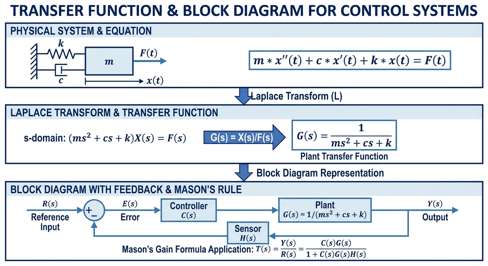
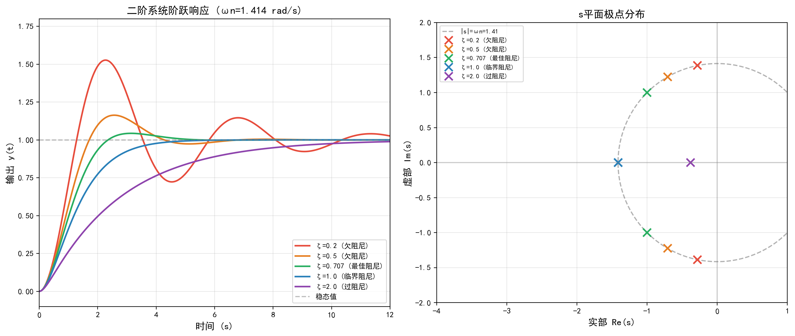

### 引言

自动控制原理与电力系统分析是现代工程技术的重要基石，而系统数学模型则是连接物理世界与理论分析的桥梁。本书立足于这两门学科的核心理论，专为考研学子量身打造。对于备考学生而言，系统地掌握数学模型的建立方法、深入理解传递函数的本质，是攻克后续时域分析、频域分析及系统综合设计的先决条件。第一章作为全书的开篇，将从最基础的物理定律出发，带领读者逐步构建动态系统的数学描述。学习本章时，切忌死记硬背公式，而应紧抓"物理模型—数学方程—传递函数"的主线，深刻体会拉普拉斯变换作为数学工具在化简微积分运算中的强大威力。建议读者在阅读过程中，动手复现书中的所有理论推导过程，并结合具体的课后练习，彻底巩固梅森增益公式的应用技巧。

# 第 1 章 系统数学模型与传递函数

## 学习目标

- 掌握物理系统微分方程的建立方法，能够对RLC电路、机电系统、平移与旋转机械系统列写精确的运动方程
- 熟练运用拉普拉斯变换定理，将时域微分方程转化为s域代数方程，掌握零极点分布与系统动态响应之间的内在联系
- 掌握传递函数的严谨定义、推导求法及物理意义，深刻理解系统固有特性不受外部输入影响的本质
- 熟练运用方框图化简的等效变换法则，并能运用梅森增益公式快速求解复杂多回路系统的总传递函数

## 1.1 物理系统的微分方程与时域建模

建立系统数学模型的第一步是根据客观存在的物理定律列写微分方程。不同的物理系统遵循各自领域的自然法则。对于电气系统，主要依据基尔霍夫电压定律（KVL）和基尔霍夫电流定律（KCL）；对于机械系统，依据牛顿第二运动定律（平移系统）和达朗贝尔原理（旋转系统）；对于热力学和流体系统，则依据能量守恒与质量守恒定律。

### 1.1.1 机械系统的微分方程建立

在机械平移系统中，基本的理想元件包括质量块（代表惯性）、弹簧（代表弹性或储能）和阻尼器（代表能量耗散）。设质量块的质量为 $m$，阻尼器的粘性摩擦系数为 $f$，弹簧的刚度系数为 $k$。当系统受到外力 $u(t)$ 作用时，产生位移 $x(t)$。根据牛顿第二定律，质量块所受合力等于其质量与加速度的乘积：

$$
\sum F = m \frac{d^2 x(t)}{dt^2}
$$

质量块受到的力包括：外部输入力 $u(t)$（方向与位移方向相同）、弹簧的弹性恢复力 $F_k(t) = k \cdot x(t)$（方向与位移方向相反）、阻尼器的粘性摩擦力 $F_f(t) = f \cdot dx(t)/dt$（方向与运动速度方向相反）。代入合力公式，得到该机械平移系统的运动微分方程：

$$
m \frac{d^2 x(t)}{dt^2} + f \frac{dx(t)}{dt} + k x(t) = u(t) \tag{1.1}
$$

### 1.1.2 电气系统的微分方程建立

电气系统中最常见的二阶模型是RLC串联电路。设电感为 $L$，电阻为 $R$，电容为 $C$。电路的输入为外加电源电压 $u_i(t)$，选取电容两端的电压 $u_C(t)$ 作为系统的输出变量。根据KVL，回路中各元件的电压降之和等于外加电压：

$$
u_L(t) + u_R(t) + u_C(t) = u_i(t)
$$

已知流过串联回路的电流 $i(t)$ 与电容电压的关系为 $i(t) = C \, du_C(t)/dt$，电感两端电压为 $u_L(t) = LC \, d^2 u_C(t)/dt^2$，电阻两端电压为 $u_R(t) = RC \, du_C(t)/dt$。代入KVL方程，得到RLC串联电路的微分方程：

$$
LC \frac{d^2 u_C(t)}{dt^2} + RC \frac{du_C(t)}{dt} + u_C(t) = u_i(t) \tag{1.2}
$$

对比式(1.1)与式(1.2)可以发现，机械系统与电气系统在数学模型上具有完全相同的形式，这就是著名的"相似系统"理论（或称力-电压类比）。通过这种类比，研究人员可以利用电气网络的分析方法来研究复杂的机械振动问题。

## 1.2 拉普拉斯变换与传递函数理论

### 1.2.1 拉普拉斯变换基础

求解高阶常系数线性微分方程在时域中十分繁琐。拉普拉斯变换提供了一种将时域微积分运算转化为复频域（s域）代数运算的强大工具。函数 $f(t)$ 的拉氏变换定义为：

$$
F(s) = \mathcal{L}[f(t)] = \int_{0}^{\infty} f(t) e^{-st} dt
$$

拉普拉斯变换的核心性质包括：

- **微分定理**：$\mathcal{L}[f'(t)] = sF(s) - f(0)$，$\mathcal{L}[f''(t)] = s^2F(s) - sf(0) - f'(0)$。若初始条件为零，则每次求导对应于在复频域乘以一个 $s$。
- **积分定理**：$\mathcal{L}[\int f(\tau)d\tau] = F(s)/s$。若初始条件为零，每次积分对应于在复频域除以 $s$。
- **延迟定理**：$\mathcal{L}[f(t-\tau)] = e^{-\tau s}F(s)$，用于处理含纯滞后环节的系统。
- **初值定理**：$\lim_{t\to 0} f(t) = \lim_{s\to \infty} sF(s)$。
- **终值定理**：$\lim_{t\to \infty} f(t) = \lim_{s\to 0} sF(s)$（前提是极点全部位于s左半平面或原点处只有单极点）。

### 1.2.2 传递函数的严谨定义与推导

传递函数是经典控制理论的基石。对于线性定常系统，其传递函数 $G(s)$ 定义为在**零初始条件**下，系统输出量拉氏变换 $C(s)$ 与输入量拉氏变换 $R(s)$ 之比：

$$
G(s) = \frac{C(s)}{R(s)}
$$

以RLC电路方程（式1.2）为例，假定系统初始静止（即 $u_C(0)=0$, $u'_C(0)=0$），对方程两端取拉氏变换：

$$
(LCs^2 + RCs + 1)U_C(s) = U_i(s)
$$

整理得到该系统的传递函数，并化为标准二阶系统形式：

$$
G(s) = \frac{U_C(s)}{U_i(s)} = \frac{1}{LCs^2 + RCs + 1} = \frac{\omega_n^2}{s^2 + 2\zeta\omega_n s + \omega_n^2} \tag{1.3}
$$

其中 $\omega_n = 1/\sqrt{LC}$ 为无阻尼自然振荡频率，表示系统内部储能元件进行能量交换的基础频率；$\zeta = R/(2\sqrt{L/C})$ 为阻尼比，反映了系统中耗能元件（电阻）对振荡的抑制程度。

传递函数的基本特性：(1) 仅取决于系统自身的结构和参数，与外部输入信号的形式和幅值无关；(2) 分母多项式的根为系统的**极点**，决定了系统自由响应的模态；(3) 分子多项式的根为系统的**零点**；(4) 所有极点均严格位于s平面左半平面是系统渐近稳定的充要条件。

### 1.2.3 标准二阶系统超调量公式推导

在考研复习中，二阶系统阶跃响应的性能指标计算是重中之重。下面详细推导欠阻尼状态（$0 < \zeta < 1$）下的最大超调量 $\sigma\%$ 公式。

给定单位阶跃输入 $R(s) = 1/s$，系统输出为：

$$
C(s) = G(s)R(s) = \frac{\omega_n^2}{s(s^2 + 2\zeta\omega_n s + \omega_n^2)}
$$

将其进行部分分式展开并求逆拉氏变换，可得时域响应表达式：

$$
c(t) = 1 - \frac{e^{-\zeta\omega_n t}}{\sqrt{1-\zeta^2}} \sin(\omega_d t + \beta) \tag{1.4}
$$

其中，阻尼自然频率 $\omega_d = \omega_n\sqrt{1-\zeta^2}$，阻尼角 $\beta = \arccos\zeta$。为了求出最大超调量，对 $c(t)$ 求导并令其为零：

$$
\frac{dc(t)}{dt} = \frac{\omega_n}{\sqrt{1-\zeta^2}} e^{-\zeta\omega_n t} \sin(\omega_d t) = 0
$$

解得 $\omega_d t = n\pi$（$n=1,2,3,\dots$）。当 $n=1$ 时对应第一个峰值时间：

$$
t_p = \frac{\pi}{\omega_d} = \frac{\pi}{\omega_n\sqrt{1-\zeta^2}} \tag{1.5}
$$

将 $t_p$ 代入 $c(t)$ 表达式，计算最大输出值：

$$
c(t_p) = 1 + e^{-\pi\zeta/\sqrt{1-\zeta^2}}
$$

根据超调量的定义 $\sigma\% = [c(t_p) - c(\infty)]/c(\infty) \times 100\%$，稳态值 $c(\infty) = 1$，则得到经典结论：

$$
\sigma\% = e^{-\pi\zeta/\sqrt{1-\zeta^2}} \times 100\% \tag{1.6}
$$

该推导过程展示了极点位置（由 $\zeta$ 决定）如何直接决定时域性能指标，考生必须熟练掌握这一关联。

## 1.3 方框图化简与梅森增益公式

实际工程系统通常由多个子系统交织而成，方框图和信号流图是描述这种复杂互连关系的图形化工具。

### 1.3.1 方框图的等效变换

方框图包含四个基本元素：信号线、分支点（引出点）、相加点（比较点）和方框（传递函数）。等效变换的原则是变换前后输入信号与输出信号之间的数学关系保持完全一致。三条基本规则：

1. **串联规则**：多个方框依次串联，总传递函数等于各方框传递函数的乘积，即 $G_{eq}(s) = G_1(s)G_2(s)\cdots G_n(s)$。
2. **并联规则**：多个方框并联连接且末端相加，总传递函数等于各方框传递函数的代数和，即 $G_{eq}(s) = \pm G_1(s) \pm G_2(s) \cdots$。
3. **反馈规则**：对于由前向通路 $G(s)$ 和反馈通路 $H(s)$ 组成的闭环系统，负反馈闭环传递函数为：

$$
\Phi(s) = \frac{G(s)}{1 + G(s)H(s)} \tag{1.7}
$$

当遇到相交的反馈环时，需要利用引出点或比较点的移动法则将方框图解耦。引出点向前移动（逆信号流方向）需除以越过的方框传递函数，向后移动需乘以越过的方框传递函数；比较点的移动规则与此恰好相反。

### 1.3.2 梅森增益公式应用步骤

对于包含多重交叉反馈的复杂系统，梅森增益公式提供了一种无需改变图形拓扑即可直接求解传递函数的代数方法：

$$
T = \frac{\sum_{k} P_k \Delta_k}{\Delta} \tag{1.8}
$$

应用该公式的具体步骤如下：

1. **识别前向通路**：从输入节点到输出节点，信号按箭头方向穿过，且不重复经过任何节点的路径。记第 $k$ 条前向通路的增益为 $P_k$。
2. **识别所有独立回路**：信号从某节点出发，沿箭头方向闭合且不重复经过其他节点的路径。记其增益为 $L_i$。
3. **寻找互不接触的回路**：若两个或多个回路没有共同的节点，则它们互不接触。计算两两不接触回路增益乘积之和 $\sum L_i L_j$，三三不接触回路增益乘积之和 $\sum L_i L_j L_k$ 等。
4. **计算特征式**：$\Delta = 1 - \sum_{i} L_i + \sum_{i,j} L_i L_j - \sum_{i,j,k} L_i L_j L_k + \cdots$
5. **计算余因子 $\Delta_k$**：对于每一条前向通路，将系统中与其接触的所有回路剔除后，利用剩余部分重新计算特征式，即为该前向通路的余因子。若所有回路均与该前向通路接触，则 $\Delta_k = 1$。
6. **代入公式求解**：将上述计算结果代入式(1.8)即可获得总传递函数。

## 1.4 典型考研例题详解

**【例题1】梅森增益公式的综合应用**

已知某反馈控制系统的信号流图包含如下路径信息：输入节点为 $R(s)$，输出节点为 $C(s)$。存在两条前向通路：第一条通路经过节点 $1 \to 2 \to 3 \to 4 \to 5$，各级增益依次为 $G_1, G_2, G_3, G_4$，即 $P_1 = G_1 G_2 G_3 G_4$；第二条通路直接从节点 $2$ 跳跃至节点 $4$，旁路增益为 $G_5$，因此 $P_2 = G_1 G_5 G_4$。系统存在三个反馈回路：$L_1 = -G_2 H_1$（节点3到节点2的局部反馈），$L_2 = -G_3 H_2$（节点4到节点3的局部反馈），$L_3 = -(G_1 G_2 G_3 G_4 + G_1 G_5 G_4)$（全局主反馈）。求闭环传递函数 $\Phi(s) = C(s)/R(s)$。

**【详细解答】**

**步骤一**：前向通路共2条，$P_1 = G_1 G_2 G_3 G_4$，$P_2 = G_1 G_5 G_4$。

**步骤二**：系统包含3个回路，$L_1 = -G_2 H_1$，$L_2 = -G_3 H_2$，$L_3 = -G_1 G_2 G_3 G_4 - G_1 G_5 G_4$。

**步骤三**：判断互不接触的回路。$L_1$ 覆盖节点2、3；$L_2$ 覆盖节点3、4；$L_3$ 覆盖所有节点。$L_1$ 和 $L_2$ 共有节点3，发生接触。$L_3$ 与所有回路接触。因此本系统**不存在**互不接触的回路。

**步骤四**：计算系统特征式 $\Delta = 1 - (L_1 + L_2 + L_3) = 1 + G_2 H_1 + G_3 H_2 + G_1 G_2 G_3 G_4 + G_1 G_5 G_4$。

**步骤五**：计算余因子。对于 $P_1$（穿过所有节点），所有回路均与其接触，故 $\Delta_1 = 1$。对于 $P_2$（经过节点1,2,4,5），所有回路均与其接触，故 $\Delta_2 = 1$。

**步骤六**：代入公式得总传递函数：

$$
\Phi(s) = \frac{P_1 \Delta_1 + P_2 \Delta_2}{\Delta} = \frac{G_1 G_2 G_3 G_4 + G_1 G_5 G_4}{1 + G_2 H_1 + G_3 H_2 + G_1 G_2 G_3 G_4 + G_1 G_5 G_4}
$$

---

**【例题2】机电系统的数学建模与传递函数推导**

一台电枢控制的直流电动机，已知电枢电阻为 $R_a$，电枢电感为 $L_a$，转子及负载的折算转动惯量为 $J$，粘性摩擦系数为 $f$，电磁转矩常数为 $K_t$，反电动势常数为 $K_e$。输入为电枢电压 $u_a(t)$，输出为转轴角度 $\theta(t)$。求传递函数 $G(s) = \Theta(s)/U_a(s)$。

**【详细解答】**

**步骤一：列写时域微分方程组**

1. 电枢回路方程（KVL）：$u_a(t) = R_a i_a(t) + L_a \, di_a(t)/dt + e_b(t)$
2. 反电动势方程：$e_b(t) = K_e \, d\theta(t)/dt$
3. 电磁转矩方程：$T_m(t) = K_t i_a(t)$
4. 转子机械运动方程：$T_m(t) = J \, d^2\theta(t)/dt^2 + f \, d\theta(t)/dt$

**步骤二：拉普拉斯变换**（零初始条件）

$$
U_a(s) = (R_a + L_a s) I_a(s) + K_e s \Theta(s)
$$

$$
K_t I_a(s) = (J s^2 + f s) \Theta(s)
$$

**步骤三：消去中间变量**

由力学方程得 $I_a(s) = (J s^2 + f s)\Theta(s) / K_t$，代入电气方程：

$$
U_a(s) = (R_a + L_a s) \frac{(J s + f)s}{K_t} \Theta(s) + K_e s \Theta(s)
$$

整理得到最终传递函数：

$$
G(s) = \frac{\Theta(s)}{U_a(s)} = \frac{K_t}{s [ (L_a s + R_a)(J s + f) + K_t K_e ]}
$$

分母中包含一个位于坐标原点的独立极点 $s=0$，说明直流电动机从电压输入到角度输出是一个典型的 I 型系统。此类机电建模推导在历年考研真题的综合大题中频繁出现。

## 1.5 仿真案例

本章提供Python仿真脚本 `assets/ch01/ch01_transfer_function.py`，用于演示传递函数构建、阶跃响应分析和梅森公式验证。

**案例参数**：RLC串联电路，$R=2\,\Omega$，$L=1\,\text{H}$，$C=0.5\,\text{F}$。

计算得自然频率 $\omega_n = 1/\sqrt{1.0 \times 0.5} = 1.4142\,\text{rad/s}$，阻尼比 $\zeta = 2/(2\sqrt{1.0/0.5}) = 0.7071$，系统极点为 $s_{1,2} = -1 \pm j1$。

**阶跃响应性能指标：**

| 指标 | 数值 | 理论公式印证 |
|:-----|:-----|:-------------|
| 稳态值 | 1.0000 | 终值定理求取 |
| 超调量 | 4.32% | $\sigma\% = e^{-\pi \times 0.707 / \sqrt{1-0.707^2}}$ |
| 峰值时间 | 3.1503 s | $t_p = \pi / (\omega_n \sqrt{1-\zeta^2})$ |
| 调节时间 (2%) | 4.2084 s | $t_s \approx 4 / (\zeta \omega_n)$ |

**梅森增益公式验证**（三级串联系统，$G_1=2, G_2=3, G_3=4$，局部反馈 $H_1=0.5$，总反馈 $H_2=0.1$）：

| 方法 | 闭环增益 |
|:-----|:---------|
| 方框图代数法 | 4.8980 |
| Mason增益公式 | 4.8980 |
| 计算误差 | 8.88e-16 |

两种方法的结果在数值精度范围内完全一致，验证了梅森公式的正确性。

## 1.6 Python代码解读与手算验证

仿真脚本 `ch01_transfer_function.py` 按"参数建模 - 动态响应 - 梅森公式验证 - 可视化"四个模块组织。

**传递函数构建**：代码先从物理参数计算 $\omega_n$ 和 $\zeta$，然后用 `control` 库的 `ct.tf([wn**2], [1, 2*zeta*wn, wn**2])` 直接构建标准二阶传递函数对象。这种写法将物理参数与控制标准型直接对接，便于后续做阻尼比参数扫描。

**极点求解与响应分析**：通过 `np.roots(den)` 求解特征多项式的根得到极点位置，与手算结果 $s=-1\pm j$ 一致。`ct.step_response()` 函数返回时间序列和输出序列，用 `np.max`、`np.argmax`、`np.where` 提取超调量、峰值时间和调节时间。

**梅森公式数值验证**：代码同时实现方框图代数法（先算内环等效 $G_2/(1+G_2 H_1)$，再求总闭环增益）和梅森公式法（计算前向通路增益 $P_1=24$、回路增益 $L_1=-1.5$、$L_2=-2.4$、特征式 $\Delta=4.9$），两者差值打印为误差，结果在机器精度量级。

**交叉验证方法**：按脚本参数手算 $\omega_n = 1/\sqrt{0.5} = 1.4142$，$\zeta = 2/(2\sqrt{2}) = 0.7071$，传函化为 $G(s) = 2/(s^2+2s+2)$。超调量理论值 $e^{-\pi\times0.707/0.707} \approx 4.3\%$，峰值时间 $\pi/\omega_d \approx 3.14$ s，调节时间 $4/(\zeta\omega_n) \approx 4.0$ s，均与程序输出吻合。建议考生在备考阶段养成"手算+代码双重验证"的习惯，建立对数值结果的直觉。

## 1.7 结果分析

仿真结果明确表明，当 $\zeta = 0.707$ 时，RLC电路阶跃响应仅产生了 4.32% 的超调量，这正是工程实践中广泛选用的"最佳阻尼比"基准值。从极点分布图可以直观地观察到，随着阻尼比逐渐减小，一对共轭复数极点不断向虚轴靠近，系统的振荡倾向加剧，超调量显著增大；当阻尼比增大到1以上时，极点退化为两个不等的负实数极点，响应不再振荡但达到稳态的时间变长。

不同阻尼比下，闭环极点在s平面上的分布呈现清晰的几何规律：所有欠阻尼状态下的极点分布于以 $\omega_n$ 为半径的圆周上，且极点连线到负实轴的夹角 $\beta = \arccos\zeta$。掌握这一几何关系，是快速定性评估二阶系统动态特性的有效途径。梅森公式与方框图化简法的等价性在数值实验中得到了严格验证，两种方法的误差仅处于双精度浮点数的底线限制（$10^{-16}$量级），说明在解答考研计算题时，梅森公式不但速度上占优，也是验证常规化简结果的辅助手段。

## 1.8 考研备考要点

1. **经典机电系统耦合建模**：除电枢控制直流电机外，历年试卷中还频繁考察带齿轮系负载的减速传动模型、电液混合控制系统。破局关键在于精准掌握转矩平衡方程中的"负载折算"法则。
2. **多源干扰下的闭环传递函数**：考研常给出包含参考输入 $R(s)$ 和扰动输入 $N(s)$ 的复杂信号流图。求解 $C(s)/N(s)$ 时应将 $R(s) = 0$。系统总特征式 $\Delta$ 对同一结构的任何输入输出组合恒定不变，需要重新推导的仅是前向通路增益 $P_k$ 及余因子 $\Delta_k$。
3. **性能公式记忆**：标准二阶系统的参数化形式、超调量公式 $\sigma\% = e^{-\pi\zeta/\sqrt{1-\zeta^2}} \times 100\%$ 以及梅森公式是必考内容，务必做到默写无误。
4. **终值定理使用陷阱**：终值定理 $\lim_{t\to\infty} f(t) = \lim_{s\to 0} sF(s)$ 的适用前提是 $sF(s)$ 的所有极点必须严格位于s左半平面。若系统不稳定，强行代入将得到错误结论。出题人喜欢在填空题或判断题中设置这类陷阱。
5. **方框图化简技巧**：遇到多回路系统时，优先识别不接触回路对，使用梅森公式往往比逐步化简更快、更不易出错。
6. **物理建模中的力学类比**：列微分方程时注意力-电压类比（力-电压、质量-电感、弹簧-电容），掌握机电类比可以加速建模过程。

## 1.9 本章小结

本章系统梳理了控制理论中建立数学模型的核心方法论。首先讲解了如何依据基础物理定律规范列写机械装置和电气网络的时域微分方程组。随后引入了拉普拉斯变换，将高阶微分方程转化为复数代数多项式运算，由此严谨地引出了传递函数这一核心概念。针对标准二阶系统进行了深度推导，建立了"极点分布"与"时域响应特征"之间的直接映射关系。最后，针对复杂多环路系统，重点探讨了方框图等效化简原则，并详细演示了梅森增益公式的应用步骤。掌握本章全部内容，是攻克后续各章的坚实基础。

## 思考与练习

**1.** 请阐述传递函数在控制理论中的物理意义。说明为什么传递函数不能反映系统初始状态对输出动态响应的影响？它能否完全代替微分方程描述一个非线性系统？

**2.** 一个由两个串联质量块、弹簧与阻尼器组成的平移型机械系统：外力 $F(t)$ 作用于 $m_1$，$m_1$ 与墙壁之间有弹簧 $k_1$ 和阻尼器 $f_1$ 并联，$m_1$ 与 $m_2$ 之间有弹簧 $k_2$ 相连，$m_2$ 与地面之间有摩擦系数 $f_2$。以 $x_2(t)$ 为输出，列写联立微分方程组并求传递函数 $X_2(s)/F(s)$。

**3.** 某系统信号流图有两条前向通路 $P_1 = G_1 G_2$、$P_2 = G_3$，三个回路 $L_1 = -G_1 H_1$、$L_2 = -G_2 H_2$、$L_3 = G_4$。其中 $L_1$ 与 $L_2$ 互不接触，$L_3$ 与所有回路和前向通路均接触。求系统总特征式 $\Delta$ 和闭环传递函数。

**4.** 给定开环传递函数 $G(s) = K/[s(s+a)]$，单位负反馈。(1) 求闭环传递函数，写出 $\omega_n$ 和 $\zeta$ 与参数 $K$、$a$ 的关系；(2) 若要求超调量为 16.3%、峰值时间为 1 s，求 $K$ 和 $a$ 的值。（提示：$\sigma\% = 16.3\%$ 对应 $\zeta \approx 0.5$）

**5.** 已知某二阶系统 $G(s) = 25/(s^2 + 6s + 25)$。(1) 直接写出 $\omega_n$ 和 $\zeta$；(2) 在s平面上标出极点位置；(3) 若将分母改为 $s^2 + 10s + 25$，定性描述阶跃响应将发生怎样的变化？

---

**拓展视野**：传递函数方法是分析一切线性时不变系统的统一语言。在水利工程中，渠道水位对闸门开度的响应、管道压力对泵速的响应，都可以用传递函数精确描述。掌握本章内容是理解任何工程领域控制系统设计的数学基础。

## 参考文献

[1] 胡寿松. 自动控制原理 (第七版) [M]. 北京: 科学出版社, 2019.

[2] Ogata, K. Modern Control Engineering (5th Edition) [M]. Upper Saddle River: Prentice Hall, 2010.

[3] 卢京潮. 自动控制原理 [M]. 西安: 西北工业大学出版社, 2018.
