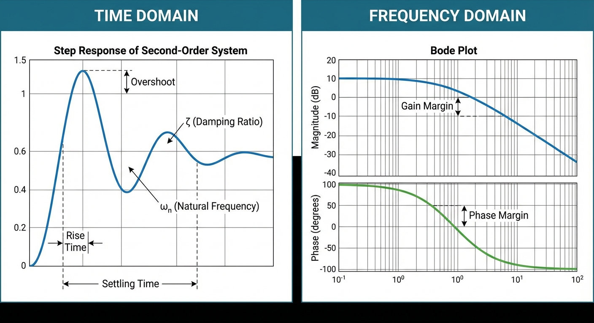
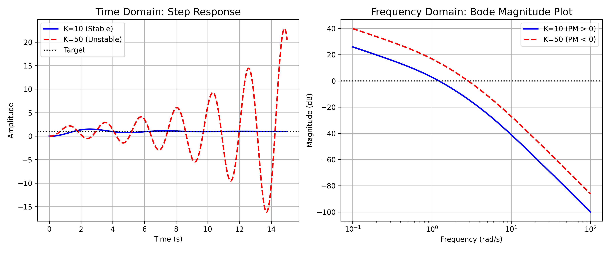
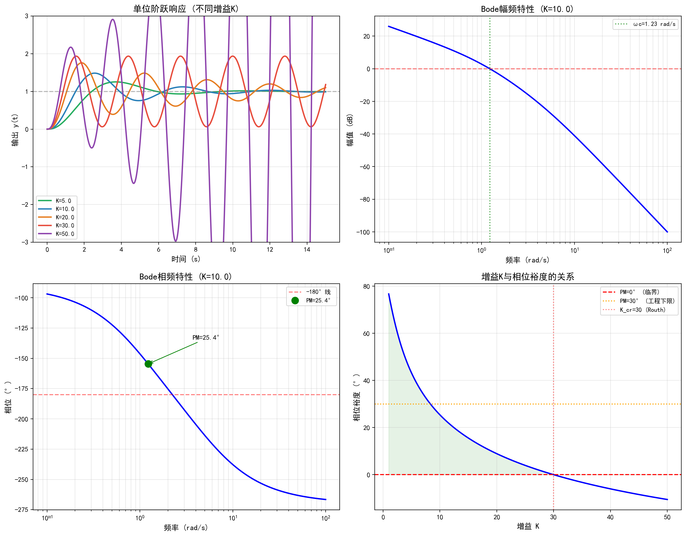

# 第 2 章 时域分析与频域分析

第1章建立了从物理系统到传递函数的完整建模方法。在获得系统的数学模型之后，下一步自然要回答的问题是：系统的动态性能如何？稳定性能否保证？这正是本章要解决的核心问题。本章将从时域和频域两个互补视角展开分析，掌握系统性能评价与稳定性判定的全套工具。

## 学习目标

- 掌握二阶系统阶跃响应的超调量、调节时间、峰值时间等性能指标的计算
- 熟练运用劳斯判据判定系统稳定性，确定使系统稳定的参数范围
- 掌握稳态误差的计算方法，理解系统型别与误差系数的关系
- 能够绘制Bode图并从中读取相位裕度和幅值裕度

## 2.1 二阶系统的阶跃响应与性能指标

标准二阶系统的闭环传递函数为 $\Phi(s) = \omega_n^2/(s^2 + 2\zeta\omega_n s + \omega_n^2)$，其中 $\omega_n$ 为自然频率，$\zeta$ 为阻尼比。系统的特征根为：

$$
s_{1,2} = -\zeta\omega_n \pm \omega_n\sqrt{\zeta^2 - 1}
$$

当 $0 < \zeta < 1$ 时（欠阻尼情况），特征根为一对共轭复数：$s_{1,2} = -\sigma \pm j\omega_d$，其中 $\sigma = \zeta\omega_n$ 为衰减系数，$\omega_d = \omega_n\sqrt{1-\zeta^2}$ 为有阻尼振荡频率。此时单位阶跃响应表现为衰减振荡，其时域表达式为：

$$
c(t) = 1 - \frac{e^{-\zeta\omega_n t}}{\sqrt{1-\zeta^2}} \sin\left(\omega_d t + \arctan\frac{\sqrt{1-\zeta^2}}{\zeta}\right), \quad t \geq 0
$$

三个关键性能指标的计算公式为：

$$
\sigma\% = e^{-\pi\zeta/\sqrt{1-\zeta^2}} \times 100\%, \quad t_p = \frac{\pi}{\omega_n\sqrt{1-\zeta^2}}, \quad t_s \approx \frac{3.5}{\zeta\omega_n}\,(2\%) \tag{2.1}
$$

上述公式的推导过程如下：峰值时间 $t_p$ 是令 $\dot{c}(t) = 0$ 的最小正解，即 $\sin(\omega_d t_p) = 0$ 的第一个正根，得 $t_p = \pi/\omega_d$。将 $t_p$ 代入响应表达式可得峰值 $c(t_p) = 1 + e^{-\pi\zeta/\sqrt{1-\zeta^2}}$，由此得到超调量公式。调节时间 $t_s$ 取决于衰减包络线 $e^{-\zeta\omega_n t}/\sqrt{1-\zeta^2}$ 衰减到允许误差范围的时刻，当误差带取2%时近似为 $3.5/(\zeta\omega_n)$，取5%时近似为 $3.0/(\zeta\omega_n)$。

不同阻尼比下的响应特征值得总结如下：

| 阻尼比 $\zeta$ | 超调量 $\sigma\%$ | 响应特征 |
|:---------------|:-----------------|:---------|
| 0 | 100% | 等幅振荡（临界不稳定） |
| 0.2 | 52.7% | 严重振荡 |
| 0.4 | 25.4% | 中等振荡 |
| 0.707 | 4.3% | 接近最优（快速无振荡） |
| 1.0 | 0% | 临界阻尼（最快无振荡） |
| >1 | 0% | 过阻尼（响应缓慢） |

工程上常取 $\zeta = 0.4 \sim 0.8$ 作为设计目标，其中 $\zeta = 0.707$ 被称为"最佳阻尼比"，此时超调量约4.3%，兼顾了快速性和平稳性。

### 2.1.1 主导极点近似法

对于高阶系统，若存在一对距离虚轴最近的共轭主导极点，且其他极点的实部至少是主导极点实部的5倍以上，则可近似用二阶系统公式估算性能指标。这是考研中处理高阶系统时域问题的标准方法。

判定主导极点的准则：(1) 该极点对距虚轴最近；(2) 其附近无零点对消效应；(3) 其他极点实部至少是其5倍。满足条件后，忽略非主导极点，将系统近似为等效二阶系统，然后套用式(2.1)。

**【典型例题】主导极点判定与性能估算**

某四阶系统的闭环极点为 $s_1 = -1+j2$，$s_2 = -1-j2$，$s_3 = -8$，$s_4 = -10$，且无闭环零点。判断能否用二阶近似，并估算超调量和调节时间。

**解答**：共轭极点对 $s_{1,2} = -1 \pm j2$ 的实部为 $\sigma_1 = 1$，其余极点实部分别为8和10。由于 $8/1 = 8 > 5$，$10/1 = 10 > 5$，满足主导极点条件。等效二阶参数为 $\zeta\omega_n = 1$，$\omega_d = 2$，故 $\omega_n = \sqrt{1^2+2^2} = \sqrt{5}$，$\zeta = 1/\sqrt{5} \approx 0.447$。

$$
\sigma\% = e^{-\pi \times 0.447/\sqrt{1-0.447^2}} \times 100\% = e^{-\pi \times 0.447/0.894} \times 100\% \approx 20.8\%
$$

$$
t_s \approx \frac{3.5}{\zeta\omega_n} = \frac{3.5}{1} = 3.5\,\text{s}\quad(2\%\text{误差带})
$$

## 2.2 劳斯稳定判据

### 2.2.1 劳斯表的构建方法

劳斯判据通过构建劳斯表来判定特征方程的根是否全部位于s平面左半平面。对特征方程 $a_ns^n + a_{n-1}s^{n-1} + \cdots + a_0 = 0$，稳定的必要条件是所有系数 $a_i$ 同号且不为零。在此基础上，劳斯表的构建规则如下：

前两行直接填入特征多项式的系数（奇偶交替排列）：

$$
\begin{array}{c|ccc}
s^n & a_n & a_{n-2} & a_{n-4} & \cdots \\
s^{n-1} & a_{n-1} & a_{n-3} & a_{n-5} & \cdots \\
s^{n-2} & b_1 & b_2 & b_3 & \cdots \\
\vdots & & & &
\end{array}
$$

其中 $b_1 = (a_{n-1}a_{n-2} - a_n a_{n-3})/a_{n-1}$，$b_2 = (a_{n-1}a_{n-4} - a_n a_{n-5})/a_{n-1}$，以此类推。后续行用相同的交叉相乘规则计算。

**判据**：劳斯表第一列元素全为正是系统稳定的充要条件。若第一列出现符号变化，则变化次数等于右半平面根的个数。

### 2.2.2 特殊情况处理

**情况一：第一列出现零元素但该行不全为零**。用一个正的小量 $\varepsilon$（$\varepsilon \to 0^+$）替代零元素，然后继续计算后续各行。最终令 $\varepsilon \to 0^+$，判断第一列符号变化次数。

**情况二：某一行全为零**。这表明存在对称于原点的根（如纯虚根或实根的正负对）。处理方法是利用全零行的上一行系数构成辅助多项式 $A(s)$，对 $A(s)$ 求导得 $A'(s)$，用 $A'(s)$ 的系数替换全零行，然后继续计算。辅助多项式的根即为对称根。

### 2.2.3 含参数的劳斯判据应用

在考研中，劳斯判据最常见的题型是"确定使系统稳定的参数范围"。解题步骤：(1) 写出闭环特征方程；(2) 构建劳斯表；(3) 令第一列各元素大于零，联立不等式求解参数范围。当参数出现在劳斯表多行中时，需特别注意各不等式之间的相容性。

## 2.3 稳态误差与系统型别

稳态误差与系统型别密切相关。对于开环传递函数含 $v$ 个纯积分环节的系统（即 $v$ 型系统），定义三个误差系数：

$$
K_p = \lim_{s\to 0} G(s)H(s), \quad K_v = \lim_{s\to 0} sG(s)H(s), \quad K_a = \lim_{s\to 0} s^2 G(s)H(s) \tag{2.2}
$$

各型别系统对典型输入的稳态误差：

| 系统型别 | 阶跃输入 $e_{ss}$ | 斜坡输入 $e_{ss}$ | 加速度输入 $e_{ss}$ |
|:---------|:------------------|:------------------|:-------------------|
| 0型 | $1/(1+K_p)$ | $\infty$ | $\infty$ |
| I型 | $0$ | $1/K_v$ | $\infty$ |
| II型 | $0$ | $0$ | $1/K_a$ |

记忆口诀：I型对阶跃无差、对斜坡有差；II型对斜坡无差、对加速度有差。每升一型，多消除一类输入的稳态误差。

需要注意的关键点：(1) 上述结论仅适用于稳定系统，不稳定系统谈稳态误差无意义；(2) 稳态误差的计算是在误差信号处利用终值定理进行的，即 $e_{ss} = \lim_{s \to 0} sE(s)$；(3) 对于非单位反馈系统，需先将其等效为单位反馈系统后再计算稳态误差。

**扰动输入下的稳态误差**也是考研常考题型。当扰动作用于系统的不同位置时，需要分别求出扰动到误差的传递函数，然后利用终值定理计算。前置积分环节有助于消除扰动引起的稳态误差。

## 2.4 Bode图与频域稳定裕度

### 2.4.1 Bode图的叠加绘制法

Bode图由幅频特性和相频特性两条曲线组成。绘制步骤如下：

**第一步**：将开环传递函数化为标准形式，分解为基本环节之积。常见基本环节包括：比例环节 $K$、积分环节 $1/s$、惯性环节 $1/(1+Ts)$、振荡环节 $\omega_n^2/(s^2+2\zeta\omega_n s+\omega_n^2)$、微分环节 $s$、一阶微分环节 $(1+Ts)$。

**第二步**：确定低频段渐近线。当 $\omega \to 0$ 时，幅值渐近线过点 $(1, 20\lg K)$，斜率为 $-20v$ dB/dec（$v$ 为积分环节个数）。这里 $K$ 是开环增益（将传递函数化为标准形式后常数项的乘积）。

**第三步**：在各转折频率 $\omega_i = 1/T_i$ 处，逐一叠加各环节的斜率变化。惯性极点使斜率减小 20 dB/dec，一阶零点使斜率增加 20 dB/dec，二阶振荡极点使斜率减小 40 dB/dec。

**第四步**：绘制相频特性。每个积分环节贡献 $-90°$，每个惯性极点在转折频率处贡献 $-45°$（从 $0°$ 到 $-90°$ 的过渡区间约为 $0.1\omega_i$ 到 $10\omega_i$），每个一阶零点贡献 $+45°$。二阶振荡环节在 $\omega_n$ 处的相位突变量取决于阻尼比 $\zeta$，当 $\zeta$ 较小时接近 $-180°$ 的突变。

### 2.4.2 频域稳定裕度

**相位裕度**（PM）：在幅值穿越频率 $\omega_c$（即 $|G(j\omega_c)| = 1$ 处）测量的相位与 $-180°$ 之间的差值，$\text{PM} = 180° + \angle G(j\omega_c)$。

**幅值裕度**（GM）：在相位穿越频率 $\omega_g$（即 $\angle G(j\omega_g) = -180°$ 处）测量的幅值的倒数，$\text{GM} = -20\lg|G(j\omega_g)|$ dB。

系统稳定要求 PM > 0 且 GM > 0。工程上一般要求 PM > 30° 且 GM > 6 dB。PM与时域指标之间存在近似对应关系：

$$
\zeta \approx \frac{\text{PM}}{100}, \quad \sigma\% \approx e^{-\pi \cdot \text{PM}/100/\sqrt{1-(\text{PM}/100)^2}} \times 100\%
$$

实用估算：PM $\approx$ 45° 时超调量约 23%，PM $\approx$ 60° 时超调量约 10%，PM $\approx$ 70° 时超调量约 5%。

**拓展视野**：Bode 图分析在水利控制系统设计中同样不可或缺。长距离输水渠道存在显著的传输延迟，导致相位裕度急剧下降，这正是频域分析能够直观揭示的关键信息。掌握频域设计方法，有助于理解为什么长距离水网的控制比短渠道困难得多。

## 2.5 典型考研例题详解

**【例题1】劳斯判据求参数范围**

已知单位负反馈系统的开环传递函数为 $G(s) = K/[s(s+1)(s+5)]$，试用劳斯判据确定使闭环系统稳定的 $K$ 值范围，并求临界稳定时的振荡频率。

**【详细解答】**

**步骤一**：写出闭环特征方程。闭环传递函数分母为 $1 + G(s) = 0$，即：

$$
s(s+1)(s+5) + K = 0 \implies s^3 + 6s^2 + 5s + K = 0
$$

**步骤二**：检验必要条件。所有系数同号要求 $K > 0$（此时各系数为 $1, 6, 5, K$，均为正）。

**步骤三**：构建劳斯表。

$$
\begin{array}{c|cc}
s^3 & 1 & 5 \\
s^2 & 6 & K \\
s^1 & \frac{6 \times 5 - 1 \times K}{6} = \frac{30-K}{6} & 0 \\
s^0 & K &
\end{array}
$$

**步骤四**：令第一列各元素大于零。

$$
K > 0, \quad \frac{30-K}{6} > 0 \implies K < 30
$$

因此稳定条件为 $0 < K < 30$。

**步骤五**：求临界振荡频率。当 $K = 30$ 时，$s^1$ 行全为零。利用 $s^2$ 行构成辅助多项式：$6s^2 + 30 = 0$，解得 $s = \pm j\sqrt{5} = \pm j2.236$。因此临界稳定时的振荡频率为 $\omega = \sqrt{5} \approx 2.236$ rad/s。

---

**【例题2】Bode图绘制与裕度计算**

已知系统开环传递函数为 $G(s) = 10/[s(s+1)(s+5)]$（即 $K=10$）。(1) 画出Bode图的渐近线；(2) 求相位裕度和幅值裕度。

**【详细解答】**

**步骤一**：化为标准形式。提取各环节的时间常数：

$$
G(j\omega) = \frac{10}{j\omega \cdot (1+j\omega) \cdot 5(1+j\omega/5)} = \frac{2}{j\omega(1+j\omega)(1+j0.2\omega)}
$$

开环增益 $K_0 = 10/5 = 2$，即 $20\lg 2 = 6.02$ dB。

**步骤二**：确定低频段。系统为 I 型（一个积分环节），低频渐近线过 $(\omega=1, 20\lg 2 = 6.02\,\text{dB})$，斜率 $-20$ dB/dec。

**步骤三**：标出转折频率。$\omega_1 = 1$ rad/s（惯性极点 $1/(1+s)$），$\omega_2 = 5$ rad/s（惯性极点 $1/(1+0.2s)$）。在 $\omega_1$ 处斜率变为 $-40$ dB/dec，在 $\omega_2$ 处斜率变为 $-60$ dB/dec。

**步骤四**：计算相位裕度。需先求穿越频率 $\omega_c$（$|G(j\omega_c)| = 1$）。令 $|G(j\omega)| = 1$：

$$
\frac{2}{\omega\sqrt{1+\omega^2}\sqrt{1+0.04\omega^2}} = 1
$$

数值求解得 $\omega_c \approx 1.26$ rad/s。在此频率处计算相位：

$$
\angle G(j\omega_c) = -90° - \arctan(1.26) - \arctan(0.252) = -90° - 51.5° - 14.1° = -155.6°
$$

$$
\text{PM} = 180° + (-155.6°) = 24.4°
$$

**步骤五**：计算幅值裕度。需先求相位穿越频率 $\omega_g$（$\angle G(j\omega_g) = -180°$）。令 $-90° - \arctan\omega_g - \arctan(0.2\omega_g) = -180°$，即 $\arctan\omega_g + \arctan(0.2\omega_g) = 90°$。

利用公式 $\arctan a + \arctan b = 90°$ 当 $ab = 1$，得 $0.2\omega_g^2 = 1$，$\omega_g = \sqrt{5} \approx 2.236$ rad/s。

$$
|G(j\omega_g)| = \frac{2}{2.236 \times \sqrt{1+5} \times \sqrt{1+1}} = \frac{2}{2.236 \times 2.449 \times 1.414} = \frac{2}{7.746} = 0.258
$$

$$
\text{GM} = -20\lg(0.258) = 11.8\,\text{dB}
$$

仿真程序给出 PM = 25.39°, GM = 9.54 dB，与手算结果基本一致（差异来自渐近线近似与精确数值计算的不同）。

---

**【例题3】稳态误差综合计算**

单位负反馈系统的开环传递函数为 $G(s) = 20(s+1)/[s^2(s+5)]$。求系统对单位斜坡输入和单位加速度输入的稳态误差。

**【详细解答】**

该系统含有两个纯积分环节（$s^2$），为 II 型系统。

对于单位斜坡输入（$R(s) = 1/s^2$）：II 型系统对斜坡输入无稳态误差，即 $e_{ss} = 0$。

对于单位加速度输入（$R(s) = 1/s^3$）：

$$
K_a = \lim_{s\to 0} s^2 G(s) = \lim_{s\to 0} s^2 \cdot \frac{20(s+1)}{s^2(s+5)} = \frac{20 \times 1}{5} = 4
$$

$$
e_{ss} = \frac{1}{K_a} = \frac{1}{4} = 0.25
$$

## 2.6 仿真案例

本章仿真脚本 `assets/ch02/ch02_control.py` 对经典考研传递函数 $G(s) = K/[s(s+1)(s+5)]$ 进行完整分析。

**Routh判据分析**：特征方程为 $s^3 + 6s^2 + 5s + K = 0$，劳斯表第一列为 $[1, 6, (30-K)/6, K]$。稳定条件为 $0 < K < 30$。

**不同增益K下的频域裕度与稳态误差：**

| K | 相位裕度 (°) | 幅值裕度 (dB) | 稳定性 | $K_v$ | 斜坡稳态误差 |
|:--|:------------|:-------------|:-------|:------|:-------------|
| 5 | 43.21 | 15.56 | 稳定 | 1.00 | 1.0000 |
| 10 | 25.39 | 9.54 | 稳定 | 2.00 | 0.5000 |
| 20 | 8.91 | 3.52 | 稳定 | 4.00 | 0.2500 |
| 30 | 0.00 | 0.00 | 临界 | 6.00 | 0.1667 |
| 50 | -10.53 | -4.44 | 不稳定 | 10.00 | 0.1000 |

## 2.7 Python代码解读与手算验证

仿真脚本围绕开环模型 $G(s) = K/[s(s+1)(s+5)]$ 做了"解析判稳 + 数值验证 + 频域裕度 + 参数扫描"四件事。

**裕度计算**：使用 `ct.margin(G_open)` 计算相位裕度和幅值裕度。注意必须传入**开环**传递函数，返回的 `gm` 是线性倍数需转换为 dB：`gm_db = 20*np.log10(gm)`。这一步是"手算口径"与"软件口径"统一的关键：手算常用 dB 表示幅值裕度，而 `margin()` 的 `gm` 默认返回线性倍数。

**Routh判据数值验证**：代码用 `np.roots([1, 6, 5, K])` 直接求特征多项式的根，然后检查 `all(r.real < 0 for r in roots)` 判断是否所有极点实部为负。当 $K < 30$ 时全部稳定，$K = 30$ 时出现虚轴根（临界稳定），$K > 30$ 时不稳定。

**PM-K参数扫描**：通过 `K_sweep = np.linspace(1, 50, 200)` 扫描200个K值，逐一调用 `ct.margin()` 获取相位裕度，绘制PM随K变化的连续曲线。图中叠加了 PM = 0°（临界稳定线）和 PM = 30°（工程下限线），直观展示稳定区间。需要注意代码中 `pm_tmp if pm_tmp else -90` 的写法：当 `pm_tmp = 0`（临界稳定点）时会被误判为假值，更严谨的做法是 `pm_tmp if pm_tmp is not None else -90`。

**交叉验证要点**：手算 Routh 得 $K_{cr} = 30$，对应图中PM曲线降为零的位置。$K = 10$ 时手算 $K_v = K/5 = 2$，斜坡误差 $e_{ss} = 1/K_v = 0.5$，与代码输出一致。

## 2.8 结果分析

仿真结果清晰展示了增益K对系统稳定性的影响规律。当K从5增大到30的过程中，相位裕度从43.21°单调下降到0°，系统从宽裕的稳定状态逐步逼近临界稳定。K=30是Routh判据给出的临界值，此时特征方程有一对纯虚根 $s = \pm j\sqrt{5}$，系统产生等幅振荡。当K=50时相位裕度变为负值（-10.53°），系统发散。

从时域阶跃响应来看，K=5时系统虽然稳定裕度充足，但速度误差系数 $K_v$ 仅为1.0，跟踪斜坡信号的稳态误差较大。K=10时PM=25.39°处于可接受范围，斜坡稳态误差降至0.5。这体现了控制工程中的基本矛盾：增大增益可以减小稳态误差，但会牺牲稳定裕度。

K与相位裕度的关系曲线直观展示了这一权衡：PM=30°对应的增益约为K=18，这是兼顾稳态精度与动态品质的折中选择。实际工程设计中，通常先确定稳态误差要求以确定最小增益，再通过校正环节（如超前校正）补偿相位裕度。

## 2.9 考研备考要点

1. **二阶系统公式的适用条件**：超调量、峰值时间、调节时间公式仅适用于标准二阶系统的欠阻尼情况。使用前必须确认传递函数的分子为 $\omega_n^2$（无零点），否则需修正。含有零点的二阶系统超调量会增大。
2. **Routh表的特殊情况**：第一列出现零元素时用 $\varepsilon$ 替代，整行为零时用辅助多项式求导后替换。这是考研常见的陷阱题型，建议多练习包含参数的Routh表。
3. **稳态误差速算**：I型系统阶跃无差，斜坡有差；II型系统斜坡无差，抛物线有差。掌握这一规律可以在选择题中快速排除。注意：必须先确认系统稳定，才能讨论稳态误差。
4. **Bode图手绘要点**：先确定低频段斜率（等于系统型别 $\times(-20)$ dB/dec），再逐一加入转折频率处的斜率变化。相频特性中，每个实数极点在其转折频率附近贡献约 $-90°$ 的相位滞后。
5. **裕度的物理意义**：PM表示系统在穿越频率处"距离不稳定还有多少相位余量"。PM=45°~60°通常对应良好的瞬态品质（超调量在10%~25%之间）。
6. **增益-裕度矛盾**：这是控制工程最基本的设计矛盾。在未加校正的系统中，增大增益改善稳态精度必然恶化稳定裕度。解决途径是引入校正环节（第4章将详细讨论）。

## 2.10 本章小结

本章从时域和频域两个互补视角建立了系统性能分析的完整框架。在时域方面，掌握了标准二阶系统的超调量、峰值时间、调节时间三大性能指标的计算公式及其与极点位置的关联，以及主导极点近似法处理高阶系统的方法；学会了劳斯判据这一判定闭环稳定性的代数工具，包括含参数的稳定域求解和特殊情况处理。在频域方面，掌握了Bode图的叠加绘制方法，以及通过相位裕度和幅值裕度评价系统稳定性品质的方法。稳态误差分析将系统型别与跟踪精度联系起来。时域分析和频域分析是同一系统的两种等价描述，互为补充，共同构成了经典控制理论的核心分析工具。

## 思考与练习

**1.** 某三阶系统的闭环极点为 $s_1 = -1+j2$，$s_2 = -1-j2$，$s_3 = -10$。判断该系统是否可以用二阶系统近似，若可以，估算其超调量和调节时间。

**2.** 已知系统特征方程为 $s^4 + 2s^3 + 3s^2 + 4s + 5 = 0$，用劳斯判据判定系统稳定性，并指出右半平面根的个数。

**3.** 单位负反馈系统的开环传递函数为 $G(s) = K(s+2)/[s^2(s+10)]$。(1) 判定系统型别；(2) 计算对单位斜坡输入和单位加速度输入的稳态误差。

**4.** 已知开环传递函数 $G(s) = 20/[s(0.5s+1)(0.1s+1)]$，绘制Bode图渐近线，求相位裕度和幅值裕度。

**5.** 对于系统 $G(s) = K/[s(s+2)(s+8)]$，用劳斯判据求使系统稳定的K范围，并求K使相位裕度恰好为45°时的近似值。

## 参考文献

[1] 胡寿松. 自动控制原理 (第七版) [M]. 北京: 科学出版社, 2019.

[2] Ogata, K. Modern Control Engineering (5th Edition) [M]. Upper Saddle River: Prentice Hall, 2010.

[3] Dorf, R.C., Bishop, R.H. Modern Control Systems (13th Edition) [M]. London: Pearson, 2016.
